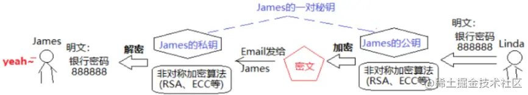
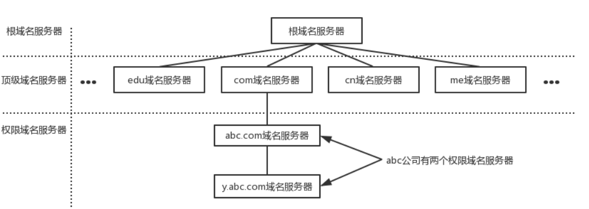
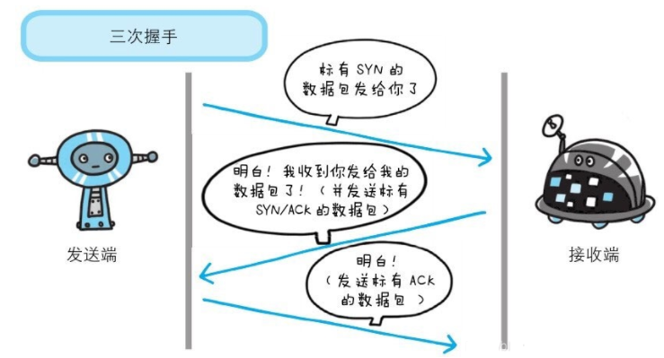
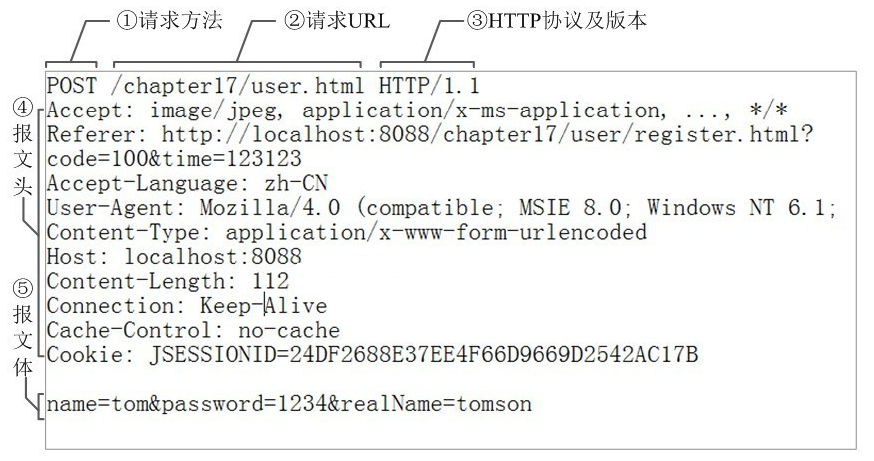

# 计算机网络面试相关

## :star:HTTP 与 HTTPS

### 1.HTTP

HTTP (HyperText Transfer Protocol)，即超文本运输协议，是实现网络通信的一种规范。

在计算机和网络世界有，存在不同的协议，如广播协议、寻址协议、路由协议等等 ...

而`HTTP`是一个传输协议，即将数据由A传到B或将B传输到A，并且 A 与 B 之间能够存放很多第三方。

传输的数据并不是计算机底层中的二进制包，而是完整的、有意义的数据，如 HTML 文件、图片文件、查询结果等超文本，能够被上层应用识别。

在实际应用中，HTTP 常被用于在 Web 浏览器和网站服务器之间传递信息，以明文方式发送内容，不提供任何方式的数据加密。

HTTP 特点如下：

- 支持客户/服务器模式
- 简单快速：客户向服务器请求服务时，只需传送请求方法和路径。由于HTTP协议简单，使得 HTTP 服务器的程序规模小，因而通信速度很快
- 灵活：HTTP 允许传输任意类型的数据对象。正在传输的类型由 Content-Type 加以标记
- 无连接：无连接的含义是限制每次连接只处理一个请求。服务器处理完客户的请求，并收到客户的应答后，即断开连接。采用这种方式可以节省传输时间
- 无状态：HTTP 协议无法根据之前的状态进行本次的请求处理

### 2.HTTPS

上述介绍 HTTP 中，了解到 HTTP 传递信息是以明文的形式发送内容，这并不安全。而 HTTPS 正是为了解决 HTTP 不安全的特性。

为了保证数据能加密传输，让 HTTP 运行在 `SSL/TLS` 协议上，即`HTTPS = HTTP + SSL/TLS`，通过 SSL 证书来验证服务器的身份，并为浏览器和服务器之间的通信进行加密。

SSL(Secure Sockets Layer 安全套接字协议)，TLS（Transport Layer Security，安全传输协议）是为网络通信提供安全及数据完整性的一种安全协议。

SSL 协议位于 TCP/IP 协议与各种应用层协议之间，浏览器和服务器在使用 SSL 建立连接时需要选择一组恰当的加密算法来实现安全通信，为数据通讯提供安全支持。

SSL 的实现这些功能主要依赖于三种手段：

- 对称加密：采用协商的密钥对数据加密
- 非对称加密：实现身份认证和密钥协商
- 摘要算法：验证信息的完整性
- 数字签名：身份验证

### 3.HTTPS原理

- 操作系统内置权威证书认证机构（CA-CertificateAuthority）的机构证书X

**1.服务器A获取认证证书**

- 生成自己的`公钥A`和`私钥A`
- 找认证机构生成`服务器A证书`，并保存在服务器中

证书（SSL）包含信息：

- 服务器的域名，证书有效期，证书颁发机构
- 服务器自己的公钥A等

**2.浏览器请求获取服务器A证书**

- 浏览器使用`机构证书X`对`服务器A证书`进行解密
  - 解密成功：获取服务器公钥A（只要解密成功，就说明是机构认证的）
  - 解密失败：认证失败

**3.浏览器发送会话秘钥给服务器A**

- 使用`对称加密算法`生成`会话秘钥`
- 使用`服务器公钥A`对会话秘钥进行加密生成密文，并发给服务器A

**4.服务器A使用`服务器私钥A`对密文进行解密**

**5.之后浏览器和服务器使用`会话秘钥`对请求和响应报文进行加密**

### 4.两者区别

- HTTPS 是 HTTP 协议的安全版本，HTTP 协议的数据传输是明文的，是不安全的，HTTPS 使用了 SSL/TLS 协议进行了加密处理，相对更安全
- HTTP 和 HTTPS 使用连接方式不同，默认端口也不一样，HTTP 是 80，HTTPS 是 443
- HTTPS 由于需要设计加密以及多次握手，性能方面不如 HTTP
- HTTPS 需要 SSL，SSL 证书需要钱，功能越强大的证书费用越高

## :star:对称加密与非对称加密

### 1.对称加密

特点：

- 加密和解密都使用**相同一个密钥**
- 高效，适用于**大量数据**的加密场景
- 算法公开，完全性取决于密钥大小，但是秘钥越大效率越低

缺点：<strong style="color:#DD5145">算法本身安全，但使用场景不够安全</strong>，因为解密和加密是使用的同一个秘钥。

### 2.非对称加密

使用 **匹配的一对密钥** 来分别进行加密和解密，这两个秘钥是公开密钥（public key，公钥）和私有密钥（private key，私钥）

- 注意：公钥加密的数据只能用对应的私钥解密，同理，私钥加密的数据只能用对应的公钥解密

算法：<strong style="color:#DD5145">RSA</strong>、ECC、Elgamal、背包算法、Rabin、D-H 等

特点：安全性高

缺点：加解密复杂，效率低，耗时较长

用法概要：

- 加密：对数据做加密（公钥加密 -- 私钥解密）
- 签名：证明数据是谁发的（私钥加密 -- 公钥解密）

### 3.非对称加密用法

**准备工作：**

1. 生成一对匹配的 私钥 和 公钥 (ps：公钥其实是根据私钥生成的)
2. 将公钥公布给外界

**公钥加密：** 用来针对互联网上加密数据传递

Linda 用 James 的公钥对数据进行加密，然后发给 James，James 用自己的私钥解密

> 因为一个公钥加密的数据 只有 对应的 私钥才能解密，所以密文很安全
>
> 补充：如果要在网络上相互发送密文，可以让对方也发对方的公钥过来，用对方的公钥来加密

**私钥签名：** 为了将明文公布给别人，同时证明是自己发的；可以防止明文被篡改

**Step 1**：James 用 James 的私钥对明文的 hash 值进行加密，把密文(签名)和明文一起发给 Linda

**Step 2**：Linda 用 James 的公钥进行解密，解密后的明文 hash 值和接收到的明文的 hash 值进行对比，如果一样则是 James 发的

## :star:HTTP1.0 / 1.1 / 2.0 的区别

#### HTTP1.0

`HTTP`协议的第二个版本，第一个在通讯中指定版本号的HTTP协议版本。

`HTTP 1.0` 浏览器与服务器只保持短暂的连接，每次请求都需要与服务器建立一个`TCP`连接。

服务器完成请求处理后立即断开`TCP`连接，服务器不跟踪每个客户也不记录过去的请求。

简单来讲，每次与服务器交互，都需要新开一个连接。

如果需要建立长连接，需要设置一个非标准的Connection字段 `Connection: keep-alive`。

#### HTTP1.1

在`HTTP1.1`中，默认支持长连接（`Connection: keep-alive`），即在一个TCP连接上可以传送多个`HTTP`请求和响应，减少了建立和关闭连接的消耗和延迟。

建立一次连接，多次请求均由这个连接完成

这样，在加载`html`文件的时候，文件中多个请求和响应就可以在一个连接中传输

#### HTTP2.0

而`HTTP2.0`在相比之前版本，性能上有很大的提升，如添加了一个特性：

- 多路复用
- 二进制分帧
- 首部压缩
- 服务器推送

## :star:HTTP 常见的状态码以及适用场景

HTTP状态码（英语：HTTP Status Code），用以表示网页服务器超文本传输协议响应状态的3位数字代码。

### 1.状态码分类

状态码第一位数字决定了不同的响应状态，有如下：

- [1 表示消息（临时响应）](#_1xx)
- [2 表示成功](#_2xx)
- [3 表示重定向](#_3xx)
- [4 表示请求错误](#_4xx)
- [5 表示服务器错误](#_5xx)

#### 1xx

代表请求已被接受，需要继续处理。这类响应是<strong style="color:#DD5145">临时响应</strong>，只包含状态行和某些可选的响应头信息，并以空行结束。

常见的有：

- 100（客户端继续发送请求，这是临时响应）：这个临时响应是用来通知客户端它的部分请求已经被服务器接收，且仍未被拒绝。客户端应当继续发送请求的剩余部分，或者如果请求已经完成，忽略这个响应。服务器必须在请求完成后向客户端发送一个最终响应
- 101：服务器根据客户端的请求切换协议，主要用于 websocket 或 http2 升级

#### 2xx

代表请求已<strong style="color:#DD5145">成功</strong>被服务器接收、理解、并接受。

常见的有：

- 200（成功）：请求已成功，请求所希望的响应头或数据体将随此响应返回
- 201（已创建）：请求成功并且服务器创建了新的资源
- 202（已创建）：服务器已经接收请求，但尚未处理
- 203（非授权信息）：服务器已成功处理请求，但返回的信息可能来自另一来源
- 204（无内容）：服务器成功处理请求，但没有返回任何内容
- 205（重置内容）：服务器成功处理请求，但没有返回任何内容
- 206（部分内容）：服务器成功处理了部分请求

#### 3xx

表示要完成请求，需要进一步操作。 通常，这些状态代码用来<strong style="color:#DD5145">重定向</strong>。

常见的有：

- 300（多种选择）：针对请求，服务器可执行多种操作。 服务器可根据请求者 (user agent) 选择一项操作，或提供操作列表供请求者选择
- 301（永久重定向）：请求的网页已永久移动到新位置。 服务器返回此响应（对 GET 或 HEAD 请求的响应）时，会自动将请求者转到新位置
- 302（临时跳转）： 服务器目前从不同位置的网页响应请求，但请求者应继续使用原有位置来进行以后的请求
- 303（查看其他位置）：请求者应当对不同的位置使用单独的 GET 请求来检索响应时，服务器返回此代码
- 305 （使用代理）： 请求者只能使用代理访问请求的网页。 如果服务器返回此响应，还表示请求者应使用代理
- 307 （临时重定向）： 服务器目前从不同位置的网页响应请求，但请求者应继续使用原有位置来进行以后的请求

#### 4xx

表示<strong style="color:#DD5145">请求错误</strong>，客户端看起来可能发生了错误，妨碍了服务器的处理。

常见的有：

- 400（错误请求）： 服务器不理解请求的语法
- 401（未授权）： 请求要求身份验证。 对于需要登录的网页，服务器可能返回此响应。
- 403（禁止）： 服务器拒绝请求
- 404（未找到）： 服务器找不到请求的网页
- 405（方法禁用）： 禁用请求中指定的方法
- 406（不接受）： 无法使用请求的内容特性响应请求的网页
- 407（需要代理授权）： 此状态代码与 401（未授权）类似，但指定请求者应当授权使用代理
- 408（请求超时）： 服务器等候请求时发生超时

#### 5xx

表示<strong style="color:#DD5145">服务器错误</strong>，服务器在处理请求的过程中有错误或者异常状态发生。

常见的有：

- 500（服务器内部错误）：服务器遇到错误，无法完成请求
- 501（尚未实施）：服务器不具备完成请求的功能。 例如，服务器无法识别请求方法时可能会返回此代码
- 502（错误网关）： 服务器作为网关或代理，从上游服务器收到无效响应
- 503（服务不可用）： 服务器目前无法使用（由于超载或停机维护）
- 504（网关超时）： 服务器作为网关或代理，但是没有及时从上游服务器收到请求
- 505（HTTP 版本不受支持）： 服务器不支持请求中所用的 HTTP 协议版本

### 2.适用场景

下面给出一些状态码的适用场景：

- 100：客户端在发送POST数据给服务器前，征询服务器情况，看服务器是否处理POST的数据，如果不处理，客户端则不上传POST数据，如果处理，则POST上传数据。常用于POST大数据传输
- 206：一般用来做断点续传，或者是视频文件等大文件的加载
- 301：永久重定向会缓存。新域名替换旧域名，旧的域名不再使用时，用户访问旧域名时用301就重定向到新的域名
- 302：临时重定向不会缓存，常用 于未登陆的用户访问用户中心重定向到登录页面
- 304：协商缓存，告诉客户端有缓存，直接使用缓存中的数据，返回页面的只有头部信息，是没有内容部分
- 400：参数有误，请求无法被服务器识别
- 403：告诉客户端进制访问该站点或者资源，如在外网环境下，然后访问只有内网IP才能访问的时候则返回
- 404：服务器找不到资源时，或者服务器拒绝请求又不想说明理由时
- 503：服务器停机维护时，主动用503响应请求或 nginx 设置限速，超过限速，会返回503
- 504：网关超时

## :star:哈希（​Hash）

哈希 (Hash) 或者说散列表，它是一种基础数据结构。Hash 表是一种特殊的数据结构，它同数组、链表以及二叉排序树等相比较有很明显的区别，但它又是是数组和链表的基础上演化而来，既具有数组的有点，又具有链表的有点。

能够快速定位到想要查找的记录，而不是与表中存在的记录的关键字进行比较来进行查找。应用了函数映射的思想将记录的存储位置与记录的关键字关联起来，从而能够很快速地进行查找。

哈希 (Hash) 是密码学的基础，理解哈希是理解**数字签名**和**加密通信**等技术的必要前提。哈希函数，是某一种哈希算法的实现。

### 1.Hash定义

Hash：一般翻译做**散列**，或音译为**哈希**。（Hash = 哈希 = 散列）

<strong style="color:#DD5145">是把任意长度的输入通过哈希算法变换成固定长度的输出</strong>，该输出就是**哈希值**（也称**哈希码**）。

### 2.Hash算法

将任意长度的二进制值串映射为固定长度的二进制值串，这个映射的规则就是哈希算法，而通过原始数据映射之后得到的值就是哈希值。

输出的哈希值的空间通常远小于输入的空间，不同的输入可能会散列成相同的输出，所以不可能从哈希值来确定唯一的输入值。

常见 Hash 算法有 MD5 和 SHA 系列，目前 MD5 和 SHA1 已经被破解，一般推荐使用 SHA2-256 算法。

Hash 函数是把一个大范围映射到一个小范围，目的往往是为了节省空间，使得数据容易保存，另外 Hash 函数也会应用于查找上。

**Hash算法的优点：**

- 可以提高存储空间的利用率
- 可以提高数据的查询效率
- 可以做数字签名来保障数据传递的安全性
- 若两个哈希值相同，两个输入值很可能是相同的，但也可能不同，这种情况称为 **“哈希碰撞”**
- 不可逆性：它是一种单向函数是“非对称”的，一个从明文到密文的不可逆的映射，只有加密过程，没有解密过程
- 抗篡改能力：对于一个数据块，哪怕只改动其一个比特位，其hash值的改动也会非常大

**Hash算法在信息安全方面的应用：**

- `文件校验`

  校验算法有**奇偶校验**和**CRC校验**，但没有抗数据篡改的能力，它们一定程度上能检测并纠正数据传输中的信道误码，但却不能防止对数据的恶意破坏。

  MD5 Hash算法具备 “数字指纹”特性，成为目前应用最广泛的一种文件完整性校验和（Checksum）算法

- `数字签名`

- `鉴权协议`

### 3.Hash函数

哈希算法有很多中实现方式。编程语言中，如果一个函数实现了哈希算法的话，这个函数就是哈希函数。

所以说：哈希函数，是某一种哈希算法的实现。通常有以下几种构造 Hash 函数的方法：

- 直接定址法
- 平方取中法
- 折叠法
- 除留取余法

### 4.Hash表

举例，数据源A经过哈希算法后，得到哈希值B，存储A->B这样对应关系的叫做**哈希表**。

Hash 表的空间如果大于实际存储的记录数据的个数，则造成空间浪费；如果过小，则容易造成冲突。

Hash 表大小确定通常有这两种思路：

- 如果最初知道存储的数据量，则需要根据存储个数 和 关键字的分布特点来确定 Hash 表的大小。
- 不知道最终需要存储的记录个数，需要动态维护Hash表的容量，此时可能需要重新计算 Hash 地址。

**Hash表缺点：**

- 它是基于数组的，数组创建后难于扩展
- 哈希表被基本填满时，性能下降得非常严重

**Hash表的应用场景：**

- `找出两文件找出重复的元素`

- `找出两文件找出出现次数最多的元素`

- `路由算法`

  多线程处理数据的场景下，通常需要将一个数据集分给不同的线程进行处理，同时要保证，相同的元素需要分到相同的处理线程上。这其实这个就是一个很典型的 Hash 值应用场景，对于很多的计算引擎默认都是用 Hash 算法去解决这个问题。因为相同元素的 Hash 值相同，那么我们可以取 Hash 之后进行模运算，运算结果分配到不同的线程。

### 5.Hash冲突解决

- 开放地址法
- 链地址法

[参考文章](https://blog.csdn.net/SeniorShen/article/details/110154638)、[参考文章](https://blog.csdn.net/qq_16570607/article/details/118659466)、[参考文章](https://blog.csdn.net/qq_21137441/article/details/124841407)

## :star:UDP 和 TCP? 区别? 应用场景?

**一、UDP**

UDP（User Datagram Protocol），用户数据包协议，是一个简单的**面向数据报的通信协议**，即对应用层交下来的报文，不合并，不拆分，只是在其上面加上首部后就交给了下面的网络层。

也就是说无论应用层交给`UDP`多长的报文，它统统发送，一次发送一个报文。

而对接收方，接到后直接去除首部，交给上面的应用层就完成任务。

`UDP`报头包括4个字段，每个字段占用2个字节（即16个二进制位），标题短，开销小。

特点如下：

- UDP 不提供复杂的控制机制，利用 IP 提供面向无连接的通信服务
- 传输途中出现丢包，UDP 也不负责重发
- 当包的到达顺序出现乱序时，UDP没有纠正的功能。
- 并且它是将应用程序发来的数据在收到的那一刻，立即按照原样发送到网络上的一种机制。即使是出现网络拥堵的情况，UDP 也无法进行流量控制等避免网络拥塞行为

**二、TCP**

TCP（Transmission Control Protocol），传输控制协议，是一种可靠、**面向字节流的通信协议**，把上面应用层交下来的数据看成无结构的字节流来发送。

可以想象成流水形式的，发送方TCP会将数据放入“蓄水池”（缓存区），等到可以发送的时候就发送，不能发送就等着，TCP会根据当前网络的拥塞状态来确定每个报文段的大小。

`TCP`报文首部有20个字节，额外开销大。

特点如下：

- TCP充分地实现了数据传输时各种控制功能，可以进行丢包时的重发控制，还可以对次序乱掉的分包进行顺序控制。而这些在 UDP 中都没有。
- 此外，TCP 作为一种面向有连接的协议，只有在确认通信对端存在时才会发送数据，从而可以控制通信流量的浪费。
- 根据 TCP 的这些机制，在 IP 这种无连接的网络上也能够实现高可靠性的通信（ 主要通过检验和、序列号、确认应答、重发控制、连接管理以及窗口控制等机制实现）。

**三、区别**

`UDP`与`TCP`两者的都位于传输层，如下图所示：

两者区别如下表所示：

|          | TCP                              | UDP                            |
| -------- | -------------------------------- | ------------------------------ |
| 可靠性   | 可靠                             | 不可靠                         |
| 连接性   | 面向连接                         | 无连接                         |
| 报文     | 面向字节流                       | 面向报文                       |
| 效率     | 传输效率低                       | 传输效率高                     |
| 双共性   | 全双工                           | 一对一、一对多、多对一、多对多 |
| 流量控制 | 滑动窗口                         | 无                             |
| 拥塞控制 | 慢开始、拥塞避免、快重传、快恢复 | 无                             |
| 传输效率 | 慢                               | 快                             |

- TCP 是面向连接的协议，建立连接3次握手、断开连接四次挥手，UDP是面向无连接，数据传输前后不连接连接，发送端只负责将数据发送到网络，接收端从消息队列读取。
- TCP 提供可靠的服务，传输过程采用流量控制、编号与确认、计时器等手段确保数据无差错，不丢失。UDP 则尽可能传递数据，但不保证传递交付给对方。
- TCP 面向字节流，将应用层报文看成一串无结构的字节流，分解为多个TCP报文段传输后，在目的站重新装配。UDP协议面向报文，不拆分应用层报文，只保留报文边界，一次发送一个报文，接收方去除报文首部后，原封不动将报文交给上层应用。
- TCP 只能点对点全双工通信。UDP 支持一对一、一对多、多对一和多对多的交互通信。

两者应用场景如下图：

可以看到，TCP 应用场景适用于对效率要求低，对准确性要求高或者要求有链接的场景，而 UDP 适用场景为对效率要求高，对准确性要求低的场景。

## :star:TCP/IP 网络模型有哪几层？

问大家，为什么要有 TCP/IP 网络模型？

对于同一台设备上的进程间通信，有很多种方式，比如有管道、消息队列、共享内存、信号等方式，而对于不同设备上的进程间通信，就需要网络通信，而设备是多样性的，所以要兼容多种多样的设备，就协商出了一套**通用的网络协议**。

这个网络协议是分层的，每一层都有各自的作用和职责，接下来就根据「 TCP/IP 网络模型 」分别对每一层进行介绍。

- [应用层](#应用层)
- [传输层](#传输层)
- [网络层](#网络层)
- [网络接口层](#网络接口层)
- [总结](#总结)

#### 应用层

最上层的，也是我们能直接接触到的就是**应用层**（*Application Layer*），我们电脑或手机使用的应用软件都是在应用层实现。那么，当两个不同设备的应用需要通信的时候，应用就把应用数据传给下一层，也就是传输层。

所以，应用层只需要专注于为用户提供应用功能，比如 HTTP、FTP、Telnet、DNS、SMTP等。

应用层是不用去关心数据是如何传输的，就类似于，我们寄快递的时候，只需要把包裹交给快递员，由他负责运输快递，我们不需要关心快递是如何被运输的。

而且应用层是工作在操作系统中的用户态，传输层及以下则工作在内核态。

#### 传输层

应用层的数据包会传给传输层，**传输层**（*Transport Layer*）是为应用层提供网络支持的。

在传输层会有两个传输协议，分别是 TCP 和 UDP。

TCP 的全称叫传输控制协议（*Transmission Control Protocol*），大部分应用使用的正是 TCP 传输层协议，比如 HTTP 应用层协议。TCP 相比 UDP 多了很多特性，比如流量控制、超时重传、拥塞控制等，这些都是为了保证数据包能可靠地传输给对方。

UDP 相对来说就很简单，简单到只负责发送数据包，不保证数据包是否能抵达对方，但它实时性相对更好，传输效率也高。当然，UDP 也可以实现可靠传输，把 TCP 的特性在应用层上实现就可以，不过要实现一个商用的可靠 UDP 传输协议，也不是一件简单的事情。

应用需要传输的数据可能会非常大，如果直接传输就不好控制，因此当传输层的数据包大小超过 MSS（TCP 最大报文段长度） ，就要将数据包分块，这样即使中途有一个分块丢失或损坏了，只需要重新发送这一个分块，而不用重新发送整个数据包。在 TCP 协议中，我们把每个分块称为一个 **TCP 段**（*TCP Segment*）。

当设备作为接收方时，传输层则要负责把数据包传给应用，但是一台设备上可能会有很多应用在接收或者传输数据，因此需要用一个编号将应用区分开来，这个编号就是**端口**。

比如 80 端口通常是 Web 服务器用的，22 端口通常是远程登录服务器用的。而对于浏览器（客户端）中的每个标签栏都是一个独立的进程，操作系统会为这些进程分配临时的端口号。

由于传输层的报文中会携带端口号，因此接收方可以识别出该报文是发送给哪个应用。

#### 网络层

传输层可能大家刚接触的时候，会认为它负责将数据从一个设备传输到另一个设备，事实上它并不负责。

实际场景中的网络环节是错综复杂的，中间有各种各样的线路和分叉路口，如果一个设备的数据要传输给另一个设备，就需要在各种各样的路径和节点进行选择，而传输层的设计理念是简单、高效、专注，如果传输层还负责这一块功能就有点违背设计原则了。

也就是说，我们不希望传输层协议处理太多的事情，只需要服务好应用即可，让其作为应用间数据传输的媒介，帮助实现应用到应用的通信，而实际的传输功能就交给下一层，也就是**网络层**（*Internet Layer*）。

网络层最常使用的是 IP 协议（*Internet Protocol*），IP 协议会将传输层的报文作为数据部分，再加上 IP 包头组装成 IP 报文，如果 IP 报文大小超过 MTU（以太网中一般为 1500 字节）就会**再次进行分片**，得到一个即将发送到网络的 IP 报文。

网络层负责将数据从一个设备传输到另一个设备，世界上那么多设备，又该如何找到对方呢？因此，网络层需要有区分设备的编号。

我们一般用 IP 地址给设备进行编号，对于 IPv4 协议， IP 地址共 32 位，分成了四段（比如，192.168.100.1），每段是 8 位。只有一个单纯的 IP 地址虽然做到了区分设备，但是寻址起来就特别麻烦，全世界那么多台设备，难道一个一个去匹配？这显然不科学。

因此，需要将 IP 地址分成两种意义：

- 一个是**网络号**，负责标识该 IP 地址是属于哪个「子网」的；
- 一个是**主机号**，负责标识同一「子网」下的不同主机；

怎么分的呢？这需要配合**子网掩码**才能算出 IP 地址 的网络号和主机号。

举个例子，比如 10.100.122.0/24，后面的`/24`表示就是 `255.255.255.0` 子网掩码，255.255.255.0 二进制是「11111111-11111111-11111111-00000000」，大家数数一共多少个1？不用数了，是 24 个1，为了简化子网掩码的表示，用/24代替255.255.255.0。

知道了子网掩码，该怎么计算出网络地址和主机地址呢？

将 10.100.122.2 和 255.255.255.0 进行**按位与运算**，就可以得到网络号和主机号

大家可以去搜索下子网掩码计算器，自己改变下「掩码位」的数值，就能体会到子网掩码的作用了。

那么在寻址的过程中，先匹配到相同的网络号（表示要找到同一个子网），才会去找对应的主机。

除了寻址能力， IP 协议还有另一个重要的能力就是**路由**。实际场景中，两台设备并不是用一条网线连接起来的，而是通过很多网关、路由器、交换机等众多网络设备连接起来的，那么就会形成很多条网络的路径，因此当数据包到达一个网络节点，就需要通过路由算法决定下一步走哪条路径。

路由器寻址工作中，就是要找到目标地址的子网，找到后进而把数据包转发给对应的网络内。

所以，**IP 协议的寻址作用是告诉我们去往下一个目的地该朝哪个方向走，路由则是根据「下一个目的地」选择路径。寻址更像在导航，路由更像在操作方向盘**。

#### 网络接口层

生成了 IP 头部之后，接下来要交给**网络接口层**（*Link Layer*）在 IP 头部的前面加上 MAC 头部，并封装成数据帧（Data frame）发送到网络上。

IP 头部中的接收方 IP 地址表示网络包的目的地，通过这个地址我们就可以判断要将包发到哪里，但在以太网的世界中，这个思路是行不通的。

什么是以太网呢？电脑上的以太网接口，Wi-Fi接口，以太网交换机、路由器上的千兆，万兆以太网口，还有网线，它们都是以太网的组成部分。以太网就是一种在「局域网」内，把附近的设备连接起来，使它们之间可以进行通讯的技术。

以太网在判断网络包目的地时和 IP 的方式不同，因此必须采用相匹配的方式才能在以太网中将包发往目的地，而 MAC 头部就是干这个用的，所以，在以太网进行通讯要用到 MAC 地址。

MAC 头部是以太网使用的头部，它包含了接收方和发送方的 MAC 地址等信息，我们可以通过 ARP 协议获取对方的 MAC 地址。

所以说，网络接口层主要为网络层提供「链路级别」传输的服务，负责在以太网、WiFi 这样的底层网络上发送原始数据包，工作在网卡这个层次，使用 MAC 地址来标识网络上的设备。

#### 总结

综上所述，TCP/IP 网络通常是由上到下分成 4 层，分别是**应用层，传输层，网络层和网络接口层**。

再给大家贴一下每一层的封装格式：

- 网络接口层的传输单位是帧（frame）
- IP 层的传输单位是包（packet）
- TCP 层的传输单位是段（segment）
- HTTP 的传输单位则是消息或报文（message）

但这些名词并没有什么本质的区分，可以统称为数据包。

## :star:DNS 协议是什么？DNS 查询过程?

### 1.是什么

DNS（Domain Names System）即域名系统，是互联网一项服务，是进行域名和与之相对应的 IP 地址进行转换的服务器。

简单来讲，DNS 相当于一个翻译官，负责将域名翻译成 IP 地址。

- 域名：是由一串用点分隔的名字组成的 Internet 上某一台计算机或计算机组的名称，用于在数据传输时对计算机的定位标识
- IP 地址：一长串能够唯一地标记网络上的计算机的数字

### 2.域名

域名是一个具有层次的结构，从上到下一次为根域名、顶级域名、二级域名、三级域名...

例如`www.xxx.com`，`www`为三级域名、`xxx`为二级域名、`com`为顶级域名。

其中.com是域名后缀，类似的还有.cn（中国域名后缀）、.org（非盈利机构）、.net（网络组织）等等。部分行业还会加上稳定的后缀，比如edu.cn（教育类，xmu.edu.cn厦门大学）、gov.cn（政府单位，mod.gov.cn国防部）等等。

系统为用户做了兼容，域名末尾的根域名`.`一般不需要输入在域名的每一层都会有一个域名服务器，如下图：

除此之外，还有电脑默认的本地域名服务器

### 3.查询方式

DNS 查询的方式有两种：

- **递归查询**：如果 A 请求 B，那么 B 作为请求的接收者一定要给 A 想要的答案。

- **迭代查询**：如果接收者 B 没有请求者 A 所需要的准确内容，接收者 B 将告诉请求者 A，如何去获得这个内容，但是自己并不去发出请求。

### 4.域名缓存

在域名服务器解析的时候，使用缓存保存域名和 IP 地址的映射。

计算机中`DNS`的记录也分成了两种缓存方式：

- 浏览器缓存：浏览器在获取网站域名的实际 IP 地址后会对其进行缓存，减少网络请求的损耗
- 操作系统缓存：操作系统的缓存其实是用户自己配置的 `hosts` 文件

### 5.查询过程

解析域名的过程如下：

- 首先搜索浏览器的 DNS 缓存，缓存中维护一张域名与 IP 地址的对应表
- 若没有命中，则继续搜索操作系统的 DNS 缓存
- 若仍然没有命中，则操作系统将域名发送至本地域名服务器，本地域名服务器采用递归查询自己的 DNS 缓存，查找成功则返回结果
- 若本地域名服务器的 DNS 缓存没有命中，则本地域名服务器向上级域名服务器进行迭代查询
  - 首先本地域名服务器向根域名服务器发起请求，根域名服务器返回顶级域名服务器的地址给本地服务器
  - 本地域名服务器拿到这个顶级域名服务器的地址后，就向其发起请求，获取权限域名服务器的地址
  - 本地域名服务器根据权限域名服务器的地址向其发起请求，最终得到该域名对应的 IP 地址
- 本地域名服务器将得到的 IP 地址返回给操作系统，同时自己将 IP 地址缓存起来
- 操作系统将 IP 地址返回给浏览器，同时自己也将 IP 地址缓存起
- 至此，浏览器就得到了域名对应的 IP 地址，并将 IP 地址缓存起

流程如下图所示：

## :star:DNS 为什么使用 UDP 协议？

DNS 使用 UDP 协议作为传输层协议的主要原因是<strong style="color:#DD5145">为了避免使用 TCP 协议时造成的连接时延</strong>。

因为为了得到一个域名的 IP 地址，往往会向多个域名服务器查询，如果使用 TCP 协议，那么每次请求都会存在连接时延，这样使 DNS 服务变得很慢，因为大多数的地址查询请求，都是浏览器请求页面时发出的，这样会造成网页的等待时间过长。

使用 UDP 协议作为 DNS 协议会有一个问题，由于历史原因，物理链路的最小MTU = 576，所以为了限制报文长度不超过576，UDP 的报文段的长度被限制在 512 个字节以内，这样一旦 DNS 的查询或者应答报文，超过了 512 字节，那么基于 UDP 的 DNS 协议就会被截断为 512 字节，那么有可能用户得到的 DNS 应答就是不完整的。

这里 DNS 报文的长度一旦超过限制，并不会像 TCP 协议那样被拆分成多个报文段传输，因为 UDP 协议不会维护连接状态，所以我们没有办法确定那几个报文段属于同一个数据，UDP 只会将多余的数据给截取掉。为了解决这个问题，我们可以使用 TCP 协议去请求报文。

DNS 还存在的一个问题是安全问题，就是我们没有办法确定我们得到的应答，一定是一个安全的应答，因为应答可以被他人伪造，所以现在有了 DNS over HTTPS 来解决这个问题。

## :star:TCP三次握手

三次握手（Three-way Handshake）指建立一个TCP连接时，需要客户端和服务器总共发送3个包。

作用：为了确认双方的接收和发送是否正常、指定自己的初始化序列号为后面的可靠性传送做准备。

三次握手的过程就是相互确认初始序号的过程，告诉对方，什么样序号的报文段能够被正确接收。

------

- SYN（SYNchronization） 在建立连接时用来同步序号，当 SYN=1 而 ACK=0 时，表明是一个连接请求报文段。
- ACK（ACKnowledgment） 在建立连接时用作确认，仅当 ACK=1 时确认号字段才有效。TCP 建立连接后，所有报文 ACK 都为必须为 1。

**第一次握手**：

- 客户端给服务端发送一个请求报文段，此时客户端处于 SYN_SENT 状态。
- 报文段首部中的同步位 SYN 置为 1，序号字段 seq = x，代表客户端数据的初始序号。
- <strong style="color:#DD5145">SYN 报文段虽然不能携带数据， 但是也要消耗 1 个序号</strong>， 所以前两次握手客户端和服务端都需要向对方回复 x+1 或 y+1。

**第二次握手**：

- 服务端接收到客户端的请求报文段后，会发送一个确认报文段，此时服务器处于 SYN_RCVD 的状态。
- 报文段首部中的同步位 SYN 和确认位 ACK 置为 1，确认号字段 ack = x+1，同时序号字段 seq = y，代表服务端数据的初始序号。
- <strong style="color:#DD5145">这个报文段也不能携带数据， 同样也要消耗 1 个序号</strong>。

**第三次握手**：

- 客户端接收到服务端的确认报文段后，会发送一个确认报文段，此时客户端处于 ESTABLISHED 状态。
- 报文段首部中的确认位 ACK 置为 1，序号字段 seq = x+1，确认号字段 ack = y+1。
- 服务端接收到客户端的确认报文段后，服务端也处于 ESTABLISHED 状态，此时双方已建立起连接。
- <strong style="color:#DD5145">ACK报文段可以携带数据，但如果不携带也不消耗序号</strong>。

**上述每一次握手的作用如下：**

- 第一次握手：客户端发送网络包，服务端收到了。这样服务端就能得出结论：客户端的发送能力、服务端的接收能力是正常的。
- 第二次握手：服务端发送网络包，客户端收到了。这样客户端就能得出结论：服务端的接收、发送能力，客户端的接收、发送能力是正常的。不过此时服务器并不能确认客户端的接收能力是否正常。
- 第三次握手：客户端发送网络包，服务端收到了。这样服务端就能得出结论：客户端的接收、发送能力正常，服务器自己的发送、接收能力也正常。

**拓展：** 可以只使用两次握手吗？

- 不可以。因为**第三次握手**的作用是<strong style="color:#DD5145">客户端对服务器端的初始序号的确认</strong>。
- 如果只使用两次握手，那么服务器就没有办法知道自己的序号是否已被确认。
- 同时这样也是为了防止失效的请求报文段被服务器接收，而出现错误的情况。

## :star:TCP四次挥手

TCP 使用四次挥手的原因是因为 TCP 的连接是全双工的，所以需要双方分别释放到对方的连接，单独一方的连接释放，只代
表不能再向对方发送数据，连接处于的是半释放的状态。

------

- FIN（finish 结束）用来释放一个连接的，当 FIN = 1 时，表明此报文段的想要释放连接。

**第一次挥手：**

- 客户端发送一个 FIN 报文，报文中会指定一个序列号。此时客户端处于 FIN_WAIT1 状态，停止发送数据，等待服务端的确认。

**第二次挥手：**

- 服务端收到 FIN 之后，会发送 ACK 报文，且把客户端的序列号值 +1 作为 ACK 报文的序列号值，表明已经收到客户端的报文了，此时服务端处于 CLOSE_WAIT 状态。
- 服务端不再接收客户端发送的数据。但是因为连接是全双工的，所以此时，服务器端还可以向客户端发送数据。客户端收到确认后，进入 FIN_WAIT_2 状态。

**第三次挥手：**

- 服务器端发送完所有数据后，向客户端发送 FIN 报文段，同时指定一个序列号，此时服务端处于 LAST_ACK 的状态。

**第四次挥手：**

- 客户端接收到 FIN 之后，一样发送一个 ACK 报文作为应答，且把服务端的序列号值 +1 作为自己 ACK 报文的序列号值，此时客户端处于 TIME_WAIT状态。
- 客户端接收到 FIN 之后，需要进入 TIME_WAIT 阶段，等待一段时间，这个时间为报文段在网络中的最大生存时间，如果该时间内服务端没有重发请求的话，客户端进入 CLOSED 的状态。
- 如果收到服务端的重发请求就重新发送确认报文段。服务器端收到客户端的确认报文段后就进入 CLOSED 状态，这样全双工的连接就被释放了。

需要进入 TIME_WAIT 阶段的原因：

- <strong style="color:#DD5145">为了防止发送给服务器的确认报文段丢失或者出错，从而导致服务器端不能正常关闭</strong>。
- 无法保证最后发送的 ACK 报文段能够被对方收到，所有需要重发可能丢失的 ACK 报文段
- 防止已失效的连接请求报文段出现在本连接中

## :star:ARQ协议

ARQ协议 (Automatic Repeat reQuest) 指的是**自动重传请求**，它通过**超时**和**重传**来保证数据的可靠交付，它是 TCP 协议实现可靠数据传输的一个很重要的机制。

ARQ包括停止等待ARQ协议和连续ARQ协议

### 1.停止等待 ARQ 协议

### 2.连续 ARQ 协议

#### 滑动窗口协议

#### 选择重传协议

[参考文章](https://blog.csdn.net/aaahuahua/article/details/119965804)

## :star:说一下 GET 和 POST 的区别？

`GET`和`POST`，两者是`HTTP`协议中发送请求的方法：

- `GET`方法请求一个指定资源的表示形式，使用GET的请求应该只被用于获取数据
- `POST`方法用于将实体提交到指定的资源，通常导致在服务器上的状态变化或**副作用**

本质上都是`TCP`链接，并无差别，但是由于`HTTP`的规定和浏览器/服务器的限制，导致他们在应用过程中会体现出一些区别

**从`w3schools`得到的标准答案的区别如下：**

- GET在浏览器回退时是无害的，而POST会再次提交请求。
- GET产生的URL地址可以被Bookmark，而POST不可以。
- GET请求会被浏览器主动cache，而POST不会，除非手动设置。
- GET请求只能进行url编码，而POST支持多种编码方式。
- GET请求参数会被完整保留在浏览器历史记录里，而POST中的参数不会被保留。
- GET请求在URL中传送的参数是有长度限制的，而POST没有。
- 对参数的数据类型，GET只接受ASCII字符，而POST没有限制。
- GET比POST更不安全，因为参数直接暴露在URL上，所以不能用来传递敏感信息。
- GET参数通过URL传递，POST放在Request body中

**安全：**

`POST`比`GET` 安全，因为数据在地址栏上不可见

然而，从传输的角度来说，他们都是不安全的，因为`HTTP` 在网络上是明文传输的，只要在网络节点上捉包，就能完整地获取数据报文

只有使用`HTTPS`才能加密安全

## :star:地址栏输入 URL 按回车后发生了什么?

### 简单分析

简单的分析，从输入 `URL`到回车后发生的行为如下：

- [URL 解析](#url解析)
- [DNS 查询](#dns查询)
- [TCP 连接](#tcp连接)
- [HTTP 请求](#http请求)
- [响应请求](#响应请求)
- [页面渲染](#页面渲染)

### 详细分析

#### URL解析

首先判断你输入的是一个合法的`URL` 还是一个待搜索的关键词，并且根据你输入的内容进行对应操作。

`URL`的解析第过程中的第一步，一个`URL`的结构解析如下：

#### DNS查询

在之前章节中讲过`DNS`的查询，这里就不再讲述了，整个查询过程如下图所示：

最终，获取到了域名对应的目标服务器`IP`地址。

#### TCP连接

在之前章节中，了解到`TCP`是一种面向有连接的传输层协议。

在确定目标服务器服务器的`IP`地址后，则经历三次握手建立`TCP`连接，流程如下：

#### HTTP请求

当建立`TCP`连接之后，就可以在这基础上进行通信，浏览器发送 `HTTP` 请求到目标服务器。

请求的内容包括：

- 请求行
- 请求头
- 请求主体

#### 响应请求

当服务器接收到浏览器的请求之后，就会进行逻辑操作，处理完成之后返回一个`HTTP`响应消息，包括：

- 状态行
- 响应头
- 响应正文

在服务器响应之后，由于现在`HTTP`默认开始长连接`keep-alive`，当页面关闭之后，`TCP`链接则会经过四次挥手完成断开。

#### 页面渲染

当浏览器接收到服务器响应的资源后，首先会对资源进行解析：

- 查看响应头的信息，根据不同的指示做对应处理，比如重定向，存储cookie，解压gzip，缓存资源等等
- 查看响应头的 Content-Type 的值，根据不同的资源类型采用不同的解析方式

关于页面的渲染过程如下：

- 解析 HTML，构建 DOM 树
- 解析 CSS ，生成 CSS 规则树
- 合并 DOM 树和 CSS 规则，生成 render 树
- 布局 render 树（ Layout / reflow ），负责各元素尺寸、位置的计算
- 绘制 render 树（ paint ），绘制页面像素信息
- 浏览器会将各层的信息发送给 GPU，GPU 会将各层合成（ composite ），显示在屏幕上

## :star:如何理解CDN？说说实现原理？

### 什么是CDN

CDN的全称是Content Delivery Network，即内容分发网络。

我们都用过天猫超市，在上面买东西非常方便。天猫超市的模式是货品先入天猫超市（后文简称为"猫超"）的菜鸟仓，然后由猫超统一派送的。

为了缩短物流的时间，可以让消费者快速的收到货品，菜鸟在全国各地建了本地仓库，现在大多数情况下，在猫超下单，第二天都可以收到（楼主在江浙沪包邮区，其他地区可能稍有延迟）。

比如我在杭州市西湖区，下单购买了一箱零食，没过多久就可以看到猫超已经发货了，发货地址是杭州的萧山仓，从杭州的一个区运输到另外一个区，24小时怎么也到了。



猫超的配送采用的是智能仓配模式，菜鸟为天猫超市提供全国智能分仓，在商品销售前就已经来到距离消费者最近的仓储基地，下单购买后，由最近的仓发货，就近配送，速度比跨越多个省市跑过来的快多了。

我们可以在菜鸟网络的官网上看到其全国各地的仓库情况，我们可以看到他目前覆盖了全国20哥省份，70个城市，共有327各仓库。这些仓库组合在一起被称之为"全国仓网"。

图：菜鸟全国仓配网络

我们在浏览网络的时候，其实就和以上这个过程十分相似，我们访问一个页面的时候，会向服务器请求很多网络资源，包括各种图片、声音、影片、文字等信息。这和我们要购买的多种货物一样。

就像猫超会把货物提前存储在菜鸟建设在全国各地的本地仓库来减少物流时间一样，网站也可以预先把内容分发至全国各地的加速节点。这样用户就可以就近获取所需内容，避免网络拥堵、地域、运营商等因素带来的访问延迟问题，有效提升下载速度、降低响应时间，提供流畅的用户体验。

所以，"内容分发网络"就像前面提到的"全国仓配网络"一样，解决了因分布、带宽、服务器性能带来的访问延迟问题，适用于站点加速、点播、直播等场景。使用户可就近取得所需内容，解决 Internet网络拥挤的状况，提高用户访问网站的响应速度和成功率。

有了仓配网络之后，除了可以提升货物的配送效率，还有很多其他的好处：

1、首先通过预先做好了货物分发，使得最终货品从出仓到消费者手中的过程是比较短的，那么同城范围内可选择的配送公司就有很多选择，除了比较大的四通一达、顺丰以外，还可以选用一些小的物流公司、甚至菜鸟直接调用饿了么的蜂鸟配送也不是不可能。

> CDN技术消除了不同运营商之间互联的瓶颈造成的影响，实现了跨运营商的网络加速，保证不同网络中的用户都能得到良好的访问质量

2、对于仓配系统来说，最大的灾难可能就是仓库发生火灾、水灾等自然灾害。如果把原来的一个集中式的大仓库打散成多个分布式的小仓库，分别部署在不同地区，就可以有效的减小自然灾害带来的影响。

> 广泛分布的CDN节点加上节点之间的智能冗余机制，可以有效地预防黑客入侵以及降低各种DDoS攻击对网站的影响，同时保证较好的服务质量

### CDN的基本工作过程

传统快递企业采用的配送模式，通过"商家→网点→分拨→分拨→网点→客户"的环节进行配送。这个过程会有一些问题，如环节多、时效慢、易破损等。

上面这个过程和传统网站的请求响应过程类似，一般经历以下步骤：

- 用户在自己的浏览器中输入要访问的网站域名。
- 浏览器向本地DNS服务器请求对该域名的解析。
- 本地DNS服务器中如果缓存有这个域名的解析结果，则直接响应用户的解析请求。
- 本地DNS服务器中如果没有关于这个域名的解析结果的缓存，则以迭代方式向整个DNS系统请求解析，获得应答后将结果反馈给浏览器。
- 浏览器得到域名解析结果，就是该域名相应的服务设备的IP地址 。
- 浏览器获取IP地址之后，经过标准的TCP握手流程，建立TCP连接。
- 浏览器向服务器发起HTTP请求。
- 服务器将用户请求内容传送给浏览器。
- 经过标准的TCP挥手流程，断开TCP连接。

电商自建物流之后，配送模式有所变化：提前备货将异地件转化成同城件，省去干线环节提升时效，仓储高自动化分拣保证快速出库的同时也保证了分拣破损率较低。

对于用户来说，购物过程并没有变化，唯一的感受就是物流好像是比以前快了。所以，引入CDN之后，用户访问网站一般经历以下步骤：

- 当用户点击网站页面上的内容URL，先经过本地DNS系统解析，如果本地DNS服务器没有相应域名的缓存，则本地DNS系统会将域名的解析权交给CNAME指向的CDN专用DNS服务器。
- CDN的DNS服务器将CDN的全局负载均衡设备IP地址返回给用户。
- 用户向CDN的全局负载均衡设备发起URL访问请求。
- CDN全局负载均衡设备根据用户IP地址，以及用户请求的URL，选择一台用户所属区域的区域负载均衡设备，并将请求转发到此设备上。
- 基于以下这些条件的综合分析之后，区域负载均衡设备会选择一个最优的缓存服务器节点，并从缓存服务器节点处得到缓存服务器的IP地址，最终将得到的IP地址返回给全局负载均衡设备：
- 根据用户IP地址，判断哪一个边缘节点距用户最近；
- 根据用户所请求的URL中携带的内容名称，判断哪一个边缘节点上有用户所需内容；
- 查询各个边缘节点当前的负载情况，判断哪一个边缘节点尚有服务能力。
- 全局负载均衡设备把服务器的IP地址返回给用户。
- 用户向缓存服务器发起请求，缓存服务器响应用户请求，将用户所需内容传送到用户终端。如果这台缓存服务器上并没有用户想要的内容，而区域均衡设备依然将它分配给了用户，那么这台服务器就要向它的上一级缓存服务器请求内容，直至追溯到网站的源服务器将内容拉到本地。

图：华为云全站加速示意图

CDN全局负载均衡设备与CDN区域负载均衡设备根据用户IP地址，将域名解析成相应节点中缓存服务器的IP地址，实现用户就近访问，从而提高服务端响应内容的速度。

### CDN的组成

前面我们说过，一个仓配网络是由多个仓库组成的，同理，内容分发网络（CDN）是由多个节点组成的。一般来讲，CDN网络主要由中心节点、边缘节点两部分构成。

图：帝联云下载加速场景图

### **中心节点**

中心节点包括CDN网管中心和全局负载均衡DNS重定向解析系统，负责整个CDN网络的分发及管理。

### **边缘节点**

CDN边缘节点主要指异地分发节点，由负载均衡设备、高速缓存服务器两部分组成。

负载均衡设备负责每个节点中各个Cache的负载均衡，保证节点的工作效率；同时还负责收集节点与周围环境的信息，保持与全局负载均衡DNS的通信，实现整个系统的负载均衡。

高速缓存服务器（Cache）负责存储客户网站的大量信息，就像一个靠近用户的网站服务器一样响应本地用户的访问请求。通过全局负载均衡DNS的控制，用户的请求被透明地指向离他最近的节点，节点中Cache服务器就像网站的原始服务器一样，响应终端用户的请求。因其距离用户更近，故其响应时间才更快。

**中心节点就像仓配网络中负责货物调配的总仓，而边缘节点就是负责存储货物的各个城市的本地仓库。**

目前，主要由很多提供CDN服务的云厂商在各地部署了很多个CDN节点，拿阿里云举例，我们可以在阿里云的官网上了解到：阿里云在全球拥有2500+节点。中国大陆拥有2000+节点，覆盖34个省级区域，大量节点位于省会等一线城市。海外和港澳台拥有500+节点，覆盖70多个国家和地区。

图：阿里云在中国大陆的CDN节点的分布情况

有了如上图的阿里云在中国大陆的CDN节点的分布之后（这是不是也和我们前面看到的那张菜鸟网络的全国仓网很像），一个在杭州的电信网络用户，访问某个部署在阿里云上面的网站时，获取到的一些资源，如页面上的某个图片、某段影片或者某些文字，可能就是该网站预先分发到浙江的某个移动CDN存储节点提供的，这样就可以大大的减少网站的响应时间。

### CDN相关技术

首先我们想一下，要想建设一个庞大的仓配网络都需要考虑哪些问题，需要哪些技术手段呢？

笔者认为主要是四个重要关注的点，分别是：

1、如何妥善的将货物分发到各个城市的本地仓。

2、如何妥善的各个本地仓存储货物。

3、如何根据用户的收货地址，智能的匹配出应该优先从哪个仓库发货，选用哪种物流方式等。

4、对于整个仓配系统如何进行管理，如整体货物分发的精确度、仓配的时效性、发货地的匹配度等。

图：菜鸟仓库智能机器人分拣货物

这其实和CDN中最重要的四大技术不谋而合，那就是内容发布、内容存储、内容路由以及内容管理等。

#### **内容发布**

它借助于建立索引、缓存、流分裂、组播（Multicast）等技术，将内容发布或投递到距离用户最近的远程服务点（POP）处。

#### **内容存储**

对于CDN系统而言，需要考虑两个方面的内容存储问题。一个是内容源的存储，一个是内容在 Cache节点中的存储。

#### **内容路由**

它是整体性的网络负载均衡技术，通过内容路由器中的重定向（DNS）机制，在多个远程POP上均衡用户的请求，以使用户请求得到最近内容源的响应。

#### **内容管理**

它通过内部和外部监控系统，获取网络部件的状况信息，测量内容发布的端到端性能（如包丢失、延时、平均带宽、启动时间、帧速率等），保证网络处于最佳的运行状态。

## 参考

[参考文章](https://segmentfault.com/a/1190000022350860)、[参考文章](https://vue3js.cn/interview/http/status.html#%E4%B8%80%E3%80%81%E6%98%AF%E4%BB%80%E4%B9%88)、[HTTPS机制原理](https://juejin.cn/post/7036551179517558791)、[计算机网络](https://segmentfault.com/a/1190000022350860)