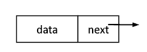

# 第二章--线性表

线性表是一种逻辑结构。

线性表是具有**相同特性**的数据元素的一个**有限序列**。

## 2.1 顺序存储（顺序表）

**注意：** 线性表中元素的位序从 1 开始，而数组中元素的下标是从 0 开始的。

静态分配：静态数组（系统自动回收）

动态分配：动态数组（malloc、free（需要手动free））

**优点：**

> 支持随机访问；存储密度高，每个节点只存储数据元素

**缺点：**

> 需要大量连续的存储空间，**浪费内存资源**
>
> **逻辑相邻的元素物理上也相邻**，故在插入、删除某一元素时，**需要移动大量数据元素**
>
> 属于**静态**存储形式，改变容量不方便

```c
typedef struct{
    DataType elem[MaxSize];
    int lenght;
}Sqlist;
```


## 2.2 链式存储（链表）

**设置头结点的目的：方便运算的实现**

> - 插入和删除数据元素的算法统一了
> - 空表和非空表的处理统一了

**优点：**

> 离散的小空间分配方便，改变容量方便
>
> 插入、删除时不需要移动大量数据元素，只需要修改指针即可

**缺点：**

> 不支持随机访问；存储密度小

| 时间复杂度     | 顺序表                                      | 单链表 | 双链表   | 循环链表 | 静态链表 |
| -------------- | ------------------------------------------- | ------ | -------- | -------- | -------- |
| 插入           | O(n)                                        | O(n)   | ==O(1)== |          |          |
| 删除           | O(n)                                        | O(n)   | ==O(1)== |          |          |
| 按位查找       | <strong style="color:#DD5145">O(1)</strong> | O(n)   | O(n)     |          |          |
| 按值查找       | O(n)                                        | O(n)   | O(n)     |          |          |
| 求表长         | O(n)                                        |        |          |          |          |
| 建立（头插法） |                                             | O(n)   |          |          |          |
| 建立（尾插法） |                                             | O(n)   |          |          |          |


| 空表判断   | 单链表 / 双链表      | 循环单链表           | 循环双链表                        |
| ---------- | -------------------- | -------------------- | --------------------------------- |
| 带有头结点 | head -> next == NULL | head -> next == head | L -> prior == L && L -> next == L |
| 没有头结点 | head == NULL         | head == NULL         | head == NULL                      |


### 单链表



其中 data 为数据域，存放数据元素；next 为指针域，存放后继结点的地址。

```c
typedef struct LNode{
    DataType data;
    struct LNode *next;
}LNode, *LinkList;
```

不带头结点的空表判断，`L == null`

带头结点的空表判断，`L->next == null`

循环单链表的空表判断，`L.next == L`


### 双链表

### 循环链表

### 静态链表

