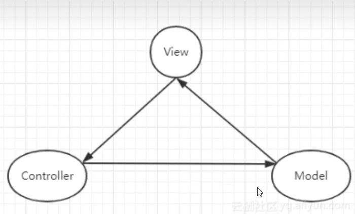
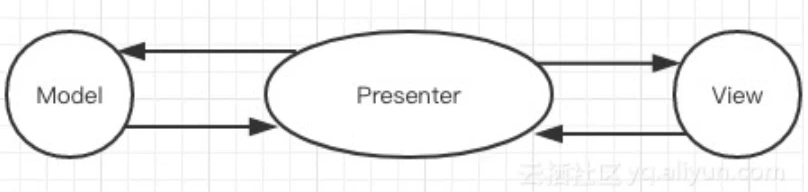
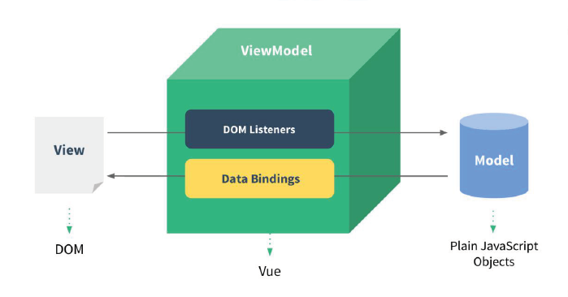

# Vue2 面试相关

## 1.:star:Vue中给对象添加新的属性，界面不刷新？

### 1.产生的问题

直接添加属性的问题：数据虽然更新了（`console`打印出了新属性），但页面并没有更新。

### 2.产生的原因

`vue2`是用过`Object.defineProperty`实现数据响应式，后面新增的属性，并没有通过`Object.defineProperty`设置成响应式数据。

```js
const obj = {}
Object.defineProperty(obj, 'foo', {
    get() {
        console.log(`get foo:${val}`)
        return val
    },
    set(newVal) {
        if (newVal !== val) {
            console.log(`set foo:${newVal}`)
            val = newVal
        }
    }
})
```

当我们访问`foo`属性或者设置`foo`值的时候都能够触发`setter`与`getter`，

但是我们为`obj`添加新属性的时候，却无法触发事件属性的拦截。

### 3.解决方案

`Vue` 不允许在已经创建的实例上动态添加新的响应式属性，若想实现数据与视图同步更新，可采取下面三种解决方案：

- <strong style="color:#DD5145">`Vue.set()`</strong>
- <strong style="color:#DD5145">`Object.assign()`</strong>
- <strong style="color:#DD5145">`$forcecUpdated()`</strong>

#### Vue.set()

`Vue.set(target, propertyName/index, value)` 或

`vm.$set (target, propertyName/index, value)`

参数：

- `{Object | Array} target`
- `{string | number} propertyName/index`
- `{any} value`

返回值：设置的值

通过`Vue.set`向响应式对象中添加一个`property`，并确保这个新 `property`同样是响应式的，且触发视图更新

#### Object.assign()

直接使用`Object.assign()`添加到对象的新属性不会触发更新

应创建一个新的对象，合并原对象和混入对象的属性

```js
this.someObject = Object.assign({}, this.someObject, {newProperty1: 1, newProperty2: 2 ...})
```

#### $forceUpdate

如果你发现你自己需要在 `Vue`中做一次强制更新，99.9% 的情况，是你在某个地方做错了事

`$forceUpdate`迫使`Vue` 实例重新渲染

PS：仅仅影响实例本身和插入插槽内容的子组件，而不是所有子组件。

### 小结

- 如果为对象添加少量的新属性，可以直接采用`Vue.set()`
- 如果需要为新对象添加大量的新属性，则通过`Object.assign()`创建新对象
- 如果你实在不知道怎么操作时，可采取`$forceUpdate()`进行强制刷新 (不建议)

PS：`vue3`是用过`proxy`实现数据响应式的，直接动态添加新属性仍可以实现数据响应式

[参考文章](https://vue3js.cn/interview/)


## 2.:star:你知道 Vue 中 key 的原理吗？说说你对它的理解

### 1.虚拟DOM中key的作用？

- key 是虚拟 DOM 对象的标识，当数据发生变化时，Vue 会根据新数据生成新的虚拟DOM, <br>随后 Vue 进行 新虚拟DOM 与 旧虚拟DOM 的差异比较，比较规则如下：

**对比规则：**

1. 旧虚拟DOM中找到了与新虚拟DOM相同的 key
   - 若虚拟DOM中内容没变, 直接使用之前的真实DOM！
   - 若虚拟DOM中内容变了, 则生成新的真实DOM，随后替换掉页面中之前的真实DOM。

2. 旧虚拟DOM中未找到与新虚拟DOM相同的key
   - 创建新的真实DOM，随后渲染到到页面。

### 2.用 index 作为 key 可能会引发的问题？

1. 若对数据进行：逆序添加、逆序删除等破坏顺序操作:
   - 会产生没有必要的真实DOM更新 ==> 界面效果没问题, 但**效率低**。

2. 如果结构中还包含**输入类的DOM**：
   - 会产生**错误DOM更新** ==> 界面有问题。

### 3.开发中如何选择 key?

1. 最好使用每条数据的**唯一标识**作为key, 比如id、手机号、身份证号、学号等唯一值。
2. 如果不存在对数据的逆序添加、逆序删除等破坏顺序操作，仅用于渲染列表用于展示，使用index作为key是没有问题的。


## 3.:star:vue 权限管理该怎么做？如果控制到按钮级别的权限怎么做？

### 1.什么是权限管理

权限是对特定资源的访问许可，所谓权限控制，也就是确保用户只能访问到被分配的资源

而前端权限归根结底是请求的发起权，请求的发起可能有下面两种形式触发

- 页面加载触发
- 页面上的按钮点击触发

所以我们可以从这两方面入手，对触发权限的源头进行控制，最终要实现的目标是：

- 路由方面，用户登录后只能看到自己有权访问的导航菜单，也只能访问自己有权访问的路由地址，否则将跳转 `4xx` 提示页
- 视图方面，用户只能看到自己有权浏览的内容和有权操作的控件
- 最后再加上请求控制作为最后一道防线，路由可能配置失误，按钮可能忘了加权限，这种时候请求控制可以用来兜底，越权请求将在前端被拦截

### 2.怎么做

前端权限控制可以分为四个方面：

- [接口权限](#接口权限)
- [按钮权限](#按钮权限)
- [菜单权限](#菜单权限)
- [路由权限](#路由权限)

#### 接口权限

- 接口权限目前一般采用`jwt`的形式来验证，没有通过的话一般返回`401`，跳转到登录页面重新进行登录，登录完拿到`token`，将`token`存起来，通过`axios`请求拦截器进行拦截，每次请求的时候头部携带`token`。

#### 按钮权限

方案一：

- 按钮权限也可以用`v-if`判断，但是如果页面过多，每个页面页面都要获取用户权限`role`和路由表里的`meta.btnPermissions`，然后再做判断。

方案二：

- 通过自定义指令进行按钮权限的判断

首先配置路由

```js
{
    path: '/permission',
    component: Layout,
    name: '权限测试',
    meta: {
        btnPermissions: ['admin', 'supper', 'normal']
    },
    //页面需要的权限
    children: [{
        path: 'supper',
        component: _import('system/supper'),
        name: '权限测试页',
        meta: {
            btnPermissions: ['admin', 'supper']
        } //页面需要的权限
    },
    {
        path: 'normal',
        component: _import('system/normal'),
        name: '权限测试页',
        meta: {
            btnPermissions: ['admin']
        } //页面需要的权限
    }]
}
```

自定义权限鉴定指令

```js
import Vue from 'vue'
/**权限指令**/
const has = Vue.directive('has', {
    bind: function (el, binding, vnode) {
        // 获取页面按钮权限
        let btnPermissionsArr = [];
        if(binding.value){
            // 如果指令传值，获取指令参数，根据指令参数和当前登录人按钮权限做比较。
            btnPermissionsArr = Array.of(binding.value);
        }else{
            // 否则获取路由中的参数，根据路由的btnPermissionsArr和当前登录人按钮权限做比较。
            btnPermissionsArr = vnode.context.$route.meta.btnPermissions;
        }
        if (!Vue.prototype.$_has(btnPermissionsArr)) {
            el.parentNode.removeChild(el);
        }
    }
});
// 权限检查方法
Vue.prototype.$_has = function (value) {
    let isExist = false;
    // 获取用户按钮权限
    let btnPermissionsStr = sessionStorage.getItem("btnPermissions");
    if (btnPermissionsStr == undefined || btnPermissionsStr == null) {
        return false;
    }
    if (value.indexOf(btnPermissionsStr) > -1) {
        isExist = true;
    }
    return isExist;
};
export {has}
```

在使用的按钮中只需要引用`v-has`指令

```vue
<el-button @click='editClick' type="primary" v-has>编辑</el-button>
```


#### 菜单权限

菜单权限可以理解成将页面与理由进行解耦。

方案一：

- 菜单与路由分离，菜单由后端返回

前端定义路由信息

```js
{
    name: "login",
    path: "/login",
    component: () => import("@/pages/Login.vue")
}
```


全局路由守卫里做判断

这种方式的缺点：

- 菜单需要与路由做一一对应，前端添加了新功能，需要通过菜单管理功能添加新的菜单，如果菜单配置的不对会导致应用不能正常使用
- 全局路由守卫里，每次路由跳转都要做判断

方案二：

- 菜单和路由都由后端返回

前端统一定义路由组件

```js
const Home = () => import("../pages/Home.vue")
const UserInfo = () => import("../pages/UserInfo.vue")
export default {
    home: Home,
    userInfo: UserInfo
}
```

后端路由组件返回以下格式

```js
[
    {
        name: "home",
        path: "/",
        component: "home"
    },
    {
        name: "home",
        path: "/userinfo",
        component: "userInfo"
    }
]
```

在将后端返回路由通过`addRoutes`动态挂载之间，需要将数据处理一下，将`component`字段换为真正的组件

这种方法也会存在缺点：

- 全局路由守卫里，每次路由跳转都要做判断
- 前后端的配合要求更高


#### 路由权限

方案一：

- 初始化即挂载全部路由，并且在路由上标记相应的权限信息，每次路由跳转前做校验。

这种方式存在以下四种缺点：

- 加载所有的路由，如果路由很多，而用户并不是所有的路由都有权限访问，对性能会有影响。
- 全局路由守卫里，每次路由跳转都要做权限判断。
- 菜单信息写死在前端，要改个显示文字或权限信息，需要重新编译
- 菜单跟路由耦合在一起，定义路由的时候还有添加菜单显示标题，图标之类的信息，而且路由不一定作为菜单显示，还要多加字段进行标识

方案二：

- 初始化的时候先挂载不需要权限控制的路由，比如登录页，404等错误页。如果用户通过URL进行强制访问，则会直接进入404，相当于从源头上做了控制。

登录后，获取用户的权限信息，然后筛选有权限访问的路由，在全局路由守卫里进行调用`addRoutes`添加路由

按需挂载，路由就需要知道用户的路由权限，也就是在用户登录进来的时候就要知道当前用户拥有哪些路由权限

这种方式也存在了以下的缺点：

- 全局路由守卫里，每次路由跳转都要做判断
- 菜单信息写死在前端，要改个显示文字或权限信息，需要重新编译
- 菜单跟路由耦合在一起，定义路由的时候还有添加菜单显示标题，图标之类的信息，而且路由不一定作为菜单显示，还要多加字段进行标识


## 4.:star:你有写过自定义指令吗？自定义指令的应用场景有哪些？

### 什么是指令

**指令系统**是计算机硬件的语言系统，也叫机器语言，它是系统程序员看到的计算机的主要属性。因此指令系统表征了计算机的基本功能决定了机器所要求的能力。

我们看到的`v-`开头的行内属性，都是指令，不同的指令可以完成或实现不同的功能

除了核心功能默认内置的指令 (`v-model` 和 `v-show`)，`Vue` 也允许注册自定义指令

指令使用的几种方式：

```js
//会实例化一个指令，但这个指令没有参数 
`v-xxx`

// -- 将值传到指令中
`v-xxx="value"`  

// -- 将字符串传入到指令中，如`v-html="'<p>内容</p>'"`
`v-xxx="'string'"` 

// -- 传参数（`arg`），如`v-bind:class="className"`
`v-xxx:arg="value"` 

// -- 使用修饰符（`modifier`）
`v-xxx:arg.modifier="value"` 
```

### 怎么做

注册一个自定义指令有全局注册与局部注册：

- 全局注册主要是通过`Vue.directive`方法进行注册
- 局部注册通过在组件`options`选项中设置`directives`属性

### 应用场景

使用自定义指令可以满足我们日常一些场景，这里给出几个自定义指令的案例：

- 表单防止重复提交
- 图片懒加载
- 一键 Copy的功能

[参考文章](https://juejin.cn/post/6844903826693029895)


## 5.:star:对 MVC、MVP 和 MVVM 的理解


### MVC

前端的 MVC 与后端类似，具备 **M（Model）模型**，**V（View）视图**，**C（Controller）控制器**：

- Model：负责封装和处理数据，与后端数据进行同步。
- View：负责展示数据，将 Model 中的数据可视化出来。
- Controller：负责业务逻辑，根据用户行为对 Model 数据进行修改。




### MVP

MVP 模式虽然前端开发并不常见，但是安卓等原生开发中，还是有使用。

MVP 月 MVC 很相似，P（Presenter），可以理解为一个中间人，它负责 View 和 Model 之间的数据流动，防止 View 和 Model 之间直接交流。




### MVVM

[MVVM](https://blog.csdn.net/jiahao1186/article/details/121915711)，是 Model-View-ViewModel 的简写，是 M-V-VM 三部分组成。它本质上就是 MVC 的改进版。

- **M：模型（Model）**，准备数据，当前页面渲染时所依赖的数据源。
- **V：视图（View）**，展示页面，当前页面所渲染的 DOM 结构。
- **VM：视图模型（ViewModel）**，Vue实例对象（vm），用于视图和模型（即数据）的转换。
  - DOM 监听器，监听页面 DOM 节点的变化，当页面 DOM 节点发送改变时，数据也会发生改变
  - 数据绑定，当 Model 数据发生改变时，视图界面也会发生改变




MVVM 的核心思想：<strong style="color:#DD5145">关注 Model（即数据）的变化</strong>。让 MVVM 框架利用自己的机制自动更新 DOM（即View视图），也就是所谓的**数据-视图**分离。

- ViewModel 通过实现一套**数据响应式机制**，自动响应 Model 中的数据变化。
  - 主要职责：数据变化后更新视图，视图变化后更新数据
- 同时 ViewModel 会实现一套更新策略，自动将**数据变化**转换为**视图更新**。
- 通过**事件监听**响应 View 中用户交互修改 Model 中数据。
- 在 ViewModel 中就减少了大量 DOM 操作的代码。

MVVM 在保持 View 和 Model 低耦合的同时，还减少了维护它们关系的代码，使开发者更专注与于业务逻辑。


### 双向数据绑定

- View 中数据变化将自动更新到 Model 上，反之，Model 中数据变化也会自动更新到视图（view）上
- ViewModel 就是 View 和 Model 的桥梁
- ViewModel 负责把 Model 的数据同步到 View 显示出来，还负责把 View 的修改同步回到 Model


### 总结

- 这三者都是框架模式，它们设计的目的都是为了解决 Model 和 View 的耦合问题


## 6.:star:v-if 和 v-for 为什么不建议一起使用？

`v-if`指令用于条件性地渲染一块内容。这块内容只会在指令的表达式返回 `true`值的时候被渲染。

`v-for`指令基于一个数组来渲染一个列表。

```vue
<Modal v-if="isShow" />

<li v-for="item in items" :key="item.id">
    {{ item.label }}
</li>
```

注意：

- 不要把 `v-if` 和 `v-for` 同时用在同一个元素上，带来性能方面的浪费

  <strong style="color:#DD5145">`v-for`优先级是比`v-if`高</strong>，导致每循环一次就会去`v-if`一次，而`v-if`是通过创建和销毁 DOM 元素来控制元素的显示与隐藏，所以就会不停的去创建和销毁元素，造成页面卡顿，性能下降。

解决方法：

- 若要避免出现这种情况，则在外层嵌套`template`（页面渲染不生成`DOM`节点），在这一层进行`v-if`判断，然后在内部进行`v-for`循环

```vue
<template v-if="isShow">
    <p v-for="item in items">
</template>
```

- 如果条件出现在循环内部，可通过计算属性`computed`提前过滤掉那些不需要显示的项

```js
computed: {
    items: function() {
      return this.list.filter(function (item) {
        return item.isShow
      })
    }
}
```

