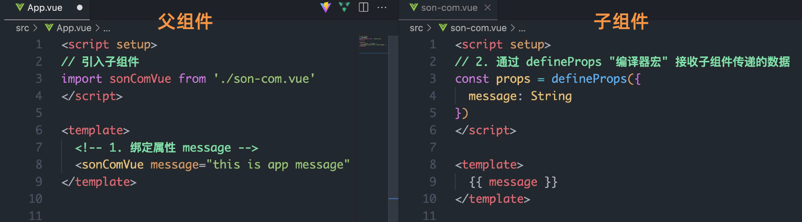
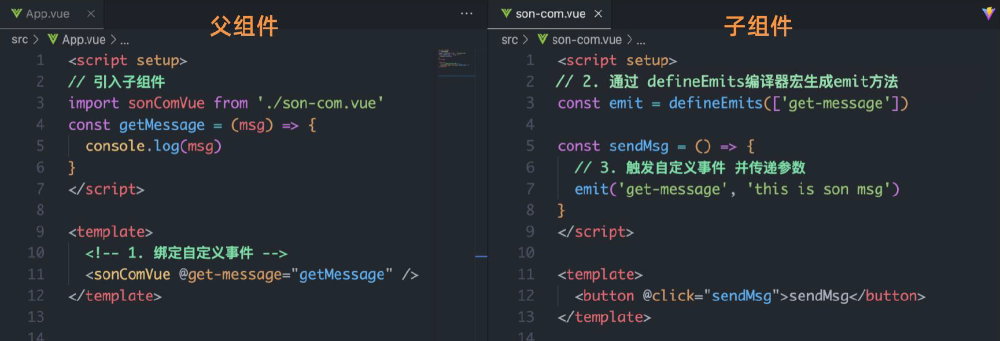

# 二、常用 Composition API

Vue 的组件可以分为两种风格：**选项式API（Options API）** 和 **组合式API（Composition API）**

```vue
<template>
	<button @click="addCount">{{ count }}</button>
</template>

<script setup>
    // Vue3 实现------------------
    import { ref } from 'vue'
    const count = ref(0)
    const addCount = () => count.value++
    // Vue2 实现------------------
    export default {
        data () {
            return {
                count: 0
            }
        },
        methods: {
            addCount () {
                this.count++
            }
        }
    }
</script>
```


## :star:拉开序幕的 setup

### 基本概念

1. setup 是 Vue3 中一个新的配置项，值为一个函数。

2. setup 是所有<strong style="color:#DD5145">Composition API（组合式API，即内置函数）</strong>的<i style="color:#3AB882;font-weight:bold">“表演的舞台 ”</i>。

3. 组件中所用到的数据(data)、方法(methods)、计算属性(computed) 等等，均要配置在 setup 函数中，就可以对业务进行集中处理。

4. setup 函数的两种返回值：

   - <strong style="color:#9370DB">若返回一个对象，则对象中的属性、方法，在模板中均可以直接使用。（重点关注！）</strong>

   - 若返回一个渲染函数：则可以自定义渲染内容。（了解）

   ```js
   import {h} from 'vue'
   ...
   setup() {
       ...
       return () => h('h1','学习')
   }
   ```

必须以**对象的形式**通过 **return** 返回出去


### setup 的几个注意点

**1.setup 执行的时机**

- 在 **beforeCreate** 之前自动执行一次，this 是 undefined，<strong style="color:#DD5145">故 setup 函数中没有 this 指针</strong>。

**2.setup 的两个参数**

- <strong style="color:#DD5145">props</strong>：值为对象，包含 组件外部传递过来，且组件内部声明接收了的属性。

在父组件中给子组件传递数据

```js
<Demo msg="你好啊" name="chenglun17" />
```

在子组件中接收

```js
props:['msg','name'], // 需要声明一下接受到了，否则会报警告
setup(props){
    console.log(props)
}
```

- <strong style="color:#DD5145">context</strong>：上下文对象
  
  - **attrs**：值为对象，包含：组件外部传递过来，但没有用 props 接收，相当于 `this.$attrs` 
  
    父子组件通信过程中，父组件把数据传递过来，如果子组件没有用 props 进行接收，就会出现在 attrs 中，而 vm 中没有
  
    如果用 props 接收了，则会出现在vm上而attrs中没有
  
  - **emit**：触发自定义事件的函数，相当于 `this.$emit` 
  
  在父组件中给子组件绑定一个事件
  
  ```js
  <Demo @hello="showHelloMsg">
  ```
  
  在子组件中触发事件并且可以传值过去
  
  ```js
  emits:['hello'], // 要声明接收到了hello事件，否则会报警告
  context.emit('hello', 666)
  ```
  
  - **slots**：收到的插槽内容，相当于 `this.$slots` 
  
  ```vue
  <Demo>
  	<template v-slot:qwe>
  		<span>你好</span>
  	</template>
  </Demo>
  ```
  
  vue3 里面具名插槽用 `v-slot`

**3.setup 不能是一个<strong style="color:#DD5145">async函数</strong>**

因为返回值不再是 return 的对象，而是 promise，模板看不到 return 对象中的属性。

（**后期也可以返回一个`Promise`实例，但需要`Suspense`和`异步组件`的配合**）

**尽量不要与 Vue2 配置混用**

- Vue2 配置（data、methos、computed...）中<strong style="color:#DD5145">可以访问到</strong> setup 中的属性、方法。
- 但在 setup 中<strong style="color:#DD5145">不能访问到</strong> Vue2 配置（data、methos、computed...）。
- 如果有重名，setup 优先。


### \<script setup> 语法糖

原始写法

```vue
<script>
    export default {
        setup () {
            // 数据
            const message = 'this is message'
            // 函数
            const logMessage = () => {
                console.log(message)
            }
            return { message, logMessage }
        }
    }
</script>
```

语法糖写法：**局部组件直接导入无需注册就可以使用**

```vue
<script setup>
    // 数据
    const message = 'this is message'
    // 函数
    const logMessage = () => {
        console.log(message)
    }
</script>
```


##  :star:ref 与 reactive

### ref 函数

作用：<strong style="color:orange">定义一个响应式的数据</strong>，为数据添加响应式状态，接收的数据可以是基本类型或对象类型。

- 基本类型数据：响应式依然是靠 **`Object.defineProperty()`** （数据劫持）的```get```与```set```完成的。
- 对象类型数据：内部 <i style="color:#3AB882;font-weight:bold">“求助 ”</i> 了Vue3.0中的一个新函数 —— **`reactive`** 函数。

语法：创建一个包含响应式数据的<strong style="color:#DD5145">引用对象（reference对象，简称ref对象）</strong> **`RefImpl（reference implement）`**

```js
// 引入
import { ref } from 'vue'
// 执行函数 传入参数 变量接收
const xxx = ref(initValue)
```

- **参数可以传递任意数据类型**，传递对象类型时也能保持深度响应式，所以适用性更广
- js 脚本区域中操作数据：**`xxx.value`**
- 模板中读取数据: 不需要 **`.value`**，解析时自动追踪 value，直接：**`<div>{{xxx}}</div>`**


### reactive 函数

作用：<strong style="color:orange">定义一个“对象类型”响应式数据</strong>，为对象添加响应式状态（不能处理简单类型的数据，要用**`ref`**函数）

语法：接收一个对象（或数组）类型的参数，返回一个<strong style="color:#DD5145">代理对象（Proxy的实例对象，简称proxy对象）</strong>

```js
// 引入
import { reactive } from 'vue'
// 执行函数 传入参数 变量接收
const 代理对象 = reactive(源对象)
```

- reactive 定义的响应式数据是 <strong style="color:#DD5145">"深层次的"</strong>。
- 参数只能传入对象类型
- 获取数据值的时候直接获取，不需要加.value
- 内部基于 ES6 的 Proxy 实现，通过代理对象操作源对象内部数据进行操作。


### ref 与 reactive 的区别

1.从定义数据角度对比：

- ref 用来定义：<strong style="color:#DD5145">基本类型数据</strong>
- reactive 用来定义：<strong style="color:#DD5145">对象（或数组）类型数据</strong>

`ref` 也可以用来定义对象（或数组）类型数据，它内部会自动通过 `reactive` 转为<strong style="color:#DD5145">代理对象</strong>。

2.从原理角度对比：

-  ref 通过``Object.defineProperty()``的```get```与```set```来实现响应式（数据劫持）。
-  reactive 通过使用 <strong style="color:#DD5145">Proxy</strong> 来实现响应式（数据劫持）, 并通过 <strong style="color:#DD5145">Reflect</strong> 操作<strong style="color:orange">源对象</strong>内部的数据。

3.从使用角度对比：

-  ref 定义的数据：操作数据 <strong style="color:#DD5145">需要</strong>```.value```，读取数据时从模板中直接读取 <strong style="color:#DD5145">不需要</strong>```.value```。
-  reactive 定义的数据：操作数据与读取数据 <strong style="color:#DD5145">均不需要</strong>```.value```。


## :star:toRef 与 toRefs

### toRef

作用：为源响应式对象上的属性新建一个ref，从而保持对其源对象属性的响应式连接。

toRef 是指向了那个对象，而 ref 是 new 了一个对象（会失去响应式）

语法：

```js
const name = toRef(person, 'name')
```

- 接收两个参数：源响应式对象和属性名，返回一个 ref 数据
- 获取数据值的时候需要加 .value
- toRef 后的 ref 数据如果是复杂类型数据时，不是原始数据的拷贝，而是引用，改变结果数据的值也会同时改变原始数据

应用:   要将响应式对象中的某个属性单独提供给外部使用时。


### toRefs

作用：将响应式对象转换为结果对象，其中结果对象的每个属性都是指向原始对象相应属性的ref。

常用于ES6的解构赋值操作，因为在对一个响应式对象直接解构时解构后的数据将不再有响应式，而使用toRefs可以方便解决这一问题。

语法：

```js
import { defineComponent, toRefs } from 'vue'

export default defineComponent({
  props: [title],
  
  setup (props) {
    // 使用了解构赋值语法创建了变量myTitle
    const { myTitle } = toRefs(props)

    console.log(myTitle.value)
  }
})

```

- 获取数据值的时候需要加 .value
- toRefs 后的 ref 数据如果是复杂类型数据时，不是原始数据的拷贝，而是引用，改变结果数据的值也会同时改变原始数据
- 作用其实和 toRef 类似，只不过 toRef 是对一个个属性手动赋值，而 toRefs 是自动解构赋值


### ref、toRef  和 toRefs 区别

- ref、toRef、toRefs 都可以将某个对象中的属性变成响应式数据
- ref 的本质是拷贝，修改响应式数据，不会影响到原始数据，视图会更新
- toRef、toRefs 的本质是引用，修改响应式数据，会影响到原始数据，视图会更新
- toRef 一次仅能设置一个数据，接收两个参数，第一个参数是哪个对象，第二个参数是对象的哪个属性
- toRefs 接收 一个对象作为参数，它会遍历对象身上的所有属性，然后挨个调用 toRef 执行


## :star:Vue3.0中的响应式原理

### vue2.x的响应式

- 实现原理：

  - 对象类型：通过 **`Object.defineProperty()`** 对属性的读取、修改进行拦截（<strong style="color:#DD5145">数据劫持</strong>）。

  - 数组类型：通过重写更新数组的一系列方法来实现拦截。（对数组的变更方法进行了包裹）。

    ```js
    Object.defineProperty(data, 'count', {
        get () {}, 
        set () {}
    })
    ```

- 存在问题：

  - 新增属性、删除属性, 界面不会更新。
  - 直接通过下标修改数组, 界面不会自动更新。

- 解决方法

  ```js
  this.$set()
  this.$delete()
  // 或者
  Vue.set()
  Vue.delete()
  ```


### Vue3.0的响应式

- 实现原理: 

  - 通过 <strong style="color:orange">Proxy（代理）</strong>：拦截对象中任意属性的变化，包括属性值的读写、属性的添加、删除等。

  - 通过 <strong style="color:orange">Reflect（反射）</strong>：对源对象的属性进行操作。

  - MDN文档中描述的[Proxy](https://developer.mozilla.org/zh-CN/docs/Web/JavaScript/Reference/Global_Objects/Proxy)与[Reflect](https://developer.mozilla.org/zh-CN/docs/Web/JavaScript/Reference/Global_Objects/Reflect)：

    ```js
    new Proxy(data, {
    	// 拦截读取属性值
        get (target, prop) {
        	return Reflect.get(target, prop)
        },
        // 拦截设置属性值 或 添加新属性
        set (target, prop, value) {
        	return Reflect.set(target, prop, value)
        },
        // 拦截删除属性
        deleteProperty (target, prop) {
        	return Reflect.deleteProperty(target, prop)
        }
    })
    
    proxy.name = 'tom'   
    ```


## :star:计算属性与监听属性

### 1.computed 函数

- 与 Vue2.x 中 computed 配置功能一致，在 vue3 中变成了一个组合式的API（内置函数）

- 计算属性中不应该有 “**副作用**”，例如 异步请求、修改DOM

- 避免直接修改计算属性的值，**只读**

- 写法：**需要引入 computed**

  ```js
  import { computed } from 'vue'
  
  setup(){
      ...
  	//计算属性——简写
      let fullName = computed(() => {
          return person.firstName + '-' + person.lastName
      })
      //计算属性——完整
      let fullName = computed({
          get(){
              return person.firstName + '-' + person.lastName
          },
          set(value){
              const nameArr = value.split('-')
              person.firstName = nameArr[0]
              person.lastName = nameArr[1]
          }
      })
  }
  ```

### 2.watch 函数

- 与 Vue2.x 中 watch 配置功能一致，在 vue3 中变成了一个组合式的API（内置函数）
- 作用：侦听一个或多个数据的变化，数据变化时执行回调函数
- 两个额外的参数：**immediate**（立即执行）、**deep**（深度监听，有性能损耗）
- 两个小 “坑”：

  - 监视 reactive 定义的响应式数据（对象）时：<strong style="color:#DD5145">oldValue无法正确获取</strong>、<strong style="color:#DD5145">强制开启了深度监视（deep配置失效）</strong>。
  - 监视 reactive 定义的响应式数据（对象）中某个属性（也是对象）时：手动开启深度监视，deep配置有效。

```js
import { watch, ref, reative } from 'vue'
const sum = ref(0)
const person = reative({
    name: '张三',
    age: 18
})
// 情况一：监视ref定义的一个响应式数据（第一个参数为监视的对象，第二个参数为回调函数，第三个参数是监视的配置）
// ref对象sum不需要加 .value
watch(sum, (newValue, oldValue) => {
	console.log('sum变化了', newValue, oldValue)
}, {immediate: true})

// 情况二：监视ref定义的多个响应式数据（监视的参数写成数组，新值旧值也是数组）
watch([sum, msg], (newValue, oldValue) => {
	console.log('sum或msg变化了', newValue, oldValue)
})

/* 
   情况三：监视reactive定义的一个响应式数据的全部属性
	若watch监视的是reactive定义的响应式数据，则无法正确获得oldValue！！
	若watch监视的是reactive定义的响应式数据，则强制开启了深度监视 
*/
watch(person, (newValue, oldValue) => {
	console.log('person变化了', newValue, oldValue)
}, {immediate: true, deep: false}) // 此处的deep配置不再奏效

// 情况四：监视reactive定义的一个响应式数据中的一个属性（监视的对象写成函数形式），可以获取正确的oldValue
watch(() => person.job, (newValue, oldValue) => {
	console.log('person的job变化了', newValue, oldValue)
}) 

// 情况五：监视reactive定义的一个响应式数据中的多个属性（用数组包裹）
watch([() => person.name, () => person.age], (newValue, oldValue) => {
	console.log('person的name或age变化了', newValue, oldValue)
})

// 特殊情况
watch(() => person.job, (newValue, oldValue) => {
    console.log('person的job变化了', newValue, oldValue)
}, {deep: true}) // 此处由于监视的是reactive所定义的对象中的某个属性，所以deep配置有效
```

### 3.watchEffect 函数

- watch 的套路是：既要指明监视的属性，也要指明监视的回调。

- watchEffect 的套路是：<strong style="color:#3AB882">不用指明监视哪个属性，监视的回调中用到了哪个属性，那就监视哪个属性</strong>。

- <strong style="color:#9370DB">watchEffect 与 computed</strong>：

  - 但 computed 注重的计算出来的值（回调函数的返回值），所以必须要写返回值。
  - 而 watchEffect 更注重的是<strong style="color:#DD5145">过程</strong>（回调函数的函数体），所以<strong style="color:#DD5145">不用写返回值</strong>。

- computed 若计算的值没有被使用则不会调用，但是 watchEffect 始终会调用一次

  ```js
  // watchEffect所指定的回调中用到的数据只要发生变化，则直接重新执行回调。
  watchEffect(()=>{
      const x1 = sum.value
      const x2 = person.age
      console.log('watchEffect配置的回调执行了')
  })
  ```

### 4.watch和watchEffect的区别

**watch：**

- `watch`显式指定依赖数据，依赖数据更新时执行回调函数

- 具有一定的惰性lazy 第一次页面展示的时候不会执行，只有数据变化的时候才会执行

  设置`immediate: true`时可以变为非惰性，页面首次加载就会执行

- 监视ref定义的响应式数据时可以获取到原值

- **既要指明监视的属性，也要指明监视的回调**

**watchEffect：**

- `watchEffect`自动收集依赖数据，依赖数据更新时重新执行自身
- 立即执行，没有惰性，页面的首次加载就会执行
- 无法获取到原值，只能得到变化后的值
- **不用指明监视哪个属性，监视的回调中用到哪个属性就监视哪个属性**


## :star:生命周期

### Vue2生命周期


### Vue3生命周期


### 生命周期函数

- Vue3.0 中可以继续使用 Vue2.x 中的生命周期钩子，但有有两个被更名：
  - ```beforeDestroy``` 改名为 `beforeUnmount`
  - ```destroyed``` 改名为 `unmounted`
- Vue3.0 也提供了 Composition API 形式的生命周期钩子，与 Vue2.x 中钩子对应关系如下：

| 选项式API（Vue2）                                            | 组合式API（Vue3）                                      | 说明           |
| ------------------------------------------------------------ | ------------------------------------------------------ | -------------- |
| <strong style="color:#DD5145">beforeCreate / created</strong> | <strong style="color:#DD5145">setup</strong>           | 创建实例前/后  |
| beforeMount                                                  | onBeforeMount                                          | DOM挂载前调用  |
| mounted                                                      | onMounted                                              | DOM挂载后调用  |
| beforeUpdate                                                 | onBeforeUpdate                                         | 数据更新前调用 |
| updated                                                      | onUpdated                                              | 数据更新后调用 |
| <strong style="color:#DD5145">beforeUnmount</strong>         | <strong style="color:#DD5145">onBeforeUnmount</strong> | 组件销毁前调用 |
| <strong style="color:#DD5145">unmounted</strong>             | <strong style="color:#DD5145">onUnmounted</strong>     | 组件销毁后调用 |

- 生命周期函数可以执行多次，多次执行时传入的回调会<strong style="color:#DD5145">在时机成熟时依次执行</strong>
- setup 是最先执行的，然后是 组合式API 中钩子，最后是 选项式API 中钩子
- setup 选择执行时机是在 **beforeCreate** 钩子之前，**自动执行**

使用前必须引用`import { onBeforeMount } from 'vue'`，引入之后就可以在`setup()`里面写了（前者为配置项形式，与setup同级）：

setup 是最先执行的，然后是 组合式API 中钩子，最后是 选项式API 中钩子。

```js
// vue2.x 中的生命周期钩子
beforeCreate() {
    console.log('子组件中2.x 中的 beforeCreate')
}

// vue3 中的生命周期钩子
import { onBeforeMount } from 'vue'

setup() {
    console.log('子组件中3.x中的 setup')

    onBeforeMount(() => {
        console.log('子组件中3.x 中的 onBeforeMount')
    })
}
```


## :star:自定义 hook 函数

- 什么是 hook？—— <strong style="color:#DD5145">本质是一个函数</strong>，把 setup 函数中使用的 Composition API 进行了封装。

- 类似于 vue2.x 中的 mixin。

- 自定义 hook 的优势：<strong style="color:#DD5145">复用代码</strong>，让 setup 中的逻辑更清楚易懂。


## 11.Props

props 父传子通信

基本思想：

- 父组件中给子组件绑定属性
- 子组件内部通过 **`props`** 选项接收

父传子的过程中通过 **`defineProps({属性名: 类型})`**接收 props

```js
export default {
    props: ['foo'],
    setup(props) {
        // setup() 接收 props 作为第一个参数
        console.log(props.foo)
    }
}
```

setup 语法糖下：**局部组件直接导入无需注册就可以使用**



### Prop 校验

`defineProps()`宏中的参数**不可以访问 `<script setup>` 中定义的其他变量**，因为在编译时整个表达式都会被移到外部的函数中。

```vue
<script setup>
    const props = defineProps(['foo'])
    console.log(props.foo)
    // 或
    const props = defineProps({
        // 基础类型检查（给出 `null` 和 `undefined` 值则会跳过任何类型检查）
        propA: Number,
        // 多种可能的类型
        propB: [String, Number],
        // 必传，且为 String 类型
        propC: {
            type: String,
            required: true
        },
        // Number 类型的默认值
        propD: {
            type: Number,
            default: 100
        },
        // 对象类型的默认值
        propE: {
            type: Object,
            // 对象或数组的默认值
            // 必须从一个工厂函数返回。
            // 该函数接收组件所接收到的原始 prop 作为参数。
            default(rawProps) {
                return { message: 'hello' }
            }
        },
        // 自定义类型校验函数
        propF: {
            validator(value) {
                // The value must match one of these strings
                return ['success', 'warning', 'danger'].includes(value)
            }
        },
        // 函数类型的默认值
        propG: {
            type: Function,
            // 不像对象或数组的默认，这不是一个
            // 工厂函数。这会是一个用来作为默认值的函数
            default() {
                return 'Default function'
            }
        }
    })
</script>
```


## 12.事件

\$emit 子传父通信

基本思想：

> - 父组件给子组件标签通过 **`@`** 绑定事件
> - 子组件内部通过 **`$emit`** 方法触发事件
>
> 子传父的过程中通过 **`defineEmits(['事件名称'])`**得到 emit 方法



### 声明触发的事件

```js
export default {
    emits: ['inFocus', 'submit'],
    setup(props, context) {
        context.emit('submit')
    }
}
```

与`setup()`上下文对象中的其他属性一样，`emit`可以安全地被解构：

```js
export default {
    emits: ['inFocus', 'submit'],
    setup(props, { emit }) {
        emit('submit')
    }
}
```

setup 语法糖下

```vue
<script setup>
    const emit = defineEmits(['inFocus', 'submit'])
    function buttonClick() {
        emit('submit')
    }
</script>
```

> `defineEmits()` 宏**不能**在子函数中使用。如上所示，它必须直接放置在 `<script setup>` 的顶级作用域下。

### 事件校验

```vue
<script setup>
    const emit = defineEmits({
        // 没有校验
        click: null,

        // 校验 submit 事件
        submit: ({ email, password }) => {
            if (email && password) {
                return true
            } else {
                console.warn('Invalid submit event payload!')
                return false
            }
        }
    })

    function submitForm(email, password) {
        emit('submit', { email, password })
    }
</script>
```


## 13.模板引用

通过 ref 标识 获取真实的DOM对象或组件实例对象

1. 调用 ref 函数生成一个 ref 对象
2. 通过 ref 标识绑定 ref 对象到标签

```vue
<script setup>
    import { ref, onMounted } from 'vue'
    
    // 1.调用ref函数生成一个ref对象
    const h1Ref = ref(null)
    
    // 组件挂载完毕之后才能获取到
    onMounted(() => {
        console.log(h1Ref.value)
    })
</script>

<template>
	<!-- 2.通过ref标识绑定ref对象 -->
	<h1 ref="h1Ref">我是DOM标签h1</h1>
</template>
```

默认情况下在 \<script setup> 语法糖下组件内部的属性和方法是**不开放给父组件访问的**，可以通过 <strong style="color:#DD5145">defineExpose</strong> 编译宏**抛出**那些属性和方法允许访问

```vue
<script setup>
    import { ref } from 'vue'
    
    const testMessage = ref('this is test msg')
    
    // 允许暴露出去的属性或方法
    defineExpose({
        testMessage
    })
</script>
```

> 1. 获取模板引用的时机是什么？--- 组件挂载完毕之后
> 2. defineExpose 编译宏的作用是什么？--- 显示暴露组件内部的属性和方法


## :page_facing_up:参考

[官方文档](https://cn.vuejs.org/)、[参考文章](https://blog.csdn.net/m0_51969330/article/details/123673334)、[参考文章](https://blog.csdn.net/u010059669/article/details/112287552)