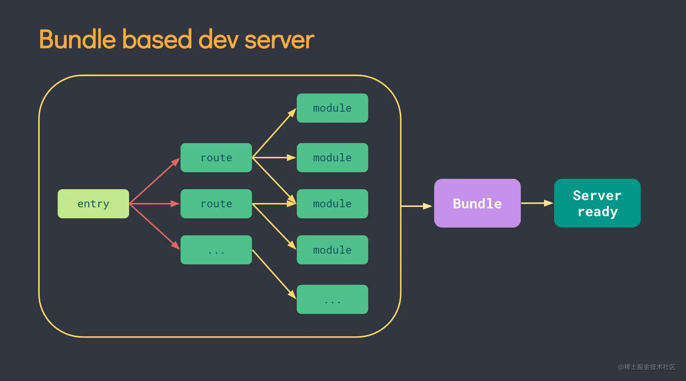
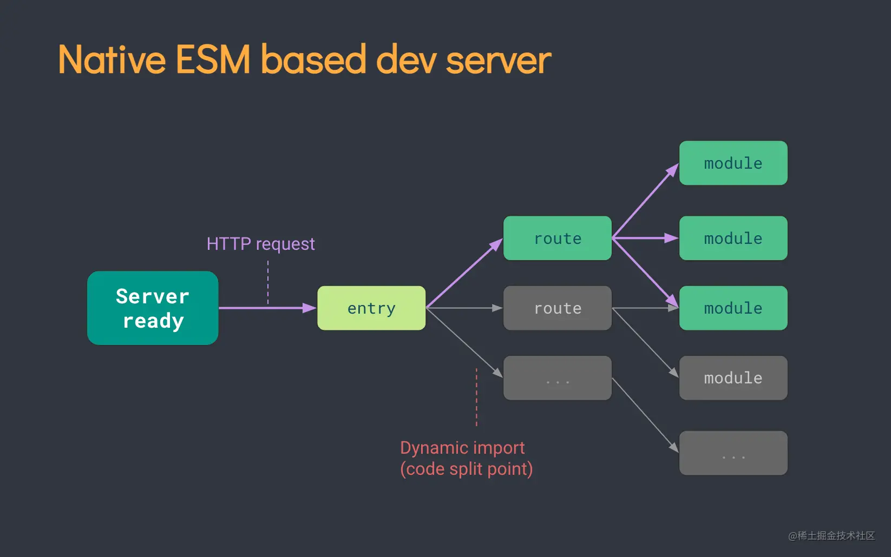

# 一、创建 Vue3.0工程

## 1.创建一个Vue3项目

### 使用 vite 创建

环境条件：16.0或更高版本的 Node.js

创建的项目将使用基于 [Vite](https://vitejs.dev/) 的构建设置，并允许我们使用 Vue 的[单文件组件](https://cn.vuejs.org/guide/scaling-up/sfc.html) (SFC)。

接下来我们就用Vite来创建一个Vue3的项目：[参考](https://blog.csdn.net/weixin_52418790/article/details/124325110)

```sh
npm init vue@latest
# 这一指令将会安装并执行 create-vue
```

**create-vue** 是 Vue 官方新的脚手架工具，底层从 Webpack 切换到了 Vite，为开发提供极速响应。你将会看到一些诸如 TypeScript 和测试支持之类的可选功能提示：

```sh
✔ Project name: … <your-project-name>
✔ Add TypeScript? … No / Yes
✔ Add JSX Support? … No / Yes
✔ Add Vue Router for Single Page Application development? … No / Yes
✔ Add Pinia for state management? … No / Yes
✔ Add Vitest for Unit testing? … No / Yes
✔ Add an End-to-End Testing Solution? … No / Cypress / Playwright
✔ Add ESLint for code quality? … No / Yes
✔ Add Prettier for code formatting? … No / Yes

Scaffolding project in ./<your-project-name>...
Done.
```

在项目被创建后，通过以下步骤安装依赖并启动开发服务器：（项目名称不能大写）

```sh
cd <your-project-name>
npm install
npm run dev
```

> 请注意，生成的项目中的示例组件使用的是组合式 API 和 **`<script setup>`**，而非选项式 API

当你准备将应用发布到生产环境时，请运行：

```sh
npm run build
```

此命令会在 `./dist` 文件夹中为你的应用创建一个生产环境的构建版本。


### 使用 vue-cli 创建

[Vue CLI](https://cli.vuejs.org/zh/) 是一个基于 Vue.js 进行快速开发的完整系统

安装或者升级你的@vue/cli

```sh
npm install -g @vue/cli
npm update -g @vue/cli

# 查看@vue/cli版本，确保@vue/cli版本在4.5.0以上
vue --version
```

创建 vue 项目：

```bash
vue create <your-project-name>
# OR
vue ui

# 启动
cd <your-project-name>
npm run serve
```


## 2.Vite 前端构建工具

- 什么是[Vite](https://vitejs.cn/)？—— 新一代前端构建工具。

- 优势如下：

  - 开发环境中，无需打包操作，可快速的冷启动。
  - 轻量快速的**热重载**（又称**模块热替换**，HMR，hot module replacement），它可以在应用运行的时候，不需要刷新页面，就可以直接替换、增删模块。
  - 真正的按需编译，不再等待整个应用编译完成。

- 传统构建 与 vite构建对比图

  传统构建模式，是将所有资源都打包好，再上线

  

  而Vite是按需加载

  

## 3.搭建第一个 Vite 项目

Vite 需要 [Node.js](https://nodejs.org/en/) 版本 14.18+，16+。

```sh
npm create vite@latest
```

你还可以通过附加的命令行选项直接指定项目名称和你想要使用的模板。例如，要构建一个 Vite + Vue 项目，运行：

```sh
npm create vite@latest my-vue-app --template vue
```

在安装了 Vite 的项目中，可以在 npm scripts 中使用 `vite` 可执行文件，或者直接使用 `npx vite` 运行它。下面是通过脚手架创建的 Vite 项目中默认的 npm scripts：

```json
{
    "scripts": {
        "dev": "vite", // 启动开发服务器，别名：`vite dev`，`vite serve`
        "build": "vite build", // 为生产环境构建产物
        "preview": "vite preview" // 本地预览生产构建产物
    }
}
```

可以指定额外的命令行选项，如 `--port` 或 `--https`。运行 `npx vite --help` 获得完整的命令行选项列表。


接下来我们就用[Vite](https://vitejs.cn/)来创建一个Vue3的项目：[参考](https://blog.csdn.net/weixin_52418790/article/details/124325110)

```bash
## 创建工程
npm init vite-app <project-name>
## 进入工程目录
cd <project-name>
## 安装依赖
npm install
## 运行
npm run dev
```

手动方式创建项目，Enter键确定显示如下：

> **Babel**：使用Babel将源码进行转码（把ES6=>ES5）
> **TypeScript**：使用TypeScript进行源码编写。使用TypeScript可以编写强类型JavaScript
> **Progressive Web App (PWA) Support**：使用渐进式Web应用程序
> **Router**：使用Vue路由
> **Vuex**：使用Vuex状态管理器
> **CSS Pre-processors**：CSS 预处理器（如：less、sass）
> **Linter / Formatter**：使用代码风格检查和格式化（如：ESlint）
> **Unit Testing**：使用单元测试（unit tests）
> **E2E Testing**：使用E2E（end to end）黑盒测试


##  4.分析文件目录

```
.vscode			--- VSCode工具配置文件
node_modules	 --- Vue项目的运行依赖文件夹
public			--- 资源文件夹

src				--- 源码文件夹
---apis			API接口文件夹
---composables	 组函数文件夹
---directives	 全局指令文件夹
---styles		全局样式文件夹
---utils		工具函数文件夹

.gitignore		--- git忽略文件
index.html		--- 入口HTML文件
package.json	--- 应用描述文件
REDAME.md	    --- 注释文件
vite.config.js	--- 项目配置文件，基于vite的配置
```

### main.js

Vue2项目的main.js

```js
import Vue from 'vue'
import App from './App.vue'

Vue.config.productionTip = false

new Vue({
  render: h => h(App),
}).$mount('#app')
```

我们再来看看Vue3项目中的main.js

```js
import { createApp } from 'vue'
import App from './App.vue'

createApp(App).mount('#app')
```

分析一下

```js
// 引入的不再是Vue构造函数了，引入的是一个名为createApp的工厂函数
import { createApp } from 'vue'
import App from './App.vue'

// 创建应用实例对象——app（类似于之前Vue2中的vm，但app比vm更“轻”）
const app = createApp(App) // 1.以App作为参数生成一个应用实例对象
console.log(app)
app.mount('#app')	// 2.挂载到id为app的节点上
```

### App.vue

我们再来看看组件

在`template`标签里可以没有根标签了

```vue
<template>
	<!-- Vue3组件中的模板结构可以没有根标签 -->
	
	<HelloWorld msg="Welcome to Your Vue.js App"/>
</template>
```

