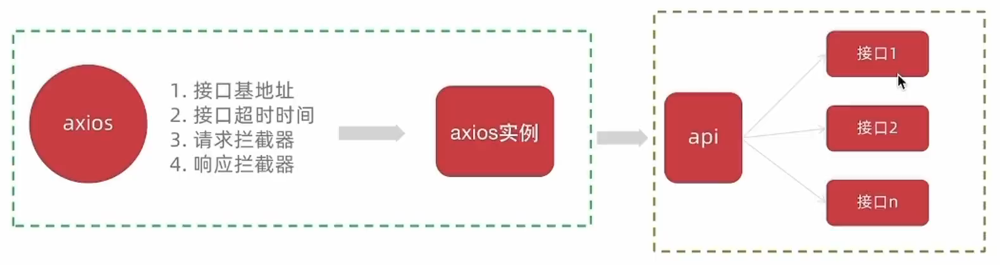

# 其他

## Vue 组件命名规范

警告错误：`Component name "index" should always be multi-word`

在**`.eslinttrc.cjs`**文件中添加

```js
/* eslint-env node */
module.exports = {
    root: true,
    'extends': [
        'plugin:vue/vue3-essential',
        'eslint:recommended'
    ],
    parserOptions: {
        ecmaVersion: 'latest'
    },
    rules: {
        'vue/multi-word-component-names': 0,  // 不再强制要求组件命名
    }
}
```

## 别名路径联想提示

在编写代码的过程中，一旦输入 **`@/`**，VSCode 会立即联想出 src 下的所有子目录和文件，统一文件路径访问不容易出错

如何使用：

1. 在项目的根目录下新增 **`jsconfig.json`**文件

2. 添加 json 格式的配置项，如下，

   ```json
   {
       "compilerOptions": {
           "baseUrl": "./",
           "paths": {
               "@/*": ["src/*"]
           }
       }
   }
   ```

> 这个配置只做联想提示，实际的转换在 vite.config.js 文件里

## axios 二次封装



### 1. 安装axios

```bash
npm i axios
```

### 2. 基础配置

> 官方文档地址：[https://axios-http.com/zh/docs/intro](https://axios-http.com/zh/docs/intro)
> 基础配置通常包括：
>
> 1. 实例化 - baseURL + timeout
> 2. 拦截器 - 携带 token 401拦截等

在**`src/utils/http.js`**中封装

```javascript
// axios基础的封装
import axios from "axios"

// 创建axios实例
const httpInstance = axios.create({
    baseURL: 'http://pcapi-xiaotuxian-front-devtest.itheima.net',
    timeout: 5000
})

// axios请求拦截器
httpInstance.interceptors.request.use(config => {
    return config
}, error => {
    return Promise.reject(error)
})

// axios响应拦截器
httpInstance.interceptors.response.use(res => {
    return res.data
}, error => {
    return Promise.reject(error)
})

export default httpInstance
```

### 3. 封装请求函数并测试

在**`src/api/Category.js`**中定义接口

```js
import httpInstance from '@/utils/http'

export function getCategoryAPI (id) {
    return httpInstance({ url: '/category', method: 'get', params: { id } })
}
// 或另一种写法
export const getCategoryAPI = (id) => httpInstance({ url: '/category', method: 'get', params: { id } })
```

在**`src/views/Category/index.vue`**中使用

```vue
<script setup>
    import { getCategoryAPI } from '@/apis/category'
    import { onMounted, ref } from 'vue'
    import { useRoute } from 'vue-router'

    const categoryList = ref({})
    const route = useRoute() // 获取路由参数
    
    const getDetailData = async () => {
        const res = await getDetailAPI(route.params.id)
        categoryList.value = res.result
    }

    onMounted(() => getDetailData())
</script>
```


## 表单验证

自定义规则

```js
validator: (rule, value, callback) => {
    // 自定义校验逻辑
    // value：当前输入的数据
    // callback：校验处理函数，校验通过调用
}

// 不管成功失败，callback()都要执行
// callback(new Error('错误'))
```

统一校验，调用form实例的方法

```js
formRef.value.validate(()=>{})
```

## 请求拦截器中携带Token

Token作为用户标识，在很多接口都需要携带Token才能正确获取数据，所有需要在接口调用时携带Token。

另外，为了统一控制控制采取请求拦截器携带的方式，一次配置多处生效

Axios 请求拦截器可以在接口正式发起之前对请求参数做一些事情，通常Token数据会被注入到**请求header**中，格式按照后端要求的格式进行拼接处理

```js
import { useUserStore } from "@/stores/user"

// axios请求拦截器
httpInstance.interceptors.request.use(config => {
    // 1.从pinia中获取token数据
    const userStore = useUserStore()
    // 2.按照后端的要求拼接token数据
    const token = userStore.userInfo.token // userInfo 为写在stores/user.js中的存储用户相关信息的属性
    if (token) {
        config.headers.Authorization = `Bearer ${token}`
    }
    return config
}, error => Promise.reject(error))
```

> **`Authorization`**和**`Bearer ${token}`**是后端规定的格式

##  Token失效401拦截处理

Token的有效性可以保持一定的时间，如果**用户一段时间不做任何操作**，Token就会失效，使用失效的Token再去请求一些接口，**接口就会报401状态码错误**，需要我们做额外处理

思考两个问题：

> 1. 我们能确定用户到底是在访问哪个接口时出现的401错误吗，在什么位置去拦截这个401？
> 2. 检测到401之后又该干什么呢？
>
> 解决方案：**在axios响应拦截器中做统一处理**
>
> - 失败回调中拦截401
> - 清除掉过期的用户信息，并跳转到登录页

```js
import { useUserStore } from "@/stores/user"
// import { useRouter } from 'vue-router' // 这里用这种router不行
import router from "@/router"

// axios响应拦截器
httpInstance.interceptors.response.use(res => {
    return res.data
}, error => {
    const userStore = useUserStore()
    // 401 token失效处理
    if (error.response.status === 401) {
        // 1.清除本地用户数据
        userStore.clearUserInfo() // clearUserInfo 为写在stores/user.js中的清除用户相关信息的方法
        // 2.跳转到登录页
        router.push('/login')
    }

    return Promise.reject(error)
})
```

