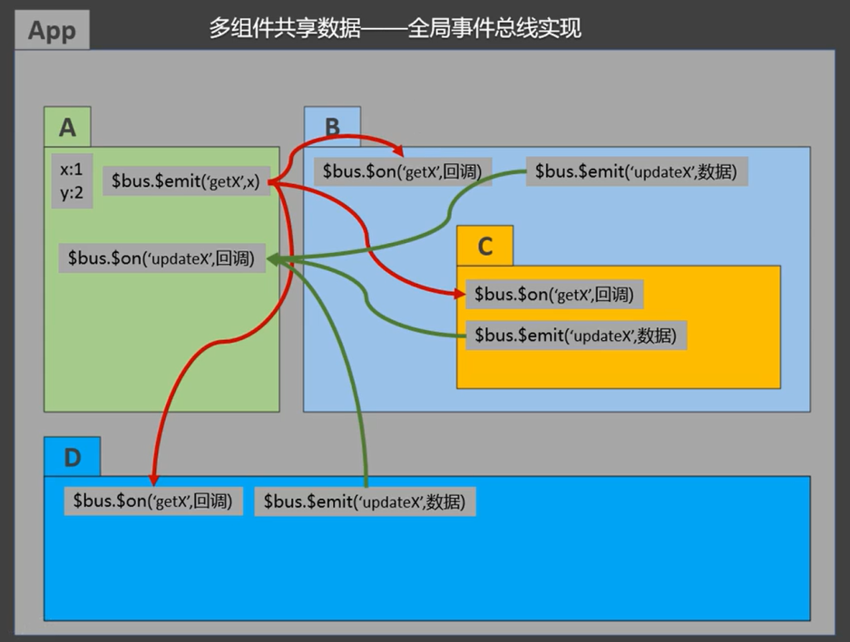
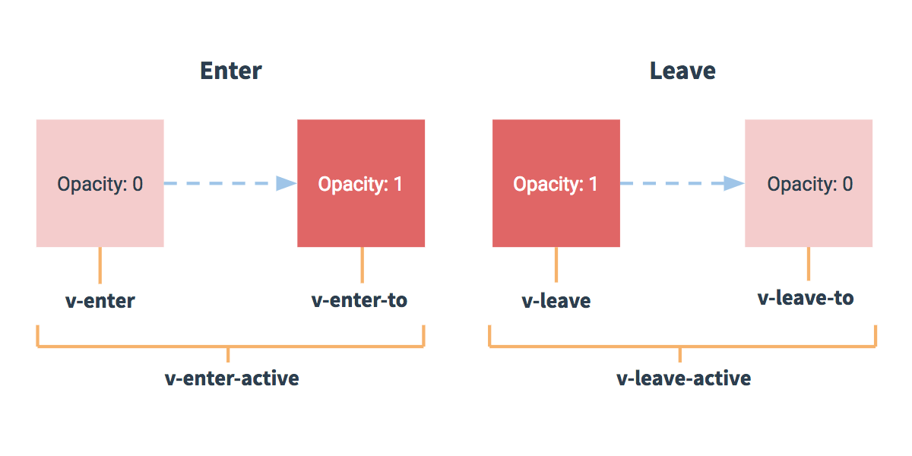

# 深入了解组件


## 1.:star:模块化与组件化

### 定义

- **模块**的定义：向外提供特定功能的 **js程序**，一般是一个 **js文件**

  作用：复用 js，简化 js 的编写，提高 js 运行效率

- **组件**的定义：实现应用中 **局部功能** 代码和资源的 **集合**

  作用：复用编码，简化项目编码，提高运行效率

### 使用

**Vue中使用组件的三大步骤：**

1. 定义组件（创建组件）
2. 注册组件（components）
3. 使用组件（写组件标签）

**如何定义一个组件？**

使用 **`Vue.extend(options)`** 创建，其中 options 和 new Vue(options) 时传入的那个 options 几乎一样，<br>但又有点区别，区别如下：

- **el 配置项不要写**，因为最终所有的组件都要经过一个vm的管理，由vm中的el决定服务那个容器
- <strong style="color:tomato">data必须写成函数</strong>，**避免组件被复用时，数据存在引用关系**

备注：使用 **template** 可以配置组件结构

**如何注册组件？**

- 局部注册：靠 **`new Vue()`** 的时候传入 **`components`** 选项
- 全局注册，靠 **`Vue.component('组件名', 组件)`**

**使用组件标签**

- **`<school></school>`**
- **`<school/>`**

## 2.:star:非单文件组件

一个文件中包含有 n 个组件

### 基本使用

1. **组件名:**

一个单词组成：

- 第一种写法（首字母小写）：school
- 第二种写法（**首字母大写**）：School

多个单词组成：

- 第一种写法（kebab-case命名）：my-school
- 第二种写法（**CamelCase命名**）：MySchool （需要Vue脚手架支持）

备注：

（1）组件名尽可能回避HTML中已有的元素名称，例如：h2、H2都不行。

（2）可以使用 **name 配置项** 指定组件在开发者工具中呈现的名字。

2. **组件标签:**

- 第一种写法：\<school>\</school>
- 第二种写法：\<school/>，（需要Vue脚手架支持）

> 备注：不用使用脚手架时，\<school/>会导致后续组件不能渲染。

3. **一个简写方式：**

**`const school = Vue.extend(options)`** 可简写为：**`const school = options`**

### 关于 VueComponent

1. **school 组件** 本质是一个名为 **VueComponent** 的 **构造函数**，且不是程序员定义的，是 **Vue.extend** 生成的

2. 我们只需要写 **`<school/>`** 或 **`<school></school>`**，Vue 解析时会自动创建 **school组件的实例对象**，<br>即 Vue 帮我执行：**`new VueComponent(options)`**，其中 school 里面name、data 等皆为 option

3. 特别注意：每次调用 **Vue.extend**，返回的都是一个 **全新的 VueComponent** ！！！

4. 关于 this 的指向

   - **组件配置**中：

     data函数、methods、watch、computed 中的函数，它们的 this 均指向 **VueComponent 实例对象**

   - **new Vue(options) 配置**中：

     data函数、methods、watch、computed 中的函数，它们的 this 均指向 **Vue 实例对象**

5. VueComponent 的实例对象，简称 **vc（组件实例对象）**，<br>Vue 的实例对象，简称 **vm**

6. vm 与 vc 的区别：vc 可以看做是一个小型的 vm，<br>**vm 有 el 配置项**，但 vc 没有；vm 中 data 可以为对象式或函数式，但 **vc 中只能写成函数式**

### 一个重要的内置关系

- 一个重要的内置关系：**`VueComponent.prototype.__proto__  ===  Vue.prototype`**
- 为什么要有这个关系：**让组件实例对象（vc）可以访问到 Vue原型上的属性和方法**

- **`prototype`**：显示原型对象，（原型对象）
  **`__proto__`**：隐式原型对象，（对象原型）


## 3.:star:单文件组件

一个文件中只包含有1个组件


## 4.:star:ref 属性

<strong style="color:tomato">用来获取DOM元素 或 组件实例对象</strong>：

1. 被用来给 **元素** 或 **子组件** 注册**引用信息**（**id的代替者**）

2. 应用在 **HTML标签** 上，获取的是 **真实DOM元素**<br>应用在 **组件标签** 上，获取的是 **组件实例对象 vc**

3. 使用方式：

   标识对象：**`<h1 ref="xxx">......</h1>`**  或  **`<School ref="xxx"></School>`**

   获取对象：**`this.$refs.xxx`**

```vue
<template>
	<div>
        <h1 v-text="msg" ref="title"></h1>
        <button ref="btn" @click="showDOM">点我输出上方的DOM元素</button>
        <School ref="sch"/>
    </div>
</template>

<script>
    import School from './components/School'

    export default {
        name:'App',
        components:{ School },
        data() {
            return { msg: '欢迎学习Vue！' }
        },
        methods: {
            showDOM(){
                console.log(this.$refs.title)	// 真实DOM元素
                console.log(this.$refs.btn)		// 真实DOM元素
                console.log(this.$refs.sch)		// School组件的实例对象（vc）
            }
        },
    }
</script>
```


## 5.:star:props

props：让组件接收外部传过来的数据 ，<strong style="color:#DD5145">只读属性，单向数据流（props是单向绑定的）</strong>

传递数据： **`<Demo name="xxx" :age="18"/>`** 这里 age 前加 **:**，通过 **:** 使得里面的18是数字而不是字符串

接收数据：props 可以是简单的数组，或者使用对象作为替代，对象允许配置高级选项

- **方式一（只接收）**

  ```javascript
  props: ['name', 'age']
  ```

- **方式二（限制类型）**

  ```javascript
  props: {
      name: String,
      gender: String,
      age: Number
  }
  ```

- **方式三（限制类型、限制必要性、指定默认值）**

  ```javascript
  props: {
      name: {
          type: String,   // name的类型为字符串
          required: true // 名字是必须传入
      },
      age: {
          type: Number, // name的类型为字符串
          default: 99  // 默认值
      }
  }
  ```

<strong style="color:tomato">props是只读的</strong>，Vue底层会监测你对 props 的修改，如果进行了修改，就会发出警告，若业务需求确实需要修改，那么请复制 props 的内容到 data 中，然后去修改 data 中的数据。

**基本用法：**

1. 在父组件中的 data 中定义值
2. **在子组件中使用 props 声明要引用哪个值**
3. 父组件的 template 中要在子组件标签上绑定
4. 在 template 模板中，要使用中划线写法；在 script 脚本中使用小驼峰


## 6.:star:自定义事件

1. 一种组件间通信的方式，适用于：<strong style="color:#DD5145">子组件 ===> 父组件</strong>。

2. 使用场景：A为父组件，B为子组件，若B想给A传数据，需要**在A中**给B绑定自定义事件 **（事件的回调在父组件A中）**。

3. **绑定**自定义事件：

   - 第一种方式，在父组件中

     语法：**`@自定义事件名="回调函数"`**

   ```html
   <template>
       <div class="box">
           <Student @myenv="onMyenv"/> 
       </div>
   </template>
   
   <script>
       methods() {
           onMyenv(e){
               console.log(e)
           }
       }
   </script>
   ```

   - 第二种方式，在父组件中，使用 `ref`、`$on`（更加灵活）：

   ```vue
   <template>
   	<div class="box">
   		<!-- 通过父组件给子组件绑定一个自定义事件实现：子给父传递数据（第二种写法，使用 ref） -->
       	<Student ref="demo" @click="test"/> 
       </div>
   </template>
   
   <script>
       ...
       methods: {
           test() {
               // 业务逻辑
           }
       },
   	mounted() {
           this.$refs.demo.$on('atguigu', this.test)
           // 让这个方法只执行一次
           // this.$refs.demo.$once("atguigu", this.test)
   	}
   </script>
   ```

   - 若想让自定义事件**只触发一次**，可以使用 **once 修饰符**，或 **\$once 方法**

   

4. **触发**自定义事件（子组件中）

   语法：**`this.$emit ('自定义事件名', 传递的数据)`**

   ```vue
   <template>
   	<div>
       	<!-- 我是子组件 -->
       	<input type="text" placeholder="请输入" @input="onInput">
       </div>
   </template>
   <script>
       export default {
           methods:{
               onInput(e){
                   console.log(e)
                   this.$emit("myenv", e.detail.value)
               }
           }
       }
   </script>
   ```

   > 同类型多个参数可以通过展开运算符 **`...params`**，params是参数的名称，会合并为一个数组。

   

5. **解绑**自定义事件：**`this.$off ('事件名')`**

   ```javascript
   this.$off('atguigu')    // 只能解绑一个自定义事件
   this.$off(['atguigu', 'demo'])  // 使用数组，解绑多个自定义事件
   this.$off()	  // 解绑所有的自定义事件
   ```

   

6. 组件上也可以绑定**原生DOM事件**，需要使用 **native 修饰符**

   - 绑定的是原生事件也会被认为是自定义事件，加了native后就将此事件给 **组件的根元素**

   ```html
   <Demo @click.native="show"></Demo>
   .....
   show() {
   	alert('123')
   }
   ```

   

7. 注意：通过 **`this.$refs.xxx.$on ('事件名',回调函数)`** 绑定自定义事件时，**回调函数** 要么配置在 methods 中，要用箭头函数，否则 **this指向** 会出问题

   > 回调函数中的 this 指向调用该事件的 组件实例对象 vc 

[参考文章](https://blog.csdn.net/m0_53620413/article/details/121716499)

### .sync 修饰符

### 扩展

vue2.x

- **父组件** 可以使用 **props** 把数据传给子组件

- **子组件** 可以使用 **\$emit**，触发父组件的自定义事件，并传递数据

- **vm.$emit( event, arg )**  ，触发当前实例上的事件，要传递的数据会传给监听器
- **vm.$on( event, fn )**  ，监听（绑定）当前实例上 event 自定义事件，并运行 fn 回调函数


## 7.:star:插槽（slot）

一种**组件间通信的方式**，适用于 <strong style="color:#DD5145">父组件 ===> 子组件</strong>。

作用：让父组件可以向子组件指定位置<strong style="color:#DD5145">插入HTML结构</strong>。

`slot` 是组件内的一个占位符，该占位符可以在后期使用自己的标记语言填充。

**与 props 的区别：**

- 通过 props 属性，父组件只能向子组件传递属性、方法
- 而插槽（slot）还可以传递带标签的内容、甚至是组件

**分类**：默认插槽，具名插槽、作用域插槽


### 默认插槽

```vue
<!-- 父组件 -->
<template>
    <div class="container">
        <Category>
            <div>html结构</div>
        </Category>
    </div>
</template>

<!-- 子组件 -->
<template>
	<div>
        <!-- 定义插槽 -->
        <slot>插槽默认内容...</slot>
    </div>
</template>
```

### 具名插槽

父组件指明放入子组件的哪个插槽 **`slot="footer"`**，如果是 **`template`** 可以写成 **`v-slot:footer`**

```vue
<!-- 父组件 -->
<template>
    <div class="container">
        <Category>
            <template slot="center">
                <div>html结构1</div>
            </template>
            <!-- 两种定义插槽名方式 -->
            <template v-slot:footer>
                <div>html结构2</div>
            </template>
        </Category>
    </div>
</template>

<!-- 子组件 -->
<template>
	<div class="category">
        <!-- 定义插槽 -->
        <slot name="center">插槽默认内容...</slot>
        <slot name="footer">插槽默认内容...</slot>
    </div>
</template>
```

### 作用域插槽

数据在组件的自身，但根据数据生成的结构需要组件的使用者来决定（**也能定义插槽名**）

（案例中：games数据在Category组件中，但使用数据所遍历出来的结构由App组件决定）

```vue
<!-- 父组件 -->
<template>
    <div class="container">
        <Category>
            <template scope="scopeData">
                <!-- 生成的是ul列表 -->
                <ul>
                    <li v-for="(item, index) in scopeData.games" :key="index">{{item}}</li>
                </ul>
            </template>
        </Category>

		<!-- scope为旧API，slot-scope为新API，作用域插槽且都支持解构赋值 -->
		<Category>
            <template slot-scope="{ games }">
				<!-- 生成的是h4标题 -->
				<ul>
					<li v-for="(item, index) in games" :key="index">{{item}}</li>
				</ul>
            </template>
        </Category>
    </div>
</template>

<!-- 子组件 -->
<template>
	<div class="category">
        <!-- 作用域插槽：数据在插槽定义的组件里，数据生成的结构由插槽的使用者决定的 -->
        <slot :games="games">插槽默认内容...</slot>
	</div>
</template>

<script>
    export default {
        name: 'Category',
        // 数据在子组件自身
        data() {
            return { games: ['红色警戒', '穿越火线', '劲舞团', '超级玛丽'] }
        },
    }
</script>
```

## 8.:star:全局事件总线

全局事件总线（GlobalEventBus）一种组件间通信的方式，适用于<strong style="color:#DD5145">任意组件间通信</strong>，本质是自定义事件。

2. **安装**全局事件总线：

   ```javascript
   // 入口文件 main.js中
   new Vue({
      	...
      	beforeCreate() {
      		Vue.prototype.$bus = this	// 安装全局事件总线，$bus，beforeCreate中模板未解析，且this是vm
      	},
       ...
   })
   ```

3. **绑定**全局事件总线

   接收数据：**A组件想接收数据**，则在A组件中绑定自定义事件，且自定义事件的**回调要留在A组件自身**

   简单来说就是，**谁需要接收数据**，自定义事件就绑定在谁身上

   ```javascript
   mounted(){
       // 绑定自定义事件
       this.$bus.$on('自定义事件名', (接收参数) => {
           console.log('我是接收数据的组件，收到了数据', 接收参数)
       })
   }
   ```

4. **触发**全局事件总线

   提供数据：**`this.$bus.$emit ('自定义事件名', data)`** ，简单来说，**谁是数据的发送者**，自定义事件就由谁来触发事件

   ```js
   methods:{
       // 触发事件，事件名不能重复
       触发事件方法名 (){
           this.$bus.$emit('自定义事件名', 传递参数)
       }
   },
   ```

5. 最好在 **beforeDestroy** 钩子中，用 **`$off()`** 去解绑 **当前组件所用到的事件**

   ```js
   beforeDestroy() {
       this.$bus.$off('自定义事件名')
   },
   ```

   在得到数据之后，解绑事件，提高性能



[参考文章](https://blog.csdn.net/weixin_53614367/article/details/123968822)


## 9.:star:消息订阅与发布

**消息订阅与发布（pubsub）** 是一种组件间通信的方式，适用于<strong style="color:#DD5145">任意组件间通信</strong>。

需要借助第三方库，这里使用`pubsub-js`库。

1. 安装

   ```sh
   npm i pubsub-js
   ```

2. 引入：**`import pubsub from 'pubsub-js'`** 

3. 消息订阅（接收数据）：A组件想接收数据，则在A组件中订阅消息，订阅的 **回调留在A组件自身**

   ```javascript
   // A组件中
   export default {
       methods: {
           demo(msgName, data) {...}
       },
       mounted() {
   		this.pubId = pubsub.subscribe('消息名', this.demo)
       }
   }
   
   // 或简写
   mounted() {
       // 消息订阅
       this.pubId = pubsub.subscribe('消息名', (msgName, data) => {
           console.log('有人发布了消息，消息的回调执行了', msgName, data)
           // console.log(this) // this为undefined
       })
   }
   ```

4. 消息发布（提供数据）：**`pubsub.publish('消息名',data)`** 

   ```js
   methods:{
       // 消息发布
       触发事件的方法名 (){
           pubsub.publish('自定义事件名', 传递参数)
       }
   },
   ```

5. 最好在 beforeDestroy 钩子中，使用 **`pubsub.unsubscribe(pubId)`**取消订阅

   ```js
   beforeDestroy() {
       // 取消订阅，类似定时器
       pubsub.unsubscribe(this.pubId)
   },
   ```


## 10.:star:$nextTick

<strong style="color:#DD5145">nextTick</strong> 表示 **下一轮**，是一个**生命周期钩子**，可以指定回调，当修改数据后，Vue并不会立刻重新解析模板，只有将代码全读完之后才会解析模板，然后再调用 nextTick 中的函数并又一次解析模板。

**`nextTick()`的原理：**

- Vue 并不是在数据发生变化之后立即更新 DOM，而是按一定的策略进行 DOM 的更新。
- Vue 在更新 DOM 时是异步执行的，所以我们在循环更新DOM后不能立即获取 DOM，通过 nextTick() 来获取。

**`nextTick()`的使用：**

- 全局使用：`Vue.nextTick(callback);`
- 组件内：`Vm.$nextTick([callback]);`

**`this.$nextTick(回调函数)`** 在 下一次DOM更新 **循环结束之后**（v-for），在**修改数据之后** 立即执行其指定的回调。

使用场景：当改变数据后，要**基于更新后的新DOM**进行某些操作时，要在 nextTick 所指定的回调函数中执行。


## 11.:star:过渡与动画

Vue 封装的过度与动画：在插入、更新或移除DOM元素时，在合适的时候给元素添加**样式类名**



1. 准备样式

- 过渡动画进入的样式（CSS代码）
  - **`v-enter`**：过渡动画进入的开始状态
  - **`v-enter-active`**：过渡动画进入过程中
  - **`v-enter-to`**：过渡动画进入的结束状态

- 过渡动画离开的样式
  - **`v-leave`**：过渡动画离开的开始状态
  - **`v-leave-active`**：过渡动画离开过程中
  - **`v-leave-to`**：过渡动画离开的结束状态

2. 使用 **`<transition>`** 包裹要过渡的元素，并配置 <strong style="color:#DD5145">name</strong> 属性，此时需要将上面样式名的 **v** 换为 **name**

3. 要让页面一开始就显示动画，需要给**`<transition>`**添加 <strong style="color:#DD5145">appear</strong> 属性

```vue
<!-- transition 浏览器不会解析这个标签 -->
<transition name="hello" appear>
    <h1>你好啊</h1>
</transition>
```

css代码

```less
// 过渡动画进入的开始状态
.hello-enter {
    opacity: 0;
}
// 过渡动画进入过程中
.hello-enter-active {
    transition: all 0.5s linear;
}
// 过渡动画进入的结束状态
.hello-enter-to {
    opacity: 1;
}
```

4. 若有 **多个元素** 需要过渡，则需要使用 **`<transition-group>`**，且每个元素都要指定 <strong style="color:#DD5145">key</strong> 值

```vue
<transition-group name="hello" appear>
    <h1 key="1">你好</h1>
    <h1 key="2">世界</h1>
</transition-group>
```


## 12.:star:WebStorage

存储内容大小一般支持 5MB 左右（不同浏览器可能还不一样） 

浏览器端通过 **Window.sessionStorage** 和 **Window.localStorage** 属性来实现本地存储机制 

相关API：

- **`xxxStorage.setItem('key', 'value')`** 方法接受一个键和值作为参数，并添加到存储中，如果键名存在，则更新其对应的值
- **`xxxStorage.getItem('key')`** 方法接受一个键名作为参数，返回键名对应的值
- **`xxxStorage.removeItem('key')`** 方法接受一个键名作为参数，并把该键名从存储中删除
- **`xxxStorage.clear()`** 方法会清空存储中的所有数据

注意：

- SessionStorage 存储的内容会随着浏览器窗口关闭而消失
- 而 LocalStorage 存储的内容，需要手动清除才会消失
- xxxStorage.getItem(xxx) 如果 xxx 对应的 value 获取不到，那么 getItem() 的返回值是 null
- JSON.parse(null) 的结果依然是 null