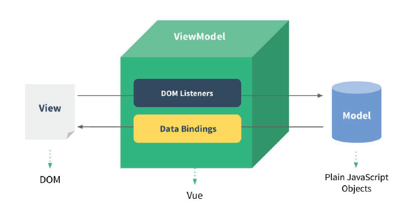

# Vue 基础

## 1.初识 Vue

1. 想让 Vue 工作，就必须创建一个 Vue 实例，且要传入一个配置对象
2. root 容器里面的代码依然符合 html 规范，只不过混入了一些特殊的 Vue语法
3. root 容器里面的代码被称为**Vue模板**
4. Vue实例和容器是一一对应的
5. 真实开发中只有一个Vue实例，并且会配合着组件一起使用
6. { { xxx } } 中的 xxx 要写 js表达式，并且会配合着组件一起使用
7. 一但 data 中的数据发生改变，那么页面中用到该数据的地方也会**自动更新**

注意区分：

- 表达式：一个表示会产生一个值，可以放在任何一个需要值的地方
  - a
  - a+b
  - fn（1）
  - x === y ? 'a' : 'b'

- js 代码（语句）
  - if（）{ }
  - for （）{ }

## 2.模板语法

Vue模板语法有2大类：

### 插值语法

功能：用于**解析标签体**内容

写法：双花括号`{{}}`，里面写 js 表达式，且可以直接读取到 data 中的所有属性

### 指令语法

功能：用于**解析标签**（包含 标签属性、标签体内容、绑定事件....）

例如，**`v-bind:href = "xxx"`** 或简写为 **`:href = "xxx"`**，xxx为 js 表达式，也可以直接读取到 data 里面中的所有属性


## 3.数据绑定

Vue中有两种数据绑定的方式：

1. **单向绑定（v-bind）**：数据只能从data流向页面

   **`v-bind`**，可以简写为 **:**

2. **双向绑定（v-model）**：数据不仅能从data流向页面，也可以从页面流向data

   - 双向绑定一般都应用在 **表单类** 元素上（input、select ....）
   - **`v-model:value`**，可以简写为 **`v-model`**，因为 v-model **默认收集**的就是 **value** 值


## 4.el 和 data

el 和 data 有两种写法：

**（1）el的2种写法：**

- new Vue 时候 **配置 el 属性**
- 先创建 Vue 实例，随后再通过 **`vm.$mount('#root')`** 指定 el 的值

**（2）data的2种写法：**

- 对象式
- **函数式**

为什么组件实例对象`data`必须是一个函数？

- 目的是为了防止多个组件实例对象之间共用一个`data`，产生数据污染，每次复用组件的时候，都会返回一份新的`data`。
- 采用函数的形式，`initData`时会将其作为工厂函数都会返回全新`data`对象

由Vue管理的函数，<strong style="color:#DD5145">不能写箭头函数</strong>，不然 this 就不再是 Vue 实例了

```html
<!DOCTYPE html>
<html>
    <head>
        <meta charset="UTF-8" />
        <title>el与data的两种写法</title>
        <!-- 引入Vue -->
        <script type="text/javascript" src="../js/vue.js"></script>
    </head>

    <body>
        <div id="root">
            <h1>你好，{{name}}</h1>
        </div>
    </body>

    <script type="text/javascript">
        Vue.config.productionTip = false // 阻止 vue 在启动时生成生产提示。

        // ----------------------el的两种写法-------------------------
        // const v = new Vue({
        // 	//el:'#root',   // 第一种写法
        // 	data: {
        // 		name:'cess'
        // 	}
        // })
        // console.log(v)
        
        // v.$mount('#root') // 第二种写法

        // ----------------------data的两种写法-----------------------
        new Vue({
            el: '#root',
            // data的第一种写法：对象式
            // data:{
            // 	name:'cess'
            // }

            //data的第二种写法：函数式
            data() {
                console.log('@@@', this) // 此处的this是Vue实例对象
                return {
                    name: 'cess'
                }
            }
        })
    </script>
</html>
```


## 5.数据代理

### Object.defineProperty 方法

```javascript
let number = 18
let person = {
    name: '张三',
    gender: '男'
}

Object.defineProperty(person, 'age', {
    // value: 18,
    // enumerable: true,      // 控制属性是否可以枚举，默认值是false
    // writable: true,        // 控制属性是否可以修改，默认值是false
    // configurable: true,    // 控制属性是否可以被删除，默认值是false

    // 当有人读取person的age属性时，get函数（或getter）就会被调用，且返回值就是age的值
    get() {
        console.log('有人读取age属性')
        return number
    },
    // 当有人修改person的age属性时，set函数（或setter）就会被调用，且会收到修改的具体值
    set(value) {
        console.log('有人修改age属性，且值为', value)
        number = value
    }
})
```

### Vue中的数据代理

1. Vue中的数据代理
   - 通过 **Vue对象** 来代理 data 对象中属性的**操作**（读/写）

2. Vue中数据代理的优点
   - 更加方便的操作 data 中的数据

3. 基本原理
   - 通过 **`Object.defineProperty()`** 把 **data** 对象中**所有属性**添加到 **vm** 上
   - 为每一个添加到 vm 上的属性，都指定一个 **getter / setter**
   - 在 getter / setter 内部去操作（读/写）data 中对应的属性

> 1. 先加工 data（加工一下就可以做 **响应式** 了，即数据变了，页面也跟着变）
> 2. **vm._data = data**


## 6.事件处理

### 事件的基本使用

> 1. 使用 **v-on:xxx** ，可以简写为 **@xxx** ，绑定事件，其中xxx是 **事件名**
> 2. 事件的回调函数需要配置在 **methods** 对象中，最终会在**vm**上
> 3. **methods** 中配置的函数，<strong style="color:#DD5145">不要使用箭头函数</strong>，否则 this 的指向就不是 vm 了
> 4. methods 中配置的函数，都是被 Vue 所管理的函数，this 的指向的 vm 或 组件实例对象
> 5. **`@click="demo"`** 和 **`@click="demo($event)"`** 效果一样，但后者可以传入参数

获取事件对象，方法参数传递 **\$event** 。注意在事件中要使用 **$** 符号

```html
<button @click="Event($event)">事件对象</button>
```

### 事件参数传递

vue绑定事件的有时候需要传递很多参数，在此整理几种传递方式

**1. 默认传参**

```markup
<input @change="handleChange($event)"></input>
```

或(第一个参数会默认传进去)

```markup
<input @change="handleChange"></input>
```

**使用：**

```js
handleChange(event){
    console.log(event)
}
```

**2. 赋值传参**

如果手动赋值或覆盖掉默认的参数

```markup
<input @change="handleChange('hello')"></input>
```

**使用：**

```js
handleChange(event){
    console.log(event) // hello
}
```

**3. 混合传参**

当需要使用默认值和手动传参同事出现时一般使用这种方式

```markup
<input @change="handleChange($event, 'hello')"></input>
```

**使用：**

```js
handleChange(event, val){
    console.log(event, val)
}
```

**4. 多默认值混合传参**

当默认参数有多个是，使用上述方式同样会出现问题，这时就需要使用本方式

```markup
<input @change="handleChange(arguments, 'hello')"></input>
```

**使用：**

```js
handleChange(args, val){
    console.log(args, val)
}
```


### 事件类型

| 事件类型   | 描述             |
| ---------- | ---------------- |
| click      | 鼠标点击         |
| mouseenter | 鼠标经过         |
| mouseleave | 鼠标离开         |
| mousemove  | 鼠标移动         |
| keydown    | 键盘按下触发     |
| keyup      | 键盘抬起触发     |
| input      | 输入事件         |
| focus      | 获得焦点         |
| blur       | 失去焦点         |
| change     | 内容发生变化触发 |

### 常见的事件修饰符

| 修饰符        | 描述                                                         |
| ------------- | ------------------------------------------------------------ |
| **`prevent`** | 阻止**默认事件**（防止执行预设的行为）                       |
| **`stop`**    | 阻止**事件冒泡**                                             |
| **`once`**    | 事件只触发一次                                               |
| capture       | 捕获模式，当元素发生冒泡时，先触发带有该修饰符的元素。若有多个该修饰符，则由外而内触发。 |
| self          | 只有 event.target 是当前操作的元素时才触发事件，即只会触发自己范围内的事件，不包含子元素 |
| passive       | 事件的默认行为立即执行，无需等待事件回调执行完毕             |

**键盘事件**：

> 1. **Vue中常用的按键**
>    - 回车 enter、删除 delete（捕获 “删除” 和 “退格” 键）、退出 esc、空格 space
>    - 换行 tab（**必须配合keydown使用**）、上 up、下 down、 左 left、右 right
> 2. Vue提供别名的按键，可以使用按键，可以使用按键原始的key值去绑定，但注意要转为 kebab-case（短横线命名）
> 3. 系统修饰键（用法特殊）：ctrl、alt、shift、meta
>    - 配合 keyup 使用：按下修饰键的同时，再按下其他键，随后释放其他键，事件才被触发
>    - 配合 keydown 使用：正常触发事件
> 4. 也可以使用 keyCode 去指定具体的按键（不推荐）
> 5. Vue.config.keyCodes.自定义键名 = 键码，也可以去定制按键别名（不推荐）

## 7.计算属性 computed

**计算属性 computed：**

1. 定义

   要用的属性不存在，要通过 **已有的属性** 计算得来

2. 原理

   底层借助了 **Object.defineproperty** 方法来提供的 getter 和 setter

3. get函数什么时候执行？

   - **初次读取**时会执行一次
   - 当依赖的数据**发生变化**时会被再次调用

4. 优势

   与 methods 实现对比，内部有<strong style="color:#DD5145">缓存机制（复用）</strong>，效率更高，调式方便

5. 注意

   - 计算属性最终会出现在**vm**上，直接读取使用即可
   - 如果计算属性要被修改，那必须写 **set函数** 去 **响应修改**，且 set 中要引起计算时依赖的数据发生变化

**computed 与 watch 之间的区别：**

- computed 能完成的功能，watch 都可以完成
- watch 能完成的功能，computed 则不一定能完成，例如，watch可以进行异步操作

两个重要的小原则：

1. 所有**被Vue管理**的函数，最好写成**普通函数**，这样 this 的指向才是 vm 或 组件实例对象
2. 所有**不被Vue管理**的函数（定时器的回调函数、ajax的回调函数、promise的回调函数等），<br>最好写成**箭头函数**，这样 this 的指向才是 vm 或 组件实例对象


## 8.侦听属性 watch

**监视（侦听）属性 watch：**

1. 当被监视的属性**变化**时，回调函数 **handler ( )** 自动调用，进行相关操作
2. 监视的属性**必须存在**，才能进行监视
3. watch 中的配置**`immediate：true`**，初始化时，**立即**让 handler 调用一下
4. 两种监视写法：
   - （1）new Vue 时传入 **watch 配置对象**
   - （2）通过 **vm.\$watch** 监视（函数写法）

注意：

- Vue 中所管理的 **函数 **不建议使用 **箭头函数**
- methods中、computed中、简写的时候、监视属性中的 **handler** 都是 Vue 管理的

```html
<title>天气案例_监视属性</title>
<script type="text/javascript" src="../js/vue.js"></script>

<div id="root">
    <h2>今天天气很{{info}}</h2>
    <button @click="changeWeather">切换天气</button>
</div>

<script type="text/javascript">
    Vue.config.productionTip = false
    const vm = new Vue({
        el: '#root',
        data: { isHot: true },
        computed: {
            info() { return this.isHot ? '炎热' : '凉爽' }
        },
        methods: {
            changeWeather() { this.isHot = !this.isHot }
        },
        // 方式一
        /* watch:{		
			isHot:{
				immediate:true,
				handler(newValue,oldValue){
					console.log('isHot被修改了',newValue,oldValue)
				}
			}
		} */
    })
    
    // 方式二
    vm.$watch('isHot', {		
        immediate: true, // 初始化时让handler调用一下
        // handler什么时候调用？当isHot发生改变时
        handler(newValue, oldValue) {
            console.log('isHot被修改了', newValue, oldValue)
        }
    })
</script>
```

### 深度监视（deep）

1. Vue中的 watch 默认不监测对象内部值的改变（一层）
2. watch 中的配置 **【deep：true】** 可以监测 **对象内部值** 的改变（**多层**）

- Vue **自身可以监测** 对象内部值的改变，但 Vue 中提供的 watch 默认不可以
- 使用 watch 时根据数据的具体结构，决定是否采用深度监视

```javascript
// 09_src_TodoList_本地存储-案例 -- App组件中局部代码
watch: {
    // 简写形式
    /* todos(value) {
		localStorage.setItem('todos', JSON.stringify(value))
    }, */
    
    // 完整形式，开启深度监视，可以监测到内层数据的变化
    todos: {
		deep: true,
		handler(value) {
			localStorage.setItem('todos', JSON.stringify(value))
        },
    },
},
```

### Vue监视数据的原理

1. Vue 会监视 data 中 **所有层次** 的数据

2. 如何监测 **对象** 中的数据？

通过 **setter** 实现监测，且要在 **new Vue ( )** 时就传入要监测的数据

- 对象中后追加的属性，Vue 默认不做 **响应式处理**
- 如需给后添加的属性做响应式，请使用如下API：
  - **`Vue.set (target, propertyName/index, value)`** 或
  - **`vm.$set (target, propertyName/index, value)`**

3. 如何监测 **数组** 中的数据？

通过 **包裹的数组** 更新元素的方法实现，本质就是做了两件事：

- 调用原生对应的方法对数组进行**更新**
- **重新解析**模板，进而更新页面

4. 在 Vue 中 **修改数组** 中的某个元素一定要使用如下方法：

- 使用API：

  **push（）**、**pop（）**、**shift（）**、**unshift（）**、**splice（）**、**sort（）**、**reverse（）**

- **`Vue.set()`** 或 **`vm.$set()`**

<strong style="color:#DD5145">特别注意</strong>：Vue.set（） 或 vm.\$set（） **不能 **给 vm 或 vm的 **根数据对象（vm._data）** 添加属性


## 9.绑定样式

1. **class 样式**

写法 **`:class="xxx"`** ，其中xxx可以是字符串、对象、数组

- **字符串**写法适用于：类名不确定、要动态获取
- **对象**写法适用于：要绑定多个样式，个数不确定，名字也不确定
- **数组**写法适用于：要绑定多个样式，个数确定，名字也确定，但不确定用不用

```vue
<div :class="{ active: isActive }"></div>
```

上面的语法表示 `active` 是否存在取决于数据属性 `isActive` 的真假值。此外，`:class` 指令也可以和一般的 `class` attribute 共存

可以给 `:class` 绑定一个数组来渲染多个 CSS class

```vue
<div :class="[activeClass, errorClass]"></div>
```

在数组语法中也可以使用对象语法：

```vue
<div :class="[{ active: isActive }, errorClass]"></div>
```


2. **style 样式**

- **`:style="{ fontSize: xxx }"`** ，其中xxx是动态变值
- **`:style=[a, b]`** 其中a、b是**样式对象**，样式对象里面的key不能乱写，例如 backgroundColor、fontSize，

```vue
<div :style="{ color: activeColor, fontSize: fontSize + 'px' }"></div>
```


## 10.条件渲染

### v-if

- 写法：**v-if="表达式"**、**v-else-if="表达式"**、**v-else**
- 适用于：**切换频繁较低**的场景
- 特点：不展示的DOM元素之间**被移除**
- 注意：v-if 可以和 v-else-if、v-else 一起使用，但要求结构不能被 “打断”
- v-if 可以与 **template** 配合使用

```vue
<template v-if="isShow">
    <p v-for="item in items">
</template>
```

> 不能和 v-show 的原因应该是，v-show 是 display 隐藏，但是实际渲染后根本没有 templete 节点，自然无效了

v-for 与 v-if 的优先级?

- v-for 和 v-if 同时使用，有一个先后运行的优先级，v-for 比 v-if 优先级更高。
- 这就说明在 v-for 每次的循环赋值中每一次调用 v-if 的判断，所以不推荐 v-if 和 v-for 在同一个标签中同时使用。

### v-show

- 写法：**v-show="表达式"**
- 适用于：**切换频率较高**的场景
- 特点：不展示的DOM元素不会被移除，仅仅是使用样式**隐藏**掉
- **注意**：使用 v-if 的时候，元素可能无法获取到，而使用 v-show 一定可以获取到

### 二者区别

- 共同点：都是动态显示 DOM 元素，都可以控制 DOM 元素的显示和隐藏

- 区别点：

  - v-if 是直接将 DOM 元素从页面删除，再次切换需要重新渲染页面
  - v-show 只是改变 display 属性，DOM 元素并未消失，切换时不需要重新渲染页面

  - v-if 是动态的向 DOM 树内添加或者删除 DOM 元素
  - v-show 是通过设置 DOM 元素的 display 样式属性控制显示
  - v-if 切换有一个局部编译/卸载的过程，切换过程中合适地销毁和重建内部的事件监听和子组件
  - v-show 只是简单的基于 CSS 切换

性能消耗：

- v-if 有更高的切换消耗
- v-show 有更高的初始渲染消耗

使用场景：

- v-if 适合运营条件不大可能改变
- v-show 适合频繁切换


## 11.列表渲染

**v-for 指令：**

1. 用于展示列表数据
2. 语法：**`v-for="(item, index) in xxx   :key="yyy"`**，yyy 最好是数据的**唯一标识**
3. 可遍历：数组、对象、字符串、指定次数

**1.key的原理，index作为key**


**2.key的原理，id作为key（id为数据的唯一标识）**


### 面试题

react、vue 中的 key 有什么作用？（key的内部原理）

#### 虚拟DOM中key的作用？

- key 是虚拟DOM对象的标识，当数据发生变化时，Vue 会根据【新数据】生成【新的虚拟DOM】, <br>随后 Vue 进行【新虚拟DOM】与【旧虚拟DOM】的差异比较，比较规则如下：

**对比规则：**

1. 旧虚拟DOM中找到了与新虚拟DOM相同的 key
   - 若虚拟DOM中内容没变, 直接使用之前的真实DOM！
   - 若虚拟DOM中内容变了, 则生成新的真实DOM，随后替换掉页面中之前的真实DOM。

2. 旧虚拟DOM中未找到与新虚拟DOM相同的key
   - 创建新的真实DOM，随后渲染到到页面。


#### 用index作为key可能会引发的问题？

1. 若对数据进行：逆序添加、逆序删除等破坏顺序操作:
   - 会产生没有必要的真实DOM更新 ==> 界面效果没问题, 但**效率低**。

2. 如果结构中还包含**输入类的DOM**：
   - 会产生**错误DOM更新** ==> 界面有问题。


#### 开发中如何选择key?

1. 最好使用每条数据的**唯一标识**作为key, 比如id、手机号、身份证号、学号等唯一值。
2. 如果不存在对数据的逆序添加、逆序删除等破坏顺序操作，仅用于渲染列表用于展示，使用index作为key是没有问题的。


## 12.收集表单数据

收集表单数据：

- 若 **`<iniput type="text"/>`**，则 v-model 收集的是 value 值，用户输入的就是 value 值

- 若 **`<iniput type="radio"/>`**，则 v-model 收集的是 value 值，且要给标签配置 value 属性

- 若 **`<iniput type="checkbox"/>`**

  1. 没有配置 input 的 value 属性，那么收集的就是 checked（勾选 或 未勾选，布尔值）

  2. 配置 input 的 value 属性：

     （1）v-model 的初始值是非数组，那么收集的就是 checked（勾选 或 未勾选，布尔值）

     （2）v-model 的初始值是数组，那么收集的就是 value 组成的数组

备注：v-model 的三个修饰符：

- **.lazy**：失去焦点再收集数据
- **.number**：输入字符串转为有效的数字
- **.trim**：除去首尾空格


## 13.内置指令

### 常用指令

| 指令    | 说明                                 |
| ------- | ------------------------------------ |
| v-bind  | 单向绑定解析表达式，可以简写为 **:** |
| v-on    | 绑定事件监听，可简写为 **@**         |
| v-model | 双向数据绑定                         |
| v-for   | 遍历数组、对象、字符串               |
| v-if    | 条件渲染（动态控制节点是否存在）     |
| v-else  | 条件渲染（动态控制节点是否存在）     |
| v-show  | 条件渲染（动态控制节点是否展示）     |

### v-if 和 v-show的区别

共同点：

都是动态显示 DOM 元素，都可以控制 DOM 元素的显示和隐藏

区别点：

- v-if 直接将 DOM 元素从页面删除，再次切换需要重新渲染页面
- v-show 只是改变 display 属性，DOM 元素并未消失，切换时不需要重新渲染页面

- v-if 是动态的向 DOM 树内添加或者删除 DOM 元素
- v-show 是通过设置 DOM 元素的 display 样式属性控制显示

- v-if 切换有一个局部编译/卸载的过程，切换过程中合适地销毁和重建内部的事件监听和子组件
- v-show 只是简单的基于 css 切换

性能消耗：

- v-if 有更高的切换消耗
- v-show 有更高的初始渲染消耗

使用场景：

- v-if 适合运营条件不大可能改变
- v-show 适合频繁切换

v-show 由false变为true的时候不会触发组件的生命周期

v-if 由false变为true的时候，触发组件的beforeCreate、create、beforeMount、mounted钩子，由true变为false的时候触发组件的beforeDestory、destoryed方法

v-for 与 v-if 的优先级?

v-for 和 v-if 同时使用，有一个先后运行的优先级，v-for 比 v-if 优先级更高，<br>这就说明在v-for 每次的循环赋值中每一次调用 v-if 的判断，所以不推荐 v-if 和 v-for 在同一个标签中同时使用。

### v-model的原理

v-model 本质上不过是语法糖官方有说到，v-model 的原理其实是背后有两个操作：

1. v-bind 绑定 value 属性的值
2. v-on 绑定 input 事件监听到函数中，函数会获取最新的值赋值到绑定的属性中

- 作用在表单元素上`v-model="message"`等同于`:value="message" @input="message = $event.target.value"`

- 作用在组件上, 本质是一个父子组件通信的语法糖，通过 prop 和 \$.emit 实现, 

  等同于`:value="message" @input=" $emit('input', $event.target.value)"`

v-model 的三个修饰符：

- **lazy**：失去焦点再收集数据
- **number**：输入字符串转为有效的数字
- **trim**：除去首尾空格

### v-text 指令

- 作用：向其所在的节点中渲染**文本内容**
- 与插值语法的区别：v-text 会替换掉节点中的内容，{{xxx}} 则不会

### v-html 指令

- 作用：向指定节点中渲染包含 **html结构** 的内容
- 与插值语法的区别：
  1. v-html 会替换掉节点中所有的内容，{{xxx}} 则不会
  2. v-html 可以识别 html 结构
- 严重注意：v-html 有安全性问题：
  1. 在网站上动态渲染任意HTML是非常危险的，容易导致XSS攻击
  2. 一定要在可信的内容上使用 v-html，永远不要用在用户提交的内容上

### v-cloak 指令（没有值）

1. 本质是一个<strong style="color:#DD5145">特殊属性</strong>，**Vue 实例创建完毕并接管容器后**，就会删掉 v-cloak 属性
2. 使用 css 配合 v-cloak 可以**解决网速慢时页面展示出 {{xxx}} 的问题**

```html
<title>v-cloak指令</title>

<style>
    [v-cloak] {
        display:none;
    }
</style>

<div id="root">
    <h2 v-cloak>{{ name }}</h2>
</div>

// 够延迟5秒收到vue.js
<script type="text/javascript" src="http://localhost:8080/resource/5s/vue.js"></script>

<script type="text/javascript">
    console.log(1)
    Vue.config.productionTip = false
    new Vue({
        el:'#root',
        data:{name:'cess'}
    })
</script>
```

### v-once 指令（没有值）

1. v-once 所在节点在**初次动态渲染**后，之后就视为静态内容了
2. 以后数据的改变不会引起 v-once 所在结构的更新，可以**用于优化性能**

```html
<title>v-once指令</title>
<script type="text/javascript" src="../js/vue.js"></script>

<div id="root">
    <h2 v-once>初始化的n值是: {{n}}</h2>
    <h2>当前的n值是: {{n}}</h2>
    <button @click="n++">点我n+1</button>
</div>

<script type="text/javascript">
    Vue.config.productionTip = false
    new Vue({ el: '#root', data: {n:1} })
</script>
```

### v-pre 指令（没有值）

1. **跳过**其所在节点的**编译**过程
2. 可以利用它跳过：没有使用指令语法、没有使用插值语法的节点，会加快编译

```html
<title>v-pre指令</title>
<script type="text/javascript" src="../js/vue.js"></script>

<div id="root">
    <h2 v-pre>Vue其实很简单</h2>
    <h2 >当前的n值是:{{n}}</h2>
    <button @click="n++">点我n+1</button>
</div>

<script type="text/javascript">
    Vue.config.productionTip = false
    new Vue({ el:'#root', data:{n:1} })
</script>
```


## 14.常用修饰符

### 表单修饰符

在我们填写表单的时候用得最多的是`input`标签，指令用得最多的是`v-model`

关于表单的修饰符有如下：

- lazy
- trim
- number

### 事件修饰符

事件修饰符是对事件捕获以及目标进行了处理，有如下修饰符：

- stop
- prevent
- self
- once
- capture
- passive
- native

### 鼠标按钮修饰符

鼠标按钮修饰符针对的就是左键、右键、中键点击，有如下：

- left 左键点击
- right 右键点击
- middle 中键点击

### 键盘修饰符

键盘修饰符是用来修饰键盘事件（`onkeyup`，`onkeydown`）的，有如下：

`keyCode`存在很多，但`vue`为我们提供了别名，分为以下两种：

- 普通键（enter、tab、delete、space、esc、up...）
- 系统修饰键（ctrl、alt、meta、shift...）

###  v-bind 修饰符

v-bind 修饰符主要是为属性进行操作，用来分别有如下：

- async
- prop
- camel

###  应用场景

根据每一个修饰符的功能，我们可以得到以下修饰符的应用场景：

- .stop：阻止事件冒泡
- .native：绑定原生事件
- .once：事件只执行一次
- .self ：将事件绑定在自身身上，相当于阻止事件冒泡
- .prevent：阻止默认事件
- .caption：用于事件捕获
- .once：只触发一次
- .keyCode：监听特定键盘按下
- .right：右键


## 15.scoped 样式

作用：让样式在**局部生效**，防止冲突

写法：**`<style scoped>`**


## 15.Diff 算法

**虚拟 DOM 就是一个普通的 js 对象**，用来描述真实 DOM 结构的 js 对象。

- 虚拟DOM可以很好地**跟踪**当前DOM**状态**，因为它会根据当前数据生成一个描述当前DOM结构的虚拟DOM，然后**数据发送变化**时，又会生成一个新的虚拟DOM，而这**两个新旧虚拟DOM**保存了变化前后的状态。
- 然后通过 Diff 算法，**计算**出两个虚拟DOM之间的**差异**，得出一个更新的最优方法（哪些发生改变，就更新哪些）。可以很明显的提升渲染效率以及用户体验

Diff 算法就是用于<strong style="color:#DD5415">比较新旧两个虚拟DOM之间差异</strong>的一种算法。

Diff 比较规则：

1. Diff 比较两个虚拟DOM只会在同层级之间进行比较，不会跨层级进行比较

   

2. Diff 是采用**先序深度优先遍历**的方式进行节点比较的

[参考文章](https://blog.csdn.net/weixin_42707287/article/details/113994483)


## 16.MVVM模型

[MVVM](https://blog.csdn.net/jiahao1186/article/details/121915711)，是Model-View-ViewModel的简写，是M-V-VM三部分组成。它本质上就是 MVC 的改进版。

> MVC模式中，M（Model）是指业务模型，V（View）是指用户界面，C（Controller）则是控制器。
>
> 其中，View的定义比较清晰，就是用户界面

MVVM 就是将其中的 View 的状态和行为抽象化，其中ViewModel将视图 UI 和业务逻辑分开，它可以取出 Model 的数据同时帮忙处理 View 中由于需要展示内容而涉及的业务逻辑。

MVVM的核心思想：是关注Model的变化。让MVVM框架利用自己的机制自动更新DOM（即所说的View视图），也就是所谓的**数据-视图**分离。

MVVM采用：**双向数据绑定。**

- View 中数据变化将自动反映到 Model 上，反之，Model 中数据变化也将会自动展示在页面上。
- ViewModel 就是View和Model的桥梁。
- ViewModel 负责把Model的数据同步到 View 显示出来，还负责把 View 的修改同步回到Model。

> - **M**：**模型**（Model）：对应 **data** 中的 **数据**
> - **V**：**视图**（View）：**模板代码**
> - **VM**：**视图模型**（ViewModel）：**Vue实例对象（vm）**



> - data 中的所有的属性，最后都出现了 vm 身上
> - vm 身上所有的属性 以及 Vue原型上所有的属性，在 Vue 模板中都可以直接使用

优点：

1. Controller简洁清晰（controller层，与前端（界面-客户端）交互）
2. 方便测试
3. 开发解耦

缺点：

1. 代码量比MVC多
2. 需对每个Controller实现绑定，这是分离不可避免的工作量

例如：

