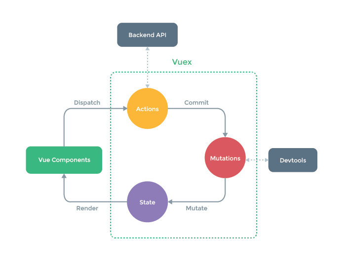

# Vuex 状态管理库

Vue组件间通信方式：

1. props，只适用于：<strong style="color:#DD5145">父组件 ===> 子组件</strong>
2. 自定义事件，只适用于：<strong style="color:#DD5145">子组件 ===> 父组件</strong>
3. 全局事件总线（eventBus），适用于<strong style="color:#DD5145">任意组件间通信</strong>
4. 消息订阅与发布（需要第三方库），适用于<strong style="color:#DD5145">任意组件间通信</strong>
5. 插槽 slot，只适用于：<strong style="color:#DD5145">父组件 ===> 子组件</strong>
6. vuex，适用于<strong style="color:#DD5145">任意组件间通信</strong>
7. pinia，适用于<strong style="color:#DD5145">任意组件间通信</strong>
8. provide 与 inject，实现 <strong style="color:#DD5145">跨层组件通信</strong>
9. .......


## 理解 Vuex

**1.Vuex是什么？**

概念：专门在 Vue 中实现集中式 **状态（数据）管理** 的一个 **Vue 插件**，对 Vue 应用中多个组件的共享状态进行集中式的管理（读/写），也是一种组件间通信的方式，且适用于<strong style="color:#DD5145">任意组件间通信</strong>。

**2.什么时候使用 Vuex？**

- 多个组件依赖于同一状态
- 来自不同组件的行为需要变更同一状态

**3.全局事件总线 实现多组件间数据共享：**


**4.Vuex 实现多组件间数据共享：**


## Vuex 工作原理

- Vuex 由三个组件构成：<strong style="color:#9370DB">State</strong>（状态即数据），<strong style="color:#DC143C">Mutations</strong>（修改，加工维护），<strong style="color:orange">Actions</strong>（动作）
- Vuex 中数据存储在 **state**，通过 **store** 来调用 <strong style="color:#3AB882">dispatch</strong> 和 <strong style="color:#3AB882">commit</strong> 
- Devtools：指的是官方提供的 Vuex 调试工具



**工作流程：**

- **dispatch** 传入2个参数，第一个是**动作(内容)**，第二个是**传入的参数**，<br>调用完之后，dispatch 带的参数就到达了 Actions（执行动作对象）
- Actions 是一个 obj 的对象，在 Actions 中有个 key 和 dispatch 中的动作相对应，<br>Actions中的 key 是一个函数，并引起该函数的调用，并且能接收到 dispatch 传过来的值，<br>在 key 的函数中调用 **commit()（提交函数）**，第一个参数还是 key 的字符串，第二个参数是传入的值
- 传到了 Mutation 对象中，结构类型是 key-value 形式，在其中有一个 key 是从 Action 中传过来的，<br>value 的类型是一个函数 function，参数为整个数据（state）和一个 commit 传入的值，<br>然后经过 mutate，state 就发生了变化，并且 vuex 重新解析组件，然后再去渲染（render）


## 搭建 vuex 环境

1. 下载安装 vuex

   ```sh
   npm i vuex@3
   npm install vuex@3 --save
   yarn add vuex@3 --save
   ```

> - vue2 中，要使用vuex的3版本
> - vue3 中，要使用vuex的4版本

2. 创建文件：**`src/store/index.js`**

```javascript
/* 该文件用于创建Vuex中最为核心的store */

import Vue from 'vue' // 引入Vue
import Vuex from 'vuex' // 引入Vuex
Vue.use(Vuex) // 使用Vuex插件，使用之后，App组件中创建vm时可以传入store配置项了

const state = {}		 // 准备 state——用于存储数据
const mutations = {}	 // 准备 mutations——用于操作数据（state）
const actions = {}		 // 准备 actions——用于响应组件中的动作
const getters = {}		 // 准备 getters——用于将 state中的数据进行加工，类似于computed

// 创建并暴露store
export default new Vuex.Store({
    state, 
    actions,
    mutations,
    getters
})
```

3. 在 `src/main.js` 中 **创建 vm 时传入 store 配置项**

```javascript
// 直接引入store即可（Vuex在store文件夹中的index.js文件里面引入并使用防止因变量提升而报错）
import store from './store'

new Vue({
    el: '#app',
    render: h => h(App),
    store,		// 配置项挂载store
})
```

## 核心概念

vuex 的核心思想：组件数据统一管理（统一存储，统一修改）

vuex 的基本使用，vuex 中一共有五个状态 **state**、**mutation**、**action**、**getter**、**module**

### 1.state

<strong style="color:#DD5145">保存组件的数据，数据是响应式的，当数据改变时驱动视图更新</strong>

- 提供唯一的公共数据源，所有共享的数据统一放到 store 的 state 进行储存，相似与 data
- 在 vuex 中 state 中定义数据，可以在任何组件中进行调用

```js
import Vue from 'vue'
import Vuex from 'vuex'

Vue.use(Vuex)

export default new Vuex.Store({
    // 数据，相当于data
    state: {
        name: "张三",
        age: 18,
        count: 0
    },
})
```

如何使用：

- 方法一：在标签中直接使用

```html
<p>{{$store.state.name}}</p>
<p>{{$store.state.age}}</p>
```

- 方法二： **`$store.state.数据`**

```js
this.$store.state.count
```

- 方法三：从 vuex 中按需导入 mapState 函数

```js
import { mapState } from "vuex";
```


### 2.mutation

<strong style="color:#DD5145">处理 state 中的数据，更改 state 的唯一方法是，提交 mutation（只能处理同步的场景）</strong>

- Vuex 中的 mutation 非常类似于事件：每个 mutation 都有一个字符串的**事件类型 (type)**和一个**回调函数 (handler)**。
- 这个回调函数就是我们实际进行状态更改的地方，并且它会接受 state 作为第一个参数：

如何使用：

- 方法一：使用 <strong style="color:#DD5145">commit（提交）</strong> 触发 Mutation 操作，`store/index.js`中先定义（mutations）

```js
// mutations是固定的，用于定义修改数据的动作（函数）
mutations: {
    // 定义一个mutation，用于累加count值，ADDCOUNT这个名字是自定义的
    ADDCOUNT (state, value) {
        // state 表示Store中所有数据，value 表示组件中传递过来的参数（数据）
        state.count += value
        console.log('mutations中的ADDCOUNT被调用了')
    }
}
```

组件中再使用 **`this.$store.commit("mutations中的方法名", 参数)`**

```js
methods:{
    // increment是触发事件的自定义方法名
    increment() {
        // 通过commit触发mutation，修改state中的count的值
        this.$store.commit('addCount', 1)	// 加一
    }
}
```

- 方法二：使用辅助函数 <strong style="color:#DD5145">mapMutations</strong> 进行操作，具体方法同上

### 3.Action

<strong style="color:#DD5145">处理异步任务，但是不可以修改数据，处理成功后把数据提交给 mutations，进而更新 state</strong>

- Action 和 Mutation 相似，一般不用 Mutation 异步操作，若要进行异步操作，使用 Action
- 原因：为了方便 devtools 打个快照存下来，方便管理维护。
- 所以说这个**只是规范**，而**不是逻辑的不允许**，只是为了让这个**工具**能够追踪数据变化而已

如何使用：

- 方法一：直接使用 <strong style="color:#DD5145">dispatch（派发）</strong> 触发 Action 异步任务，`store/index.js`中先定义（actions）

```js
// actions是固定的，用于定义异步操作的动作（函数）
mutations: {
    ADDCOUNT (state, value) {
        state.count += value
    }
},

actions: {
    // 模拟异步操作，定义一个action，addCountWait这个名字是自定义的
    addCountWait(context, value) {
        console.log('actions中的addCountWait被调用了')
        setTimeout(() => {
            context.commit('ADDCOUNT', value)
        }, 1000)
    }
}
```

actions 函数的参数：

```js
context:{
    state,   等同于store.$state，若在模块中则为局部状态
    rootState,   等同于store.$state,只存在模块中
    commit,   等同于store.$commit
    dispatch,   等同于store.$dispatch
    getters   等同于store.$getters
}

常规写法调用的时候会使用context.commit，但更多的是使用es6的变量解构赋值，也就是直接在参数的
位置写自己想要的属性，如：{commit}。
```

组件中再使用 **`this.$store.dispatch("actions中的方法名", 参数)`**

```js
methods:{
    // incrementWait是触发事件的自定义方法名
    incrementWait() {
        // 触发action(必须调用dispatch方法)
        this.$store.dispatch("addCountWait", 1)	// 等待1s后加一
    }
}
```

- 方法二：使用辅助函数 <strong style="color:#DD5145">mapActions</strong>


### 4.getters

- 类似于vue中的 **computed** 计算属性，需要基于 state 中的数据进行加工处理，形成一份新的的数据，给模板使用
- getters 的主要应用场景：模板中需要的数据和 state 中的数据不完全一样，简化仓库中的数据

在 `store/index.js` 中追加 getters 配置，组件中再使用

```javascript
...
// 准备 getters，用于将 state中的数据进行加工，类似于computed
const getters = {
    // 定义一个getter，放大count值10倍，bigCount这个名字是自定义的
	bigCount(state){
		return state.count * 10
	}
}

// 创建并暴露store
export default new Vuex.Store({
	...
	getters
})
```

如何使用：

- 方法一：组件中读取数据 **`$store.getters.bigCount`**

```js
caleList () {
  // 注意：获取getters的值，不需要加括号（当属性使用）
  return this.$store.getters.bigCount
}
//在组件中，则要写在计算属性中，
computed: {
    bigCount () {
        // 注意：获取getters的值，不需要加括号（当属性使用）
        return this.$store.getters.bigCount
    }
}
```

- 方法二：使用 mapGetters 获取 getters 里面的状态

```js
computed: {
    // 借助mapGetters生成计算属性，从getters中读取数据（数组写法）
    ...mapGetters(['bigCount']),
}
```


## 辅助函数（四个map方法）

**提前引入：**

```javascript
import { mapState, mapGetters, mapMutations, mapActions } from 'vuex'
```

1. **mapState **方法：用于帮助 **映射** state 中的数据为**计算属性**

```javascript
computed: {
  	// 借助mapState生成计算属性：sum、school、subject（对象写法）
  	...mapState({sum:'sum',school:'school',subject:'subject'}),

  	// 借助mapState生成计算属性，从state中读取数据（数组写法）
  	...mapState(['sum','school','subject']),
},
```

> 在**开发者工具**中，将使用 **mapState** 映射出的计算属性，放在了 **vuex bindings**。

2. **mapGetters** 方法：用于帮助 **映射** getters 中的数据为**计算属性**

```javascript
computed: {
    //借助mapGetters生成计算属性：bigSum（对象写法）
    ...mapGetters({bigSum:'bigSum'}),

    //借助mapGetters生成计算属性，从getters中读取数据（数组写法）
    ...mapGetters(['bigSum'])
},
```

3. **mapMutations** 方法：用于帮助生成与mutations对话的方法，即包含 **\$store.commit(xxx)** 的函数  

```javascript
methods:{
    //靠mapActions生成：increment、decrement（对象形式）
    ...mapMutations({increment:'JIA',decrement:'JIAN'}),
    
    //靠mapMutations生成：JIA、JIAN（对象形式）
    ...mapMutations(['JIA','JIAN']),
}
```

> 注意：**mapActions** 与 **mapMutations** 使用时，若需要传递参数，需要**在模板中绑定事件时传递好参数**，否则参数是**事件对象**

4. **mapActions** 方法：用于帮助生成与 actions 对话的方法，即包含 **\$store.dispatch(xxx)** 的函数  

```javascript
methods:{
    //靠mapActions生成：incrementOdd、incrementWait（对象形式）
    ...mapActions({incrementOdd:'jiaOdd',incrementWait:'jiaWait'})

    //靠mapActions生成：incrementOdd、incrementWait（数组形式）
    ...mapActions(['jiaOdd','jiaWait'])
}
```


## 模块化&命名空间

1. 目的：让代码更好维护，让多种数据分类更加明确

2. 修改 store 文件夹里的 index.js

   ```javascript
   ...
   
   // 求和相关的配置
   const countOptions = {
   	namespaced: true,	// 开启命名空间
   	state: {x:1},
   	mutations: { ... },
   	actions: { ... },
   	getters: { ... }
   }
                 
   // 人员管理相关的配置
   const personOptions = {
   	namespaced: true,	// 开启命名空间
   	state: { ... },
   	mutations: { ... },
   	actions: { ... },
   	getters: { ... }
   }
   
   export default new Vuex.Store({
   	modules: {
   		countAbout: countOptions,
   		personAbout, // k v 一致时，可省略
   	}
   })
   ```

   为了解决**不同模块命名冲突的问题**，将不同模块的 **namespaced: true**，之后在不同页面中引入 getters、actions、mutations 时，需要加上所属的模块名

3. 开启命名空间后，组件中读取 **state** 数据 

   ```javascript
   // 方式一：自己直接读取
   this.$store.state.personAbout.personList
   // 方式二：借助 mapState读取
   ...mapState('countAbout',['sum','school','subject']),
   ```

4. 开启命名空间后，组件中读取 **getters** 数据

   ```javascript
   //方式一：自己直接读取
   this.$store.getters['personAbout/firstPersonName']
   //方式二：借助 mapGetters读取
   ...mapGetters('countAbout',['bigSum'])
   ```

5. 开启命名空间后，组件中调用 **dispatch**

   ```javascript
   //方式一：自己直接dispatch
   this.$store.dispatch('personAbout/addPersonWang',person)
   //方式二：借助 mapActions读取
   ...mapActions('countAbout',{incrementOdd:'jiaOdd', incrementWait:'jiaWait'})
   ```

6. 开启命名空间后，组件中调用 **commit**

   ```javascript
   //方式一：自己直接commit
   this.$store.commit('personAbout/ADD_PERSON',person)
   //方式二：借助 mapMutations读取
   ...mapMutations('countAbout', {increment:'JIA',decrement:'JIAN'})
   ```


## 参考

[Vuex Github地址](https://github.com/vuejs/vuex)、[参考文章](https://blog.csdn.net/qq_56989560/article/details/124706021)、[参考文章](https://devpress.csdn.net/viewdesign/63ff2b5b986c660f3cf90b93.html)、[参考文章](https://blog.csdn.net/jiangjunyuan168/article/details/122640925)、[参考文章](https://blog.csdn.net/qq_41820577/article/details/100530155)