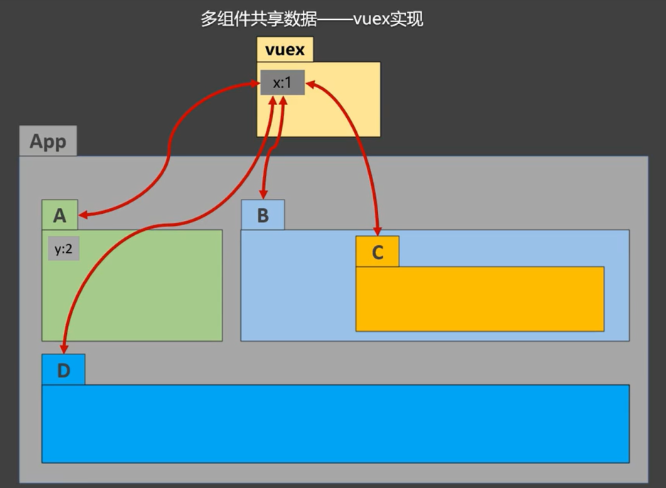

# Vue 核心

## Vue是什么？

一套用于 **构建用户界面** 的 **渐进式** JavaScript 框架

Vue的特点

> - 采用 **组件化** 模式，提高代码复用率，且让代码更好维护
> - **声明式** 编码，让编码人员无需直接操作 DOM，提高开发效率
> - 使用 **虚拟DOM** + 优秀的 **Diff 算法**，尽量复用 DOM节点

学习Vue之前要掌握的JavaScript基础知识？

> - ES6语法规范、ES6模块化
> - 包管理器
> - 原型、原型链
> - 数组常用方法
> - axios、promise

## Diff 算法

[参考文章](https://blog.csdn.net/weixin_42707287/article/details/113994483)

**虚拟 DOM 就是一个普通的 js对象**，用来描述真实 DOM 结构的 js对象

> 虚拟DOM可以很好地**跟踪**当前DOM**状态**，因为它会根据当前数据生成一个描述当前DOM结构的虚拟DOM，然后**数据发送变化**时，又会生成一个新的虚拟DOM，而这**两个新旧虚拟DOM**保存了变化前后的状态。
>
> 然后通过 Diff 算法，**计算**出两个虚拟DOM之间的**差异**，得出一个更新的最优方法（哪些发生改变，就更新哪些）。可以很明显的提升渲染效率以及用户体验

Diff 算法就是用于<strong style="color:#DD5415">比较新旧两个虚拟DOM之间差异</strong>的一种算法

Diff 比较规则：

> 1. Diff 比较两个虚拟DOM只会在同层级之间进行比较，不会跨层级进行比较
>
>    
>
> 2. Diff 是采用**先序深度优先遍历**的方式进行节点比较的


## 1.初识 Vue

> 1. 想让 Vue 工作，就必须创建一个 Vue 实例，且要传入一个配置对象
> 2. root 容器里面的代码依然符合 html 规范，只不过混入了一些特殊的 Vue语法
> 3. root 容器里面的代码被称为**【Vue模板】**
> 4. Vue实例和容器是一一对应的
> 5. 真实开发中只有一个Vue实例，并且会配合着组件一起使用
> 6. { { xxx } } 中的 xxx 要写 js表达式，并且会配合着组件一起使用
> 7. 一但 data 中的数据发生改变，那么页面中用到该数据的地方也会**自动更新**

注意区分：

> - 表达式：一个表示会产生一个值，可以放在任何一个需要值的地方
>   - a
>   - a+b
>   - fn（1）
>   - x === y ? 'a' : 'b'
>
> - js 代码（语句）
>   - if（）{ }
>   - for （）{ }

## 2.模板语法

Vue模板语法有2大类：

### 插值语法

> 功能：用于**解析标签体**内容
>
> 写法：**`{{xxx}}`**，xxx是 js 表达式，且可以直接读取到 data 中的所有属性

### 指令语法

> 功能：用于**解析标签**（包含 标签属性、标签体内容、绑定事件....）
>
> 例如，**`v-bind:href = "xxx"`** 或简写为 **`:href = "xxx"`**，xxx为 js 表达式，也可以直接读取到data里面中的所有属性

## 3.数据绑定

Vue中有两种数据绑定的方式：

> 1. **单向绑定（v-bind）**：数据只能从data流向页面
>
>    **`v-bind`**，可以简写为 **:**
>
> 2. **双向绑定（v-model）**：数据不仅能从data流向页面，也可以从页面流向data
>    
>    - 双向绑定一般都应用在 **表单类** 元素上（input、select ....）
>    - **`v-model:value`**，可以简写为 **`v-model`**，因为 v-model **默认收集**的就是 **value** 值

## 4.el 和 data

el 和 data 有两种写法：

**（1）el的2种写法：**

> - new Vue 时候 **配置 el 属性**
> - 先创建 Vue 实例，随后再通过 **`vm.$mount('#root')`** 指定 el 的值

**（2）data的2种写法：**

> - 对象式
> - **函数式**
>
> 由Vue管理的函数，==**不能写箭头函数**==，不然this就不再是 Vue 实例了

```html
<!DOCTYPE html>
<html>
    <head>
        <meta charset="UTF-8" />
        <title>el与data的两种写法</title>
        <!-- 引入Vue -->
        <script type="text/javascript" src="../js/vue.js"></script>
    </head>

    <body>
        <div id="root">
            <h1>你好，{{name}}</h1>
        </div>
    </body>

    <script type="text/javascript">
        Vue.config.productionTip = false // 阻止 vue 在启动时生成生产提示。

        // ----------------------el的两种写法-------------------------
        // const v = new Vue({
        // 	//el:'#root',   // 第一种写法
        // 	data: {
        // 		name:'cess'
        // 	}
        // })
        // console.log(v)
        
        // v.$mount('#root') // 第二种写法

        // ----------------------data的两种写法-----------------------
        new Vue({
            el: '#root',
            // data的第一种写法：对象式
            // data:{
            // 	name:'cess'
            // }

            //data的第二种写法：函数式
            data() {
                console.log('@@@', this) // 此处的this是Vue实例对象
                return {
                    name: 'cess'
                }
            }
        })
    </script>
</html>
```


## 5.MVVM模型

[MVVM](https://blog.csdn.net/jiahao1186/article/details/121915711)，是Model-View-ViewModel的简写，是M-V-VM三部分组成。它本质上就是 MVC 的改进版。

> MVC模式中，M（Model）是指业务模型，V（View）是指用户界面，C（Controller）则是控制器。
>
> 其中，View的定义比较清晰，就是用户界面

MVVM 就是将其中的 View 的状态和行为抽象化，其中ViewModel将视图 UI 和业务逻辑分开，它可以取出 Model 的数据同时帮忙处理 View 中由于需要展示内容而涉及的业务逻辑。

MVVM的核心思想：是关注Model的变化。让MVVM框架利用自己的机制自动更新DOM（即所说的View视图），也就是所谓的**数据-视图**分离。

> MVVM采用：**双向数据绑定。**
>
> - View 中数据变化将自动反映到 Model 上，反之，Model 中数据变化也将会自动展示在页面上。
> - ViewModel 就是View和Model的桥梁。
> - ViewModel 负责把Model的数据同步到 View 显示出来，还负责把 View 的修改同步回到Model。

> - **M**：模型（Model）：对应 **data** 中的 **数据**
> - **V**：视图（View）：**模板代码**
> - **VM**：视图模型（ViewModel）：**Vue实例对象（vm）**


> - data 中的所有的属性，最后都出现了 vm 身上
> - vm 身上所有的属性 以及 Vue原型上所有的属性，在 Vue 模板中都可以直接使用

优点：

> 1. Controller简洁清晰（controller层，与前端（界面-客户端）交互）
> 2. 方便测试
> 3. 开发解耦

缺点：

> 1. 代码量比MVC多
> 2. 需对每个Controller实现绑定，这是分离不可避免的工作量

例如：


## 6.数据代理

**（1）Object.defineProperty 方法**

```javascript
<script>
    let number = 18
    let person = {
        name: '张三',
        gender: '男'
    }
    
    Object.defineProperty(person, 'age', {
        // value: 18,
        // enumerable: true,      // 控制属性是否可以枚举，默认值是false
        // writable: true,        // 控制属性是否可以修改，默认值是false
        // configurable: true,    // 控制属性是否可以被删除，默认值是false

        // 当有人读取person的age属性时，get函数（或getter）就会被调用，且返回值就是age的值
        get() {
            console.log('有人读取age属性')
            return number
        },
        // 当有人修改person的age属性时，set函数（或setter）就会被调用，且会收到修改的具体值
        set(value) {
            console.log('有人修改age属性，且值为', value)
            number = value
        }
    })
</script>
```

**（2）Vue中的数据代理：**

> 1. Vue中的数据代理
>    - 通过 **Vue对象** 来代理 data 对象中属性的**操作**（读/写）
>
> 2. Vue中数据代理的优点
>    - 更加方便的操作 data 中的数据
>
> 3. 基本原理
>    - 通过 **`Object.defineProperty()`** 把 **data** 对象中**所有属性**添加到 **vm** 上
>    - 为每一个添加到 vm 上的属性，都指定一个 **getter / setter**
>    - 在 getter / setter 内部去操作（读/写）data 中对应的属性

> 1. 先加工 data（加工一下就可以做 **响应式** 了，即数据变了，页面也跟着变）
> 2. **vm._data = data**


## 7.事件处理

### 事件的基本使用

> 1. 使用 **v-on:xxx** ，可以简写为 **@xxx** ，绑定事件，其中xxx是 **事件名**
> 2. 事件的回调函数需要配置在 **methods** 对象中，最终会在**vm**上
> 3. **methods** 中配置的函数，==**不要使用箭头函数**==，否则 this 的指向就不是 vm 了
> 4. methods 中配置的函数，都是被 Vue 所管理的函数，this 的指向的 vm 或 组件实例对象
> 5. **`@click="demo"`** 和 **`@click="demo($event)"`** 效果一样，但后者可以传入参数

获取事件对象，方法参数传递 **\$event** 。注意在事件中要使用 **$** 符号

```html
<button @click="Event($event)">事件对象</button>
```

### Vue中的修饰符

| 修饰符      | 描述                                             |
| ----------- | ------------------------------------------------ |
| **prevent** | 阻止默认事件（常用）                             |
| **stop**    | 阻止事件冒泡（常用）                             |
| **once**    | 事件只触发一次（常用）                           |
| capture     | 使用事件的捕获模式                               |
| self        | 只有 event.target 是当前操作的元素时才触发事件   |
| passive     | 事件的默认行为立即执行，无需等待事件回调执行完毕 |

**键盘事件：**

> 1. **Vue中常用的按键**
>    - 回车 enter、删除 delete（捕获 “删除” 和 “退格” 键）、退出 esc、空格 space
>    - 换行 tab（**必须配合keydown使用**）、上 up、下 down、 左 left、右 right
> 2. Vue提供别名的按键，可以使用按键，可以使用按键原始的key值去绑定，但注意要转为 kebab-case（短横线命名）
> 3. 系统修饰键（用法特殊）：ctrl、alt、shift、meta
>    - 配合 keyup 使用：按下修饰键的同时，再按下其他键，随后释放其他键，事件才被触发
>    - 配合 keydown 使用：正常触发事件
> 4. 也可以使用 keyCode 去指定具体的按键（不推荐）
> 5. Vue.config.keyCodes.自定义键名 = 键码，也可以去定制按键别名（不推荐）

## 8.计算属性

**计算属性 computed：**

> 1. 定义
>
>    要用的属性不存在，要通过 **已有的属性** 计算得来
>
> 2. 原理
>
>    底层借助了 **Object.defineproperty** 方法来提供的 getter 和 setter
>
> 3. get函数什么时候执行？
>
>    - **初次读取**时会执行一次
>    - 当依赖的数据**发生变化**时会被再次调用
>
> 4. 优势
>
>    与 methods 实现对比，内部有 ==**缓存机制（复用）**==，效率更高，调式方便
>
> 5. 注意
>
>    - 计算属性最终会出现在**vm**上，直接读取使用即可
>    - 如果计算属性要被修改，那必须写 **set函数** 去**响应修改**，且 set 中要引起计算时依赖的数据发生变化

**computed 与 watch 之间的区别：**

> - computed 能完成的功能，watch 都可以完成
> - watch 能完成的功能，computed 则不一定能完成，例如，watch可以进行异步操作
>
> 两个重要的小原则：
>
> 1. 所有**被Vue管理**的函数，最好写成**普通函数**，这样 this 的指向才是 vm 或 组件实例对象
> 2. 所有**不被Vue管理**的函数（定时器的回调函数、ajax的回调函数、promise的回调函数等），<br>最好写成**箭头函数**，这样 this 的指向才是 vm 或 组件实例对象

## 9.监视（侦听）属性

**监视属性 watch：**

> 1. 当被监视的属性**变化**时，回调函数 **handler ( )** 自动调用，进行相关操作
> 2. 监视的属性**必须存在**，才能进行监视
> 3. watch 中的配置**`immediate：true`**，初始化时，**立即**让 handler 调用一下
> 4. 两种监视写法：
>    - （1）new Vue 时传入 **watch配置**
>    - （2）通过 **vm.\$watch** 监视
>
> 注意：
>
> > - Vue 中所管理的 **函数 **不建议使用 **箭头函数**
> > - methods中、computed中、简写的时候、监视属性中的 **handler** 都是 Vue 管理的

```html
<title>天气案例_监视属性</title>
<script type="text/javascript" src="../js/vue.js"></script>

<div id="root">
    <h2>今天天气很{{info}}</h2>
    <button @click="changeWeather">切换天气</button>
</div>

<script type="text/javascript">
    Vue.config.productionTip = false
    const vm = new Vue({
        el: '#root',
        data: {
            isHot: true,
        },
        computed: {
            info() {
                return this.isHot ? '炎热' : '凉爽'
            }
        },
        methods: {
            changeWeather() {
                this.isHot = !this.isHot
            }
        },
        // 方式一
        /* watch:{		
			isHot:{
				immediate:true,
				handler(newValue,oldValue){
					console.log('isHot被修改了',newValue,oldValue)
				}
			}
		} */
    })
    
    // 方式二
    vm.$watch('isHot', {		
        immediate: true, // 初始化时让handler调用一下
        //handler什么时候调用？当isHot发生改变时
        handler(newValue, oldValue) {
            console.log('isHot被修改了', newValue, oldValue)
        }
    })
</script>
```


### 深度监视（deep）

> 1. Vue中的 watch 默认不监测对象内部值的改变（一层）
> 2. watch 中的配置 **【deep：true】** 可以监测 **对象内部值** 的改变（**多层**）
>
> - Vue **自身可以监测** 对象内部值的改变，但 Vue 中提供的 watch 默认不可以
> - 使用 watch 时根据数据的具体结构，决定是否采用深度监视

```javascript
// 09_src_TodoList_本地存储-案例 -- App组件中局部代码
watch: {
    // 简写形式
    /* todos(value) {
		localStorage.setItem('todos', JSON.stringify(value))
    }, */
    
    // 完整形式，开启深度监视，可以监测到内层数据的变化
    todos: {
		deep: true,
		handler(value) {
			localStorage.setItem('todos', JSON.stringify(value))
        },
    },
},
```

### Vue监视数据的原理

1. Vue 会监视 data 中 **所有层次** 的数据

2. 如何监测 **对象** 中的数据？

> 通过 **setter** 实现监测，且要在 **new Vue ( )** 时就传入要监测的数据
>
> - 对象中后追加的属性，Vue 默认不做 **响应式处理**
> - 如需给后添加的属性做响应式，请使用如下API：
>   - **`Vue.set (target, propertyName/index, value)`** 或
>   - **`vm.$set (target, propertyName/index, value)`**

3. 如何监测 **数组** 中的数据？

> 通过 **包裹的数组** 更新元素的方法实现，本质就是做了两件事：
>
> - 调用原生对应的方法对数组进行**更新**
> - **重新解析**模板，进而更新页面

4. 在 Vue 中 **修改数组** 中的某个元素一定要使用如下方法：

> - 使用API：
>
>   **push（）**、**pop（）**、**shift（）**、**unshift（）**、**splice（）**、**sort（）**、**reverse（）**
>
> - **`Vue.set()`** 或 **`vm.$set()`**
>
> ==特别注意==：Vue.set（） 或 vm.\$set（） **不能 **给 vm 或 vm的 **根数据对象（vm._data）** 添加属性

## 10.绑定样式

1. **class 样式**

> 写法 **`:class="xxx"`** ，其中xxx可以是字符串、对象、数组
>
> - **字符串**写法适用于：类名不确定、要动态获取
> - **对象**写法适用于：要绑定多个样式，个数不确定，名字也不确定
> - **数组**写法适用于：要绑定多个样式，个数确定，名字也确定，但不确定用不用

2. **style 样式**

> - **`:style="{fontSize: xxx}"`** ，其中xxx是动态变值
> - **`:style=[a, b]`** 其中a、b是**样式对象**，样式对象里面的key不能乱写，例如 backgroundColor、fontSize，

## 11.条件渲染

1. **v-if**

> - 写法：**v-if="表达式"**、**v-else-if="表达式"**、**v-else**
> - 适用于：**切换频繁较低**的场景
> - 特点：不展示的DOM元素之间**被移除**
> - 注意：v-if 可以和 v-else-if、v-else 一起使用，但要求结构不能被 “打断”
> - v-if 可以与 **template** 配合使用

2. **v-show**

> - 写法：**v-show="表达式"**
> - 适用于：**切换频率较高**的场景
> - 特点：不展示的DOM元素不会被移除，仅仅是使用样式**隐藏**掉
> - ==注意==：使用 v-if 的时候，元素可能无法获取到，而使用 v-show 一定可以获取到

不能和v-show的原因应该是，v-show是display隐藏，但是实际渲染后根本没有templete节点，自然无效了

## 12.列表渲染

**v-for 指令：**

> 1. 用于展示列表数据
> 2. 语法：**`v-for="(item, index) in xxx   :key="yyy"`**，yyy 最好是数据的**唯一标识**
> 3. 可遍历：数组、对象、字符串、指定次数

**1.key的原理，index作为key**


**2.key的原理，id作为key（id为数据的唯一标识）**


### 面试题

react、vue 中的 key 有什么作用？（key的内部原理）

1. **虚拟DOM中key的作用**

> - key是虚拟DOM对象的标识，当数据发生变化时，Vue会根据【新数据】生成【新的虚拟DOM】, <br>随后Vue进行【新虚拟DOM】与【旧虚拟DOM】的差异比较，比较规则如下：
>
> 2. **对比规则**
>
> > 1. 旧虚拟DOM中找到了与新虚拟DOM相同的key：
> >    - 若虚拟DOM中内容没变, 直接使用之前的真实DOM！
> >    - 若虚拟DOM中内容变了, 则生成新的真实DOM，随后替换掉页面中之前的真实DOM。
> >
> > 2. 旧虚拟DOM中未找到与新虚拟DOM相同的key
> >    - 创建新的真实DOM，随后渲染到到页面。

3. **用index作为key可能会引发的问题**

> 1. 若对数据进行：逆序添加、逆序删除等破坏顺序操作:
>    - 会产生没有必要的真实DOM更新 ==> 界面效果没问题, 但**效率低**。
>
> 2. 如果结构中还包含**输入类的DOM**：
>    - 会产生**错误DOM更新** ==> 界面有问题。

4. **开发中如何选择key?**

> 1. 最好使用每条数据的**唯一标识**作为key, 比如id、手机号、身份证号、学号等唯一值。
>
> 2. 如果不存在对数据的逆序添加、逆序删除等破坏顺序操作，仅用于渲染列表用于展示，使用index作为key是没有问题的。

## 13.收集表单数据

收集表单数据：

> - 若 **`<iniput type="text"/>`**，则 v-model 收集的是 value 值，用户输入的就是 value 值
>
> - 若 **`<iniput type="radio"/>`**，则 v-model 收集的是 value 值，且要给标签配置 value 属性
>
> - 若 **`<iniput type="checkbox"/>`**
>
>   1. 没有配置 input 的 value 属性，那么收集的就是 checked（勾选 或 未勾选，布尔值）
>
>   2. 配置 input 的 value 属性：
>
>      （1）v-model 的初始值是非数组，那么收集的就是 checked（勾选 或 未勾选，布尔值）
>
>      （2）v-model 的初始值是数组，那么收集的就是 value 组成的数组
>

备注：v-model 的三个修饰符：

> - **.lazy**：失去焦点再收集数据
>- **.number**：输入字符串转为有效的数字
> - **.trim**：除去首尾空格

## 14.过滤器（Vue3已弃用）

## 15.内置指令

### 常用指令

| 指令    | 说明                                 |
| ------- | ------------------------------------ |
| v-bind  | 单向绑定解析表达式，可以简写为 **:** |
| v-on    | 绑定事件监听，可简写为 **@**         |
| v-model | 双向数据绑定                         |
| v-for   | 遍历数组、对象、字符串               |
| v-if    | 条件渲染（动态控制节点是否存在）     |
| v-else  | 条件渲染（动态控制节点是否存在）     |
| v-show  | 条件渲染（动态控制节点是否展示）     |

### v-if 和 v-show的区别

共同点：

> 都是动态显示 DOM 元素，都可以控制 DOM 元素的显示和隐藏

区别点：

> - v-if 直接将 DOM 元素从页面删除，再次切换需要重新渲染页面
> - v-show 只是改变 display 属性，DOM 元素并未消失，切换时不需要重新渲染页面

> - v-if 是动态的向 DOM 树内添加或者删除 DOM 元素
> - v-show 是通过设置 DOM 元素的 display 样式属性控制显示

> - v-if 切换有一个局部编译/卸载的过程，切换过程中合适地销毁和重建内部的事件监听和子组件
> - v-show 只是简单的基于 css 切换

性能消耗：

> - v-if 有更高的切换消耗
> - v-show 有更高的初始渲染消耗

使用场景：

> - v-if 适合运营条件不大可能改变
> - v-show 适合频繁切换

> v-show 由false变为true的时候不会触发组件的生命周期
>
> v-if 由false变为true的时候，触发组件的beforeCreate、create、beforeMount、mounted钩子，由true变为false的时候触发组件的beforeDestory、destoryed方法

v-for 与 v-if 的优先级?

> v-for 和 v-if 同时使用，有一个先后运行的优先级，v-for 比 v-if 优先级更高，<br>这就说明在v-for 每次的循环赋值中每一次调用 v-if 的判断，所以不推荐 v-if 和 v-for 在同一个标签中同时使用。

### v-model的原理

v-model 本质上不过是语法糖官方有说到，v-model的原理其实是背后有两个操作：

> 1. v-bind绑定value属性的值
> 2. v-on绑定input事件监听到函数中，函数会获取最新的值赋值到绑定的属性中

备注：v-model 的三个修饰符：

> - **lazy**：失去焦点再收集数据
> - **number**：输入字符串转为有效的数字
> - **trim**：除去首尾空格

### v-text 指令

> - 作用：向其所在的节点中渲染**文本内容**
> - 与插值语法的区别：v-text 会替换掉节点中的内容，{{xxx}} 则不会

### v-html 指令

> - 作用：向指定节点中渲染包含 **html结构** 的内容
> - 与插值语法的区别：
>   1. v-html 会替换掉节点中所有的内容，{{xxx}} 则不会
>   2. v-html 可以识别 html 结构
> - 严重注意：v-html 有安全性问题：
>   1. 在网站上动态渲染任意HTML是非常危险的，容易导致XSS攻击
>   2. 一定要在可信的内容上使用 v-html，永远不要用在用户提交的内容上

### v-cloak 指令（没有值）

> 1. 本质是一个<strong style="color:#DD5145">特殊属性</strong>，**Vue 实例创建完毕并接管容器后**，就会删掉 v-cloak 属性
> 2. 使用 css 配合 v-cloak 可以**解决网速慢时页面展示出 {{xxx}} 的问题**

```html
<title>v-cloak指令</title>

<style>
    [v-cloak] {
        display:none;
    }
</style>

<div id="root">
    <h2 v-cloak>{{ name }}</h2>
</div>

// 够延迟5秒收到vue.js
<script type="text/javascript" src="http://localhost:8080/resource/5s/vue.js"></script>

<script type="text/javascript">
    console.log(1)
    Vue.config.productionTip = false
    new Vue({
        el:'#root',
        data:{name:'cess'}
    })
</script>
```

### v-once 指令（没有值）

> 1. v-once 所在节点在**初次动态渲染**后，之后就视为静态内容了
> 2. 以后数据的改变不会引起 v-once 所在结构的更新，可以**用于优化性能**

```html
<title>v-once指令</title>
<script type="text/javascript" src="../js/vue.js"></script>

<div id="root">
    <h2 v-once>初始化的n值是: {{n}}</h2>
    <h2>当前的n值是: {{n}}</h2>
    <button @click="n++">点我n+1</button>
</div>

<script type="text/javascript">
    Vue.config.productionTip = false
    new Vue({ el: '#root', data: {n:1} })
</script>
```

### v-pre 指令（没有值）

> 1. **跳过**其所在节点的**编译**过程
> 2. 可以利用它跳过：没有使用指令语法、没有使用插值语法的节点，会加快编译

```html
<title>v-pre指令</title>
<script type="text/javascript" src="../js/vue.js"></script>

<div id="root">
    <h2 v-pre>Vue其实很简单</h2>
    <h2 >当前的n值是:{{n}}</h2>
    <button @click="n++">点我n+1</button>
</div>

<script type="text/javascript">
    Vue.config.productionTip = false
    new Vue({ el:'#root', data:{n:1} })
</script>
```


## 16.自定义指令

- **局部指令**

```javascript
new Vue({
	directives:{指令名: 配置对象}
})
// 或
new Vue({
    directives:{指令名: 回调函数}
})
```

- **全局指令**

配置对象中常用的3个回调：

> - **bind**：指令与元素**成功绑定**时调用（一开始）
> - **inserted**：指令所在元素被**插入**页面时调用
> - **update**：指令所在模板结构被**重新解析**时调用

```javascript
Vue.directive(指令名, 配置对象)
// 或
Vue.directive(指令名, 回调函数)

Vue.directive('fbind', {
    // 指令与元素成功绑定时（一上来）
    bind(element, binding) {	// element就是DOM元素，binding就是要绑定的
        element.value = binding.value
    },
    // 指令所在元素被插入页面时
    inserted(element, binding) {
        element.focus()
    },
    // 指令所在的模板被重新解析时
    update(element, binding) {
        element.value = binding.value
    }
})
```

注意

> - 指令定义不加 **v-**，但使用时要加 **v-**
> - 指令名如果是多个单词，要使用 kebab-case 命名方式，不要使用 camelCase 命名

# Vue生命周期

**生命周期：**

> 1. 又称为：生命周期回调函数、生命周期函数、生命周期钩子
> 2. 是什么？Vue在关键时刻帮我们调用的一些特殊名称的函数
> 3. 生命周期函数的名字是不可更改的，但函数的具体内容是根据需求编写的
> 4. 生命周期函数中的 this 指向vm或组件实例对象

## vue生命周期分为几个阶段？

总共分为4个阶段，8个钩子函数：创建阶段，挂载阶段，更新阶段，销毁阶段。

1. 创建阶段： 

> - 在 <strong style="color:#DD5415">beforeCreate</strong> 阶段，vue实例的挂载元素`$el`和数据对象`data`都为`undefined`，还未初始化（数据监测、数据代理），真实DOM元素也没有渲染出来。
>
> - 在 <strong style="color:#DD5415">created</strong> 阶段，**可以通过vm访问到`data`中的数据、`methods`中配置的方法**，但`$el`还没有，真实DOM还没有渲染出来，可以进行相关初始化事件的绑定、发送请求操作。
>
>   这是**最早**可以使用 **data** 和 **methods** 的钩子函数

2. 挂载阶段：

> - 在 <strong style="color:#DD5415">beforeMount</strong>  阶段，vue实例的`$el`和`data`都初始化完毕，但现在仍为虚拟的DOM节点，`data.message`还未替换，相关的 render 函数首次被调用。
>
> - 在 <strong style="color:#DD5415">mounted</strong>  阶段，**vue实例挂载完成，真实DOM元素也已经渲染完成了**，`data.message`成功渲染，这个钩子函数内部可以做一些实例化相关的操作。
>
>   （注意 mounted 不会保证所有的子组件也都被挂载完成。如果你希望等到整个视图都渲染完毕再执行某些操作，可以在 mounted 内部使用 **`vm.$nextTick`**）

3. 更新阶段：

> - 在 <strong style="color:#DD5415">beforeUpdate</strong>  阶段，这个钩子函数初始化的不会执行，当组件挂载完毕的时候，并且当数据改变的时候，才会立马执行,这个钩子函数获取DOM的内容是更新之前的内容。
>
> - 在 <strong style="color:#DD5415">updated</strong>  阶段，这个钩子函数获取DOM的内容是更新之后的内容生成新的虚拟DOM，新的虚拟DOM与之前的虚拟DOM进行比对，差异之后，就会进行真实DOM渲染。
>
>   在 updated 钩子函数里面就可以获取到因 diff 算法比较差异得出来的真实DOM渲染了。
>
> 当 **data变化** 时，会触发 beforeUpdate 和 updated 方法。

4. 销毁阶段：

> - 在 <strong style="color:#DD5415">beforeDestroy</strong>  阶段，实例销毁之前调用，对`data`的改变不会触发周期函数了，这个阶段vue实例还能用，可以做一些善后操作,可以清除一些初始化事件、定时器相关的东西。
>
>   这是**最后一次**可以使用 **data** 和 **methods** 的钩子函数
>
> - 在 <strong style="color:#DD5415">destroyed</strong>  阶段，实例销毁之后调用。该钩子被调用后，Vue 实例的所有指令都被解绑，事件监听器被移除，子实例也都被销毁，但是DOM结构依然存在。

## 常用的生命周期钩子

> - **mounted** 发送ajax请求、启动定时器、绑定自定义事件、订阅消息等初始化操作
> - created 和 mounted 都可以请求 axios
> - **beforeDestroy** 清除定时器、解绑自定义事件、取消订阅消息等收尾工作 ，这是最后一次可以使用 `data` 和 `methods` 的钩子函数。

**关于销毁Vue实例：**

> 1. 销毁后借助Vue开发者工具看不到任何信息
> 2. 销毁后自定义事件会失效，但**原生DOM事件依然有效（Vue3中也会失效）**
> 3. 一般不会在 beforeDestroy 操作数据，因为即便操作数据，也不会再触发更新流程了


# Vue 组件化编程

## 1.模块&组件、模块化&组件化

### 定义

> **模块**的定义：向外提供特定功能的 **js程序**，一般是一个 **js文件**
>
> 作用：复用 js，简化 js 的编写，提高 js 运行效率

> **组件**的定义：实现应用中 **局部功能** 代码和资源的 **集合**
>
> 作用：复用编码，简化项目编码，提高运行效率

### 使用

**Vue中使用组件的三大步骤：**

> 1. 定义组件（创建组件）
> 2. 注册组件（components）
> 3. 使用组件（写组件标签）

1. **如何定义一个组件？**

> 使用 **`Vue.extend(options)`** 创建，其中 options 和 new Vue(options) 时传入的那个 options 几乎一样，<br>但又有点区别，区别如下：
>
> - **el 配置项不要写**，因为最终所有的组件都要经过一个vm的管理，由vm中的el决定服务那个容器
> - ==**data必须写成函数**==，**避免组件被复用时，数据存在引用关系**
>
> 备注：使用 **template** 可以配置组件结构

2. **如何注册组件？**

> - 局部注册：靠 **`new Vue()`** 的时候传入 **`components`** 选项
> - 全局注册，靠 **`Vue.component('组件名', 组件)`**

3. **编写组件标签**

> - **`<school></school>`**
> - **`<school/>`**

## 2.非单文件组件

一个文件中包含有 n 个组件

### 基本使用

1. **组件名:**

>  一个单词组成：
>
> - 第一种写法（首字母小写）：school
> - 第二种写法（**首字母大写**）：School
>
> 多个单词组成：
>
> - 第一种写法（kebab-case命名）：my-school
> - 第二种写法（**CamelCase命名**）：MySchool （需要Vue脚手架支持）
>
> 备注：
>
> （1）组件名尽可能回避HTML中已有的元素名称，例如：h2、H2都不行。
>
> （2）可以使用 **name 配置项** 指定组件在开发者工具中呈现的名字。

2. **组件标签:**

> - 第一种写法：\<school>\</school>
> - 第二种写法：\<school/>，（需要Vue脚手架支持）
>
> 备注：不用使用脚手架时，\<school/>会导致后续组件不能渲染。

3. **一个简写方式：**

> - **`const school = Vue.extend(options)`** 可简写为：**`const school = options`**

### 关于 VueComponent

> 1. **school 组件** 本质是一个名为 **VueComponent** 的 **构造函数**，且不是程序员定义的，是 ==**Vue.extend**== 生成的
>
> 2. 我们只需要写 **`<school/>`** 或 **`<school></school>`**，Vue 解析时会帮我们自动创建 **school组件的实例对象**，<br>即 Vue 帮我执行：**`new VueComponent(options)`**，其中 school 里面name、template、data等皆为option
>
> 3. ==特别注意==：每次调用 **Vue.extend**，返回的都是一个 ==**全新的 VueComponent**== ！！！
>
> 4. 关于 this 的指向
>
>    - **组件配置**中：
>
>      data函数、methods、watch、computed中的函数，它们的 this均指向**【VueComponent 实例对象】**
>
>    - **new Vue(options) 配置**中：
>
>      data函数、methods、watch、computed中的函数，它们的 this均指向**【Vue 实例对象】**
>
> 5. VueComponent 的实例对象，简称 **vc（组件实例对象）**，<br>Vue 的实例对象，简称 **vm**
>
> 6. vm 与 vc 的区别：vc 可以看做是一个小型的 vm，<br>**vm 有 el配置项**，但vc没有；vm 中 data 可以为对象式或函数式，但 **vc 中只能写成函数式**

### 一个重要的内置关系

> - 一个==重要的内置关系==：**`VueComponent.prototype.__proto__  ===  Vue.prototype`**
> - 为什么要有这个关系：**让组件实例对象（vc）可以访问到 Vue原型上的属性和方法**
>
> - **`prototype`**：显示原型对象，（原型对象）
>   **`__proto__`**：隐式原型对象，（对象原型）


## 3.单文件组件

一个文件中只包含有1个组件

# Vue CLI 脚手架

## 创建一个项目

[参考文章](https://blog.csdn.net/James_liPeng/article/details/85329677)、[参考文章](https://huaweicloud.csdn.net/638eab63dacf622b8df8d01d.html)、[参考文章](https://blog.csdn.net/weixin_47127256/article/details/125766037)

[三种创建Vue项目的方式](https://kaven.blog.csdn.net/article/details/110262834)

安装：

```sh
npm install -g @vue/cli
# OR
yarn global add @vue/cli
```

创建：

> 1. vue create：vue -cli3.x 版本的初始方式 ，启动方式默认为 npm run serve
> 2. vue init webpack : vue -cli2.x 版本的初始化方式，启动方式默认为 npm run dev ，webpack 为官方推荐模板

```sh
vue create <项目名>
```

启动：

```sh
npm run serve
```


## 脚手架文件结构

```markdown
.文件目录
├── node_modules 
├── public
│   ├── favicon.ico: 页签图标
│   └── index.html: 主页面
├── src
│   ├── assets: 存放静态资源
│   │   └── logo.png
│   │── component: 存放组件
│   │   └── HelloWorld.vue
│   │── App.vue: 汇总所有组件
│   └── main.js: 入口文件
├── .gitignore: git版本管制忽略的配置
├── babel.config.js: babel的配置文件
├── package.json: 应用包配置文件 
├── README.md: 应用描述文件
└── package-lock.json: 包版本控制文件
```

## render 函数

```javascript
import Vue from 'vue'
import App from './App.vue'

Vue.config.productionTip = false

new Vue({
	el:'#app',
    // 简写形式
    render: h => h(App),	// render函数功能：将App组件放入容器中
    // 完整形式
    // render(createElement){
    //   return createElement(App)
    // }
})
```

## 不同版本的 Vue

> 1. vue.js 与 vue.runtime.xxx.js 的区别：
>    - **vue.js** 是**完整版**的 Vue，包含：**核心功能** + **模板解析器**
>    - **vue.runtime.xxx.js** 是**运行版**的 Vue，只包含核心功能，没有模板解析器
>
> 2. 因为 vue.runtime.xxx.js **没有模板解析器**，所以不能使用 **template 配置项**，<br>需要使用 **render 函数** 接收到的 **createElement 函数** 去指定具体内容

## vue.config.js 配置文件

> - **vue inspect > output.js** 可以查看到Vue脚手架的默认配置
> - 使用 **vue.config.js** 可以对脚手架进行个性化定制，和 package.json 同级目录，详见 [配置参考 | Vue CLI](https://cli.vuejs.org/zh/config/#vue-config-js)

```javascript
module.exports = {
  pages: {
    index: {
      entry: 'src/index/main.js' // 入口
    }
  },
  lintOnSave: false	// 关闭语法检查
}
```

## ref 属性

获取DOM元素 或 组件实例对象：

> 1. 被用来给 **元素** 或 **子组件** 注册**引用信息**（**id的代替者**）
>
> 2. 应用在 **HTML标签** 上，获取的是 **真实DOM元素**<br>应用在 **组件标签** 上，获取的是 **组件实例对象 vc**
>
> 3. 使用方式：
>
>    标识对象：**`<h1 ref="xxx">......</h1>`**  或  **`<School ref="xxx"></School>`**
>
>    获取对象：**`this.$refs.xxx`**

```vue
<template>
	<div>
        <h1 v-text="msg" ref="title"></h1>
        <button ref="btn" @click="showDOM">点我输出上方的DOM元素</button>
        <School ref="sch"/>
    </div>
</template>

<script>
    import School from './components/School'

    export default {
        name:'App',
        components:{ School },
        data() {
            return {
                msg:'欢迎学习Vue！'
            }
        },
        methods: {
            showDOM(){
                console.log(this.$refs.title)	// 真实DOM元素
                console.log(this.$refs.btn)		// 真实DOM元素
                console.log(this.$refs.sch)		// School组件的实例对象（vc）
            }
        },
    }
</script>
```


## props 配置项

**props：让组件 接收 外部传过来的数据** ，==只读属性==，单向数据流： props是单向绑定的

> - 传递数据： **`<Demo name="xxx" :age="18"/>`** 这里 age 前加 **:**，通过 **v-bind** 使得里面的18是数字而不是字符串
>
> - 接收数据：
>
>   - **方式一（只接收）**
>
>     ```javascript
>     props: ['name', 'age']
>     ```
>
>   - **方式二（限制类型）**
>
>     ```javascript
>  props: {
>         name: String,
>     	gender: String,
>     	age: Number
>     }
>     ```
>   
>   - **方式三（限制类型、限制必要性、指定默认值）**
>
>     ```javascript
>  props: {
>     	name: {
>          type: String,   // name的类型为字符串
>             required: true, // 名字是必须传入
>     	},
>         age: {
>             type: Number, // name的类型为字符串
>             default: 99,  // 默认值
>         }
>     }
>     ```
>
> - 备注：==**props是只读的**==，Vue底层会监测你对props的修改，如果进行了修改，就会发出警告，<br>若业务需求确实需要修改，那么请复制 props 的内容到 data 中，然后去修改 data 中的数据
>
> **基本用法：**
>
> > 1. 在父组件中的data中定义值
> > 2. **在子组件中使用props声明要引用哪个值**
> > 3. 父组件的template中要在子组件标签上绑定
> > 4. 在template模板中，要使用中划线写法；在script脚本中使用小驼峰
>
> 

## mixin 混合

功能：可以把多个组件共用的配置提取（抽离）成一个 **混合（混入）对象**

使用方式：

> 1. **定义混合**，例如：
>
>    在 mixin.js 文件里面编写
>
>    ```javascript
>    export default mixin = {
>        data() {....},
>        methods: {....},
>        ....
>    }
>    ```
>
> 2. **使用混合**，例如：
>
>    在 main.js 文件里面编写
>
>    - 全局混合：**`Vue.mixin(xxx)`**
>    - 局部混合：**`mixins:['xxx']`**
>
> **备注：**
>
> - 组件和混合对象含有**同名选项**时，这些选项将以恰当的方式进行“合并”，在发生冲突时以**组件优先**
> - **同名生命周期钩子**将合并为一个数组，因此**都将被调用**。另外，**混合对象的钩子**将在组件自身钩子之前调用

### mixin混入对象和Vuex的区别

[参考文章](https://blog.csdn.net/gao_xu_520/article/details/107224803)

> - Vuex是**状态共享管理**，所以Vuex中的**所有变量和方法都是可以读取和更改并相互影响的**；
>
> - mixin可以**定义公用的变量或方法**，但是mixin中的**数据是不共享的**，也就是每个组件中的mixin实例都是不一样的，都是**单独存在的个体，不存在相互影响的**；
> - mixin混入对象值为函数的同名函数选项将会进行递归合并为数组，两个函数都会执行，只不过先执行mixin中的同名函数；
> - mixin混入对象值为对象的同名对象将会进行替换，都优先执行组件内的同名对象，也就是组件内的同名对象将mixin混入对象的同名对象进行覆盖

### mixin与公共组件的区别

> - 组件：在父组件中引入组件，相当于在父组件中给出一片独立的空间供子组件使用，然后根据props来传值，但本质上两者是相对独立的。
> - Mixins：则是在引入组件之后与组件中的对象和方法进行合并，相当于扩展了父组件的对象与方法，可以理解为形成了一个新的组件。

## plugin 插件

功能：用于增强 Vue

本质：包含 **【install 方法】** 的一个**对象**，install 的第一个参数是Vue，第二个及其后面的参数是插件使用者传递的数据

定义插件：

```javascript
export default {
	install(Vue,x,y,z){
		console.log(x,y,z)
		// 1.添加全局过滤器
		Vue.filter(....)
		// 2.添加全局指令
		Vue.directive(....)
		// 3.配置全局混合
		Vue.mixin({
			data() {
				return {}
			}
		})
		// 4.添加实例方法（vm和vc就都能用了）
		Vue.prototype.$myMethod = function () {....}
		Vue.peototype.$myProperty = xxxx
	}
}
```

使用插件：

> 在 main.js 文件中
>
> 1. 先引用：**`import plugin from './plugin'`**
> 2. 再使用：**`Vue.use(plugin)`**

## scoped 样式

> 作用：让样式在**局部生效**，防止冲突
>
> 写法：**`<style scoped>`**
>

# Vue CLI Todo-List 案例

1. 组件化编码流程

> 1. 拆分静态组件：组件要按照功能点拆分，命名不要与html元素冲突
>
> 2. 实现动态组件：考虑好数据的存放位置，数据是一个组件在用还是多个组件在用
>    - 一个组件在用：放在组件自身即可
>    - 多个组件在用：放在它们**公共的父组件**上（**状态提升**）
>
> 3. 实现交互：从绑定事件开始

2. props 适用于

> - 父组件 ==> 子组件 通信
> - **子组件 ==> 父组件** 通信（要求父先组件给子组件一个函数）

3. 使用 v-model 时要注意：**v-model 绑定（双向）**的值不能是 props 传过来的值，因为 **props 为只读属性，不可修改**

4. props 传递过来的若是对象类型的值，修改对象中的属性时 Vue 不会报错，但不推荐这样做

## WebStorage

存储内容大小一般支持 5MB 左右（不同浏览器可能还不一样） 

浏览器端通过 Window.sessionStorage 和 Window.localStorage 属性来实现本地存储机制 

相关API

> `xxxStorage.setItem('key', 'value')`该方法接受一个键和值作为参数，并添加到存储中，如果键名存在，则更新其对应的值
>
> `xxxStorage.getItem('key')`该方法接受一个键名作为参数，返回键名对应的值
>
> `xxxStorage.removeItem('key')`该方法接受一个键名作为参数，并把该键名从存储中删除
>
> `xxxStorage.clear()`该方法会清空存储中的所有数据

备注

> SessionStorage存储的内容会随着浏览器窗口关闭而消失
>
> LocalStorage存储的内容，需要手动清除才会消失
>
> xxxStorage.getItem(xxx)如果 xxx 对应的 value 获取不到，那么getItem()的返回值是null
>
> JSON.parse(null)的结果依然是null


## 组件自定义事件

[参考文章](https://blog.csdn.net/m0_53620413/article/details/121716499)

1. 一种组件间通信的方式，适用于：<strong style="color:#DD5145">子组件 ===> 父组件</strong>

   

2. 使用场景：A为父组件，B为子组件，若B想给A传数据，需要**在A中**给B绑定自定义事件 **（事件的回调在父组件A中）**

   

3. **绑定**自定义事件：

   - 第一种方式，在父组件中：

     ```html
     <Demo @atguigu="test"/>
     // 或
     <Demo v-on:atguigu="test"/>
     ```

   - 第二种方式，在父组件中，使用 `ref`、`$on`（更加灵活）：

     ```vue
     <template>
     	<div class="box">
     		<!-- 通过父组件给子组件绑定一个自定义事件实现：子给父传递数据（第二种写法，使用 ref） -->
         	<Student ref="demo" @click="test"/> 
         </div>
     </template>
     
     <script>
         ...
         methods: {
             test() {
                 // 业务逻辑
             }
         },
     	mounted() {
             this.$refs.demo.$on('atguigu', this.test)
             // 让这个方法只执行一次
             // this.$refs.demo.$once("atguigu", this.test);
     	}
     </script>
     
     ```

   - 若想让自定义事件**只触发一次**，可以使用 **once 修饰符**，或 **\$once 方法**

   

4. **触发**自定义事件：（子组件中）**`this.$emit ('自定义事件名', 传递的数据)`**

   > - 同类型多个参数可以通过展开运算符 **`...params`**，params是参数的名称，会合并为一个数组。

   

5. **解绑**自定义事件：**`this.$off ('事件名')`**

   ```javascript
   this.$off('atguigu')    // 只能解绑一个自定义事件
   this.$off(['atguigu', 'demo'])  // 使用数组，解绑多个自定义事件
   this.$off()	  // 解绑所有的自定义事件
   ```

   

6. 组件上也可以绑定**原生DOM事件**，需要使用 **native 修饰符**

   - 绑定的是原生事件也会被认为是自定义事件，加了native后就将此事件给 **组件的根元素**

   ```html
   <Demo @click.native="show"></Demo>
   .....
   show() {
   	alert('123')
   }
   ```

   

7. 注意：通过 **`this.$refs.xxx.$on ('事件名',回调函数)`** 绑定自定义事件时，<br>**回调函数** 要么配置在 methods 中，要用箭头函数，否则 **this指向** 会出问题

   > - 回调函数中的 this 指向调用该事件的 组件实例对象 vc 


## 扩展

vue2.x

> - **父组件** 可以使用 **props** 把数据传给子组件
>
> - **子组件** 可以使用 **\$emit**，触发父组件的自定义事件，并传递数据

> - **vm.$emit( event, arg )**  ，触发当前实例上的事件，要传递的数据会传给监听器
>- **vm.$on( event, fn )**  ，监听（绑定）当前实例上 event 自定义事件，并运行 fn 回调函数


## 全局事件总线

[参考文章](https://blog.csdn.net/weixin_53614367/article/details/123968822)

全局事件总线（GlobalEventBus），本质是组件自定义事件

1. 一种组件间通信的方式，适用于<strong style="color:#DD5145">任意组件间通信</strong>

2. **安装**全局事件总线：

   ```javascript
   // 入口文件 main.js中
   new Vue({
      	...
      	beforeCreate() {
      		Vue.prototype.$bus = this	// 安装全局事件总线，$bus，beforeCreate中模板未解析，且this是vm
      	},
       ...
   })
   ```

3. **绑定**全局事件总线：

   接收数据：**A组件想接收数据**，则在A组件中绑定自定义事件，且自定义事件的**回调要留在A组件自身**

   简单来说就是，谁要接收数据，自定义事件就绑定在谁身上

   ```javascript
   mounted(){
       // 绑定自定义事件
       this.$bus.$on('自定义事件名', (接收参数)=>{
           console.log('我是接收数据的组件，收到了数据', 接收参数);
       })
   }
   ```

4. **触发**全局事件总线

   提供数据：**`this.$bus.$emit ('自定义事件名', data)`** ，简单来说，谁是数据的发送者，谁就来触发事件

   ```js
   methods:{
       // 触发事件,事件名不能重复
       触发事件方法名 (){
           this.$bus.$emit('自定义事件名', 传递参数);
       }
   },
   ```

5. 最好在 **beforeDestroy** 钩子中，用 **`$off()`** 去解绑 **当前组件所用到的事件**

   ```js
   beforeDestroy() {
       this.$bus.$off('自定义事件名')
   },
   ```

   在得到数据之后，解绑事件，提高性能


## 消息订阅与发布

**消息订阅与发布（pubsub）**消息订阅与发布是一种组件间通信的方式，适用于<strong style="color:#DD5145">任意组件间通信</strong>

需要借助第三方库，这里使用`pubsub-js`库

> 1. 安装：**`npm i pubsub-js`** 
>
> 2. 引入：**`import pubsub from 'pubsub-js'`** 
>
> 3. 消息订阅（接收数据）：A组件想接收数据，则在A组件中订阅消息，订阅的 **回调留在A组件自身**
>
>    ```javascript
>    // A组件中
>    export default {
>        methods: {
>            demo(msgName, data) {...}
>        }
>        ...
>        mounted() {
>    		this.pubId = pubsub.subscribe('消息名', this.demo)
>        }
>    }
>    
>    // 或简写
>    mounted() {
>        // 消息订阅
>        this.pubId = pubsub.subscribe('消息名', (msgName, data) => {
>            console.log('有人发布了消息，消息的回调执行了', msgName, data)
>            // console.log(this) // this为undefined
>        })
>    }
>    
>    ```
>
> 4. 消息发布（提供数据）：**`pubsub.publish('消息名',data)`** 
>
>    ```js
>    methods:{
>        // 消息发布
>        触发事件的方法名 (){
>            pubsub.publish('自定义事件名', 传递参数)
>        }
>    },
>    ```
>
> 5. 最好在 beforeDestroy 钩子中，使用 **`pubsub.unsubscribe(pubId)`**取消订阅
>
>    ```js
>    beforeDestroy() {
>        // 取消订阅，类似定时器
>        pubsub.unsubscribe(this.pubId)
>    },
>    ```

## $nextTick

nextTick 表示 **下一轮**，是一个**生命周期钩子**，可以指定回调，当修改数据后，Vue并不会立刻重新解析模板，<br>只有将代码全读完之后才会解析模板，然后再调用 nextTick 中的函数并又一次解析模板

nextTick()的原理：

>  Vue并不是在数据发生变化之后立即更新DOM，而是按一定的策略进行DOM的更新。
>
> Vue在更新DOM时是异步执行的，所以我们在循环更新DOM后不能立即获取DOM，通过nextTick()来获取。

nextTick()的使用：

> - 全局使用：`Vue.nextTick(callback);`
> - 组件内：`Vm.$nextTick([callback]);`

> **`this.$nextTick(回调函数)`** 在 **下一次DOM更新** 结束后执行其指定的回调
>
> 使用场景：当改变数据后，要 **基于更新后的新DOM** 进行某些操作时，要在 nextTick 所指定的回调函数中执行
>
> 使用 $nextTick 优化 Todo-List案例


## 过渡与动画

Vue封装的过度与动画：在插入、更新或移除DOM元素时，在合适的时候给元素添加样式类名


写法：

1. 准备样式

   > - 元素进入的样式
   >   - v-enter	进入的起点
   >   - v-enter-active	进入过程中
   >   - v-enter-to	进入的终点
   >
   > - 元素离开的样式
   >   - v-leave	离开的起点
   >   - v-leave-active	离开过程中
   >   - v-leave-to	离开的终点

2. 使用 **\<transition>** 包裹要过度的元素，并配置 **name**属性，此时需要将上面样式名的 **v** 换为 name

3. 要让页面一开始就显示动画，需要添加 **appear**

4. 若有**多个元素**需要过度，则需要使用 **\<transition-group>**，且每个元素都要指定 **key值**

# Vue 中的 AJAX

## 配置代理服务器

解决 AJAX 跨域问题，本案例需要下载 axios 库 `npm install axios`，配置参考文档 Vue-Cli devServer.proxy

vue.config.js 是一个可选的配置文件，如果项目的 (和 package.json 同级) 根目录中存在这个文件，它会被 @vue/cli-service 自动加载。

你也可以使用 package.json 中的 vue 字段，但是注意这种写法需要你严格遵照 JSON 的格式来写

### 方式一

在 **vue.config.js** 中添加如下配置

```javascript
// 开启代理服务器（方式一）
module.exports = {
  devServer:{
    proxy:"http://localhost:5000"
  }
}
```

> - 优点：配置简单，请求资源时直接发给前端（8080）即可
> - 缺点：不能配置多个代理，不能灵活的控制请求是否走代理
> - 工作方式：若按照上述配置代理，当请求了前端不存在的资源时，才会将请求会转发给服务器 （优先匹配前端资源）

### 方式二

在 **vue.config.js** 中添加如下配置

```javascript
// 开启代理服务器（方式二）
module.exports = {
	devServer: {
        proxy: {
            '/atguigu': {
                target: 'http://localhost:5000',    // 代理目标的基础路径
                pathRewrite: { '^/atguigu': '' },  // 正则匹配
                // ws: true, // 用于支持websocket
                // changOrigin: true,//允许跨域，用于控制请求头中的host值
            },
            '/demo': {
                target: 'http://localhost:5001',
                pathRewrite: { '^/demo': '' },  // 正则匹配
                // ws: true, // 用于支持websocket
                // changOrigin: true,//允许跨域，用于控制请求头中的host值
            },
        }
    }
}
/*
   changeOrigin设置为true时，服务器收到的请求头中的host为：localhost:5000
   changeOrigin设置为false时，服务器收到的请求头中的host为：localhost:8080
   changeOrigin默认值为true
*/
```

> - 优点：可以配置多个代理，且可以灵活的控制请求是否走代理
> - 缺点：配置略微繁琐，请求资源时必须加前缀

App.vue文件

```vue
<template>
	<div>
		<button @click="getStudents">获取学生信息</button>
		<button @click="getCars">获取汽车信息</button>
	</div>
</template>

<script>
	import axios from 'axios'
	export default {
		name:'App',
		methods: {
			getStudents() {
				axios.get('http://localhost:8080/students').then(
					response => { console.log('请求成功了',response.data) },
					error => { console.log('请求失败了',error.message) }
				)
			},
			getCars() {
				axios.get('http://localhost:8080/demo/cars').then(
					response => { console.log('请求成功了',response.data) },
					error => { console.log('请求失败了',error.message) }
				)
			}
		},
	}
</script>
```

## GitHub 用户搜索案例

接口地址：https://api.github.com/search/users?q=xxx

## 插槽

1. 作用：让父组件可以向子组件指定位置插入 HTML 结构，也是一种组件间通信的方式，适用于<strong style="color:#DD5145">父组件 ===> 子组件</strong>

2. 分类：默认插槽，具名插槽、作用域插槽

3. 使用方式：

   - **默认插槽：**

     ```vue
     <!-- 父组件 -->
     <template>
         <div class="container">
             <Category>
                 <div>html结构</div>
             </Category>
         </div>
     </template>
     
     <!-- 子组件 -->
     <template>
     	<div>
             <!-- 定义插槽 -->
             <slot>插槽默认内容...</slot>
         </div>
     </template>
     ```

     

   - **具名插槽：**

     ```vue
     <!-- 父组件 -->
     <template>
         <div class="container">
             <Category>
                 <template slot="center">
                     <div>html结构1</div>
                 </template>
                 <!-- 两种定义插槽名方式 -->
                 <template v-slot:footer>
                     <div>html结构2</div>
                 </template>
             </Category>
         </div>
     </template>
     
     <!-- 子组件 -->
     <template>
     	<div class="category">
             <!-- 定义插槽 -->
             <slot name="center">插槽默认内容...</slot>
             <slot name="footer">插槽默认内容...</slot>
         </div>
     </template>
     ```

     

   - **作用域插槽（也可以定义插槽名）：**

     **数据在组件的自身，但根据数据生成的结构需要组件的使用者来决定**

     （案例中：games数据在Category组件中，但使用数据所遍历出来的结构由App组件决定）

     ```vue
     <!-- 父组件 -->
     <template>
         <div class="container">
             <Category>
                 <template scope="scopeData">
                     <!-- 生成的是ul列表 -->
                     <ul>
                         <li v-for="(item, index) in scopeData.games" :key="index">{{item}}</li>
                     </ul>
                 </template>
             </Category>
     
     		<!-- scope旧API，slot-scope新API，作用域插槽且都支持解构赋值 -->
     		<Category>
                 <template slot-scope="{ games }">
     				<!-- 生成的是h4标题 -->
     				<ul>
     					<li v-for="(item, index) in games" :key="index">{{item}}</li>
     				</ul>
                 </template>
             </Category>
         </div>
     </template>
     
     <!-- 子组件 -->
     <template>
     	<div class="category">
             <!-- 作用域插槽：数据在插槽定义的组件里，数据生成的结构由插槽的使用者决定的 -->
             <slot :games="games">插槽默认内容...</slot>
     	</div>
     </template>
     
     <script>
         export default {
             name: 'Category',
             // 数据在子组件自身
             data() {
                 return {
                     games: ['红色警戒', '穿越火线', '劲舞团', '超级玛丽'],
                 }
             },
         }
     </script>
     ```

     

# Vuex

## 理解 Vuex

**1.Vuex是什么？**

[Vuex Github地址](https://github.com/vuejs/vuex)、[参考文章](https://blog.csdn.net/qq_56989560/article/details/124706021)、[参考文章](https://devpress.csdn.net/viewdesign/63ff2b5b986c660f3cf90b93.html)

> 1. 概念：专门在 Vue 中实现集中式 **状态（数据）管理** 的一个 **Vue 插件**，对 Vue 应用中多个组件的共享状态进行集中式的管理（读/写），也是一种组件间通信的方式，且适用于<strong style="color:#DD5145">任意组件间通信</strong>

**2.什么时候使用 Vuex？**

> 1. 多个组件依赖于同一状态
> 2. 来自不同组件的行为需要变更同一状态

**3.全局事件总线 实现多组件间数据共享：**


**4.Vuex 实现多组件间数据共享：**




## Vuex 工作原理

**Vuex 工作原理图：**

> - Vuex 由三个组件构成，<strong style="color:orange">Actions</strong>（动作），<strong style="color:#DC143C">Mutations</strong>（修改，加工维护），<strong style="color:#9370DB">State</strong>（状态即数据），<br>将数据交给 Vuex 中的 state 对象进行保管，<br>通过 **store** 来管理 vuex 的三个组件，通过 store 来调用 <strong style="color:#bfa">dispatch</strong>、<strong style="color:#bfa">commit</strong> 
>
> - devtools：指的是官方提供的vuex调试工具


**工作流程：**

> - **dispatch** 传入2个参数，第一个是**动作(内容)**，第二个是**传入的参数**，<br>调用完之后，dispatch 带的参数就到达了 Actions（执行动作对象）
> - Actions 是一个 obj 的对象，在 Actions 中有个 key 和 dispatch 中的动作相对应，<br>Actions中的 key 是一个函数，并引起该函数的调用，并且能接收到 dispatch 传过来的值，<br>在 key 的函数中调用 **commit()（提交函数）**，第一个参数还是 key 的字符串，第二个参数是传入的值
> - 传到了 Mutation 对象中，结构类型是 key-value 形式，在其中有一个 key 是从 Action 中传过来的，<br>value 的类型是一个函数 function，参数为整个数据（state）和一个 commit 传入的值，<br>然后经过 mutate，state 就发生了变化，并且 vuex 重新解析组件，然后再去渲染（render）


## 搭建 vuex 环境

1. 下载安装 vuex

   ```sh
   npm i vuex@3
   npm install vuex@3 --save
   yarn add vuex@3 --save
   ```

> vue2 中，要使用vuex的3版本
>
> vue3 中，要使用vuex的4版本

2. 创建文件：**`src/store/index.js`**

```javascript
/* 该文件用于创建Vuex中最为核心的store */

import Vue from 'vue' // 引入Vue
import Vuex from 'vuex' // 引入Vuex
Vue.use(Vuex) // 使用Vuex插件，使用之后，App组件中创建vm时可以传入store配置项了

const state = {}		// 准备state——用于存储数据
const mutations = {}	 // 准备mutations——用于操作数据（state）
const actions = {}		 // 准备actions——用于响应组件中的动作

// 创建并暴露store
export default new Vuex.Store({
	actions,
	mutations,
	state,
})
```

3. 在 `src/main.js` 中 **创建 vm 时传入 store 配置项**

```javascript
import Vue from 'vue'
import App from './App.vue'
// 直接引入store即可（Vuex在store文件夹中的index.js文件里面引入并使用防止因变量提升而报错）
import store from './store'

// 关闭Vue的生成提示
Vue.config.productionTip = false

new Vue({
	el: '#app',
	render: h => h(App),
	store,		// 配置项添加store
})
```

## 基本使用

vuex的核心思想：组件数据统一管理（统一存储，统一修改）

Vuex 的基本使用，vuex 中一共有五个状态 **state**、**mutation**、**action**、**getter**、**module**

### 1.state

<strong style="color:#DD5145">保存组件的数据，数据是响应式的，当数据改变时驱动视图更新</strong>

> 提供唯一的公共数据源，所有共享的数据统一放到store的state进行储存，相似与data
>
> 在vuex中state中定义数据，可以在任何组件中进行调用

```js
import Vue from 'vue'
import Vuex from 'vuex'

Vue.use(Vuex)

export default new Vuex.Store({
    // 数据，相当于data
    state: {
        name:"张三",
        age:18,
        count:0
    },
})
```

调用：

- 方法一：在标签中直接使用

```html
<p>{{$store.state.name}}</p>
<p>{{$store.state.age}}</p>
```

- 方法二： **`$store.state.数据`**

```js
this.$store.state.count
```

- 方法三：从vuex中按需导入mapState函数

```js
import { mapState } from "vuex";
```


### 2.mutation

<strong style="color:#DD5145">处理 state 中的数据，更改 Vuex 中的 state 的唯一方法是，提交 mutation（只能处理同步的场景）</strong>

> Vuex 中的 mutation 非常类似于事件：每个 mutation 都有一个字符串的**事件类型 (type)**和一个**回调函数 (handler)**。
>
> 这个回调函数就是我们实际进行状态更改的地方，并且它会接受 state 作为第一个参数：

- 方法一：使用 <strong style="color:#DD5145">commit</strong> 触发 Mutation 操作，先定义（mutations），组件再使用

`store/index.js`中先定义

```js
// mutations是固定的，用于定义修改数据的动作（函数）
mutations: {
    // 定义一个mutation，用于累加count值，addCount这个名字是自定义的
    addCount (state, value) {
        // state表示Store中所有数据，value表示组件中传递过来的参数（数据）
        state.count += value
        console.log('mutations中的addCount被调用了')
    }
}
```

组件中再使用**`this.$store.commit("mutations中的方法名", 参数)`**

```js
methods:{
    // increment是触发事件的自定义方法名
    increment() {
        // 通过commit触发mutation，修改state中的count的值
        this.$store.commit('addCount', 1)	// 加一
    }
}
```

- 方法二：使用辅助函数 <strong style="color:#DD5145">mapMutations</strong> 进行操作，具体方法同上

### 3.Action

<strong style="color:#DD5145">处理异步任务，但是不可以修改数据，处理成功后把数据提交给 mutations，进而更新 state</strong>

> Action和Mutation相似，一般不用Mutation 异步操作，若要进行异步操作，使用Action
>
> 原因：为了方便devtools打个快照存下来，方便管理维护。所以说这个**只是规范**，而**不是逻辑的不允许**，只是为了让这个**工具**能够追踪数据变化而已

- 方法一：直接使用 <strong style="color:#DD5145">dispatch</strong> 触发 Action 异步任务，先定义（actions），组件再使用

`store/index.js`中先定义

```js
// actions是固定的，用于定义异步操作的动作（函数）
actions: {
    // 模拟异步操作，定义一个action，addCountWait这个名字是自定义的
    addCountWait(context, value) {
        console.log('actions中的addCountWait被调用了')
        setTimeout(() => {
            context.commit('addCount', value)
        }, 1000)
    }
},
mutations: {
    addCount (state, value) {
        state.count += value
    }
}
```

组件中再使用**`this.$store.dispatch("actions中的方法名", 参数)`**

```js
methods:{
    // incrementWait是触发事件的自定义方法名
    incrementWait() {
        // 触发action(必须调用dispatch方法)
        this.$store.dispatch("addCountWait", 1)	// 等待1s后加一
    }
}
```

- 方法二：使用辅助函数 <strong style="color:#DD5145">mapActions</strong>


### 4.getters

> 类似于vue中的 **computed**，需要基于state中的数据进行加工处理，形成一份新的的数据，给模板使用
>
> getters的主要应用场景：模板中需要的数据和state中的数据不完全一样

在 `store/index.js` 中追加 getters 配置

```javascript
...
// 准备 getters，用于将 state中的数据进行加工，类似于computed
const getters = {
    // 定义一个getter，放大count值10倍，bigCount这个名字是自定义的
	bigCount(state){
		return state.count * 10
	}
}

// 创建并暴露store
export default new Vuex.Store({
	...
	getters
})
```

组件中再使用

方法一：组件中读取数据 **`$store.getters.bigCount`**

```js
caleList () {
  // 注意：获取getters的值，不需要加括号（当属性使用）
  return this.$store.getters.bigCount
}
//在组件中，则要写在计算属性中，
computed: {
    bigCount () {
        // 注意：获取getters的值，不需要加括号（当属性使用）
        return this.$store.getters.bigCount
    }
}
```

方法二：使用mapGetters获取getters里面的状态

```js
computed: {
    // 借助mapGetters生成计算属性，从getters中读取数据（数组写法）
    ...mapGetters(['bigCount']),
}
```


## 四个map方法

**提前引入：**

```javascript
import { mapState, mapGetters, mapMutations, mapActions } from 'vuex'
```

1. **mapState **方法：用于帮助 **映射** state中的数据为计算属性

```javascript
computed: {
  	// 借助mapState生成计算属性：sum、school、subject（对象写法）
  	...mapState({sum:'sum',school:'school',subject:'subject'}),

  	// 借助mapState生成计算属性，从state中读取数据（数组写法）
  	...mapState(['sum','school','subject']),
},
```

> 在开发者工具中，将使用 mapState 映射出的计算属性，放在了vuex bindings。

2. **mapGetters** 方法：用于帮助 **映射** getters中的数据为计算属性

```javascript
computed: {
    //借助mapGetters生成计算属性：bigSum（对象写法）
    ...mapGetters({bigSum:'bigSum'}),

    //借助mapGetters生成计算属性，从getters中读取数据（数组写法）
    ...mapGetters(['bigSum'])
},
```

3. **mapActions** 方法：用于帮助生成与actions对话的方法，即包含 **\$store.dispatch(xxx)** 的函数  

```javascript
methods:{
    //靠mapActions生成：incrementOdd、incrementWait（对象形式）
    ...mapActions({incrementOdd:'jiaOdd',incrementWait:'jiaWait'})

    //靠mapActions生成：incrementOdd、incrementWait（数组形式）
    ...mapActions(['jiaOdd','jiaWait'])
}
```

4. **mapMutations** 方法：用于帮助生成与mutations对话的方法，即包含 **\$store.commit(xxx)** 的函数  

```javascript
methods:{
    //靠mapActions生成：increment、decrement（对象形式）
    ...mapMutations({increment:'JIA',decrement:'JIAN'}),
    
    //靠mapMutations生成：JIA、JIAN（对象形式）
    ...mapMutations(['JIA','JIAN']),
}
```

> 注意：**mapActions** 与 **mapMutations** 使用时，若需要传递参数，需要**在模板中绑定事件时传递好参数**，否则参数是**事件对象**
>


## 模块化&命名空间

1. 目的：让代码更好维护，让多种数据分类更加明确

2. 修改 store 文件夹里的 index.js

   ```javascript
   ...
   
   // 求和相关的配置
   const countOptions = {
   	namespaced: true,	// 开启命名空间
   	state: {x:1},
   	mutations: { ... },
   	actions: { ... },
   	getters: { ... }
   }
                 
   // 人员管理相关的配置
   const personOptions = {
   	namespaced: true,	// 开启命名空间
   	state: { ... },
   	mutations: { ... },
   	actions: { ... },
   	getters: { ... }
   }
   
   export default new Vuex.Store({
   	modules: {
   		countAbout: countOptions,
   		personAbout: personOptions
   	}
   })
   ```

   为了解决**不同模块命名冲突的问题**，将不同模块的 **namespaced: true**，之后在不同页面中引入 getters、actions、mutations 时，需要加上所属的模块名

3. 开启命名空间后，组件中读取 **state** 数据 

   ```javascript
   // 方式一：自己直接读取
   this.$store.state.personAbout.personList
   // 方式二：借助 mapState读取
   ...mapState('countAbout',['sum','school','subject']),
   ```

4. 开启命名空间后，组件中读取 **getters** 数据

   ```javascript
   //方式一：自己直接读取
   this.$store.getters['personAbout/firstPersonName']
   //方式二：借助 mapGetters读取
   ...mapGetters('countAbout',['bigSum'])
   ```

5. 开启命名空间后，组件中调用 **dispatch**

   ```javascript
   //方式一：自己直接dispatch
   this.$store.dispatch('personAbout/addPersonWang',person)
   //方式二：借助 mapActions读取
   ...mapActions('countAbout',{incrementOdd:'jiaOdd', incrementWait:'jiaWait'})
   ```

6. 开启命名空间后，组件中调用 **commit**

   ```javascript
   //方式一：自己直接commit
   this.$store.commit('personAbout/ADD_PERSON',person)
   //方式二：借助 mapMutations读取
   ...mapMutations('countAbout', {increment:'JIA',decrement:'JIAN'})
   ```

# Vue Router

## 相关理解

### 1.vue-router 的理解

vue的一个插件库，专门用来实现SPA应用

### 2.对SPA应用的理解

> 1. **单页Web应用**（single page web application，**SPA**）
> 2. 整个应用只有一个完整的页面
> 3. 点击页面中的导航链接不会刷新页面，只会做页面的局部更新
> 4. 数据需要通过ajax请求获取

### 3.路由的理解

1. 什么是路由? 

   > - 一个路由就是一组映射关系（key - value）
   > - key为路径，value可能是 function 或 component

2. 路由分类：

   > - **后端路由**
   >   理解：value 是 function，用于处理客户端提交的请求
   >   工作过程：服务器接收到一个请求时，根据**请求路径**找到匹配的**函数**来处理请求，返回响应数据
   > - **前端路由**
   >   理解：value 是 component，用于展示页面内容
   >   工作过程：当浏览器的路径改变时，对应的组件就会显示

## 使用路由

> - vue-router4，只能用在vue3中
> - vue-router3，只能用在vue2中

1. 安装路由 vue-router

   ```sh
   npm i vue-router@3
   ```

2. **`src/router/index.js`**，配置路由

```javascript
/* 该文件专门用于创建整个应用的路由器 */

import Vue from 'vue'
import VueRouter from 'vue-router'			// 引入VueRouter
import About from '../pages/About'	     // 引入路由组件
import Home from '../pages/Home'		// 引入路由组件

// 创建router实例对象，去管理每一组路由规则
const router = new VueRouter({
    // 定义路由配置
	routes:[
		{
			path:'/about',		// 设置路由路径
			component:About		// 注册路由组件
		},
		{
			path:'/home',		// 设置路由路径
			component:Home		// 注册路由组件
		}
	]
})
// 暴露router
export default router
```

​	在 **`src/main.js`** 中引入并挂载 router 配置项

```javascript
import Vue from 'vue'
import App from './App.vue'
import VueRouter from 'vue-router'   // 引入VueRouter
import router from './router' 		// 引入路由器

// 应用插件
Vue.use(VueRouter)

new Vue({
	el: '#app',,
	router // 挂载路由器
	render: h => h(App)
})
```

4. 使用路由，**声明式路由导航**：**`<router-link></router-link>`** 浏览器会被替换为a标签。active-class 可配置高亮样式
   

```vue
<!--路由切换-->
<router-link active-class="active" to="/about">About</router-link>
```

5. 指定展示位 

```vue
<!--路由出口-->
<router-view></router-view>
```


## 几个注意点

1. 路由组件通常存放在 **pages** 文件夹，一般组件通常存放在 **components** 文件夹

2. 通过切换，“隐藏” 了的路由组件，**默认是被销毁掉的，需要的时候再去挂载**

3. 每个路由组件都有自己的 **`$route属性`**，里面<strong style="color:#DD5415">存储着自己的路由信息</strong>，是一个局部的对象，可以获取对应的name，path，params，query等

4. 整个应用只有一个 router，可以通过组件的 **`$router属性`** 获取到

5. **`$router`** 是 VueRouter 的一个对象，通过 **`Vue.use(VueRouter)`** 和 Vue构造函数得到一个 router 的实例对象，

   这个对象中是一个全局的路由实例，他包含了所有的路由，包含了许多关键的对象和属性。


## 嵌套路由 + 重定向

1. 配置路由规则，使用 **`children`** 配置项

   ```javascript
   /* router/index.js 文件 */
   
   routes:[
       {
           // 当路径是/时，会切换到/home
           path: "/",
           redirect: "/home" 	//重定向
       },
       {
           path:'/home',   	// 路由路径
           component:Home,		// 路由组件
           children:[ 			// 通过children配置子级路由
               {
                   path:'news', // 🔴此处一定不要带斜杠，不能写成 /news
                   component:News
               },
               {
                   path:'message',
                   component:Message
               }
           ]
       },
       {
           path:'/about',
           component:About,
       }
   ]
   ```

2. 跳转（**要写完整路径**）

   ```vue
   <router-link to="/home/news">News</router-link>
   ```

3. 指定展示位 

   ```vue
   <router-view></router-view>
   ```

   

## 路由命名

1. 作用：可以简化路由的跳转

2. 如何使用

   - 给路由命名

   ```javascript
   /* router/index.js 文件 */
   {
   	path:'/demo',
   	component:Demo,
   	children:[
   		{
   			path:'test',
   			component:Test,
   			children:[
   				{
   					name:'hello',    // 🔴给路由命名
   					path:'welcome',
   					component:Hello,
   				}
   			]
   		}
   	]
   }
   ```

   - 简化跳转

   ```vue
   <!--简化前，需要写完整的路径 -->
   <router-link to="/demo/test/welcome">跳转</router-link>
   
   <!--简化后，直接通过名字跳转 -->
   <router-link :to="{name:'hello'}">跳转</router-link>
   
   <!--简化写法 配合传递参数 -->
   <router-link :to="{ name:'hello', query:{id:666, title:'你好'} }">跳转</router-link>
   ```

   

## 路由传参

### 1. 路由的 query 参数

> 它直接就可以传参不需要去路由中配置参数，它的**参数名称会在 url 地址上显示出来**

1. 传递参数

   ```vue
   <!-- 跳转并携带query参数，to的 字符串写法 -->
   <router-link :to="`/home/message/detail?id=${m.id}&title=${m.title}`">跳转</router-link>
   				
   <!-- 跳转并携带query参数，to的 对象写法（推荐） -->
   <router-link 
   	:to="{
   		path:'/home/message/detail',
   		query:{
   			id: m.id,
   			title: m.title
   		}
   	}"
   >跳转</router-link>
   ```

2. 接收参数

   ```javascript
   $route.query.id
   $route.query.title
   ```

   

### 2. 路由的 params参数

> - query 相当于GET请求，页面跳转的时候，可以在地址栏看到请求参数
> - params 相当于POST请求，参数不会在地址栏中显示

> params <strong style="color:#DD5415">只能通过 name 来传参</strong>，它传递的**参数名称不会在浏览器上显示**

1. 配置路由，**声明接收 params 参数**

   ```javascript
   /* router/index.js 文件 */
   {
   	path:'/home',
   	component:Home,
   	children:[
   		{
   			path:'news',
   			component:News
   		},
   		{
   			component:Message,
   			children:[
   				{
   					name:'xiangqing',		// 路径不需要加 / ，因为它只是个名字
   					path:'detail/:id/:title',  // 🔴使用 占位符，声明接收params参数
   					component:Detail
   				}
   			]
   		}
   	]
   }
   ```

2. 传递参数
   注意：路由携带 params 参数时，若使用 to 的对象写法，则不能使用 path 配置项，==**必须使用name配置！**==

   ```vue
   <!-- 跳转并携带params参数，to的 字符串写法 -->
   <router-link :to="/home/message/detail/666/你好">跳转</router-link>
   				
   <!-- 跳转并携带params参数，to的 对象写法 -->
   <router-link 
   	:to="{
   		name:'xiangqing',
   		params:{
   			id:666,
   			title:'你好'
   		}
   	}"
   >跳转</router-link>
   ```

3. 接收参数

   ```javascript
   $route.params.id
   $route.params.title
   ```


### 两者传参参数的区别

> - query 传递配置的时path，而params传递配置的是name，在params中配置path无效
> - query 在路由配置不需要设置参数，而params必须设置
> - query 传递的参数会显示在地址栏中
> - params 传递刷新会无效，但是query会保存传递过来的值，刷新不变；

```js
// 字符串
this.$router.push('/index') 
// 对象
this.$router.push({ path: '/index' })
// 带查询参数，变成/backend/order?selected=2/，query传参
this.$router.push({ path: '/index', query: {name: '123'} })
// 命名的路由 params传参
this.$router.push({ name: 'index', params: {name: '123'} })
```

### 3. 路由的 props参数

props作用：让路由组件更方便的收到参数

```javascript
/* router/index.js 文件 */
{
	name:'xiangqing',
	path:'detail/:id/:title',
	component:Detail,

	// 第一种写法：props值为对象，该对象中所有的key-value的组合最终都会通过props传给Detail组件
	// props:{a:900}

	// 第二种写法：props值为布尔值，为true时，则把路由收到的所有params参数通过props传给Detail组件，	  	 query参数不能通过props传给Detail组件
	// props:true
	
	// 第三种写法：props值为函数，该函数返回的对象中每一组key-value都会通过props传给Detail组件
	props($route){
		return {
			id: $route.query.id,
			title: $route.query.title
		}
	}
}
```

## 编程式路由导航

[参考文章](https://blog.csdn.net/weixin_44944943/article/details/110010466?ops_request_misc=%257B%2522request%255Fid%2522%253A%2522168266552816800227461779%2522%252C%2522scm%2522%253A%252220140713.130102334.pc%255Fall.%2522%257D&request_id=168266552816800227461779&biz_id=0&utm_medium=distribute.pc_search_result.none-task-blog-2~all~first_rank_ecpm_v1~rank_v31_ecpm-1-110010466-null-null.142^v86^insert_down1,239^v2^insert_chatgpt&utm_term=this.%E2%80%8B%5C%24router.replace%28%7B%20%7D%29%09&spm=1018.2226.3001.4187)

作用：不借助 \<router-link> 实现路由跳转，让路由跳转更加灵活

> - **`this.$router.push({path})`**：相当于点击路由链接(可以返回到当前路由界面)
> - **`this.$router.replace({path})`**：用新路由替换当前路由(不可以返回到当前路由界面)
> - **`this.$router.forward()`**：请求(返回)下一个记录路由
> - **`this.$router.back()`**：请求(返回)上一个记录路由
> - **`this.$router.go(n)`**：可前进也可后退，n为正数前进n，为负数后退

- 路由跳转 **replace**

> 1. 作用：控制路由跳转时操作浏览器历史记录的模式
>
> 2. 浏览器的历史记录有两种写入方式：**push** 和 **replace**
>    - push：是追加历史记录，路由跳转时候 **默认为 push 方式**
>    - replace：是替换当前记录
>
> 3. 开启 replace 模式
>    - **`<router-link :replace="true" ...>News</router-link>`**
>    - 简写：**`<router-link replace ...>News</router-link>`**
>
> 4. 总结：浏览记录本质是一个**栈**，默认 push，点开新页面就会在栈顶追加一个地址，后退，栈顶指针向下移动，<br>改为 replace 就是不追加，而将栈顶地址替换

```js
/*
        $route 
          用来获取路由参数(params、query)和路由路径（path）
        $router
          用来编程式导航(push、replace、go、back、forward)

        两种路由跳转的方式：
          1. 路由链接导航
            router-link
          2. 编程式导航
            this.$router.push/replace()
            
            （1）如果点击链接或者按钮只需要进行路由跳转，那么就用第一种方式
              	例子：导航链接
            （2）如果点击链接或者按钮需要做一些其他事，再进行路由跳转，那么就用第二种方式
              	例子：登录按钮、修改按钮
*/
```

例如：

```js
methods: {
    push(id) {
        // 编程式导航
        this.$router.push(`/home/message/detail/${id}?name=suzy&age=25`);
    },
    replace(id) {
        this.$router.replace(`/home/message/detail/${id}?name=suzy&age=25`);
    }
}
```

```html
<button @click="push(message.id)">push</button>
<button @click="replace(message.id)">replace</button>
```


## 缓存路由组件

[参考文章](https://blog.csdn.net/liyunkun888/article/details/100537764?ops_request_misc=%257B%2522request%255Fid%2522%253A%2522168266470816800225521927%2522%252C%2522scm%2522%253A%252220140713.130102334..%2522%257D&request_id=168266470816800225521927&biz_id=0&utm_medium=distribute.pc_search_result.none-task-blog-2~all~top_positive~default-1-100537764-null-null.142^v86^insert_down1,239^v2^insert_chatgpt&utm_term=%E8%B7%AF%E7%94%B1%E7%BC%93%E5%AD%98&spm=1018.2226.3001.4187)

**`<keep-alive></keep-alive>`**，作用：让不展示的路由组件<strong style="color:#DD5415">保持挂载，不被销毁</strong>

> 注意：是缓存页面的 name 名称，而不是缓存页面路由的 name 名称

```vue
<!-- 缓存一个路由组件，include中写想要缓存的组件名，不写表示全部缓存 -->
<keep-alive include="该路由的name名称">
    <router-view></router-view>
</keep-alive>

<!-- 缓存多个路由组件，include前面加一个冒号: -->
<keep-alive :include="['News','Message']"> 
    <router-view></router-view>
</keep-alive>
```

## 路由组件的生命周期钩子

<strong style="color:#DD5415">activated</strong> 和 <strong style="color:#DD5415">deactivated</strong> 是**路由组件**所独有的两个钩子，用于**捕获路由组件的激活状态**

具体使用：

> - **activated** 路由组件**被激活**时触发
> - **deactivated** 路由组件**失活**时触发

> - activated 和 deactivated 是配合 **keep-alive标签**一起使用的
> - activated 和 deactivated 没有 keep-alive 的时候是不会被触发的
> - 在存在 keep-alive 的时候可以将 activated 当作 created 进行使用
> - deactivated 是组件销毁的时候触发，此时的 destory 是不执行的

## 路由守卫

1. 作用：对路由进行权限控制 

2. 分类：全局守卫、独享守卫、组件内守卫 

### 1. 全局路由守卫

> - **`beforeEach`**
>
>   beforeEach 有三个参数，to表示要跳转到的路由组件，from表示当前的路由组件，**next 表示进行跳转命令**
>
>   路由中**`meta`**这个配置项，我们可以在这个配置项中添加一些自定义参数，用于后续的判断
>
> - **`afterEach`**
>
>   afterEach 只有两个参数，to表示要跳转到的路由组件，from表示当前的路由组件

**`src/router/index.js`**

```javascript
// 创建一个路由器
....
const router = new VueRouter({
    routes: [
        {
            path: '/home',
            component: Home,
            children: [
                {
                    path: 'bar',
                    component: Bar,
                    meta: { isAuth: true }	// 设置路由元信息，也就是每个路由身上携带的信息
                }
            ]
        }
        ....
    ]
})

// 全局前置守卫：初始化时、每次路由切换前执行
router.beforeEach((to,from,next) => {
	console.log('beforeEach',to,from)
	if(to.meta.isAuth){ // 判断当前路由是否需要进行权限控制
		if(localStorage.getItem('school') === 'atguigu'){  // 权限控制的具体规则
			next()	// 放行
		}else{
			alert('暂无权限查看')
		}
	}else{
		next()	// 放行
	}
})

// 全局后置守卫：初始化时、每次路由切换后执行
router.afterEach((to,from) => {
	console.log('afterEach',to,from)
	if(to.meta.title){ 
		document.title = to.meta.title  // 修改网页的title
	}else{
		document.title = 'vue_test'
	}
})

....
// 暴露一个路由器
```

### 2. 独享路由守卫

> 独享路由守卫只有前置（**beforeEnter( )**）没有后置

**`src/router/index.js`** 里面的路由配置 **`new VueRouter({})`** 中编写

```javascript
beforeEnter(to,from,next){
	console.log('beforeEnter',to,from)
    if(localStorage.getItem('school') === 'atguigu'){ // 判断当前路由是否需要进行权限控制
        next()
    }else{
        alert('暂无权限查看')
    }
}
```

> 可以和**全局后置守卫**配合使用

### 3. 组件内路由守卫

> 前面的**全局后置守卫**是路由切换后被调用，这里**组件内的离开守卫**是离开该组件时调用，注意这个区别。

**`src/pages/About.vue`** 里面的中 **`export default{}`** 中编写

```javascript
//进入守卫：通过路由规则，进入该组件时被调用
beforeRouteEnter (to, from, next) {... next()},

//离开守卫：通过路由规则，离开该组件时被调用
beforeRouteLeave (to, from, next) {... next()},
```

> 可以和**全局后置守卫**配合使用

执行顺序，前置路由，独享路由，进入路由，后置路由，离开路由


## 路由器的两种工作模式

1. 对于一个url来说，什么是hash值？

> **\#** 及其后面的内容就是hash值

2. hash值不会包含在HTTP请求中，即：hash值不会带给服务器 

3. hash模式 

> - 地址中永远带着#号，不美观
> - 若以后将地址通过第三方手机app分享，若app校验严格，则地址会被标记为不合法
> - 兼容性较好

4. history模式

> - 地址干净，美观
> - 兼容性和hash模式相比略差
> - 应用部署上线时需要后端人员支持，解决刷新页面服务端404的问题

```javascript
const router =  new VueRouter({
	mode:'history',
	routes:[...]
})

export default router
```

# Vue UI组件库

常用UI组件库

## 移动端常用UI组件库

> 1. [Vant](https://youzan.github.io/vant)
>
> 2. [Cube UI](https://didi.github.io/cube-ui)
>
> 3. [Mint UI](http://mint-ui.github.io/)
>
> 4. https://nutui.jd.com/#/

##  PC端常用UI组件库

> 1. [Element UI](https://element.eleme.cn/)
>
> 2. [IView UI](https://www.iviewui.com/)

# 其他疑问

## 无法启动和打包

[参考文章](https://blog.csdn.net/qq_17627195/article/details/129060112)

**node版本18以后无法启动和打包**

**报错：** `digital envelope routines::unsupported`

**原因：** `node.js V17`版本中最近发布的`OpenSSL3.0`, 而`OpenSSL3.0`对允许算法和密钥大小增加了严格的限制，可能会对生态系统造成一些影响。故此以前的项目在升级 `nodejs` 版本后会报错

**解决方法：**
在 `package.json` 里，命令前添加 **`SET NODE_OPTIONS=--openssl-legacy-provider`**

```json
"scripts": {
    "start": "SET NODE_OPTIONS=--openssl-legacy-provider && vue-cli-service serve",
    "serve": "SET NODE_OPTIONS=--openssl-legacy-provider && vue-cli-service serve",
    "build": "SET NODE_OPTIONS=--openssl-legacy-provider && vue-cli-service build"
  },
```