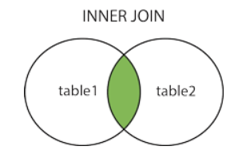

# SQL 基础

## :star:SQL 基本概念

### SQL 是什么

SQL (Structured Query Language，结构化查询语言) 是用于管理**关系数据库管理系统**（RDBMS）。

> **RDBMS 指关系型数据库管理系统，全称 Relational Database Management System。**
>
> **RDBMS 是 SQL 的基础，同样也是所有现代数据库系统的基础。**
>
> **RDBMS 中的数据存储在被称为表的数据库对象中。**
>
> **表是相关的数据项的集合，它由列和行组成。**

SQL 的范围包括数据插入、查询、更新和删除，数据库模式创建和修改，以及数据访问控制。

### SQL 能做什么

- SQL 面向数据库执行查询
- SQL 可从数据库取回数据
- SQL 可在数据库中插入新的记录
- SQL 可更新数据库中的数据
- SQL 可从数据库删除记录
- SQL 可创建新数据库
- SQL 可在数据库中创建新表
- SQL 可在数据库中创建存储过程
- SQL 可在数据库中创建视图
- SQL 可以设置表、存储过程和视图的权限

### SQL 的分类

可以把 SQL 分为五大类型：

- <strong style="color:#DD5145">DDL（Data Definition Language，数据定义语言）</strong>：用来定义数据库对象：库、表、列等

  操作数据对象的语言，包括创建 create、删除 drop、修改 alter 、清除 truncate 数据库对象。

- <strong style="color:#DD5145">DML（Data Manipulation Language，数据操作语言）</strong>：用来定义数据库记录（数据）

  主要有增插 insert、更新 update、删除 delete 等操作表的语句。

  DML语句修改后数据将保持较好的一致性。

- <strong style="color:#DD5145">DCL（Data Control Language，数据控制语言）</strong>：用来定义访问权限和安全级别

  主要有 grant、revoke 语句。

- <strong style="color:#DD5145">DQL（Data Query Language，数据查询语言）</strong>：用来查询记录（数据）

  主要由于 select 关键字完成，查询语句是 SQL 语句中最复杂，功能最丰富的语句。

- <strong style="color:#DD5145">事务控制语句</strong>：主要有 commit、rollback 和 savepoint 三个关键字完成


### SQL 语法要求

- SQL 语句可以单行或多行书写，末端使用分号结尾
- 分号是在数据库系统中分隔每条 SQL 语句的标准方法
- 可以用空格和缩进来来增强语句的可读性
- 关键字不区别大小写，建议使用大写

在本文中，我们将在每条 SQL 语句的末端使用分号。

## :star:SQL 数据类型

- **int**：整型
- **double**：浮点型，例如 double(5,2)表示最多 5 位，其中必须有 2 位小数，即最大值为 999.99；
- **decimal**：泛型型，在表单线方面使用该类型，因为不会出现精度缺失问题；
- **char**：固定长度字符串类型；(当输入的字符不够长度时会补空格)
- **varchar**：固定长度字符串类型；
- **text**：字符串类型；
- **blob**：字节类型；
- **date**：日期类型，格式为：yyyy-MM-dd；
- **time**：时间类型，格式为：hh:mm:ss
- **timestamp**：时间戳类型；


## :star:SQL 基本语法

- **[CREATE DATABASE](#create-database)** - 创建新数据库

- **ALTER DATABASE** - 修改数据库

  ------

- **[CREATE TABLE](#create-table)** - 创建新表

- **[ALTER TABLE](#alter-table)** - 变更（改变）数据库表

- **[TRUNCATE TABLE](#truncate-table)** - 清除表数据

- **[DROP TABLE](#drop-table)** - 删除表

- **[CREATE INDEX](#create-index)** - 创建索引（搜索键）

- **DROP INDEX** - 删除索引

------

- **[INSERT INTO](#insert-into)** - 向数据库中插入新数据
- **[SELECT](#select)** - 从数据库中选取数据
- **[SELECT DISTINCT](#select-distinct)** - 去除重复值
- **[WHERE](#where)** - 条件过滤
- **[UPDATE](#Update)** - 更新数据库中的数据
- **[DELETE](#delete)** - 从数据库中删除数据

- **[AND&OR 运算符](#and&or-运算符)** - 用于基于一个以上的条件对记录进行过滤。
- **[ORDER BY 排序](#order-by-排序)** - 用于对结果集进行排序。

> SQL 对大小写不敏感：SELECT 与 select 是相同的。但建议使用大写

### CREATE DATABASE

CREATE DATABASE 语句用于创建数据库。

```sql
CREATE DATABASE database_name;
```


### CREATE TABLE

CREATE TABLE 语句用于创建数据库中的表。

表由行和列组成，每个表都必须有个表名。

```sql
CREATE TABLE table_name
(
    column_name1 data_type(size),
    column_name2 data_type(size),
    column_name3 data_type(size),
    ....
);
```

参数说明：

- `column_name`：参数规定表中列的名称
- `data_type`：参数规定列的数据类型（例如 varchar、integer、decimal、date 等等）
- `size`：参数规定表中列的最大长度


### ALTER TABLE

ALTER TABLE 语句用于在已有的表中添加、删除或修改列。

如需在表中添加列，请使用下面的语法:

```sql
ALTER TABLE table_name
ADD column_name datatype;
```

如需删除表中的列，请使用下面的语法：

```sql
ALTER TABLE table_name
DROP COLUMN column_name;
```

> 请注意，某些数据库系统不允许这种在数据库表中删除列的方式

### TRUNCATE TABLE

TRUNCATE TABLE 语句用于清除表内的数据（表的结构、属性以及索引仍存在）。

```sql
TRUNCATE TABLE table_name;
```

TRUNCATE 和 DELETE 都可以删除表的所有记录，但有原理不同。DELETE 的效率没有 TRUNCATE 高！

TRUNCATE 其实属性 DDL 语句，因为它是先 DROP TABLE，再 CREATE TABLE。

而且 TRUNCATE 删除的记录是无法回滚的，但 DELETE 删除的记录是可以回滚的（回滚是事务的知识！）

### DROP TABLE

DROP TABLE 语句用于删除表（表的结构、属性以及索引也会被删除）。

```sql
DROP TABLE table_name;
```

### CREATE INDEX

CREATE INDEX 语句用于在表中创建索引。

在不读取整个表的情况下，索引使数据库应用程序可以更快地查找数据。

在表上创建一个简单的索引。允许使用重复的值：

```sql
CREATE INDEX index_name
ON table_name (column_name);
```

在表上创建一个唯一的索引。不允许使用重复的值：唯一的索引意味着两个行不能拥有相同的索引值

```sql
CREATE UNIQUE INDEX index_name
ON table_name (column_name);
```


### INSERT INTO

INSERT INTO 语句用于向表中插入新记录（新的行）。

有两种编写形式：

第一种形式无需指定要插入数据的列名，只需提供被插入的值即可：

```sql
INSERT INTO table_name
VALUES (value1, value2, value3, ...);
```

第二种形式需要指定列名及被插入的值：

```sql
INSERT INTO table_name (column1, column2, column3, ...)
VALUES (value1, value2, value3, ...);
```

参数说明：

- `table_name`：需要插入新记录的表名
- `column1, column2, ...`：需要插入的字段名
- `value1, value2, ...`：需要插入的字段值


### SELECT

SELECT 语句用于从数据库中选取数据。

结果被存储在一个结果表中，称为结果集。

```sql
SELECT column1, column2, ...
FROM table_name;

/* 或 */
SELECT * FROM table_name;
```

参数说明：

- `column1, column2, ...`：要选择的字段名称，可以为多个。如果不指定字段名称，则会选择所有字段
- `table_name`：要查询的表名称


### SELECT DISTINCT

在表中，一个列可能会包含多个重复值，有时您也许希望仅仅列出不同（distinct）的值。

DISTINCT 关键词用于返回唯一不同的值。

```sql
SELECT DISTINCT column1, column2, ...
FROM table_name;
```

参数说明：

- `column1, column2, ...`：要选择的字段名称，可以为多个。如果不指定字段名称，则会选择所有字段
- `table_name`：要查询的表名称


### WHERE

WHERE 子句用于提取那些满足指定条件的记录。

```sql
SELECT column1, column2, ...
FROM table_name
WHERE condition;
```

参数说明：

- `column1, column2, ...`：要选择的字段名称，可以为多个。如果不指定字段名称，则会选择所有字段。
- `table_name`：要查询的表名称。

下面的运算符可在 WHERE 子句中使用：

| 操作符  | 描述                                                         |
| ------- | ------------------------------------------------------------ |
| =       | 等于                                                         |
| <>      | 不等于，**📢 注意：** 在某些版本的 SQL 中，操作符 <> 可以写为 != |
| >       | 大于                                                         |
| <       | 小于                                                         |
| >=      | 大于等于                                                     |
| <=      | 小于等于                                                     |
| BETWEEN | 在某个范围内                                                 |
| LIKE    | 搜索某种模式                                                 |


### UPDATE

UPDATE 语句用于更新表中已存在的记录。

```sql
UPDATE table_name
SET column1 = value1, column2 = value2, ...
WHERE condition;
```

参数说明：

- `table_name`：要修改的表名称
- `column1, column2, ...`：要修改的字段名称，可以为多个字段
- `value1, value2, ...`：要修改的值，可以为多个值
- `condition`：修改条件，用于指定哪些数据要修改

> **📢 注意：** WHERE 子句规定哪条记录或者哪些记录需要更新，否则所有的记录都将被更新！


### DELETE

DELETE 语句用于删除表中的行。

```sql
DELETE FROM table_name
WHERE condition;
```

参数说明：

- `table_name`：要删除的表名称
- `condition`：删除条件，用于指定哪些数据要删除

> **📢 注意：** WHERE 子句规定哪条记录或者哪些记录需要删除，否则所有的记录都将被删除！

**删除所有行：**

可以在不删除表的情况下删除所有的行。这意味着表的结构、属性和索引都是完整的：

```sql
DELETE FROM table_name;
```


### AND&OR 运算符

AND & OR 运算符用于基于一个以上的条件对记录进行过滤。

如果第一个条件和第二个条件都成立，则 AND 运算符显示一条记录

```sql
SELECT * FROM 表名称 WHERE 列 运算符 值 AND 列 运算符 值;
```

如果第一个条件和第二个条件中只要有一个成立，则 OR 运算符显示一条记录

```sql
SELECT * FROM 表名称 WHERE 列 运算符 值 OR 列 运算符 值;
```

### ORDER BY 排序

ORDER BY 关键字用于对结果集按照一个列或者多个列进行排序。

ORDER BY 关键字默认按照升序对记录进行排序。如果需要降序排序，可以使用 DESC 关键字。

```sql
SELECT column1, column2, ...
FROM table_name
ORDER BY column1, column2, ... ASC|DESC;
```

- `column1, column2, ...`：要排序的字段名称，可以为多个字段
- `ASC`：默认，升序排序
- `DESC`：降序排序

## :star:SQL 高级语法

### LIKE 查找类似值

LIKE 操作符用于在 WHERE 子句中搜索列中的指定模式。

```sql
SELECT column1, column2, ...
FROM table_name
WHERE column LIKE pattern;
```

参数说明：

- `column1, column2, ...`：要选择的字段名称，可以为多个。如果不指定字段名称，则会选择所有字段
- `table_name`：要查询的表名称
- `column`：要搜索的字段名称
- `pattern`：搜索模式

### IN 锁定多个值

IN 操作符允许您在 WHERE 子句中规定多个值。

```sql
SELECT column1, column2, ...
FROM table_name
WHERE column IN (value1, value2, ...);
```

参数说明：

- `column1, column2, ...`：要选择的字段名称，可以为多个。如果不指定字段名称，则会选择所有字段
- `table_name`：要查询的表名称
- `column`：要查询的字段名称
- `value1, value2, ...`：要查询的值，可以为多个值。

### BETWEEN 选取区间数据

BETWEEN 操作符选取介于两个值之间的数据范围内的值。这些值可以是数值、文本或者日期。

```sql
SELECT column1, column2, ...
FROM table_name
WHERE column BETWEEN value1 AND value2;
```

参数说明：

- `column1, column2, ...`：要选择的字段名称，可以为多个。如果不指定字段名称，则会选择所有字段
- `table_name`：要查询的表名称
- `column`：要查询的字段名称
- `value1`：范围的起始值
- `value2`：范围的结束值

### AS 别名

通过使用 SQL AS，可以为表名称或列名称指定别名。创建别名是为了让列名称的可读性更强。

列的 SQL 别名语法：

```sql
SELECT column_name AS alias_name
FROM table_name;
```

表的 SQL 别名语法：

```sql
SELECT column_name(s)
FROM table_name AS alias_name;
```

### JOIN 多表关联

SQL JOIN 子句用于把来自两个或多个表的行结合起来，基于这些表之间的共同字段。

```sql
SELECT column1, column2, ...
FROM table1
JOIN table2 ON condition;
```

参数说明：

- `column1, column2, ...`：要选择的字段名称，可以为多个。如果不指定字段名称，则会选择所有字段
- `table1`：要连接的第一个表
- `table2`：要连接的第二个表
- `condition`：连接条件，用于指定连接方式


### 不同的 JOIN

下面列出了您可以使用的 JOIN 类型，以及它们之间的差异。

- **JOIN**：如果表中有至少一个匹配，则返回行
- **INNER JOIN**：内部连接，在表中存在至少一个匹配时，返回两表中匹配的行
- **LEFT JOIN**：即使右表中没有匹配，也从左表返回所有的行
- **RIGHT JOIN**：即使左表中没有匹配，也从右表返回所有的行
- **FULL JOIN**：只要其中一个表中存在匹配，就返回行

**注释：** INNER JOIN 与 JOIN 是相同的。



最常见的 JOIN 类型：**SQL INNER JOIN**，表示从多个表中返回满足 JOIN 条件的所有行。

INNER JOIN 关键字在表中存在至少一个匹配时返回行。

```sql
SELECT column_name(s)
FROM table1
INNER JOIN table2
ON table1.column_name=table2.column_name;
```

或

```sql
SELECT column_name(s)
FROM table1
INNER JOIN table2
ON table1.column_name=table2.column_name;
```

参数说明：

- `columns`：要显示的列名
- `table1`：表1的名称
- `table2`：表2的名称
- `column_name`：表中用于连接的列名

### UNION 合并结果集

SQL UNION 操作符合并两个或多个 SELECT 语句的结果。

```sql
SELECT column_name(s) FROM table1
UNION
SELECT column_name(s) FROM table2;
```

**📢注意：** UNION 操作符默认为选取不同的值。如果查询结果需要显示重复的值，请使用 `UNION ALL`。

```sql
SELECT column_name(s) FROM table1
UNION ALL
SELECT column_name(s) FROM table2;
```

**📢注意：** UNION 结果集中的列名总是等于 UNION 中第一个 SELECT 语句中的列名。

### NOTNULL 非空

NOT NULL 约束强制列不接受 NULL 值。

NOT NULL 约束强制字段始终包含值。即，如果不向字段添加值，就无法插入新记录或者更新记录。

实例：

```sql
CREATE TABLE Persons (
    ID int NOT NULL,
    LastName varchar(255) NOT NULL,
    FirstName varchar(255) NOT NULL,
    Age int
);
```

**📢 注意：** 如果插入 `NULL` 值，则会报错 `ORA-01400` 提示无法插入！

**拓展小知识：** `NOT NULL` 也可以用于查询条件：

```sql
SELECT * FROM Persons WHERE FirstName IS NOT NULL;
```

**添加 NOT NULL 约束：**

在一个已创建的表的 "Age" 字段中添加 NOT NULL 约束如下所示：

```sql
ALTER TABLE Persons MODIFY Age int NOT NULL;
```

**删除 NOT NULL 约束：**

在一个已创建的表的 "Age" 字段中删除 NOT NULL 约束如下所示：

```sql
ALTER TABLE Persons MODIFY Age int NULL;
```

### VIEW 视图

在 SQL 中，视图是基于 SQL 语句的结果集的可视化的表。

视图包含行和列，就像一个真实的表。视图中的字段就是来自一个或多个数据库中的真实的表中的字段。

**视图的作用：**

- 视图隐藏了底层的表结构，简化了数据访问操作，客户端不再需要知道底层表的结构及其之间的关系
- 视图提供了一个统一访问数据的接口（即可以允许用户通过视图访问数据的安全机制，而不授予用户直接访问底层表的权限）
- 从而加强了安全性，使用户只能看到视图所显示的数据
- 视图还可以被嵌套，一个视图中可以嵌套另一个视图

可以向视图添加 SQL 函数、WHERE 以及 JOIN 语句，也可以提交数据，就像这些来自于某个单一的表。

```sql
CREATE VIEW view_name AS
SELECT column_name(s)
FROM table_name
WHERE condition;
```

**📢 注意：** 视图总是显示最近的数据。每当用户查询视图时，数据库引擎通过使用 SQL 语句来重建数据。

**更新视图：CREATE OR REPLACE VIEW**

```sql
CREATE OR REPLACE VIEW view_name AS
SELECT column_name(s)
FROM table_name
WHERE condition;
```

**删除视图：DROP VIEW**

```sql
DROP VIEW view_name;
```


## :page_facing_up:参考

[菜鸟教程](https://www.runoob.com/sql/sql-tutorial.html)、[W3school](https://www.w3school.com.cn/sql/index.asp)、[参考文章](https://blog.csdn.net/m0_50546016/article/details/120070003)、[参考文章](https://blog.csdn.net/PILIpilipala/article/details/113798383)、[参考文章](https://www.cnblogs.com/geaozhang/p/6682952.html)