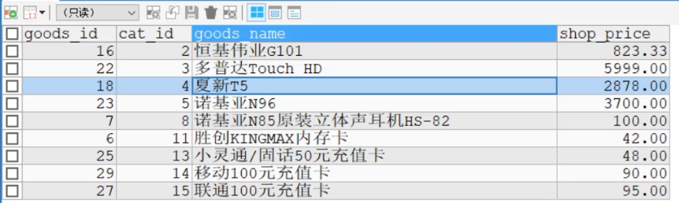
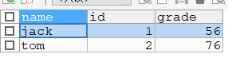

# SQL/MYSQL 高级

## :star:多表查询

### 笛卡尔集

```sql
SELECT * FROM emp, dept;
```

部门表 dept、员工表 emp


在默认情况下，当两个表查询时，规则如下：

1. 从第一张表中，取出一行和第二张表的每一行进行组合，返回结果（含有两张表的所有列）
2. 一共返回的记录数 = 第一张表行数 * 第二张表的行数
3. 这样的多表默认处理返回的结果，称为**笛卡尔集**
4. 解决这个多表的关键就是要写出正确的过滤条件 WHERE

```sql
SELECT * FROM emp, dept
	WHERE emp.deptno = dept.deptno;
```


### 自连接

自连接：指在同一张表连接查询（**将同一表视为两张表**，需要给表取别名）

```sql
SELECT worker.ename AS '职员表', boss.ename AS '上级表' 
	FROM emp worker, emp boss
	WHERE worker.mgr = boss.empno;
```

这里取别名，也可以加上 `AS`。另外，列名不明确的场合，也要特别指定

## :star:子查询

子查询：指嵌入在其他 SQL 语句中的 SELECT 语句。也叫**嵌套查询**

可以把子查询当作一个临时表使用。

### 子查询临时表

可以将子查询当作一张临时表来使用。

```sql
SELECT cat_id, MAX(shop_price) AS max_price
        FROM ecs_goods
        GROUP BY cat_id;
```


```sql
-- 查询ecshop中各个类别中，价格最高的商品
SELECT goods_id, ecs_goods.cat_id, goods_name, shop_price
	FROM (
        SELECT cat_id, MAX(shop_price) AS max_price
        FROM ecs_goods
        GROUP BY cat_id
    ) AS temp, ecs_goods
	WHERE temp.cat_id = ecs_goods.cat_id
	AND temp.max_price = ecs_goods.shop_price;
```




### 单行子查询

指只返回一行数据的子查询语句

```sql
-- 如何显示与SMITH同一部门的所有员工？

SELECT deptno FROM emp WHERE ename = 'SMITH'; -- 单行子查询
```


```sql
SELECT * FROM emp
	WHERE deptno = (SELECT deptno FROM emp WHERE ename = 'SMITH');
```


### 多行子查询

返回多行数据的子查询语句。使用关键字 `IN`

```sql
-- 如何查询和部门10的工作相同的雇员的信息（名字、岗位、工资、部门号）但是不包含10号部门自己的雇员？

SELECT DISTINCT job FROM emp WHERE deptno = 20; -- 多行子查询
```


```sql
SELECT ename, job, sal, deptno 
	FROM emp
	WHERE job IN(SELECT DISTINCT job FROM emp WHERE deptno = 20)
	AND deptno != 10;
```


### ALL 操作符

所有

```sql
SELECT ename, sal ,deptno FROM emp
	WHERE sal > ALL(SELECT sal FROM emp WHERE deptno = 30);
	
SELECT ename, sal ,deptno FROM emp
	WHERE sal > MAX(SELECT sal FROM emp WHERE deptno = 30);
```

### ANY 操作符

任意一个

```sql
-- 显示工资比部门30的所有员工的工资高的员工的姓名、工资和部门号
SELECT ename, sal ,deptno FROM emp
	WHERE sal > ANY(SELECT sal FROM emp WHERE deptno = 30);
	
SELECT ename, sal ,deptno FROM emp
	WHERE sal > MIN(SELECT sal FROM emp WHERE deptno = 30);
```

### 多列子查询

指返回多个列数据的子查询语句

**`(字段1, 字段2, ...) = (select 字段1, 字段2 from ...)`**

子查询列数要和条件列数相等，顺序对应

```sql
-- 查询与allen属于相同部门且岗位也相同的所有雇员（不含allen本人）
-- 1.先得到allen的部门和岗位
SELECT deptno, job FROM emp WHERE ename = 'ALLEN';
-- 2.把上面的查询当做子查询来使用，并使用多列子查询的语法进行匹配
SELECT * FROM emp 
	WHERE (deptno, job) = (SELECT deptno, job FROM emp WHERE ename = 'ALLEN')
	AND ename != 'ALLEN';
```


### 合并查询

**union**，把两个（结构相同的）查询结果合并，**会自动去掉结果集中重复行**。

```sql
SELECT ename, sal, job FROM emp WHERE sal>2500
UNION
SELECT ename, sal, job FROM emp WHERE job = 'MANAGER';
```


**union all**，与 union 相似，但是**不会自动去掉结果集中重复行**

```sql
SELECT ename, sal, job FROM emp WHERE sal>2500
UNION ALL
SELECT ename, sal, job FROM emp WHERE job = 'MANAGER';
```


### 表复制 (蠕虫复制)

有时，为了对某个SQL语句进行效率测试，我们需要海量数据时，可以使用此方法为表创建海量数据

```sql
INSERT INTO table2
	SELECT * FROM table1;

INSERT INTO table2
	(column_name(s))
	SELECT column_name(s) FROM table1;
```

**自我复制：**

```sql
INSERT INTO table1
	SELECT * FROM table1;
```

### 思考：如何删除掉一张表重复记录？

- 先创建一张表 table1，并让其有重复记录

```sql
-- 将emp表的结构(列)，复制到table1
CREATE TABLE table1 LIKE emp;

DESC table1;

-- 多执行几次
INSERT INTO table1
	SELECT * FROM emp;

SELECT * FROM table1;
```

- 考虑去重表 table1 的重复记录

```sql
-- (1) 先创建一张临时表tmp，该表的结构和表table1一样
CREATE TABLE tmp LIKE table1;
DESC tmp;

-- (2) 把表table1的记录通过distinct关键字处理后，复制到表tmp
INSERT INTO tmp
	SELECT DISTINCT * FROM table1;
SELECT * FROM tmp;

-- (3) 清除掉table1表记录
DELETE FROM table1;

-- (4) 把tmp表的记录复制到table1表
INSERT INTO table1
	SELECT * FROM tmp;
SELECT * FROM table1;

-- (5) drop掉临时表tmp
DROP TABLE tmp;
```

## :star:外连接

前面学的的查询，是利用 WHERE 子句对两张表或多张表，形成的笛卡尔集进行筛选，根据**关联条件**，显示所有匹配的记录，匹配不上的不显示。

- 左外连接：**左侧的表完全显示**（即使没有匹配的记录，也会把左侧表完全显示）。
- 右外连接：右侧的表完全显示。

创建两张表：

```sql
-- 创建 stu
CREATE TABLE stu (
    id INT,
    `name` VARCHAR(32));
INSERT INTO stu VALUES(1, 'jack'),(2,'tom'),(3, 'kity'),(4, 'nono');

SELECT * FROM stu;

-- 创建 exam
CREATE TABLE exam(
    id INT,
    grade INT);
INSERT INTO exam VALUES(1, 56),(2,76),(11, 8);

SELECT * FROM exam;
```


普通查询：

```sql
SELECT `name`, stu.id, grade
	FROM stu, exam
	WHERE stu.id = exam.id;
```



使用左外连接：显示所有人的成绩，如果没有成绩，也要显示该人的姓名和id号，成绩显示空

```sql
-- 左外连接
SELECT `name`, stu.id, grade
	FROM stu LEFT JOIN exam
	ON stu.id = exam.id;
```


使用右外连接：显示所有人的成绩，没有名字匹配，显示空

```sql
-- 右外连接
SELECT `name`, stu.id, grade
	FROM stu RIGHT JOIN exam
	ON stu.id = exam.id;
```


## :star:约束

SQL 约束用于规定表中的数据规则。如果存在违反约束的数据行为，行为会被约束终止。

约束可以在创建表时规定（通过 CREATE TABLE 语句），或者在表创建之后规定（通过 ALTER TABLE 语句）。

### DEFAULT (默认约束)

DEFAULT 约束**用于向列中插入默认值**。

如果没有规定其他的值，那么会将默认值添加到所有的新记录。

**MySQL / SQL Server / Oracle / MS Access：**

```sql
CREATE TABLE Persons(
    P_Id int NOT NULL,
    LastName varchar(255) NOT NULL,
    FirstName varchar(255),
    Address varchar(255),
    City varchar(255) DEFAULT 'Sandnes'
);
```


### NOT NULL (非空约束)

NOT NULL 约束**用于强制列不接受 NULL 值**。

NOT NULL 约束强制字段始终包含值。即如果不向字段添加值，就无法插入新记录或者更新记录。

```sql
CREATE TABLE Persons (
    ID int NOT NULL,
    LastName varchar(255) NOT NULL,
    FirstName varchar(255) NOT NULL,
    Age int
);
```

**📢 注意：** 如果插入 `NULL` 值，则会报错 `ORA-01400` 提示无法插入！

**拓展小知识：** `NOT NULL` 也可以用于查询条件：

```sql
SELECT * FROM Persons WHERE FirstName IS NOT NULL;
```

**添加 NOT NULL 约束：**

在一个已创建的表的 "Age" 字段中添加 NOT NULL 约束如下所示：

```sql
ALTER TABLE Persons MODIFY Age int NOT NULL;
```

**删除 NOT NULL 约束：**

在一个已创建的表的 "Age" 字段中删除 NOT NULL 约束如下所示：

```sql
ALTER TABLE Persons MODIFY Age int NULL;
```


### UNIQUE (唯一约束)

UNIQUE **约束唯一标识数据库表中的每条记录**。

UNIQUE 和 PRIMARY KEY 约束均为列或列集合提供了唯一性的保证。

**PRIMARY KEY 约束拥有自动定义的 UNIQUE 约束**。

```sql
字段名 字段类型 unique
```

**MySQL：**下面的 SQL 在 "Persons" 表创建时在 "P_Id" 列上创建 UNIQUE 约束

```sql
CREATE TABLE Persons(
    P_Id int NOT NULL,
    LastName varchar(255) NOT NULL,
    FirstName varchar(255),
    Address varchar(255),
    City varchar(255),
    UNIQUE (P_Id)
);
```

请注意：

- **每个表可以有多个 UNIQUE 约束，但是每个表只能有一个 PRIMARY KEY 约束**。
- 如果没有 NOT NULL 约束，则 UNIQUE 字段可以有多个 NULL 值。


### CHECK (强制约束)

CHECK 约束**用于限制列中的值的范围**。

如果对单个列定义 CHECK 约束，那么该列只允许特定的值。

如果对一个表定义 CHECK 约束，那么此约束会基于行中其他列的值在特定的列中对值进行限制。

```sql
字段名 字段类型 check (条件)
```

**MySQL：**在 "Persons" 表创建时在 "P_Id" 列上创建 CHECK 约束。CHECK 约束规定 "P_Id" 列必须是大于 0 的整数。

```sql
CREATE TABLE Persons(
    P_Id int NOT NULL,
    LastName varchar(255) NOT NULL,
    FirstName varchar(255),
    Address varchar(255),
    City varchar(255),
    CHECK (P_Id > 0)
)
```


### PRIMARY KEY (主键)

PRIMARY KEY 约束唯一标识数据库表中的每条记录（即每行的数据）。

- 主键必须包含唯一的值。主键列不能为 NULL 值。
- 一张表只能有一个主键，但可以是复合主键。

```sql
字段名 字段类型 primary key

（在表定义的最后写）PRIMARY KEY(列名)

-- 查看 primary key 的情况
desc 表名;
```

**主键**用于唯一的表示表行的数据。当定义主键约束后，**该列不能重复**。

```sql
CREATE TABLE `temp1` (
    `id` INT,
    `name` CHAR(5),
    `location` varchar(32),
    PRIMARY KEY(`id`, `name`) -- 复合主键
);
```

这里，`(id, name)` 构成复合主键。id 和 name 都相同的，不能重复


### FOREIGN KEY (外键)

一个表中的 FOREIGN KEY 指向另一个表中的 UNIQUE KEY(唯一约束)。

```sql
foreign key (本表字段名) references 主表名(主键名或unique字段名)
```

**外键**用于定义主表和从表之间的关系。**外键约束要定义在从表上，主表必须有主键或唯一约束**。（先约束自己，再约束他人！）


**使用细节：**

1. 外键指向的表的字段，要求是 primary key 或 unique

2. 表的类型是 innodb，这样的表才支持外键

3. 外键字段的类型要和主子段类型一致（可以长度不同）

4. **外键字段的值，必须在主键字段中出现过（存在），或为 NULL（在外键字段允许的情况下）**

5. 一旦确立主外键关系，数据就不能随意删除了

6. 如何删除外键：

   ```sql
   -- 1.查看该表创建语句，获取外键名称
   SHOW CREATE TABLE 表名;
   -- 2.删除外键
   ALTER TABLE 表名 DROP FOREIGN KEY 外键名;
   ```


## :star:自增长

在某张表，存在一个id列（整数），我们希望在添加记录的时候，自动地创建主键字段的值，该列从1开始，自动的增长。

```sql
字段名 字段类型 primary key auto_increment
```

添加自增长的字段方式：

```sql
insert into table_name(字段1, 字段2, ...) values(null, '值', ...);
insert into table_name(字段2, ...) values('值1', '值2', ...);
insert into table_name values(null, '值1', ...);
```

1. 如果希望自增长，插入数据时该列插入 null

2. 一般来说自增长是配合 primary key 使用的，也能（配合 unique）单独使用

3. 自增长修饰的字段是整数型的（小数类型也可以，但很少这样用）

4. 自增长从 1 开始。也可以修改这个自增长的默认值

   ```sql
   alter table 表名 auto_increment = 新的开始值;
   ```

5. 如果添加数据时，给自增长字段(列)指定了具体的值，则以指定的值为准

   一般来说，指定了自增长，就按自增长的规则添加顺序

**用于 MySQL 的语法：**下面的 SQL 语句把 "Persons" 表中的 "ID" 列定义为 auto-increment 主键字段

```sql
CREATE TABLE Persons(
    ID int NOT NULL AUTO_INCREMENT,
    LastName varchar(255) NOT NULL,
    FirstName varchar(255),
    Address varchar(255),
    City varchar(255),
    PRIMARY KEY (ID)
);
```

MySQL 使用 AUTO_INCREMENT 关键字来执行 auto-increment 任务。

默认地，AUTO_INCREMENT 的开始值是 1，每条新记录递增 1。

要让 AUTO_INCREMENT 序列以其他的值起始，请使用下面的 SQL 语法：

```sql
ALTER TABLE Persons AUTO_INCREMENT=100;
```

要在 "Persons" 表中插入新记录，我们不必为 "ID" 列规定值（会自动添加一个唯一的值）：

```sql
INSERT INTO Persons (FirstName,LastName)
	VALUES ('Lars','Monsen');
```

上面的 SQL 语句会在 "Persons" 表中插入一条新记录。"ID" 列会被赋予一个唯一的值。"FirstName" 列会被设置为 "Lars"，"LastName" 列会被设置为 "Monsen"。


## :star:多表关联 JOIN

SQL JOIN 子句**用于把来自两个或多个表的行结合起来，基于这些表之间的共同字段**。

```sql
SELECT column1, column2, ...
	FROM table1 JOIN table2 ON condition;
```

参数说明：

- `column1, column2, ...`：要选择的字段名称，可以为多个。如果不指定字段名称，则会选择所有字段
- `table1`：要连接的第一个表
- `table2`：要连接的第二个表
- `condition`：连接条件，用于指定连接方式


### 不同的 JOIN

下面列出了您可以使用的 JOIN 类型，以及它们之间的差异。

- **JOIN**：如果表中有至少一个匹配，则返回行
- **INNER JOIN**：内部连接，在表中存在至少一个匹配时，返回两表中匹配的行
- **LEFT JOIN**：即使右表中没有匹配，也从左表返回所有的行
- **RIGHT JOIN**：即使左表中没有匹配，也从右表返回所有的行
- **FULL JOIN**：只要其中一个表中存在匹配，就返回行

**注释：** INNER JOIN 与 JOIN 是相同的。


最常见的 JOIN 类型：**SQL INNER JOIN**，表示从多个表中返回满足 JOIN 条件的所有行。

INNER JOIN 关键字在表中存在至少一个匹配时返回行。

```sql
SELECT column_name(s)
	FROM table1 INNER JOIN table2
	ON table1.column_name = table2.column_name;
```

或

```sql
SELECT column_name(s)
	FROM table1 JOIN table2
	ON table1.column_name = table2.column_name;
```

参数说明：

- `columns`：要显示的列名
- `table1`：表1的名称
- `table2`：表2的名称
- `column_name`：表中用于连接的列名


## :star:MySQL 表类型和存储引擎

MySQL 的表类型由存储引擎（Storage Engines）决定，主要支持六种类型：CSV、Memory（常用）、ARCHIVE、MRG_MYISAM、MyISAM（常用）、InnoDB（常用）。

这六类又分为两类：

- **事务安全型**（transaction-safe）：InnoDB
- 非事务安全型（non-transaction-safe）：其他类型都是非事务安全型

### 存储引擎/表类型特点

重点介绍 MyISAM、InnoDB、Memory：

1. **MyISAM** 存储引擎不支持事务，也不支持外键。但其访问速度快，对事务完整性没有要求
2. **InnoDB** 存储引擎提供了具有提交、回滚和崩溃恢复能力的事务安全。但比起 MyISAM，InnoDB 写入的处理效率差一些，并且会占用更多磁盘空间以保留数据和索引。
3. **Memory** 存储引擎使用存在内存中的内容来创建表。每个 Memory 表只实际对应一个磁盘文件。Memory 类型的表访问得非常快，因为**它的数据是放在内存中的**，并且默认使用 HASH 索引。但是**一旦 MySQL 服务关闭，表中的数据就会丢掉（表的结构还在）**。

| 特点         | MyISAM | InnoDB | Memory     | Archive |
| ------------ | ------ | ------ | ---------- | ------- |
| 批量插入速度 | 高     | 低     | 高         | 非常高  |
| **事务安全** |        | 支持   |            |         |
| 全文索引     | 支持   |        |            |         |
| **锁机制**   | 表锁   | 行锁   | 表锁       | 行锁    |
| 存储限制     | 无     | 64TB   | 有（内存） | 无      |
| B树索引      | 支持   | 支持   | 支持       |         |
| 哈希索引     |        | 支持   | 支持       |         |
| 集群索引     |        | 支持   |            |         |
| 数据缓存     |        | 支持   | 支持       |         |
| 索引缓存     | 支持   | 支持   | 支持       |         |
| 数据可压缩   | 支持   |        |            | 支持    |
| 空间使用     | 低     | 高     | 无         | 非常低  |
| 内存使用     | 低     | 高     | 中等       | 低      |
| **支持外键** |        | 支持   |            |         |

> **行锁**就是在操作表中的某行数据时，mysql会在该行加锁，防止其他连接去修改该行数据

### 查看所有的存储引擎

```sql
SHOW ENGINES;
```


### 如何选择存储引擎

> - InnoDB：支持事务、支持外键、支持行级锁
> - MyISAM：添加速度快、不支持事务和外键、支持表级锁
> - Memory：数据存储在内存中、执行速度很快、默认支持索引（HASH 表）

1. 如果你的应用不需要事务，处理的只是基本的 CRUD 操作，那么 MyISAM 速度最快
2. 如果需要支持事务，选择 InnoDB
3. Memory 数据存储在内存中，没有 I/O 操作故而速度极快。但内存存储使得其任何修改都会在服务器重启后消失（经典用法，用户在线状态）

### 创建表时设置引擎

```sql
CREATE TABLE emp (
    id INT,
    `name` VARCHAR(32),
) ENGINE INNODB;
```

### 修改存储引擎

```sql
ALTER TABLE 表名 ENGINE = 存储引擎;
```


## :star:MYSQL 索引

提高数据库性能，增加查询速度。

```sql
CREATE INDEX 索引名 ON 表名 (列名);
```

### 索引原理

- 没有索引时：查询的场合总是会进行**全表扫描**
- 有索引时：**形成一个索引的数据结构（如二叉树）**，根据该结构进行查找

索引的代价：**会造成磁盘的占用，且对 update delete insert 语句的效率产生影响**

项目中，select 多，而 update，delete，insert 少


### 索引的类型

1. 主键索引：primary key。**主键自动为主键索引**

2. 唯一索引：unique。unique索引

3. 普通索引：index

4. 全文索引：fulltext

   一般开发不用 MySQL 自带的全文索引，而是使用全文搜索（Solr）和ElasticSearch（ES）

### 索引操作

查询索引（三种方式）：

```sql
SHOW INDEX FROM 表名;
SHOW INDEXES FROM 表名;
SHOW KEYS FROM 表名;
```

添加主键索引：

```sql
ALTER TABLE 表名 ADD PRIMARY KEY (列名);
```

添加唯一索引：

```sql
CREATE UNIQUE INDEX 索引名 ON 表名(列名);
```

添加普通索引（两种方式）：

```sql
-- 方式一
CREATE INDEX 索引名 ON 表名(列名);
-- 方式二
ALTER TABLE 表名 ADD INDEX 索引名(列名);
```

> 如果某列的值是不会重复的，则优先考虑唯一索引。否则用普通索引。

删除主键索引：

```sql
ALTER TABLE 表名 DROP PRIMARY KEY;
```

删除索引：

```sql
DROP INDEX 索引名 ON 表名;
```

修改索引：先删除，再添加新的索引

### 索引创建规则

1. 较频繁地作为查询条件字段 **适合** 作为索引
2. 唯一性太差的字段（即使频繁作为查询条件）**不适合** 单独创建索引
3. 更新非常频繁的字段 **不适合** 创建索引
4. 不会出现在 WHERE 子句的字段 **不适合** 创建索引


## :star:MySQL 事务

事务：**用于保证数据的一致性**，由**一组相关的 DML 语句**（update、insert、delete 语句）组成。该组 DML 语句要么全部成功，要么全部失败。比如转账就要用事务处理，以保证数据的一致性。

执行事务操作时（DML语句），MySQL 会在表上**加锁**，防止其他用户修改表的数据。这对用户来讲是非常重要的。

### 事务的操作

- `start transaction`：开始一个事务

- `savepoint 保存点名`：设置保存点

- `rollback to 保存点名`：回退事务到特定保存点

- `rollback`：回退所有事务

- `commit`：提交事务，让所有操作生效，不能再回退了。

  执行该语句后，会确认事务的变化、删除保存点、释放锁，并让数据生效。

  使用该语句后，其它会话（其他连接）将可以查看到事务变化后的新数据（所有数据正式生效）。


```sql
-- 1.创建一张测试表
CREATE TABLE t27(
    id INT,
    `name` VARCHAR(32)
);
-- 2.开启一个事务
START TRANSACTION;

-- 3.设置保存点
SAVEPOINT a;
-- 执行DML操作
INSERT INTO t27 VALUES(100, 'tom');

SAVEPOINT b;
INSERT INTO t27 VALUES(100, 'jack');

-- 回退到b
ROLLBACK TO b;

SELECT * FROM t27;
COMMIT;
```

### 使用细节

1. 如果不提交事务，默认情况下，DML 操作是自动提交的，不能回滚。

2. 开始一个事务，没有创建保存点的场合，可以执行 rollback，默认回退到事务开始时的状态

3. 可以在这个事务中创建多个保存点

4. 可以在事务没有提交前选择回退到哪个保存点

5. MySQL 需要 InnoDB 的存储引擎才可以使用。MyISAM 不行

6. 开始事务：`start transaction`

   关闭默认自动提交事务：`set autocommit = off;`

### 隔离级别

隔离：多个连接开启各自事务操作数据库中数据时，数据库系统要负责隔离操作，以保证各个连接在获取数据时的准确性。

如果不考虑隔离性，可能引发问题，如：

- **脏读（dirty read）**：

  当一个事务读取另一个事务尚**未提交**的修改时（update、insert、delete），产生脏读。

- **不可重复读（nonreapeatable read）**：

  同一查询在同一事务中多次进行，由于其他**提交事务**所做的**修改或删除**，每次返回不同的结果集，此时发生不可重复读。

- **幻读（phantom read）**：

  同一查询在同一事务中多次进行，由于其他**提交事务**所做的**插入操作**，每次返回不同的结果集，此时发生幻读。

隔离级别：定义了事务与事务之间的隔离程度。

| MySQL 隔离级别（4种）        | 脏读 | 不可重复读 | 幻读 | 加锁读 |
| ---------------------------- | ---- | ---------- | ---- | ------ |
| 读未提交（Read uncommitted） | √    | √          | √    | 不加锁 |
| 读已提交（Read committed）   | ×    | √          | √    | 不加锁 |
| 可重复读（Reapeatable read） | ×    | ×          | ×    | 不加锁 |
| 可串行化（Serializable）     | ×    | ×          | ×    | 加锁   |

MySQL 的默认隔离级别是 Reapeatable read，一般情况下不需要修改

**隔离级别是跟事务相关的，离开事务就不要谈隔离级别。**

### 隔离级别的操作

1.查看当前会话隔离级别：`SELECT @@transaction_isolation;`

```sh
mysql> SELECT @@transaction_isolation;
+-------------------------+
| @@transaction_isolation |
+-------------------------+
| REPEATABLE-READ         |
+-------------------------+
```

2.查看系统隔离级别：

```sql
SELECT @@global.transaction_isolation;
```

3.设置当前会话隔离级别：

```sql
set session transaction isolation level 隔离级别;
```

4.设置系统隔离级别：

```sql
set global transaction isolation level 隔离级别;
```

5.全局修改：修改 mysql.ini 配置文件。在 mysql.ini 文件的末尾加上：

```ini
#设置默认隔离级别
transaction-isolation = REPEATABLE-READ
```

可选参数有：`READ-UNCOMMITTED`、`READ-COMMITTED`、`REPEATABLE-READ`、`SERIALIZABLE`

MySQL 的默认隔离级别是 Reapeatable read，一般情况下不需要修改

### 事务 ACID 特性

1. **原子性（Atomicity）**：

   事务是一个不可分割的工作单位，事务中的操作要么都发生，要么都不发生。

2. **一致性（Consistency）**：

   事务必须使数据库从一个一致性状态变换到另外一个一致性状态。

3. **隔离性（Isolation）**：

   多个用户并发访问数据库时，数据库为每一个用户开启的事务，不能被其他事务的操作数据所干扰，多个并发事务之间要相互隔离。

4. **持久性（Durability）**：

   一个事务一旦被提交，它对数据库中数据的改变就是永久性的。接下来即使数据库发生故障也不应该对其有任何影响。


## :star:视图 VIEW

在 SQL 中，视图是基于 SQL 语句的结果集的可视化的表。

视图包含行和列，就像一个真实的表。视图中的字段就是来自一个或多个数据库中的真实的表中的字段。

**视图的作用：**

- 视图隐藏了底层的表结构，简化了数据访问操作，客户端不再需要知道底层表的结构及其之间的关系
- 视图提供了一个统一访问数据的接口（即可以允许用户通过视图访问数据的安全机制，而不授予用户直接访问底层表的权限）
- 从而加强了安全性，使用户只能看到视图所显示的数据
- 视图还可以被嵌套，一个视图中可以嵌套另一个视图

可以向视图添加 SQL 函数、WHERE 以及 JOIN 语句，也可以提交数据，就像这些来自于某个单一的表。

```sql
CREATE VIEW view_name AS
	SELECT column_name(s) FROM table_name WHERE condition;
```

**📢 注意：** 视图总是显示最近的数据。每当用户查询视图时，数据库引擎通过使用 SQL 语句来重建数据。

**更新视图：CREATE OR REPLACE VIEW**

```sql
CREATE OR REPLACE VIEW view_name AS
	SELECT column_name(s) FROM table_name WHERE condition;
```

**删除视图：DROP VIEW**

```sql
DROP VIEW view_name;
```


