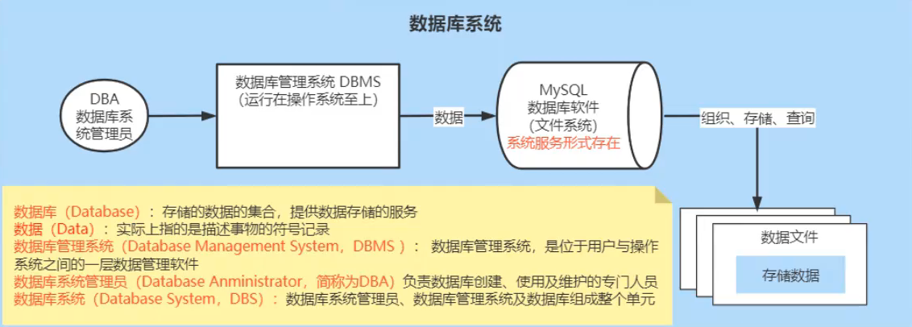
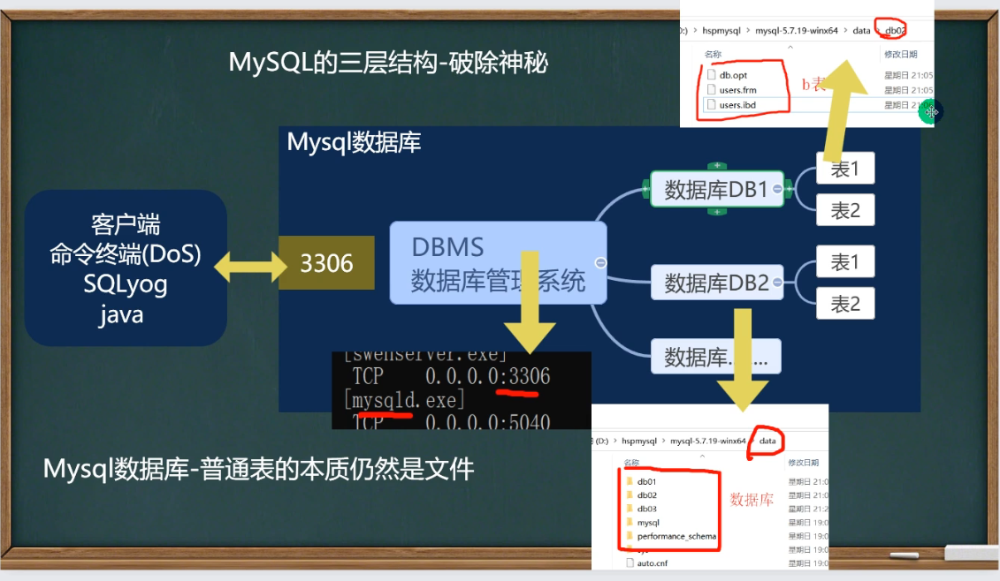
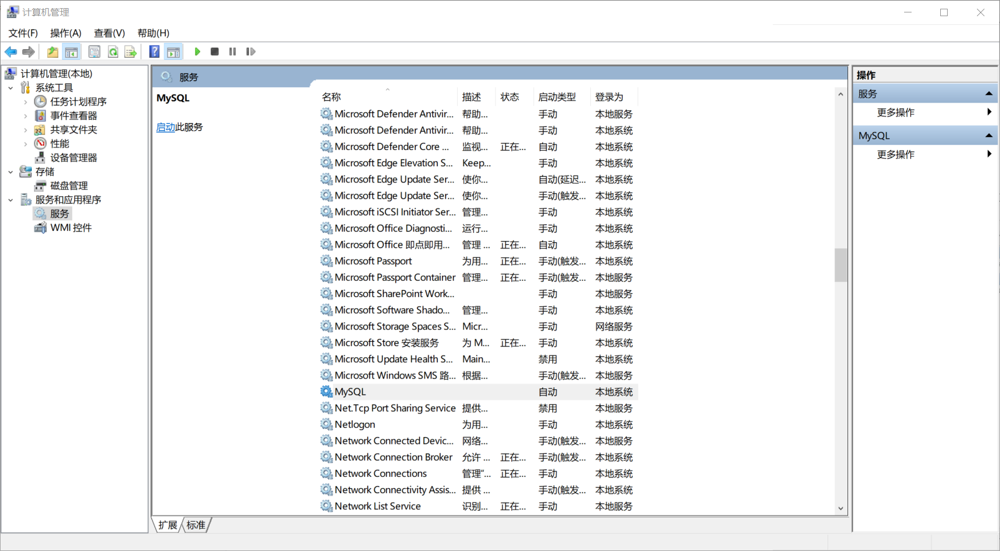
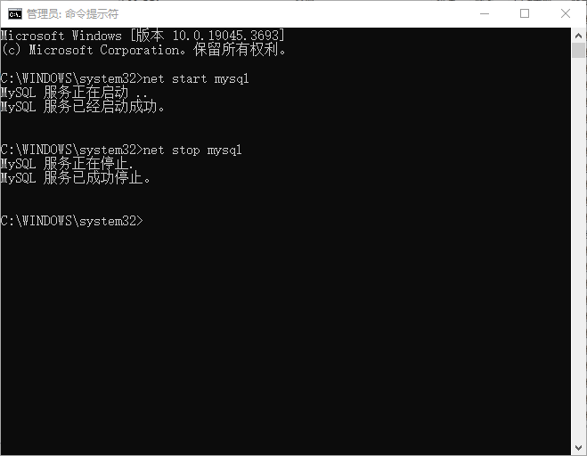
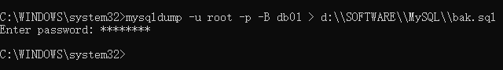

# MySQL 基础

## 数据库概念

数据库是"按照数据结构来组织、存储和管理数据的仓库"。是一个长期存储在计算机内部的、有组织的、可共享的、统一管理的大量数据的集合。数据库软件还提供了高效的增加、删除、修改和查询数据的解决方案。

> 数据库，就是存放数据的仓库
>
> 数据库（DataBase，DB）是**长期存储**在计算机内部的**有结构的**、**大量的**、**共享的**数据集合

- 长期存储：持久化
- 有结构：
  - 类型：数据库不仅可以存储数据，而且存储的数据还有类型
  - 关系：存储数据与数据之间的关系
- 大量：大多数数据库都是文件系统的，即存储在数据库中的数据实际存储在磁盘的文件中
- 共享：多个应用程序可以通过数据库实现数据的共享

#### 数据库术语

- 数据库（DataBsae）：存储的数据的集合，提供数据存储的服务
- 数据（Data）：实际上指的是描述事物的符号记录
- 数据库管理系统（DataBase Management System，DBMS）：位于用户和操作系统之间的一层数据管理软件
- 数据库系统管理员（DataBase Administrator，DBA）：负责数据库创建、使用以及维护的管理人员
- <strong style="color:#DD5145">数据库系统（DataBase System，DBS）：数据库 + 数据库管理系统 + 数据库系统管理员</strong>



## 为什么需要数据库

其实通过IO技术对数据进行增删改查，实际上相当于自己写了一个数据库软件，但功能简单，执行效率低下，而且每个项目都开发数据库相关代码导致开发效率低下。

学习数据库就是学习如何与数据库软件进行交流，SQL语言就是程序员和数据库软件进行沟通的语言。

> 误区：MySQL 其实是指 DBMS（数据库管理系统），就是说 MySQL并不是一个数据库，我们只是通过这些系统来管理和维护数据库而已。

#### 数据库可以分为 关系型数据库与非关系型数据库：

- **关系型数据库**

  关系型数据库，采用了关系模型来组织数据的存储，<strong style="color:#DD5145">以行和列的形式</strong>存储数据并<strong style="color:#DD5145">记录数据与数据之间的关系</strong>——将数据存储在表格中，可以通过建立表格与表格之前的关联来维护数据与数据之间的关系。

  学生信息——学生表

  班级信息——班级表

- **非关系数据库**

  非关系型数据库，采用<strong style="color:#DD5145">键值对的形式</strong>来存储数据，只记录数据，<strong style="color:#DD5145">不会记录数据与数据之间的关系</strong>。

  在非关系型数据库中基于其特定的存储结构来解决一些大数据应用的难题

  **NoSQL**(Not only SQL)数据库来指代**非关系型数据库**。

## 常见的数据库产品

#### 关系型数据库产品

- **MySQL**（免费，最常用）
- PostgreSQL
- **Oracle**（收费，常用）
- SQL Server
- Access
- Sybase
- 达梦数据库

#### **非关系型数据库产品**

- 面向检索的列式存储 Column-Oriented
  - HaBase（Hadoop子系统）
  - BigTable（Google）
- 面向高并发的缓存存储 Key-Value
  - **Redis**
  - MemcacheDB
- 面向海量数据访问的文档存储 Document-Oriented
  - **MongoDB**
  - CouchDB

## 数据库的三大范式

数据库的三大范式是关系型数据库设计的基础理论。

- **第一范式（1NF）** 是指数据库表的每一列都是不可分割的基本数据线，即<strong style="color:#DD5145">每一列的值具有原子行，不可再分割。</strong>

- **第二范式（2NF）** 是在第一范式的基础上建立的，满足第二范式必须先满足第一范式。
  - 如果表示单主键，那么主键以外的列必须完全依赖主键；
  - 如果表是复合主键，那么主键以外的列必须完全依赖于转，不能仅依赖主键的一部分。

- **第三范式（3NF）** 是在第二范式的基础上建立的，满足第三范式必须先满足第二范式。
  - 表中的<strong style="color:#DD5145">非主键列</strong>必须和主键<strong style="color:#DD5145">直接相关</strong>而不是间接相关，即非主键之间不能相关依赖。

## 数据库的三层结构

- 所谓安装MySQL数据库，就是在主机上安装一个数据库管理系统 (DBMS，Database Manager System)，这个管理程序可以管理多个数据库。
- 一个数据库中可以创建多个表，以保持数据 (信息)。
- 数据库管理系统 (DBMS)、数据库和表的关系如图所示：



## MySQL数据库环境准备

> MySQL下载、安装、配置、卸载、安装DBMS、使用DBMS

官网 https://www.mysql.com/

镜像网址：https://www.filehorse.com/download-mysql-64/download/

### MySQL基本安装与使用

- 用户名：root
- 密码：hulujing

开启&关闭 mysql 服务器：

```bash
net start mysql
net stop mysql
```

<strong style="color:#DD5145">以管理员身份运行“命令提示符”，否则执行命令会提示“发生系统错误5，拒绝访问”</strong>

登陆指令：

```mysql
mysql -u root -p
```

退出mysql命令行：

```bash
quit
```

连接到MySQL服务 (MySQL数据库) 的指令：

```mysql
mysql -h 主机IP -P 端口 -u 用户名 -p密码
# -p密码不要有空格
# -p后面没有填写密码时，回车后要求输入密码
# 如果没有写 -h 主机IP，默认为主机
# 如果没有写 -P 端口，默认为3306（my.ini文件中可修改）
mysql -h 127.0.0.1 -P 3306 -u root -phulujing
```


### MySQL服务的启动与停止

> <strong style="color:#DD5145">MySQL是以服务的形式运行在系统中</strong>

**计算机管理窗口**

`此电脑`--`右键`--`管理`



**windows命令行**

打开命令行：`win + R`-- 输入`cmd`回车

以管理员身份打开命令行：`win + s`-- 输入`cmd`-- 选择`以管理员身份运行`



## MySQL的管理工具

当完成数据库的安装之后，MySQL是以服务的形式运行在windows/Linux系统，用户是通过DBMS工具来对MySQL进行操作的，当我们安装完成MySQL之后默认安装了`MySQL Command Line Client`，此工具是一个命令行形式的工具，通常我们会单独安装可视化的DBMS工具：

常用工具比如（收费）：

- SQLyog
- Navicat

当然也有免费的DBMS工具，比如 DBeaver

## MySQL数据类型

数据类型是指数据表中的列中支持存放的数据的类型。

### 数值类型

| 类型                | 内存大小   | 范围                                             | 说明                                                         |
| ------------------- | ---------- | ------------------------------------------------ | ------------------------------------------------------------ |
| tinyint             | 1 byte     | 有符号，-128 ~ 127<br/>无符号，0 ~ 255           | 特小型整数（年龄）                                           |
| smallint            | 2 byte     | 有符号，-32768 ~ 32767<br/>无符号，0 ~ 65535     | 小型整数                                                     |
| mediumint           | 3 byte     | 有符号，-2^31^ ~ 2^31^-1<br/>有符号，0 ~ 2^32^-1 | 中型整数                                                     |
| **`int / integer`** | 4 byte     |                                                  | 整数                                                         |
| **`bigint`**        | 8 byte     |                                                  | 大型整数                                                     |
| float               | 4 byte     |                                                  | 单精度                                                       |
| **`double`**        | 8 byte     |                                                  | 双精度                                                       |
| decimal             | 大小不确定 |                                                  | `decimal(M, D)`<br/>M表示小数位数 (精度) 的长度，D表示小数点位数 |


### 字符串类型

> 存储字符序列的类型

注意：在数据库中存储图片、视频或音频等内容，一般是存储文件在服务器上的路径，当然如果非要存储就需要将图片等数据转成二进制进行存储，所有`blob`类型是可以存储所有类型的，但前提是需要新转成二进制，所有此类型很少使用。

| 类型           | 字符长度                 | 说明                                                         |
| -------------- | ------------------------ | ------------------------------------------------------------ |
| **`char`**     | 0~255 字节               | 定长字符串，最多可以存储255个字符当指定数据表字段为`char(n)`时<br/>列中的数据最长为n个字符，如果添加的数据少于n，则补\`u0000`至n长度 |
| **`varchar`**  | 0~65536 字节             | 可变长度字符串                                               |
| tinyblob       | 0~255 字节               | 存储二进制字符串                                             |
| blob           | 0~65536（0 ~ 2^16^ - 1） | 存储二进制字符串                                             |
| mediumblob     |                          | 存储二进制字符串                                             |
| longblob       | 0 \~ 2^32^-1             | 存储二进制字符串                                             |
| tinytext       | 0~255                    | 文本数据（字符串）                                           |
| text           | 0~65536                  | 文本数据（字符串）                                           |
| mediumtext     |                          | 文本数据（字符串）                                           |
| **`longtext`** | 0 \~ 2^32^-1             | 文本数据（字符串）                                           |

> `longtext`类型一般用于`varchar`类型存储不下的时候

### 日期类型

> 在MySQL数据库中，我们可以使用字符串来存储时间，但如果我们需要基于时间字段进行查询操作（查询在某个时间段内的数据）就不便于查询

| 类型           | 格式                | 说明                        |
| -------------- | ------------------- | --------------------------- |
| **`date`**     | YYYY-MM-DD          | 日期，只存储年月日          |
| time           | HH:mm:SS            | 时间，只存储时分秒          |
| year           | YYYY                | 年份                        |
| **`datetime`** | YYYY-MM-DD HH:mm:SS | 日期+时间，存储年月日时分秒 |
| timestamp      |                     | 日期+时间，时间戳           |

## :star:备份&恢复数据库

MySQL 提供了多种备份工具和方法，包括：

- mysqldump：一个简单易用的命令行工具，适用于小型和中型数据库的备份。
- MySQL Enterprise Backup：企业版工具，支持热备份和增量备份，适合大型数据库。
- Percona XtraBackup：开源工具，支持不锁定备份，适合需要高可用性的环境。
- 其他第三方工具：如 ZRM、MyDumper 等，提供多种备份和恢复功能。

### mysqldump 备份

使用`mysqldump`命令对MySQL数据库进行备份：

```sh
mysqldump -u [username] -p[password] [database_name] > [backup_file.sql]
```

备份数据库（注意：在DOS执行）命令行：

```sh
mysqldump -u root(用户名) -p(密码) -B 数据库1 数据库2 数据库n > d:\\SOFTWARE\\MySQL\\bak.sql
```

> 这个备份的文件就是对于的SQL语句。



备份数据库的表：

```sh
mysqldump -u 用户名 -p 数据库 表1 表2 表n > d:\\SOFTWARE\\MySQL\\bak.sql
```

### source/mysql 恢复

使用`source`命令从一个`.sql`文件中恢复或导入数据库：

```sh
mysql -u root -p # 需要登录到 MySQL服务器
source /path/to/your/database_dump.sql
```

> `/path/to/your/database_dump.sql`是你的`.sql`文件的路径

第二种方式：你可以直接在命令行中使用它来导入`.sql`文件

```bash
mysql -u [username] -p[password] database_name < /path/to/your/database_dump.sql
```

