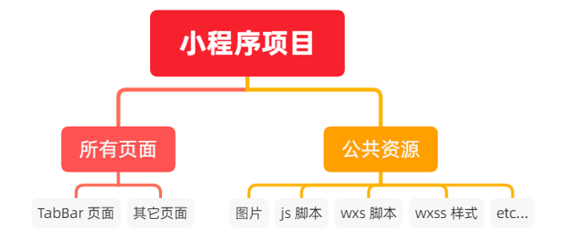
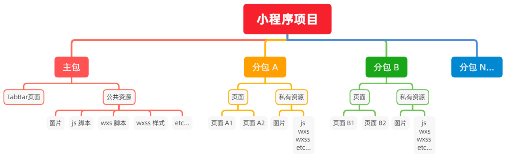

# 小程序分包

##  :star:基础概念

### 1.什么是分包

分包指的是把一个完整的小程序项目，按照需求划分为不同的子包，在构建时打包成不同的分包，用户在使用时按需加载。

### 2.分包的好处

对小程序进行分包的好处主要有以下两点：

- 可以优化小程序首次启动的下载时间
- 在多团队共同开发时可以更好的解耦协作

### 3.分包前项目的构成

分包前，小程序项目中所有的页面和资源都被打包到一起，导致整个项目体积过大，影响小程序首次启动的下载时间。



### 4.分包后项目的构成

分包后，小程序项目由 1个主包 + 多个分包 组成：

- 主包：一般只包含项目的**启动页面**或**TabBar页面**、以及所有分包都需要用到的一些公共资源
- 分包：只包含和当前分包有关的页面和私有资源



### 5.分包的加载规则

1. 在小程序启动时，默认会下载主包并启动主包页面
   - tabBar 页面需要放到主包中
2. 当用户进入分包内某个页面时，客户端会把对应分包下载下来，下载完成后再进行展示
   - 非 tabBar 页面可以按照功能的不同，划分为不同的分包之后，进行按需下载

### 6.分包的体积限制

目前，小程序分包的大小有以下两个限制：

- 整个小程序所有分包大小不超过 16M（主包+所有分包）
- 单个分包/主包不能超过 2M

## :star:使用分包

### 1.配置方法

在 app.json 的 subpackages 节点中声明分包的结构

```json
{
  "pages": [			//主页的所有页面
    "pages/home/home",
    "pages/message/message",
    "pages/contact/contact"
  ],
  "subPackages": [		//通过 subpackages 节点，声明分包的结构
    {
      "root": "pkgA",	//第一个分包的根目录
      "pages": [		//当前分包下，所有页面的相对存放路径
        "pages/cat/cat",
        "pages/dog/dog"
      ]
    },
    {
      "root": "pkgB",	//第二个分包的根目录
      "name": "pack2",	//分包的别名
      "pages": [		//当前分包下，所有页面的相对存放路径
        "pages/apple/apple"
      ]
    }
}
```

### 2.打包原则

1. 小程序会按 subpackages 的配置进行分包，subpackages 之外的目录将被打包到主包中
2. 主包也可以有自己的 pages（即最外层的 pages 字段）
3. tabBar 页面必须在主包内
4. 分包之间不能相互嵌套，只能平级关系

### 3.引用原则

1. 主包无法引用分包内的私有资源
2. 分包之间不能相互引用私有资源
3. 分包可以引用主包内的公共资源

## :star:独立分包

### 1.什么是独立分包

独立分包本质上也是分包，只不过它比较特殊，可以独立于主包和其他分包而单独运行。

### 2.独立分包和普通分包的区别

最主要的区别：是否依赖于主包才能运行

- 普通分包必须依赖于主包才能运行
- 独立分包可以在下载主包的情况下，独立运行

### 3.独立分包的应用场景

开发者可以按需，将某些具有一定功能独立性的页面配置到独立分包中。原因如下：

- 当小程序从普通的分包页面启动时，需要首先下载分包
- 而独立分包不依赖主包即可运行，可以很大程度上提升分包页面的启动速度

注意：一个小程序中可以有多个独立分包。

### 4.独立分包的配置方法

```js
//与 subpackages中分包里的root、name、pages平级
"independent": true
```

### 5.引用原则

独立分包何普通分包以及主包之间，是相互隔离的，不能相互引用彼此的资源！例如：

1. 主包无法引用独立分包内的私有资源
2. 独立分包之间，不能相互引用私有资源
3. 独立分包和普通分包之间，不能相互引用私有资源
4. 特别注意：独立分包中不能引用主包内的公共资源

## :star:分包预下载

### 1.什么是分包预下载

分包预下载指的是：在进入小程序的某个页面时，由框架自动预下载可能需要的分包，从而提升进入后续分包页面时的启动速度。

### 2.配置分包的预下载

预下载分包的行为，会在进入指定的页面时触发。在 app.json 中，使用 preloadRule 节点定义分包的预下载规则，*示例代码如下：*

```
{
	"preloadRule": {	//分包预下载的规则
		"pages/contact/contact": {	//触发分包预下载的页面路径
			//network 表示在指定的网络模式下进行预下载
			//可选值为：all（不限网络）和 wifi（仅 wifi 模式下进行预下载）
			//默认值为：wifi
			"network": "all",
			//packages 表示进入页面后，预下载哪些分包
			//可以通过 root 或 name 指定预下载哪些分包
			"packages": ["pkgA"]
		}
	}
}
```

### 3.分包预下载的限制

同一个分包中的页面享有共同的预下载大小限额 2M，例如：


