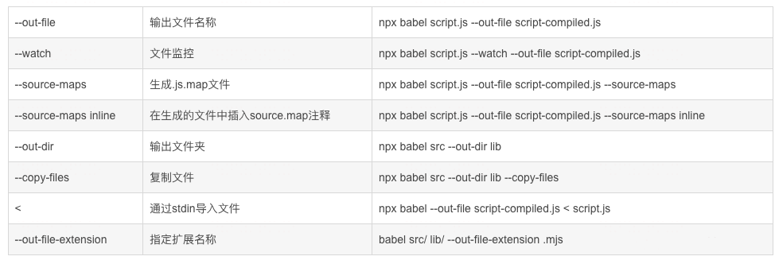

# Babel

在编写 JavaScript 代码时，经常需要使用一些 JavaScript 中的新特性，而新特性在旧的浏览器中兼容性并不好。此时就导致我们无法使用一些新的特性。

但是我们现在希望能够使用新的特性，我们可以采用折中的方案。依然使用新特性编写代码，但是代码编写完成时我们可以通过一些工具将新代码转换为旧代码。

Babel 就是这样一个工具，**可以将新的 js 语法转换为旧的 js，以提高代码的兼容性**。

## :star:Babel 是什么

[Babel 官网](https://www.babeljs.cn/)是这样描述的：`Babel is a JavaScript compiler.`，即 Babel 是一个 JavaScript 编译器。

Babel 是一个**工具链**，主要用于将采用 ECMAScript 2015+ 语法编写的代码转换为向后兼容的 JavaScript 语法，以便能够运行在当前和旧版本的浏览器或其他环境中。下面列出的是 Babel 能为你做的事情：

- 语法转换
- 通过 Polyfill 方式在目标环境中添加缺失的功能（通过引入第三方 polyfill 模块，例如 [core-js](https://github.com/zloirock/core-js)）
- 源码转换（codemods）


## :star:安装 Babel

Babel 提供 babel-cli 工具，用于命令行转码：

```sh
npm install -g babel-cli
```

检验是否安装成功

```sh
babel --version
```


## :star:配置 Babel

- babel 的配置文件有几种`.babelrc.json`，`babel.config.json`
- 还可以直接`package.json` 文件中配置
- 配置方法都一样，本文以`babel.config.json`配置文件为主
- 也建议使用`babel.config.json` 格式的配置文件。 [Babel 自身使用的就是这种格式](https://github.com/babel/babel/blob/main/babel.config.js)。
- 主要是对预设(presets) 和 插件(plugins) 进行配置

### 1.`babel.config.json`

在项目的根目录（`package.json` 文件所在的目录）下创建一个名为 `babel.config.json` 的文件，并输入如下内容：

```json
{
  "presets": [...],
  "plugins": [...]
}
```

请参阅 [`babel.config.json` 文档](https://www.babeljs.cn/docs/config-files#project-wide-configuration) 以了解更多关于配置参数的信息。

### 2.`.babelrc.json`

在你的项目中创建名为 `.babelrc.json` 的文件，并输入以下内容：

```json
{
  "presets": [...],
  "plugins": [...]
}
```

请参阅 [.babelrc 文档](https://www.babeljs.cn/docs/config-files#file-relative-configuration) 以了解更多关于配置参数的信息。

### 3.`package.json`

或者，还可以选择将 [`.babelrc.json`](https://www.babeljs.cn/docs/configuration#babelrcjson) 中的配置信息作为 `babel` 键（key）的值添加到 `package.json` 文件中，如下所示：

```json
{
  "name": "my-package",
  "version": "1.0.0",
  "babel": {
    "presets": [ ... ],
    "plugins": [ ... ],
  }
}
```

### 4.用 JavaScript 编写配置文件

你还可以用 JavaScript 来编写 `babel.config.js` 和 `.babelrc.js` 文件：

```js
module.exports = function (api) {
    api.cache(true);

    const presets = [ ... ];
    const plugins = [ ... ];

    return {
        presets,
        plugins
    };
}
```


## :star:使用 Babel

- 单体文件
- 命令行
- 配合Webpack使用

### 核心库 @babel/core

Babel 的核心功能包含在 `@babel/core` 模块中。看到 `core` 这个词了吧，意味着**核心**，没有它，无法使用 `babel` 进行编译。

安装：

```sh
npm install --save-dev @babel/core
# 或
npm install -D @babel/core
```

babel-core 的作用是把 js 代码分析成 ast（抽象语法树），方便各个插件分析语法进行相应的处理。

有些新语法在低版本 js 中是不存在的，如箭头函数，rest 参数，函数默认值等，这种语言层面的不兼容只能通过将代码转为 ast，分析其语法后再转为低版本 js。


### 命令行工具 @babel/cli

这是一个终端运行工具，内置的插件，运行你从终端使用 `babel` 的工具。同样也需要安装：

```sh
npm install -D @babel/cli
```

`babel` 提供的命令行工具，主要是提供 `babel` 这个命令




### 插件 Plugins

`plugins` 的本质是一个 `js` 程序，指示着 `Babel` 如何转换代码，如何解析代码。

例如`src/index.js`文件中编写了一个箭头函数，然而箭头函数在低版本浏览器是不兼容的，所以得进行代码转换。

```js
const fn = () => 1; // 箭头函数, 返回值为1
console.log(fn());
```

官方提供了一个插件，用于将箭头函数转换为普通的函数：

```sh
npm install -D @babel/plugin-transform-arrow-functions
```

安装完成后就可以通过命令行的方式来运行：

```sh
npx babel src --out-dir lib --plugins=@babel/plugin-transform-arrow-functions
```

结果在 `lib` 目录中的代码被转换了：

```js
const fn = function () {
    return 1;
};
console.log(fn());
```

`ES6+` 有那么多语法，如果一个浏览器不支持 `ES6+` ，那么我们不就需要安装很多这样的插件吗？

答案是不需要，下一节出现的`Presets`正是用于解决这种问题的。它是一组插件的集合，是一个将 `ES6+` 转换为低版本代码的插件集合。可以使用官方的，也可以自己自定义。


### 预设 Preset

从上面的例子可知，我们要转换一些语法就得使用各种插件，并且添加到配置文件，如果每次项目需要的 babel 插件都差不多，而我们每次都要进行重复的下载，配置工作，这样效率是不是很低，很繁琐。

这个时候我们就可以利用`presets`这个功能，将一些常用的 babel 插件，配置放入预设中，下载直接将这个预设放入配置文件即可。

预设环境，根据你需要支持的环境（配合targets中的浏览器信息）自动决定适合你的 Babel 插件。

官方针对常用的环境编写了一些 preset，如下所示：

- @babel/preset-env
- @babel/preset-flow
- @babel/preset-react
- @babel/preset-typescript

安装：preset-env 就是一堆 plugin 的集合

```sh
npm install -D @babel/preset-env
```

在`babel.config.json`中配置：

```json
{
    "presets": [...]
}
```


#### @babel/preset-env 参数

##### `targets`

支持的目标浏览器的列表

##### `useBuiltIns`

决定了babel打包时如何处理@babel/polyfilll 语句。参数有 entry、usage、false（默认值）。

- `entry`，会将文件中 `import "@babel/polyfill"` 语句结合 targets ，转换为一系列引入语句，去掉目标浏览器已支持的 polyfilll 模块，不管代码里有没有用到，只要目标浏览器不支持都会引入对应的 polyfilll 模块。
- `usage`，不需要手动在代码里写 `import "@babel/polyfill"`，即按需加载
- `false`，对 `import "@babel/polyfill"` 不作任何处理，也不会自动引入

有一点需要注意：<strong style="color:#DD5145">配置此参数的值为 usage ，必须要同时设置 corejs </strong>(如果不设置，会给出警告，默认使用的是`"corejs": 2`) 。

corejs@2已停止维护，所有新的功能添加到corejs@3中，`"corejs": 3`。

```json
{
    "presets": [
        [
            "@babel/preset-env",
            {
                "targets": {
                    "edge": "17",
                    "firefox": "60",
                    "chrome": "67",
                    "safari": "11.1"
                },
                "useBuiltIns": "usage",
                "corejs": "3.6.5"
            }
        ]
    ]
}
```

同时把 js 文件中的引入语句（`import "@babel/polyfill"`）删掉，因为是按需引入了。所以没有必要再安装 `@babel/polyfill`，只需安装`@babel/core`。


### 垫片 Ployfill

**polyfill** 是对执行环境或其他功能的补充。

**babel 默认只转换新的 JavaScript 语法**，比如箭头函数、扩展运算（spread）。

**不会转换新的 API**，例如 Iterator、Generator、Set、Maps、Proxy、Reflect、Symbol、Promise 等全局对象，以及一些定义在全局对象上的方法（比如 Object.assign）都不会转译。

因此`@babel/polyfill`和`@babel/runtime`就是为了解决新的API与全局对象或全局对象方法不足的问题。


#### @babel/polyfill

`@babel/polyfill` 的原理是当运行环境中并没有实现的一些方法，`@babel/polyfill` 会做兼容。

```sh
npm install -S @babel/polyfill
```

`@babel/polyfill` 包括 `core-js` 模块和一个自定义的 `regenerator runtime` 模块，可以模拟完整的 ES2015+ 环境。

- `core-js`：一个标准的库，所有新语法的 polyfill 的一个集合（注：ES6 中的 generator 函数，core-js 不能支持）
- `regenerator`：为了解决 core-js 不支持 ES6 中的 generator 函数

<strong style="color:#DD5145">从 Babel 7.4.0 起， @babel/polyfill 已经被官方弃用了</strong>，推荐直接使用 core-js 和 regenerator。

```js
//import "@babel/polyfill"; //之前的写法
import "core-js/stable";
import "regenerator-runtime/runtime";
```

> `regenerator-runtime` 包其实可以不用手动安装，因为在安装 `@babel/preset-env` 的时候会自动安装 `@babel/runtime`，而安装 `@babel/runtime` 的时候会自动安装`regenerator-runtime` 包。

`@babel/polyfill` 解决了 Babel 不转换新 API 的问题，但是它是直接通过向全局对象和内置对象的 prototype 上添加方法来实现的，**会导致污染了全局环境**，并且不同的代码文件中包含重复的代码，**导致编译后的代码体积变大**。


#### @babel/runtime

它是将 ES6 编译成 ES5 去执行。我们使用 ES6 的语法来编写，最终会通过`@babel/runtime`编译成 ES5。也就是说，不管浏览器是否支持 ES6，只要是 ES6 的语法，它都会进行转码成 ES5，所以就有很多冗余的代码。

- `@babel/runtime`它不会污染全局对象和内置对象的原型
- `@babel/runtime`无法做到智能化分析，**需要我们手动引入**
- `@babel/runtime`编译过程中会重复生成冗余代码

虽然 `@babel/runtime` 可以解决 `@babel/polyfill` 中的避免污染全局对象，但是它自己也有缺点的，例如现在有100个文件甚至更多，难道我需要一个个引入吗？

- 因此出现了 `@babel/plugin-transform-runtime`，它可以帮助我们去避免手动引入 import 的痛苦，并且它还做了公用方法的抽离。
- 比如说我们有100个模块都使用 promise，但是 promise 的 polyfill 仅仅存在1份。


#### @babel/plugin-transform-runtime

一个插件，可以重用 Babel 注入的帮助程序代码以节省代码大小。

安装 `@babel/plugin-transform-runtime` 作为开发依赖（使用 --save-dev）的同时，也需要安装 `@babel/runtime` 作为生产依赖（使用 --save）。这个看 vue-cli 生成的 `package.json` 就能发现。

```sh
npm install -D @babel/plugin-transform-runtime
npm install -S @babel/runtime
```

`@babel/plugin-transform-runtime`插件会智能化的分析我们的项目中所使用到需要转译的`js`代码，从而实现模块化从`@babel/runtime`中引入所需的`polyfill`实现。

```json
{
    "plugins": [
        [
            "@babel/plugin-transform-runtime",
            {
                "absoluteRuntime": false,
                "corejs": 3,
                "helpers": true,
                "regenerator": true,
                "useESModules": false
            }
        ]
    ]
}
```

- **helpers：默认值为 true**，表示是否开启内联的 babel helpers (即 babel 或者环境本来存在的某些对象方法函数) 如：extends，etc这样的在调用模块名字时将被替换名字。
- **polyfill：默认值为true**，表示是否把内置的东西 (Promise, Set, Map) 等转换成非全局污染的。
- **regenerator：默认值为true，**是否开启 generator 函数转换成使用 regenerator runtime 来避免污染全局域。

所以 `@babel/plugin-transform-runtime` 更适合开发工具包，库，一方面是体积够小，另一方面是用户（开发者）不会因为引用了我们的工具，包而污染了全局的原生方法，产生副作用，还是应该留给用户自己去选择。


## :star:ES6转ES5

babel 是一个独立的工具，可以不在 webpack 中使用。

新建文件夹`demo`，并初始化项目：

```sh
npm init -y
```

安装依赖：建议本地安装，只需要在自己需要的用到babel的目录下执行以下命令即可

```sh
npm install -D @babel/core @babel/cli @babel/preset-env
```

- `@babel/core`：babel 核心代码（必须安装）
- `@babel/cli`：命令行工具
- `@babel/preset-env`：预设环境

根目录下新建`babel.config.json`

```json
{
    "presets": ["env"]
}
```

新建文件`src/index.js`，使用ES6语法编写一段简单代码，例如：

```js
const sum = (a, b) => {
    return a + b;
}

console.log(sum(1, 2));
```

方式一：在命令行执行命令

```sh
babel src -d dist
```

> 上面的 `-d` 是 `--out--dir` 的缩写。

方式二：给 `package.json` 中配置命令，运行 `npm run build-d` 效果也是一致的

```json
"scripts": {
    "test": "echo \"Error: no test specified\" && exit 1",
    "build-t": "babel index.js",
    "build-d": "babel src -d lib",
    "build-o": "babel src/index.js -o dist/index.js"
},
```

- `build-t` ：单独编译某个文件
- `build-d`：把一个文件夹内的所有文件统一编译到另一个文件夹里（文件夹自动生成，不需要自己创建）
- `build-o`：把一个文件夹内的指定文件编译到另外的文件夹里（文件夹需要自己创建，可以指定文件名）

转译后的`dist/index.js`内容如下：

```js
"use strict";

var sum = function sum(a, b) {
  return a + b;
};
console.log(sum(2, 2));
```


## :star:Webpack中使用Babel

我们如果希望在 Webpack 支持 Babel，则需要向 Webpack 中引入 Babel 的 loader。

```bash
npm install -D babel-loader @babel/core @babel/preset-env
```

babel 是一个独立的工具，可以不在 webpack 中使用

- babel-loader：加载器
- `@babel/core`：babel 核心代码（必须安装）
- `@babel/preset-env`：预设环境，根据你需要支持的环境（配合targets中的浏览器信息）自动决定适合你的 Babel 插件

### 配置 babel

- `webpack.config.json`

```json
// 加载器
module: {
    rules: [
        // loader的配置
        {
            test: /\.js$/,
            exclude: /node_modules/, // 排除node_modules代码不编译
            loader: "babel-loader",
        }
    ]
}
```

- test,验证规则，是js文件
- loader，通过babel-loader去处理
- include，处理哪个文件夹下的文件
- exclude，排除哪个文件夹下的文件不处理

### 配置按需引入

安装：

```sh
npm install -D @babel/plugin-transform-runtime
npm install -S @babel/runtime
```

`babel.config.json`

```json
{
    "presets": [
        [
            "@babel/preset-env",
            {
                "useBuiltIns": "usage", //按需引入
                "corejs": 3 //版本
            }
        ]
    ],
    "plugins": [
        [
            "@babel/plugin-transform-runtime",
            {
                "absoluteRuntime": false,
                "corejs": 3,
                "helpers": true,
                "regenerator": true,
                "useESModules": false
            }
        ]
    ]
}
```

同时把 js 文件中的引入语句（`import "@babel/polyfill"`）删掉，因为是按需引入了。所以没有必要再安装 `@babel/polyfill`，只需安装`@babel/core`


## :page_facing_up:参考

[官方文档](https://www.babeljs.cn/)、[参考文章](https://blog.csdn.net/web22050702/article/details/128502822)、[参考文章](https://blog.csdn.net/weixin_45143481/article/details/111491299)、[参考文章](https://blog.csdn.net/weixin_41030302/article/details/104370157)、[参考文章](https://blog.csdn.net/longtengg1/article/details/118711030)、[参考文章](https://blog.csdn.net/weixin_33775582/article/details/86008308)

