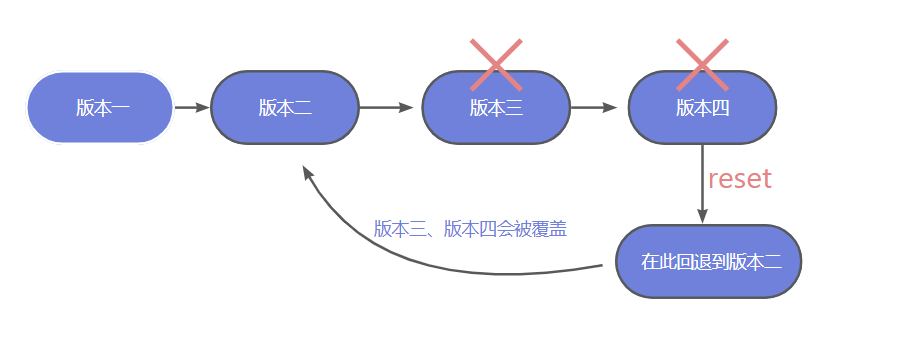
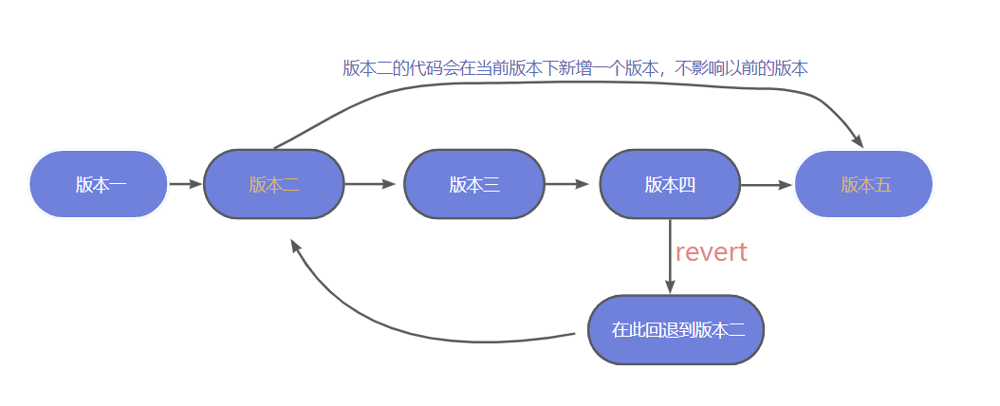
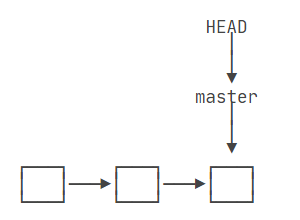
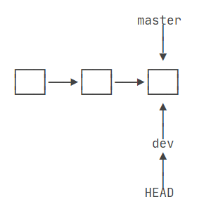
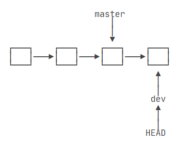
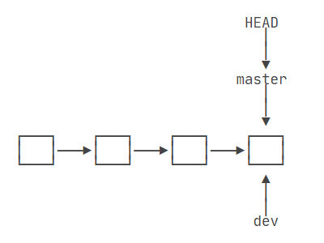
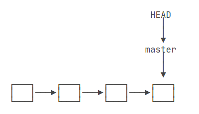

# 二、基本使用


## :star:安装与配置

配置 name 和 email（Git Bash中操作）

```shell
git config --global user.name "xxxx"	# 设置用户签名
git config --global user.email "xxx@xxx.xxx"	# 设置用户邮箱

git config --list	# 查看是否配置成功
git config user.name	# 查看用户名
git config user.email	# 查看邮箱
```

## :star:基本操作

```sh
git init	# 初始化一个版本库

git add <filename>		# 将文件提交到临时存储区（暂存区）
git add *			    # 将所有已修改（未跟踪）的文件暂存
git add .

git commit -m "日志信息"	 	# 提交暂存区的文件，将文件提交到本地库
git commit -a -m "日志信息"		# 提交已修改的所有被跟踪文件的新内容未跟踪的文件不会提交）

# 如果只是想修改commit的注释内容
git commit --amend -m "修改commit的信息" 

git status	# 查看本地库状态
git diff	# 查看修改内容

git reflog	# 查看历史记录
git log		# 查看版本详细信息
```

重置文件

```sh
git restore <filename> # 恢复文件
git restore --staged <filename> # 取消暂存状态
```

删除文件

```sh
git rm <filename> # 删除工作区文件，并且将这次删除放入暂存区（已修改且未暂存的文件不允许删除）
git rm <filename> -f # 强制删除
```

移动文件

```sh
git mv from to # 移动文件 重命名文件
git mv 1.txt 2.txt # 1.txt 重命名为 2.txt
```


## :star:版本穿梭

```sh
git status	# 查看本地库状态
git diff	# 查看修改内容，顾名思义就是查看difference
git reflog	# 查看当前版本库的提交历史
git log		# 查看版本详细信息，会按时间先后顺序列出所有的提交，最近的更新排在最上面
```

首先，Git 必须知道当前是哪个版本，在 Git 中，用`HEAD`表示当前版本，上一个版本就是`HEAD^`，上上一个版本就是`HEAD^^`，当然往上100个版本写100个`^`比较容易数不过来，所以写成`HEAD~100`。

- `--soft`：不删除工作空间改动代码，撤销 commit，不撤销 git add .

- `--hard`：删除工作空间改动代码，撤销 commit，撤销 git add .

### reset 命令

`rest`命令会<strong style="color:#DD5145">强行覆盖</strong>当前版本和要回退的版本之间的其他版本（不太建议）。

```sh
git reset --hard 版本号/<commit-hash>	# 版本穿梭，回到某一个版本

# 此时执行commit后，还没执行push时，想要撤销这次的commit，该怎么办？
# 撤销暂存区add的内容（回退到上次提交，并清除本地提交的代码）
git reset --hard HEAD^
# 仅仅只是撤销commit（回退到上次提交，但不清除本地提交的代码）
git reset --soft HEAD^

# 如果控制台出现More?，则将命令改成 git reset --soft HEAD^^即可）
git reset HEAD~	# HEAD代表：上一次提交
```

**reset 命令只能回滚最新的提交，无法满足保留最后一次提交，只回滚之前的某次提交**



### revert 命令

在当前版本的基础上新增一个版本，不影响以前的代码。

```sh
git log		# 查看版本详细信息
git revert -n (版本号)
```



### 撤销修改

当我们在工作中修改了一个文件，突然发现内容好像改的不对，想重新修改，这时又不知道自己改了什么代码，想撤销修改怎么办呢？

有一个最简单的方法，就是 `git checkout -- file`。

> `git checkout -- file`命令中的`--`很重要，没有`--`，就变成了“切换到另一个分支”的命令。

首先，使用 `git status` 查看一下

```sh
git status
# On branch master
# Changes not staged for commit:
#   (use "git add <file>..." to update what will be committed)
#   (use "git checkout -- <file>..." to discard changes in working directory)

#	 modified:   readme.txt

# no changes added to commit (use "git add" and/or "git commit -a")
```

你可以发现，Git 会告诉你，`git checkout -- file` 可以丢弃工作区的修改：

```sh
git checkout -- readme.txt
```

命令`git checkout -- readme.txt`意思是，把`readme.txt`文件在工作区的修改全部撤销，有两种情况：

- 一种是`readme.txt`自修改后还没有被放到暂存区（即 git add 了），现在撤销修改就回到和版本库一模一样的状态；
- 一种是`readme.txt`已经添加到暂存区后，又作了修改，现在撤销修改就回到添加到暂存区后的状态。

总之，就是让这个文件回到最近一次`git commit`或`git add`时的状态。


##  :star:分支管理

git 在存储文件时，每一次代码的提交都会创建一个与之对应的节点，git 就是通过一个一个的节点来记录代码的状态的。

节点会构成一个树状结构，表示这个树会存在分支，默认情况下仓库只有一个分支，命名为 master。

在使用 git 时，可以创建多个分支，分支之间相互独立，在一个分支上修改代码不会影响其他的分支。

一开始的时候，`master`分支是一条线，Git 用`master`指向最新的提交，再**用`HEAD`指向`master`，就能确定当前分支**，以及当前分支的提交点：



当我们创建新的分支，例如`dev`时，Git新建了一个指针叫`dev`，指向`master`相同的提交，再把`HEAD`指向`dev`，就表示当前分支在`dev`上：



不过，从现在开始，对工作区的修改和提交就是针对`dev`分支了，比如新提交一次后，`dev`指针往前移动一步，而`master`指针不变：



假如我们在`dev`上的工作完成了，就可以把`dev`合并到`master`上。

Git 怎么合并呢？最简单的方法，就是直接把`master`指向`dev`的当前提交，就完成了合并：



> 所以Git合并分支也很快！就改改指针，工作区内容也不变！

合并完分支后，甚至可以删除`dev`分支。删除`dev`分支就是把`dev`指针给删掉，删掉后，我们就剩下了一条`master`分支：



### 1.查看分支

```sh
git branch		# 查看本地分支
git branch -r	# 查看远程分支
git branch -a 	# 列出所有本地分支和远程分支
```

### 2.创建与删除分支

```sh
git branch <name>	# 创建新的分支----注意：新分支创建后不会自动切换为当前分支

git branch -m <oldName> <newName> # 重命名

git branch -d <name>	# 删除分支，-d 选项只能删除已经参与了合并的
# 不能删除当前工作分支或者不存在的分支（会在删除前检查merge状态）
git branch -D <name>	# 对于未有合并的分支是无法删除的，如果想强制删除一个分支，可以使用-D选项
# -D 是 --delete --force 的简写
```

### 3.创建并切换分支

```sh
git checkout <name>		# 切换分支
git checkout -b <name>	# 创建，并切换分支

git switch <name>		# 切换分支
git switch -c <name>	# 创建，并切换分支
```

> 在开发中，都是在自己的分支上编写代码，代码编写完成后，在将自己的分支合并到主分支中。
>
> git checkout 不仅可以操作分支，还可以操作文件。这条命令可以重写工作区，是一个很危险的命令

### 4.merge 合并

```sh
# 需要先切换到主分支（默认为master）
git switch master
# 合并分支，将 new 分支合并到 master 分支上（默认为master）
git merge new
```

合并分支后会出现 `Fast-forward` 信息，Git 告诉我们，这次合并是 “快进模式”，也就是直接把`master`指向`dev`的当前提交，所以合并速度非常快。


### 5.rebase 变基

在开发中除了通过 **merge** 来合并分支外，还可以通过 **变基（rebase）** 来完成分支的合并。

我们通过 merge 合并分支时，在提交记录中会将所有的分支创建和分支合并的过程全部都显示出来。

当项目比较复杂，开发过程比较波折时，我必须要反复的创建、合并、删除分支。这样一来将会使得我们代码的提交记录变得极为混乱。

**原理（变基时发生了什么）：**

1. 当我们发起变基时，git 会首先找到两条分支的**最近的共同祖先**
2. **对比**当前分支相对于祖先的**历史提交**，并且将它们**提取**出来**存储**到一个**临时文件**中
3. 将当前部分**指向**目标的**基底**
4. 以**当前基底**开始，**重新执行**历史操作

```sh
# 需要先切换到 new 分支
git switch new
# 将 new 分支变基到 master 主分支上（在需要变基的分支上执行）
git rebase master
```

变基 和 merge 对于合并分支来说最终的结果是一样的！但是变基会使得代码的提交记录更整洁更清晰！

> 注意！大部分情况下合并和变基是可以互换的，但是如果分支已经提交给了远程仓库，那么这时尽量不要变基。


### 5.Bug 分支

每个bug都可以通过一个新的临时分支来修复，修复后，合并分支，然后将临时分支删除。

当你准备修复一个代号101的bug时，很自然地，你想创建一个分支`issue-101`来修复它，但是，等等，当前正在`dev`上进行的工作还没有提交。

幸好，Git 还提供了一个`stash`功能，可以把当前工作现场 **“储藏”** 起来，等以后恢复现场后继续工作：

```sh
git stash
# Saved working directory and index state WIP on dev: f52c633 add merge
```

现在，用`git status`查看工作区，就是干净的（除非有没有被Git管理的文件），因此可以放心地创建分支来修复bug。

首先确定要在哪个分支上修复bug，假定需要在`master`分支上修复，就从`master`创建临时分支：

```sh
git checkout master
# Switched to branch 'master'
# Your branch is ahead of 'origin/master' by 6 commits.
#   (use "git push" to publish your local commits)

git checkout -b issue-101
# Switched to a new branch 'issue-101'
```

修复bug中...

修复完成后，切换到`master`分支，并完成合并，最后删除`issue-101`分支：

```sh
git switch master
# Switched to branch 'master'
# Your branch is ahead of 'origin/master' by 6 commits.
#   (use "git push" to publish your local commits)

git merge --no-ff -m "merged bug fix 101" issue-101
# Merge made by the 'recursive' strategy.
#  readme.txt | 2 +-
#  1 file changed, 1 insertion(+), 1 deletion(-)

git branch -d issue-101
# Delete branch issue-101 (was 4c805e2)
```

现在，是时候接着回到`dev`分支干活了！

```sh
git switch dev
# Switched to branch 'dev'

git status
# On branch dev
# nothing to commit, working tree clean
```

工作区是干净的，刚才的工作现场存到哪去了？用`git stash list`命令看看：

```sh
git stash list
# stash@{0}: WIP on dev: f52c633 add merge
```

工作现场还在，Git 把stash内容存在某个地方了，但是需要恢复一下，有两个办法：

一是用`git stash apply`恢复，但是恢复后，stash 内容并不删除，你需要用`git stash drop`来删除；

另一种方式是用`git stash pop`，恢复的同时把 stash 内容也删了：

```sh
git stash pop
# On branch dev
# Changes to be committed:
#   (use "git reset HEAD <file>..." to unstage)

#    new file:   hello.py

# Changes not staged for commit:
#   (use "git add <file>..." to update what will be committed)
#   (use "git checkout -- <file>..." to discard changes in working directory)

#	 modified:   readme.txt

# Dropped refs/stash@{0} (5d677e2ee266f39ea296182fb2354265b91b3b2a)
```

再用`git stash list`查看，就看不到任何stash内容了：

```sh
git stash list
```

你可以多次stash，恢复的时候，先用`git stash list`查看，然后恢复指定的stash，用命令：

```sh
git stash apply stash@{0}
```


### 6.Feature 分支

添加一个新功能时，你肯定不希望因为一些实验性质的代码，把主分支搞乱了，所以，每添加一个新功能，最好新建一个feature分支，在上面开发，完成后，合并，最后，删除该feature分支。

现在，你终于接到了一个新任务：开发代号为Vulcan的新功能

```sh
git switch -c feature-vulcan
# Switched to a new branch 'feature-vulcan'
```

经过漫长的开发，终于开发完毕后

切回`dev`，准备合并：

```sh
git switch dev
```

一切顺利的话，feature分支和bug分支是类似的，合并，然后删除。

但是！就在此时，接到上级命令，因经费不足，新功能必须取消！

虽然白干了，但是这个包含机密资料的分支还是必须就地销毁：

```sh
git branch -d feature-vulcan
# error: The branch 'feature-vulcan' is not fully merged.
# If you are sure you want to delete it, run 'git branch -D feature-vulcan'.
```

销毁失败。Git 友情提醒，`feature-vulcan`分支还没有被合并，如果删除，将丢失掉修改。

如果要强行删除，需要使用大写的`-D`参数：

```sh
git branch -D feature-vulcan
# Deleted branch feature-vulcan (was 287773e).
```


## :star:远程库操作

### 1.查看远程仓库

```bash
git remote		# 列出当前的关联的远程库
git remote --verbose # 查看当前所有远程地址别名
git remote -v

git remote show <remote-name> # 查看某个远程仓库的详细信息
```


### 2.操作远程仓库

```sh
git remote add origin <url> 	# 关联远程仓库，添加后，远程库的名字就是origin
# 这是Git默认的叫法，也可以改成别的，但是origin这个名字一看就知道是远程库

git remote remove <远程库名>  	# 删除远程库，使用前，建议先用 git remote -v 查看远程库信息
# 此处的“删除”其实是解除了本地和远程的绑定关系，并不是物理上删除了远程库
```


### 3.向远程库推送

由于远程库是空的，我们第一次推送 master 分支时，加上了-u参数，Git 不但会把本地的 master 分支内容推送的远程新的 master 分支，还会把本地的 master 分支和远程的 master 分支关联起来，在以后的推送或者拉取时就可以简化命令。

```sh
git push -u <远程库名> <分支名> 			# 向远程库推送代码，并和当前分支关联
git push <远程库名> <分支名>				# 后续直接push即可

git push <远程库名> <本地分支>:<远程分支> 	 # 把本地的分支推送给远程的分支
```

> 注意：推送代码之前，一定要先从远程库中拉取最新的代码

### 4.从远程库克隆

只要你想往本地下载远程仓库完整的代码就可以用，不用连接远程仓库（连接了也可以），不适用于更新本地代码。

```sh
git clone <url>		# 将远程仓库的内容克隆到本地
git clone <url> <重命名>
```


### 5.从远程库拉取代码

必须连接远程仓库才能用，不管本地有没有代码。可以用于下载完整代码、更新本地代码。

```sh
git pull <远程库名> <分支名>  # 拉取远程仓库

# 要想推送成功，必须先确保本地库和远程库的版本一致
git fetch	# fetch会从远程库拉取代码，但它不会将代码和当前分支自动合并，必须要手动合并
```


## :star:tag 标签

当头指针没有执行某个分支的头部时，这种状态我们称为**分离头指针（HEAD detached）**，HEAD指向谁就显示谁的代码

分离头指针的状态下，也可以操作操作代码，但是这些操作**不会出现在任何的分支上**，所以注意不要再分离头指针的状态下来操作仓库。

如果非得要回到后边的节点对代码进行操作，则可以选择**创建新分支后再操作**：

```bash
git switch -c <分支名> <提交id/节点> # 回到以前版本
```

可以为提交记录**设置标签**，设置标签以后，可以通过标签**快速识别**出不同的开发节点：

```bash
git tag
git tag <版本>
git tag <版本> <提交id>
git push <远程仓库> <标签名> # 推送标签
git push <远程仓库> --tags # 推送所有标签
git tag -d <标签名> # 删除标签
git push <远程仓库> --delete <标签名> # 删除远程标签
```


## :star:.gitignore

默认情况下，git 会监视项目中所有内容，但是有些内容比如 node_modules 目录中的内容，我们不希望它被 git 所管理。

我们可以在项目目录中添加一个`.gitignore`文件，来设置那些需要 git 忽略的文件。一行一个文件

### **语法**

- \# 开头为注释行
- 空行即直接写文件名则该文件夹或文件被忽略上传
- 在文件或者文件夹前加 / 则表示仅在当前目录下该文件或者文件夹被忽略，也就是与.gitignore同级目录的文件或者文件夹。
- 在文件夹后加 / 则表示该文件夹下所有文件都被忽略
- .a 表示所有已.a为结尾的问价都被忽略 当然也可以批量进行操作 如：.[ab]为忽略所有以.a，.b为结尾的的问价 []可以类似正则进行匹配 例如[1-9]
- ！为否定忽略 

```
# 提交时忽略此文件夹
node_modules	
package-lock.json

# 忽略以.log结尾的文件
*.log	


# 忽略*.o和*.a文件
 *.[oa]

# 忽略dbg文件和dbg目录
dbg

# 只忽略dbg目录，不忽略dbg文件
dbg/

# 只忽略当前目录下的dbg文件和目录，子目录的dbg不在忽略范围内
/dbg

```


## 参考

[参考文章](https://blog.csdn.net/qq_38758371/article/details/127030120)、[参考文章](https://blog.csdn.net/qq_43211060/article/details/122774813)、[参考文章](https://blog.csdn.net/weixin_45518253/article/details/115425743)、[参考文章](https://blog.csdn.net/oZuiJiaoWeiYang/article/details/45220901)、[参考文章](https://pypypy.blog.csdn.net/article/details/104551896)、[Git教程](https://www.liaoxuefeng.com/wiki/896043488029600)、[参考文章](https://blog.csdn.net/L1147484597/article/details/128480953)

