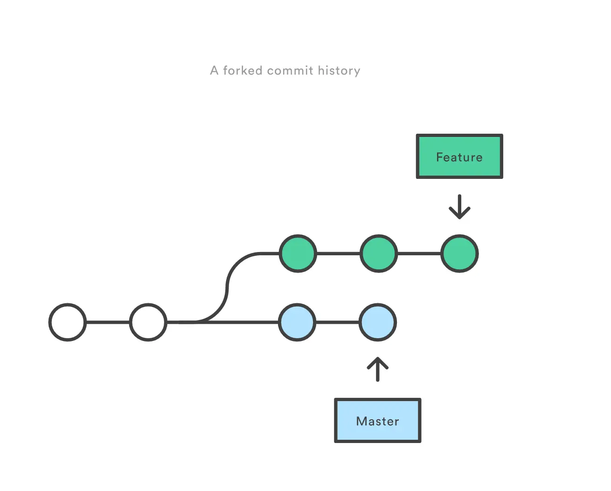
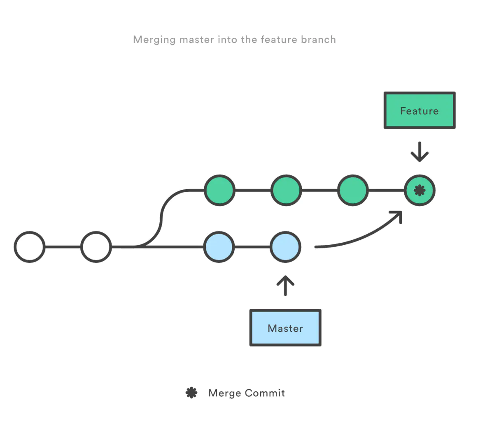
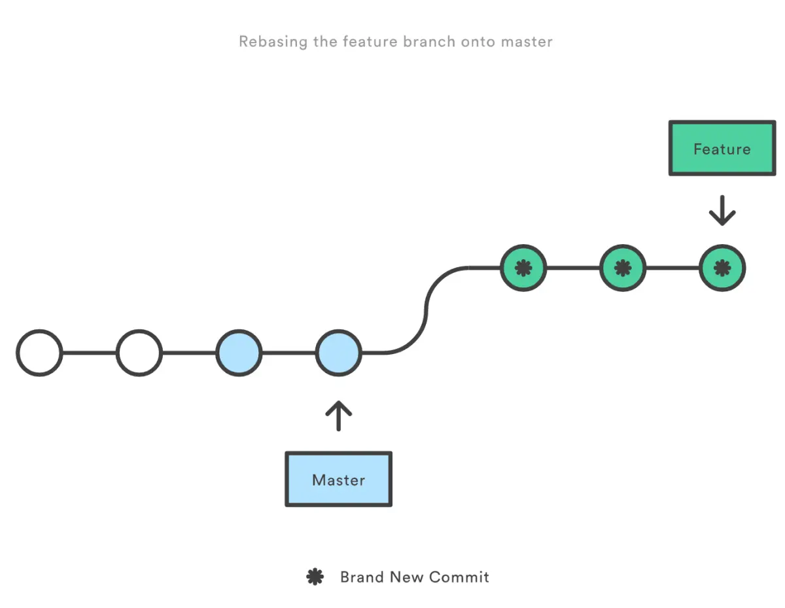
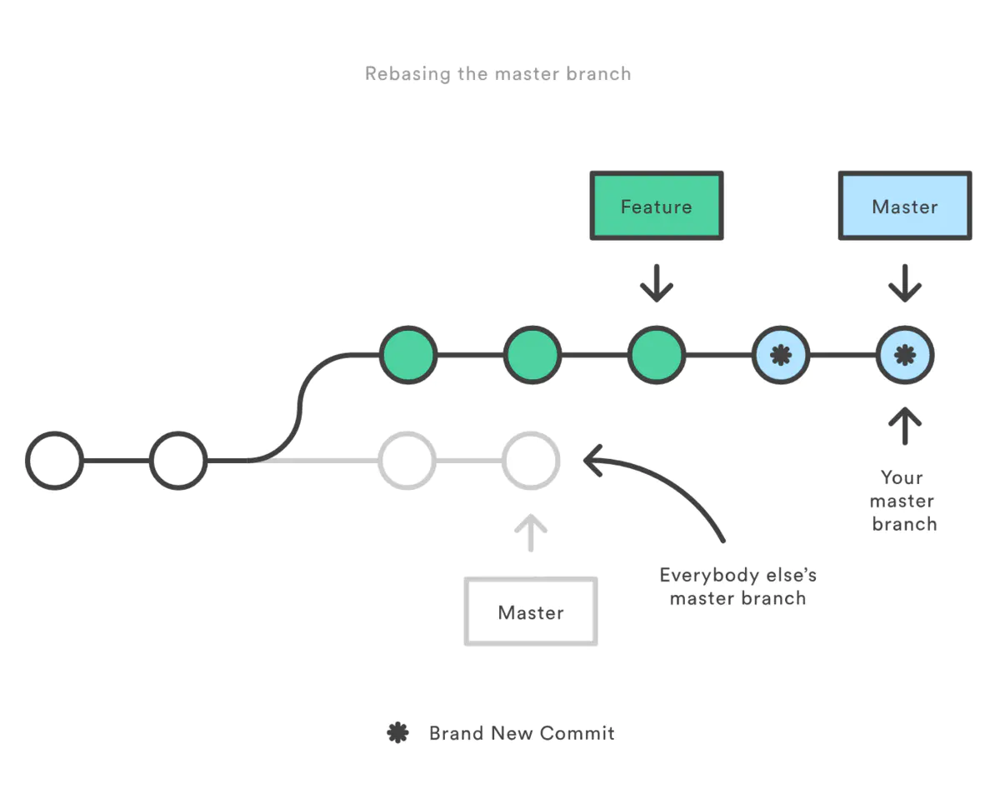

# 五、面试题

## Q1.常用的 git 指令

```sh
git init                     # 新建 git 代码库
git add                      # 添加指定文件到暂存区
git rm                       # 删除工作区文件，并且将这次删除放入暂存区
git commit -m [message]      # 提交暂存区到仓库区
git branch                   # 列出所有分支
git checkout -b [branch]     # 新建一个分支，并切换到该分支
git status                   # 显示有变更的文件
```

详细资料可以参考： [《常用 Git 命令清单》](http://www.ruanyifeng.com/blog/2015/12/git-cheat-sheet.html)

## Q2.git pull 和 git fetch 的区别

```sh
git pull	# 会将远程仓库的变化下载下来，并和当前分支合并

git fetch	# 只是将远程仓库的变化下载下来，并没有和本地分支合并
```

当你执行 `git fetch` 时，它会从所需的分支中提取所有新提交，并将其存储在本地存储库中的新分支中。

如果要在目标分支中反映这些更改，必须在 `git fetch` 之后执行`git merge`。

只有在对目标分支和获取的分支进行合并后才会更新目标分支。为了方便起见，请记住以下等式：<strong style="color:#DD5145">`git pull = git fetch + git merge`</strong>


## Q3.git rebase 和 git merge 的区别

git merge 和 git rebase 都是用于分支合并，关键在 commit 记录的处理上不同。

以下面的一个工作场景说明其区别：

> 你在一个 feature 分支进行新特性的开发，与此同时，master 分支的也有新的提交。



为了将 master 上新的提交合并到你的 feature 分支上，你有两种选择：`merge` or `rebase`

### 1.merge

```sh
git switch feature	# 切换到 feature分支上
git merge master	# 合并到 master分支上

# 或者
git merge master feature
```

> 那么此时在 feature 上 git 自动会产生一个新的 commit (merge commit)

git merge 会新建一个新的 commit 对象，然后两个分支以前的 commit 记录都指向这个新 commit 记录。这种方法会保留之前每个分支的 commit 历史。

- 优点：记录了真实的commit情况，包括每个分支的详情。

- 缺点：每次 merge 会自动产生一个 merge commit，所以在使用一些 git 的 GUI tools，特别是 commit 比较频繁时，看到分支很杂乱。




### 2.rebase

本质是变基，哪么变基是什么? <strong style="color:#DD5145">找公共祖先</strong>

**原理（变基时发生了什么）：**

1. 当我们发起变基时，git 会首先找到两条分支的**最近的共同祖先**
2. **对比**当前分支相对于祖先的**历史提交**，并且将它们**提取**出来**存储**到一个**临时文件**中
3. 将当前部分**指向**目标的**基底**
4. 以**当前基底**开始，**重新执行**历史操作

```sh
git switch feature	# 切换到 feature分支上
git rebase master	# 合并到 master分支上
```

git rebase 会先找到两个分支的第一个共同的 commit 祖先记录，然后将提取当前分支这之后的所有 commit 记录，然后将这个 commit 记录添加到目标分支的最新提交后面。

经过这个合并后，两个分支合并后的 commit 记录就变为了线性的记录了。

- 优点：得到更简洁的项目历史，删除掉了 merge commit

- 缺点：如果合并出现代码问题不容易定位，因为 re-write 了 history



**合并时如果出现冲突需要按照如下步骤解决：**

- 修改冲突部分
- git add
- `git rebase --continue`
- （如果第三步无效可以执行 `git rebase --skip`）

> 不要在 git add 之后习惯性的执行 git commit 命令

**The Golden Rule of Rebasing rebase 的黄金法则：**

```csharp
never use it on public branches(不要在公共分支上使用)
```

如果你 rebase 你的 feature 分支：rebase 将所有 master 的 commit 移动到你的 feature 的顶端。

问题是：其他人还在 original master上开发，由于你使用了rebase 移动了 master，git 会认为你的主分支的历史与其他人的有分歧，会产生冲突。

所以在执行git rebase 之前 问问自己：

> 会有其他人看这个分支么？
>
> if YES 不要采用这种带有破坏性的修改 commit 历史的 rebase 命令
>
> if NO ok，随你便，可以使用 rebase



### 3.总结

- 如果你想要一个干净的，没有 merge commit 的线性历史树，那么你应该选择 git rebase
- 如果你想保留完整的历史记录，并且想要避免重写 commit history 的风险，你应该选择使用 git merge


## Q4.什么是 git stash?

首先应该解释 git stash 的必要性。

通常情况下，当你一直在处理项目的某一部分时，如果你想要在某个时候切换分支去处理其他事情，事情会处于混乱的状态。问题是，你不想把完成了一半的工作的提交，以便你以后就可以回到当前的工作。解决这个问题的答案是 git stash。

再解释什么是 git stash。

stash 会将你的工作目录，即**修改后的跟踪文件**和**暂存的更改**保存在一堆未完成的更改中，你可以随时重新应用这些更改。


## Q5.提交对象包含什么？

Commit 对象包含以下组件，你应该提到以下这三点：

- 一组文件，表示给定时间点的项目状态
- 引用父提交对象
- SHAI 名称，一个40个字符的字符串，提交对象的唯一标识

## Q6.查看分支是否已合并为master

要知道某个分支是否已合并为 master，你可以使用以下命令：

```sh
git branch –merged		# 它列出了已合并到当前分支的分支

git branch –no-merged	# 它列出了尚未合并的分支
```


## Q7.git 发生冲突的场景？如何解决

- 多个分支修改了同一个文件
- 多个分支修改了同一个文件的名称

如果两个分支中分别修改了不同文件中的部分，是不会产生冲突，直接合并即可。

当`Git`无法自动合并分支时，就必须首先解决冲突，解决冲突后，再提交，合并完成

解决冲突就是把`Git`合并失败的文件手动编辑为我们希望的内容，再提交


## 参考

[参考文章](https://segmentfault.com/a/1190000019315509)、[参考文章](https://vue3js.cn/interview/git/conflict.html#%E4%B8%80%E3%80%81%E6%98%AF%E4%BB%80%E4%B9%88)、[参考文章](https://www.liaoxuefeng.com/wiki/896043488029600)、[Bitbucket](https://www.atlassian.com/git/tutorials)、[参考文章](https://www.jianshu.com/p/f23f72251abc)

