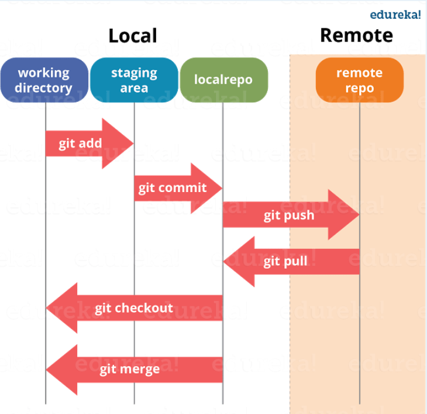

# 三、基础操作流程



## 上传远程仓库（remote）

目前我对于 git 所有操作都是在本地进行的。在开发中显然不能这样的，这时我们就需要一个远程的 git 仓库。

远程的 git 仓库和本地的本质没有什么区别，不同点在于远程的仓库可以被多人同时访问使用，方便我们协同开发。

在实际工作中，git 的服务器通常由公司搭建内部使用或是购买一些公共的私有 git 服务器。

我们学习阶段，直接使用一些开放的公共 git 仓库。目前我们常用的库有两个：GitHub 和 Gitee（码云）

### 将本地库上传 GitHub

```sh
git init # 1.初始化本地项目 git 仓库 （在我们的项目文件夹下执行）

git add . # 2.跟踪新文件，将内容从工作目录添加到暂存区（注意点号与其前面的 add 间有空格）

git commit -m '当次提交的描述' # 3.提交项目到本地仓库

git remote add origin git@github.com:chenglun17/git-demo.git # 4.关联github仓库

git pull --rebase origin master # 5.远端代码与本地代码的冲突合并（远端代码可能有本地代码没有的文件，故需要我们去合并）

git push --set-upstream origin master # 6.将代码上传github，本地分支main
git push -u origin master #上一条命令的简写方式（由于新建的远程仓库是空的，所以要加上-u这个参数）
git push origin master # 等远程仓库里面有了内容之后，下次再从本地库上传内容的时候就不用加-u了
```

### 将本地库上传 Gitee

```sh
git init # 1.初始化本地项目 git 仓库 （在我们的项目文件夹下执行）

git add . # 2.跟踪新文件，将内容从工作目录添加到暂存区（注意点号与其前面的 add 间有空格）

git commit -m '当次提交的描述' # 3.提交项目到本地仓库

git remote add origin git@gitee.com:chenglun17/git-demo.git # 4.将本地仓库与远端仓库建立链接

git pull --rebase origin master # 5.远端代码与本地代码的冲突合并（远端代码可能有本地代码没有的文件，故需要我们去合并）

git push -u origin master # 6.提交
git push -u origin master -f # -f 强制提交 （这种提交方式对远程协作的情况不合适）
```

