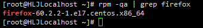

# 二、基础篇

## :star:文件与目录结构

Linux的文件系统是采用<strong style="color:#DD5145">级层式的树状</strong>目录结构，在此结构在的最上层是<strong style="color:#DD5145">根目录`/`</strong>，然后在此目录下创建其他目录。

记住一句话：<strong style="color:#DD5145">在Linux世界里，一切皆文件</strong>

> Linux会把计算机的硬件映射成一个文件来管理


#### 具体的目录结构

- **`/bin`**，[<strong style="color:#DD5145">常用</strong>]（`/usr/bin`、`/usr/local/bin`）

  是Binary的缩写，这个目录存放着最经常使用的命令

- **`/sbin`**，（`、usr/sbin`、`/usrlocal/sbin`）

  s就是Super User的意思，存放着系统管理员使用的系统管理程序

- **`/home`**，[<strong style="color:#DD5145">常用</strong>]

  存放着普通用户的主目录，在Linux中每个用户都有一个自己的目录，一般该目录以用户的账号命名

- **`/root`**，[<strong style="color:#DD5145">常用</strong>]

  该目录为系统管理员，即超级权限者的用户主目录

- **`/lib`**，

  系统开机所需要的最基本的动态链接共享库，其作用类似于Windows里的DLL文件

  几乎所有的应用程序都需要用到这些共享库

- **`/lost+found`**，

  这个目录一般情况下是空的，当系统非法关机后，这里就存放了一些文件（一般被隐藏起来的）

- **`/etc`**，etcetera的缩写，[<strong style="color:#DD5145">常用</strong>]

  所有的系统管理所需要的配置文件和子目录 `my.conf`

- **`/usr`**，unix software resource的缩写，[<strong style="color:#DD5145">常用</strong>]

  这是一个非常重要的目录，用户的很多应用程序和文件都存放在这个目录，类似于Windows下的program files 目录

- **`/boot`**，[<strong style="color:#DD5145">常用</strong>]

  存放的是启动Linux时使用的一些核心文件，包括一些连接文件以及镜像文件

- **`/proc`**，[<strong style="color:#DD5145">不能动</strong>]

  这个目录是一个虚拟的目录，它是系统内存的映射，访问此目录来获取系统信息

- **`/srv`**，service的缩写，[<strong style="color:#DD5145">不能动</strong>]

  该目录存放着一些服务启动之后需要提取的数据

- **`/sys`**，[<strong style="color:#DD5145">不能动</strong>]，这是Linux2.6内核的一个很大变化

  该目录下安装了2.6内核中新出现的一个文件系统`sysfs`

- **`/tmp`**，

  该目录用来存放一些临时文件

- **`/dev`**，device的缩写

  类似Windows中的设备管理器，把所有的硬件以文件形式存储

- **`/mdeia`**，[<strong style="color:#DD5145">常用</strong>]

  Linux系统会自动识别一些设备，例如U盘，光驱等等，识别之后，会把这些设备挂载到这个目录上

- **`/mnt`**，mount的缩写，[<strong style="color:#DD5145">常用</strong>]

  系统提供该目录是为了让用户临时挂载别的文件系统的，我们可以将外部的存储挂载在`/mnt/`上，然后进入该目录就可以查看里面的内容

- **`/opt`**，option的缩写

  这是给主机额外<strong style="color:#DD5145">安装软件</strong>（安装包）所存放的目录，如安装Oracle数据库就可以存放在该目录下。默认为空

- **`/usr/local`**，[<strong style="color:#DD5145">常用</strong>]

  这是另一个给主机额外安装软件所存放的目录。一般是通过编译源码方式安装的程序

- **`/var`**，[<strong style="color:#DD5145">常用</strong>]

  该目录存放着不断扩充的东西，习惯将经常被修改的目录存放在这个目录下。包括各种日志文件

- **`/selinux`**，security-enhanced linux的缩写，（一般未启用）

  SELinux是一种安全子系统，它能控制程序只能访问特定文件，有三种工作模式，可以自行设置


## :star:Vi 和 Vim编辑器

Linux 系统会内置 vi 文本编辑器。

Vim 具有程序编辑的能力，可以看做是Vi 的增强版本，具有代码补全、编译及错误跳转等功能，可以主动的以字体颜色辨别语法的正确性，方便程序设计。

### vi 和 vim 常用的三种模式

- <strong style="color:#DD5145">正常模式</strong>

  以 vim 打开一个档案就直接进入**一般模式（默认模式）**，在这个模式中，可以使用【上下左右】按键来移动光标

  可以使用【删除符号】或【删除整行】来处理文档内容，也可以使用【**复制、粘贴**】来处理文件数据

- <strong style="color:#DD5145">插入模式</strong>

  按下【i、I、o、O、a、A、r、R】等任一字母之后才会进入**编辑模式**，一般按 i 即可

- <strong style="color:#DD5145">命令行模式</strong>

  **先按一下`esc`，再输入`:`**进入命令行模式，在这个模式中，可以提供相关指令，完成**读取**、**存盘**、**替换**、**离开 vim**、**显示行号**等

  > wq（write quit）写入并退出


### vi 和 vim 快捷键

1. 拷贝当前行`yy`，拷贝当前行向下的5行`5yy`，并粘贴（输入`p`）
2. 删除当前行`dd`，删除当前行向下的5行`5dd`
3. 在文件中查找某个单词【**命令行下** `/关键字`，回车 查找，输入` n` 就是查 找下一个】，区分大小写
4. 设置文件的行号【**命令行下**`:set nu`】，取消文件的行号【`:set nonu`】
5. **编辑模式**`/etc/profile`文件，使用快捷键到该文档的**最末行**【`G`】和**最首行**【`gg`】
6. 在一个文件中输入"hello"，然后又**撤销**这个动作【**一般模式**下输入`u`】
7. 编辑`/etc/profile`文件，并将光标移动到20行【**一般模式**下，先输入20，再输入`shfit + g`】
8. 更多的查看整理的文档


## :star:网络配置

### 网络连接的三种方式

- **桥接模式**：虚拟系统直接连接外部物理网络，主机起到了网桥的作用，虚拟机可以直接访问外部网络，但是容易造成IP冲突
- **NAT模式**：即网络地址转换模式，虚拟机和主机构建一个专用网络，并通过NAT设备对IP进行转换。虚拟系统通过共享主机IP可以访问外部网络，但外部网络无法访问虚拟机，不会造成IP冲突
- **主机模式**：独立的系统，虚拟机只与主机共享一个专用网络，与外部网络无法通信

### 查看网络IP和网关

- 查看Windows环境下的网络配置：`ipconfig`
- 查看Linux环境下的网络配置：`ifconfig`

### 配置网络IP地址

**1.自动获取IP**

登录后，通过界面来设置自动获取ip

**2.指定静态IP**

直接修改配置文件来指定IP，并可以连接到外网

编辑`vi /etc/sysconfig/network-scripts/ifcfg-ens33`

`ifcfg-ens33`文件内容：

```sh
TYPE="Ethernet"
PROXY_METHOD="none"
BROWSER_ONLY="no"
BOOTPROTO="dhcp"
DEFROUTE="yes"
IPV4_FAILURE_FATAL="no"
IPV6INIT="yes"
IPV6_AUTOCONF="yes"
IPV6_DEFROUTE="yes"
IPV6_FAILURE_FATAL="no"
IPV6_ADDR_GEN_MODE="stable-privacy"
NAME="ens33"
UUID="22c304c1-fdd1-4fbc-8d64-73e2b31212ab"
DEVICE="ens33"
ONBOOT="yes"
```

更改并添加为：

```sh
TYPE="Ethernet"
PROXY_METHOD="none"
BROWSER_ONLY="no"
# 模式更改为静态
BOOTPROTO="static"
DEFROUTE="yes"
IPV4_FAILURE_FATAL="no"
IPV6INIT="yes"
IPV6_AUTOCONF="yes"
IPV6_DEFROUTE="yes"
IPV6_FAILURE_FATAL="no"
IPV6_ADDR_GEN_MODE="stable-privacy"
NAME="ens33"
UUID="22c304c1-fdd1-4fbc-8d64-73e2b31212ab"
DEVICE="ens33"
ONBOOT="yes"
# IP地址
IPADDR=192.168.200.130
# 网关
GATEWAY=192.168.200.2
# 域名解析器
DNS=192.168.200.2
```

还需要在虚拟网络编辑器中修改 VMNet8的子网IP（192.168.200.0）和子网掩码（255.255.255.0），以及NAT设置的网关IP为192.168.200.2。

重启网络服务或重启系统生效：`service network restart`、`reboot`。


### 修改IP地址后可能会遇到的问题

1. 物理机能`ping`通虚拟机，但虚拟机`ping`不通物理机，一般是因为物理机的防火墙问题，把防火墙关闭即可。

2. 虚拟机能`ping`通物理机，但虚拟机`ping`不通外网，一般是因为DNS的设置有问题。

3. 虚拟机`ping www.baidu.com`显示域名等未知信息，一般查看`GATEWAY`和`DNS`设置是否正确。

4. 如果以上全部设置完还是不行，需要关闭 NetworkManager 服务
   - `systemctl stop NetworkManager` 关闭
   - `systemctl disable NetworkManager` 禁用

5. 如果检查完发现`systemctl status network`有问题，需要检查`ifcfg-ens33`


### 配置主机名

**1.设置主机名**

1. 为了方便记忆，可以给Linux系统设置主机名，也可以根据需要修改主机名
2. 指令`hostname`：查看当前服务器的主机名
3. 通过Vim编辑`/etc/hostname`文件，来修改主机名
4. 修改后，重启生效

**2.设置hosts映射**

如何通过主机名找到某个Linux系统？

- Windows：在`C:\Windows\System32\drivers\etc\hosts`文件指定即可

  案例：`192.168.200.130 hspedu100`

- Linux：在`/etc/host`文件指定即可

  案例`192.168.200.1 ThinkPad-PC`

`hosts`是什么？

- 一个文本文件，用来记录 IP 和 Hostname（主机名）的映射关系


## :star:系统管理

### 进程与服务

计算机中，一个正在执行的程序或命令，被称之为 “进程”（process）。

启动之后，一直存在、常驻内存的进程，一般被称之为 “服务”（service）。

服务（service）本质就是进程，但是是运行在后台的，通常都会**监听某个端口**，等待其他程序的请求，比如（mysql、sshd、防火墙等），因此又称为守护进程，是Linux中非常重要的知识点。

### 系统运行级别

Linux系统有7种运行级别（runlevel）：<strong style="color:#DD5145">常用的是级别3和5</strong>

- 运行级别0：系统停机状态，系统默认运行级别不能设为0，否则不能正常启动
- 运行级别1：单用户工作状态，root权限，用于系统维护，禁止远程登录
- 运行级别2：多用户工作状态，没有NFS，即不支持网络服务
- 运行级别3：<strong style="color:#DD5145">多用户工作状态（有NFS），登录后进入控制台命令行模式</strong>
- 运行级别4：系统未使用，保留
- 运行级别5：<strong style="color:#DD5145">X11控制台，登录后进入图形GUI模式</strong>
- 运行级别6：系统正常关闭并重启，默认运行级别不能设为6，否则不能正常启动

开机的流程：


> 通过 init 命令来切换不通的运行级别：`init [0/1/2/3/4/5/6]`

CentOS7后运行级别说明：

在centos7之前，`/etc/inittab`文件中。之后版本进行了简化，如下：

`multi-user.target:analogous to runlevel 3`

`graphical.target:analogous to runlevel 5`

> - 查看当前运行级别命令：<strong style="color:#DD5145">`systemctl get-default`</strong>
> - 设置默认运行级别命令：<strong style="color:#DD5145">`systemctl set-default TARGET.target`</strong>


### `service`指令

- `service 服务名 [start | stop | restart | reload | status]`
- 在 CentOS7.0 后<strong style="color:#DD5145">很多服务不再使用 service，而是systemctl </strong>
- service 指令管理的服务在`/etc/init.d`在看


查看服务名：

1. 在`/etc/init.d`看到service指令管理的服务
2. 使用`setup`指令，系统服务就可以看都全部


### `chkconfig`指令

通过 `chkconfig` 指令可以给服务的各个运行级别设置**自启动/关闭**。

1. chkconfig 指令管理的服务在` /etc/init.d` 查看
2. 注意：CentOS7.0 后，很多服务使用 `systemctl`进行管理

基本语法：

- 查看服务：`chkconfig --list [| grep xxx]`
- `chkconfig 服务名 --list`
- `chkconfig --level 5 服务名 on/off`


> chkconfig 重新设置服务自启动或关闭，需要重启 reboot生效

### `systemctl`指令

`systemctl`指令可以管理的服务在 /usr/lib/systemd/system 查看。

基本语法：

- `systemctl [start | stop | restart | status] 服务名`

systemctl 设置服务的自启动状态：

1. `systemctl list-unit-files [| grep 服务名]`，查看服务开机启动状态，grep可以进行过滤
2. `systemctl enable 服务名`，设置服务开机启动
3. `systemctl disable 服务名`，关闭服务开机启动
4. `systemctl is-enabled 服务名`，查询某个服务是否是自启动的

应用案例：查看当前防火墙的状态，关闭和重启防火墙

> ```sh
> systemctl status firewalld	# 查看防火墙状态
> systemctl stop firewalld	# 关闭防火墙
> systemctl start firewalld	# 重启防火墙
> ```
>
> 

注意：

> 1. 关闭或启动防火墙后，会立即生效。（`telnet`测试某个端口即可）
> 2. 这种方式只是临时生效，当重启系统后，还是会回到以前对服务的设置
> 3. 如果希望设置某个服务自启动或关闭**永久生效**，要使用<strong style="color:#DD5145">`systemctl [enable | disable] 服务名`</strong>


### `firewall`指令

在实际生产环境中，往往需要防火墙打开，但问题来了，如果把防火墙打开，那么外部数据包就不能跟服务器监听端口通讯。这时，**需要打开指定的端口**。


基本语法：

- 打开端口：`firewall-cmd --permanent --add-port=端口号/协议`
- 关闭端口：`firewall-cmd --permanent --remove-port=端口号/协议`
- <strong style="color:#DD5145">无论是打开还是关闭，需要重新载入，才能生效：`firewall-cmd --reload`</strong>
- 查询端口是否开放：`firewall-cmd --query-port=端口/协议`

注：`netstat -anp | more`指令可以查看端口和协议


应用案例：启用防火墙，测试111端口是否能 telnet ？

> 不行
>
> 
>
> 开放111端口
>
> 
>
> 成功连接
>
> 
>
> 再次关闭111端口
>
> 
>
> 连接断开
>
> 

## :star:开机、重启、登录注销

### 关机和重启

基本介绍

```powershell
shutdown -h now		# 立刻进行关机
shutdown -h 1		# "hello，1分钟后会关机"，直接输入shutdown，默认为此项
shutdown -r now		# 现在重新启动计算机
halt			   # 关机，作用和上面一样
reboot			   # 现在重新启动计算机
sync			   # 把内存的数据同步到磁盘，首先要运行sync命令，把内存中的数据写入磁盘中
# --halt 关闭系统但不会关电，--poweroff关闭系统并且断电
```

注意细节

1. 不管是重启系统还是关闭系统，<strong style="color:#DD5145">首先要运行`sync`命令</strong>，把内存中的数据写入磁盘中
2. 目前`shutdown/reboot/halt`等命令均已经在关机前进行了`sync`

### 登录和注销

基本介绍

1. 登录时尽量少用 root 账户登录，因为它是系统管理员，避免操作失误。可以利用普通用户登录，登录后再用<strong style="color:#DD5145">`su - 用户名`</strong>，命令来切换成系统管理员身份
2. 在提示符下输入`logout`即可注销用户

注意细节

> 1. `logout`注销指令在<strong style="color:#DD5145">图形运行级别</strong>是无效的，在<strong style="color:#DD5145">运行级别 3</strong>下有效
> 2. 运行级别这个概念后续介绍

## :star:远程登录

为什么需要远程登录Linux？

说明：公司开发的时候，具体的应用场景是这样的

1. Linux服务器时开发小组共享
2. 正式上线的项目是运行在公网
3. 因此程序员需要远程登录到 Linux 机芯项目管理或开发
4. 画出简单的网络拓扑示意图（帮助理解）
5. 远程登录客户端有 Xshell6，Xftp6，我们学习使用 Xshell 和 Xftp6


### XShell 6

Xshell 是一个强大的安全终端模拟软件，是目前最好的远程登录到 Linux 操作的软件，它支持SSH1，SSH2，以及 Microsoft Windows 平台的 TELNET 协议。

Xshell 可以在 Windows 界面下用来访问远端不同系统下的服务器，从而比较好的达到远程控制终端的目的。


### XFtp 6

是基于Windows平台的具有功能强大的SFTP、FTP文件传输软件。使用了XFtp以后，Windows用户能安全地在Unix、Linux 以及Windows PC之间传输文件。


> 如何处理 XFtp 中文乱码问题？


## :star:软件包的管理

### rpm

基本介绍：

rpm用于互联网下载包的打包及安装工具，它包含在某些Linux分发版中。它生产具有`.RPM`扩展名的文件。RPM（RedHat Package Manager，RedHat软件包管理工具）类似Windows的 setup.exe。

rpm 包的简单查询指令：`rpm -qa | grep xxx`

> 
>
> rpm包基本格式：
>
> - 名称：`firefox`
> - 版本号：`60.2.2-1`
> - 适用操作系统：`el7.centos.x86_64`

查询软件包是否安装：`rpm -q 软件包名`

查询软件包信息：`rpm -qi 软件包名`

查询软件包中的文件：`rpm -ql 软件包名`

查询文件所属软件包：`rpm -qf 文件完整路径名`

卸载rpm包：`rpm -e RPM包名称`

安装rpm包：`rpm -ivh RPM包全路径名称`

- `i`：install，安装
- `v`：verbose，提示
- `h`：hash，进度条

### yum

基本介绍：

yum是一个Shell前端软件包管理器。基于RPM包管理，能够从指定的服务器自动下载RPM包并且安装，可以自动处理依赖性关系，并且一次安装所有依赖的软件包。

yum的基本指令：

- 查询yum服务器是否有需要安装的软件：`yum list | grep xx软件列表`
- 安装指定的yum包：`yum install xxx`