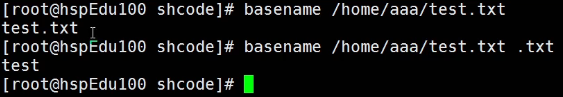

# 四、扩展篇-Shell编程

## Shell 是什么

Shell 是一个命令行解释器，它为用户提供了一个向Linux内核发送请求以便运行程序的界面系统级程序，用户可以用Shell来启动、挂起、停止甚至是编写一些程序。


## Shell 脚本的执行方式

脚本格式要求：

1. 脚本以<strong style="color:#DD5145">`#!/bin/bash`</strong>开头
2. 脚本需要有**可执行权限**

编写第一个Shell脚本：

```sh
# 需要说明：创建一个Shell脚本，输出 Hello World！
#!/bin/bash
echo "Hello World!"
```

> Shell 脚本多行注释：`:<<! 内容 !`

脚本的常用执行方式：

方式一：输入脚本的绝对路径或相对路径

- 说明：首先要赋予 hello.sh 脚本的 +x权限，再执行脚本

  

  或者绝对路径`/root/shcode/hello.sh`

方式二：sh + 脚本

- 说明：不用赋予脚本 +x权限，直接执行即可


## Shell 变量

Shell 中的变量分为大概 4 类：

- **自定义变量**：用户自己根据需求进行自定义。
- **环境（系统）变量**：主要保存的是与系统操作环境相关的数据。
- **位置参数变量**：变量名不能自定义，变量作用是固定的，主要用来向脚本中传递参数或数据的。
- **预定义变量**：`Bash`中已经定义好的变量，变量名不能自定义，变量作用也是固定的，只管调用。

1. 显示当前Shell中的所有变量：`set`


### 1.自定义变量

Shell 自定义变量的语法：

1. 定义变量：`变量名=值`（<strong style="color:#DD5145">注意：`=`号前后不能有空格</strong>）
2. 撤销变量：`unset 变量名`
3. 声明静态变量：`readonly`变量（注意：不能 `unset`）

Shell 自定义变量的规则：

1. 变量名称可以由字母、数字和下划线组成，但是不能以数字开头
2. 等号两侧不能有空格
3. 变量名称一般习惯为大写
4. 不能使用 Shell 中的关键字作为变量名（通过`help`命令可以查看Shell中的保留字）

```sh
#!/bin/bash
# 案例1：定义变量A
A=100
# 输出变量需要加上$
echo A=$A
echo "A=$A"
# 案例2：撤销变量A
unset A
# 案例3：声明静态的变量B=2，不能unset
readonly B=2
echo "B=$B"
# 无法删除
unset B
```

将命令的返回值赋给变量：

- A=\`date\`，反引号，运行里面的命令，并把结果返回给变量A
- A=$(date)，等价与反引号


### 2.环境变量

Shell 设计者事先定义好的变量，可以直接在 Shell 脚本中使用。

常用的系统变量：`$HOME`、`$PWD`、`$SHELL`、`$USER`等等，例如：`echo $HOME`。

前面那种自定义变量的方式默认只能在当前 Shell 中生效，子进程不会继承这些变量。我们可以通过`export`命令将这些变量放到环境中，这样新的进程也会从父进程那里继承环境。

设置环境变量：

1. `export 变量名=变量值`（将 Shell 变量输出为环境变量）
2. `source 配置文件`（让修改后的配置信息立即生效）
3. `echo $变量名`（查询环境变量的值）


### 3.位置参数变量

变量名不能自定义，变量作用是固定的，主要用来向脚本中传递参数或数据的。

当我们执行一个Shell脚本时，如果希望获取到命令行的参数信息，就可以使用到位置参数变量。

基本语法：

- `$n`（n为数字，\$0代表命令本身，\$1-\$9代表第一到第九个参数，十以上的参数需要用大括号包含，例如 \${10}，类似于传参）
- `$*`（代表命令行中所有参数，\$* 把所有的参数看**成一个整体**）
- `$@`（代表命令行中所有参数，\$@ 把每个参数**区分对待**）
- `$#`（代表命令行中所有参数的个数）

快速入门，编写myshell.sh脚本

```sh
#!/bin/bash
echo "0=$0 1=$1 2=$2"
echo "所有的参数=$*"
echo "$@"
echo "参数的个数=$#"
```


### 4.预定义变量

预定义变量是`Bash`已经定义好的变量，变量名不能自定义，变量作用也是固定的，如下所示：

- `$$`（当前进程的进程号，PID）
- `$!`（后台运行的最后一个进程的进程号，PID）
- `$?`（最后一次执行的命令的返回状态。如果这个变量的值为0，证明上一个命令正确执行；如果值为非0，则证明上一个命令执行不正确）

参考：

https://juejin.cn/post/7217994625343438906?searchId=2024101816174966B9C548929B7F17051E#heading-3

https://juejin.cn/post/7155138025691807752?searchId=2024101816174966B9C548929B7F17051E#heading-9

https://blog.csdn.net/qq_44421043/article/details/141613673

## 运算符

基本语法：

- `$((运算式))` 
- <strong style="color:#DD5145">`$[运算式] `</strong>，推荐使用
- `expr m + n`（expression 表达式）

注意 expr 运算符之间要有空格，如果希望将 expr 的结果赋给某个变量，需要使用 **反引号\``**

1. `expr m -n `的
2. `expr \*、/、%`（乘、除、取余）

```sh
#!/bin/bash
# 案例1：计算（2+3）*4 的值
# 方式一
RES1=$(((2+3)*4))
echo "RES1=$RES1"

# 方式二，推荐使用
RES2=$[(2+3)*4]
echo "res2=RES2"

# 方式三
TEMP=`expr 2 + 3`
RES4=`expr $TEMP \* 4`
echo "temp=$TEMP"
echo "res4=$RES4"

# 案例2：请求命令行的输入两个参数的和，20 50
SUM=$[$1+$2]
echo "sum=$SUM"
```

## 条件判断

基本语法：

- `[ condition ]`，<strong style="color:#DD5145">注意 condition 前后要有空格</strong>
- 非空返回 true，可以用 \$? 验证（0为true，>1为false）

> 应用案例：
>
> - `[ ABCD ]`，返回 true
> - `[]`，返回 false
> - `[ condition ]` && echo OK || echo NotOK，条件满足，执行后续语句
>

常用判断条件：

1. **字符串比较**，`=`

2. **两个整数的比较**
   - `-lt`，小于
   - `-le`，小于等于 less than
   - `-eq`，大于
   - `-gt`，大于
   - `-ge`，大于等于
   - `-ne`，不等于
3. **按照文件权限进行判断**
   - `-r`，有读的权限
   - `-w`，有写的权限
   - `-x`，有执行的权限
4. **按照文件类型进行判断**
   - `-f`，文件存在并且是一个常规的文件
   - `-e`，文件存在
   - `-d`，文件存在并是一个目录

应用案例：

```sh
#!/bin/bash
# 案例1："ok"是否等于"OK"
if [ "ok" = "ok" ]
then
		echo "equal"
fi
# 案例2:23是否大于等于22
if [23 -ge 22 ]
then
		echo "大于"
fi
# 案例3：/root/shcode/aaa.txt
if [ -f /root/shcode/aaa.txt ]
then
		echo "存在"
fi
```

## 流程控制

### `if`判断

```sh
if [ 条件判断式 ]
then
	代码
fi
```

或者多分支判断

```sh
if [ 条件判断式 ]
then
	# 代码
elif [ 条件判断式 ]
then
	# 代码
.....
fi
```

<strong style="color:#DD5145">注意：`[条件判断式]`，中括号和条件判断式之间必须有空格</strong>

### `case`语句

```sh
case $变量名 in
"值1")
	# 如果变量的值等于值1，则执行程序1
;;
"值2")
	# 如果变量的值等于值2，则执行程序2
;;
	......
*)
	# 如果变量的值不是以上的值，则执行此程序
;;
esac
```

### `for`循环

基本语法一：

```sh
for 变量 in 值1 值2 值3 ...
do
	# 程序/代码
done
```

基本语法二：

```sh
for ((初始值; 循环控制条件; 变量变化))
do
	# 程序/代码
done
```

案例：

```sh
#!/bin/bash
# 案例：从1加到100的值输出显示
SUM=0
for(( i=1; i<=100; i++ ))
# for(( i=1; i<=$1; i++ ))
do
        SUM=$[$SUM+$i]
done
echo "总和SUM=$SUM"
```

### `while`循环

```sh
while [ 条件判断式 ]
do
	# 程序/代码
done
```

<strong style="color:#DD5145">注意：`[条件判断式]`，中括号和条件判断式之间必须有空格</strong>

案例：

```sh
#!/bin/bash
# 案例：从命令行输入一个数n，统计1+...+n 的值
SUM=0
i=0
while [ $i -le $1 ]
do
        SUM=$[$SUM+$i]
        # i自增
        i=$[$i+1]
done
echo "总和SUM=$SUM"
```

## read 读取控制台输入

`read`命令的功能是用于读取单行数据内容，一般是从标准输入中读取数值，用于给变量赋值。

基本语法：`read (选项) (参数)`

常用选项：

| 选项 | 含义                                                         |
| ---- | ------------------------------------------------------------ |
| `-p` | 提示信息，在等待read输入时，输出提示信息                     |
| `-t` | 指定读取值时等待的时间（秒），如果没有在指定的时间内输入，就不再等待了 |
| `-n` | 字符数，read命令只接受指定的字符数，就会执行                 |
| `-s` | 隐藏输入的数据，适用于机密信息的输入                         |
| `-e` | 在输入的时候可以使用命令补全功能                             |
| `-r` | 禁用转义符（\）                                              |

参数：

- 变量：指定读取值的变量名

## 函数

### 系统函数

#### `basename`

功能：返回完整路径最后 / 的部分，常用于获取文件名。

基本语法：`basname [pathname] [suffix]`

`basename [string] [suffix]`，会删除所有的前缀包含最后一个`/`字符，然后将字符串显示出来

 suffix 为后缀，如果 suffix 被指定了，basename 会将pathname 或 string 中的 suffix去掉



#### `dirname`

功能：返回完整路径最后 / 的前面的部分，常用于返回路径部分。

基本语法：`dirname 文件绝对路径`

从给定的包含绝对路径的文件名中去除文件名（非目录的部分），然后返回剩下的路径（目录的部分）


### 自定义函数

基本语法：

```sh
[function] funName[()]
{
	Action;
	[return int;]
}
# 调用直接写函数名
funName [值]
```

案例：

```sh
#!/bin/bash
function getSum() {
        SUM=$[$n1+$n2]
        echo "和是=$SUM"
}

read -p "请输入 n1=" n1
read -p "请输入 n2=" n2

getSum $n1 $n2
```


## 文本处理工具

### `cut`

`cut`的功能就是 "剪"，具体来说就是在文件中负责剪切数据用的。`cut`命令从文件的每一行剪切字节、字符和字段并将这些字节、字符和字段输出。

基本语法：`cut [选项] [filename]`

说明：默认分隔符是制表符

常用选项：

| 选项 | 功能                                                  |
| ---- | ----------------------------------------------------- |
| `-f` | 列号，提取第几列，例如提取二三列`-f 2,3`              |
| `-d` | 分隔符，按照指定分隔符进行分隔列，默认是制表符 "`\t`" |
| `-c` | 按字符进行切割，后加加 n，表示取第几列，例如`-c 1`    |

> 或者配合管道符 `|` 一起使用

### `awk`

一个强大的文本分析工具，把文件逐行的读入，以空格为默认分隔符将每行切片，切开的部分再进行分析处理。

基本语法：`awk [选项] '/pattern1/{action} /pattern2/{action2} ...' [filename]`

- `pattern`：表示 awk 在数据中查找的内容，即匹配模式
- `action`：在找到匹配内容时所执行的一系列命令

常用选项：

| 选项 | 功能                 |
| ---- | -------------------- |
| `-F` | 指定输入文件分隔符   |
| `-v` | 赋值一个用户定义变量 |


### `sed`

`sed` 是 Linux 系统中的文本处理工具，sed是流编辑器，是 stream editor 的简写，将一系列编辑命令作用于一批文件的理想工具。

https://www.cnblogs.com/RunningSnails/p/17760411.html

## 数据库备份