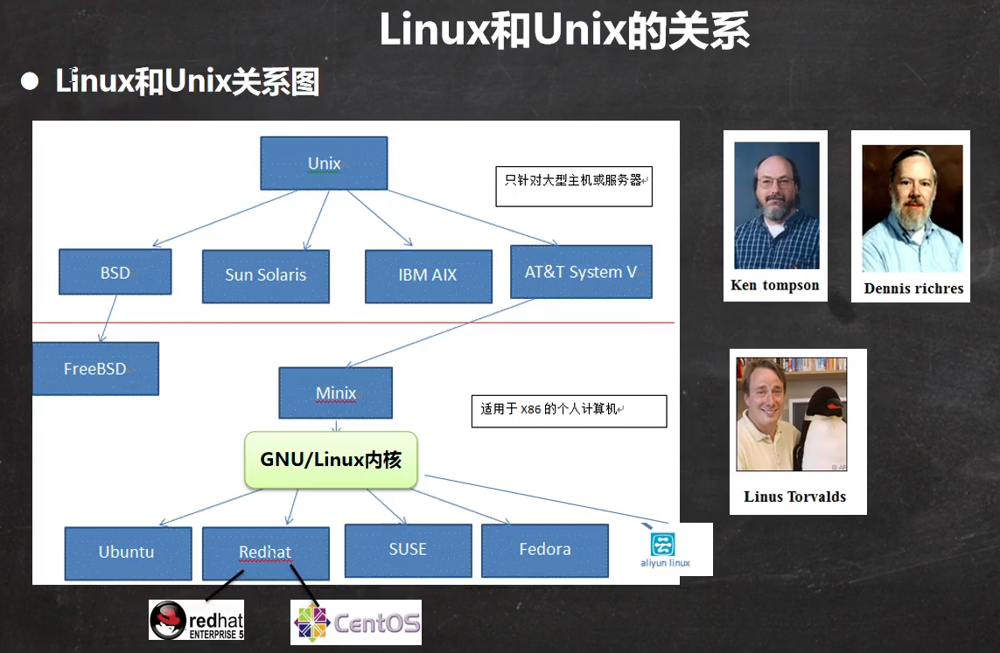
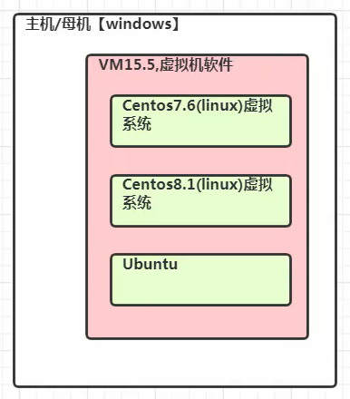
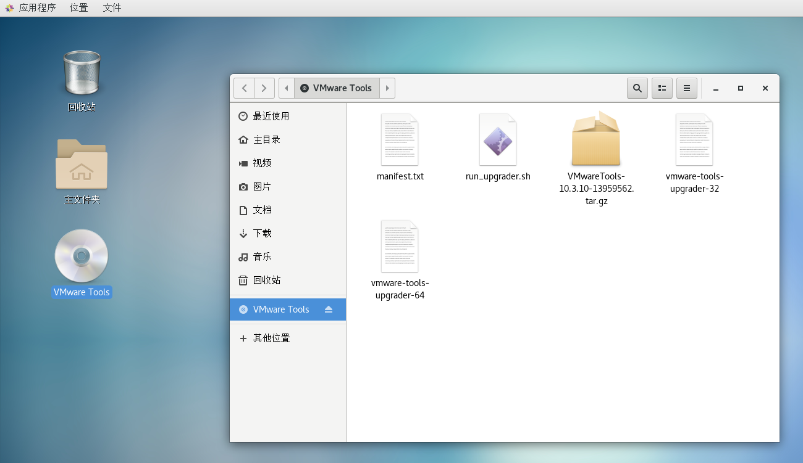

# 一、入门篇



## VM和Linux的安装

1. 先安装 VMware 15.5
2. 再安装 Linux（CentOS 7.6 / CentOS 8.1）
3. 原理示意图（下图）



账号密码

> 管理员
>
> - 账号：root
> - 密码：root
>
> 普通用户
>
> - 账号：hulujing
> - 密码：123

## 安装VMTools

- VMTools 安装后，可以让我们在 Windows 下更好的管理VM虚拟机
- 可以设置 Windows 和 CentOS 的共享文件夹

### 安装VMTools的步骤

1. 进入CentOS

2. 点击VM菜单的 -> install vmware tools

3. CentOS会出现一个vm的安装包，xx.tar.gz

4. 拷贝到 /opt

5. 使用解压命令`tar`得到一个安装文件

   ```sh
   cd /opt/ # 进入到opt目录
   tar -zxvf xx.tar.gz
   ```

6. 进入该vm解压的目录，/opt 目录下

7. 安装`./vmware-install.pl`

8. 全部使用默认设置即可，就可以安装成功

9. 注意：安装`vmtools`<strong style="color:#DD5145">需要有gcc</strong>



### 设置共享文件夹

为了方便，可以设置一个共享文件夹，比如`D:\VM\myShare`

设置步骤：

1. 菜单 -> vm -> setting，如图设置即可，注意：设置选项为 always enable（可读写）
2. Windows 和 CentOS 可共享 `D:\VM\myShare` 目录并可以读写文件
3. 共享文件夹在 CentOS 的`/mnt/hgfs`下

> 实际开发中，文件的上传下载是需要通过<strong style="color:#DD5145">远程登录方式</strong>完成的。

## 参考

:book: [韩顺平B站教学视频](https://www.bilibili.com/video/BV1Sv411r7vd/?spm_id_from=333.1007.top_right_bar_window_custom_collection.content.click&vd_source=78b42a044f07447d2049c465a76bae26)、[尚硅谷B站教学视频](https://www.bilibili.com/video/BV1WY4y1H7d3?spm_id_from=333.788.videopod.episodes&vd_source=78b42a044f07447d2049c465a76bae26)、[参考文章](https://www.cnblogs.com/oaoa/p/17400515.html)