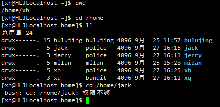
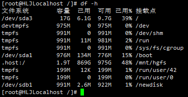

# 三、实操篇

## :star:文件目录类

### `pwd`指令

显示当前工作目录的<strong style="color:#DD5145">绝对路径</strong>。

基本语法：`pwd`

### `ls`指令

列出当面目录的文件。

基本语法：`ls [选项] [目录或文件]`

- `-a`，显示当前目录所有的文件和目录，包括隐藏的
- `-l`，以列表的形式显示信息
- `-lh`，以人更适合看的方式显示文件信息

> 在 Linux 下，隐藏文件是以`.`开头的
>
> 选项可以以组合使用，例如`ls -al`、`ls -al /root`

### `cd`指令

切换到指定目录。

基本语法：`cd [参数]`

- `cd ~`或`cd`，回到自己的家目录
- `cd ..`，回到当前目录的上一级目录

应用案例：

> 案例1：使用绝对路径切换到 root 目录，`cd/root`
>
> 案例2：使用相对路径到 /root 目录，比如在 /home/tom，`cd ../../root`
>
> 案例3：回到当前目录的上一级目录，`cd ..`
>
> 案例4：回到家目录，`cd ~`


### `mkdir`指令

创建目录，默认只创建一级目录。

基本语法：`mkdir [选项] 要创建的目录`

- `-p`：创建多级目录

### `rmdir`指令

删除空目录。

基本语法：`rmdir [选项] 要删除的空目录`

> 如果目录下有内容时，则无法进行删除
>
> 如果要删除非空目录，使用<strong style="color:#DD5145">`rm -rf 要删除的目录`</strong>进行删除，<strong style="color:#DD5145">谨慎操作</strong>

### `touch`指令

创建一个空文件。

基本语法：`touch 文件名称`

### `cp`指令

拷贝文件到指定目录。

基本语法：`cp [选项] 需拷贝的文件 指定目录`

- `-r`：递归复制整个文件夹

> 强制覆盖不提示的方法：`\cp`
>
> 例如`\cp -r /home/bbb /opt`（将 /home/bbb 整个目录，拷贝到 /opt）

### `rm`指令

移除文件或目录。

基本语法：`rm [选项] 要删除的文件或目录`

- `-r`：递归删除整个文件夹
- `-f`：强制删除时不提示

### `mv`指令

移动文件、目录或重命名。

基本语法：

- `mv oldFileName newFileName`，重命名（同目录下）
- `mv /temp/moveFile /targetFoler`，移动文件（不同目录下）
- `mv /temp/moveFile /targetFoler/newName`，移动文件，并重命名文件名（不同目录下）

> 如果需要移动整个目录，例如将 /opt./bbb 移动到 /home 下，`mv /opt/bbb /home`
>
> 指令为`mv /opt/bbb /home/newName`（移动目录，并重命名目录名）

### `cat`指令

查看文件内容（<strong style="color:#DD5145">只读</strong>），`vim`也可以查看但不安全。

基本语法：`cat [选项] 要查看的文件`

- `-n`：显示行号

> `cat`只能浏览文件，不能修改文件，为了浏览方便，一般会带上<strong style="color:#DD5145">管道命令`| more [进行交互]`</strong>
>
> 管道命令： 前面的结果交给下一个指令处理

### `more`指令

more指令是一个基于VI编辑器的文本过滤器，它以全屏幕的方式按页显示文本文件的内容。

基本语法：`more 要查看的文件`

more指令中内置了若干快捷键（交互的指令），详见下表：

| 操作              | 功能说明                          |
| ----------------- | --------------------------------- |
| 空格键（`Space`） | 向下翻一页                        |
| `Enter`           | 向下翻 [一行]                     |
| `q`               | 立刻离开 more，不再显示该文件内容 |
| `                 | 向下滚动一屏                      |
| `Ctrl+B`          | 返回上一屏                        |
| `=`               | 输出当前行的行号                  |
| `:f`              | 输出文件名和当前行的行号          |

### `less`指令

基本语法：`less 要查看的文件`

less指令用来分屏查看文件内容，它的功能与more指令类似，但比more指令更加强大，支持各种显示终端。less指令在显示文件内容时，并<strong style="color:#DD5145">不是一次将整个文件加载之后才显示，而是根据显示需要加载内容（动态加载）</strong>，对于显示大型文件具有较高的效率。

| 操作              | 功能说明                                           |
| ----------------- | -------------------------------------------------- |
| 空格键（`Space`） | 向下翻一页                                         |
| `[pagedown]`      | 向下翻一页                                         |
| `[pageup]`        | 向上翻一页                                         |
| `/字串`           | 向下搜索[字串]的功能；`n`：向下查找；`N`：向上查找 |
| `?字串`           | 向上搜索[字串]的功能；`n`：向下查找；`N`：向上查找 |
| `q`               | 离开less这个程序                                   |

### `echo`指令

输出内容到控制台。

基本语法：`echo [选项] [输出内容]`

> 案例：使用 echo指令输出环境变量，例如输出 `$PATH`、`$HOSTNAME`
>
> 指令为`echo $HOSTNAME`

### `haed`指令

用于显示文件的开头部分内容，默认情况下 head指令显示文件的前10行内容。

基本语法：

- `head 文件`，查看文件头10行内容
- `head -n 5 文件`，查看文件头5行内容，5可以是任意行数

### `tail`指令

用于输出文件的尾部内容，默认情况下 tail指令显示文件的前十10行内容。

基本语法：

- `tail 文件`，查看文件尾部10行内容
- `tail -n 5 文件`，查看文件尾部5行内容，5可以是任意行数
- `tail -f 文件`，实时追踪该文档的所有更新（输入 Ctrl+C 推出）

### `>`,`>>`指令

`>`，<strong style="color:#DD5145">输出重定向（覆盖）</strong>；`>>`，<strong style="color:#DD5145">追加</strong>

基本语法：

- `ls -l > 文件`，列表的内容写入文件 a.txt 中（覆盖写，如果没有文件a则创建）
- `ls -al >> 文件`，列表的内容追加到文件 aa.txt 的末尾
- `cat 文件1 > 文件2`，将文件1的内容覆盖到文件2中
- `echo "内容" > 文件`，将本应该在终端显示的内容写入到文件中（覆盖写）

### `ln`指令

软链接（符合链接），类似于Windows里的快捷方式，主要存放了链接其他文件的路径。

基本语法：`ln -s [原文件或目录] [软链接]`，说明：给源文件创建一个软链接

> - 案例1：在 /home目录下创建一个软链接 myroot，链接到 /root目录
>
>   指令为`ln -s /root /home/myroot`
>
> - 案例2：删除软链接 myroot（类似于删除文件）
>
>   指令为`rm /home/myroot`
>
>   不用使用`rm /home/myroot/`，<strong style="color:#DD5145">系统会认为删除的是一个目录</strong>

当我们使用`pwd`指令查看目录时，仍然看到的是软链接所在目录。

###  `history`指令

查看已经执行过的历史指令，也可以执行历史指令。

基本语法：`history`

> - 案例1：显示所有的历史命令
>
>   指令为`history`
>
> - 案例2：显示最近使用过的10个指令
>
>   指令为`history 10`
>
> - 案例3：执行历史编号为5的指令
>
>   指令为`!5`

## :star:搜索查找类

### `find`指令

find指令将从指令目录向下递归地遍历其各个子目录，将满足条件的文件或目录显示在终端。

基本语法：`find [搜索范围] [选项]`，选项说明如下表：

| 选项               | 功能说明                         |
| ------------------ | -------------------------------- |
| `-name <查询方式>` | 按照指定的文件名查找模式查找文件 |
| `-user <用户名>`   | 查找属于指定用户名的所有文件     |
| `-size <文件大小>` | 按照指定的文件大小查找文件       |

> - 案例1：按文件名，根据名称查找 /home目录下的 hello.txt文件
>
>   指令为`find /home -name hello.txt`
>
> - 案例2：按拥有者，查找 /opt目录下，用户名为 nobody的文件
>
>   指令为`find /opt -user nobody`
>
> - 案例3：查找整个Linux系统下大于200M的文件（**+n大于、-n小于、n等于，单位有k、M、G**）
>
>   指令为`find / -size +200M`

### `locate`指令

locate指令可以快速定位文件路径。

基本语法：`locate 搜索文件`

locate指令利用**事先建立的系统中所有文件名称及路径的locate数据库**实现快速定位给定的文件。locate指令<strong style="color:#DD5145">无需遍历整个文件系统，查询速度较快</strong>。为了保证查询结果的准确度，管理员必须定期更新locate时刻。

注意：由于`locate`指令基于数据库进行查询，<strong style="color:#DD5145">所以第一次运行前，必须使用`updatedb`指令创建locate数据库</strong>。

### `which`指令

可以查看某个指令在哪个目录下。

> 案例：查看 ls指令在哪个目录下
>
> 指令为`which ls`

### `grep`指令和管道符`|`

`grep`过滤查找，管道符`|`表示将前一个命令的处理结果输出传递给后面的命令处理。

基本语法：`grep [选项] 查找内容 源文件`，选项说明如下表：

| 选项 | 功能说明         |
| ---- | ---------------- |
| `-n` | 显示匹配行及行号 |
| `-i` | 忽略字母大小写   |

> 案例：请在 /home下的 hello.txt文件中，查询 "yes" 所在行，并显示行号
>
> 指令为`cat /home/hello.txt | grep -n "yes"`
>
> 或`grep -n "yes" /home/hello.txt`

## :star:压缩和解压

###  `gzip`/`gunzip`指令

`gzip`用于压缩文件，`gunzip`用于解压文件。

基本语法：

- `gzip 文件`（只能将文件压缩为`*.gz`文件）
- `gunzip 文件.gz`

### `zip`/`unzip`指令

`zip`用于压缩文件或目录，`unzip`用于解压，通常在项目中打包发布用。

基本语法：

- `zip [选项] XXX.zip 需压缩的文件`

  常用选项：`-r`，递归压缩，即压缩目录

- `unzip [选项] XXX.zip`

- 常用选项：`-d <指定目录>`，指定解压后文件的存放目录

> - 案例1：将 /home下的所有文件进行压缩成 myhome.zip
>
>   指令为`zip -r myhome/zip /home/`（不仅把home文件下子文件夹压缩，也把home文件夹本身进行压缩）
>
> - 案例2：将myhome.zip，解压到 /opt/tmp目录下
>
>   指令为`unzip -d /opt/tmp /home/myhome.zip`

### `tar`指令

tar指令常用于打包、压缩和解压文件和目录，最后打包后的文件或目录是`.tar.gz`的文件。

基本语法：`tar [选项] XXX.tar.gz 文件名`（可打包多个文件）

选项说明：

| 选项         | 功能说明                 |
| ------------ | ------------------------ |
| `-z`         | 通过gzip进行压缩或解压缩 |
| **`-c`**     | **产生`.tar`打包文件**   |
| **`-x`**     | **解包`.tar`打包文件**   |
| `-v`         | 显示详细的操作信息       |
| `-f`         | 指定压缩后的文件名       |
| `-C`（大写） | 指定解压目录             |

> - 案例1：压缩多个文件，将 /home/pig.txt 和 /home/cat.txt 压缩成pc.tar.gz
>
>   指令为`tar -zcvf pc.tar.gz /home/pig.txt /home/cat.txt`
>
> - 案例2：将 /home 的文件夹压缩成 myhome.tar.gz
>
>   指令为`tar -zcvf myhome.tar.gz /home/`
>
> - 案例3：将 pc.tar.gz 解压到当前目录
>
>   指令为`tar -zxvf pc.tar.gz`
>
> - 案例4：将 myhome.tar.gz 解压到 /opt/tmp2 目录下
>
> - 指令为`tar -zxvf /home/myhome.tar.gz -C /opt/tmp2`

## :star:时间日期类

### `date`指令

显示当前日期。

基本语法：

- `date`，显示当前时间
- `date +%Y`，显示当前年份
- `date +%m`，显示当前月份
- `date +%d`，显示当前是哪一天
- `date "+%Y-%m-%d %H:%M:%S"`，显示年月日时分秒

`date`指令，设置系统时间

基本语法：`date -s 字符串时间`

> 案例：设置系统当期时间为，2020-11-03 20:02:10
>
> 指令为`date -s "2020-11-03 20:02:10"`

### `cal`指令

查看日历指令。

基本语法：`cal [选项]`，不加选项，默认显示本月日历

> 案例：显示2020年日历
>
> 指令为`cal 2020`

## :star:用户管理

Linux系统是一个多用户多任务的操作系统，任何一个要使用系统资源的用户，都必须首先向系统管理员申请一个账号，然后以这个账号的身份进行系统。

### 添加用户`useradd`

基本语法：`useradd 用户名`

1. 当创建用户成功之后，会自动创建和用户同名的家目录，默认该用户的家目录在`/home/用户名`
2. 也可以通过`useradd -d /home/指定家目录 新的用户名`，给新创建的用户指定家目录（可以用于新用户继承旧目录）

###  指定/修改密码`passwd`

基本语法：`passwd 用户名`，如果未指定用户名，<strong style="color:#DD5145">则默认修改的是当前用户的密码，谨慎操作</strong>

> 显示当前用户所在目录的指令`pwd` 

### 删除用户`userdel`

基本语法：`userdel 用户名`

1. 删除用户，但是要保留家目录 ，`userdel 用户名`
2. 删除用户以及用户家目录，`userdel -r 用户名`，<strong style="color:#DD5145">谨慎操作</strong>

### 查询用户信息`id`

基本语法：`id 用户名`

当用户不存在时，返回无此用户

### 切换用户`su`

在操作 Linux 中，如果当前用户的权限不够，可以通过`su -`，切换到高权限用户，比如 root。

基本语法：`su - 用户名`

1. 从权限高的用户切换到权限低的用户，不需要输入密码，反之需要
2. 当需要返回到原来用户时，使用`logout/exit`指令

> `su -username`和`su username` 最大的区别的就是是否切换环境，带`-`是同时切换环境，某些命令才可以执行

`sudo`设置普通用户具有 root 权限


### 查看登录用户`who`

基本语法：`whoami/who am i`

- `whoami`显示的是当前使用的用户
- `who am i`显示的是第一次登录的用户

> `who am i`如果没有输出，是什么原因？
>
> 可能是当前用户没有登录或者登录信息已经过期了

### 修改用户所在组`usermod`

在添加用户时，可以指定将该用户添加到哪一个组，同样的用root的管理权限可以改变某个用户所在的组。

修改用户所在组，基本语法：

- `usermod -g 新组名 用户名`（默认组的 id 为1）
- `usermod -d 新目录名 用户名 `（改变该用户登录的初始目录，<strong style="color:#DD5145">注意：用户需要有进入到新目录的权限</strong>）


## :star:用户组管理

### 组的概念

在Linux中的每个用户必须属于一个组，不能独立于组外。在Linux中每个文件有<strong style="color:#DD5145">所有者</strong>、<strong style="color:#5090FF">所在组</strong>、<strong style="color:#FFFF88">其他组</strong>的概念。

用户组的管理涉及用户组的添加、删除、修改。组的增加、删除、修改其本质就是对`/etc/group`文件的更新。

#### 所有者

一般为文件/目录的创建者，谁创建了该文件，就成为该文件/目录的<strong style="color:#DD5145">所有者</strong>。

查看文件/目录的所有者命令：`ls -ahl`

#### 所在组

当某个用户创建了一个文件/目录后，该用户所在的组就是这个文件/目录的<strong style="color:#DD5145">所在组</strong>。

查看文件/目录所在组命令：`ls -ahl`或`ll`

#### 其他组

除文件所有者和所在组的用户外，系统的其他用户都是文件的<strong style="color:#DD5145">其他组</strong>。


### 用户和组的相关文件

- `/etc/passwd 文件`

  用户（user）的配置文件，记录用户的各种信息

  每行含义：<strong style="color:#5090FF">用户名:口令:用户标识号:组标识号:注释性描述:主目录:登录Shell</strong>

- `/etc/shadow 文件`、

  口令的配置文件

  每行含义：<strong style="color:#5090FF">登录名:加密口令:最后一次修改时间:最小时间间隔:最大时间间隔:警告时间:不活动时间:失效时间:标识</strong>

- `/etc/group 文件`

  组（group）的配置文件，记录 Linux 包含的组的信息

  每行含义：<strong style="color:#5090FF">组名:口令:组标识号:组内用户列表</strong>


### 新增组`groupadd`

创建一个组，基本语法：`groupadd 组名`

增加用户的同时直接加上组：<strong style="color:#DD5145">`useradd -g 用户组 用户名`</strong>

> 如果创建用户时，没有指定组，系统会默认会创建一个与用户**同名的组**，同时把用户放入该组里面

### 删除组`groupdel`

删除一个组，基本语法：`groupdel 组名`

### 修改组`groupmod`

修改用户组信息，基本语法：`groupmod [选项] 组名`

- `-g`或`--gid GID`：修改用户组的GID
- `-n`或`--new-name 新组名`：修改用户组的名称
- `-h`或`--help`：显示帮助信息

### 修改文件所在组`chgrp`

基本语法：`chgrp 组名 文件名`

> 案例：使用root用户创建文件 orange.txt，查看该文件属于哪个组，然后将这个文件所在组，修改到 fruit组
>
> 1. `groupadd fruit`
> 2. `touch orange.txt`
> 3. 查看该文件所属组，`ll`，所属root组
> 4. `chgrp fruit orange.txt`

### 查看组`cat /etc/group`

基本语法：`cat /etc/group`或`cat /etc/group | grep 组名`


## :star:权限管理类

### 文件/目录属性

使用`ls -l`指令显示的内容：`-rw-r--r--. 1 root root  106 3月 12 2024 Hello.java`

**-**<strong style="color:#DD5145">rw-</strong><strong style="color:#5090FF">r--</strong><strong style="color:#FFFF88">r--</strong> 部分的0-9位说明：

第0位，确定文件类型（d、-、l、c、b）

- `-`：代表是一个普通文件
- `l`：链接，类似 Windows 的快捷方式
- `d`：目录，类似 Windows 的文件夹
- `c`：字符设备文件，例如鼠标、键盘
- `b`：块设备，例如硬盘

第1-3位，确定**所有者**拥有该文件的权限，`---User`

第4-6位，确定**所在组**拥有该文件的权限，`---Group`

第7-9位，确定**其他组**拥有该文件的权限，`---Other`

其他说明：

- `1`：表示文件硬链接数，或子目录数（包含隐藏目录，不）
- `root`：表示文件所有者（第一个root）
- `root`：表示文件所在组（第二个root）
- `106`：文件大小（字节），如果是文件夹，则显示4096字节
- `3月 12 2024`：最后修改日期
- `Hello.java`：文件名


### rwx 权限详解

- `rwx`作用到文件

  [`r`]代表可读（read）：可以读取、查看文件

  [`w`]代表可写（write）：可以修改，但不代表可以删除该文件，删除一个文件的前提条件是<strong style="color:#DD5145">对该文件所在目录有写权限</strong>，才能删除该文件

  [`x`]代表可执行（execute）：可以被执行


注意：也可以用数字来表示为`r=4，w=2，x=1`

- `rwx`作用到目录

  [`r`]代表可读（read）：可以读取、`ls`指令查看目录内容

  [`w`]代表可写（write）：可以修改，对目录内文件的创建、删除，重命名目录

  [`x`]代表可执行（execute）：可以进入该目录，例如执行`cd`指令

### 修改权限`chmod`

通过`chmod`指令，可以修改文件或目录的权限。

- 第一种方式：`=、+、- `来变更权限（`u：所有者，g：所在组，o：其他人，a：所有人`）
  - `chmod u=rwx,g=rx,o=x 文件/目录名`
  - `chmod o+w 文件/目录名`（赋予其他组写的权限）
  - `chmod a-x 文件/目录名`（撤销所有人执行权限）

- 第二种方式：通过数字变更权限（`r=4，w=2，x=1`，`rwx=4+2+1=7`）
  - `chmod u=rwx,g=rx,o=x 文件/目录名 `等价于`chmod 751 文件/目录名`

### 修改所有者`chown`

通过`chown`指令，可以修改文件/目录的所有者。

基本语法：

- `chown newOwner 文件/目录名`（修改文件所有者）
- `chown newOwner:newGroup 文件/目录名`（同时修改文件所有者和所在组）
- `-R`：如果是目录，则使其下所有子文件或目录递归生效

> 案例：将 /home/test目录下所有文件和目录的所有者都修改为 tom
>
> 指令为`chown -R tom /home/test`

### 修改所在组`chgrp`

通过`chgrp`指令，可以修改文件/目录的所在组。

基本语法：

- `chgrp newGroup 文件/目录`（修改文件所在组）
- `-R`：如果是目录，则使其下所有子文件或目录递归生效

### 实例分析-警察和土匪

```bash
# 1.创建组
groupadd police # 警察
groupadd bandit # 土匪
# 2.创建用户
useradd -g police jack; passwd jack(密码：123)
useradd -g police jerry passwd jerry(密码：123)
useradd -g bandit xh passwd xh(密码：123)
useradd -g bandit xq passwd xq(密码：123)
# 3.jack 创建一个文件，自己可以读写，本组可以读，其他组没有任何权限
vim jack.txt # jack先登录
chmod u=rw,g=r jack.txt; chmod 640 jack.txt
# 4.jack 修改该文件，让本组可以读写，其他组可以读
chmod 664 jack.txt
# 5.xh 投靠警察，看看是否可以读写？
usermod -g police xh # root用户执行
cd /home/jack # xh用户下执行，结果为“权限不够”
```



出现原因：所在组和其他组**没有权限访问 jack用户的家目录**，`drwx------`


解决方法：root用户下执行`chmod 750 jack`，赋予所在组对 jack用户的家目录的访问权限


现在即可访问


## :star:磁盘分区类

### 磁盘情况查询`df/du`

> df = disk free 查看磁盘使用情况，du = disk usage 查看磁盘占用情况

**`df` 查询磁盘空间的使用情况**

基本语法：`df -h`



**`du` 查询文件/目录占用磁盘空间情况**

基本语法：`du [选项] 文件/目录`，默认为当前目录

| 选项            | 功能                                        |
| --------------- | ------------------------------------------- |
| `-h`            | 带计量单位，以人们易阅读的格式显示          |
| `-a`            | 不仅查看子目录大小，还包括文件              |
| `-c`            | 列出所有文件和子目录大小明细，同时显示总和  |
| `-s`            | 只显示占用大小汇总                          |
| `--max-depth=n` | 指定统计子目录的深度为第n层，可以简写为`dn` |

案例：


### 查看设备挂载`lsblk`

基本语法：`lsblk`，查看设备挂载情况

或`lsblk -f`，查看详细的设备挂载情况，显示文件系统信息


### 挂载/卸载`mount/umount`

分区挂载命令：`mount [设备名称] [挂载目录]`

分区卸载命令：`umount [设备名称 或 挂载目录]`

```sh
mkdir newdisk
mount /dev/sdb1 /newdisk/
```

挂载命令执行后，会新增挂载点。


### 分区`fdisk`

基本语法：

- `fdisk -l`：查看磁盘分区情况
- `fdisk 硬盘设备名`：对新硬盘进行分区操作

> 该命令必须在 root 用户下才能使用


### 挂载的经典案例

如何增加一块硬盘：

1. 虚拟机添加硬盘
2. 分区
3. 格式化
4. 挂载
5. 设置可以自动挂载


## :star:进程管理

在Linux中，每个**执行的程序**都称为一个进程。每一个进程都分配一个ID号（PID，进程号）。

每个进程都可能以两种方式存在，前台与后台。一般系统的服务都是以后台进程的方式存在，而且都会常驻在系统中，直到关机才结束。

### 进程有5种状态

1. 运行(正在运行或在运行队列中等待) 
2. 中断(休眠中, 受阻, 在等待某个条件的形成或接受到信号) 
3. 不可中断(收到信号不唤醒和不可运行, 进程必须等待直到有中断发生) 
4. 僵死(进程已终止, 但进程描述符存在, 直到父进程调用wait4()系统调用后释放) 
5. 停止(进程收到SIGSTOP, SIGSTP, SIGTIN, SIGTOU信号后停止运行运行)

### 查看系统进程`ps`

基本语法：`ps`（process status，进程状态）

- `ps aux | grep xxx`（查看系统中所有进程）
- `ps -ef | grep xxx`（查看子父进程之间的关系，可以<strong style="color:#DD5145">查看进程的父进程</strong>）

> `ps -aux` 的写法在一些操作系统中可能已经过时，更推荐使用 `ps aux`（无需加横杠）

| 选项 | 功能                                               |
| ---- | -------------------------------------------------- |
| `a`  | 显示当前终端的所有的进程信息，而不仅仅是当前用户的 |
| `u`  | 以用户的格式显示进程信息                           |
| `x`  | 显示后台进程运行的参数                             |
| `-e` | 显示所有的进程信息                                 |
| `-f` | 显示完整全格式的进程信息                           |
| `-u` | 显示某个用户关联的所有进程                         |

#### `ps aux`与`ps -ef`的区别

`ps`命令详解：<strong style="color:#DD5145">`ps aux | grep sshd`，查看是否有sshd进程</strong>

注：sshd是ssh远程连接用到的守护进程。

> 指令说明：**System V 展示风格**
>
> - `USER`：用户名
> - `PID`：进程号
> - `%CPU`：进程CPU占用率
> - `%MEM`：进程物理内存占用率
> - `VSZ`：进程占用的虚拟内存大小（单位：KB）
> - `RSS`：进程占用的物理内存大小（单位：KB）
> - `TT`：终端名称，缩写
> - `STAT`：进程状态，其中 S-表示睡眠，s-表示该进程是会话的先导进程，N-表示进程拥有比普通优先级更低的优先级，R-正在运行，D-短期等待，Z-僵死进程，T-被跟踪或被停止等等
> - `STARTED`：进程的启动时间
> - `TIME`：CPU时间，即进程使用CPU的总时间
> - `COMMAND`：启动进程所用的命令和参数，如果过长会被截断显示
>
> 

查看 sshd 的父进程信息：<strong style="color:#DD5145">`ps -ef | grep sshd`，查看进程的父进程</strong>。

> 指令说明：**BSD 展示风格**
>
> - `UID`：用户ID
> - `PID`：进程号
> - `PPID`：父进程ID
> - `C`：CPU用于计算执行优先级的因子。数值越大，表明进程是CPU密集型运算，执行优先级会降低；数值越小，表明进程是I/O密集型运算，执行优先级会提高
> - `STIME`：进程启动的时间
> - `TTY`：完整的终端名称
> - `TIME`：CPU时间
> - `CMD`：启动进程所用的命令和参数
>
> 


### 终止进程`kill`

如果是某个进程执行一半需要停止时，或是已经消耗了很大的系统资源时，可以考虑停止该进程。使用`kill`命令来完成此任务。

基本语法：

- `kill [选项] 进程号`（通过进程号杀死进程）

  常用选项：`-9`，表示<strong style="color:#DD5145">强制终止进程</strong>

- `killall 进程名称`（通过进程名称杀死进程，也支持通配符，在系统因负载过大而变得很慢时很有用）

案例：终止远程登录服务sshd，然后适合时候再次重启sshd服务。

> `kill 对应进程号`
>
> 重启：`/bin/systemctl start sshd.service`

### 查看进程树`pstree`

以树状形式更加直观的来查看进程信息。

基本语法：`pstree [选项]`

常用选项：

- `-p`：显示进程的PID
- `-u`：显示进程的所属用户


### :star2:动态监控进程`top`

`top`与`ps`命令相似。它们都是用来显示正在执行的进程。`top`与`ps`最大的不同之处，在于`top`在执行一段时间可以更新正在运行的进程。

基本语法：`top [选项]`

常用选项：

| 选项      | 功能                                     |
| --------- | ---------------------------------------- |
| `-d 秒数` | 指定top命令刷新时间，默认是3秒           |
| `-i`      | 使top不显示任何闲置或僵死进程            |
| `-p`      | 通过指定监控进程ID来监视某一个进程的状态 |

> 僵死进程：进程已经死掉了，但是内存并没有释放。

交互操作说明：

| 操作 | 功能                          |
| ---- | ----------------------------- |
| `P`  | 以CPU使用率排序，默认就是此项 |
| `M`  | 以内存的使用率排序            |
| `N`  | 以PID排序                     |
| `q`  | 退出top                       |

案例1：监视特定用户

> 输入`top`指令，查看执行的进程。然后输入`u`，回车，再输入用户名即可

案例2：终止指定的进程

> 输出`top`指令，查看执行的进程。然后输入`k`，回车，再输入要结束的进程ID号


### 监听网络状态`netstat`

基本语法：

- `netstat -anp | grep 进程号`：查看该进程网络信息
- `netstat -nlp | grep 端口号`：查看网络端口占号用情况

| 选项 | 功能                                     |
| ---- | ---------------------------------------- |
| `-a` | 显示所有正在监听和未监听的套接字         |
| `-n` | 拒绝显示别名，能显示数字的全部转换成数字 |
| `-l` | 仅显示在监听的服务状态                   |
| `-p` | 显示哪个进程在调用                       |


## :star:定时任务调度


