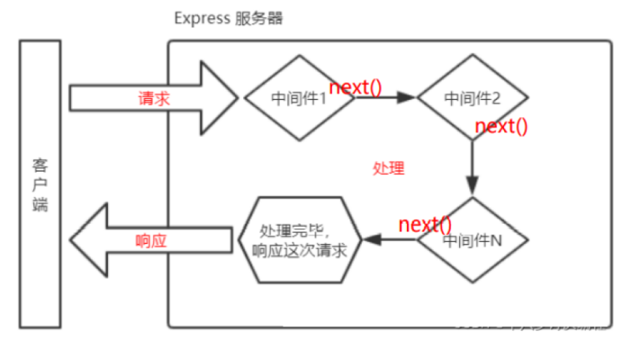

# Express 框架

##  :star:express 介绍

[express](https://www.expressjs.com.cn/) 是一个基于 Node.js 平台的极简、灵活的 WEB 应用开发框架。

简单来说，express 是一个封装好的工具包，封装了很多功能，便于我们开发 WEB 应用(HTTP 服务)

Express 框架核心特性：

- 可以设置中间件来响应 HTTP 请求。
- 定义了路由表用于执行不同的 HTTP 请求动作。
- 可以通过向模板传递参数来动态渲染 HTML 页面。


## :star:express 使用

**express 安装**

**express 本身是一个 npm 包**，所以可以通过 npm 安装

```shell
npm init -y
npm install express --save
```

以上命令会将 Express 框架安装在当前目录的 **node_modules** 目录中， **node_modules** 目录下会自动创建 express 目录。

以下几个重要的模块是需要与 express 框架一起安装的：

- **body-parser**：node.js 中间件，用于处理 JSON, Raw, Text 和 URL 编码的数据。
- **cookie-parser**：这就是一个解析Cookie的工具。通过`req.cookies`可以取到传过来的 cookie，并把它们转成对象。
- **multer**：node.js 中间件，用于处理 `enctype="multipart/form-data"`（设置表单的MIME编码）的表单数据。

```sh
npm install body-parser --save
npm install cookie-parser --save
npm install multer --save
```

安装完后，我们可以查看下 express 使用的版本号：

```sh
npm list express
```


**Hello World**

操作步骤：

1. 创建`app.js`文件，键入如下代码

```javascript
// 1. 导入 express
const express = require('express')

// 2. 创建应用对象
const app = express()

const PORT = 3000
const HOST = 'http://127.0.0.1'
const HOSTNAME = `${HOST}:${PORT}`

// 3. 创建路由规则
app.get('/', (req, res) => {
    res.end('Hello World')
})

// 4. 监听端口 启动服务
let server = app.listen(PORT, () => {
    console.log(`serve is runnig at ${HOSTNAME}`);
})
```

2. 命令行下执行该脚本

```shell
node <文件名>
# 或者
nodemon <文件名>
```

或`package.json`中配置

```json
"scripts": {
    "dev": "nodemon ./app.js"
}
```

3. 然后在浏览器就可以访问 http://127.0.0.1:3000


##  :star:响应设置

express 框架封装了一些 API 来方便给客户端响应数据，并且兼容原生 HTTP 模块的获取方式。

Express 应用使用回调函数的参数： **request** 和 **response** 对象来处理请求和响应的数据。

```javascript
// 获取请求的路由规则
app.get('/', (req, res) => {
  	// 1. express 中设置响应的方式兼容 HTTP 模块的方式（原生响应）
  	res.statusCode = 404;
  	res.statusMessage = 'xxx'
  	res.setHeader('abc','xyz')
  	res.write('响应体')
  	res.end('xxx')
  
    // 2. express 的响应方法
  	res.status(500)  //设置响应状态码
  	res.set('xxx','yyy')  //设置响应头
  	res.send('中文响应不乱码')  //设置响应体
  	// 连贯操作
  	res.status(404).set('xxx','yyy').send('你好朋友')
  	
    // 3. 其他响应
  	res.redirect('http://atguigu.com')  // 重定向
  	res.download('./package.json')    	// 下载响应
  	res.json({    					  // 响应 JSON
        name: 'atguigu',
        slogon: '123456'
    })
  	res.sendFile(__dirname + '/home.html')   //响应文件内容
})
```


##  :star:express 路由

### 1.什么是路由

> 官方定义： 路由确定了应用程序如何响应客户端对特定端点的请求

### 2.路由的使用

一个路由的组成有 **请求方法**， **路径** 和 **回调函数** 组成

express 中提供了一系列方法，可以很方便的使用路由，使用格式如下：

```js
app.<method>(path，callback)
```

代码示例：

```javascript
// 导入 express
const express = require('express')
//创建应用对象
const app = express()

// GET 请求
app.get('/', (req,res) => {
	res.send('我才是真正的首页')
})

// POST 请求
app.post('/login', (req, res) => {
	res.send('登录成功')
})

// 匹配所有的请求方法
app.all('/search', (req, res) => {
	res.send('1 秒钟为您找到相关结果约 100,000,000 个')
})

// 自定义 404 路由
app.all("*", (req, res) => {
	res.send('<h1>404 Not Found</h1>')
})

// 监听端口 启动服务
app.listen(3000, () =>{
	console.log('服务已经启动, 端口监听为 3000')
})
```

###  2.获取请求参数

express 框架封装了一些 API 来方便获取请求报文中的数据，并且兼容原生 HTTP 模块的获取方式

```javascript
// 导入 express
const express = require('express')
// 创建应用对象
const app = express()

// 获取请求的路由规则
app.get('/request', (req, res) => {
	// 1. 获取报文的方式与原生 HTTP 获取方式是兼容的
	console.log(req.method)
	console.log(req.url)
	console.log(req.httpVersion)
	console.log(req.headers)
	
    // 2. express 独有的获取报文的方式
    // 获取路径
	console.log(req.path)
    // 获取查询字符串
	console.log(req.query) // 『相对重要』对象形式 返回所有的查询字符串
	// 获取指定的请求头
	console.log(req.get('host'))
	res.send('请求报文的获取')
})

// 启动服务
app.listen(3000, () => {
	console.log('启动成功....')
})
```

### 3.获取路由参数

路由参数指的是 URL 路径中的参数（数据）

```javascript
// :id 为占位符
app.get('/:id.html', (req, res) => {
	res.send('商品详情, 商品 id 为' + req.params.id)
})
```


## :star:express 中间件

###  什么是中间件

**中间件（Middleware）本质是一个回调函数**

中间件函数可以像路由回调一样访问 `请求对象（request）` ， `响应对象（response）`



### 中间件的作用

- 中间件的作用：就是**使用函数封装公共操作，简化代码**

### 中间件的类型

- 全局中间件 
- 路由中间件

#### 定义全局中间件

- 每一个请求 到达服务端之后 都会执行全局中间件函数

声明中间件函数

```javascript
let recordMiddleware = function(request,response,next){
    //实现功能代码
    //.....
    //执行next函数(当如果希望执行完中间件函数之后，仍然继续执行路由中的回调函数，必须调用next)
    next();
}
```

应用中间件

```javascript
app.use(recordMiddleware)
```

声明时可以直接将匿名函数传递给 `use`

```javascript
app.use(function (request, response, next) {
	console.log('定义第一个中间件');
	next();
})
```

####  多个全局中间件

express 允许使用 app.use() 定义多个全局中间件

```javascript
app.use(function (request, response, next) {
    console.log('定义第一个中间件');
    next();
})
app.use(function (request, response, next) {
    console.log('定义第二个中间件');
    next();
})
```

####  定义路由中间件

如果只需要对某一些路由进行功能封装，则就需要路由中间件

调用格式如下：

```js
// 先定义一个中间件函数

// 在路由内使用中间件函数
app.get('/路径',中间件函数,(request,response)=>{
	// 内部代码
});

app.get('/路径',中间件函数1,中间件函数2,(request,response)=>{
	// 内部代码
});
```

