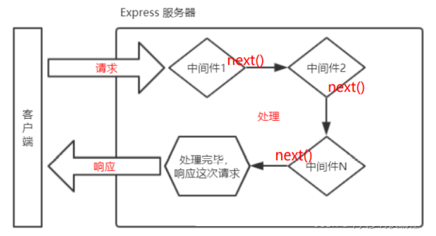

# Node.js 入门

Node.js 是什么？

> 是一款应用程序，是一款软件，它可以运行 JavaScript
>
> Node.js 是一个基于 Chrome V8 引擎的 JavaScript 运行环境
>
> 官网地址 https://nodejs.org/zh-cn/

Node.js 的作用

> - 开发服务器应用
> - 开发工具类应用
> - 开发桌面端应用

Node.js 注意点

> 浏览器 是 JavaScript 的**前端**运行环境
>
> Node.js 是 JavaScript 的**后端**运行环境
>
> ==Node.js 中**不能使用** **DOM** 和 **BOM** 的API==

浏览器中的 JavaScript

> - **核心语法**：ECMAScript
>
> - **Node API**
>
>   DOM、BOM、AJAX、Storage、console、定时器、alert / confirm....

Node.js 中的 JavaScript

> - **核心语法**：ECMAScript
>
> - **Node API**
>
>   fs、url、http、util、console、定时器、path....

Node.js 中顶级对象 **global**、**globalThis**

# Buffer

## 概念

**Buffer（缓冲器）** 是一个类似于数组的 **对象** ，用于表示固定长度的字节序列

Buffer 本质是一段内存空间，专门用来处理 `二进制数据` 

##  特点

1. Buffer 大小固定且无法调整
2. Buffer 性能较好，可以直接对计算机内存进行操作
3. 每个元素的大小为 1 字节（byte）

##  使用

### 创建 Buffer

Node.js 中创建 Buffer 的方式主要如下几种：

1. `Buffer.alloc`

   ```javascript
   // 创建了一个长度为 10 字节的 Buffer，相当于申请了 10 字节的内存空间，每个字节的值为 0
   let buf_1 = Buffer.alloc(10) //=>结果为<Buffer 00 00 00 00 00 00 00 00 00 00>
   ```

2. `Buffer.allocUnsafe`

   ```javascript
   // 创建了一个长度为 10 字节的 Buffer，buffer 中可能存在旧数据，可能会影响执行结果，所以叫 unsafe ，但是效率比 alloc 高
   let buf_2 = Buffer.allocUnsafe(10)
   ```

3. `Buffer.from`

   ```javascript
   // 通过字符串创建 Buffer
   let buf_3 = Buffer.from('hello')
   // 通过数组创建 Buffer
   let buf_4 = Buffer.from([105, 108, 111, 118, 101, 121, 111, 117])
   ```

###  Buffer 与字符串的转化

> 我们可以借助 `toString` 方法将 Buffer 转为字符串

```javascript
let buf_4 = Buffer.from([105, 108, 111, 118, 101, 121, 111, 117])
console.log(buf_4.toString()) //=>iloveyou
```

**注意: **`toString` 默认是按照 `utf-8` 编码方式进行转换的

### Buffer 的读写

> Buffer 可以直接通过 `[]` 的方式对数据进行处理。

```javascript
let buf_3 = Buffer.from('hello')
// 读取
console.log(buf_3[1]) //=>101
// 修改
buf_3[1] = 97
//查看字符串结果
console.log(buf_3.toString()) //=>hallo
```

**注意:**

1. 如果修改的数值超过 `255` ，则超过 `8` 位数据会被舍弃
2. 一个 `utf-8` 的字符 一般 占3个字节


# fs 模块

fs（file system），称为文件系统，是 Node.js 中的 内置模块，可以对计算机中的磁盘进行操作

## 1.文件写入

| 方法                        | 说明     |
| --------------------------- | -------- |
| writeFile                   | 异步写入 |
| writeFileSync               | 同步写入 |
| appendFile / appendFileSync | 追加写入 |
| createWriteStream           | 流式写入 |

### writeFile 异步写入

```js
// 语法
fs.writeFile(file, data[, options], callback)
```

参数说明：

- file：文件名
- data：待写入的数据
- options：选项设置（可选）
- callback：回调函数

返回值：undefined

### writeFileSync 同步写入

```js
// 语法
fs.writeFileSync(file, data[, options])
```

参数与 fs.writeFile 大体一致，只是没有 callback 参数，返回值：undefined

> Node.js 中的磁盘操作时由其他 **线程** 完成的，结果的处理有两种模式：
>
> - **同步处理** JavaScript 主线程 **会等待** 其他线程的执行结果，然后再继续执行主线程代码，**效率较低**
> - **异步处理** JavaScript 主线程 **不会等待** 其他线程的执行结果，直接执行后续的主线程代码，**效率较高**


### appendFile / appendFileSync 追加写入

appendFile 作用是在文件尾部追加内容，appendFile 语法与 writeFile 语法完成相同

```js
// 语法
fs.appendFile(file, data[, options], callback)
fs.appendFileSync(file, data[, options])
```

参数与 fs.writeFile 大体一致，返回值：二者都为 undefined

### createWriteStream 流式写入

```js
// 语法
fs.createWriteStream (path, [, options])
```

参数说明：

- path：文件路径
- options：选项设置（可选）

返回值：Object

> 程序打开一个文件是需要消耗资源的，流式写入可以减少打开关闭文件的次数
>
> 流式写入方式适用于 **大文件写入或频繁写入** 的场景，writeFile 适用于 **写入频率较低的场景**


### 写入文件的场景

> 当 **需要持久化保存数据** 的时候，应该想到文件写入


## 2.文件读取

| 方法             | 说明     |
| ---------------- | -------- |
| readFile         | 异步读取 |
| readFileSync     | 同步读取 |
| createReadStream | 流式读取 |

### readFile 异步读取

```js
// 语法
fs.readFile(path, [, options], callback)
```

参数说明：

- path：文件路径
- options：选项设置（可选）
- callback：回调函数

返回值：undefined

### readFileSync 同步读取

```js
// 语法
fs.readFileSync(path[, options])
```

参数与 fs.readFile 大体一致，只是没有 callback 参数，返回值：**string | Buffer**

### createReadStream 流式读取

```js
// 语法
fs.createReadStream(path[, options])
```

参数与 fs.readFile 大体一致，只是没有 callback 参数，返回值：**Object**

### 读取文件应用场景

> 电脑开机、程序运行、编辑器打开文件、查看图片、播放视频....


## 3.文件移动与重命名

在 Node.js 中，我们使用 **rename** 或 **renameSync** 来移动或重命名 **文件 或 文件夹**

```js
// 语法
fs.rename(oldPath, newPath, callback)
fs.renameSync(oldPath, newPath)
```

参数说明：

- oldPath：文件当前路径
- newPath：文件新的路径
- callback：回调函数


## 4.文件删除

在 Node.js 中，我们使用 **unlink** 或 **unlinkSync** 来删除文件

```js
// 语法
fs.unlink(path, callback)
fs.unlinkSync(path)
```

参数说明：

- path：文件路径
- callback：回调函数


## 5.文件夹操作

| 方法                  | 说明       |
| --------------------- | ---------- |
| mkdir / mkdirSync     | 创建文件夹 |
| readdir / readdirSync | 读取文件夹 |
| rmdir / rmdirSync     | 删除文件夹 |

### mkdir 创建文件夹

```js
// 语法
fs.mkdir(path[, options], callback)
fs.mkdirSync(path, [, options])
```

参数说明：

- path：文件夹路径
- options：选项设置（可选）
- callback：回调函数


### readdir 读取文件夹

```js
// 语法
fs.readdir(path[, options], callback)
fs.readdirSync(path, [, options])
```

参数与 fs.mkdir 大体一致

### rmdir 删除文件夹

```js
// 语法
fs.rmdir(path[, options], callback)
fs.rmdirSync(path[, options])
```

参数与 fs.mkdir 大体一致


## 6.查看资源状态

在 Node.js 中，我们使用 **stat** 或 **statSync** 来查看资源的详细信息

```js
// 语法
fs.stat(path[, options], callback)
fs.statSync(path[, options])
```

参数说明：

- path：文件路径
- options：选项设置（可选）
- callback：回调函数


## 7.相对路径问题

相对路径：

> - **./座右铭.txt** 当前目录下的座右铭.txt
> - **座右铭.txt** 等效于上面的写法
> - **../座右铭.txt** 当前目录的上一级目录中的座右铭.txt

绝对路径：

> - **D:/Program Files** windows系统下的绝对路径
> - **/usr/bin** Linux系统下的绝对路径

> ==注意==：相对路径中所谓的 **当前目录**，指的是 **命令行的工作目录**，而并非是文件的所在目录

## 8.\__dirname

> **\__dirname** 与 **require** 类似，都是 Node.js 环境中的 **全局变量**
>
> **\__dirname** 保存着 **当前文件** 所在目录的 ==**绝对路径**==，可以使用 \__diname 与文件名拼接成绝对路径

# path 路径模块

path 模块是 Node.js 官方提供的、用来处理路径的模块。提供一系列的方法和属性，用来满足对路径的处理需求

如果要在 JavaScript 代码中，使用 path 模块来处理路径，则需要使用如下的方式先导入它

```javascript
const path = require('path')
```

d 

| API                 | 说明                     |
| ------------------- | ------------------------ |
| **path.resolve**    | **拼接规范的绝对路径**   |
| path.join(...paths) | 可以把多个路径片段拼接   |
| path.sep            | 获取操作系统的路径分隔符 |
| path.parse          | 解析路径并返回对象       |
| path.basename       | 获取路径的基础名称       |
| path.dirname        | 获取路径的目录名         |
| path.extname        | 获得路径的扩展名         |

# http 模块

HTTP（HyperText Transport Protocol）超文本传输协议，协议详细规定了浏览器与万维网服务器之间互相通信的规则

**请求报文**

```js
// 请求行
POST /s?ie=utf-8 HTTP/1.1
// 请求头
Host: atguigu.com
Cookie: name=guigu
Content-type: application/x-www-form-urlencoded
User-Agent: chrome 83
......
// 空行

// 请求体，[GET请求，则可以为空]，POST请求，可以不为空
username=admin&password=admin
```

**响应报文**

```js
// 请求行
HTTP/1.1 200 OK
// 请求头
Content-type: text/html;charset=utf-8
Content-length: 2048
Content-encoding: gzip
......
// 空行

// 请求体
<html>
	<head></head>
	<body>
		<h1>你好啊<h1>
	</body>
</html>
```

## http 请求头

格式：**【请求头名: 值】**

常见的请求头：

| 请求头          | 说明                                                         |
| --------------- | ------------------------------------------------------------ |
| Host            | 主机名                                                       |
| Connection      | 连接的设置 keep-alive（保持连接）；close                     |
| Cache-Control   | 缓存控制 max-age = 0（没有缓存）                             |
| User-Agent      | 用户代理，客户端字符串标识，<br>服务器可以通过这个标识来识别请求来自哪个客户端 |
| Accept          | 设置浏览器接收的数据类型                                     |
| Accpet-Encoding | 设置接收的压缩方式                                           |
| Accept-Language | 设置接收的语言                                               |
| Cookie          |                                                              |

## 注意事项

响应内容中文乱码的解决方法

```javascript
response.setHeader('content-type', 'text/html;charset=uft-8')
```

HTTP协议的默认端口为 80，HTTPS协议的默认端口为443，HTTP服务开发常用端口 3000、8080、8090、9000等

# Node.js 模块化

## 模块化介绍

1. 什么是模块化与模块？

> 是指解决一个复杂问题时，**自顶向下**逐层把系统划分成若干模块的过程
>
> 将一个复杂的程序文件依据一定规则拆分成多个文件的过程称之为 **模块化**
>
> 其中拆分出的 **每个文件就是一个模块**，模块的内部数据是私有的不过模块可以暴露内部数据以便其他模块使用

2. 什么是模块化项目？

> 编码时按照模块一个一个编码的，整个项目就是一个模块化的项目

3. 模块化的好处

> - 防止命名冲突
> - 高复用性
> - 高维护性

## 暴露数据

模块暴露数据的两种方式：

> 1. **`module.exports = value`**
> 2. **`exports.属性名 = value`**

注意：

> - **`module.exports`** 可以暴露**任意数据**
> - ==不能使用== exports = value 的形式暴露数据
> - 隐式关系：**exports = module.exports = { }**

## 导入（引入）模块

Node.js 中模块的分类，根据模块来源的不同，将模块分为了 3 大类

> - **内置模块**（内置模块是由 Node.js 官方提供的，例如 fs、path、http 等）
> - **自定义模块**（用户创建的每个 .js 文件，都是自定义模块）
> - **第三方模块**（由第三方开发出来的模块，使用前需要先下载）

在模块中使用 **require** 传入文件路径即可引入文件：

```javascript
const demo = require('./me.js')
```

**require 使用的一些注意事项：**

> 1. **对于自己创建的模块**，导入时路径建议写 **相对路径**，且不能省略 **./** 和 **../**
>
> 2. **js** 和 **json** 文件导入时可以不用写后缀，c/c++ 编写的 node 扩展文件也可以不用写后缀
>
> 3. 如果导入其他类型的文件，会以 **js**文件类型进行处理
>
> 4. 同名文件且没有写后缀，优先导入 js文件
>
> 5. 如果导入路径是一个文件夹，则首先检测文件夹下 **package.json** 文件中的 **main属性**对应的文件，<br>如果 main属性不存在，或 package.json 不存在，<br>则会检测文件夹下的 **index.js** 和 **index.json** 文件，如果还是没有找到，就会报错
>
> 6. 导入 node.js **内置模块**时，直接 require 模块的名字即可，无需加 **./** 和 **../**

> 导出模块的时候：**require 的返回结果** 是目标模块中 ==**module.exports 的值**==，并不是 exports 的值


## CommonJS 规范

**module.exports**、**exports** 以及 **require** 这些都是 **CommonJS 模块化规范**的内容，<br>而 Node.js 是实现了 CommonJS 模块化规范，二者关系类似 JavaScript 与 ECMAScript

CommonJS 规定了模块的特性和各模块之间如何相互依赖：

> - 每个模块内部，module 变量代表当前模块
> - module 变量是一个对象，它的 exports 属性（即 module.exports）是对外的接口
> - 加载某个模块，其实是加载该模块的 module.exports 属性。**require() 方法用于加载模块**

# 包管理工具

## 包的介绍

**包** 英文单词是 **package**，代表了一组特定功能的源码集合

常用的包管理工具：

> - **npm**
> - yarn
> - cnpm

## npm

npm 全称 **Node Pakcage Manager**，即 Node 的包管理工具

npm 是 node.js 官方内置的包管理工具

npm 安装  --  node.js 在安装时会自动安装 npm

### 初始化

创建一个空目录，然后以此目录为工作目录 **启动命令行工具**，执行

```bash
npm init
```

**`npm init`** 命令的作用是将文件夹初始化为一个包，**交互式创建 package.json 文件**

**package.json** 是包的配置文件，每个包都必须要有 **package.json**，如下

```json
{
"name": "test",		#包的名字
"version": "1.0.0",	#包的版本
"description": "",	#包的描述
"main": "index.js",	#包的入口文件
"scripts": {		    #脚本设置
 "test": "echo \"Error: no test specified\" && exit 1"
},
"author": "",			#作者
"license": "ISC",		#开源证书
"dependencies": {		#依赖
 "art-template": "^4.13.2",
 "jquery": "^3.6.0",
 "moment": "^2.29.1"
}
}
```

注意：

> - package 的包名不能使用中文、大写，默认值是 **文件夹的名称**
> - version（版本号）要求 **x.x.x** 的形式，x 必须是数字，默认值为 **1.0.0**
> - package.json 可以手动创建和修改
> - 使用 **`npm init - y`** 或 **`npm init -yes`** 快速创建
>

但不建议不要手动修改 node_modules 或 package-lock.json文件中的任何代码，npm 包管理工具会自动维护它们


### 搜索包

命令行 **`npm s / search 关键字`**

网站：http://www.npmjs.com

### 查看镜像源

```shell
npm get registry
```


### 下载安装包

命令行 **`npm i / install <包名>`**，运行之后文件夹下会增加两个资源

全局安装 **`npm i -g <包名>`**

安装指定版本的包 **`npm i <包名@版本号>`**

可以运行 **`npm install / npm i`**一次性安装所有的依赖包

> - **node_modules** 文件夹，用来存放下载的包，require() 导入第三方包时，从这个目录中查找并加载
> - **package-lock.json** 文件，用来锁定包的版本，配置文件用来记录 node_modules 目录下的每一个包的下载信息，例如包的名字、版本号、下载地址等
>
> 注意：不要手动修改 node_modules 或 package-lock.json文件中的任何代码，npm 包管理工具会自动维护它们

> 例如，安装 nuiq 之后，uniq就是当前这个包的一个 **依赖包**，简称 **依赖**
>
> 比如我们创建一个包的名字为A，A中安装了包名字是B，我们就说 **B是A的一个依赖包**，也会说 **A依赖B**

### 删除包

局部删除 **`npm r / remove uniq`**

全局删除 **`npm remove -g nodemon`**

**`npm uninstall <包名>`**


### require导入npm包

require 导入 npm 包的基本流程：

> - 在当前文件夹下 node_modules 中寻找同名的文件夹
> - 在上一级目录下的 node_modules 中寻找同名的文件夹，直至找到磁盘根目录


### 生产依赖&开发依赖

我们可以在安装时设置选项来区分依赖的类型，目前分为两类：

| 类型     | 命令                                                       | 说明                                                         |
| -------- | ---------------------------------------------------------- | ------------------------------------------------------------ |
| 生产依赖 | **`npm i -S <包名>`**<br>或 **`npm i --save <包名>`**      | -S 等效于 --save，-S是默认选项<br>包信息保存在package.json中的 **dependencies 属性** |
| 开发依赖 | **`npm i -D <包名>`**<br/>或 **`npm i --save-dev <包名>`** | -D（development）等效于 --save-dev，<br/>包信息保存在package.json中的 **devDependencies 属性** |

> **开发依赖** 只在开发阶段使用，而 **生产依赖** 是开发阶段和最终上线运行阶段都用到的依赖包

## cnpm

### 介绍

cnpm 是一个淘宝构建的`npmjs.com`的完整镜像，也称为『淘宝镜像』，网址[https://npmmirror.com/](https://gitee.com/link?target=https%3A%2F%2Fnpmmirror.com%2F) cnpm 服务部署在国内 阿里云服务器上，可以提高包的下载速度

官方也提供了一个全局工具包 `cnpm` ，操作命令与 npm 大体相同

我们可以通过 npm 来安装 cnpm 工具

 ```shell
 npm install -g cnpm --registry=https://registry.npmmirror.com
 ```

###  npm 配置淘宝镜像

用 npm 也可以使用淘宝镜像，配置的方式有两种

**1. 直接配置**

执行如下命令即可完成配置

```shell
npm config set registry https://registry.npm.taobao.org
```

切换为官方镜像源

```shell
npm config set registry https://registry.npmjs.org 
```

查看镜像源

```shell
npm get registry
```


**2. 工具配置**

使用 `nrm` 配置 npm 的镜像地址 `npm registry manager`

> **nrm (npm registry manager )** 是 npm 的镜像源管理工具

1. 安装 nrm

   ```shell
   npm i -g nrm
   ```

2. 修改镜像

   ```shell
   nrm use taobao
   ```

3. 检查是否配置成功（选做）

   ```shell
   npm config list
   ```

   检查 registry 地址是否为 [https://registry.npmmirror.com/](https://gitee.com/link?target=https%3A%2F%2Fregistry.npmmirror.com%2F) , 如果是则表明成功

> 补充说明：
>
> 1. **建议使用第二种方式进行镜像配置，因为后续修改起来会比较方便**
> 2. 虽然 cnpm 可以提高速度，但是 npm 也可以通过淘宝镜像进行加速，所以 npm 的使用率还是高于 cnpm

## yarn

###  yarn 介绍

> yarn 是由 Facebook 在 2016 年推出的新的 Javascript 包管理工具，官方网址：[https://yarnpkg.com/](https://gitee.com/link?target=https%3A%2F%2Fyarnpkg.com%2F)

### yarn 特点

yarn 官方宣称的一些特点

- 速度超快：yarn 缓存了每个下载过的包，所以再次使用时无需重复下载。 同时利用并行下载以最大化资源利用率，因此安装速度更快
- 超级安全：在执行代码之前，yarn 会通过算法校验每个安装包的完整性
- 超级可靠：使用详细、简洁的锁文件格式和明确的安装算法，yarn 能够保证在不同系统上无差异的工作

### yarn 安装

我们可以使用 npm 安装 yarn

```shell
npm i -g yarn
```

### yarn 常用命令

| 功能         | 命令                                                         |
| ------------ | ------------------------------------------------------------ |
| 初始化       | **`yarn init`** 或 **`yarn init -y`**                        |
| 安装包       | **`yarn add <包名>`** 生产依赖<br>**`yarn add <包名> --dev/-D`** 开发依赖<br>**`yarn global add <包名>`** 全局安装 |
| 删除包       | **`yarn remove <包名>`** 删除项目依赖包<br>**`yarn global remove <包名>`** 全局删除包 |
| 安装项目依赖 | **`yarn`**                                                   |
| 运行命令     | **`yarn <项目名>`**  # 不需要添加 `run`                      |

> 思考题：
>
> 这里有个小问题就是 全局安装的包不可用，yarn 全局安装包的位置可以通过 **`yarn global bin`**来查看，
>
> 那你有没有办法使 yarn 全局安装的包能够正常运行？
>
> - 配置 path 环境

### yarn 配置淘宝镜像

可以通过如下命令配置淘宝镜像

```shell
# 更换淘宝镜像
yarn config set registry http://registry.npm.taobao.org/
# 换成原来的，'https://registry.npmmirror.com/'
yarn config set registry http://registry.npmjs.org/
```

可以通过 `yarn config list` 查看 yarn 的配置项

```shell
yarn config get registry  // 默认：https://registry.yarnpkg.com
```


## nvm

nvm 全称 **Node Version Manager** 顾名思义它是用来 **管理 node 版本的工具**，方便切换不同版本的 Node.js

nvm 的使用非常的简单，跟 npm 的使用方法类似

### 下载安装

首先先下载 nvm，下载地址 [https://github.com/coreybutler/nvm-windows/releases](https://gitee.com/link?target=https%3A%2F%2Fgithub.com%2Fcoreybutler%2Fnvm-windows%2Freleases) ，

选择 `nvm-setup.exe` 下载即可（网络异常的小朋友可以在资料文件夹中获取）

### 常用命令

| 命令                  | 说明                            |
| --------------------- | ------------------------------- |
| nvm list available    | 显示所有可以下载的 Node.js 版本 |
| nvm list              | 显示已安装的版本                |
| nvm install 18.12.1   | 安装 18.12.1 版本的 Node.js     |
| nvm install latest    | 安装最新版的 Node.js            |
| nvm uninstall 18.12.1 | 删除某个版本的 Node.js          |
| nvm use 18.12.1       | 切换 18.12.1 的 Node.js         |


# express

##  express 介绍

> express 是一个基于 Node.js 平台的极简、灵活的 WEB 应用开发框架，官方网址： [https://www.expressjs.com.cn/](https://gitee.com/link?target=https%3A%2F%2Fwww.expressjs.com.cn%2F)

简单来说，express 是一个封装好的工具包，封装了很多功能，便于我们开发 WEB 应用(HTTP 服务)


## express 使用

### express 下载

**express 本身是一个 npm 包**，所以可以通过 npm 安装

```shell
npm init
npm i express
```

### express 初体验

操作步骤：

1. 创建 js 文件，键入如下代码

```javascript
// 1. 导入 express
const express = require('express')
// 2. 创建应用对象
const app = express()

// 3. 创建路由规则
app.get('/home', (req, res) => {
	res.end('hello express server')
})

// 4. 监听端口 启动服务
app.listen(3000, () =>{
	console.log('服务已经启动, 端口监听为 3000...')
})
```

2. 命令行下执行该脚本

```shell
node <文件名>
# 或者
nodemon <文件名>
```

3. 然后在浏览器就可以访问 [http://127.0.0.1:3000/home](https://gitee.com/link?target=http%3A%2F%2F127.0.0.1%3A3000%2Fhome) 


##  express 路由

### 什么是路由

> 官方定义： 路由确定了应用程序如何响应客户端对特定端点的请求

### 路由的使用

一个路由的组成有 **请求方法**， **路径** 和 **回调函数** 组成

express 中提供了一系列方法，可以很方便的使用路由，使用格式如下：

```js
app.<method>(path，callback)
```

代码示例：

```javascript
// 导入 express
const express = require('express')
//创建应用对象
const app = express()

// 创建 get 路由
app.get('/home', (req, res) => {
	res.send('网站首页')
});

// 首页路由
app.get('/', (req,res) => {
	res.send('我才是真正的首页')
})

// 创建 post 路由
app.post('/login', (req, res) => {
	res.send('登录成功')
})

// 匹配所有的请求方法
app.all('/search', (req, res) => {
	res.send('1 秒钟为您找到相关结果约 100,000,000 个')
})

// 自定义 404 路由
app.all("*", (req, res) => {
	res.send('<h1>404 Not Found</h1>')
})

// 监听端口 启动服务
app.listen(3000, () =>{
	console.log('服务已经启动, 端口监听为 3000')
})
```

###  获取请求参数

express 框架封装了一些 API 来方便获取请求报文中的数据，并且兼容原生 HTTP 模块的获取方式

```javascript
// 导入 express
const express = require('express')
// 创建应用对象
const app = express()

// 获取请求的路由规则
app.get('/request', (req, res) => {
	// 1. 获取报文的方式与原生 HTTP 获取方式是兼容的
	console.log(req.method)
	console.log(req.url)
	console.log(req.httpVersion)
	console.log(req.headers)
	
    // 2. express 独有的获取报文的方式
    // 获取路径
	console.log(req.path)
    // 获取查询字符串
	console.log(req.query) // 『相对重要』对象形式 返回所有的查询字符串
	// 获取指定的请求头
	console.log(req.get('host'))
	res.send('请求报文的获取')
})

// 启动服务
app.listen(3000, () => {
	console.log('启动成功....')
})
```

### 获取路由参数

路由参数指的是 URL 路径中的参数（数据）

```javascript
// :id 为占位符
app.get('/:id.html', (req, res) => {
	res.send('商品详情, 商品 id 为' + req.params.id)
})
```

##  express 响应设置

express 框架封装了一些 API 来方便给客户端响应数据，并且兼容原生 HTTP 模块的获取方式

```javascript
// 获取请求的路由规则
app.get("/response", (req, res) => {
  	// 1. express 中设置响应的方式兼容 HTTP 模块的方式（原生响应）
  	res.statusCode = 404;
  	res.statusMessage = 'xxx'
  	res.setHeader('abc','xyz')
  	res.write('响应体')
  	res.end('xxx')
  
    // 2. express 的响应方法
  	res.status(500)  //设置响应状态码
  	res.set('xxx','yyy')  //设置响应头
  	res.send('中文响应不乱码')  //设置响应体
  	// 连贯操作
  	res.status(404).set('xxx','yyy').send('你好朋友')
  	
    // 3. 其他响应
  	res.redirect('http://atguigu.com')  //重定向
  	res.download('./package.json')    //下载响应
  	res.json({
        name: 'atguigu',
        slogon: '123456'
    })    			//响应 JSON
  	res.sendFile(__dirname + '/home.html')   //响应文件内容
})
```

## express 中间件

###  什么是中间件

> **中间件（Middleware）本质是一个回调函数**
>
> 中间件函数可以像路由回调一样访问 `请求对象（request）` ， `响应对象（response）`



### 中间件的作用

> 中间件的作用：就是**使用函数封装公共操作，简化代码**

### 中间件的类型

- 全局中间件 
- 路由中间件

#### 定义全局中间件

> `每一个请求` 到达服务端之后 `都会执行全局中间件函数`

声明中间件函数

```javascript
let recordMiddleware = function(request,response,next){
    //实现功能代码
    //.....
    //执行next函数(当如果希望执行完中间件函数之后，仍然继续执行路由中的回调函数，必须调用next)
    next();
}
```

应用中间件

```javascript
app.use(recordMiddleware)
```

声明时可以直接将匿名函数传递给 `use`

```javascript
app.use(function (request, response, next) {
	console.log('定义第一个中间件');
	next();
})
```

####  多个全局中间件

express 允许使用 app.use() 定义多个全局中间件

```javascript
app.use(function (request, response, next) {
    console.log('定义第一个中间件');
    next();
})
app.use(function (request, response, next) {
    console.log('定义第二个中间件');
    next();
})
```

####  定义路由中间件

如果只需要对某一些路由进行功能封装，则就需要路由中间件

调用格式如下：

```javascript
// 先定义一个中间件函数

// 在路由内使用中间件函数
app.get('/路径',中间件函数,(request,response)=>{
	// 内部代码
});

app.get('/路径',中间件函数1,中间件函数2,(request,response)=>{
	// 内部代码
});
```