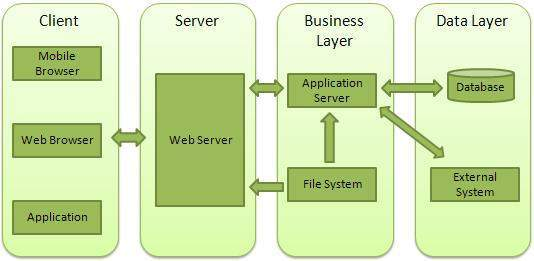

# http 模块

## 基本概念

[http 模块](https://nodejs.cn/api/http.html)是 Node.js 官方提供的、用来创建 web 服务器的模块。

通过 http 模块提供的 `http.createServer()` 方法，就可以把一台普通的电脑，变成一台 Web 服务器，从而对外提供 Web 资源服务。

### 什么是 Web 服务器？

Web服务器一般指网站服务器，是指驻留于因特网上某种类型计算机的程序，Web服务器的基本功能就是提供Web信息浏览服务。它只需支持HTTP协议、HTML文档格式及URL，与客户端的网络浏览器配合。

大多数 web 服务器都支持服务端的脚本语言（php、python、ruby等），并通过脚本语言从数据库获取数据，将结果返回给客户端。

目前最主流的三个Web服务器是 Apache、Nginx、IIS。

### Web 应用架构



- **Client** - 客户端，一般指浏览器，浏览器可以通过 HTTP 协议向服务器请求数据。
- **Server** - 服务端，一般指 Web 服务器，可以接收客户端请求，并向客户端发送响应数据。
- **Business** - 业务层， 通过 Web 服务器处理应用程序，如与数据库交互，逻辑运算，调用外部程序等。
- **Data** - 数据层，一般由数据库组成。


## 基本使用

**HTTP 模块提供了 5 个类：**

- http.Agent：创建全局实例，以管理 HTTP 客户端连接的持久性和复用，
- http.ClientRequest：当 http.request() 或 http.get() 被调用时，会创建 http.ClientRequest 对象。
- http.Server：当使用 http.createServer() 创建新的服务器时，通常会实例化并返回此类。
- http.ServerResponse
- http.IncomingMessage：http.serverRqueste()


## HTTP 报文

HTTP（HyperText Transport Protocol）超文本传输协议，协议详细规定了浏览器与万维网服务器之间互相通信的规则。

HTTP请求分为三部分：**请求行** + **请求头** + **请求体**

### 请求报文

```
// 请求行
POST /s?ie=utf-8 HTTP/1.1

// 请求头
Host: atguigu.com
Cookie: name=guigu
Content-type: application/x-www-form-urlencoded
User-Agent: chrome 83
......
// 空行

// 请求体，[GET请求，则可以为空]，POST请求，可以不为空
username=admin&password=admin
```

**常见的请求头：**

格式：【请求头名: 值】

- `Accept`：浏览器接收的数据类型，例如 text/html,application/json,image/webp

- `Accpet-Encoding`：接收的压缩方式，例如 gzip, deflate

- `Accept-Language`：接收的语言格式，例如 zh-CN

- `Connection`：连接的设置 keep-alive（持久连接）；close

- `Cookie`：  服务器发送到用户浏览器并保存在本地的一小块数据，浏览器会存储 cookie 并在下次向同一服务器再发起请求时携带并发送到服务器上，例如登录后的令牌token等

- `Cache-Control`：缓存控制 max-age = 0（没有缓存）

- `Content-Type`：请求提交的内容类型，一般只有POST提交时才需要设置，例如文件上传，表单提交等

  用来指定不同格式的请求格式响应信息俗称 MIME 媒体类型，常见的取值为：

  - `text/html` ：HTML格式，`text/plain`：纯文本格式，`text/xml`： XML格式
  - `image/gif`：gif图片格式，`image/jpeg`：jpg图片格式，`image/png`：png图片格式
  - `application/json`：JSON数据格式，`application/pdf`：pdf格式
  - `application/octet-stream`：二进制流数据，一般是文件下载
  - `application/x-www-form-urlencoded`：form表单默认的提交数据的格式，会编码成key-value格式
  - `multipart/form-data`： 表单中需要上传文件的文件格式类型

- `Host`：服务器的域名（主机）

- `Origin`：告诉服务器请求从哪里发起的，仅包括协议和域名

- `Referer`：告诉服务器请求的原始资源的URI，其用于所有类型的请求，并且包括：协议+域名+查询参数； 很多抢购服务会用这个做限制，必须通过某个入来进来才有效

- `User-Agent`：服务器通过这个请求头判断用户的软件的应用类型、操作系统、软件开发商以及版本号、浏览器内核信息等； 风控系统、反作弊系统、反爬虫系统等基本会采集这类信息做参考


### 响应报文

```
// 请求行
HTTP/1.1 200 OK

// 请求头
Content-type: text/html;charset=utf-8
Content-length: 2048
Content-encoding: gzip
......
// 空行

// 请求体
<html>
	<head></head>
	<body>
		<h1>你好啊<h1>
	</body>
</html>
```

**常见的响应头：**

格式：【响应头名: 值】

- `Allow`：服务器支持哪些请求方法

- `Access-Control-Allow-Origin`：跨域请求配置，定哪些站点可以参与跨站资源共享

- `Access-Control-Allow-Methods`：允许哪些方法来访问

- `Connection`：连接的设置 keep-alive（持久连接）

  告诉客户端服务器的tcp连接也是一个长连接，客户端可以继续使用这个tcp连接发送http请求

- `Content-Length`：响应体的字节长度

- `Content-Type`：响应体的MIME类型，例如`'Content-Type'：'text/html;charset=UTF-8'`

- `Content-Encoding`：告诉客户端，服务端发送的资源使用的编码类型，例如 gzip

- `Cache-Control`：HTTP 缓存会存储与请求关联的响应，并将存储的响应复用于后续请求

  - 默认为 `private`，响应只能作为私有的缓存，不能再用户间共享
  - `public`，浏览器和缓存服务器都可以缓存页面信息
  - `max-age = 10`，通知服务器10s内不再请求服务器，自己从缓冲区中刷新
  - `no-cache`，浏览器和服务器都不应该缓存页面信息
  - `no-store`，请求和响应的信息都不应该存储在对方的磁盘系统中

- `Date`：设置消息发送的日期和时间，例如 `'Date': Tue, 03 Apr 2018 03:52:28 GMT`

  GMT是格林尼治所在地的标准时间

- `Expires`：设置响应体的过期时间（GMT时间），使用明确的时间而不是通过指定经过的时间来指定缓存的生命周期

  如果 `Expires` 和 `Cache-Control: max-age` 都可用，则 `max-age` 定义为首选，用于指定经过的时间

- `Location`：表示客户应当到哪里去获取资源，一般同时设置状态代码为3xx

- `Refresh`：用于重定向，或当一个新的资源被创建时

- `Server`：表示服务器和相对应的版本，只是告诉客户端服务器信息

- `Transfer-Encoding：chunked`，表示服务器发送的资源的方式是分块发送的

  输出的内容长度不能确定，静态网页一般没有，基本出现在动态网页里面

  每一块都是独立的，独立的块都能标识自己的长度，最后一块长度为0，当客户端读到长度为0块时，说明确定资源已经传输完毕

- 


## 使用 Node 创建 Web 服务器

Node.js 提供了 http 模块，主要用于搭建 HTTP 服务端和客户端，使用 HTTP 服务器或客户端功能必须调用 http 模块，代码如下：

```js
// 1.导入 http 模块
const http = require('http');

// 2.创建 Web 服务器
const server = http.createServer();

// 3.为服务器实例绑定 request 事件，监听客户端的请求
server.on('request', (req, res) => {
    console.log('Someone visit our web server.');
    // 设置 Content-Type 响应头，解决中文乱码的问题
    res.setHeader('Content-Type', 'text/html; charset=utf-8');
    // res.end() 将内容响应给客户端
    res.end('你好'); // 浣犲ソ
})

// 4.启动服务器
server.listen(3000, () => {
    console.log('server running at http://127.0.0.1:3000');
})
```

**request 请求对象**

只要服务器接收到了客户端的请求，就会调用通过 server.on() 为服务器绑定的 request 事件处理函数。

- req.url，获取客户端请求的 URL 地址
- req.method，获取客户端请求的 method 类型
- req.headers，获取客户端HTTP请求的请求头

**response 响应对象**

在服务器的 request 事件处理函数中，如果想访问与服务器相关的**数据**或**属性**，可以使用如下的方式

- `res.statusCode = 200;`，设置HTTP状态码
- `res.statusMessage = 'OK'`，设置HTTP状态描述信息
- `res.setHeader('头名', '头值')`，设置响应头
- `res.write('响应体')`，设置响应体
- `res.end()`，将内容响应给客户端，<strong style="color:#DD5145">请求必须要有end。有且只有一个</strong>。

## 使用 Node 创建 Web 客户端

Node 创建 Web 客户端需要引入 http 模块，创建 client.js 文件，代码如下所示：


## 解决响应内容中文乱码

响应内容中文乱码的解决方法：

```javascript
response.setHeader('Content-Type', 'text/html; charset=utf-8')
```

HTTP协议的默认端口为 80，HTTPS协议的默认端口为443，HTTP服务开发常用端口 3000、8080、8090、9000等

## 参考

[MDN 文档](https://developer.mozilla.org/zh-CN/docs/Web/HTTP)、[参考文章](https://blog.csdn.net/m0_46615524/article/details/126262714)、[参考文章](https://blog.csdn.net/weixin_44827418/article/details/119494952)、[参考文章](https://blog.csdn.net/weixin_44018458/article/details/128602152)、[参考文章](https://blog.csdn.net/u012206617/article/details/125971280)、[参考文章](https://blog.csdn.net/hannah2233/article/details/125911821)