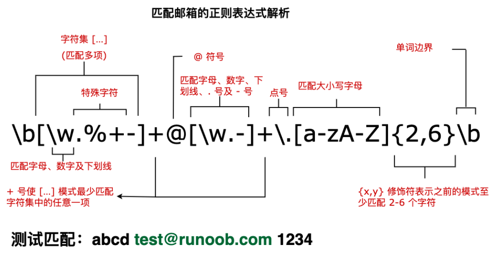

# 正则表达式

正则表达式（regular expression）描述了一种字符串匹配的模式（pattern），可以用来检查一个串是否含有某种子串、将匹配的子串替换或者从某个串中取出符合某个条件的子串等

## 语法

### 普通字符

### 非打印字符

非打印字符也可以是正则表达式的组成部分。下表列出了表示非打印字符的转义序列

| 字符 | 描述                                                         |
| ---- | ------------------------------------------------------------ |
| \cx  | 匹配由x指明的控制字符。例如，\cM 匹配一个 Control-M 或回车符。 |
| \f   | 匹配一个换页符。等价于 \x0c 和 \cL。                         |
| \n   | 匹配一个换行符。等价于 \x0a 和 \cJ。                         |
| \r   | 匹配一个回车符。等价于 \x0d 和 \cM。                         |
| \s   | 匹配任何空白字符串，包括空格、制表符、换页符等等。等价于 \[\f\n\r\t\v]。 |
| \S   | 匹配任何非空白字符。等价于 \[^ \f\n\r\t\v]。                 |
| \t   | 匹配一个制表符。等价于 \x09 和 \cl。                         |
| \v   | 匹配一个垂直制表符。等价于 \x0b 和 \cK。                     |

### 特殊字符

所谓特殊字符，就是一些有特殊含义的字符，若要匹配这些特殊字符，必须首先使字符 **"转义"**，即，将 **反斜杠字符 \\** 放在它们前面。下表列出了正则表达式中的特殊字符：

| 特殊字符    | 描述                                                         |
| ----------- | ------------------------------------------------------------ |
| **^**       | **匹配输入字符串的开始位置**，除非在方括号表达式中使用，<br/>**当该符号在方括号表达式中使用时，表示不接受该方括号表达式中的字符集合**。要匹配 \^ 字符，请使用 \\^ |
| **$**       | **匹配输入字符串的结尾位置**。<br>如果设置了 RegExp 对象的 Multiline 属性，则 \$ 也匹配 'n' 或 'r'。要匹配 \$ 字符本身，请使用 \\$ |
| ( )         | 标记一个子表达式的开始和结束位置。子表达式可以获取供以后使用。要匹配这些字符，请使用 \\( 和 \\) |
| *           | 匹配前面的子表达式 0次 或 多次。要匹配 \* 字符，请使用 \\*   |
| +           | 匹配前面的子表达式 1次 或 多次。要匹配 \+ 字符，请使用 \\+   |
| **.**（点） | 匹配除 换行符 \\n 以外的任何单字符。要匹配 \. 字符，请使用 \\. |
| [           | 标记一个中括号表达式的开始。要匹配 \[ 字符，请使用 \\[       |
| ?           | 匹配前面的子表达式 0次 或 1次，或指明一个**非贪婪限定符**。要匹配 ? 字符，请使用 \? |
| \           | 将下一个字符标记为或特殊字符、或原义字符、或向后引用、或八进转义字符 |
| \{          | 标记限定字符表达式的开始。要匹配 \{ 字符，请使用 \\{         |
| \|          | 指明两项之间的一个选择。要匹配 \| 字符，请使用 \\|           |

==如果 ^ 和 $ 在一起，表示必须精确匹配==


### 限定符

限定符用来指定正则表达式的一个给定组件必须要出现多少次才能满足匹配。有 ***** 或 **+** 或 **?** 或 **{n}** 或 **{n,}** 或 **{n,m}** 共6种。

正则表达式的限定符有：

| 字符  | 描述                                                         |
| ----- | ------------------------------------------------------------ |
| \*    | 匹配前面的子表达式0次或多次。例如，zo* 能匹配 "z" 以及 "zoo"。 \* 等价于 {0, } |
| \+    | 匹配前面的子表达式1次或多次。例如，'zo+' 能匹配 "zo"以及 "zoo"，但不能匹配 "z"。\+ 等价于 {1,} |
| ？    | 匹配前面的子表达式0次或1一次。例如，"do(es)?" 能匹配 "do"、"does" 中的 "does"、"doxy" 中的 "do"。? 等价于 {0, 1} |
| {n}   | n是非负整数，匹配确定的n次。例如，'o{2}' 不能匹配 "Bob" 中的 'o'，但能匹配 "food" 中的两个 'o'。 |
| {n,}  | n是非负整数，至少匹配n次。例如，'o{2,}' 不能匹配 "Bob" 中的 'o'，但能匹配 "fooooood" 中的所有 'o'。'o{1,}' 等价于 'o+'。'o{0,}' 则等价于 'o*' |
| {n,m} | m和n均为非负整数，其中n <= m，最少匹配n次且最多匹配m次。例如，"o{1,3}" 将匹配 "fooooood" 中前三个o。'o{0,1}' 等价于 'o?'。**请注意在逗号和两个数之间不能有空格** |

字符 **\*** 和 **+** 限定符都是==贪婪==的，<br>因为它们会尽可能多的匹配文字，只有在它们的后面加上一个 ? 就可以实现非贪婪或最小匹配

### 定位符

定位符使您能够 **将正则表达式固定到行首或行尾**。它们还使您能够创建这样的正则表达式，这些正则表达式出现在一个单词内、在一个单词的开头或者一个单词的结尾。

定位符用来描述字符串或单词的边界，**^** 和 **$** 分别指字符串的开始与结束，**\b** 描述单词的前或后边界，**\B** 表示非单词边界。

正则表达式的定位符有：

| 字符   | 描述                                                         |
| ------ | ------------------------------------------------------------ |
| **\^** | 匹配输入字符串**开始**的位置，如果设置了 RegExp 对象的 Multiline 属性，\^ 还会与 \n 或 \r 之后的位置匹配 |
| **\$** | 匹配输入字符串**结尾**的位置，如果设置了 RegExp 对象的 Multiline 属性，\$ 还会与 \n 或 \r 之前的位置匹配 |
| \b     | 匹配一个单词边界，即字与空格间的位置                         |
| \B     | 非单词边界匹配                                               |

**注意**：不能将限定符与定位符一起使用。由于在紧靠换行或者单词边界的前面或后面不能有一个以上位置，因此不允许诸如 **^\*** 之类的表达式。

若要匹配一行文本开始处的文本，请在正则表达式的开始使用 **^** 字符。不要将 **^** 的这种用法与中括号表达式内的用法混淆。

若要匹配一行文本的结束处的文本，请在正则表达式的结束处使用 **$** 字符。

### 选择

- 用圆括号 **( )** 将所有选择项括起来，相邻的选择项之间用 **|** 分隔。

- **( )** 表示**捕获分组**，**( )** 会把每个分组里的匹配的值保存起来， 多个匹配值可以通过数字 n 来查看(**n** 是一个数字，表示第 n 个捕获组的内容)。

- 但用圆括号会有一个副作用，使相关的匹配会被缓存，此时可用 **?:** 放在第一个选项前来消除这种副作用。

- 其中 **?:** 是非捕获元之一，还有两个非捕获元是 **?=** 和 **?!**，这两个还有更多的含义，**前者为正向预查**，在任何开始匹配圆括号内的正则表达式模式的位置来匹配搜索字符串，**后者为负向预查**，在任何开始不匹配该正则表达式模式的位置来匹配搜索字符串。

### 反向引用

## 修饰符

**标记** 也称为修饰符，正则表达式的标记用于指定额外的匹配策略。

标记不写在正则表达式里，标记位于表达式之外，格式如下：

```
/pattern/flags
```

下表列出了正则表达式常用的修饰符：

| 修饰符 | 含义                             | 描述                                                         |
| ------ | -------------------------------- | ------------------------------------------------------------ |
| i      | ignore - 不区分大小写            | 将匹配设置为不区分大小写，搜索时不区分大小写                 |
| g      | global - 全局匹配                | 查找字符串中所有的匹配项                                     |
| m      | multi line - 多行匹配            | 使边界字符 \^ 和 \$ 匹配每一行的开头和结尾，**记住是多行**，而不是整个字符串的开头和结尾 |
| s      | 特殊字符圆点 \. 中包含换行符 \\n | 默认情况下的圆点 \. 是匹配除换行符 \\n 之外的任何字符，加上 s 修饰符之后，\. 中包含换行符 \\n |

## 元字符

下表包含了元字符的完整列表以及它们在正则表达式上下文中的行为：

| 字符 | 描述                                |
| ---- | ----------------------------------- |
| \d   | 匹配一个数字字符。等价于 [0-9]。    |
| \D   | 匹配一个非数字字符。等价于[\^0-9]。 |
|      |                                     |



## 运算符优先级

正则表达式从左到右进行计算，并遵循优先级顺序，这与算术表达式非常类似。

相同优先级的从左到右进行运算，不同优先级的运算先高后低。下表**从最高到最低**说明了各种正则表达式运算符的优先级顺序：

| 运算符                             | 描述                                                         |
| ---------------------------------- | ------------------------------------------------------------ |
| \                                  | 转义符                                                       |
| ()，(?:)，(?=)，[ ]                | 圆括号和方括号                                               |
| \*，+，?，{n}，{n,}，{n,m}         | 限定符                                                       |
| \^，\$，<br>\ 加上任何字符、元字符 | 定位点和序列（即，位置和顺序）                               |
| \|                                 | 替换，"或"操作。字符具有高于替换运算符的优先级，使得 "m\|food" 匹配 "m" 或 "food"。<br>若要匹配 "mood" 或 "food"，请使用括号创建子表达式，从而产生 "(m\|f)ood" |

## 匹配规则

### 基本模式匹配

一切从最基本的开始。模式，是正则表达式最基本的元素，它们是一组描述字符串特征的字符。模式可以很简单，由普通的字符串组成，也可以非常复杂，往往用特殊的字符表示一个范围内的字符、重复出现，或表示上下文。

### 字符簇

在 INTERNET 的程序中，正则表达式通常用来验证用户的输入。当用户提交一个 FORM 以后，要判断输入的电话号码、地址、EMAIL 地址、信用卡号码等是否有效，用普通的基于字面的字符是不够的。

所以要用一种更自由的描述我们要的模式的办法，它就是**字符簇**。要建立一个表示所有元音字符的字符簇，就把所有的元音字符放在一个方括号里：

```
[AaEeIiOoUu]
```

用连字号可以表示一个字符的**范围**，如：

```javascript
[a-z] // 匹配所有的小写字母 
[A-Z] // 匹配所有的大写字母 
[a-zA-Z] // 匹配所有的字母 
[0-9] // 匹配所有的数字 
[0-9\.\-] // 匹配所有的数字，句号和减号 
[ \f\r\t\n] // 匹配所有的白字符
^[a-z][0-9]$ // 匹配一个由一个小写字母和一位数字组成的字符串
^[^0-9][0-9]$ // 匹配 第一个字符不是数字 的字符串
```

当在一组方括号里使用 **^** 时，它表示"**非**"或"**排除**"的意思，常常用来剔除某个字符。

特殊字符 **.**(点，句号)在正则表达式中用来表示除了"新行"之外的所有字符。所以模式 **^.5$** 与任何两个字符的、以数字5结尾和以其他非"新行"字符开头的字符串匹配。模式 **.** 可以匹配任何字符串，**换行符（\n、\r）除外**。