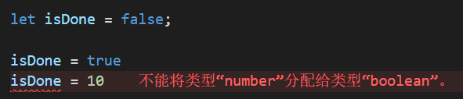
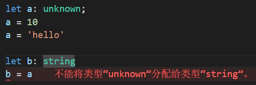

# TypeScript 基础

## 类型声明

类型声明是TS非常重要的一个特点

通过类型声明可以指定TS中变量（参数、形参）的类型，使得变量只能存储某种类型的数据

语法：

```ts
let 变量: 类型;
let 变量: 类型 = 值;

function fn(参数: 类型, 参数: 类型): 类型{
    ...
}
```

**自动类型判断：**

- 当对变量的声明和赋值是同时进行的，TS编译器会自动判断变量的类型
- 所有如果你的变量的声明和赋值是同时进行的，可以省略掉类型的声明


## 原始数据类型

JavaScript 的类型分为两种：原始数据类型（Primitive data types）和 对象类型（Object types）。

原始数据类型包括：布尔值、数值、字符串、`null`、`undefined` 以及 ES6 中的新类型 `Symbol` 和 ES10 中的新类型 `BigInt`。

### 布尔值

布尔值是最基础的数据类型，在 TypeScript 中，使用 `boolean` 定义布尔值类型：

```ts
let isDone: boolean = false;

// 如果变量的声明和赋值是同时进行的，TS可以自动对变量进行类型检测
let isDone = false;

isDone = true
isDone = 10		// Type 'number' is not assignable to type 'boolean'.
```



### 数值

### 字符串

### Null 和 Undefined

在 TypeScript 中，可以使用 `null` 和 `undefined` 来定义这两个原始数据类型：

```ts
let u: undefined = undefined;
let n: null = null;
```

与 `void` 的区别是，`undefined` 和 `null` 是所有类型的子类型。也就是说 `undefined` 类型的变量，可以赋值给 `number` 类型的变量：

```ts
// 这样不会报错
let num: number = undefined;
// 这样也不会报错
let u: undefined;
let num: number = u;
```

而 `void` 类型的变量不能赋值给 `number` 类型的变量：

```ts
let u: void;
let num: number = u;

// Type 'void' is not assignable to type 'number'.
```

## 新增数据类型

| 类型    | 描述                             | 例子              |
| ------- | -------------------------------- | ----------------- |
| 字面量  | 限制变量的值就只能为该字面量的值 | 其本身            |
| any     | 任意类型                         | *                 |
| unknown | 未知类型的值（类型安全的any）    | *                 |
| void    | 没有值（或undefined）            | 空值（undefined） |
| never   | 不能是任何值                     | 没有值            |
| tuple   | 元组，固定长度的数组             | [4, 5, 6]         |
| enum    | 枚举                             | enum{A, B}        |

### 任意值 (any)

`any`表示任意类型，一个变量设置类型为`any`后，相当于对该变量关闭了TS的类型检测。

声明变量时如果不指定类型，则TS解析器会自动判断变量的类型为`any`（隐式的any）。

```ts
let something;
something = 'seven';
something = 7;

something.setName('Tom');
```

等价于

```ts
let something: any;
something = 'seven';
something = 7;

something.setName('Tom');
```

### unknown

```ts
let a: unknown;
a = 10
a = 'hello'

let b: string
b = a		// Type 'unknown' is not assignable to type 'string'.
```

任意类型都可以赋值 unknown，但 unknown 不能复制给其他变量。



**解决方法：**

- 赋值前进行类型判断

```ts
let a: unknown;
a = 10
a = 'hello'

let b: string
if (typeof a === 'string') {
    b = a;
}
```

- 类型断言

```ts
let a: unknown;
a = 10
a = 'hello'

let b: string
b = a as string
```

### 空值 (void)

JavaScript 没有空值（Void）的概念，在 TypeScript 中，可以用 `void` 表示没有任何返回值的函数：

```ts
function alertName(): void {
    alert('My name is Tom');
}
```

声明一个 `void` 类型的变量没有什么用，因为你只能将它赋值为 `undefined` 和 `null`（只在 --strictNullChecks 未指定时）：

```ts
let unusable: void = undefined;
```


### 元组 (tuple)

数组合并了相同类型的对象，而元组（Tuple）合并了不同类型的对象，是固定长度的数组。

定义一对值分别为 `string` 和 `number` 的元组：

```ts
let person: [string, number] = ['chenglun17', 18];
```

但是当直接对元组类型的变量进行初始化或者赋值的时候，需要提供所有元组类型中指定的项：

```ts
let person: [string, number];
person = ['chenglun17', 18];

let person: [string, number];
person = ['chenglun17'];
// Property '1' is missing in type '[string]' but required in type '[string, number]'.
```

**越界的元素：**

当添加越界的元素时，它的类型会被限制为元组中每个类型的联合类型：

```ts
let person: [string, number];
person = ['Tom', 25];
person.push('male');	// [ 'Tom', 25, 'male' ]
person.push(true);
// Argument of type 'true' is not assignable to parameter of type 'string | number'.
```

### 枚举 (enum)

枚举（Enum）类型用于取值被限定在一定范围内的场景，比如一周只能有七天，颜色限定为红绿蓝等。

枚举使用 `enum` 关键字来定义：

```ts
enum Days {Sun, Mon, Tue, Wed, Thu, Fri, Sat};
```

枚举成员会被赋值为从 `0` 开始递增的数字，同时也会对枚举值到枚举名进行反向映射：

```ts
enum Days {Sun, Mon, Tue, Wed, Thu, Fri, Sat};

console.log(Days["Sun"] === 0); // true
console.log(Days["Mon"] === 1); // true
console.log(Days["Tue"] === 2); // true
console.log(Days["Sat"] === 6); // true

console.log(Days[0] === "Sun"); // true
console.log(Days[1] === "Mon"); // true
console.log(Days[2] === "Tue"); // true
console.log(Days[6] === "Sat"); // true
```

事实上，上面的例子会被编译为：

```js
var Days;
(function (Days) {
    Days[Days["Sun"] = 0] = "Sun";
    Days[Days["Mon"] = 1] = "Mon";
    Days[Days["Tue"] = 2] = "Tue";
    Days[Days["Wed"] = 3] = "Wed";
    Days[Days["Thu"] = 4] = "Thu";
    Days[Days["Fri"] = 5] = "Fri";
    Days[Days["Sat"] = 6] = "Sat";
})(Days || (Days = {}));
;
console.log(Days["Sun"] === 0); // true
console.log(Days["Mon"] === 1); // true
console.log(Days["Tue"] === 2); // true
console.log(Days["Sat"] === 6); // true
console.log(Days[0] === "Sun"); // true
console.log(Days[1] === "Mon"); // true
console.log(Days[2] === "Tue"); // true
console.log(Days[6] === "Sat"); // true
```


## 类型推论

如果没有明确的指定类型，那么 TypeScript 会依照类型推论（Type Inference）的规则推断出一个类型。

以下代码虽然没有指定类型，但是会在编译的时候报错：

```ts
let myFavoriteNumber = 'seven';
myFavoriteNumber = 7;

// index.ts(2,1): error TS2322: Type 'number' is not assignable to type 'string'.
```

事实上，它等价于：

```ts
let myFavoriteNumber: string = 'seven';
myFavoriteNumber = 7;

// index.ts(2,1): error TS2322: Type 'number' is not assignable to type 'string'.
```

TypeScript 会在没有明确的指定类型的时候推测出一个类型，这就是类型推论。

**如果定义的时候没有赋值，不管之后有没有赋值，都会被推断成 `any` 类型而完全不被类型检查**：

```ts
let myFavoriteNumber;
myFavoriteNumber = 'seven';
myFavoriteNumber = 7;
```


## 联合类型

联合类型（Union Types）表示取值可以为多种类型中的一种。

一个简单的例子：

```ts
let gender: 'male' | 'female';
gender = 'male';
gender = 'female';

let myFavoriteNumber: string | number;
myFavoriteNumber = true;

// index.ts(2,1): error TS2322: Type 'boolean' is not assignable to type 'string | number'.
// Type 'boolean' is not assignable to type 'number'.
```

联合类型使用 `|` 分隔每个类型。

这里的 `let myFavoriteNumber: string | number` 的含义是，允许 `myFavoriteNumber` 的类型是 `string` 或者 `number`，但是不能是其他类型。


## 类型断言

断言 assert 是仅在 Debug 版本起作用的宏，它用于检查 "不应该" 发生的情况。

类型断言（Type Assertion）可以用来手动指定一个值的类型，可以用来告诉TS解析器变量的实际类型。

语法：

```ts
值 as 类型

// 或
<类型>值
```

在 tsx 语法（React 的 jsx 语法的 ts 版）中必须使用前者，即 `值 as 类型`。

形如 `<Foo>` 的语法在 tsx 中表示的是一个 `ReactNode`，在 ts 中除了表示类型断言之外，也可能是表示一个[泛型](http://ts.xcatliu.com/advanced/generics.html)。

故建议大家在使用类型断言时，统一使用 `值 as 类型` 这样的语法。


## 类型别名

Type又叫类型别名（type alias），作用用来给一个类型起一个新名字。

我们使用 `type` 创建类型别名：

```ts
type num = number; // 基本类型
type stringOrNum = string | number; // 联合类型
type person = {name: string}; // 对象类型
type user = person & { age: number } // 交叉类型
type data = [string, number]; // 元组
type fun = () => void; // 函数类型
```

类型别名常用于联合类型。

### type 和 interface 的区别

相同点：

- 都可以用来描述一个对象或者函数
- 都可以进行拓展

不同点：

- 类型别名可以用于其它类型 （联合类型、元组类型、基本类型（原始值）），interface不支持
- interface 可以多次定义来合并声明，type 不支持
- type 能使用 in 关键字生成映射类型，但 interface 不行
- 默认导出方式不同
- 在type中可以使用泛型
- type可以使用typeof获取实例类型


[参考文章](https://blog.csdn.net/m0_46655912/article/details/122679038)


## 对象的类型--接口

### 什么是接口

在面向对象语言中，接口（Interfaces）是一个很重要的概念，它是对行为的抽象，而具体如何行动需要由类（classes）去实现（implement）。

TypeScript 中的接口是一个非常灵活的概念，除了可用于[对类的一部分行为进行抽象](http://ts.xcatliu.com/advanced/class-and-interfaces.html#类实现接口)以外，也常用于对「对象的形状（Shape）」进行描述。

### 可选属性

有时我们希望不要完全匹配一个形状，那么可以用可选属性，在属性名后加上`?`，表示属性是可选的：

```ts
interface Person {
    name: string,
    age?: number
}

let tom: Person = {
    name: 'Tom'
};
```

### 任意属性

有时候我们希望一个接口允许有任意的属性，可以使用如下方式：

```ts
interface Person {
    name: string,
    age?: number,
    [propName: string]: any
}

let tom: Person = {
    name: 'Tom',
    gender: 'male'
};
```

使用 `[propName: string]` 定义了任意属性取 `string` 类型的值。

需要注意的是，**一旦定义了任意属性，那么确定属性和可选属性的类型都必须是它的类型的子集**：


## 数组的类型

在 TypeScript 中，数组类型有多种定义方式，比较灵活。

### 「类型 + 方括号」表示法

最简单的方法是使用「类型 + 方括号」来表示数组：

```ts
let fibonacci: number[] = [1, 1, 2, 3, 5];
```

数组的项中**不允许**出现其他的类型：

```ts
let fibonacci: number[] = [1, '1', 2, 3, 5];

// Type 'string' is not assignable to type 'number'.
```

数组的一些方法的参数也会根据数组在定义时约定的类型进行限制：

```ts
let fibonacci: number[] = [1, 1, 2, 3, 5];
fibonacci.push('8');

// Argument of type '"8"' is not assignable to parameter of type 'number'.
```

上例中，`push` 方法只允许传入 `number` 类型的参数，但是却传了一个 `"8"` 类型的参数，所以报错了。这里 `"8"` 是一个字符串字面量类型。

### 数组泛型

我们也可以使用数组泛型（Array Generic） `Array<elemType>` 来表示数组：

```ts
let fibonacci: Array<number> = [1, 1, 2, 3, 5];
```

关于泛型，可以参考泛型一章。


## 函数的类型

在 JavaScript 中，有两种常见的定义函数的方式——函数声明（Function Declaration）和 函数表达式（Function Expression）：

```js
// 函数声明（Function Declaration）
function sum(x, y) {
    return x + y;
}

// 函数表达式（Function Expression）
let mySum = function (x, y) {
    return x + y;
};
```

### 函数声明

在 TypeScript 中，需要对一个函数的输入和输出进行约束，其中函数声明的类型定义较简单：

```ts
function sum(x: number, y: number): number {
    return x + y;
}
```

注意，**输入多余的（或者少于要求的）参数，是不被允许的**：

```ts
function sum(x: number, y: number): number {
    return x + y;
}
sum(1, 2, 3);
// index.ts(4,1): error TS2346: Supplied parameters do not match any signature of call target.

function sum(x: number, y: number): number {
    return x + y;
}
sum(1);
// index.ts(4,1): error TS2346: Supplied parameters do not match any signature of call target.
```

### 函数表达式

如果要我们现在写一个对函数表达式（Function Expression）的定义，可能会写成这样：

```ts
let mySum = function (x: number, y: number): number {
    return x + y;
};
```

这是可以通过编译的，不过事实上，上面的代码只对等号右侧的匿名函数进行了类型定义，而等号左边的 `mySum`，是通过赋值操作进行**类型推论**而推断出来的。

如果需要我们手动给 `mySum` 添加类型，则应该是这样：

```ts
// 语法: (形参: 类型, 形参: 类型 ...) => 返回值

let mySum: (x: number, y: number) => number = function (x: number, y: number): number {
    return x + y;
};
```

注意不要混淆了 TypeScript 中的 `=>` 和 ES6 中的 `=>`。

- 在 TypeScript 的类型定义中，`=>` 用来表示函数的定义，左边是输入类型，需要用括号括起来，右边是输出类型。

- 在 ES6 中，`=>` 叫做箭头函数，应用十分广泛，可以参考 [ES6 中的箭头函数](http://es6.ruanyifeng.com/#docs/function#箭头函数)。