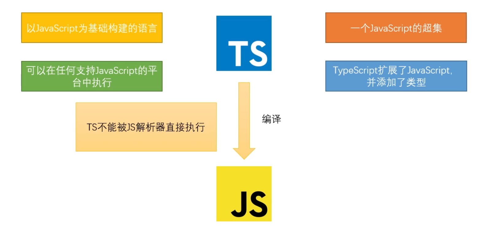

# TypeScript 简介

## 什么是 TypeScript

> Typed JavaScript at Any Scale.
>
> 添加了类型系统的 JavaScript，适用于任何规模的项目。

以上描述是官网对于 TypeScript 的定义。

它强调了 TypeScript 的两个最重要的特性——类型系统、适用于任何规模。



## TypeScript 的特性

### 类型系统

从 TypeScript 的名字就可以看出来，「类型」是其最核心的特性。

我们知道，JavaScript 是一门非常灵活的编程语言：

- 它没有类型约束，一个变量可能初始化时是字符串，过一会儿又被赋值为数字。
- 由于隐式类型转换的存在，有的变量的类型很难在运行前就确定。
- 基于原型的面向对象编程，使得原型上的属性或方法可以在运行时被修改。
- 函数是 JavaScript 中的一等公民，可以赋值给变量，也可以当作参数或返回值。

而 TypeScript 的类型系统，在很大程度上弥补了 JavaScript 的缺点。

## 安装 TypeScript

TypeScript 的命令行工具安装方法如下：

```bash
npm install -g typescript
```

以上命令会在全局环境下安装 `tsc` 命令，安装完成之后，我们就可以在任何地方执行 `tsc` 命令了。

编译一个 TypeScript 文件很简单：

```bash
tsc hello.ts
```

我们约定使用 TypeScript 编写的文件以 `.ts` 为后缀，用 TypeScript 编写 React 时，以 `.tsx` 为后缀。

## Hello TypeScript

创建`hello.ts`文件，编写如下代码：

```typescript
function sayHello(msg: string) {
    return 'Hello ' + msg;
}

let msg = 'TypeScript';
console.log(sayHello(msg));
```

然后执行

```bash
tsc hello.ts

# 或自动编译
tsc hello.ts -w
```

这时候会生成一个编译好的文件 `hello.js`：

```javascript
function sayHello(msg) {
    return 'Hello ' + msg;
}
var msg = 'TypeScript';
console.log(sayHello(msg));
```

在 TypeScript 中，我们使用 `:` 指定变量的类型，`:` 的前后有没有空格都可以。

上述例子中，我们用 `:` 指定 `msg` 参数类型为 `string`。但是编译为 js 之后，并没有什么检查的代码被插入进来。

这是因为 **TypeScript 只会在编译时对类型进行静态检查，如果发现有错误，编译的时候就会报错**。而在运行时，与普通的 JavaScript 文件一样，不会对类型进行检查。

