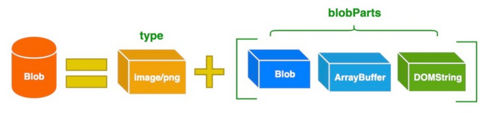

# Blob

## 1.基本概念

**[Blob](https://developer.mozilla.org/zh-CN/docs/Web/API/Blob)（Binary Large Object）**表示**二进制类型的大对象**。在 JavaScript 中 Blob 对象表示一个不可变、原始数据的<strong style="color:#DD5145">类文件对象</strong>。

在数据库管理系统中，将二进制数据存储为一个单一个体的集合。Blob 通常是影像、声音或多媒体文件。

Blob 表示的不一定是 JavaScript 原生格式的数据

## 2.Blob API

`Blob` 由一个可选的字符串 `type`（通常是 MIME 类型）和 `blobParts` 组成：



> MIME（Multipurpose Internet Mail Extensions）**多用途互联网邮件扩展类型**，是设定某种扩展名的文件用一种应用程序来打开的方式类型，当该扩展名文件被访问的时候，浏览器会自动使用指定应用程序来打开。多用于指定一些客户端自定义的文件名，以及一些媒体文件打开方式。

### 构造函数

```js
var aBlob = new Blob(array, options)
```

- **array** 是一个由`ArrayBuffer`, `ArrayBufferView`, `Blob`, `DOMString` 等对象构成的 `Array` ，或者其他类似对象的混合体，它将会被放进 `Blob`。DOMStrings 会被编码为 UTF-8。

- **options**：一个可选的对象，包含以下两个属性：

  - type —— 默认值为 " "，它代表了将会被放入到 blob 中的数组内容的 MIME 类型。

  - endings —— 默认值为 "transparent"，用于指定包含行结束符 \n 的字符串如何被写入。 

    它是以下两个值中的一个： "native"，代表行结束符会被更改为适合宿主操作系统文件系统的换行符，或者 "transparent"，代表会保持 blob 中保存的结束符不变。

### 实例属性

- **size**（只读）：表示 `Blob` 对象中所包含数据的大小（以字节为单位）。
- **type**（只读）：一个字符串，表明该 `Blob` 对象所包含数据的 MIME 类型。如果类型未知，则该值为空字符串。

### 实例方法

- **`slice([start[, end[, contentType]]])`**：返回一个新的 Blob 对象，包含了源 Blob 对象中指定范围内的数据。

- **`stream()`**：返回一个能读取 Blob 内容的 `ReadableStream`。Stream API 中的 `ReadableStream` 接口表示可读的字节数据流

- **`text()`**：返回一个 Promise 对象且包含 Blob 所有内容的 UTF-8 格式的 `USVString`。

- **`arrayBuffer()`**：返回一个 Promise 对象且包含 blob 所有内容的二进制格式的 `ArrayBuffer`。

<strong style="color:#DD5145">Blob 对象是不可改变的</strong>。我们不能直接在一个 Blob 中更改数据，但是我们可以对一个 Blob 进行分割，从其中创建新的 Blob 对象，将它们混合到一个新的 Blob 中。这种行为类似于 JavaScript 字符串：我们无法更改字符串中的字符，但可以创建新的更正后的字符串。


## 3.Blob 使用场景

### 1.分片上传

<strong style="color:#DD5145">File 对象是特殊类型的 Blob（file对象是blob的子类）</strong>，且可以用在任意的 Blob 类型的上下文中。所以针对大文件传输的场景，我们可以使用 slice 方法对大文件进行切割，然后分片进行上传

```js
const file = new File(["a".repeat(1000000)], "test.txt")

const chunkSize = 40000
const url = "https://httpbin.org/post"

async function chunkedUpload() {
    for (let start = 0; start < file.size; start += chunkSize) {
        const chunk = file.slice(start, start + chunkSize + 1)
        const fd = new FormData()
        fd.append("data", chunk)

        await fetch(url, { method: "post", body: fd }).then((res) =>
            res.text()
        )
    }
}
```


### 2.从互联网下载数据

可以使用以下方法从互联网上下载数据并将数据存储到 Blob 对象中

### 3.Blob 用作 URL

### 4.Blob 转换为 Base64

**`URL.createObjectURL`** 的一个替代方法是，将 `Blob` 转换为 base64 编码的字符串。


### 5.图片压缩

在一些场合中，我们希望在上传本地图片时，先对图片进行一定的压缩，然后再提交到服务器，从而减少传输的数据量。在前端要实现图片压缩，我们可以利用 Canvas 对象提供的 `toDataURL()` 方法，该方法接收 `type` 和 `encoderOptions` 两个可选参数。

> - `type` 表示图片格式，默认为 `image/png`。
> - `encoderOptions` 用于表示图片的质量，在指定图片格式为 `image/jpeg` 或 `image/webp` 的情况下，可以从 0 到 1 的区间内选择图片的质量。如果超出取值范围，将会使用默认值 `0.92`，其他参数会被忽略。

### 6.生成 PDF 文档

PDF（便携式文件格式，Portable Document Format）是由 Adobe Systems 在 1993 年用于文件交换所发展出的文件格式。

在浏览器端，利用一些现成的开源库，比如 jsPDF，我们也可以方便地生成 PDF 文档。


## 4.Blob 与 ArrayBuffer 的区别

> **Blob** 类型的对象表示不可变的类似文件对象的原始数据。Blob 表示的不一定是 JavaScript 原生格式的数据。
>
> File 接口基于 Blob，继承了Blob 功能并将其扩展为支持用户系统上的文件。

> **ArrayBuffer** 类型的对象用于表示通用的，固定长度的原始二进制数据缓冲区。
>
> 你不能直接操纵 ArrayBuffer 的内容，而是需要创建一个类型化数组对象或 DataView 对象，该对象以特定格式表示缓冲区，并使用该对象读取和写入缓冲区的内容。

## 参考

[参考文章](https://blog.csdn.net/yaojiqic/article/details/125090825)、[你不知道的 Blob](https://segmentfault.com/a/1190000022812794)