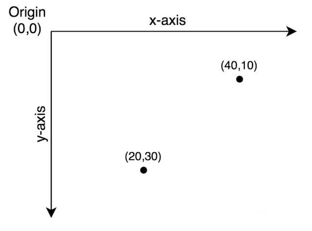
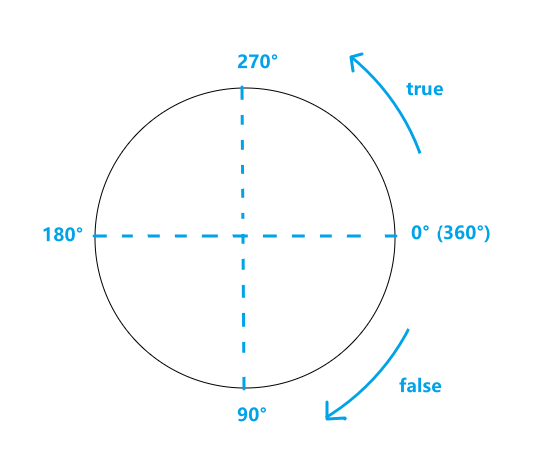
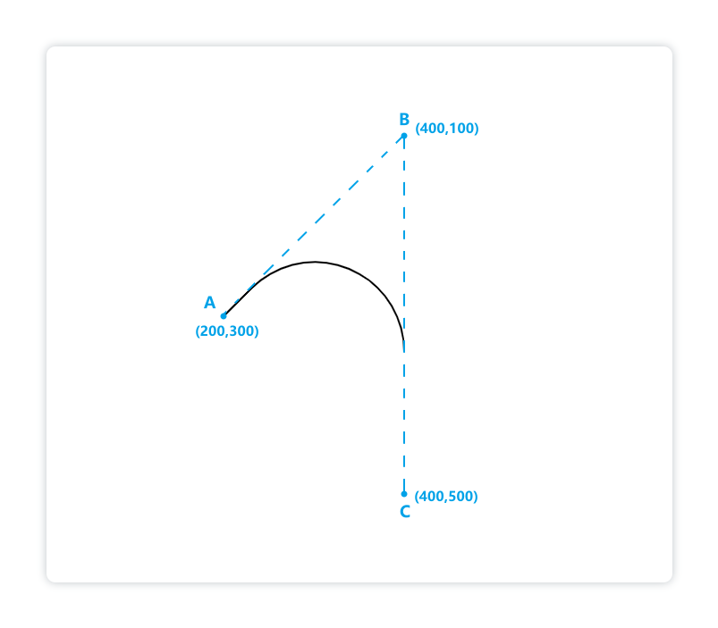
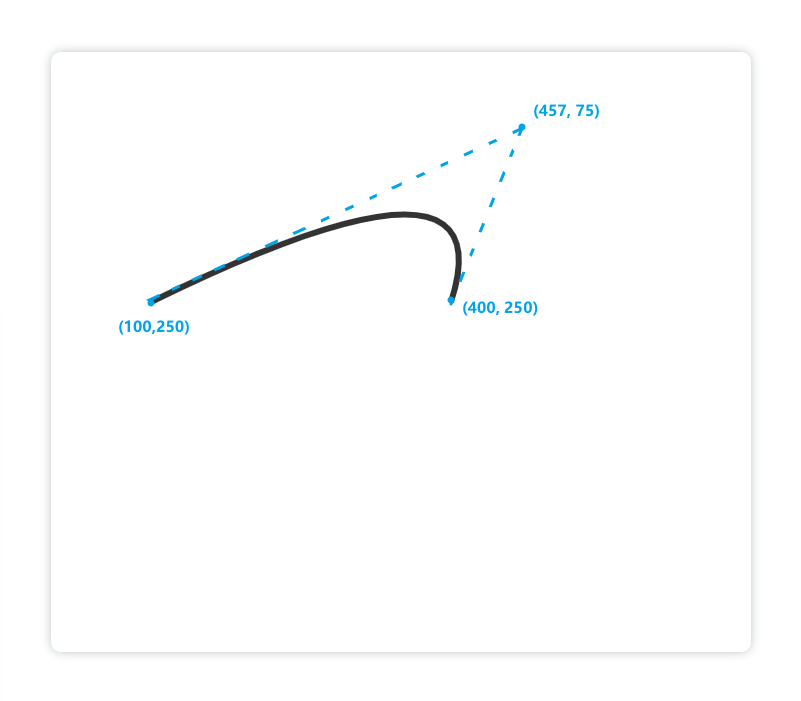

# Canvas

MDN文档：https://developer.mozilla.org/zh-CN/docs/Web/API/Canvas_API

[参考文章](https://blog.csdn.net/nvgis/article/details/127316552)、[参考文章2](https://blog.csdn.net/u012468376/article/details/73350998)


## 1.什么是 Canvas

简单来说，`<canvas>` 是 HTML5 中的标签，它是一个容器，可以使用JS在其中绘制图形或文字。

canvas 标签是一张画布

## 2.Canvas API

**Canvas API** 提供了一个通过 JavaScript 和 HTML 的`canvas`元素来绘制图形的方式。它可以用于动画、游戏画面、数据可视化、图片编辑以及实时视频处理等方面。

Canvas API 主要聚焦于 2D 图形。而同样使用`<canvas>`元素的 WebGL API 则用于绘制硬件加速的 2D 和 3D 图形。

### HTMLCanvasElement

**`HTMLCanvasElement`**接口提供用于操纵`<canvas>`元素的布局和表示的属性和方法。

**`HTMLCanvasElement`**接口还继承了`HTMLElement`接口的属性和方法。

#### getContext()

该方法返回`canvas` 的上下文，如果上下文没有定义则返回 `null` 。

在同一个 canvas 上以相同的 `contextType` 多次调用此方法只会返回同一个上下文。

#### toDataURL()

该方法返回一个包含图片展示的 data URL 。

```js
canvas.toDataURL(type, encoderOptions)
```

> - `type`：可选，图片格式，默认为 `image/png`
> - `encoderOptions`：可选，在指定图片格式为 `image/jpeg` 或 `image/webp` 的情况下，可以从 0 到 1 的区间内选择图片的质量。如果超出取值范围，将会使用默认值 `0.92`。其他参数会被忽略。

可以使用 `type` 参数其类型，默认为 PNG 格式。图片的分辨率为 96dpi。

**Data URL**：

**Data URL**，即 <strong style="color:#DD5145">前缀为 `data:` 协议的 URL</strong>，其允许内容创建者向文档中嵌入小文件。

Data URL 由四个部分组成：<strong style="color:#DD5145">前缀(`data:`)、指示数据类型的 MIME 类型、如果非文本则为可选的`base64`标记、数据本身</strong>：

```js
data:[<mediatype>][;base64],<data>
```

> mediatype` 是个 [MIME 类型](https://developer.mozilla.org/zh-CN/docs/Web/HTTP/Basics_of_HTTP/MIME_types)的字符串` 
>
> 例如`'image/jpeg'` 表示 JPEG 图像文件。如果被省略，则默认值为 `text/plain;charset=US-ASCII

MDN文档：https://developer.mozilla.org/zh-CN/docs/Web/HTTP/Basics_of_HTTP/Data_URLs

#### toBlob()

该方法创造 `Blob` 对象，用以展示 canvas 上的图片。这个图片文件可以被缓存或保存到本地（由用户代理自行决定）。

```js
canvas.toBlob(callback, type, quality)
```


## 3.Canvas 基本使用

### \<canvas>元素

```html
<canvas id="tutorial" width="300" height="300"></canvas>
```

> `<canvas>` 只有两个可选的属性`width、heigth`属性，默认`width`为300、`height`为150,单位都是`px`。
>
> 设置画布的宽高只能在 html 标签里通过 height 和 width 属性来设置(canvas标签有且只有这两个属性)

**结束标签`</canvas>`不可省**

`<canvas>`元素**需要**结束标签(`</canvas>`)。如果结束标签不存在，则文档的其余部分会被认为是替代内容，将不会显示出来。

### 渲染上下文

渲染上下文(Thre Rending Context)

```js
const canvas = document.getElementById('tutorial');
// 获得 2D 上下文对象
const ctx = canvas.getContext('2d');
```

### 坐标系

`Canvas` 使用的是 **W3C 坐标系** ，也就是遵循我们屏幕、报纸的阅读习惯，从上往下，从左往右。



### 浏览器是否支持

那么在 canvas 标签中的文字就派上用场了，浏览器上会显示出你 canvas 标签里的文字

```html
<canvas>你的浏览器不支持canvas，快去升级浏览器吧！</canvas>
```

或

```js
function draw(){
    let canvas = document.getElementById('tutorial');
    if(!canvas.getContext) return;
    let ctx = canvas.getContext("2d");
    //开始代码
}
```


## 4.绘制基础图形

### 绘制线段

- <strong style="color:orange">`moveTo(x,y)`</strong>：定义画线的起始点
- <strong style="color:orange">`lineTo(x,y)`</strong>：定义画线的折点
- <strong style="color:orange">`stroke()`</strong>：通过线条来绘制图形轮廓

```html
<style>
    #canvas {
        position: absolute;
        top: 0;
        bottom: 0;
        left: 0;
        right: 0;
        margin: auto;
        box-shadow: 0 0 8px 0 rgba(0, 0, 0, 0.3);
        border-radius: 5px;
    }
</style>
<canvas id="canvas" height="300" width="300"></canvas>
<script>
    const canvas = document.getElementById('canvas')
    const ctx = canvas.getContext('2d')
    ctx.moveTo(100, 100) // 起点为(100，100)
    ctx.lineTo(200, 100)
    ctx.stroke()
</script>
```

### 给线段设置样式

- <strong style="color:orange">`strokeStyle = '颜色'`</strong>：设置图形轮廓的颜色（设置线的颜色）
- <strong style="color:orange">`lineWidth = 数字`</strong>：设置线的宽度
- <strong style="color:orange">`lineCap = 'round/butt/square'`</strong>：设置线帽为圆型/默认/方形
- <strong style="color:orange">`lineJoin = 'miter/round/bevel'`</strong>：设置线段连接处为默认/圆形/平直形式
- <strong style="color:orange">`globalAlpha = 数字`</strong>：设置图案的透明度

> 样式的设置必须写在绘制图形轮廓`stroke()`方法**之前**！否则会不生效

如果我们想分别设置每条线的样式，就需要用到下面两个方法（否则第二条线的颜色“覆盖”了第一条线的颜色）：

- <strong style="color:orange">`beginPath()`</strong>：开启一条新路径，生成之后，图形绘制命令会被指向到新路径上
- <strong style="color:orange">`closePath()`</strong>：关闭上一条路径的绘制

```html
<canvas id="canvas" height="300" width="300"></canvas>
<script>
    const canvas = document.getElementById('canvas')
    const ctx = canvas.getContext('2d')
    // 绘制第一条线：
    ctx.beginPath()
    ctx.moveTo(100, 100)
    ctx.lineTo(200, 100)
    ctx.strokeStyle = 'skyblue' // 设置为天蓝色
    ctx.lineWidth = 20
    ctx.lineCap = 'round'
    ctx.stroke()
    ctx.closePath()
    // 绘制第二条线：
    ctx.beginPath()
    ctx.moveTo(100, 200)
    ctx.lineTo(200, 200)
    ctx.strokeStyle = 'red'
    ctx.lineWidth = 20
    ctx.lineCap = 'round'
    ctx.stroke()
    ctx.closePath()
</script>
```

### 绘制三角形

画三角形其实也是用画线段的思路，只需要注意首尾点连接起来即可：

```html
<canvas id="canvas" height="600" width="700"></canvas>
<script>
    const canvas = document.getElementById('canvas')
    const ctx = canvas.getContext('2d')
    ctx.beginPath()
    ctx.moveTo(200, 200) 
    ctx.lineTo(500, 200)
    ctx.lineTo(500, 500)
    ctx.lineTo(200, 200) // 第四个点要和第一个点的坐标一致才能画出三角形
    ctx.strokeStyle = 'skyblue'
    ctx.lineWidth = 20
    ctx.stroke()
    ctx.closePath() // 它会把线段的终点和起点连接起来，这样看上去就更更衔接了（线段宽度很大的时候很明显）
</script>
```


### 绘制矩形

#### 空心矩形

- **方法一**：直接使用线段绘制矩形

- **方法二**：直接使用`ctx`身上的<strong style="color:orange">`strokeRect()`</strong>方法

```js
strokeRect(x, y, width, height)
// x, y 表示起点坐标，width 表示矩形宽，height 表示矩形高
```

- **方法三**：把`strokeRect()`方法拆成了<strong style="color:orange">`stroke()`</strong>和<strong style="color:orange">`rect()`</strong>方法，好处就是使用`rect()`暂时生成了矩形，但是必须调用`stroke()`方法才会绘制出来

例如，可以使用下面的方式延迟两秒钟再绘制矩形：

```html
<canvas id="canvas" height="600" width="700"></canvas>
<script>
    const canvas = document.getElementById('canvas')
    const ctx = canvas.getContext('2d')
    ctx.rect(200, 150, 300, 300)
    setTimeout(() => {
        ctx.stroke()
    }, 2000)
</script>
```

#### 填充矩形

- **方法一**：直接使用`ctx`身上的<strong style="color:orange">`fillRect()`</strong>方法以及<strong style="color:orange">`fillStyle`</strong>属性

```js
fillStyle = '颜色' // 填充颜色一定要写在生成矩形（fillRect()）之前，否则颜色不生效

fillRect(x, y, width, height)
```

> - x, y 表示起点坐标
> - width 表示矩形宽，height 表示矩形高

- **方法二**：这种方法和绘制空心矩形的第三种方法很像，只需要用<strong style="color:orange">`fill()`</strong>方法替代`stroke()`方法即可

```html
<canvas id="canvas" height="600" width="700"></canvas>
<script>
    const canvas = document.getElementById('canvas')
    const ctx = canvas.getContext('2d')
    ctx.rect(200, 150, 300, 300) // 先用rect()方法生成矩形
    setTimeout(() => {
        ctx.fill() // 再用fill()方法绘制填充矩形
    }, 2000)
</script>
```

> 这里使用的`fill()`方法和`stroke()`方法都是用来绘制出来形状，只不过前者是填充绘制，后者是用线轮廓。

### 绘制圆弧

#### 方法一

使用<strong style="color:orange">`arc()`</strong>方法生成圆，再使用`stroke()`方法绘制圆。

```js
arc(x, y, radius, startAngle, endAngle, anticlockwise)
```

> - 以`(x, y)`为圆心，以`r`为半径，从 `startAngle`弧度开始到`endAngle`弧度结束
> - `anticlosewise`是布尔值，`true`表示逆时针，`false`表示顺时针。(默认是顺时针)



注意：

> - 这里的度数都是弧度
> - `0`弧度是指的`x`轴正方形

```js
radians=(Math.PI/180)*degrees   // 角度转换成弧度
// (Math.PI) / 180 = 1°
```

#### 方法二

使用<strong style="color:orange">`arcTo()`</strong>方法来绘制圆弧，它接收四个参数，在它前边会有一个开始点坐标，一般由<strong style="color:orange">`moveTo()`</strong>或<strong style="color:orange">`lineTo()`</strong>方法提供。

```js
acrTo(cx, cy, x2, y2, radius)
```

> - cx，cy 表示两切线交点位置
> - x2，y2 表示结束点坐标
> - radius 表示半径

```html
<canvas id="canvas" height="600" width="700"></canvas>
<script>
    const cnv = document.getElementById('canvas')
    const ctx = cnv.getContext('2d')
    ctx.moveTo(200, 300) // 定义线段的起点
    ctx.arcTo(400, 100, 400, 500, 100) // 切线交点坐标为(400,100)，结束点为(400,500)
    ctx.lineWidth = 2
    ctx.stroke()
</script>
```



### 绘制椭圆

使用<strong style="color:orange">`ellipse()`</strong>方法来绘制椭圆

```js
ellipse(x, y, radiusX, radiusY, rotation, startAngle, endAngle, anticlockwise)
```

> - x，y 表示圆心坐标，radiusX，radiusY 分别表示x轴、y轴半径
> - rotation 表示椭圆旋转角度
> - rotation，startAngle 分别表示开始、结束绘制点
> - anticlockwise 表示绘制方向，逆时针为 true，顺时针为 false（默认为 false）

## 5.绘制贝塞尔曲线

贝塞尔曲线(Bézier curve)，又称贝兹曲线或贝济埃曲线，是应用于二维图形应用程序的数学曲线。

一般的矢量图形软件通过它来精确画出曲线，贝兹曲线由线段与节点组成，节点是可拖动的支点，线段像可伸缩的皮筋，我们在绘图工具上看到的钢笔工具就是来做这种矢量曲线的。

在线调试二次贝塞尔曲线的小工具：http://blogs.sitepointstatic.com/examples/tech/canvas-curves/quadratic-curve.html

### 一次贝塞尔曲线 (线性贝塞尔曲线)

 一次贝塞尔曲线其实是一条直线。


### 二次贝塞尔曲线


使用<strong style="color:orange">`quadraticCurveTo()`</strong>方法来绘制二次贝塞尔曲线：

```js
quadraticCurveTo(cp1x, cp1y, x, y)
```

> - cp1x，cp1y 表示控制点坐标
> - x，y 表示结束点坐标

同`arcTo()`方法一样，在它前边也会有一个开始点坐标，一般由`moveTo()`或`lineTo()`方法提供，例如：

```html
<canvas id="canvas" height="600" width="700"></canvas>
<script>
    canvas = document.getElementById("canvas");
    ctx = canvas.getContext("2d")
    ctx.lineWidth = 6;
    ctx.strokeStyle = "#333";
    ctx.beginPath();
    ctx.moveTo(100, 250);
    ctx.quadraticCurveTo(457, 75, 400, 250);
    ctx.stroke();
</script>
```



## 6.绘制文本

**绘制文本**：

使用<strong style="color:orange">`strokeText()`</strong>方法接收四个参数绘制**描边文本**：

```js
strokeText(text, x, y, maxWidth)
```

> - text：需要绘制的文字
> - x，y：文本左下角起始坐标
> - maxWidth：文本的最大宽度

和`strokeText()`方法类似，使用<strong style="color:orange">`fillStroke()`</strong>方法绘制填充文本：

```js
fillText(text, x, y, maxWidth)
```

**设置文本样式**：

> - `.font`设置文本大小和字体。
>
> - `.textAlign`：设置文本的对齐方式，可选`left`/`right`/`center`/`start`/`end`，
>
>   对齐方式是以文本对`strokeText()`方法中坐标参数为参考的水平方向对齐方式。
>
> - `.textBaseline`：决定了文本在垂直方向的对齐方式，可选`alphabetic`/`top`/`hanging`/`middle`/`ideographic`/`bottom`。
>
> - `.direction`：设置文本的绘制方向，可选`ltr`(left to right)和`rtl`(right to left)。

**获取文本宽度**：

可以使用<strong style="color:orange">`measureText()`</strong>方法测量文本的宽度

```js
measureText(text)
```

> 文本长度的测量结果**只**和文本的`font`参数相关。

## 7.设置样式和颜色

### 渐变色

#### 1. 线性渐变

使用`createLinearGradient()`来创建线性渐变色：

```js
createLinearGradient(x1, ,y1, x2, y2)
```

> - x1，y1 表示渐变色起点坐标
> - x2，y2 表示终点坐标

使用`addColorStop()`添加渐变色

```js
addColorStop(offset, color)
```

> - offset 表示偏移值
> - color 表示渐变色

例如

```html
<canvas id="canvas" height="600" width="700"></canvas>
<script>
    // 获取 canvas 元素
    var canvas = document.getElementById('canvas');
    var ctx = canvas.getContext('2d');
    // 创建渐变
    var gradient = ctx.createLinearGradient(0, 0, 700, 0);
    gradient.addColorStop(0, "skyblue"); // 第一个偏移值为0
    gradient.addColorStop(1, "#fffc96"); // 第一个偏移值为1
    ctx.beginPath()
    ctx.fillStyle = gradient
    ctx.fillRect(0, 0, 700, 600)
    ctx.fill()
</script>
```

#### 2. 径向渐变

同线性渐变的唯一区别就是，径向渐变是通过`createRadialGradient()`方法来创建渐变色：

```js
createRadialGradient(x0, y0, r0, x1, y1, r1)
```

> - x0，y0 表示开始圆的圆心坐标
> - r0 表示开始圆的半径
> - x1，x2 表示结束圆的圆心坐标
> - r1 表示结束圆的半径

### 添加指定元素

使用`createPattern()`方法接收两个参数来添加指定元素：

```js
createPattern(pattern, type)
```

> - pattern 表示要添加的元素，可以是图片，视频，canvas对象
> - type 表示绘制类型，可选 repeat / no-repeat / repeat-x(沿x轴平铺) / repeat-y(沿y轴平铺)

### 阴影样式

文本和图形都可以设置阴影样式，且方法一样：

- `shadowOffsetX = 数字`：设置阴影在X轴上的延申距离，正值表示阴影向x轴正方向延申，负值表示阴影向x轴负方向延申
- `shadowOffsetY = 数字`：设置阴影在Y轴上的延申距离，正值表示阴影向y轴正方向延申，负值表示阴影向y轴负方向延申
- `shadowBlur = 数字`：设定阴影的模糊度，默认为0
- `shadowColor = '颜色'`：设置阴影的颜色，默认是全透明色

### 透明度

`Transparency(透明度)`，globalAlpha = transparencyValue

这个属性影响到 canvas 里所有图形的透明度，有效的值范围是 0.0 （完全透明）到 1.0（完全不透明），默认是 1.0。

`globalAlpha` 属性在需要绘制大量拥有相同透明度的图形时候相当高效。不过，使用`rgba()`设置透明度更加好一些。

## 8.绘制图片

使用<strong style="color:orange">`drawImage()`</strong>方法绘制图形，该方法可以接收3-9个参数进行拉伸、裁剪等。

例如，基础的绘制图片接收3个参数即可：

```js
drawImage(img, x, y)
```

> - img 表示需要绘制的图片
> - x，y 表示图片放在画布的位置（左上角）

```html
<canvas id="canvas" height="600" width="700"></canvas>
<script>
    var canvas = document.getElementById('canvas');
    var ctx = canvas.getContext('2d');
    // 创建一个图片对象：
    var img = new Image();
    img.src = 'http://panpan.dapanna.cn//image-20221009113426344.png';
    // 图片加载完成之后绘制图片：
    img.onload = function () {
        ctx.drawImage(img, 0, 0); // 在(0,0)处绘制原图
    }
</script>
```

> 绘制的图片都是用js生成的image对象，我们也可以使用现有的DOM对象来绘制

如果要**拉伸**图片到指定宽和高，要在`drawImage()`方法上多加两个参数：

```js
drawImage(img, x, y, width, height)
```

> - img 表示需要绘制的图片
> - x，y 表示图片放在画布的位置（左上角）
> - width，height 表示拉伸的宽度、高度

`drawImage()`方法再加4个参数可以绘制拉伸和裁剪之后的图片：

```js
drawImage(img, sx, sy, sWidth, sHeight, dx, dy, dWidth, dHeight)
```

> - img 表示需要绘制的图片
> - sx，sy 表示开始裁剪的图片位置
> - sWidth，sHeight 表示要裁剪图片的宽度、高度
> - dx，dy 表示图片左上角绘制的起始坐标
> - dWidth，dHeight 表示拉伸的宽度、高度

## 9.使用场景

### Canvas 实现 HTML 页面转为图片

**前端生成 PDF 的方法主要有两种**：

- 一种是使用 HTML 转 PDF 库，例如 jsPDF、pdfmake 等
- 另一种是使用 canvas 将 HTML 页面转换成图片，然后将图片转换为 PDF 格式。


### Canvas 实现图片压缩上传

[参考文章](https://blog.csdn.net/weixin_42159569/article/details/107003913)、[参考文章2](https://blog.csdn.net/Andrew83/article/details/88715222)

#### 1. 图片裁剪

大体的思路是将图片抽样显示在canvas上，然后用通过`canvas.toDataURL`方法得到 base64 字符串来实现压缩。

1、首先需要一个文件域

```html
<div>
    <input type="file" accept="image/*" id="image">
</div>
<p>压缩后的图片</p>
<div id="compress"></div>
<p>选择的原图片</p>
<div id="proper"></div>
```

2、定义全局需要的变量

```js
var active = function(){
    this.image = document.getElementById('image')
    this.imgOrientation = null; // 设备方向
    this.options={
        field:'file',// 上传文件的字段
        data:{'key': 'value'}, // 上传接口需要的附加参数
        headers: {}, // 上传接口的请求头信息
        width: 0, // 压缩后的图片宽度 当为0时会用原图片的宽度
        quality: 0.6, // 压缩后图片的质量与原图的比例
    }
}
```

3、选择图片后读取图片信息

```js
// 拿到选择的图片
preview: function(){
    var _this = this;
    this.image.addEventListener('change',function(val){
        if(!val.currentTarget.files.length) return;
        // 单张上传，若需要多张上传此处需要做遍历
        _this.createRender(val.currentTarget.files[0])
    })
},
    // 拿到图片后，读取文件并获取图片拍摄方向
    createRender: function(file){
        var _this = this;
        var URL=window.URL || window.webkitURL,
            blob = URL.createObjectURL(file);
        if(window.FileReader){
            var reader = new FileReader();
            reader.readAsDataURL(file);  
            reader.onload = function(){
                var imgFalse = document.createElement('img');
                // imgFalse.setAttribute('style','display:none;');
                imgFalse.setAttribute('src',this.result);
                document.getElementById('proper').appendChild(imgFalse); 
                imgFalse.onload=function(){
                    _this.imgOrientation=_this.getPhotoOrientation(imgFalse);
                    _this.compress(blob , file);
                }
            }
        }
    },
```

