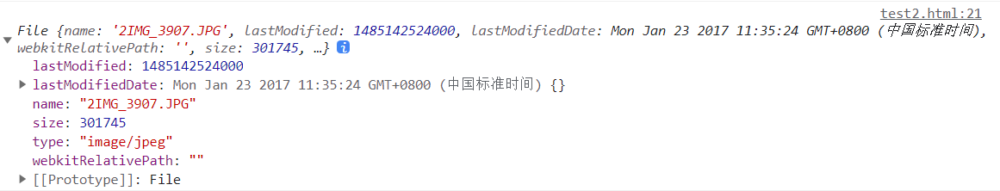

# FileReader

## :star:基本概念

FileReader 是 HTML5 新增的一种<strong style="color:#DD5145">异步文件读取机制</strong>，结合 **`input:file`** 可以很方便的读取本地文件。

FileReader 对象允许 Web 应用程序异步读取存储在用户计算机上的文件（或原始数据缓冲区）的内容，使用 `File` 或 `Blob` 对象指定要读取的文件或数据。

FileReader 仅用于以安全的方式从用户（远程）系统读取文件内容 它不能用于从文件系统中按路径名简单地读取文件。要在 JavaScript 中按路径名读取文件，应使用标准 Ajax 解决方案进行服务器端文件读取，如果读取跨域，则使用 CORS 权限。

> **备注：** 此特性在 Web Worker 中可用

## 拓展 -- input 的 file 类型

```html
<input type="file" id="file">
```

`input`标签设置`type = 'file'`会渲染为一个按钮和一段文字。点击按钮可打开文件选择窗口，文字表示对文件的描述（大部分情况下为文件名）


**accept 属性：**

该属性表明了服务器端可接受的文件类型，可以限制你手机选择相关的文件，如果限制多个，可以用逗号分割。

accept 属性接受一个逗号分隔的 MIME 类型字符串, 如:

- **accept=“image/png” 或 accept=".png"** — 只接受 png 图片.
- **accept=“image/png, image/jpeg” 或 accept=".png, .jpg, .jpeg"** — PNG/JPEG 文件.
- **accept=“image/\*”** — 接受任何图片文件类型.
- **accept=“audio/\*”** — 接受任何音频文件类型.
- **accept=“video/\*”** — 接受任何音频视频文件类型.
- **accept=".doc,.docx,.xml,application/msword,application/vnd.openxmlformats-officedocument.wordprocessingml.document"** — 接受任何 MS Doc 文件类型
- `accept='*'` — 接受全部文件类型.


**multiple 属性：**

multiple属性代表是否可以选择多个文件，多个文件时其value值为第一个文件的虚拟路径。

```html
<input id="fileId2" type="file" multiple="multiple" name="file" />
```

**事件监听：**

在 change 事件监听的函数内，file 类型的 input 会有 <strong style="color:#DD5145">files</strong> 属性，event.target.files 就是保存着文件的相关信息。

```js
document.querySelector('#file').addEventListener('change', (event) => {
    console.log(event.target.files[0])    
})
```



webkitRelativePath：此处为空；当在 input 上加上 webkitdirectory 属性时，用户可选择文件夹，此时 webkitRelativePath 表示文件夹中文件的相对路径。

```html
<input type="file" id="file" webkitdirectory>
```

**input type file上传文件之后清空内容：**

当我打开上传的文件，但是没有点击上传，然后关闭弹窗，接着继续上传刚才的那个文件


[参考文章](https://blog.csdn.net/AC_Surprise/article/details/120060116)

## 拓展 -- base64

> 🟢Base64 是一种编码方式，可以将任意二进制数据编码成只包含 64 种字符的文本，以便在文本协议中传输。
>
> 在 Base64 编码中，使用了 64 个字符：A-Z、a-z、0-9、+ 和 /，以及一个特殊字符 =（用于填充）。 
>
> Base64 编码的原理是将 3 个字节的二进制数据（24 个位）拆分成 4 个 6 位的数据块，然后将这些数据块转换成对应的字符。如果数据长度不足 3 个字节，就需要进行填充，以保证编码后的数据长度是 4 的倍数。
>
> 它常用于在处理文本数据的场合，表示、传输、存储一些二进制数据，包括 MIME 的电子邮件及 XML 的一些复杂数据。


## :star:FileReader API

### 构造函数

首先创建一个 FileReader 实例：

```javascript
var reader = new FileReader()
```

### 实例属性

- **error**：返回读取文件时的错误信息
- **readyState**：表示`FileReader`在读取操作时的当前状态
  - 0，EMPTY，reader 已经创建。但还没有调用任何方法
  - 1，LOADING，读取的方法已经被调用
  - 2，DONE，完成操作
- **result**：返回文件的内容。只有在读取操作完成后，此属性才有效，返回的数据的格式取决于是使用哪种读取方法来执行读取操作的

### 实例方法

**1.`readAsArrayBuffer(file)`**

按字节读取文件内容，结果用ArrayBuffer对象表示

**2.`readAsBinaryString(file)`**

按字节读取文件内容，结果为文件的二进制串

<strong style="color:orange">3.`readAsDataURL(file)`</strong>

读取指定的 Blob 或 File 对象，结果用`data: URL格式的字符串（base64编码）`的形式表示

<strong style="color:orange">4.`readAsText(file, encoding)`</strong>

可以将 Blob 或者 File 对象转根据特殊的编码格式转化为内容 (字符串形式)

这个方法是**异步**的，即，只有当执行完成后才能够查看到结果，如果直接查看是无结果的，并返回 undefined

```js
reader.readAsText(blob[, encoding])
// blob：Blob类型或File类型对象
// encoding：编码类型 (可选)，传入一个字符串类型的编码类型，如不填，则默认为“utf-8”类型
```

> **readAText**可按指定编码方式读取文件，但读取文件的单位是字符，故对于文本文件，只要按规定的编码方式读取即可；而对于媒体文件（图片、音频、视频），其内部组成并不是按字符排列，故采用 readAsText 读取，会产生乱码。

**5.`abort()`**

终止文件读取操作，在返回时，readyState 属性为 DONE。

### 事件监听

- **`onloadstart`** 当读取操作开始时调用
- **`onprogress`** 在读取数据过程中周期性调用
- **`onabort`** 当读取操作被中止时调用
- **`onerror`** 当读取操作发生错误时调用
- **`onload`** 当读取操作成功完成时调用
- **`onloadend`** 当读取操作完成时调用，无论成功，失败或取消

```js
document.querySelector('#file').addEventListener('change', (event) => {
    const fileReader = new FileReader()

    fileReader.readAsDataURL(event.target.files[0], 'utf-8')	// 发起异步请求

    fileReader.onload = function () {
        console.log('加载成功')
    }
})
```


## 应用场景

### 缩略图 / 文本预览


## 实例：上传图片

```html
<input type="file" id="file">

```

**`readAsDataURL`**会将文件内容进行 base64 编码后输出：

```js
document.querySelector('#file').addEventListener('change', (event) => {
    const reader = new FileReader()

    reader.readAsDataURL(event.target.files[0], 'utf-8')	//发起异步请求

    reader.onloadstart = function (readRes) {
        // 文件大于500kb则取消加载
        if (readRes.total > 1024 * 500) {
            reader.abort()
        } else {
            console.log("开始加载")
        }
    }
    reader.onabort = function (readRes) {
        console.log('加载已取消')
    }
    reader.onprogress = function (readRes) {
        console.log("加载中", `${(readRes.loaded / readRes.total).toFixed(2) * 100}/100`)
    }
    reader.onload = function (readRes) {
        console.log('加载成功')
        document.querySelector('#img').src = readRes.target.result
    }
    reader.onloadend = function (readRes) {
        console.log("加载结束")
    }
})
```


[MDN文档](https://developer.mozilla.org/zh-CN/docs/Web/API/FileReader)、[参考文章](https://blog.csdn.net/weixin_44116302/article/details/91554835)、[参考文章2](https://devpress.csdn.net/viewdesign/64094e44986c660f3cf91cba.html)