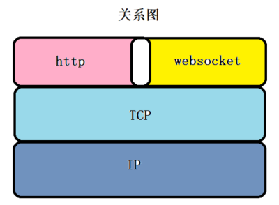

# Web Socket

## 1. 什么是 WebSocket

WebSocket 是 HTML5 下的一种<strong style="color:#DD5145">网络通信协议</strong>，一种在单个 TCP 连接上进行<strong style="color:#DD5145">全双工通信</strong>的协议。（本质上是一个基于 TCP 的协议）

目的是在 WebSocket 应用和 WebSocket 服务器进行频繁双向通信时，可以使服务器避免打开多个 HTTP 连接进行工作来节约资源，提高了工作效率和资源利用率。

它的目的是在浏览器之间建立一个不受限的双方通信的通道，比如说，服务器可以在任意时刻发送信息给浏览器。

在 WebSocket 的 API 中，浏览器和服务器<strong style="color:#DD5145">只需要完成一次握手</strong>，两者之间就直接可以创建持久性的连接，并进行双向数据传输

- WebSocket 是一个**持久化**的协议
- WebSocket 目前支持两种统一资源标志符`ws`和`wss（加密）`，类似于 HTTP 和 HTTPS。

## 2. WebSocket 的特点

- 是真正的全双工方式，建立连接后客户端与服务器端是完全平等的，可以互相主动请求。而HTTP长连接基于HTTP，是传统的客户端对服务器发起请求的模式。
- HTTP长连接中，每次数据交换除了真正的数据部分外，服务器和客户端还要大量交换HTTP header，信息交换效率很低。Websocket 协议通过第一个request建立了TCP连接之后，之后交换的数据都不需要发送 HTTP header就能交换数据，这显然和原有的 HTTP 协议有区别所以它需要对服务器和客户端都进行升级才能实现（主流浏览器都已支持HTML5）
- 可以发送文本，也可以发送二进制数据。
- 没有同源跨域限制，客户端可以与任意服务器通信。
- 浏览器专门为 WebSocket 通信提供了一个请求对象 WebSocket

**为什么需要 WebSocket ? 我们已经有了 HTTP 协议，为什么还需要另一个协议？它能带来什么好处？**

- 因为 HTTP 协议有一个缺陷：通信只能由客户端发起
- 我们都知道轮询的效率低，非常浪费资源（因为必须不停连接，或者 HTTP 连接始终打开）, 因此 WebSocket 应运而生。
- WebSocket 不是用来代替 HTTP 的，它是用来解决实时通信的业务。若业务不需要实时性，那就没必要使用 WebSocket。

## 3. WebSocket 与 HTTP 的关系

**相同点：**

1. 都是基于 TCP 的，都是可靠性传输协议
2. 都是应用层协议

**不同点：**

1. WebSocket 是双向通信协议，模拟Socket协议，可以双向发送或接受信息
2. HTTP 是单向的
3. WebSocket 是需要浏览器和服务器握手进行建立连接的
4. 而 HTTP 是浏览器发起向服务器的连接，服务器预先并不知道这个连接

**WebSocket 在建立握手时，数据是通过 HTTP 传输的。但是建立之后，在真正传输时候是不需要 HTTP 协议的**



## 4. WebSocket 的方法

- ws.send() - 向服务器发送数据
- ws.close() - 关闭连接

## 5. WebSocket 的事件

- open - ws.onopen - 建立连接时触发
- message - ws.onclose - 连接关闭时触发
- error - ws.onerror - 通信发生错误时触发
- message - ws.onmessage - 客户端接受服务端数据时触发

## 6. WebSocket.readyState

- readyState 属性返回实例对象的当前状态，共有四种状态
- 0 - 表示正在连接
- 1 - 表示连接成功，可以进行通信
- 2 - 表示连接正在关闭
- 3 - 表示连接已经关闭，或者打开连接失败

```js
// 创建一个WebSocket对象
const ws = new WebSocket("接口地址")

// 连接成功时触发
ws.onopen = function() {
    alert("连接成功")
}
// 连接失败时触发
ws.onerror = function() {
    alert("连接失败")
}
// 发送数据
ws.send(); // 向服务端发送请求

// 接收消息时触发
ws.onmessage = function(MessagEvent) {
    console.log(MessagEvent.data)
}
// 连接关闭的回调函数
ws.onclose = function（）{
    alert（"close"）
}
```

## 7.WebSocket 的使用

### 客户端搭建

ws 是一个 websocket 库，可以用了创建服务器。


### 服务器搭建


## 参考

[MDN文档](https://developer.mozilla.org/zh-CN/docs/Web/API/WebSocket)、[参考文章](https://blog.csdn.net/weixin_48845614/article/details/126634761)、[参考文章2](https://blog.csdn.net/sinat_36422236/article/details/85051547)、[参考文章3](https://blog.csdn.net/qq_54773998/article/details/123863493)

