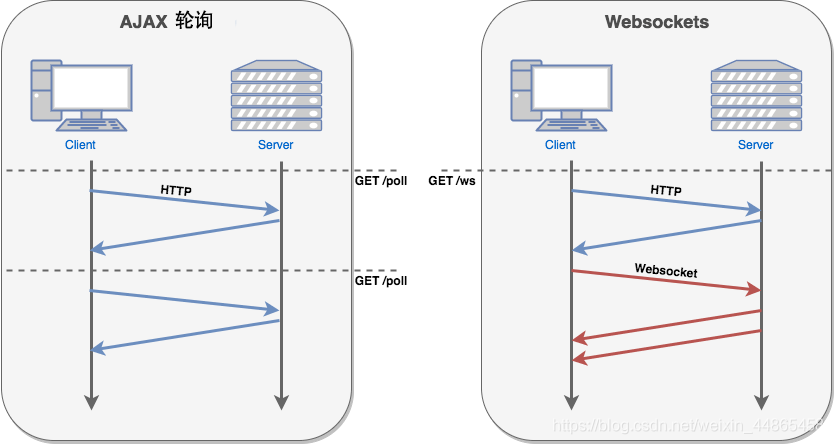

# WebSocket

## 1.:star:WebSocket 简介

[WebSocket](https://developer.mozilla.org/zh-CN/docs/Web/API/WebSocket) 是 HTML5 下的一种<strong style="color:#DD5145">网络通信协议</strong>，一种在单个 TCP 连接上进行<strong style="color:#DD5145">全双工通信</strong>的协议。（本质上是一个基于 TCP 的协议）

它的目的是在浏览器之间建立一个不受限的双方通信的通道，在 WebSocket 应用和 WebSocket 服务器进行频繁双向通信时，可以使服务器避免打开多个 HTTP 连接进行工作来节约资源，提高了工作效率和资源利用率。

在 WebSocket 的 API 中，浏览器和服务器<strong style="color:#DD5145">只需要完成一次握手</strong>，两者之间就直接可以创建持久性的连接，并进行双向数据传输

- WebSocket 是一个**持久化**的协议
- WebSocket 目前支持两种统一资源标志符`ws`和`wss（加密）`，类似于 HTTP 和 HTTPS。


**为什么需要 WebSocket ? 我们已经有了 HTTP 协议，为什么还需要另一个协议？它能带来什么好处？**

- 因为 HTTP 协议有一个缺陷：通信只能由客户端发起
- 我们都知道轮询的效率低，非常浪费资源（因为必须不停连接，或者 HTTP 连接始终打开）, 因此 WebSocket 应运而生。
- WebSocket 不是用来代替 HTTP 的，它是用来解决实时通信的业务。若业务不需要实时性，那就没必要使用 WebSocket。


## 2.:star:WebSocket 协议

在 WebSocket 协议之前有三种实现双向通信的方式：

- **轮询（polling）**：是客户端和服务器之间会一直进行连接，每隔一段时间就询问一次。而且每次发送请求都会有Http的Header，会很耗流量，也会消耗CPU的利用率。
- **长轮询（long-polling）**：是对轮询的改进版，有较好的时效性，客户端发送HTTP给服务器之后，看有没有新消息，如果没有新消息，就一直等待。当有新消息的时候，才会返回给客户端。
- **iframe流（streaming）**：在页面中插入一个隐藏的iframe，利用其src属性在服务器和客户端之间创建一条长连接，服务器向iframe传输数据（通常是HTML，内有负责插入信息的javascript），来实时更新页面。

在浏览器的 Network 查看 ws 接口详情，我们可以看到基本 WebSocket **请求头**如下：

```undefined
Upgrade: websocket
Connection: Upgrade
Sec-WebSocket-Key: x3JJHMbDL1EzLkh9GBhXDw==
Sec-WebSocket-Version: 13
Sec-WebSocket-Extensions:permessage-deflate; client_max_window_bits
Origin: localhost:8080
```

其中：

- `Connection`这个核心字段通知服务器当前使用的是WebSocket 协议
- `Upgrade` 表示要升级到 WebSocket 协议
- `Sec-WebSocket-Key` 是一个 Base64 encode 的值，与后面服务端响应首部的`Sec-WebSocket-Accept`是配套的，提供基本的防护，比如恶意的连接，或者无意的连接。
- `Sec-WebSocket-Version: 13`表示websocket的版本。这也是由于早期各个浏览器使用的版本都不同，所以后期进行了统一
- `Sec-WebSocket-Extensions`表示协议扩展类型。某类协议可能支持多个扩展，通过它可以实现协议增强
- `Origin`用于防止未授权的跨域脚本攻击，服务器可以从Origin决定是否接受该WebSocket连接，如果请求来自浏览器必须包含Origin属性名

而 ws 接口的**响应包**也是可以对应的上：

```undefined
Upgrade: websocket
Connection: Upgrade
Sec-WebSocket-Extensions:permessage-deflate; client_max_window_bits
Origin: localhost:8080
```

在响应包中，存在和请求头一一对应的字段，而在其中：

- `Sec-WebSocket-Accept`值是将请求包“Sec-WebSocket-Key”的值，与”258EAFA5-E914-47DA-95CA-C5AB0DC85B11″这个字符串进行拼接，然后对拼接后的字符串进行sha-1运算，再进行base64编码，就是“Sec-WebSocket-Accept”的值；


## 3.:star:WebSocket 特点

WebSocket 解决了半双工通信的弊端。它最大的特点是：<strong style="color:#DD5145">服务器可以向客户端主动推动消息，客户端也可以主动向服务器推送消息。</strong>

- 支持双向通信，实时性更强
- 可以发送文本，也可以发送二进制数据
- 建立在 TCP 协议之上，服务端的实现比较容易
- 与 HTTP 协议有着良好的兼容性。默认端口也是 80 和 443，并且握手阶段采用 HTTP 协议，因此握手时不容易屏蔽，能通过各种 HTTP 代理服务器。
- 数据格式比较轻量，性能开销小，通信高效
- <strong style="color:#DD5145">没有同源跨域限制</strong>，客户端可以与任意服务器通信
- 协议标识符是ws（如果加密，则为wss），服务器网址就是 URL。`ws://example.com:80/some/path`


**WebSocket 在建立握手时，数据是通过 HTTP 传输的。但是建立之后，是不需要 HTTP 协议的**




## 4.:star:WebSocket API

### 构造函数

WebSocket 对象作为一个构造函数，用于新建 WebSocket 实例对象。

```js
const ws = new WebSocket(url[, protocols])
```

- `url`：指定连接的URL
- `protocols`：可选，指定可接受的子协议

```js
const ws = new WebSocket('ws://localhost:3000')
```

执行上面语句之后，客户端就会与服务器进行连接。


### 实例属性

#### readyState

```js
let readyState = ws.readyState;
```

只读属性 readyState 返回实例对象的当前状态，共有四种状态：

- CONNECTING：值为0，表示正在连接。
- OPEN：值为1，表示连接成功，可以通信了。
- CLOSING：值为2，表示连接正在关闭。
- CLOSED：值为3，表示连接已经关闭，或者打开连接失败。


#### bufferedAmount

```js
let bufferedAmount = ws.bufferedAmount;
```

只读属性，用于返回已被 `send()` 放入正在队列中，但是还没有被发送到网络中的 UTF-8 文本字节数。

一旦队列中的所有数据被发送至网络，则该属性值将被重置为 0。但是，若在发送过程中连接被关闭，则属性值不会重置为 0。

**可以用来判断发送是否结束：**

```js
let data = new ArrayBuffer(10000000);
ws.send(data);

if (socket.bufferedAmount === 0) {
    // 发送完毕
} else {
    // 发送还没结束
}
```


#### binaryType

**`WebSocket.binaryType`** 返回 websocket 连接所传输二进制数据的类型。

```js
const binaryType = ws.binaryType;
```

返回值：

- "blob"，传输的是 [`Blob`](https://developer.mozilla.org/zh-CN/docs/Web/API/Blob) 类型的数据。
- "arraybuffer"，传输的是 [`ArrayBuffer`](https://developer.mozilla.org/zh-CN/docs/Web/JavaScript/Reference/Global_Objects/ArrayBuffer) 类型的数据。


### 实例方法

**WebSocket.send()** - 向服务器发送数据

```js
ws.send("Hello server!");
```

用于传输至服务器的数据。它必须是以下类型之一：

- `USVString`
- `ArrayBuffer`
- `Blob`
- `ArrayBufferView`

**WebSocket.close()** - 关闭连接

```js
ws.close();
```


### 事件

实例对象的 **onopen** 属性，用于指定连接成功后的回调函数。

```js
ws.onopen = function () {
    ws.send('WebSocket is open now!');
}
```

如果要指定多个回调函数，可以使用`addEventListener`方法。

```js
ws.addEventListener('open', function (event) {
    ws.send('WebSocket is open now!');
});
```

> 下面等同

实例对象的 **onmessage** 属性，用于指定收到服务器数据后的回调函数。

```js
ws.addEventListener('message', function (event) {
    console.log('Message from server ', event.data);
});
```

实例对象的 **onclose** 属性，用于指定连接关闭后的回调函数。

```js
ws.onclose = function(event) {
    console.log("WebSocket is closed now.");
}
```

实例对象的 **onerror** 属性，用于指定通信发生错误时的回调函数。

```js
ws.addEventListener('error', function (event) {
    console.log('WebSocket error: ', event);
});
```


## 5.:star:服务端的实现

WebSocket 服务器的实现，可以查看维基百科的[列表](https://en.wikipedia.org/wiki/Comparison_of_WebSocket_implementations)。

常用的 Node 实现有以下四种：

- [µWebSockets](https://github.com/uWebSockets/uWebSockets)：由 [C++11](https://isocpp.org/) 和 [Node.js](https://nodejs.org/) 实现的高度可扩展的 WebSocket 服务器和客户端.。
- [Socket.IO](https://socket.io/zh-CN/)：一个基于长轮询/WebSocket 的 Node.js 第三方传输协议。
- [WebSocket-Node](https://github.com/theturtle32/WebSocket-Node)：一个用 Node.js 实现 WebSocket 服务器 API。
- [ws](https://github.com/websockets/ws)：一个流行的 WebSocket 客户端和服务器 Node.js 库。

具体的用法请查看[它们的文档](https://developer.mozilla.org/zh-CN/docs/Web/API/WebSockets_API)，这里不详细介绍了。

下文主要介绍 ws 库：

Node.js 原生 API 没有提供对 WebSocket 的支持，需要安装第三方包才能使用，例如 ws 库。

ws 是一个用于支持WebSocket客户端和服务器的框架。它易于使用，功能强大，且不依赖于其他环境。

安装第三方库：

```sh
npm install ws
```

### 创建服务器

```js
WebSocket.Server(options[，callback]);
```

- options 可选值：
  - host：绑定服务器的主机名
  - port：绑定服务器的端口号
  - backlog：挂起连接队列的最大长度
  - server：预先创建的 node.js https 服务器
  - verifyClient：可用于验证传入连接的函数
  - handleProtocols：可用于处理WebSocket子协议的函数
  - path：仅接受与此路径匹配的连接
  - noServer：不启用服务器模式
  - clientTracking：指定是否跟踪客户端
  - perMessageDeflate：启用/禁用消息压缩
  - maxPayload：允许的最大消息大小（以字节为单位）

```js
 // 创建一个WebSocket服务器，在3000端口启动
 const WebSocket = require('ws');
 const server = new WebSocket.Server({ port: 3000 });
```


### 监听连接

ws 通过 `connection` 事件来监听连接：

```js
server.on('connection', function (ws, req) {
    const host = req.socket.remoteAddress;
    const port = req.socket.remotePort;
    const clientName = host + port;

    console.log(`${clientName} is connected！`);
})
// 只要有WebSocket连接到该服务器，就会触发'connection'事件
// req对象可以用来获取客户端的信息，如主机号、端口号
// 获取所有已连接的客户端信息，则可以使用server.clients数据集
```


### 发送数据

ws 通过 `send()` 方法来发送数据：

```js
ws.send(data [,options][,callback]);
```

- data：发送的数据
- options 对象：
  - compress：指定数据是否需要压缩。默认为true
  - binary：指定数据是否通过二进制传送。默认是自动检测
  - mask：指定是否应遮罩数据。
  - fin：指定数据是否为消息的最后一个片段。默认为true
- callback：回调函数

```js
server.on('connection', function (ws, req) {
    const host = req.socket.remoteAddress;
    const port = req.socket.remotePort;
    const clientName = host + port;

    console.log(`${clientName} is connected！`);

    ws.send(`Welcome ${clientName}`);
})
```


### 接收数据

ws 通过 `message` 事件来接收数据。当客户端有消息发送给服务器时，服务器就能够触发该消息：

```js
server.on('connection', function (ws, req) {
    const host = req.socket.remoteAddress;
    const port = req.socket.remotePort;
    const clientName = host + port;

    console.log(`${clientName} is connected！`);
    ws.send(`Welcome ${clientName}`);

    ws.on('message', function (message) {
        console.log(`received: ${message} from ${clientName}`);
        // 获取所有已连接的客户端信息，则可以使用server.clients数据集
        server.clients.forEach(function (client) {
            if(client.readyState === WebSocket.OPEN){
                client.send(clientName + " -> " + message);
            }
        })
    })
})
```

ws 中 WebSocket 类具有以下四种准备状态：

- CONNECTION：值为0，表示连接还没有打开
- OPEN：值为1，表示连接成功，可以通信了
- CLOSING：值为2，表示连接正在关闭
- CLOSED：值为3，表示连接已经关闭，或者打开连接失败


### 关闭服务器

通过监听 close 事件关闭服务器：

```js
server.on('close', function () {
    console.log('disconnected');
})
```


### 框架

```js
const Ws = require('ws')
// ws:localhost:3000
const server = new Ws.Server({ port: 3000 })

init()

const init = () => {
    bindEvent()
}

function bindEvent() {
    server.on('open', handleOpen)
    server.on('close', handleClose)
    server.on('error', handleError)
    server.on('connection', handleConnection)
}

function handleOpen() {
    console.log('websoket-open')
}

function handleClose() {
    console.log('websoket-close')
}

function handleError() {
    console.log('websoket-error')
}

function handleConnection(ws) {
    console.log('websoket-connected')
    ws.on('message', handleMessage)
}

function handleMessage(msg) {
    // 接收到前端发来的数据
    console.log(JSON.parse(msg))
    server.clients.forEach((item) => {
        // 后端向前端发送数据
        item.send(msg)
    })
}
```


## 6.:star:客户端的实现

### 框架

```js
// 创建一个WebSocket对象
const ws = new WebSocket("ws://localhost:3000")

init()

const init = () => {
    bindEvent()
}

function bindEvent() {
    ws.addEventListener('open', handleOpen, false)
    ws.addEventListener('close', handleClose, false)
    ws.addEventListener('error', handleError, false)
    ws.addEventListener('message', handleMessage, false)
}

function handleOpen() {
    console.log('--Client is connected--')
}

function handleClose() {
    console.log('--Client is closed--')
}

function handleError(e) {
    console.log('--Client occured error--', e)
}

function handleMessage(e) {
    console.log('websoket message')
    // 接收后端传递来的数据
    const msgData = JSON.parse(e.data)
}
```


## :page_facing_up:参考

1. [MDN文档](https://developer.mozilla.org/zh-CN/docs/Web/API/WebSocket)、[参考文章](https://blog.csdn.net/weixin_48845614/article/details/126634761)、[参考文章2](https://blog.csdn.net/sinat_36422236/article/details/85051547)、[参考文章3](https://blog.csdn.net/qq_54773998/article/details/123863493)、[参考文章](https://blog.csdn.net/Suciy/article/details/102912300)、[参考文章](https://blog.csdn.net/weixin_44865458/article/details/118014966)、[参考文章](https://blog.csdn.net/m0_37911706/article/details/128057137)
2. [WebSocket：5分钟从入门到精通](https://segmentfault.com/a/1190000012709475)
3. [阮一峰 WebSocket 教程](http://www.ruanyifeng.com/blog/2017/05/websocket.html)
4. [Http、Socket、WebSocket之间联系与区别](https://www.cnblogs.com/aspirant/p/11334957.html)


