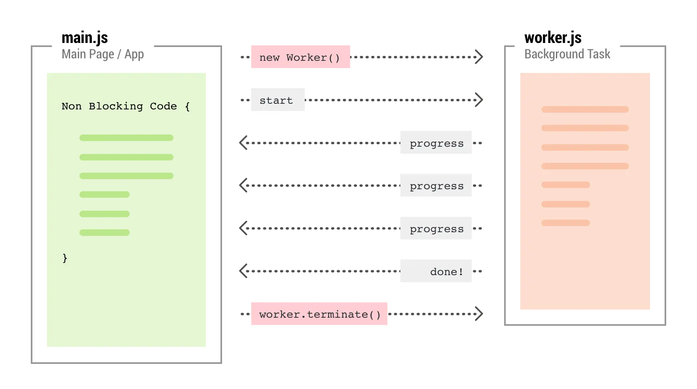

# Web Worker

## 扩展 -- 浏览器内核

**浏览器最核心的部分是 “Rendering Engine”，即 “渲染引擎”，又称 “浏览器内核”。** 主要包括以下线程：


### 1. GUI 渲染线程

GUI 渲染线程负责**渲染浏览器界面，解析HTML, CSS, 构建DOM树 和 RenderObject树，布局和绘制等**。

当界面需要重绘（Repaint）或由于某种操作引发回流（Reflow）时，该线程就会执行。

### 2. JavaScript 引擎线程

JavaScript 引擎线程负责**解析 JavaScript 脚本并运行相关代码**。 JavaScript 引擎一直等待着任务队列中任务的到来，然后进行处理，一个Tab页（Renderer 进程）中无论什么时候都只有一个 JavaScript 线程在运行 JavaScript 程序。

需要注意的是，<strong style="color:#DD5145">GUI 渲染线程与 JavaScript 引擎线程是互斥的</strong>，所以如果 JavaScript 执行的时间过长，这样就会造成页面的渲染不连贯，导致页面渲染被阻塞。

### 3. 事件触发线程

当一个事件被触发时该线程会把事件**添加到待处理队列的队尾**，等待 JavaScript 引擎的处理。

这些事件可以是当前执行的代码块如定时任务、也可来自浏览器内核的其他线程如鼠标点击、AJAX 异步请求等，但由于 JavaScript 引擎是单线程的，所有这些事件都得排队等待 JavaScript 引擎处理。

### 4. 定时触发器线程

浏览器定时计数器并不是由 JavaScript 引擎计数的，这是因为 JavaScript 引擎是单线程的，如果处于阻塞线程状态就会影响记计时的准确，所以通过单独线程来计时并触发定时是更为合理的方案。我们日常开发中常用的 `setInterval` 和 `setTimeout` 就在该线程中。

### 5. Http 异步请求线程

在 XMLHttpRequest 在连接后是通过浏览器新开一个线程请求， 将检测到状态变更时，如果设置有回调函数，异步线程就产生状态变更事件放到 JavaScript 引擎的处理队列中等待处理。


## 一、Web Worker 是什么

### 1.基本概念

Web Worker 是 HTML5 提供的一个 JavaScript 多线程解决方案。

- JavaScript 语言采用的是单线程模型，也就是说，所有任务只能在一个现场上完成，一次只能做一件事

Web Worker 的出现，就是为 JavaScript 创造多线程环境，允许主线程创建 Worker 线程，将一些任务分配给后者运行。在主线程运行的同时，Worker 线程在后台运行，两则互不干扰。

- 一条线程指的是进程中一个单一顺序的控制流，一个进程中可以并发多个线程，每条线程并行执行不同的任务

通过使用 Web Workers，Web 应用程序可以在独立于主线程的后台线程中，运行一个脚本操作。这样做的好处是可以在独立线程中执行费时的处理任务，从而允许主线程（通常是UI线程）不会因此被阻塞/放慢。 



### 2.几个注意点

Web Worker 有几个使用注意点：

- **同源限制**

  分配给 Worker 线程运行的脚本文件，必须与主线程脚本文件同源

- **DOM限制**

  Worker 线程所在的全局对象，与主线程不一样，无法读取主线程所在网页的 DOM 对象，也无法使用 `window`、`document`等对象，但可以使用 `navigator`和`location`对象

- **通信联系**

  Worker 线程和主线程不在同一个上下文环境，他们不能直接通信，必须通过<strong style="color:#DD5145">信息</strong>完成通信

- **脚本限制**

  Worker 线程不能执行`alert()`和`confirm()`方法，但可以使用`XMLHttpRequest`对象发出的`AJAX`请求，但是 `XMLHttpRequest` 对象的 `responseXML` 和 `channel` 这两个属性的值将总是 `null`

- **文本限制**

  Worker 线程无法读取本地文件（`file://`），它所加载的脚本，<strong style="color:#DD5145">必须来自网络</strong>

- Worker 线程上下文也存在一个顶级对象<strong style="color:#DD5145">`self`</strong>（类似浏览器中的 window对象）

绝大多数 Window 对象上的方法和属性，都被共享到 Worker 上下文全局对象 WorkerGlobalScope 中。


## 二、Web Worker API

### 1. 主线程

1.1 主线程调用 <strong style="color:orange">`Worker()`</strong>构造函数`new`一个 Worker 线程，它接收两个参数：

```js
const worker = new Worker(path, options)
// 例如
const worker = new Worker('worker.js')
```

- 由于 Worker 不能读取本地文件，这个脚本必须来自网络，如果没有下载成功（例如404），Worker 就会失败

| 参数                | 说明                                                         |
| ------------------- | ------------------------------------------------------------ |
| path                | 有效的 js 脚本地址，必须遵守同源策略，否则会抛出`SecurityError`错误 |
| options.type        | 可选，指定 worker 类型，该值可以是 classic 或 module。未指定，将使用默认值 classic |
| options.credentials | 可选，指定 worker 凭证，该值可以是 omit、same-origin 或 include。未指定 或 type 为 classic，将使用默认值 omit（不需要凭证） |
| options.name        | 可选，在 DedicatedWorkerGlobalScope 的情况下，用来表示 Worker 的 scope 的一个 DOMString 值，主要用于调式目的 |


1.2 主线程调用<strong style="color:orange">`worker.postMessage()`</strong>方法，向 Worker 线程发送消息：

```js
worker.postMessage('Hello World')
worker.postMessage({method: 'echo', args: ['work']})
```

- `worker.postMessage()`方法的参数，就是主线程传给 Worker 的数据，它可以是**各种类型的数据**，包括二进制数据

1.3 主线程通过<strong style="color:orange">`worker.onMessage`</strong>指定监听函数，接收来自 Worker 线程发送的信息：

```js
worker.addEventListener('message', function(event) {
    console.log(`Received message ${event.data}`)
    // do something
})

// 或
worker.onMessage = function(event) {
    console.log(`Received message ${event.data}`)
    // do something
}
```

1.4 Worker 线程完成任务以后，主线程可以调用<strong style="color:orange">`terminate()`</strong>方法把它关掉：

```js
worker.terminate()
```

### 2. Worker 线程

Worker 线程内部需要有一个监听函数，来监听 <strong style="color:#27ba9b">message 事件</strong>：

```js
self.addEventListener('message', function(event) {
    self.postMessage(`You said: ${event.data}`)
}, false)
```

- <strong style="color:#DD5145">`self`</strong>代表子线程自身，即子线程的全局对象。等价于下面两种写法

```js
// 写法一
this.addEventListener('message', function(event) {
    self.postMessage(`You said: ${event.data}`)
}, false)

// 写法二
addEventListener('message', function(event) {
    self.postMessage(`You said: ${event.data}`)
}, false)
```

除了使用<strong style="color:orange">`self.addEventListener()`</strong>指定监听函数，也可以使用<strong style="color:orange">`self.onMessage`</strong>指定。监听函数的参数是一个事件对象，它的`data`属性包含主线程发来的数据。<strong style="color:orange">`self.postMessage()`</strong>方法用来向主线程发送消息，<strong style="color:orange">`self.close()`</strong>用于在 Worker 线程内部关闭自身

### 3. 监听错误信息

Web Worker 提供两个事件监听错误，<strong style="color:#27ba9b">error 事件 和 messageerror 事件</strong>

| 事件         | 说明                                                |
| ------------ | --------------------------------------------------- |
| error        | 当 Worker 内部出现错误时触发                        |
| messageerror | 当 message 事件接收到**无法被反序列化**的参数时触发 |

主线程可以监听 Worker 是否发送错误，如果发生错误，Worker 会触发主线程`error`事件：

```js
worker.addEventListener('error', function(event) {
    console.log(['ERROR: Line', event.lineno, 'in', event.filename, ':', event.message].join(''))
})

// 或
worker.onerror(function(event) {
    // ...
})

// 或
worker.onerror = function(event) {
    // ...
}
```

> Worker 内部也可以监听 `error`事件

### 4. 关闭 Worker

使用完之后，为了节省系统资源，必须关闭 Worker

```js
// 主线程
worker.terminate()

// Worker 线程
self.close()
```

无论是在主线程关闭 Worker ，还是在 Worker 线程内部关闭 Worker ，Worker 线程当前的 Event Loop 中的任务会继续执行。而 Worker 线程下一个 Event Loop 中的任务，则会被直接忽略，不会继续执行。

- 在主线程关闭 Worker ，主线程与 Worker 线程之间的连接都会被立刻停止，即使 Worker 线程当前的 Event Loop 中仍有待执行的任务继续调用 `postMessage()` 方法，但主线程不会再接收到消息。

- 在 Worker 线程内部关闭 Worker ，不会直接断开与主线程的连接，而是等 Worker 线程当前的 Event Loop 所有任务执行完，再关闭。即，在当前 Event Loop 中继续调用 `postMessage()` 方法，主线程还是能通过监听`message`事件收到消息的。

### 5. Worker 加载脚本

Worker 内部如果要加载其他脚本，需要一个专门的方法`importScript()`:

```js
importScript('script1.js')
```

该方法可以同时加载多个脚本：

```js
importScript('script1.js', 'script2.js')
```

### 6.ESModule 模式

当项目的 js 文件都用的是 ESModule 模式时，`importScripts()` 导入js文件时，发现执行失败

需要在初始化 Worker 时选择第二个可选参数，使用 module 模式初始化 Worker 线程！

主线程

```js
// main.js（主线程）
const worker = new Worker('/worker.js', {
    type: 'module'  // 指定 worker.js 的类型
})
```

Worker 线程

```js
// worker.js（worker线程）
import add from './utils.js'; // 导入外部js

self.addEventListener('message', e => { 
    postMessage(e.data);
});

add(1, 2); // log 3

export default self; // 只需把顶级对象self暴露出去即可
```

js文件

```js
// utils.js
export default add = (a, b) => a + b;
```


## 三、Web Worker 数据通信

主线程与 Worker 线程之间的通信内容，可以是文本，也可以是对象。注意，这种通信是拷贝关系。即，数据传递是<strong style="color:#DD5145">传值而不是传地址</strong>，Worker 对通信内容的修改，不会影响到主线程。

所以你会发现，即使你传递的是一个`Object`，并且被直接传递回来，接收到的也不是原来的那个值了。

- 浏览器内部的运行机制：先将通信内容串行化，然后把串行化后的字符串发送给 Worker，后者再将它还原。

为了解决这个问题，JavaScript 运行主线程把二进制数据直接转移给子线程，但是一旦转移，主线程就无法再使用这些二进制数据了，这是为了防止出现多个线程同时修改数据，这种转移数据的方法，叫做 Transferable Objects。

这使得主线程可以快速把数据交给 Worker，对于映像处理、声音处理、3D运算等就很方便，不会产生性能负担。

```js
// Transferable Objects 格式
worker.postMessage(arrayBuffer, [arrayBuffer])

// 例如
const exp = new ArrayBuffer(1)
worker.postMessage(exp, [exp])
```

## 四、Web Worker 分类

Web Worker 规范中定义了两类工作线程，**专用线程 Dedicated Worker** 和 **共享线程 Shared Worker**。

其中，Dedicated Worker 只能为一个页面所使用，而 Shared Worker 则可以被多个页面所共享。

### 1.Dedicated Worker


### 2.Shared Worker

**SharedWorker** 是一种特殊类型的 Worker，可以被多个浏览上下文访问，比如多个 windows，iframes 和 workers，但这些浏览上下文必须同源。

使用场景：点赞计数器 ...


## 五、Service Workers


## 参考

[MDN文档](https://developer.mozilla.org/zh-CN/docs/Web/API/Web_Workers_API)、[参考文章](https://juejin.cn/post/7139718200177983524)、[你不知道的 Web Workers](https://juejin.cn/post/6844904198639714311)