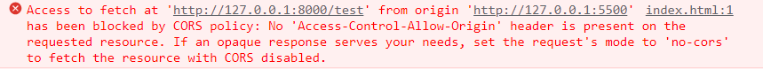
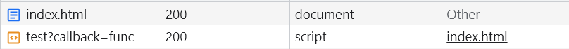
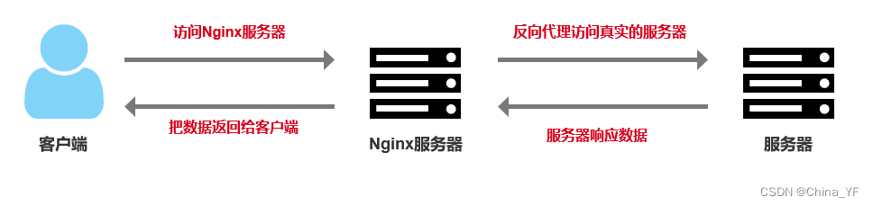
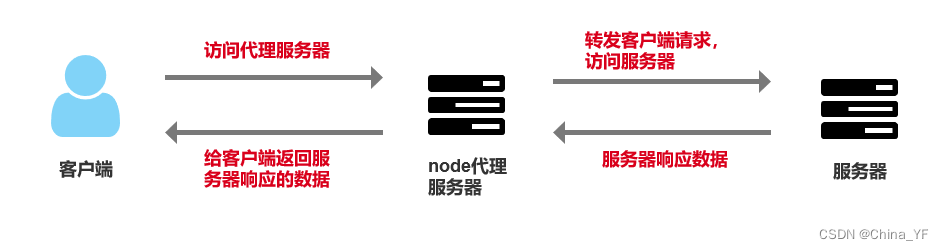

# 五、跨域问题

## :star:什么是跨域

<strong style="color:#DD5145">跨域本质是浏览器基于同源策略的一种安全手段。</strong>

跨域就是当在页面上发送ajax请求时，由于浏览器同源策略的限制，要求当前页面和服务端必须同源，否则浏览器视为跨域，进行拦截。

**同源策略（Same-Origin Policy）** 是浏览器的一种安全策略，可以防止某些恶意行为：

- 同源：**协议** + **域名** + **端口号** 必须完全相同，这三者是确定站点的唯一标识符
- 跨域：三者之间任意一个与当前页面 url 不同即为跨域，违背同源策略就是跨域

**同源策略限制以下几种行为：**

- Cookie、LocalStorage 和 IndexDB 无法读取
- DOM 和 JS对象无法获得
- Ajax 请求不能发送

一定要注意<strong style="color:#DD5145">跨域限制是浏览器行为，不是服务器行为</strong>。用抓包工具抓取接口数据，可以看到接口已经把数据返回回来了，只是浏览器的限制，你获取不到数据。

用 postman 请求接口能够请求到数据，这些再次印证了跨域是浏览器的限制。

`client`

```html
<h1>跨域问题</h1>
<script>
    fetch('http://127.0.0.1:8000/test').then(res => res.text()).then(data => {
        console.log(data)
    })
</script>
```



`server.js`

```js
const express = require('express')

const app = express()
const HOST = 'http://127.0.0.1'
const PORT = '8000'
const HOSTNAME = `${HOST}:${PORT}`

app.get('/test', (req, res) => {
    res.send('你好')
})

app.listen(PORT, () => {
    console.log(`serve is running at ${HOSTNAME}`)
})
```


## :star:如何解决跨域

解决跨域的方法有很多，下面列举了几种：

- JSONP
- CORS
- 代理服务器
- NodeJs 中间代理跨域
- postMessage 跨域
- WebSocket 跨域

而在`vue`项目中，我们主要针对`CORS`或`Proxy`这两种方案进行展开。

### 1.JSONP

**JSONP（JSON with Padding）**，是非官方的跨域解决方案，<strong style="color:#DD5145">只支持 GET 请求</strong>。

有一些标签天生具有跨域能力，比如：img、link、iframe、script。

本质利用了`script`标签`src`引入外部资源不受浏览器同源策略的限制，然后和后端一起配合来解决跨域问题的。

- JSONP 和 Ajax 之间没有任何关系，不能把 JSONP 请求数据的方式叫做 Ajax，因为 JSONP 没有用到 XMLHttpRequest 对象。
- JSONP 的优点就是兼容性好，可以解决主流浏览器的跨域问题，缺点是仅支持GET请求，不安全，可能遭受xss攻击。

应用场景：有些第三方数据接口可能会使用JSONP解决跨域问题，工作不经常使用

**具体实现：** 动态生成script标签，通过src属性进行加载

1. 在客户端创建一个`script`标签，然后把请求后端的接口拼接一个回调函数`func`名称作为参数传递给后端
2. 当后端接收到客户端的请求时，会解析得到回调函数名称，然后把数据和回调函数名称拼接成函数调用的形式返回
3. 客户端解析后会调用定义好的回调函数，然后在回调函数中就可以获取到后端返回的数据了。

```html
<body>
    <h1>跨域问题</h1>
    <script>
        function func(data) {
            console.log(data)
        }
    </script>
    <script src="http://127.0.0.1:8000/test?callback=func"></script>
</body>
```



`node.js`

```js
const express = require('express')

const app = express()
const HOST = 'http://127.0.0.1'
const PORT = '8000'
const HOSTNAME = `${HOST}:${PORT}`

app.get('/test', (req, res) => {
    // 获取客户端传来的回调函数名称
    const funcName = req.query.callback
    // 模拟返回数据
    const msg = '你好'
    // 把数据和回调函数名称拼接成函数调用的方式返回
    const result = `${funcName}('${msg}')`
    res.send(result)
})

app.listen(PORT, () => {
    console.log(`serve is running at ${HOSTNAME}`)
})
```


### 2.CORS

**[CORS](https://developer.mozilla.org/zh-CN/docs/Web/HTTP/Access_control_CORS)（Cross-Origin Resource Sharing，跨域资源共享）** 是官方的跨域解决方案，它的特点是不需要在客户端做任何特殊的操作，完全在服务器中进行处理，<strong style="color:#DD5145">同时支持 GET 和 POST 请求</strong>。

CORS 是通过设置一个响应头来告诉浏览器，该请求允许跨域，浏览器收到该响应以后就会对响应放行。

以nodejs为例，在服务器 server.js 文件中配置：

```javascript
const express = require('express')

const app = express()
const HOST = 'http://127.0.0.1'
const PORT = '8000'
const HOSTNAME = `${HOST}:${PORT}`

app.get('/test', (req, res) => {
    res.header('Access-Control-Allow-Origin', '*') // 设置响应头允许跨域
    res.send('你好')
})

app.listen(PORT, () => {
    console.log(`serve is running at ${HOSTNAME}`)
})
```

> `Access-Control-Allow-Origin` 设置为 **`*`** 其实意义不大，可以说是形同虚设，实际应用中，上线前我们会将`Access-Control-Allow-Origin` 值设为我们目标`host`

### 3.代理服务器

在日常的项目开发中，解决跨域问题最常使用的方案是使用代理服务器

> **什么是代理？**
>
> - 常规 ：A客户端 向 B服务器 请求
> - 变成： 代理服务器C收的A的请求，C请求B返回给 A客户端 （**服务器之间请求不存在跨域**）

代理服务器解决跨域是利用了**同源策略只受限于浏览器访问服务器，而对于服务器访问服务器并没有限制**的特点，作为中间服务器做了一个请求转发的功能。

具体来说，就是当前端网页在浏览器中发起网络请求时，其实这个请求是发送到代理服务器上的，然后代理服务器会将请求转发给目标服务器，再将目标服务器返回的响应转发给客户端。

------

注意，在[开发环境](#开发环境)和[生产环境](#生产环境)中，我们通常会使用不同的方式实现代理。

#### 开发环境

在`vue-cli`脚手架工具搭建的项目中，可以通过`webpack`建立一个本地服务器作为请求的代理对象。

通过该服务器转发请求至目标服务器，得到结果再转发给前端，但是最终发布上线时如果 Web 应用和接口服务器不在一起仍会跨域。

在`vue.config.js`文件配置：

```js
module.exports = {
    lintOnSave: false, // 关闭语法检查
    devServer: {
        // host: '127.0.0.1',
        // port: 8080,
        open: true, // vue项目启动时自动打开浏览器
        // 设置代理
        proxy: {
            // '/api' 是代理标识，用于告诉 node，url 前面是 /api 的就是使用代理的
            '/api': {
                target: 'http://xxx.xxx.xx.xx:8080', // 目标地址，一般是指后台服务器地址
                ws: true, // 是否启用 WebSockets
                changeOrigin: true, // 开启代理，会在本地创建一个虚拟服务器
                // pathRewrite 的作用是把实际 Request Url 中的 '/api' 用 '/' 代替
                pathRewrite: {
                    '^/api': '/' 
                }
            }
        }
    }
}
```

通过`axios`发送请求中，配置请求的根路径

```js
axios.defaults.baseURL = '/api'
```

- `devServe.proxy` 提供的代理功能，仅在开发调试阶段生效
- 项目上线发布时，依旧需要API接口服务器开启 CORS 跨域资源共享

#### 生产环境

在线上环境下，一般会采用 **Nginx** 来做反向代理解决跨域问题，也是利用了服务器请求服务器不受浏览器同源策略的限制实现的。

通过 Nginx 反向代理解决跨域的**优点**是可以集中管理跨域请求，**缺点**是需要额外的服务器和维护成本。

客户端请求 Nginx 服务器，在 nginx.config 配置文件中配置server监听客户端的请求，然后把 location 匹配的路径代理到真实的服务器，服务器处理请求后返回数据，Nginx 再把数据给客户端返回。

大致流程如下：



1.修改 Nginx 的配置文件，在 http 块中添加以下内容：

```nginx
http {
    # 允许跨域请求的地址
    add_header 'Access-Control-Allow-Origin' '*';

    # 允许跨域请求的方法
    add_header 'Access-Control-Allow-Methods' 'GET, POST, PUT, DELETE, OPTIONS';

    # 允许跨域请求的请求头
    add_header 'Access-Control-Allow-Headers' 'Origin, X-Requested-With, Content-Type, Accept, Authorization';

    # 允许跨域请求的请求头中可以携带的信息
    add_header 'Access-Control-Expose-Headers' 'Authorization';

    # 允许跨域请求携带 Cookie
    add_header 'Access-Control-Allow-Credentials' 'true';

    ...
}
```

2.在 server 块中添加以下内容：

```nginx
server {
    listen 80;
    server_name example.com;

    # 将 /api 转发到 http://api.example.com
    location /api {
        proxy_pass http://api.example.com;
        proxy_set_header Host $host;
        proxy_set_header X-Real-IP $remote_addr;
    }
}
```

这个配置表示将客户端请求的 **/api** 转发到 **http://api.example.com**，并将客户端请求的头信息中的 Host 和 X-Real-IP 添加到后端请求的头信息中。这样就可以通过 Nginx 反向代理解决跨域问题了。


### 4.NodeJs 中间代理跨域

因为同源策略是浏览器限制的，所以**服务端请求服务器是不受浏览器同源策略的限制的**，因此我们可以搭建一个自己的node服务器来代理访问服务器。

大致流程：我们在客户端请求自己的Node代理服务器，然后在Node代理服务器中转发客户端的请求访问服务器，服务器处理请求后给代理服务器响应数据，然后在代理服务器中把服务器响应的数据再返回给客户端。



客户端和自己搭建的代理服务器之间也存在跨域问题，所以需要在代理服务器中设置CORS。

客户端：

```html
<!-- 引入axios发送请求 -->
<script src="https://unpkg.com/axios/dist/axios.min.js"></script>
<script>
    // 简单封装一个axios向代理服务器发送请求
    function proxyAxios(data) {
        return axios({
            url: 'http://localhost:8081/proxyApi', // 请求自己搭建的node代理服务器的地址
            method: 'POST',
            headers: { 'content-type': 'application/x-www-form-urlencoded' },
            data
        })
    }

    // 使用node代理服务器向服务器发送请求
    proxyAxios({
        url: 'https://class.imooc.com/getadver',// 需要代理访问真实服务器的url
        method: 'GET',
    }).then(res => {
        console.log('res:', res)
    }).catch(err => {
        console.log(err)
    })
</script>
```

Node服务器：

```js
/**通过nodeJS搭建自己的代理服务器来解决跨域问题 */
const axios = require('axios')
const express = require('express')
const bodyParser = require('body-parser')
const app = express()
// 使用第三方插件
app.use(bodyParser.urlencoded({extended: false}))
app.use(bodyParser.json())

// 监听post请求,处理代理接口
app.post('/proxyApi', (req, res) => {
    const {body} = req
    // 获取post请求的请求参数
    let reqParams = {}
    for(const key in body) {
        reqParams = JSON.parse(key) // 获取到请求参数
    }

    // 设置响应头 
    res.setHeader('Access-Control-Allow-Origin', '*') // 代理服务器设置CORS，允许跨域访问
    res.setHeader('Access-Control-Allow-Methods', '*') // 允许所有的请求方式

    const {url, method = "GET", ...resConfig} = reqParams || {}
    // node代理请求服务器
    axios({
        url,
        method,
        ...resConfig
    }).then(result => {
        const {status, headers, data} = result
        res.status(status)
        res.setHeader('content-type', headers['content-type'])
        res.end(JSON.stringify(data)) // 给客户端返回数据
    }).catch(err => {
        res.end(JSON.stringify(err))
    })
})

// 监听请求
app.listen(8081, () => {
    console.log('服务启动成功，在8081端口监听请求....')
})
```


以`express`框架为例，利用node + express + http-proxy-middleware搭建一个proxy服务器。

```js
const express = require('express')
const proxy = require('http-proxy-middleware')
const app = express()

app.use(express.static(__dirname + '/'))
app.use('/api', proxy({ 
    target: 'http://localhost:4000', 
    changeOrigin: false
}))

module.exports = app
```

express有一个自带的中间件cors，它的作用是自动给每一个res设置默认请求头，这样就不用我们自己每一个接口都要设置一次了。

```js
// 1.下包 
$ npm install cors


// 2.配置中间件 
const cors = require('cors') 
app.use(cors()
```


### 5.postMessage 跨域

[window.postMessage()](https://developer.mozilla.org/zh-CN/docs/Web/API/Window/postMessage) 方法可以安全地实现跨源通信，此方法一种受控机制来规避此限制，只要正确的使用，这种方法就很安全。

主要的用途是实现多窗口，多文档之间通信：

- 页面和其打开的新窗口的数据传递
- 多窗口之间消息传递
- 页面与嵌套的 iframe 消息传递


### 6.WebSocket 跨域

使用 Websocket 也可以解决跨域问题，因为 WebSocket 本身不存在跨域问题，所以可以利用 WebSocket 来进行非同源之间的通信。

WebSocket 规范定义了一个在 Web 浏览器和服务器之间建立“套接字”连接的 API。 简单来说：客户端和服务器之间存在持久连接，双方可以随时开始发送数据。


## :star:总结

- jsonp的原理是利用了script标签不受浏览器同源策略的限制，img和link标签也是不受浏览器同源策略限制的。
- 跨域是浏览器限制，服务端和服务端之间通信是不受浏览器同源策略限制的。
- 所有跨域的解决方案都是需要服务端配合的。
- 最常用的跨域解决方案是CORS、Node代理服务器和Nginx反向代理方式。
- postMessage更多的是用在多个文档，窗口之间发送数据。
- 

## :page_facing_up:参考

[参考文章](https://vue3js.cn/interview/vue/cors.html)、[参考文章2](https://blog.csdn.net/qq_45334976/article/details/125113481)、[参考文章3](https://blog.csdn.net/qq_52822043/article/details/124438656)、[参考文章](https://blog.csdn.net/m0_37873510/article/details/126558023)、[参考文章](https://blog.csdn.net/qq_42691298/article/details/129767095)

