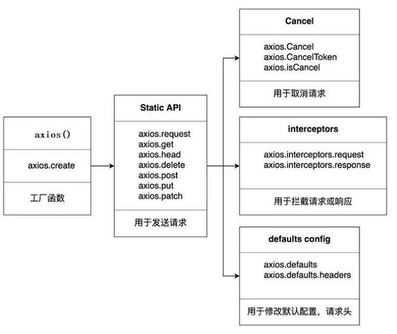

# axios的理解与使用

## axios 介绍

### axios 是什么？

axios 是一个基于 promise 的HTTP库，可以用于浏览器和 node.js 

相比于原生的 XMLHttpRequest 对象，axios **简单易用**。相比于 jQuery，axios 更加**轻量化**，只专注于网络数据请求。

文档：https://github.com/axios/axios#installing

### axios 的特点

> 1. 基于 xhr + promise 的异步 ajax 请求库
> 2. 浏览器端 / node端都可以使用
> 3. 支持请求 / 响应拦截器
> 4. 请求 / 响应数据转换
> 5. 批量发送多个请求

## axios 常用语法

> - **axios(config)**：通用（最本质）的发任意类型请求的方式
> - **axios (url [, config])**：可以指定 url 发 get 请求
> - **axios.request (config)**：等同于 axios(config)
> - **axios.get (url [, config])**：发 get 请求，一般用户获取数据
> - **axios.delete (url [, config])**：发 delete请求，删除数据
> - **axios.post (url [, data, config])**：发 post请求，一般用于表单提交与文件上传
> - **axios.put (url [, data, config])**：发 put 请求，更新数据（所有数据推送到服务端）
> - **axios.patch(url [, data, config])**：发 patch 请求，更新数据（只将修改的数据推送到后端）
>
> 备注：post一般用于新建数据，put一般用于更新数据，patch一般用于数据量较大的时候的数据更新

> - **axios.defaults.xxx**：请求的默认全局配置
> - **axios.interceptors.request.use( )**：添加请求拦截器
> - **axios.interceptors.response.use( )**：添加响应拦截器

> - **axios.create([, config])**：创建一个新的 axios（它没有下面的功能）
>
> - **axios.Cancel( )**：用于创建取消请求的错误对象
> - **axios.CancelToken( )**：用于创建取消请求的 token 对象
> - **axios.isCancel( )**：是否是一个取消请求的错误
> - **axios.all (promise)**：用于批量执行多个异步请求
> - **aixos.spread( )**：用来指定接收所有成功数据的回调函数的方法

**原理图：**



## axios 请求响应结果

axios 请求响应结果的结构：

> - config：配置对象
> - data：响应体的结果
> - headers：响应头的信息
> - request：原生的AJAX请求对象

## axios 配置对象

**配置对象（config）**详细说明：

> - baseURL：请求的域名（基本地址）
>
> - timeout：请求的超时时长，超出后后端返回401
>
>   备注：一般由后端定义，后端的接口需要的处理时长较长的时候，如果请求的时间过长，后端处理不过来，就会阻塞，给服务器造成较大的压力。设置后，可以及时释放掉
>
> - url：请求路径。
>
> - method：请求方法。如：get、post、put、patch、delete等
>
> - headers：请求头
>
> - params：将请求参数拼接到url上
>
> - data：将请求参数放置到请求体里 

## axios 的默认配置

默认配置列表：

```javascript
// 获取按钮
const btns = document.querySelectorAll('button');
// 默认配置
axios.defaults.method = 'GET';  // 设置默认的请求类型为 GET
axios.defaults.baseURL = 'http://localhost:3000';  // 设置基础 URL
axios.defaults.params = {id:100};
axios.defaults.timeout = 3000;  // 超时时间

btns[0].onclick = function(){
    axios({
        url: '/posts'
    }).then(response => {
        console.log(response);
    })
}
```


## axios 拦截器

### 什么是拦截器？

在请求前或响应被处理前拦截他们，分为两种：请求拦截器与响应拦截器

**请求拦截器：**对请求数据做处理

```javascript
// 请求拦截器
axios.interceptors.request.use(config => { 
  // 在发送请求前做些什么
  return config;
}, error => { 
    // 在请求错误的时候的逻辑处理
    return Promise.reject(error)
});
```

**响应拦截器：**对结果做处理

```javascript
// 响应拦截器
axios.interceptors.response.use(response => { 
  // 在请求成功后的数据处理
  return response;
}, error => { 
    // 在响应错误的时候的逻辑处理
    return Promise.reject(error)
});
```

取消拦截器

```javascript
// 取消拦截器
let inter = axios.interceptors.request.use(config=>{
    config.header={ 
        auth:true
    }
    return config
})
axios.interceptors.request.eject(inter)
```

### 拦截器函数调用顺序

拦截器函数/ajax 请求/请求的回调函数的调用顺序：

> 1. 说明: 调用 axios()并不是立即发送 ajax 请求, 而是需要经历一个较长的流程
> 2. 流程: 请求拦截器2 => 请求拦截器1 => 发ajax请求 => 响应拦截器1 => 响应拦截器 2 => 请求的回调
> 3. 注意: 此流程是通过 promise 串连起来的, 请求拦截器传递的是 config, 响应 拦截器传递的是 response

```javascript
<script>
	// Promise
	// 设置请求拦截器  config 配置对象-----------------------------
	axios.interceptors.request.use(function (config) {
		console.log('请求拦截器 成功 - 1号');
		//修改 config 中的参数
		config.params = {a:100};
		return config;
    }, function (error) {
		console.log('请求拦截器 失败 - 1号');
		return Promise.reject(error);
    });

	axios.interceptors.request.use(function (config) {
		console.log('请求拦截器 成功 - 2号');
		//修改 config 中的参数
		config.timeout = 2000;
		return config;
    }, function (error) {
		console.log('请求拦截器 失败 - 2号');
		return Promise.reject(error);
    });


	// 设置响应拦截器--------------------------------------------
	axios.interceptors.response.use(function (response) {
		console.log('响应拦截器 成功 - 1号');
		return response.data;
		// return response;
    }, function (error) {
		console.log('响应拦截器 失败 - 1号')
		return Promise.reject(error);
    });

	axios.interceptors.response.use(function (response) {
		console.log('响应拦截器 成功 - 2号')
		return response;
    }, function (error) {
		console.log('响应拦截器 失败 - 2号')
		return Promise.reject(error);
    });

	// 发送请求-------------------------------------------------
	axios({
		method: 'GET',
		url: 'http://localhost:3000/posts'
    }).then(response => {
		console.log('自定义回调处理成功的结果');
		console.log(response);
    }).catch(reason => {
		console.log('自定义失败回调')
    })
</script>  
```


## 取消请求

> 1. 基本流程 配置 cancelToken 对象
> 2. 缓存用于取消请求的 cancel 函数
> 3. 在后面特定时机调用 cancel 函数取消请求
> 4. 在错误回调中判断如果 error 是 cancel, 做相应处理
> 5. 实现功能 点击按钮, 取消某个正在请求中的请求,
> 6. 实现功能 点击按钮, 取消某个正在请求中的请求

```javascript
 <script>
   //获取按钮
   const btns = document.querySelectorAll('button');
   //2.声明全局变量
   let cancel = null;
   //发送请求
   btns[0].onclick = function () {
     //检测上一次的请求是否已经完成
     if (cancel !== null) {
       //取消上一次的请求
       cancel();
     }
     axios({
       method: 'GET',
       url: 'http://localhost:3000/posts',
       //1. 添加配置对象的属性
       cancelToken: new axios.CancelToken(function (c) {
         //3. 将 c 的值赋值给 cancel
         cancel = c;
       })
     }).then(response => {
       console.log(response);
       //将 cancel 的值初始化
       cancel = null;
     })
   }

   //绑定第二个事件取消请求
   btns[1].onclick = function () {
       cancel(); 
   }
 </script>
```

上述方法，每次点击取消请求时，都没什么反应。因为服务器在本地，每次点击取消，请求都已经回来了。

解决方法：

> - 服务端做延时响应：`json-server --watch db.json -d 2000`
> - 在发送请求时，看上个请求是否还在继续发送，若还在继续，就把它取消

