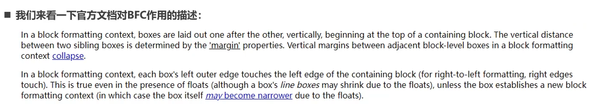
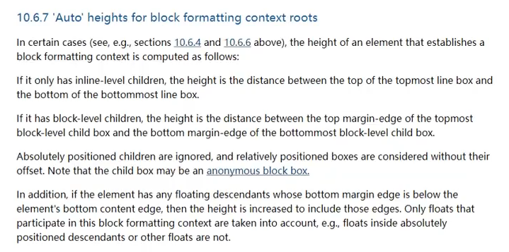

# BFC（块级格式化上下文）

## FC 是什么

FC 全称：`Formatting Context`，又称**格式化上下文**，元素在标准流里面都属于某一个FC。

- *BFC*：块级格式上下文，指的是一个独立的布局环境，*BFC* 内部的元素布局与外部互不影响。
- *IFC*：行内格式化上下文，将一块区域以行内元素的形式来格式化。
- *GFC*：网格布局格式化上下文，将一块区域以 *grid* 网格的形式来格式化
- *FFC*：弹性格式化上下文，将一块区域以弹性盒的形式来格式化

## BFC

W3C 官方解释为：BFC 它决定了元素如何对其内容进行定位，以及与其它元素的关系和相互作用，当涉及到可视化布局时，`Block Formatting Context`提供了一个环境，`HTML`在这个环境中按照一定的规则进行布局。

简单来说就是，`BFC`是一个**完全独立的布局环境**，`BFC`**内部的元素布局与外部互不影响**。


## 创建 BFC

下列方式会创建 BFC（块格式化上下文）：

- 根元素（`<html>`）
- 浮动元素（`float` 值不为 `none`）
- 绝对定位元素（`position` 值为 `absolute` 或 `fixed`）
- 行内块元素（`display` 值为 `inline-block`）
- 表格单元格（`display` 值为 `table-cell`，HTML 表格单元格默认值）
- 表格标题（`display` 值为 `table-caption`，HTML 表格标题默认值）
- 匿名表格单元格元素（`display` 值为 `table`、`table-row`、 `table-row-group`、`table-header-group`、`table-footer-group`（分别是 HTML table、tr、tbody、thead、tfoot 的默认值）或 `inline-table`）
- `overflow` 值不为 `visible`、`clip` 的块元素
- `display` 值为 `flow-root` 的元素
- 弹性元素（`display` 值为 `flex` 或 `inline-flex` 元素的直接子元素），如果它们本身既不是 flex、grid 也不是 table 容器
- 网格元素（`display` 值为 `grid` 或 `inline-grid` 元素的直接子元素），如果它们本身既不是 flex、grid 也不是 table 容器


## BFC 的作用



- 在BFC中，从包含块的顶部开始，盒子会在垂直方向上一个接着一个排布
- 盒子之间的距离用`margin`设置（本质是BFC在解析）
- <strong style="color:#DD5145">在同一个BFC里面，相邻盒子`margin`会折叠</strong>
- 在BFC中，每个元素的左边缘是紧诶着包含块的**左边缘**的


## BFC 的应用

- <strong style="color:#DD5145">解决`margin`的折叠问题</strong>

```html
<style>
    .container {
        overflow: auto;
    }
    /* box1 属于container创建的BFC */
    .box1 {
        height: 200px;
        width: 400px;
        background-color: orange;
        margin-bottom: 30px;
    }

    /* box2 属于 html创建的BFC */
    .box2 {
        height: 150px;
        background-color: aqua;
        margin-top: 50px;
    }
</style>

<div class="container">
    <div class="box1"></div>
</div>
<div class="box2"></div>
```

两个块级元素不属于同一个BFC，故`margin`不会折叠。

- <strong style="color:#DD5145">解决浮动高度塌陷问题</strong>



BFC解决高度塌陷需要满足的条件：

- 浮动元素的父元素触发BFC，形成独立的块级格式化上下文（BFC）
- 浮动元素的父元素的高度是`auto`，<strong style="color:#DD5145">`height`不设置，则默认为`auto`</strong>

BFC的高度是`auto`的情况下，计算高度如下：

- 如果只有`inline-level`，是行高的顶部和底部的距离
- 如果有`block-level`，是由**最低层的块的上边缘**和**最底层块的下边缘**之间的距离
- 如果有绝对定位元素，将被忽略
- 如果有浮动元素，那么会**增加高度**以包裹这些**浮动元素的下边缘**

```html
<style>
    .container {
        background-color: #999;
        overflow: auto;
    }

    .item {
        width: 400px;
        height: 200px;
        float: left;
        border: 1px solid #000;
        background-color: orange;
    }

    /* 清除浮动 */
    /* .clear_fix::after {
    content: "";
    display: block;
    clear: both;
    height: 0;
    visibility: hidden;
    } */
</style>

<div class="container clear_fix">
    <div class="item"></div>
    <div class="item"></div>
    <div class="item"></div>
    <div class="item"></div>
</div>
```


## 参考

[参考文章](https://blog.csdn.net/weixin_44165167/article/details/115617978)、[参考文章2](https://juejin.cn/post/7098689890933538853#heading-3)、[参考文章3](https://juejin.cn/post/6960866014384881671)