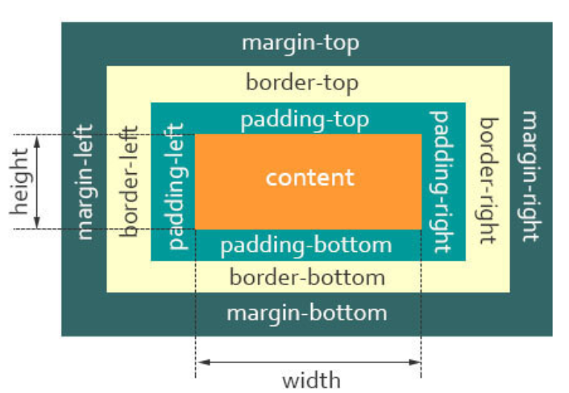
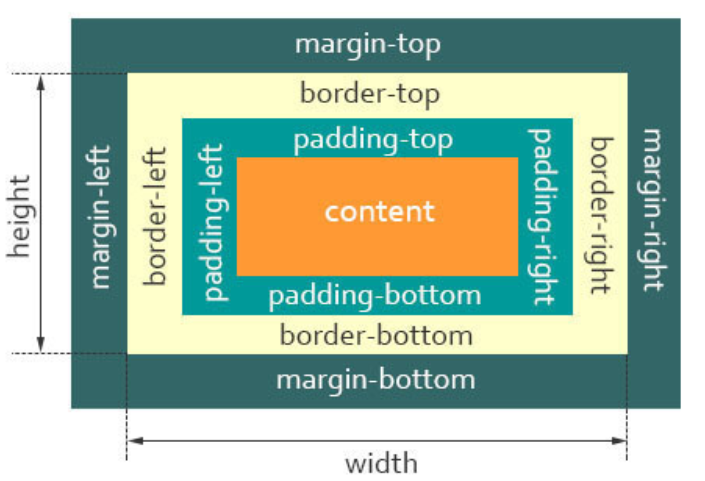

# 盒子模型

## 1.是什么

当对一个文档进行布局（layout）的时候，浏览器的渲染引擎会根据标准之一的 CSS 基础框盒模型（CSS basic box model），将所有元素表示为一个个矩形的盒子（box）

一个盒子由四个部分组成：**内容区(content)**、**内边距(padding)**、**边框(border)**、**外边距(margin)**。

- `content`，即实际内容，显示文本和图像
- `boreder`，即边框，围绕元素内容的内边距的一条或多条线，由粗细、样式、颜色三部分组成
- `padding`，即内边距，清除内容周围的区域，内边距是透明的，取值不能为负，受盒子的`background`属性影响
- `margin`，即外边距，在元素外创建额外的空白，空白通常指不能放其他元素的区域

**`border : <宽度> <线条图案> <颜色>;`**，例如 **`border: 1px solid orange;`**

- 1px 代表的是边框线的宽度
- solid 代表的是边框为实线；dashed虚线、dotted点划线、none不显示
- orange 代表的是边框线的颜色，这里的颜色也可以是rgba(114, 255, 96, 0.5)，0.5是颜色的透明度

**margin**是用来隔开**元素与元素的间距**；**padding**是用来隔开**元素与内容的间隔**。

使用 **margin、padding 简化** 写法注意事项：

- 如果只提供一个，将用于全部的四边。 
- 如果提供两个，第一个用于**上、下**，第二个用于**左、右**。 
- 如果提供三个，第一个用于**上**，第二个用于**左、右**，第三个用于**下**。 
- 如果提供全部四个参数值，将按<strong style="color:#DD5145">上、右、下、左</strong>的顺序（顺时针方向）作用于四边。 

盒子模型分为 W3C标准盒子模型 和 IE 怪异盒子模型

- 标准盒子模型：宽度 = 内容的宽度（content）+ border + padding + margin
- 低版本IE盒子模型：宽度 = 内容的宽度（content + padding + border）+ margin

可以通过 **`box-sizing`** 来改变元素的盒模型：

- **`box-sizing: content-box`** ：标准盒模型（默认值）

- **`box-sizing: border-box`** ：IE（替代）盒模型

## 2.标准盒子模型

标准盒子模型，是浏览器默认的盒子模型

## 3.怪异盒子模型

看看IE 怪异盒子模型的模型图：

