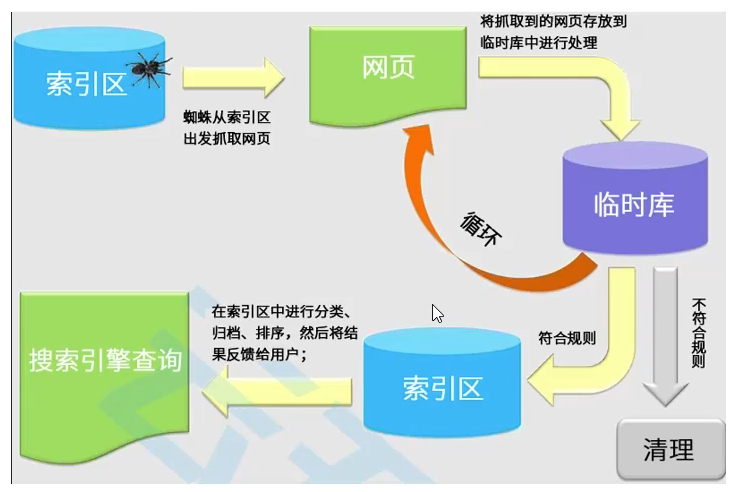

# CSS

## :star:CSS的属性继承

CSS的某些属性具有继承性（Inherited）：

- 如果一个属性具备继承性，那么在该元素上设置后，它的后代元素都可以继承这个属性
- 如果后代元素自己有设置该属性，则优先以自己的为准
- 常见的`font-size`、`font-family`、`font-weight`、`line-height`、`color`、`text-align`等等都具有继承性

注意：继承过来的是计算值，而不是设置值。

**强制继承**：不具备继承性的属性可以设置`inherit`，使其具备继承性。

```html
<style>
    .box {
        width: 300px;
        color: orange;

        border: 2px solid #999;
    }

    p {
        /* 强制继承 */
        border: inherit;
    }
</style>

<div class="box">
    <h1>我是h1元素</h1>
    <p>我是p元素</p>
</div>
```

结果：


## :star:CSS属性的层叠

CSS即为层叠样式表，

- 对于一个元素来说，相同一个属性我们可以通过不同的选择器给它进行多次设置
- 那么属性会被一层层覆盖上去
- 但最终只有一个会生效

那么哪一个会生效呢？

- 选择器的权重，权重大的生效，根据权重可以判断出优先级
- 先后顺序，权重相同时，后面设置的生效

选择器的权重：

- !important：10000
- 内联样式：1000
- id选择器：100
- 类选择器、属性选择器、伪类：10
- 元素选择器、伪元素：1
- 通配符：0


## :star:overflow属性

overflow用于控制内容溢出时的行为

- visible（默认值）：溢出的内容照样可见

- hidden：溢出的内容直接裁剪

- scroll：溢出的内容被裁剪，但可以通过滚动机制查看

  会一直显示滚动条区域，滚动条区域占用的空间属于width、height

- auto：自动根据内容是否溢出来决定是否提供滚动机制


## :star:display属性

CSS 属性值 `display` 为 `inline`，`inline-block`，`inline-table` 时，它就是<strong style="color:#DD5145">行内元素</strong>。

CSS 属性值 `display` 为 `block`，`list-item`，`table` 时，它就是<strong style="color:#32CD32">块级元素</strong>。

- none：隐藏
- <strong style="color:#DD5145">inline（默认）</strong>：设置元素为**行内元素**，一行可有多个行内块元素，**不可设宽高**
- <strong style="color:#DD5145">inline-block</strong>：设置元素为**行内块级元素**，既有行内元素的（一行可有多个）特性，又有块元素的（可设宽高）特性，**默认包裹内容**
- <strong style="color:#DD5145">inline-table</strong>：得到的是，外面是“内联盒子”，里面是“table盒子”
- <strong style="color:#32CD32">block</strong>：设置元素为**块级元素**，块级元素可以**独占一行**，可设宽高
- <strong style="color:#32CD32">list-item</strong>：指定对象为列表项目，为元素内容生成一个块型盒，随后再生成一个列表型的行内盒
- <strong style="color:#32CD32">table</strong>：指定对象作为块级元素的表格。类同于 html 标签 table
- flex：将对象作为弹性伸缩盒显示


## :star:vertical-align属性

用来指定行内元素（inline）或表格单元格（table-cell）元素的垂直对齐方式。

- **baseline（默认值）**：元素放置在父元素的基线上
- top：把元素的顶端与行中最高元素的顶端对齐
- middle：把此元素放置在父元素的中部 
- bottom：把元素的顶端与行中最低的元素的顶端对齐

使用场景：将图片或表单元素（行内块）和文字垂直居中。即 `vertical-align:middle`。


基线（baseline） 都是谁呢？

- 文本的 baseline 是字母 x 的下方
- inline-block 默认的 baseline 是 margin-bottom 的底部（没有，则是盒子的底部）
- inline-block 有文本时，baseline 是最后一行文本的字母 x 的下方


## :star:水平垂直居中方案

### 水平居中

**1.行内级元素：**

- 设置父元素的 `text-align: center;`

**2.块级元素：**

- 设置当前块级元素（宽度）`margin: 0 auto;`

**3.绝对定位：**

- 元素有宽度的情况下，`left: 0; right: 0; margin: 0 auto;`

**4.flex布局：**

- `justify-content: center;`

### 垂直居中

**1.绝对定位：**

- 元素有高度的情况下，`top: 0; bottom: 0; margin: auto 0;`

<strong style="color:#DD5145">缺点：必须使用定位（导致脱离标准流），必须给子元素设置高度</strong>

```html
<style>
    .container {
        position: relative;
        
        height: 300px;
        background-color: #999;
    }

    .box {
        width: 100px;
        height: 100px;
        
        position: absolute;
        top: 0;
        bottom: 0;
        margin: auto 0;
        background-color: orange;
    }
</style>

<div class="container">
    <div class="box"></div>
    aaa
</div>
```

结果：


**2.flex布局：**

<strong style="color:#DD5145">缺点：当前flex布局中的所有的元素都会被垂直居中</strong>

```html
<style>
    .container {
        width: 400px;
        height: 200px;
        background-color: #999;
        
        display: flex;
        align-items: center;
    }

    .box {
        background-color: orange;
    }
</style>

<div class="container">
    <div class="box">flex布局的垂直居中</div>
    aaa
</div>
```

结果：


**3.`top / translate`：**

需要做两件事情：

1. 让元素向下位移父元素的50%
2. 让元素向上位移自身的50%

```html
<style>
    .container {
        width: 400px;
        height: 200px;
        background-color: #999;
    }

    .box {
        display: inline-block;
        height: 100px;
        background-color: orange;

        /* 不能使用，margin-top的百分比是相对于包含块（父元素）的宽度 */
        /* margin-top: 50%; */
        position: relative;
        top: 50%;
        transform: translate(0, -50%);
    }
</style>

<div class="container">
    <div class="box">垂直居中</div>
</div>
```

结果：


### 水平垂直居中

#### 1.绝对定位居中

第一种（不存在兼容性问题）

```css
.box {
    width: 300px;
    height: 300px;
    background-color: orange;
    
    position: absolute;	// 子绝父相（父元素设置相对定位）
    top: 0;
    bottom: 0;
    left: 0;
    right: 0;
    margin: auto;
}
```

第二种


## :star:精灵图

精灵图（CSS Sprite）是一种CSS图像合成技术，将各种小图片合并到一张图片上，然后利用CSS的背景定位来显示对应的图片部分。

使用精灵图的好处：

- 减少网页的<strong style="color:#DD5145">HTTP请求数量，加快网页响应速度，减轻服务器压力</strong>
- 减少图片总大小
- 解决图片命名困扰

[精灵图制作](http://www.toptal.com/developers/css/sprite-generator)：http://www.toptal.com/developers/css/sprite-generator

[获取精灵图的位置](http://www.spritecow.com/)：http://www.spritecow.com/

```html
<style>
    .topbar {
        background-image: url(./images/topbar_sprite.png);
        background-repeat: no-repeat;
        display: inline-block;
    }

    i.logo-icon {
        background-position: 0 -19px;
        width: 157px;
        height: 33px;
    }

    i.hot-icon {
        background-position: -192px 0;
        width: 26px;
        height: 13px;
    }
</style>
<i class="topbar logo-icon"></i>
<i class="topbar hot-icon"></i>
```


## :star:回流与重绘

**什么是回流（重排，reflow）**

当一个元素自身的宽高、布局、显示或隐藏，或元素内部的文字**结构发生变化**，需要**重新构建页面**时，就产生了 **回流（重排）**。

- 回流会导致渲染树需要重新计算，开销比重绘大，所以我们要尽量避免回流的产生

- 重绘不一定需要回流，回流必然会导致重绘

**什么时候会进行回流**

- 添加或者删除可见的 DOM 元素的时候
- 元素的位置、尺寸发生改变
- 内容发生改变（文字数量或图片大小等等）
- 元素字体大小变化
- 设置style属性
- 激活CSS伪类（例如：:hover）
- 浏览器窗口尺寸改变
- 页面第一次渲染的时候，所有组件都要进行首次布局，这是开销最大的一次回流

**什么是重绘（repaint）**

是在一个元素的外观被改变所触发的浏览器行为，浏览器会根据元素的新属性重新绘制，使元素呈现新的外观

**什么时候会进行重绘**

列举一些相关的 CSS 样式：color、background、background-size、visibility、box-shadow


## :star:CSS中的函数

比如 rgb、rgba、translate、rotate、scale 等等

- var：使用CSS定义的变量
- calc：计算机CSS值，通常用于计算元素的大小或位置
- blur：毛玻璃（高斯模糊）效果
- gradient：颜色渐变函数

### var函数

CSS中可以自定义属性：

- 属性名需要以**两个减号(`--`)** 开始
- 属性值可以是任何有效的CSS值
- 我们可以通过`var`函数来使用

规则集定义的选择器，是自定义属性的可见作用域（只在选择器内部有效）

- 所以推荐将自定义属性定义在html中，或`:root`选择器

```html
<style>
    html {
        /* 定义了一个变量（CSS属性），只有后代元素可以使用 */
        --main-color: #DD5145
    }

    :root {
        /* 定义了一个变量（CSS属性），只有后代元素可以使用 */
        --main-color: #DD5145
    }

    .box {
        color: var(--main-color);
    }

    .title {
        color: var(--main-color);
    }
</style>
```


### calc函数

`calc()`函数允许在声明CSS属性值时进行一些计算

- 支持**加减乘除**的运算，`+`和`-`运算符的**两边必须要有空白字符**
- 通过用来设置一些元素的尺寸或位置

```html
<style>
    .box {
        width: 400px;
        height: 100px;
        background-color: #999;
        font-size: 0;
    }

    .item {
        height: 50px;
        display: inline-block;
    }

    .item1 {
        width: calc(400px - 100px);
        /* width的百分比相对于包含块（父元素） */
        width: calc(100% - 100px);
        background-color: orange;
    }

    .item2 {
        width: 100px;
        background-color: pink;
    }
</style>

<div class="box">
    <div class="item item1"></div>
    <div class="item item2"></div>
</div>
```

渲染结果：两个行内块级元素`div`之间有空隙，导致换行。

产生原因：HTML元素之间的空格最终会折算为一个字符，而这个字符在网页中显示会有一个宽度，这就造成间隙的产生。


解决方案一：删除元素与元素的之间的空格

```html
<div class="box">
    <div class="item item1"></div><div class="item item2"></div>
</div>
```

解决方案二：通过给父元素设置`font-size: 0;`，来取消元素与元素之间的间隙

```html
<style>
    .box {
        width: 400px;
        height: 100px;
        background-color: #999;
        font-size: 0;
    }
</style>
```


### blur函数

`blur()`函数将高斯模糊应用于输出图片或元素

- `blur(radius)`
- `radius`：模糊的半径，用于定义高斯函数的偏差值，偏差值越大，图片越模糊

```html
<style>
    img {
        width: 500px;
        filter: blur(2px);
    }
</style>


```

通常会和两个属性一起使用：

- `filter`：将模糊或颜色偏移等图形效果应用于元素
- `backdrop-filter`：为元素后面的区域添加模糊或其他效果

```html
<style>
    img {
        width: 500px;
        /* filter: blur(2px); */
    }

    .box {
        display: inline-block;
        /* filter: blur(5px); */
        position: relative;
    }

    .cover {
        position: absolute;
        left: 0;
        right: 0;
        top: 0;
        bottom: 0;
        background-color: rgba(0, 0, 0, 0.5);
        backdrop-filter: blur(10px);
    }
</style>

<div class="box">
    
    <div class="cover"></div>
</div>
```


### gradient函数

`<gradient>`是一种`<image>`CSS数据类型的子类型，用于表现两种或多种颜色的过渡转变

- CSS的`<image>`数据类型描述的是2D图形
- `<image>`常见的方式是通过`url`来引入一个图片资源

`<gradient>`常见的函数实现有下面几种：

- `linear-gradient()`：创建一个表示两种或多种颜色**线性渐变**的<strong style="color:#DD5145">图片</strong>
- `radial-gradient()`：创建一个图像，该图像是由原点出发的两种或多种颜色之间的逐步过渡组成
- `repeating-linear-gradient()`：创建一个由重复线性渐变组成的`<image>`
- `repeating-radial-gradient()`：创建一个由重复原点触发渐变组成的`<image>`

```html
<style>
    .box {
        width: 200px;
        height: 100px;
        background-image: linear-gradient(red, blue);
        /* 设置方向 */
        background-image: linear-gradient(to right, red, blue);
        background-image: linear-gradient(to right top, red, blue);
        /* 设置角度 */
        background-image: linear-gradient(-30deg, red, blue);
        background-image: linear-gradient(to right, red, blue 40px, orange 60%, purple 100%);
    }
</style>

<div class="box"> </div>
```

原点

```html
<style>
    .box {
        width: 200px;
        height: 100px;
        background-image: radial-gradient(blue, red);
        /* 设置位置 */
        background-image: radial-gradient(at 0% 50%, red, yellow);

    }
</style>

<div class="box"> </div>
```


## :star:浏览器前缀

有时候可能会看到有些CSS属性名前面带有：-o-、-xv-、-ms-、mso-、-moz-、-webkit-

官方文档专业术语：`vendor-specific extension`（供应商特点扩展）

为什么需要浏览器前缀？

- CSS属性刚开始并没有成为标准，浏览器为了防止后续会修改名字，故给新的属性添加了浏览器前缀

上述前缀叫做浏览器私有前缀，只有对应的浏览器才能解析使用：

- -o-、-xv-：Opera等
- -ms-、mso-：IE等
- -moz-：Firefox等
- -webkit-：Safari、Chrome等

注意：不需要手动添加，后面学习了模块化打包工具（如webpack）会自动添加浏览器前缀。

[Can I use](https://caniuse.com/) 网站可以查看浏览器对属性的兼容性


## :star:元素隐藏方法

方法一：`display:none`

- 元素显示，并且也不占据位置，<strong style="color:#DD5145">不占据任何空间</strong>（和不存在一样）

方法二：`visibility:hidden`

- 设置 hidden，虽然元素不可见，但是<strong style="color:#DD5145">会占据元素应该占据的空间</strong>
- 默认值为 visible

方法三：rgba设置颜色，将a的值设置为0

- rgba的a设置的是alpha值，可以设置透明度，<strong style="color:#DD5145">不影响子元素</strong>

方法四：`opacity:0`

- 设置整个元素的透明度，会影响所有的子元素 


**不同角度分析：**

- 结构： 

  **`display:none`**，会让元素完全从渲染树中消失，渲染时不占据任何空间，不能点击。

  **`visibility:hidden`**，不会让元素从渲染树消失，渲染时仍占据空间，只是内容不可见，不能点击。

  **`opacity:0`**，不会让元素从渲染树消失，渲染时仍占据空间，只是内容不可见，可以点击。

- 继承： 

  **`display:none`** 和 **`opacity:0`**，是非继承属性，子孙节点消失由于元素从渲染树消失造成，通过修改子孙节点属性无法显示。 

  **`visibility:hidden`**，是继承属性，通过设置 **`visibility: visible`** 可以让子孙节点显式。

- 性能： 

  **`display:none`**，修改元素会造成**文档回流**，不能读取到 **`display:none`** 元素内容，性能消耗较大。

  **`visibility:hidden`**，修改元素只会造成**该元素重绘**，能读取到 **`visibility:hidden`** 元素内容，性能消耗较少。

  **`opacity:0`**，修改元素会造成**该元素重绘**，性能消耗较少。


## :star:SEO优化

 搜索引擎优化（Search Engine Optimization）是通过了解搜索引擎的运作规则来调整网站，以及提高网站在有关搜索引擎内排名的方式

元素语义化有利于SEO




## 常见的浏览器内核有哪些？

- **Trident内核：**代表浏览器是ie浏览器，因此Trident内核又称E内核，此内核只能用于Windows平台，并且不是开源的。
- **Gecko内核：**代表浏览器是Firefox浏览器。Gecko内核是开源的，最大优势是可以跨平台。
- **Presto内核：**代表浏览器是Opera浏览器(中文译为“欧朋浏览器”)，Presto内核是世界公认最快的渲染速度的引擎，但是在2013年之后，Open宣布加入谷歌阵营，弃用了该内核。
- **Webkit** ：Webkit内核：代表浏览器是Safari(苹果的浏览器)以及低版本的谷歌浏览器，是开源的项目。
- **Blink内核：**由谷歌和Opera开发，2013年4月发布，现在Chrome内核是Blink（blink内核是从webkit内核分支出来的）。


## 浏览器是怎样解析CSS选择器？

CSS选择器的解析是<strong style="color:orange">从右向左</strong>（又称自底向上）解析的。

- 若从左向右的匹配，发现不符合规则，需要进行回溯，会损失很多性能。

- 若从右向左匹配，先找到所有的最右节点，对于每一个节点，向上寻找其父节点直到找到根元素或满足条件的匹配规则，则结束这个分支的遍历。

两种匹配规则的性能差别很大，是因为从右向左的匹配在第一步就筛选掉了大量的不符合条件的最右节点（叶子节点），而从左向右的匹配规则的性能都浪费在了失败的查找上面。

- 因为有公共节点，从右到左，只要有公共，就能共用，这样公共样式就很容易集合到同一分支上

[参考文章](https://blog.csdn.net/Android_boom/article/details/129584898)


## 表单中 readonly 和 disabled 的区别

- 共同点：能够使用户不能改变表单中的内容

- 不同点：
  1. readonly 只对 **input** 和 **textarea** 有效，但是 disabled 对所有的表单元素都是有效的，包括radio、checkbox
  2. readonly 可以获取到焦点，只是不能修改。disabled 设置的文本框无法获取焦点
  3. 如果表单的字段是 disabled，则该字段不会发送（表单传值）和序列化


