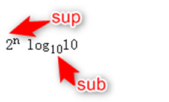

# HTML

## 什么是HTML

HTML（**H**yper**T**ext **M**arkup **L**anguage，超文本标记语言）是用来描述网页的一种语言，它不是一种编程语言，而是一种**标记**语言。


##  script 标签中 defer 和 async 的区别？

- **`<script>`** ：会阻碍 HTML 解析，只有加载好并执行完，脚本才会继续解析 HTML。
- **`<script async>`**：异步加载，可能会阻断 HTML 的解析。
- **`<script defer>`**：异步加载，元素解析完成之后执行。


[参考文章](https://juejin.cn/post/6894629999215640583)


## HTML 标签

[参考文章](https://blog.csdn.net/shengyin714959/article/details/125009120)、[参考文章2](https://blog.csdn.net/qq_56884023/article/details/124481401)、[参考文章3](https://blog.csdn.net/qq_38490457/article/details/108672791)、[MDN文档](https://developer.mozilla.org/zh-CN/)

## 标签的分类

1.带有标签体的标签，这种标签成对出现，有开始标签也有单独的结束标签

```html
<html></html>
<head></head>
<body></body>
```

2.没有标签体的标签（空标签，自结束标签）,开始在结束在同一个标签中

```html
<br />
<hr />
```

## 常用基本标签

### 1.标题标签（**h1—h6**）

### 2.字体标签 font

### 3.段落标签 p

- 将一段内容包裹起来，p标签本身没有效果，标签内的内容与标签外的内容空一行（自动换行）
- f每个 p 标签是**独占一行**的，p 标签之间，是有段落间距的

### 4.换行标签 br 

`<br />`换行标签，中间不空行

**5.水平线标签** hr

`<hr />`

### 6.图片标签 img

- img 也是一个单标签 (不需要结束标签)

```html

```

### 7.背景音乐 audio

```html
<audio src="音乐" autoplay="autoplay" loop="loop" />
```

### 8.视频标签 video

### 9.超链接标签 a

a 标签，也是**行内元素**，不是块级元素

用法1：超链接:主要用于将多个页面关联到一起，使用超链接可以直接访问另一个页面

用法2：用于锚记页面中的某个位置或其他页面中的某个位置

用法3：href 引用其他网站的地址或网站内部页面

### 10.表格标签 table

- `table`：表示整个表格
- `tr`：表示一行
- `td`：表示一列
- `th`：表示表头中的一列

`border` 加上边框，`width / height` 设置表格的尺寸

使用 `cellspacing` 属性去掉单元格之间的间隙

```html
<table border="2px" width = "500px" height = "300px" cellspacing = "0">
    <tr>
        <td>张三</td>
        <td>101</td>
    </tr>
    <tr>
        <td>李四</td>
        <td>102</td>
    </tr>
    <tr>
        <td>王五</td>
        <td>103</td>
    </tr>
</table>
```

### 11.列表标签

- 有序列表 **ol**，列表项 **li**

- 无序列表 **ul**

- 自定义列表：

  **dl**：外围标签

  **dt**：列表的标题标签

  **dd**：设置列表的具体列表项

```html
<dl>
    <dt>服务</dt>
    <dd>教学服务</dd>
    <dd>就业服务</dd>
</dl>
```

### 12.表单标签 form

表单是由窗体和控件组成的,一个表单一般应该包含用户填 写信息的输入框,提交按钮等，这些输入框,按钮叫做控件,表单很像容器,它能够容纳各种各样的控件。

表单标签的格式：

```html
< form action＝"url" method='get|post' name=“myForm” >< /form >
```

- name：表单提交时的名称
- action：提交到的地址
- method：提交方式，默认为 get

**get与post的区别：**

| **get**                                                      | **post**                                        |
| ------------------------------------------------------------ | ----------------------------------------------- |
| 表单数据以键值对的方式追加到URL中                            | 表单数据不会追加到URL，回附加到HTTP请求的正文中 |
| URL的长度受到限制（2048个字符）2kb数据                       | 没有限制，用来提交大量数据                      |
| 用于提交非敏感数据，提交的数据在浏览器历史记录中，安全性不好 | 可提交敏感数据（如密码）                        |

**一个完整的表单包含三个基本组成部分：**

- **表单标签**
  是指< form >标签本身,它是一个包含表单元素的区域,使用< form >< /form >定义
- **表单域**
  是< form >标签中用来收集用户输入的每一项,通常用input标签来定义,input标签有不同的类型,用以对用用户不同的数据(比如:文本域、下拉列表、单选框、复选框等等）
- **表单按钮**
  用来提交< form >表单中所有信息到服务器
  *表单域和表单按钮都属于表单元素

#### form表单属性

form支持HTML的全局属性：

| 属性           | 值                                                           | 描述                                                         |
| -------------- | ------------------------------------------------------------ | ------------------------------------------------------------ |
| accept         | MIME_type                                                    | HTML5 不支持。规定服务器接收到的文件的类型（文件是通过文件上传提交的） |
| accept-charset | character_set                                                | 规定服务器可处理的表单数据字符集                             |
| action         | URL                                                          | 规定当提交表单时向何处发送表单数据                           |
| autocomplete   | on / off                                                     | 规定是否启用表单的自动完成功能                               |
| enctype        | application / x-www-form-urlencoded multipart / form-data text / plain | 规定在向服务器发送表单数据之前如何对其进行编码（适用于 method=“post” 的情况） |
| method         | get / post                                                   | 规定用于发送表单数据的 HTTP 方法                             |
| name           | text                                                         | 规定表单的名称                                               |
| target         | _blank _self _parent _top                                    | 规定在何处打开 action URL                                    |


#### input

各种输入控件, 单行文本框, 按钮, 单选框, 复选框

> - type(必须有), 取值种类很多, button, checkbox, text, file, image, password, radio 等
> - name: 给 input 起了个名字，尤其是对于 单选按钮, 具有相同的 name 才能多选一
> - value: input 中的默认值
> - checked: 默认被选中，(用于单选按钮和多选按钮)
> - maxlength: 设定最大长度

单选框

搭配上 `label` 的单选框，`id` 属性。**任意 html 元素，都可以指定 id 属性，在一个页面中，id 的取值不能重复(唯一的)**

```html
<input type="radio" name = "gender" id = "male"> 
<label for="male">男</label>
<input type="radio" name = "gender" checked = "checked" id = "female"> 
<label for="female">女</label>
```

> 注意：单选框之间必须具备相同的 name 属性, 才能实现 **多选一** 效果

```html
<form action="test.html">
	<input type="text" name="username">
	<input type="submit" value="提交">
	<input type="reset" value="清空">
</form>
```

- 提交按钮必须放到 form 标签内. 点击后就会尝试给服务器发送
- 清空按钮必须放在 form 中. 点击后会将 form 内所有的用户输入内容重置

#### select

使用 select 表示一个下拉菜单，每个菜单项是一个option，可以使用 selected 来表示默认的选项是啥

```html
<form>
    <select>
        <option>--请选择年份--</option>
        <option selected = "selected">2001</option> <!--默认选项-->
        <option>2000</option>
        <option>2001</option>
        <option>2002</option>
        <option>2003</option>
    </select>
</form>
```

**textarea**：

- 多行的文本框。
- 文本域中的内容，就是默认内容，注意，空格也会有影响
- rows 和 cols 也都不会直接使用，都是用 css 来改的

### 13.无语义标签: div & span

- `div`：默认是一个**块级元素 (独占一行)**
- `span`：默认是一个**行内元素 (不独占一行)**

### 14.文本设置标签

`<b></b>`字体加粗，而 strong 标签是为了突出重点

`<i></i>`设置斜体，而 em 标签更容易被浏览器识别到

`<u></u>`设置文本下划线

`<s></s>`在文本上设置一个删除线

### 15.删除标签 del

一般用于价格删除线

### 16.居中标签 center

使文本居中

### 17.预格式化标签 pre

被包围在pre标签中的文本通常会保留空格和换行符， 而文本也会呈现出等宽字体。

### 18.上标&下标标签

`2<sup>n</sup>`：设置上标

`log<sub>10</sub>10`:设置下标




