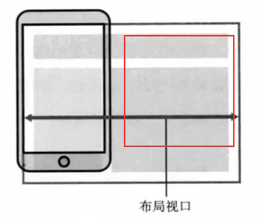
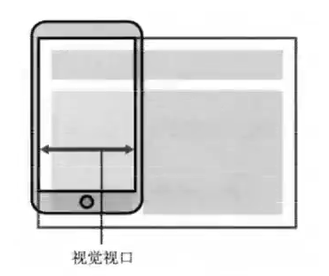

# 移动端适配方案

移动端开发目前主要包括三类：

- 原生App开发（iOS、Android、React Native、uniapp、Flutter 等等）
- 小程序开发（原生小程序、uniapp、Taro 等等）
- Web页面（移动端的Web页面，可以使用浏览器或webview浏览）

两个概念：

- 自适应：根据不同的设备屏幕大小来自动调整尺寸、大小
- 响应式：会随着屏幕的实时变动而自动调整，也是一种自适应

## :star:视口 viewport

在浏览器中，我们可以看到的区域就是视口（viewport），在PC端的页面中，不需要对视口进行区分，因为布局视口和视觉视口是同一个。

在移动端的网页中，默认情况下，布局视口大于视觉视口。

所以在移动端，我们可以划分为三种情况：

- 布局视口（layout viewport）
- 视觉视口（visual viewport）
- 理想视口（ideal viewport）

### 布局视口（layout viewport）

- 默认情况，一个PC端的网页在移动端如何显示呢？
  - 它会按照宽度为980px来布局一个页面的盒子和内容
  - 为了可以显示完整的页面，会对整个页面进行等比例缩小
- 相对于980px布局的这个视口，称为布局视口，默认宽度980px




### 视觉视口（visual viewport）

- 如果默认情况下，按照980px显示内容，那么右侧会有一部分区域无法显示，所以会等比例缩小
- 那么显示在可见区域的这个视口，称之为视觉视口




### 理想视口（ideal viewport）

- 默认情况下，`layout viewport`并不适合我们进行布局
- 我们可以对`layout viewport`进行宽度和缩放的设置，以满足需求
- 这个时候可以设置`meta`中的`viewport`


## :star:配置布局视口

```html
<meta name="viewport" content="width=980px, initial-scale=1.0">
<meta name="viewport" content="width=device-width, initial-scale=1.0, user-scalable=no">
<meta name="viewport" content="width=device-width, initial-scale=1.0, minimum-scale=1.0, maximum-scale=1.0">
```

设置属性：

| 值            | 可能的附加值                     | 说明                                                         |
| ------------- | -------------------------------- | ------------------------------------------------------------ |
| `width`       | 一个正整数或字符串 device-width  | 定义视口的宽度                                               |
| height        | 一个正整数或字符串 device-height | 定义视口的高度<br>（未被浏览器使用）                         |
| initial-scale | 一个 0.0-10.0 之间的正数         | 设备宽度与视口之间的缩放比例                                 |
| maximum-scale | 一个 0.0-10.0 之间的正数         | 定义缩放的最大值<br>必须大于等于minimum-scale                |
| minimum-scale | 一个 0.0-10.0 之间的正数         | 定义缩放的最小值<br>必须小于等于maximum-scale                |
| user-scalable | yes（默认）或 no                 | 设置为no，<strong style="color:#DD5145">用户将无法缩放当前页面</strong><br>有些浏览器会忽略此规则 |


## :star:响布局应式

### 1.百分比单位

不同属性的百分比值，相对的可能是不同参照物，所以百分之往往很难统一。

### 2.rem 单位

rem 单位是相对于`html`元素的`font-size`来设置的，如果想要在不同的屏幕下有不同的尺寸，需要动态修改`html`的`font-size`尺寸。

设计稿：375px 或 750px

rem 和 em 都是相对长度单位，区别是，rem相对于根元素字体大小进行计算的，浏览器的默认字体都是16px，故 1rem = 16px。

开发中，我们只需要考虑两个问题：

- 针对不同的屏幕，设置`html`不同的`font-size`（视口宽度 / 10）
- 将原来要设置的尺寸，转化为 rem 单位

#### font-size 尺寸

**方案一：媒体查询**

- 可以通过媒体查询来设置不同尺寸范围内的屏幕 html 的 font-size 尺寸
- 缺点：针对不同屏幕编写大量的媒体查询；如果动态改变尺寸，不会实时更新

**方案二：`lib-flexible`库**

**方案三：手动 JavaScript 动态计算**

```js
// 1.获取html的元素
const htmlEl = document.documentElement

// 实时监听屏幕宽度
function setRemUnit() {
    // 2.获取html的宽度（获取视口宽度）
    const htmlWidth = htmlEl.clientWidth
    // 3.根据宽度动态计算一个html的font-size的大小
    const htmlFontSize = htmlWidth / 10
    // 4.将font-size设置到html上
    htmlEl.style.fontSize = htmlFontSize + 'px'
}
// 保证第一次进入页面时，可以初始设置一次font-size
setRemUnit()
// 当屏幕尺寸发生变化时，实时修改html的font-size
window.addEventListener('resize', setRemUnit)
// 页面切换的时候，重新计算一次
window.addEventListener('pageshow', function (e) {
    if (e.persisted) {
        setRemUnit()
    }
})
```

html+css

```html
<style>
    body {
        /* 不想默认继承html的话，可以设置body默认font-size尺寸 */
        font-size: 0.5rem;
    }
    .box {
        width: 5rem;
        height: 5rem;
        background-color: orange;
    }

    p {
        font-size: 0.5rem;
    }
</style>

<div class="box"></div>
<p>我是文本</p>
<span>哈哈哈</span>
```


#### 单位换算

**方案一：手动换算**

- 比如有一个在 375px屏幕上，100px宽度和高度的盒子
- 我们需要将100px转换为对应的rem值（font-size：375 / 10 = 37.5）
- 100px / 37.5 = 2.6667rem

**方案二：less / scss 函数**

**方案三：VSCode插件`px to rem & rpx & vw (cssrem)`**

**方案四：`postcss-pxtorem`，在前端工程化开发，借助WebPack的工具来完成自动转换**


### 3.vw 单位

- vw：相对于视口的宽度，1vw 等于视口宽度的1%，即1vw = 3.75px（总视口宽度为100vw）
- vh：相对于视口的高度， 1vh 等于视口高度的1%（总视口高度为100vh）

```html
<style>
    .box {
        width: 26.6667vw;
        height: 26.6667vw;
        background-color: orange;
    }
</style>

<div class="box"></div>
```

将 `100px` 转换为 `26.6667vw` (当前设备宽度 `375px`, 基准字号为 `37.5px`)

就不需要前面那些js动态计算了


### vw和rem的对比

rem事实上是作为一种过渡方案，它利用的也是vw的思想

核心思想：将1rem等同于设计稿的1/10，在利用1rem计算相对于整个屏幕的尺寸大小

vw相比于rem的优势：

- 不需要去计算html的font-size大小，也不需要给html设置font-size
- 不会因为设置html的font-size大小，而必须给body再设置一个font-size，防止继承
- 不依赖font-size的尺寸，故不用担心某些原因html的font-size尺寸被篡改，页面尺寸混乱
- vw相比于rem更加语义化，1vw = 1/100的viewport的大小

> 但是如果你希望屏幕大到一定程度上，里面内容不想再放大，使用rem比较好（可以利用媒体查询限制font-siez大小）

#### 单位换算

**方案一：手动换算**

- 比如有一个在 375px屏幕上，100px宽度和高度的盒子
- 我们需要将100px转换为对应的vw值（font-size：375 / 100 = 3.75）
- 100px / 3.75 = 26.667rem

**方案二：less / scss 函数**

**方案三：VSCode插件`px to rem & rpx & vw (cssrem)`**

**方案四：`postcss-px-to-viewport-8-plugin`，在前端工程化开发，借助WebPack的工具来完成自动转换**


### 4.flex 弹性布局


## :page_facing_up:参考

参考文章：https://www.quirksmode.org/mobile/viewports2.html