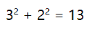
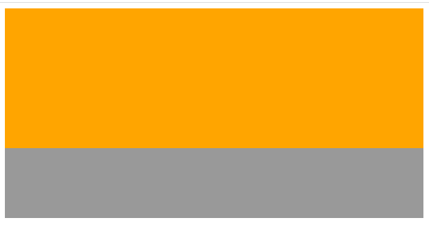
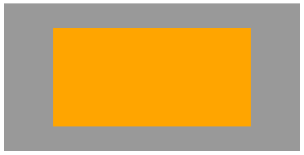
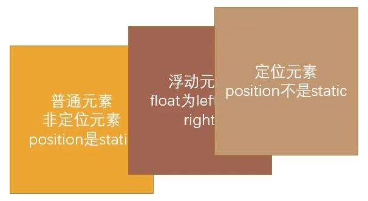
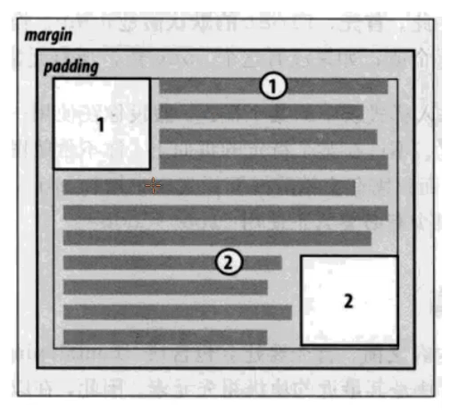
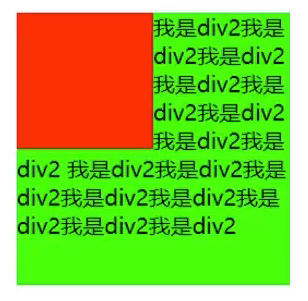
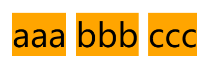
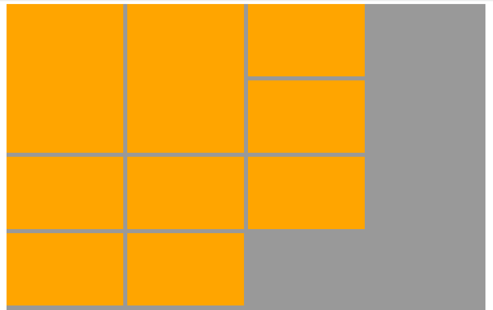
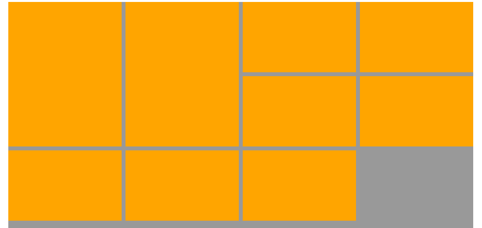
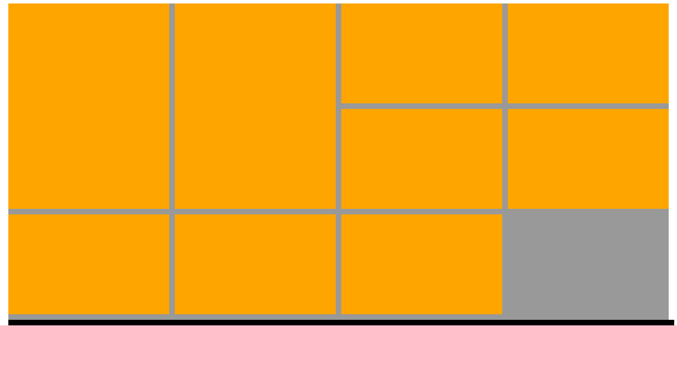

# Position定位

- 标准流布局
- 相对定位
- 固定定位
- 绝对定位
- 粘性定位
- z-index：只对定位元素有效

CSS 页面布局技术允许我们拾取网页中的元素，并且控制它们相对普通布局流（标准流）、周边元素、父容器或者主视口/窗口的位置。

技术布局从宏观上来说是受定位方案影响，定位方案包括：


## 标准流布局

默认情况下，元素都是按照**普通流（Normal Flow，也叫文档流，标准流布局）**进行排布的。

- 从左到右、从上到下按顺序排列
- 默认情况下，相互之间不存在层叠现象

在标准流中，可以使用`margin`、`padding`对元素进行定位，其中`margin`还可以设置为负数。

缺点：

- 设置一个元素的`margin`或`padding`，通常会**影响到标准流中其他元素**的定位效果
- 不便于实现元素层叠的效果

如果想要一个元素<strong style="color:#DD5145">脱离标准流</strong>，单独的对某一个元素进行定位：

- 我们可以使用`position`属性来进行设置

标准流有以下特性：

- 标准流中，所有的盒一个接一个排列
- `BFC` 中，盒子会**竖着**排列
- `IFC` 中，盒子会**横着**排列
- 静态定位中（`position` 为 `static`），盒的位置就是标准流里布局的位置
- 相对定位中（`position` 为 `relative`），盒的偏移位置由 `top`，`right`，`bottom`，`left` 定义， <br>**即使有偏移，仍然保留原有的位置，其它普通流不能占用这个位置**


## 定位技术（Position）

定位允许您从正常的标准流布局中取出元素，并使他们具有不同的行为：

- 例如，让在另一个元素的上面
- 或者，始终保持在浏览器视口内的同一位置

利用`position`可以对元素进行定位，有四种：**静态定位**，**相对定位**，**绝对定位**，**固定定位**。

- **static**（默认）：按照正常标准流进行排列，top, bottom, left, right 没有任何作用


### relative（相对定位）

元素不脱离标准流，定位参照对象是<strong style="color:#DD5145">元素自己原来的位置</strong>，可以通过 top, bottom, left, right 定位。

在不影响其他元素位置的前提下，对当前元素位置进行微调。

```html
<style>
    .box {
        font-size: 20px;
    }

    span {
        font-size: 12px;
        position: relative;
        bottom: 8px;
    }
</style>

<div class="box">
    3<span>2</span> + 2<span>2</span> = 13
</div>
```

结果：




### absolute（绝对定位）

元素<strong style="color:#DD5145">脱离标准流</strong>，参考距其最近一个不为`static`的父级元素通过 top, bottom, left, right 定位。

定位参照对象是<strong style="color:#DD5145">最邻近的祖先并且是一个定位元素</strong>，如果找不到这样的祖先元素，参考对象是**视口（viewport）**。

定位元素（positioned element），position值不为static的元素，即为relative、absolute、fixed的元素。

故**子绝父相**，祖先元素设置`position: relative;`，因为`relative`不会脱离标准流。


### fixed（固定定位）

元素<strong style="color:#DD5145">脱离标准流</strong>，可以通过 top, bottom, left, right 定位，当画布滚动时，固定不动。

与绝对定位方案类似，唯一的区别在于，定位参照对像是**视口（viewport）**


### sticky（粘性定位）

CSS3 新增的，设置了 sticky 值后，在屏幕范围（viewport）时该元素的位置并不受到定位影响（设置是 top、left 等属性无效）

当该元素的位置将要移出偏移范围时，定位又会变成 fixed，根据设置的 top、left 等属性形成固定位置的效果

```css
.nav{
    background-color: #f00;
    position: sticky;
    top: 0;
}
```

`sticky`是相对于最邻近的滚动祖先包含的滚动视口


## 绝对定位元素

绝对定位元素（即`position`设置为 absolute / fixed）的特点：

- 可以随意设置宽高，宽高默认由内容决定
- 不再受标准流的限制
  - 不再严格按照从上到下、从左到右排布
  - 不再严格区分块级(block)、行内级(inline)、行内块级（inline-block）的很多特性都会消失
- 不再给父元素汇报宽高数据
- 脱标元素的内容默认还是按照标准流布局

|          | 脱离标准流 | 定位元素 | 绝对定位元素       | 定位参照对象                                           |
| -------- | ---------- | -------- | ------------------ | ------------------------------------------------------ |
| static   | ❌          | ❌        | ❌                  | ❌                                                      |
| relative | ❌          | ✔️        | ❌                  | 元素自己原来的位置                                     |
| absolute | ✔️          | ✔️        | :heavy_check_mark: | 最邻近的祖先并且是一个定位元素<br>如果找不到，则为视口 |
| fixed    | ✔️          | ✔️        | ✔️                  | 视口                                                   |


对于绝对定位元素来说：

<strong style="color:#DD5145">定位参照对象的宽度 = left + right + margin-left + margin-right + 绝对定位元素的实际占用宽度</strong>

<strong style="color:#DD5145">定位参照对象的高度 = top + bottom + margin-top + margin-bottom + 绝对定位元素的实际占用高度</strong>

```html
<style>
    .container {
        width: 600px;
        height: 300px;
        background-color: #999;
        position: relative;
    }

    .box {
        /* width: 600px; */
        /* width: 100%; */
        height: 200px;
        background-color: orange;
 
        position: absolute;
        left: 0;
        right: 0;
    }
</style>

<div class="container">
    <div class="box">
    </div>
</div>
```

结果：

- container width = orange box width + left + right + margin-left + margin-right，（底层原理）
- 600 = auto(默认) + 0(设置) + 0(设置) + 0(默认) + 0(默认)，故 orange box width = 600px



```css
.box {
    width: 400px;
    height: 200px;
    background-color: orange;

    position: absolute;
    left: 0;
    right: 0;
    margin: 0 auto;
}
```

- 水平方向：600 = 400 + 0 +0 + auto + auto，实现水平居中（margin左右平分）


```css
.box {
    width: 400px;
    height: 200px;
    background-color: orange;

    position: absolute;
    left: 0;
    right: 0;
    top: 0;
    bottom: 0;
    margin: auto;
}
```

- 垂直方向：300 = 200 + 0 +0 + auto + auto，水平+垂直实现居中（margin上下平分）




## 浮动布局（Float）

- 浮动定位中，盒称为浮动盒（Floating Box）
- 盒位于当前行的开头或结尾
- 普通流会环绕在浮动盒周围，除非设置 `clear` 属性

### 认识浮动

`float`属性可以指定一个元素应沿着其容器的左侧或右侧放置，允许文本和内联元素环绕它

`float`属性最初只用于在一段文本内浮动图像，实现文字环绕的效果

- `none`，不浮动，默认值
- `left`，向左浮动
- `right`，向右浮动

绝对定位、浮动都会让元素<strong style="color:#DD5145">脱离标准流</strong>，以达到灵活布局的效果

### 浮动规则

**1.元素一旦浮动后，就会脱离标准流**

- 定位元素会层叠在浮动元素上面



**2.如果元素是向左（右）浮动，浮动元素的左（右）边界不能超出包含块的左（右）边界**



**3.浮动元素之间不能层叠**

- 如果一个元素浮动，另一个浮动元素已经在那个位置了，后浮动的元素将紧贴着前一个浮动元素
- 如果水平方向剩余的空间不够显示浮动元素，浮动元素将向下移动，直到有有充足的空间为止

**4.浮动元素不能与内级内容层叠，行内级内容会被浮动元素推出来**

- 比如行内级元素、iniline-block元素、块级元素的文件内容




### 浮动应用

解决行内级元素、iniline-block元素的**水平间隙问题**

```html
<style>
    span {
        background-color: orange;
        /* float: left; */
    }
</style>

<div class="box">
    <span>aaa</span>
    <span>bbb</span>
    <span>ccc</span>
</div>
```

换行符会被浏览器解析称为空格



将多个行内级元素中间的空格（间隙）去除的方法：

- 删除换行符（不推荐）
- 将父级元素的`font-size`设置为0，但是需要子元素设置回来
- 使用浮动


## 浮动练习

```html
<style>
    .content {
        width: 1190px;
        margin: 0 auto;
        background-color: #999;
        height: 1000px;
    }

    .wraaper {
        margin-right: -10px;
    }

    .item {
        width: 290px;
        background-color: orange;
        margin-bottom: 10px;
        /* 浮动 */
        float: left;
        margin-right: 10px;
    }

    .item.left {
        height: 370px;
    }

    .item.right {
        height: 180px;
    }
</style> 
<div class="content">
    <div class="wraaper">
        <div class="item left"></div>
        <div class="item left"></div>
        <div class="item right"></div>
        <div class="item right"></div>
        <div class="item right"></div>
        <div class="item right"></div>
        <div class="item right"></div>
        <div class="item right"></div>
        <div class="item right"></div>
    </div>
</div>
```

出现问题：



解决方法：父级盒子的宽度 = 子盒子 + margin-left + margin-right

content(1190) + wraaper(1200) + margin-right(-10)




## 浮动的问题

### 高度塌陷

浮动的元素会脱离标准流，不会向父元素汇报高度，就会导致高度塌陷。

一般解决方法是**清除浮动**

清浮动的目的：

- 让父元素计算总高度的时候，把浮动子元素的高度计算进去

### 清除浮动

<strong style="color:#DD5145">clear 属性</strong>：指定一个元素**是否必须移动**（清除浮动后）**到在它之前的浮动元素**的下面。

- `none`：默认值，无特殊要求
- `left`：要求元素的顶部 低于 之前生成的所有左浮动元素的底部
- `right`：要求元素的顶部 低于 之前生成的所有右浮动元素的底部
- `both`：要求元素的顶部 低于 之前生成的所有浮动元素的底部

方法一：利用<strong style="color:#DD5145">伪元素`::after`</strong>

```html
<style>
    /* 清除浮动 */
    .clear_fix::after {
        content: "";
        clear: both;
        /* 伪元素是行内级非替换元素（没有宽度） */
        display: block;
        
        /* 浏览器兼容性 */
        visibility: hidden;
        height: 0;
    }

    .clear_fix {
        *zoom: 1;
        /* IE6/7兼容性 */
    }
</style>

<div class="content">
    <div class="wraaper clear_fix">
        <!-- ... -->
    </div>
</div>
```


方法二：给父元素设置固定高度（不推荐）

方法三：在父元素最后增加一个空的块级子元素，并设置`clear: both;`（不推荐）

- 会增加很多无意义的空标签
- CSS中的浮动产生的问题，通过增加HTML元素来解决，违反了结构与样式分离的原则

```html
<style>
    /* ... */
    .line {
        height: 10px;
        background-color: #000;
        clear: both;
    }

    .other {
        height: 100px;
        background-color: pink;
    }
</style>

<div class="content">
    <div class="wraaper">
        <!-- ... -->
        <div class="line"></div>
    </div>
</div>
<div class="other"></div>
```




## 参考

[参考文章](https://juejin.cn/post/6960866014384881671#heading-7)、[参考文章](https://juejin.cn/post/6960866014384881671#heading-10)