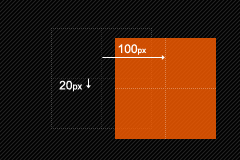

# Transform

[参考文章](https://blog.csdn.net/chelen_jak/article/details/82754535)、[参考文章2](http://www.w3cplus.com/content/css3-transform)、[参考文章3](https://blog.csdn.net/qq_45025670/article/details/125588381?ops_request_misc=%257B%2522request%255Fid%2522%253A%2522168263808516800180659247%2522%252C%2522scm%2522%253A%252220140713.130102334..%2522%257D&request_id=168263808516800180659247&biz_id=0&utm_medium=distribute.pc_search_result.none-task-blog-2~all~top_positive~default-1-125588381-null-null.142^v86^insert_down1,239^v2^insert_chatgpt&utm_term=transform&spm=1018.2226.3001.4187)

Transform 字面上就是变形，改变的意思。

在CSS3中transform主要包括以下几种：**旋转rotate**、**扭曲skew**、**缩放scale**和**移动translate**以及**矩阵变形matrix**。

## 一、旋转 rotate

**`rotate(<angle>)`**：通过指定的角度参数对原元素指定一个 **2D rotation（2D 旋转）**，需先有 transform-origin 属性的定义。

> 默认原点是盒子中心，改变转换原点，**`transform-origin: <原点水平位置> <原点垂直位置>;`**
>
> **`transform: rotate(角度)`**  ，角度单位是deg，取值正负均可 ，取值为正，顺时针旋转  取值为负，逆时针旋转
>
> 方位名词(left,top,right,bottom,center)，像素单位数值，百分比(参照盒子自身尺寸计算)

## 二、移动 translate

改变盒子在平面内的形态（位移，旋转，缩放），**`transform: translate(水平移动距离，垂直移动距离);`**

移动 translate 分为三种情况：

> **`translate(x,y)`**水平方向和垂直方向同时移动（也就是X轴和Y轴同时移动）
>
> **`translateX(x)`**仅水平方向移动（X轴移动）
>
> **`translateY(Y)`**仅垂直方向移动（Y轴移动）

## 三、缩放 scale

**`transform: scale(x轴缩放倍数,y轴缩放倍数);`** 一般情况下，只为 scale 设置一个值，表示 x轴 和 y轴 等比例缩放

**`transform: scale(缩放倍数)`** scale值大于1 表示放大  scale值小于1 表示缩小

缩放 scale 分为三种情况：

> **`scale(<number> [, <number>])`**基中 X 表示水平方向缩放的倍数，Y 表示垂直方向的缩放倍数，而 Y是一个可选参数 如果没有设置 Y 值，则表示 X，Y 两个方向的缩放倍数是一样的。并以 X 为准
>
> **`scaleX(<number>) `**只在X轴(水平方向)缩放元素，他的默认值是(1,1)
>
> **`scaleY(<number>) `**只在Y轴(垂直方向)缩放元素，他的默认值是(1,1)

## 四、扭曲 skew

## 五、矩阵 matrix