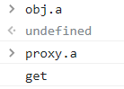
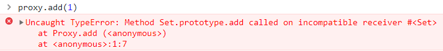
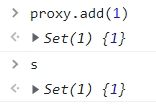
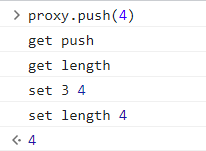
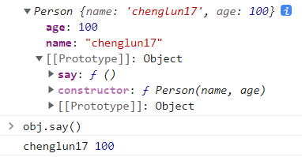
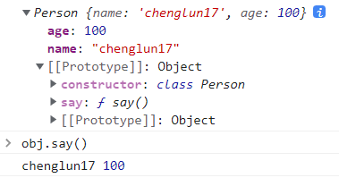

# ES6+ 新增

ECMAScript5，即ES5，是ECMAScript的第五次修订，于2009年完成标准化

ECMAScript6，即ES6，是ECMAScript的第六次修订，于2015年完成，也称ES2015

------


1. 字面量增强
2. let 和 const 命令，用来声明变量，两个都有块级作用域。
3. 函数的扩展，箭头函数，**`() => {}`**。
4. 模板字符串，**` 反引号`` `**，可以当作普通字符串使用，也可以用来定义多行字符串。用 **`${}`** 来界定。
5. 解构赋值，允许按照一定模式，从数组和对象中提取值，对变量进行赋值。
6. 扩展运算符 **`...`**，可以将数组或对象里面的值展开，还可以将多个值收集为一个变量。
7. **`Iterator`** 迭代器（遍历器），一种新的遍历机制。
8. **`for of`** 循环，可以遍历数组、Set、Map结构、某些类似数组的对象、对象，以及字符串。
9. Set 数据结构，类似数组，但所有的数据都是唯一的，没有重复的值。它本身是一个构造函数。
10. Map 数据结构，类似对象，但所有的数据都是唯一的，没有重复的值。它本身是一个构造函数。
11. Symbol 是 ES6 引入了一种新的原始数据类型，表示独一无二的值。
12. 将 Promise 对象纳入规范，提供了原生的 Promise 对象，是异步编程的一种解决方案。
13. Generator 函数是 ES6 提供的一种异步编程解决方案，语法行为与传统函数完全不同。
14. [Proxy 代理](#proxy代理)，监听对象的操作，然后可以做一些相应事情。
15. Reflect 对象与 Proxy 对象一样，也是 ES6 为了操作对象而提供的新 API。
16. [Class 的基本使用](#class的基本使用)，新增的 **`class`** 可以看作是构造函数的语法糖。
17. Class 类的继承，ES6 中不再像 ES5 一样使用原型链实现继承，而是引入 Class 这个概念。
18. 引入 [Module 模块](#module语法) 的概念，**`import`** 导入、**`export`** 导出。
19. Module 的加载实现
20. 修饰器 @，Decorator是一个函数，用来修改类、方法的行为。修饰器本质就是编译时执行的函数。
21. ES8新增 async、await，内置的自动执行器，它就是 Generator 函数的语法糖。
22. ES10新增 `flat` 和 `flatMap`
23. ES11新增，可选链（Optional Chaining）
24. 大整数类型 **`BigInt`**
25. 空值合并运算符（Nullish Coalescing Operator）


## :star:字面量增强

**property shorthand**（属性的简写）

```js
const name = 'chenglun17'
const age = 18
const obj = {
    name: name,
    age: age
}
// 可以简写为
const obj = {
    name,
    age
}
```

**method shorthand**（方法的简写）

```js
const obj = {
    foo: function() {}
    // 可以简写为
    foo() {}
}
```

**computed property name**（计算属性名），它可以在对象字面量中动态计算属性名称。

可以直接在字面量定义中使用计算属性，只要使用`[]`即可，我们甚至可以在`[]`中书写表达式：

```js
const name = '名字'

const person = {
    [name]: 'chenglun17',
    ['last' + 'name']: '不知道',
    // 方法也可以用这样的方式定义
    ['say' + ' Hello']() {
        console.log('hello')
    }
}

console.log(person) // {名字: 'chenglun17', real name: '不知道', say Hello: ƒ}
console.log(person['名字']) // chenglun17
console.log(person['real name']) // 不知道
console.log(person['say Hello'])
```


## :memo:补充知识

浏览器会在计算机内存中分配一块内存，专门用来供代码执行的 **栈内存**，称作 **执行环境栈 ECStack**，同时会创建一个 **全局对象 GO**，将内置的属性方法（`isNaN`、`setInterval`、`setTimeout`... ）存放到一块单独的堆内存空间，并且使用 **window** 指向全局对象。

在执行代码前，还需要创建一个**全局执行上下文 EC(G)**，创建完成后，进入到栈内存中去执行 **进栈**，在当前全局执行上下文中，因为会创建很多变量并且赋值，所以会创建一个**变量对象 VO** 来进行保存，在函数私有上下文中的变量对象叫做 **活动对象 AO** （ps: 每个执行上下文都有一个单独的变量对象）。

- **执行环境栈 ECStack**：专门用来供代码执行的栈内存

- **全局对象 GO（Global Object）**：存放内置的属性方法，window 指向

- **全局执行上下文 EC(G)（Execution Context Global）** ：页面加载后进栈、销毁后出栈

- **变量对象 VO（Variable Object）**： 存放当前执行上下文中创建的变量和值

  最新标准ECMA标准中已经修改为 **变量环境 VE（VariableEnvironment）**

- **活动对象 AO（Activation Object）**： 函数私有上下文中的变量对象


[参考文章](https://blog.csdn.net/weixin_39762001/article/details/110747455)、[参考文章](https://blog.csdn.net/QinGP97/article/details/127476977)、[参考文章](https://juejin.cn/post/6844904094318985230)


## :star:var / let / const 区别

### 2.1 作用域提升的区别

- `var` 是**全局变量**，存在变量提升（作用域提升），可以先使用再声明，也可以**重复声明**，但`let`、`const`<strong style="color:#DD5145">不允许重复声明变量</strong>。

- 通过 `let` 和 `const` 关键字声明的变量也会提升（有争议），但是和 `var` 不同，它们不会被**初始化**。

  在我们声明（初始化）之前是不能访问它们的，这个行为被称之为<strong style="color:#DD5145">暂时性死区（Temporal Dead Zone，TDZ）</strong>。

- `let` 和`const`必须先声明再使用，其中`let`可以重新赋值。

- `const` 定义的是常量，不能修改，如果定义的是对象，可以修改对象内部的数据。且**声明之后必须赋值**，否则会报错。

```js
console.log(foo)
var foo = 'foo'	// undefined

console.log(foo) // 执行这一行代码时，foo已经被创建出来了，但是不能被访问，即暂时性死区
const foo = 'foo'	// Uncaught ReferenceError: Cannot access 'foo' before initialization
```


### 2.2 window 对象的区别

- 在全局通过 `var` 来声明一个变量，事实上会在 window 上添加一个属性。
- `let`、`const`是不会给 window 上添加任何属性的。
- 以前的 var 声明的变量是放在 window 对象的，现在 let 不是了，放在 `varibles_` 对象，但是 var 声明的依然在 window 上。


### 2.3 块级作用域的区别

- 通过 `let` 和 `const` 关键字声明的变量是拥有**块级作用域**（指的是任何在 { } 中的内容），就会形成封闭作用域。

ES6 之前只有两种作用域：**全局作用域** 和 **函数作用域**

ES6 的代码块级作用域对 let / cosnt / function / class 声明的类型是有效的

不同的浏览器有不同实现（大部分力量为了兼容以前的代码，让 function 是没有块级作用域的）


## :star:函数的扩展

### 函数的默认值

ES6 之前，不能直接为函数的参数指定默认值，只能采用变通的方法。

```js
function log(x, y) {
    y = y || 'World'
    console.log(x, y)
}

log('Hello') // Hello World
log('Hello', 'China') // Hello China
log('Hello', '') // Hello World
```

<strong style="color:#DD5145">默认情况下，如果不给函数传参，参数的值将为`undefined`。</strong>

ES6 允许为函数的参数设置默认值，即直接写在参数定义的后面。

```js
function log(x, y = 'World') {
    console.log(x, y)
}

log('Hello') // Hello World
log('Hello', 'China') // Hello China
log('Hello', '') // Hello
```

参数默认值可以与解构赋值的默认值，结合起来使用。

```js
function foo({ x, y = 5 }) {
    console.log(x, y)
}

foo({}) // undefined 5
foo({x: 1}) // 1 5
foo({x: 1, y: 2}) // 1 2
foo() // TypeError: Cannot read property 'x' of undefined
```


### 剩余参数 rest

ES6 引入 rest 参数（形式为`...变量名`），用于获取函数的多余参数，这样就不需要使用`arguments`对象了。

rest 参数搭配的变量是一个数组，该变量将多余的参数放入数组中。

- `...` 是语法符号，剩余参数的值是一个包含所有剩余参数的数组，**并且只能作为最后一个参数**
- 在**函数内部使用**，借助 **`...`** 获取的剩余实参，是一个 **真数组**
- 开发中，建议使用 剩余参数

```js
function getSum(a, b, ...rest) {
    console.log(rest)	// 使用的时候不需要加 ...
}
getSum(3, 4, 5, 6, 7)	// 输出的是一个数组 [5, 6, 7]
```


### 严格模式

从 ES5 开始，函数内部可以设定为严格模式。

```js
function doSomething(a, b) {
    'use strict';
    // code
}
```

ES2016 做了一点修改，规定只要函数参数使用了**默认值、解构赋值、或者扩展运算符**，那么函数内部就不能显式设定为严格模式，否则会报错。


### name 属性

函数的`name`属性，返回该函数的函数名。

```js
function foo() {}
foo.name // 'foo'
```

这个属性早就被浏览器广泛支持，但是直到 ES6，才将其写入了标准。

需要注意的是，ES6 对这个属性的行为做出了一些修改。如果将一个匿名函数赋值给一个变量，ES5 的`name`属性，会返回空字符串，而 ES6 的`name`属性会返回实际的函数名。

```js
var f = function () {}

// ES5
f.name // ''

// ES6
f.name // 'f'
```


### 箭头函数

1. 使用了箭头函数，this 就不是指向 window，它只会在自己作用域的上一层继承 this（指向是可变的）。
2. 不能够使用 `arguments` 对象。取而代之使用的是 **`rest`** 参数（即剩余参数 **`...`**）解决。
3. 不能用作构造函数，即不能够使用 new 命令，否则会抛出一个错误。
4. 不可以使用 yield 命令，因此箭头函数不能用作 Generator 函数。
5. 箭头函数没有 prototype


## :star:字符串模板

使用 **反引号 \` `** 来编写字符串，称之为**模板字符串**，内容拼接变量时，用 `${ expression }` 嵌入动态的内容。

```js
tagFunction`string text ${expression} string text`
```

- **expression**：要插入当前位置的表达式，其值被转换为字符串 或 传递给 tagFunction。
- **tagFunction**：如果指定，将使用模板字符串数组和替换表达式调用它，返回值将成为模板字面量的值。

另一种用法：调用函数的方式，**标签模板字符串**

```js
function getPersonInfo(one, two, three) {
  console.log(one)	 // 第一个参数，依然是模板次字符串中整个字符串，只是被${}切割成三份，放入到了数组中
  console.log(two)	 // 第二个参数，模板字符串中第一个${}
  console.log(three) // 第三个参数，模板字符串中第二个${}
}

const person = 'Lydia'
const age = 21

getPersonInfo`${person} is ${age} years old` 

// ['', ' is ', ' years old']
// "Lydia"
// 21
```

如果使用标记模板字面量，第一个参数的值总是**包含字符串的数组**。其余的参数获取的是传递的**表达式的值**！

[参考文章-例17](https://github.com/lydiahallie/javascript-questions/blob/master/zh-CN/README-zh_CN.md)


## :star:解构赋值

解构赋值是一种快速为变量赋值的简洁语法，本质上仍为变量赋值。

### 1.数组解构

数组结构是将数组的单元值快速批量赋值给一系列变量的简洁语法。

- **赋值运算符`=`** 左侧的 **`[]`** 用于批量声明变量，右侧数组的单元值将被赋值给左侧的变量
- 变量的顺序对应数组单元值的位置依次进行赋值操作

```javascript
cosnt arr = [100, 60, 80]
const [max, min, avg] = arr
// 或
const [max, min, avg] = [100, 60, 80]
```

典型应用，交换2个变量

```javascript
const a = 1
const b = 2;	// 必须有分号;
[b, a] = [a, b];
console.log(a, b) // 2 1
```


```js
[y] = [1, 2, 3, 4, 5];
console.log(y) // 1
```


前面必须加分号情况：

1. **立即执行函数**

```javascript
(function t() {})();
// 或者
;(function t() {})()
```

2. **数组解构**

```javascript
// 数组开头的，特别是前面有语句的一定注意加分号
;[b, a] = [a, b]
```


### 2.对象解构

对象结构是将对象属性和方法快速批量赋值给一系列变量的简洁语法。

- **赋值运算符`=`** 左侧的 **`{}`** 用于批量声明变量，右侧对象的属性值将被赋值给左侧的变量
- 对象属性的值将被赋值给与**属性名相同的变量**
- 注意解构的变量名不要和外面的变量冲突，否则报错
- 对象中找不到与变量名一致的属性时变量值为 undefined

```javascript
const { uname, age } = { uname: 'pink老师', age: 18}
console.log(uname)	// pink老师
console.log(age)	// 18
```

将旧变量名改名为新变量名，并赋值：

```javascript
// 旧变量名: 新变量名
const { uname: username, age } = { uname: 'pink老师', age: 18}
console.log(uname)	// pink老师
console.log(age)	// 18
```


### 3.数组对象解构

```javascript
const pig = [{
    name: '佩奇',
    age: 6
}]
const [{ name, age }] = pig
console.log(name, age)	// 佩奇 6
```

多级对象解构：

```javascript
const pig = {
    name: '佩奇',
    family: {
        mother: '猪妈妈',
        father: '猪爸爸',
        brother: '乔治'
    },
    age: 6
}
// 若外层是数组，则在外面再加一层数组[]
const { name, family: { mother, father, brother } } = pig
console.log(name)
```


## :star:扩展 (展开) 运算符

展开语法（Spread syntax）：

- 可以在函数调用 / 数组构造时，将数组表达式或者 String 在语法层面展开
- 还可以在构造字面量对象时，将对象表达式按 key-value 的方式展开

展开语法的使用场景：

- 在函数调用时使用
- 在数组构造时使用
- 在构造数组字面量是，也可以使用展开运算符，ES2018（ES9）中新增的

------

扩展运算符可以将字符串映射成一个一个元素，或将一个数组转为用逗号分隔的参数序列，或合并数组或对象，或实现数组的简单复制。

通过扩展运算符实现的是<strong style="color:#DD5145">浅拷贝</strong>，修改了引用指向的值，会同步反映到新数组。

```js
[...'hello']
// ['h', 'e', 'l', 'l', 'o']

console.log(1, ...[2, 3, 4], 5)
// 1 2 3 4 5

const arr1 = ['a', 'b']
const arr2 = ['c']
[...arr1, ...arr2] // ['a', 'b', 'c']

// 可以复制对象中的键值对，然后把它们加到另一个对象里去
const obj1 = { name: 'chenglun17', age: 18}
const person = { admin: true, ...obj1} // {admin: true, name: 'chenglun17', age: 18}

const a1 = [1, 2];
const [...a2] = a1;
// [1, 2]
a1[1] = 20	// 修改a1，会影响到a2（浅拷贝）
console.log(a2)
// [1, 20]
```


## :star:迭代器 Iterator

### 1.基本概念

迭代器（遍历器）`Iterator`是一种**遍历机制**。它是一种**接口**，为**不同的数据结构**提供**统一的访问机制**。

任何数据结构只要部署 `Iterator` 接口，就可以完成遍历操作（即依次处理该数据结构的所有成员）。

`Iterator` 的作用有三个：

1. 是为各种数据结构，提供一个统一的、简便的访问接口
2. 是使得数据结构的成员能够按某种次序排列
3. 是 ES6 创造了一种新的遍历命令`for...of`循环，`Iterator` 接口主要供`for...of`使用


### 2.Iterator 遍历过程

`Iterator` 的遍历过程如下：

- 创建一个指针对象，指向当前数据结构的起始位置。也就是说，<strong style="color:#DD5145">迭代器对象的本质是一个指针对象</strong>
- 第一次调用指针对象的`next`方法，可以将指针指向数据结构的第一个成员
- 第二次调用指针对象的`next`方法，指针就指向数据结构的第二个成员
- 不断调用指针对象的`next`方法，直到它指向数据结构的结束位置

每一次<strong style="color:#DD5145">调用`next`方法</strong>，都会**返回数据结构的当前成员的信息**，包含`value`和`done`两个属性的对象。

- `value`属性是当前成员的值
- `done`属性是一个布尔值，表示遍历是否结束，即是否还有必要再一次调用`next`方法

下面是一个模拟`next`方法返回值的例子。

```js
function makeIterator(array) {
    let nextIndex = 0
    return {
        next: function() {
            return nextIndex < array.length ?
                {value: array[nextIndex++], done: false} :
            {value: undefined, done: true};
        }
    }
}

const it = makeIterator(['a', 'b'])

it.next() // { value: "a", done: false }
it.next() // { value: "b", done: false }
it.next() // { value: undefined, done: true }
```

上面代码定义了一个`makeIterator`函数，它是一个遍历器生成函数，作用就是返回一个遍历器对象。对数组`['a', 'b']`执行这个函数，就会返回该数组的遍历器对象（即指针对象）`it`。


### 3.默认 Iterator 接口

`Iterator` 接口为所有数据结构，提供了一种统一的访问机制，即`for...of`循环（详见下文）。

当使用`for...of`循环遍历某种数据结构时，该循环会自动去寻找 `Iterator` 接口。

ES6 规定，默认的 Iterator 接口部署在数据结构的`Symbol.iterator`属性，或者说，一个数据结构只要具有`Symbol.iterator`属性，就可以认为是 “可遍历的”。

原生具备`Iterator`接口的数据结构如下：

- String、Array、Map、Set
- TypedArray，字符串是一个类似数组的对象，也原生具有`Iterator`接口
- 函数的 arguments 对象
- NodeList 对象

<strong style="color:#DD5145">对象默认不是可迭代的</strong>


### 4.调用 Iterator 接口的时机

有些场合会默认调用 Iterator 接口（即`Symbol.iterator`方法），除了下文会介绍的`for...of`循环，还有几个别的场合。

#### （1）解构赋值

对数组和 Set 结构进行解构赋值时，会默认调用`Symbol.iterator`方法。

```js
let set = new Set().add('a').add('b').add('c')

let [x, y] = set
// x='a'; y='b'

let [first, ...rest] = set
// first='a'; rest=['b','c']
```

#### （2）扩展运算符

扩展运算符`...`，也会调用默认的`Iterator`接口。

```js
// 例一
var str = 'hello';
[...str] //  ['h','e','l','l','o']

// 例二
let arr = ['b', 'c'];
['a', ...arr, 'd']
// ['a', 'b', 'c', 'd']
```

任何部署了`Iterator`接口的数据结构，都可以转为数组。也就是说，只要某个数据结构部署了`Iterator`接口，就可以对它使用扩展运算符，将其转为数组。

#### （3）yield*

`yield*`后面跟的是一个可遍历的结构，它会调用该结构的遍历器接口。

```js
let generator = function* () {
  yield 1
  yield* [2,3,4]
  yield 5
}

var iterator = generator()

iterator.next() // { value: 1, done: false }
iterator.next() // { value: 2, done: false }
iterator.next() // { value: 3, done: false }
iterator.next() // { value: 4, done: false }
iterator.next() // { value: 5, done: false }
iterator.next() // { value: undefined, done: true }
```

#### （4）其他

由于数组的遍历会调用遍历器接口，所以任何接受数组作为参数的场合，其实都调用了遍历器接口。下面是一些例子。

- for...of
- Array.from()
- Map(), Set(), WeakMap(), WeakSet()（比如`new Map([['a',1],['b',2]])`）
- Promise.all()
- Promise.race()


### 5.return()，throw()

遍历器对象除了具有`next()`方法，还可以具有`return()`方法和`throw()`方法。如果你自己写遍历器对象生成函数，那么`next()`方法是必须部署的，`return()`方法和`throw()`方法是否部署是可选的。

`return()`方法的使用场合是，如果`for...of`循环提前退出（通常是因为出错，或者有`break`语句），就会调用`return()`方法。如果一个对象在完成遍历前，需要清理或释放资源，就可以部署`return()`方法。

注意，`return()`方法必须返回一个对象，这是 Generator 语法决定的。

`throw()`方法主要是配合 Generator 函数使用，一般的遍历器对象用不到这个方法。


## :star:for...of 循环

ES6 借鉴 C++、Java、C# 和 Python 语言，引入了`for...of`循环，作为遍历所有数据结构的统一的方法。

一个数据结构只要部署了`Symbol.iterator`属性，就被视为具有 iterator 接口，就可以用`for...of`循环遍历它的成员。也就是说，`for...of`循环内部调用的是数据结构的`Symbol.iterator`方法。

`for...of`循环可以使用的范围包括数组、Set 和 Map 结构、某些类似数组的对象（比如`arguments`对象、DOM NodeList 对象）、后文的 Generator 对象，以及字符串。

### 与其他遍历语法的比较

以数组为例，JavaScript 提供多种遍历语法。最原始的写法就是`for`循环。

```js
for (let index = 0; index < myArray.length; index++) {
  console.log(myArray[index])
}
```

------

这种写法比较麻烦，因此数组提供内置的`forEach`方法。

```js
myArray.forEach(function (value) {
  console.log(value)
})
```

这种写法的问题在于，无法中途跳出`forEach`循环，`break`命令或`return`命令都不能奏效。

------

`for...in`循环可以遍历数组的<strong style="color:#DD5145">键名</strong>。

```js
for (let index in myArray) {
  console.log(myArray[index])
}
```

`for...in`循环有几个缺点。

- 数组的键名是数字，但是`for...in`循环是以字符串作为键名“0”、“1”、“2”等等
- `for...in`循环不仅遍历数字键名，还会遍历手动添加的其他键，甚至包括原型链上的键
- 某些情况下，`for...in`循环会以任意顺序遍历键名

总之，`for...in`循环主要是为<strong style="color:#DD5145">遍历对象</strong>而设计的，<strong style="color:#DD5145">不适用于遍历数组</strong>。

------

`for...of`循环相比上面几种做法，有一些显著的优点。

```js
for (let value of myArray) {
  console.log(value)
}
```

- 有着同`for...in`一样的简洁语法，但是没有`for...in`那些缺点
- 不同于`forEach`方法，它可以与`break`、`continue`和`return`配合使用
- 提供了遍历所有数据结构的统一操作接口


### forEach、for in、for of 三者区别

- `for...of` 和 `for...in` 是 JavaScript 中的两种循环语句，而`forEach`是数组的一个方法

- `forEach` 它可以遍历一个数组并对数组中的每个元素执行指定操作。
- `for in`它可以遍历一个对象**自有的**、**继承的**、**可枚举的**、**非 Symbol 的**属性
- `for of`它可以遍历一个可迭代对象（如数组、字符串、Set 等），并返回数组元素的值。遍历对象需要通过和 `Object.keys()`
- `for in` 循环出的是 **key**，`for of` 循环出的是 **value**


## :star:Set 数据结构

ES6 提供了新的数据结构 **Set（集合）**，它类似于<strong style="color:#DD5145">数组</strong>，但 <strong style="color:#DD5145">Set 的元素是唯一的</strong>，集合实现了 iterator 接口，所以可以使用 **扩展运算符 ...** 和 **for...of** 进行遍历。

MDN 官方文档定义：

- **`Set`** 对象是值的集合，你可以按照插入的顺序迭代它的元素。Set 中的元素只会**出现一次**，即 Set 中的元素是唯一的
- **`Set`** 对象允许你存储任何类型的唯一值，无论是原始值或者是对象引用
- 另外，`NaN` 和 `undefined` 都可以被存储在 Set 中，`NaN` 之间被视为相同的值（`NaN` 被认为是相同的，尽管 `NaN !== NaN`）

### 1.Set 的属性和方法

- `size`：返回集合中元素个数
- `add(value)`：添加一个新元素 value，返回 Set 对象本身
- `delete(value)`：删除集合中的元素，返回 boolean 值
- `has(value)`：检测集合中是否包含某个元素，返回 boolean 值
- `clear()`：清除所有元素，没有返回值

- 集合转为数组：`[...st]`
- 合并两个集合：`[...st1, ...st2]`

```js
const set = new Set([1, 1, 2, 3, 4])

console.log(set) 	// 返回{1, 2, 3, 4}
```

### 2.遍历 Set

`Set`实例遍历的方法有如下：

- keys()：返回键名的遍历器
- values()：返回键值的遍历器
- entries()：返回键值对的遍历器
- forEach()：使用回调函数遍历每个成员
- Set 也是支持`for of`的遍历的

### 3.WeakSet

和 Set 类似的另外一个数据结构称为 WeakSet，也是内部元素不能重复的数据结构。

和 Set 有什么区别呢？

- WeakSet 中只能存放<strong style="color:#DD5145">对象类型</strong>，不能存储基本数据类型
- WeakSet 对元素的引用是<strong style="color:#DD5145">弱引用</strong>，即如果没有其他引用对某个对象进行引用，那么 GC 可以对该对象进行回收
- Set 建立的是强引用

因此，WeakSet 适合临时存放一组对象，以及存放跟对象绑定的信息。只要这些对象在外部消失，它在 WeakSet 里面的引用就会自动消失。

```js
const weakSet = new WeakSet()
weakSet.add(1)
// TypeError: Invalid value used in weak set
weakSet.add(Symbol())
// TypeError: invalid value used in weak set
```

由于上面这个特点，WeakSet 的成员是不适合引用的，因为它会随时消失，因此 ES6 规定 <strong style="color:#DD5145">WeakSet 不可遍历</strong>。

### 4.WeakSet 常用方法

- `add(value)`：添加一个新元素 value，返回 WeakSet 对象本身
- `delete(value)`：删除集合中的元素，返回 boolean 值
- `has(value)`：检测集合中是否包含某个元素，返回 boolean 值

### 5.WeakSet 应用场景

```js
const personSet = new WeakSet()
class Person {
    constructor () {
        personSet.add(this)
    }
    running () {
        if (!personSet.has(this)) {
            throw new Error('不能通过非构造方法创建出来的对象调用running方法')
        }
        console.log('running~', this)
    }
}
let p = new Person()
p.running()
p = null // 因为使用的是WeakSet，所有之后如果不再使用，就会自动销毁掉
// 如果使用Set，除了p对它有强引用之外，Set对它也有强引用，因此没法销毁
// personSet.delete(p) // 如果使用Set，需要多一步去删除p
p.running.call({name: 'why'})
```


## :star:Map 数据结构

ES6 提供了 **Map** 数据结构。它类似于对象，也是<strong style="color:#DD5145">键值对</strong>的集合。而键和值都可以是<strong style="color:#DD5145">任意类型</strong>，甚至可以是函数，也实现了 iterator 接口，所以可以使用 **扩展运算符 ...** 和 **for...of** 进行遍历。

### Map 的属性和方法

- `size`：返回 Map 的元素（键值对）个数
- `set(key, value)`：增加一个键值对，返回整个 Map 结构
- `get(key)`：返回 key 对应的键值，如果找不到`key`，返回`undefined`
- `has()`：检测 Map 中是否包含某个元素，返回 boolean 值
- `delete(key)`：删除某个键 key，返回 boolean 值
- `clear()`：清除所有成员，没有返回值

```js
const map = new Map([
  ['F', 'no'],
  ['T',  'yes'],
])
console.log(map)	// {'F' => 'no', 'T' => 'yes'}
```

### 遍历

`Map`结构原生提供三个遍历器生成函数和一个遍历方法：

- keys()：返回键名的遍历器
- values()：返回键值的遍历器
- entries()：返回所有成员的遍历器
- forEach()：遍历 Map 的所有成员


## :memo:Set 和 Map 的区别

如果要用一句来描述，我们可以说 `Set` 是一种叫做集合的数据结构，`Map` 是一种叫做字典的数据结构。

- 集合：
  是由一堆无序的、相关联的，且不重复的内存结构组成的组合。
- 字典：
  是一些元素的集合。每个元素有一个称作 key 的域，不同元素的 key 各不相同。

------

Object 结构提供了 “字符串—值” 的对应，Map 结构提供了 “值—值” 的对应，是一种更完善的 Hash 结构实现。

如果你需要 “键值对” 的数据结构，Map 比 Object 更合适。

Set 用于数据重组，Map 用于数据存储。

**Set**：ES6 引入的一种类似 Array 的新的数据结构

- 元素不能重复
- 只有键值没有键名，类似数组
- 可以遍历，方法有add、delete、has

**Map**：ES6 引入的一种类似 Object 的新的数据结构

- 元素不能重复
- 本质上是健值对的集合，类似集合
- 可以遍历，可以跟各种数据格式转换

使用 Set 实现数组的过滤去重

```js
let arr = [12, 43, 23, 43, 68, 12]
let newArr = [...new Set(arr)]
console.log(newArr)   // [12, 43, 23, 68]
```


## :star:Symbol 类型

JavaScript 的七种基本数据类型：

- 基本类型（值类型）：String、Number、Boolean、Undefined、Null、**Symbol**
- 引用数据类型：Object（包括 Array、Function）

ES6 新增了一种原始数据类型 Symbol，表示**独一无二的值**。它是 JavaScript 语言的第七种数据类型，一种类似于字符串的数据类型。

### 1.为什么需要 Symbol 呢？

- 在 ES6 之前，对象的属性名都是字符串形式，很容易造成属性名的冲突
- 开发中如果我们使用混入，那么混入中出现了同名的属性吗，必然有一个会被覆盖掉

<strong style="color:tomato">注意</strong>：在 JavaScript 中，所有对象的 keys 都是 **字符串**（Symbol 除外）。尽管我们可能不会定义它们为字符串，但它们在底层总会被转换为字符串。

Symbol 值就是为了解决上面的问题，用来生成一个独一无二的值

- Symbol 值是通过 Symbol 函数来生成，生成后可以作为**属性名**
- 也就是在 ES6 中，**对象的属性名可以使用字符串，也可以使用 Symbol 值**


### 2.Symbol 的基本使用

**Symbol 的特点：**

- Symbol 的 **值是唯一的**，用来解决命名冲突的问题
- Symbol 值不能与其他数据进行运算
- Symbol 类型是**不可枚举的**
- Symbol 定义的对象属性**不能使用 for...in 循环遍历**，但是可以使用 `Reflect.ownKeys` 来获取对象的所有键名
- 使用 `Symbol()` 方法创建，名字相同的 Symbol 是不同的实体

**Symbol 的方法与属性：**

- 使用 `Symbol.for()` 方法创建，名字相同的 Symbol 具有相同的实体
- `Symbol.keyFor(Symbol)`，返回 key 对应的属性值
- 输出 Symbol 变量的描述，使用 `description` 属性（ES2019 即 ES10 新增的）

```js
// Symbol() 创建
const s1 = Symbol('chenglun17')
console.log(s1, typeof s1)	// Symbol(chenglun17) 'symbol'
console.log(s1.description)	// chenglun17

const s2 = Symbol('chenglun17')
const s3 = Symbol('chenglun17')
console.log(s2 === s3)	// false

// Symbol.for 创建
const s4 = Symbol.for('chenglun17')
const s5 = Symbol.for('chenglun17')
console.log(s4 === s5)	// true

// 不能与其他数据进行运算
const result = s1 + 100
const result = s1 > 100
const result = s1 + s1
console.log(result)		// Uncaught TypeError: Cannot convert a Symbol value to a number

const f = Symbol('测试')
console.log(f.description) // 测试
```

### 3.Symbol 值作为 key

对象添加 Symbol 类型的属性。

`Symbol`类型是不可枚举的，`Object.keys`无法获取到 key，需要通过 `getOwnPropertySymbols` 来获取 Symbol 的 key。

```js
const s1 = Symbol()
const s2 = Symbol()
const s3 = Symbol('aaa')

// 1.在定义对象字面量时使用
const obj = {
    [s1]: 'abc',
    [s2]: 'cba'
}

// 2.新增属性
obj[s3] = 'nba'

const s4 = Symbol()
// 3.Object.defineProperty方式
Object.defineProperty(obj, s4, {
    enumerable: true,
    configurable: true,
    writable: true,
    value: 'mba'
})

console.log(obj[s1], obj[s2], obj[s3], obj[s4])
// 🟢注意：不能通过 .语法获取 console.log(obj.s1)

// 4.使用 Symbol 作为 key 的属性名，在遍历 Object.keys 等中是获取不到这些 Symbol 值的
// Symbol 类型是不可枚举的🟢
console.log(Object.keys(obj)) // 返回空数组
console.log(Object.getOwnPropertyNames(obj)) // 返回空数组

// 🟢需要通过 getOwnPropertySymbols 来获取所有 Symbol 的 key
console.log(Object.getOwnPropertySymbols(obj)) // [Symbol(), Symbol(), Symbol(aaa), Symbol()]

const sKeys = Object.getOwnPropertySymbols(obj)

for (const sKey of sKeys) {
    console.log(obj[sKey])	// 遍历到对应属性值
}
```


### 4.Symbol.iterator

对象的`Symbol.iterator`属性，指向该对象的默认遍历器方法。

对象进行`for...of`循环时，会调用`Symbol.iterator`方法，返回该对象的默认遍历器，详细介绍参见 迭代器 iterator 和 for...of 循环。


## :star:Promise-

详见 Promise 学习章节

## :star:Generator-

详见 Promise 学习章节


## :star:Proxy代理

ES6 之前使用`Object.defineProperty`拦截到对象属性是否被访问和修改，但是<strong style="color:#DD5145">每一次只能拦截一个属性，并且只能拦截对象</strong>。

所以 ES6 新增的`Proxy`可以拦截<strong style="color:#DD5145">多种类型的全部属性</strong>。

### 1.基本概念

Proxy 用于修改某些操作的默认行为，等同于在语言层面做出修改，所以属于一种“元编程”（meta programming），即对编程语言进行编程。

Proxy 可以理解成，在目标对象之前架设一层“拦截”，外界对该对象的访问，都必须先通过这层拦截，因此提供了一种机制，可以对外界的访问进行过滤和改写。

ES6 原生提供 Proxy 构造函数，用来生成 Proxy 实例。

```js
let proxy = new Proxy(target, handler)
```

Proxy 对象的所有用法，都是上面这种形式，不同的只是`handler`参数的写法。

- `new Proxy()`表示生成一个`Proxy`实例
- `target`参数表示所要拦截的目标对象
- `handler`参数也是一个对象，用来定制拦截行为


### 2.Proxy 实例的方法

**`get()`方法**，用于拦截某个属性的**读取操作**，可以接受三个参数，

- 依次为**目标对象、属性名 和 proxy 实例本身**（严格地说，是操作行为所针对的对象），其中最后一个参数可选。

**`set()`方法**，用来拦截某个属性的**修改操作**，可以接受四个参数，

- 依次为**目标对象、属性名、属性值 和 Proxy 实例本身**，其中最后一个参数可选。

```js
let obj = {}

let proxy = new Proxy(obj, {
    get(target, key) {
        console.log('get')
        return target[key]		// get需要返回值🟢
    },
    set(target, key, value) {
        console.log('set')
        target[key] = value
    }
})
```

<strong style="color:#DD5145">只能通过`Proxy`访问</strong>：

### 3.has方法

`has()`方法用来拦截`HasProperty`操作，即判断对象是否具有某个属性时，这个方法会生效。

典型的操作就是`in`运算符。

`has()`方法可以接受两个参数，分别是目标对象、需查询的属性名。


### 4.this 问题

虽然 Proxy 可以代理针对目标对象的访问，但它不是目标对象的透明代理，即不做任何拦截的情况下，也无法保证与目标对象的行为一致。

主要原因就是在 Proxy 代理的情况下，目标对象内部的`this`关键字会**指向 Proxy 代理**。

```js
let s = new Set()

let proxy = new Proxy(s, {
    get(target, key) {
        // 判断，如果是方法，则修正this指向（原来的this指向Proxy）
        let value = target[key]
        if (value instanceof Function) {
            // apply call bind（bind不会立即执行）
            return value.bind(target) // 现在的this指向Set
        }
        return value
    },
    set() {
        console.log('set')
    }
})
```

没有改变 this 指向：

改变 this 指向后，执行结果：


## :star:Reflect 对象

**Reflect** 是一个内置的对象，它提供拦截 JavaScript 操作的方法。`Reflect`不是一个函数对象，因此它是不可构造的。

Reflect 可以用于获取目标对象的行为，它与 Object 类似，但是更易读。它的方法与 Proxy 是对应的。

### 1.代替 Object 某些方法

将`Object`对象的一些明显属于语言内部的方法（比如`Object.defineProperty`），放到`Reflect`对象上。

```js
const obj = {}

Reflect.defineProperty(obj, 'name', {
    value: 'chenglun17',
    writable: true,        // 控制属性是否可以修改，默认值是false
    enumerable: true,      // 控制属性是否可以枚举，默认值是false
    configurable: true,    // 控制属性是否可以被删除，默认值是false
})

console.log(obj)
```

### 2.修改某些`Object`方法的返回结果

修改某些`Object`方法的返回结果，让其变得更合理。

```js
// 老写法
try {
  Object.defineProperty(target, property, attributes)
  // success
} catch (e) {
  // failure
}

// 新写法
if (Reflect.defineProperty(target, property, attributes)) {
  // success
} else {
  // failure
}
```

### 3.让`Object`操作从命令式变成函数式

```js
const obj = { name: 'chenglun17' }
// 老写法
'name' in obj // true
// 新写法
Reflect.has(obj, 'name') // true

// 老写法
delete obj.name
// 新写法
Reflect.deleteProperty(obj, 'name')
```

### 4.配合 Proxy 实现拦截

`Reflect.get()` 方法与从 对象 (`target[propertyKey]`) 中读取属性类似，但它是通过一个函数执行来操作的。

 `Reflect.set()` 工作方式就像在一个对象上设置一个属性。

```js
const obj = { name: 'chenglun17' }

Reflect.set(obj, 'age', 100) // set在一个对象上设置一个属性

console.log(Reflect.get(obj, 'name')) // chenglun17
```

拦截

```js
let arr = [1, 2, 3]

let proxy = new Proxy(arr,{
    get(target, key) {
        console.log('get', key)
        return Reflect.get(...arguments)
    },
    set(target, key, value) {
        console.log('set', key, value)
        return Reflect.set(...arguments)
    }
})
```

结果：


## :star:Class的基本使用

ES6 新增的`class`可以看作是<strong style="color:#DD5145">构造函数的语法糖</strong>，它的绝大部分功能 ES5 都可以做到，新的`class`写法只是让对象原型的写法更加清晰、更像面向对象编程的语法。

传统的构造函数的写法：

```js
function Person(name, age) {
    this.name = name
    this.age = age
}

Person.prototype.say = function () {
    console.log(this.name, this.age)
}

let obj = new Person('chenglun17', 100)
console.log(obj)
```



ES6 的类，完全可以看作构造函数的另一种写法：

```js
// 定义类
class Person {
    // 构造器函数
    constructor(name, age) {
        this.name = name
        this.age = age
    }

    say() {
        console.log(this.name, this.age)
    }
}


let obj = new Person('chenglun17', 100)
console.log(obj)

console.log(obj.__proto__ === Person.prototype) // true
console.log(Person === Person.prototype.constructor) // true
```




### 1.constructor 方法

`constructor()`方法是类的默认方法，通过`new`命令生成对象实例时，自动调用该方法。

一个类必须有`constructor()`方法，如果没有显式定义，一个空的`constructor()`方法会被默认添加。

`constructor()`方法默认返回实例对象（即`this`），完全可以指定返回另外一个对象。

```js
class Point {
}

// 等同于
class Point {
    constructor() {}
}
```

类的数据类型就是函数，类本身就指向构造函数。使用的时候，也是直接对类使用`new`命令，跟构造函数的用法完全一致。


### 2.属性表达式

类的属性名，可以采用表达式。

```js
let methodName = 'getArea';

class Square {
    constructor(length) {}

    [methodName]() {
        // ...
    }
}
```


### 3.静态属性和方法

静态属性指的是 Class 本身的属性，即`Class.propName`，而不是定义在实例对象（`this`）上的属性。

```js
// 旧方法
class Foo {
}

Foo.prop = 'Foo类的名字'
Foo.prop // 'Foo类的名字'

Foo.mymethod = function() {
    console.log('mymehtod')
}
Foo.mymethod() // mymethod
```

目前，只有这种写法可行，因为 ES6 明确规定，Class 内部只有静态方法，没有静态属性。现在有一个[提案](https://github.com/tc39/proposal-class-fields)提供了类的静态属性，写法是在实例属性的前面，加上`static`关键字。

```js
// 新写法
class Foo {
    static myName = 'Foo类的名字'
    static myMethod = function () {
        console.log('myMehtod')
    }
}

Foo.myName // 'Foo类的名字'
Foo.myMethod() // mymethod
```


### 4.私有属性和方法

ES2022正式为`class`添加了私有属性，方法是在属性名之前使用`#`表示。

```js
class IncreasingCounter {
  #count = 0
  get value() {
    console.log('Getting the current value!')
    return this.#count
  }
  increment() {
    this.#count++
  }
}
```

上面代码中，`#count`就是私有属性，只能在类的内部使用（`this.#count`）。如果在类的外部使用，就会报错。

```js
const counter = new IncreasingCounter();
counter.#count // 报错
counter.#count = 42 // 报错
```


## :star:Class 的继承

Class 可以通过`extends`关键字实现继承，让子类继承父类的属性和方法，父类的静态属性和方法也能继承。extends 的写法比 ES5 的原型链继承，要清晰和方便很多。

```js
class Father {}

class Son extends Father {}
```

上面示例中，`Father`是父类，`Son`是子类，它通过`extends`关键字，继承了`Father`类的所有属性和方法。但是由于没有部署任何代码，所以这两个类完全一样，等于复制了一个`Father`类。

### super 关键字

`super`这个关键字，既可以当作函数使用，也可以当作对象使用。在这两种情况下，它的用法完全不同。

**第一种情况**，`super`作为函数调用时，代表父类的构造函数。ES6 要求，子类的构造函数必须执行一次`super()`函数。

> 作为函数时，`super()`只能用在子类的构造函数之中，用在其他地方就会报错。

**第二种情况**，`super`作为对象时，在普通方法中，指向父类的原型对象；在静态方法中，指向父类。

```js
class Father {
    static myName = 'Foo类的名字'
    static myMethod = function () {
        console.log('myMehtod')
    }
    
    constructor(name, age) {
        this.name = name
        this.age = age
    }
    
    say() {
        console.lgo(this.name, this.age)
    }
}

class Son extends Father {
    constructor(name, age, score) {
        super(name, age) // 构造函数的属性继承，调用父类的constructor方法并执行🟢第一种情况
        this.score = score
    }
    
    // 重写的say方法会覆盖父类的say方法
    say() {
        super.say() // 原型方法的继承，找到父类中的实例，调用父类的say方法🟢第二种情况
        console.log(this.score)
    }
    
    // 新写一个属于子类的方法
    getScore() {
        console.log(this.score)
    }
}

let obj = new Son('chenglun17', 18, 100)
obj.name // chenglun17
obj.getScore() // 100
```


### 类的 prototype 属性和 \__proto__ 属性

大多数浏览器的 ES5 实现之中，每一个对象都有`__proto__`属性，指向对应的构造函数的`prototype`属性。Class 作为构造函数的语法糖，同时有`prototype`属性和`__proto__`属性，因此同时存在两条继承链。

1. 子类的`__proto__`属性，表示构造函数的继承，总是指向父类。
2. 子类`prototype`属性的`__proto__`属性，表示方法的继承，总是指向父类的`prototype`属性。

```js
class A {
}

class B extends A {
}

B.__proto__ === A // true
B.prototype.__proto__ === A.prototype // true
```


## :star:Module语法

### 1.基本概念

在 ES6 之前，社区制定了一些模块加载方案，最主要的有 CommonJS 和 AMD 两种。前者用于服务器，后者用于浏览器。ES6 在语言标准的层面上，实现了模块功能，而且实现得相当简单，完全可以取代 CommonJS 和 AMD 规范，成为浏览器和服务器通用的模块解决方案。

模块化：

- 异步加载
- 私密不漏
- 重名不怕
- 依赖不乱

ES6 模块的设计思想是尽量的**静态化**，使得编译时就能确定模块的**依赖关系**，以及输入和输出的变量。CommonJS 和 AMD 模块，都只能在运行时确定这些东西。比如，CommonJS 模块就是对象，输入时必须查找对象属性。

```js
// CommonJS模块
let { stat, exists, readfile } = require('fs')

// 等同于
let _fs = require('fs')
let stat = _fs.stat
let exists = _fs.exists
let readfile = _fs.readfile
```

### 2.export 和 import

ES6 模块不是对象，而是通过`export`命令显式指定输出的代码，再通过`import`命令输入。

```js
// ES6模块
import { stat, exists, readFile } from 'fs'
```

导出（暴露），通过`export`关键字

```js
// 默认暴露
export default function sum(x, y) {
    return x + y
}
// 非默认暴露
export function multiply(x, y) {
  return x * y
}
```

导入，通过`import`关键字（导入的模块是<strong style="color:#DD5145">只读</strong>，只有导出他们的模块才能修改其值）

```js
// 简便方式导入，可以随便起名，只能用于默认暴露
import sum from './example.js'

// 只导入一个（解构赋值导入）
import {sum} from './example.js'
// 使用 as 关键字，将输入的变量重命名
import {sum as sumA} from './example.js'

// 导入多个
import {sum, multiply} from './example.js'

// 导入一整个模块
import * as example from './example.js'
```

注意，`import`命令**具有提升效果**，会提升到整个模块的头部，首先执行。

由于`import`是静态执行，所以不能使用表达式和变量，这些只有在运行时才能得到结果的语法结构。

### 3.全部导入

使用符号 `*`，我们引入文件中的所有值，包括默认和具名。如果我们有以下文件：

```js
// info.js
export const name = "Lydia"
export const age = 21
export default "I love JavaScript"
export default function sum(x) {
	return x + x
}

// index.js
import * as info from "./info"
console.log(info)
```

将会输出以下内容：

```js
{
    default: "I love JavaScript",
    default: function sum(x) { return x + x },
    name: "Lydia",
    age: 21
}
```


## :star:Module 的加载实现

### 1.浏览器加载

默认情况下，浏览器是同步加载 JavaScript 脚本，即渲染引擎遇到`<script>`标签就会停下来，等到执行完脚本，再继续向下渲染。如果是外部脚本，还必须加入脚本下载的时间。

如果脚本体积很大，下载和执行的时间就会很长，因此造成浏览器堵塞，用户会感觉到浏览器“卡死”了，没有任何响应。这显然是很不好的体验，所以浏览器允许脚本异步加载，下面就是两种异步加载的语法：

```html
<script src="path/to/myModule.js" defer></script>
<script src="path/to/myModule.js" async></script>
```

上面代码中，`<script>`标签打开`defer`或`async`属性，脚本就会异步加载。渲染引擎遇到这一行命令，就会开始下载外部脚本，但不会等它下载和执行，而是直接执行后面的命令。

`defer`与`async`的区别是：

- `defer`要等到整个页面在内存中正常渲染结束（DOM 结构完全生成，以及其他脚本执行完成），才会执行
- `async`一旦下载完，渲染引擎就会中断渲染，执行这个脚本以后，再继续渲染

一句话，<strong style="color:#DD5145">`defer`是“渲染完再执行”，`async`是“下载完就执行”</strong>。

另外，如果有多个`defer`脚本，会按照它们在页面出现的顺序加载，而多个`async`脚本是不能保证加载顺序的。

### 2.加载规则

浏览器加载 ES6 模块，也使用`<script>`标签，但是要加入`type="module"`属性。

```html
<script type="module" src="./foo.js"></script>
```

上面代码在网页中插入一个模块`foo.js`，由于`type`属性设为`module`，所以浏览器知道这是一个 ES6 模块。


### 3.ES6 与 CommonJS 模块的差异

它们有三个重大差异。

- CommonJS 模块输出的是一个值的拷贝，ES6 模块输出的是值的引用。
- CommonJS 模块是运行时加载，ES6 模块是编译时输出接口。
- CommonJS 模块的`require()`是**同步**加载模块，ES6 模块的`import`命令是**异步**加载，有一个独立的模块**依赖**的解析阶段。


## :star:async 和 await-

详见 Promise 学习章节


## :star:ES6 如何转为 ES5

使用 babel 转码器，babel 是一个 ES6 转码器，可以将 ES6 代码转为 ES5 代码，以便兼容那些还没支持ES6的平台。


## :star:flat 和 flatMap-

详见 JavaScript 内置对象章节


## :star:可选链（Optional Chaining）

ES11 中新增的一个特性，主要作用于让我们的代码在进行 null 和 undefined 判断时更加清晰和简洁。

可选链运算符 <strong style="color:#DD5145;font-size:20px">?.</strong> 允许读取位于连接对象链深处的属性的值，而不必明确验证链中的每个引用是否有效。

可选链运算符`?.` 运算符的功能类似于 `.` 链式运算符，不同之处在于，在引用为空 (nullish ) (`null` 或者 `undefined`) 的情况下不会引起错误，该表达式短路<strong style="color:#DD5145">返回值是 `undefined`</strong>。

与函数调用一起使用时，如果给定的函数不存在，则返回 `undefined`。

```js
const info = {
    name: 'chenglun17',
    // friend: {
    //     name: 'Tom',
    //     girlfriend: {
    //         name: 'Rhona'
    //     }
    // }
}

console.log(info.friend.girlfriend.name)
// TypeError：Cannot read property 'girlfriend' of undefined

if(info && info.friend && info.friend.girlfrend){
    console.log(info.friend.girlfriend.name)
}
// 可选链
console.log(info.friend?.girlfriend?.name)
            
console.log('其他代码')
```


## :star:大整数类型`BigInt`

ES11 之前最大表示的安全数字，`max_asfe_integer`

```js
const maxInt = Number.MAX_SAFE_INTEGER
console.log(maxInt) 	// 9007199254740991
console.log(maxInt + 1)  // 9007199254740992
console.log(maxInt + 2) // 结果与上面一样，也是9007199254740992
```

ES11 新增数据类型：`BigInt`

```js
const bigInt = 900719925474099100n
console.log(bigInt) // 900719925474099100n
console.log(bigInt + 10) // Uncaught TypeError: Cannot mix BigInt and other types, use explicit conversions
console.log(bigInt + 10n) // 900719925474099110n
const num = 100
console.log(bigInt + BigInt(num)) // 900719925474099200n
```


## :star:空值合并运算

ES11 之前

```js
const foo = 0
// const foo = ''
const bar = foo || 'default value' // 利用逻辑或
console.log(bar) // 如果为0 或 空串，打印的却是 default value
```

ES11 新增，**空值合并运算（Nullish Coalescing Operator）**，本质是一种运算符 **`??`**

```js
const foo = 0
// const foo = ''
const bar = foo ?? 'default value' // 如果foo是undefined 或 null，才会用后面值
console.log(bar) // 打印为0 或 空串
```


## :page_facing_up:参考

1. [阮一峰 ECMAScript 6 入门教程](https://es6.ruanyifeng.com/)
2. [ES7 - ES12 的知识点](https://juejin.cn/post/7046217976176967711)
3. [参考视频](https://www.bilibili.com/video/BV1zd4y1X7ky/?spm_id_from=333.999.0.0&vd_source=78b42a044f07447d2049c465a76bae26)、[参考视频2](https://www.bilibili.com/video/BV1w8411s7g3/?vd_source=78b42a044f07447d2049c465a76bae26)
4. [参考文章](https://blog.csdn.net/qq_22182989/article/details/123811497)、[参考文章2](https://blog.csdn.net/aoxi9939/article/details/102038812)、[参考文章3](https://www.cnblogs.com/theblogs/p/10575845.html)

