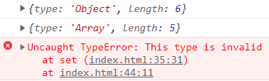

# JavaScript 内置对象

## 1.:star:Object

`Object` 是 JavaScript 的一种数据类型。它用于存储各种键值集合和更复杂的实体。可以通过 `Object()` 构造函数或者使用对象字面量的方式创建对象。

### 三个常用的静态方法

静态方法只有构造函数可 Object 可以调用

- **`Object.keys`** 静态方法，返回一个由给定对象自身的**可枚举 (enumerable)** 字符串键属性名组成的**数组**

- `Object.values` 静态方法，返回一个由给定对象自身的可枚举字符串键属性值组成的数组

- **`Object.assign`** 静态方法，用于对象拷贝（**浅拷贝**）、给对象添加属性

  `Object.assign(拷贝的对象，原始对象)` 使用场景：给对象**添加属性** 

```javascript
const obj = { name: '佩奇', age: 6}

Object.keys(obj) // 返回 ['name', 'age']

Object.values(obj) // 返回 ['佩奇', 6]

const obj2 = {}
Object.assign(obj2, obj) // 返回 {name: '佩奇', age: 6}
```


### frerzze方法

`Object.freeze()` 静态方法可以使一个对象被**冻结**。冻结对象可以防止扩展，并使现有的属性不可写入和不可配置。

被冻结的对象不能再被更改：不能添加新的属性，不能移除现有的属性，不能更改它们的可枚举性、可配置性、可写性或值，对象的原型也不能被重新指定。


### entries方法

`Object.entries()` 静态方法返回一个数组，包含给定对象自有的**可枚举**字符串键属性的**键值对**。

一个由给定对象自有的可枚举字符串键属性的键值对组成的数组。每个键值对都是一个包含两个元素的数组：第一个元素是属性的键（始终是字符串），第二个元素是属性值。

```js
const obj = { foo: "bar", baz: 42 }
console.log(Object.entries(obj)) // 返回一个二维数组 [ ['foo', 'bar'], ['baz', 42] ]

// 类数组对象
const obj = { 0: "a", 1: "b", 2: "c" }
console.log(Object.entries(obj)) // [ ['0', 'a'], ['1', 'b'], ['2', 'c'] ]

// 具有随机键排序的类数组对象
const anObj = { 100: "a", 2: "b", 7: "c" }
console.log(Object.entries(anObj)) // [ ['2', 'b'], ['7', 'c'], ['100', 'a'] ]
```

非对象参数会**强制转换成对象**。只有字符串可以有自己的可枚举属性，所有其他基本类型均返回一个空数组。

```js
// 字符串具有索引作为可枚举的自有属性
console.log(Object.entries("foo")) // [ ['0', 'f'], ['1', 'o'], ['2', 'o'] ]

// 其他基本类型没有自有属性
console.log(Object.entries(100)) // []
```


## :star:defineProperty

`Object.defineProperty()` 静态方法会直接在一个对象上定义一个新属性，或修改其现有属性，并返回此对象。

```js
Object.defineProperty(obj, prop, descriptor)
```

- `obj`：要定义属性的对象
- `prop`：一个字符串或 `Symbol`，指定了要定义或修改的属性键
- `descriptor`：要定义或修改的属性的描述符

<strong style="color:tomato">注意</strong>：我们使用`defineProperty`方法给对象添加了一个属性之后，<strong style="color:tomato">属性默认为不可枚举 (not enumerable)</strong>。

用`defineProperty`方法添加的属性默认不可变。可以通过`writable`, `configurable` 和 `enumerable`属性来改变这一行为。

```js
Object.defineProperty(obj, prop, {
    // value: 'chenglun17',
    // writable: true,        // 控制属性是否可以修改，默认值是false
    // enumerable: true,      // 控制属性是否可以枚举，默认值是false
    // configurable: true,    // 控制属性是否可以被删除，默认值是false
    get(){},
    set(){}
})
```


### getter

有时需要允许访问返回动态计算值的属性，或者你可能需要反映内部变量的状态，而不需要使用显式方法调用。在 JavaScript 中，可以使用`getter`来实现。

**`get`** 语法将对象属性绑定到<strong style="color:#DD5145">查询该属性</strong>时将被调用的函数。

```js
{ get prop() { ... } }
{ get [expression]() { ... } }
```

- `prop`：要绑定到给定函数的属性名
- `expression`，从 ECMAScript 2015 开始，还可以使用一个计算属性名的表达式绑定到给定的函数

------

在新对象初始化时定义一个 getter：

这会为`obj`创建一个伪属性`latest`，它会返回`log`数组的最后一个元素

```js
const obj = {
    log: ['example', 'test'],
    get latest() {
        if (this.log.length == 0) return undefined
        return this.log[this.log.length - 1]
    }
}
console.log(obj.latest); // "test"
```

> 注意，尝试为`latest`分配一个值不会改变它

使用`delete`，可以删除 getter：

```js
delete <getter>
```

使用`Object.defineProperty()`在现有对象上定义 getter，并且<strong style="color:#DD5145">`get`一定要有返回值</strong>：

```js
const obj = { a: 0 }

Object.defineProperty(obj, 'b', { get: function () { return this.a + 1 } })

console.log(obj.b) // Runs the getter, which yields a + 1 (which is 1)
```


### setter

在 JavaScript 中，如果试着改变一个属性的值，那么对应的 setter 将被执行。setter 经常和 getter 连用以创建一个伪属性。不可能在具有真实值的属性上同时拥有一个 setter 器。

**`set`** 语法将对象属性绑定到<strong style="color:#DD5145">修改该属性</strong>时被调用的函数。它还可以在类中应用。

```js
{ set prop(val) { /* … */ } }
{ set [expression](val) { /* … */ } }
```

- `prop`：要绑定到给定函数的属性名
- `val`：用于保存尝试分配给`prop`的值的变量的一个别名
- `expression`，从 ECMAScript 2015 开始，还可以使用一个计算属性名的表达式绑定到给定的函数

------

在对象初始化时定义 setter：

这将定义一个对象 `language` 的伪属性`current`，当`current`被分配一个值时，将使用该值更新`log`

```js
const language = {
    set current(name) {
        this.log.push(name);
    },
    log: []
}

language.current = 'EN';
console.log(language.log); // ['EN']

language.current = 'FA';
console.log(language.log); // ['EN', 'FA']
```

> 请注意，`current`属性是未定义的，访问它时将会返回 `undefined`

使用`delete`操作符，可以移除 setter：

```js
delete <setter>
```

使用`Object.defineProperty()` 给一个已经存在的对象添加一个 setter：

```js
const obj = { a: 0 }

Object.defineProperty(obj, "b", { set: function (x) { this.a = x / 2 } })

obj.b = 10 // Runs the setter, which assigns 10 / 2 (5) to the 'a' property
console.log(obj.a) // 5
```


### 经典题目

#### 题目1

```js
let _default = 0

Object.defineProperty(window, 'a', {
    get () {
        return ++ _default
    }
})

if(a === 1 && a === 2 && a ===3) {
    console.log(a) // 输出 4
    console.log('you passed!') // 输出 you passed!
}
```

解析：

- 判断`a === 1`时，访问一次 a，执行 getter，++a，此时 a 为 1，判断结果为 true
- 判断`a === 2`时，再访问一次 a，执行 getter，++a，此时 a 为 2，判断结果为 true
- 判断`a === 3`时，再访问一次 a，执行 getter，++a，此时 a 为 3，判断结果为 true
- 进入 if 语句 内部，打印 a 时，还要访问一次 a，执行 getter，++a，此时 a 为 4，因此打印输出为 4
- 最后打印输出`you passed!`

#### 题目2

```js
let _default = null

Object.defineProperty(window, 'a', {
    get() {
        return _default
    },
    set(newValue) {
        switch (newValue) {
            case 'Object':
            case 'Array':
                _default = {
                    type: newValue,
                    length: newValue.length
                }
                break;
            default:
                throw new TypeError('This type is invalid')
        }
    }
})

a = 'Object'
console.log(a)
a = 'Array'
console.log(a)
a = '123'
console.log(a)
```

结果：

#### 题目3

```js
Object.defineProperty(window, '_', {
    get() {
        this._c = this._c || 'a'.charCodeAt(0)
        let _ch = String.fromCharCode(this._c)

        if (this._c >= 'a'.charCodeAt(0) + 26) return
        this._c++

        return _ch
    }
})
console.log(_ + _ + _ + _) // abcd
```

#### 题目4

将对象`{a: 1, b; 2, c: 3}`变成`{b: 3, c: 5}`

```js
let _obj = {
    a: 1,
    b: 2,
    c: 3
}

let obj = {}

for (let k in _obj) {
    Object.defineProperty(obj, k, {
        enumerable: true,
        writable: k === 'b' ? false : true,
        configurable: true,
        value: ++_obj[k]
    })
}

for (let k in obj) {
    obj[k] += 1
}

delete obj.a
console.log(obj) // {b: 3, c: 5}
// console.log(obj) // {a: 3, b: 3, c: 5}
```


## 2.:star:Array

创建数组建议使用**字面量创建**，不用 Array 构造函数创建。

1. [map()](#map方法)：遍历并处理数据，返回的新数组
2. [forEach()](#foreach方法)：只遍历，不返回
3. [filter()](#filter方法)：返回新数组，返回的是筛选满足条件的数组元素
4. [reduce()](#reduce方法)：返回函数累积处理的结果，经常用于求和
5. [splice()](#splice方法)：
6. [slice()](#slice方法)：数组**截取**，返回被截取项目的新数组
7. [join()](#join方法)：
8. [find()](#find方法)：
9. [findIndex()](#findindex方法)：
10. [findOf()](#findof方法)：
11. [includes()](#includes方法)：
12. [every()](#every方法)：有一项返回 false ，则整体为 false
13. [some()](#some方法)：有一项返回 true ，则整体为 true
14. [from()](#from方法)：
15. [flat()](#flat方法)：
16. [flatMap()](#flatmap方法)：

------

### 数组常用操作

| 方法名     | 说明                                                 | 返回值                                                  |
| ---------- | ---------------------------------------------------- | ------------------------------------------------------- |
| push( )    | 向数组的**末尾添加**一个或多个元素，注意修改原数组   | 返回新数组的<strong style="color:#DD5145">长度</strong> |
| pop( )     | 删除数组最后一个元素，数组长度+1，无参数、修改原数组 | 返回它删除的元素值                                      |
| unshift( ) | 向数组的**开头添加**一个或多个元素，注意修改原数组   | 返回新数组的<strong style="color:#DD5145">长度</strong> |
| shift( )   | 删除数组的第一个元素                                 | 返回它删除的元素值                                      |
| slice( )   | 数组**截取** slice(begin, end)                       | 返回被截取项目的新数组                                  |
| concat( )  | 连接两个或多个数组，不影响原数组                     | 返回一个新数组                                          |


### map方法

[参考文章](https://blog.csdn.net/weixin_44337386/article/details/126142501)、[参考文章2](https://blog.csdn.net/rambler_designer/article/details/118365562)

**map（）**可以遍历数组并处理数据，并且**返回新的数组**，**不会对空数组进行检测**。

- map 也称为 **映射**，指两个元素的集之间相互 “对应” 的关系
- map 有返回值，所有 callback 需要 **return**，否则默认返回 **undefined**

语法：

```js
Array.map(function(currentValue, index, arr){}, thisValue)
```

- 第一个参数为一个回调函数，必传，数组中的每一项都会遍历执行该函数。
  - currentValue，必须，当前元素的值
  - index，可选，当前元素属于的索引值
  - arr，可选，当前元素属于的数组对象
- 第二个参数 thisValue 为可选参数，回调函数中的 this 会指向该参数对象。

<strong style="color:#DD5145">默认参数</strong>：当没有给 map 指定输入几个参数时，**采用全部参数的形式**。

```javascript
const arr = ['red', 'blue', 'green']
const newArr = arr.map((ele) => {
    return ele + '颜色'
})
console.log(newArr)	// ['red颜色','blue颜色','green颜色']

// 例如，一道面试题
console.log(['1', '2', '3'].map(parseInt))  // [1, NaN, NaN]

// 解析
['1','2','3'].map((item,index)=>{
    return parseInt(item,index)	// map会传递3个参数给function，但是parseInt只能接收两个
})

console.log(parseInt('1',0))  // 1，字符串 '1' 转换为十进制数字 1
console.log(parseInt('2',1))  // NaN，radix值介于 2~36 之间
console.log(parseInt('3',2))  // NaN，二进制不包括 3 这个数字
```


### forEach方法

用于调用数组的每个元素，并将元素传递给回调函数。

```javascript
Array.forEach(function (ele, index) {
    // 函数体
})
// 参数：当前数组元素ele是必须要写的，当前元素索引号index可选
```

- 与 map（）相似，但是 forEach（）<strong style="color:#DD5145">只遍历，不返回新数组</strong>
- 适用于遍历数组对象
- 无法 break ，可以用 try/catch 中 throw new Error 来停止


### filter方法

filter() 方法创建一个新数组，新数组中的元素是通过检查指定数组中符合条件的所有元素，用于筛选，**不改变旧数组**，**返回一个新数组**。

```javascript
Array.filter(function (ele, index) {
    return 筛选条件
})
// 参数ele是必须要写的，index可选
```


### splice方法

`splice`方法通过**删除**、**替换**已存在的元素、或**添加**新元素<strong style="color:#DD5145">修改原数组的内容</strong>，<strong style="color:#DD5145">返回删除内容</strong>。

- `splice(index)`：从元素下标 index 开始，**删除**之后**所有元素**
- `splice(index, howmany)`：**删除**元素，index 为起始位置，howmany 为删除的个数，若 howmany 小于等于 0，则不删除
- `splice(index, howmany, item ...)`：**替换**元素，index 为起始位置，howmany 为被删除的元素个数，item 为插入的新值（先删除后插入达到替换目的）
- `splice(index, 0, item ...)`：index 为插入位置，在 index **之前插入**元素，item 为插入元素


### slice方法

**`slice()`** 方法**返回一个新的数组对象**，这一对象是一个由 `start` 和 `end` 决定的原数组的浅拷贝（包括 `start`，不包括 `end`），其中 `start` 和 `end` 代表了数组元素的索引。**原始数组不会被改变**。

```js
slice()
slice(start)
slice(start, end) // 截取数组
```

- 当只有一个参数的时候，则会截取至数组的最后一个单元
- start：开始位置的索引
- end：结束位置的索引（但不包含该索引位置的元素）


### join方法

**`join(separator)`** 方法将一个数组（或类数组对象）的所有元素连接成一个字符串并返回这个字符串，用指定的分隔符字符串分隔。

如果数组只有一个元素，那么将返回该元素而不使用分隔符。如果 separator 省略，数组元素用逗号（`,`）分隔。

```js
const a = ["Wind", "Water", "Fire"]
a.join() // 'Wind,Water,Fire'
a.join(', ') // 'Wind, Water, Fire'
a.join('+') // 'Wind+Water+Fire'
a.join('') // 'WindWaterFire'
```


### reduce方法

[参考文章](https://blog.csdn.net/qq_33591873/article/details/125248005)

遍历数组元素，返回函数 **累积处理** 的结果，经常用于**求和**。

```javascript
Array.reduce(function(上一次值, 当前值){}, 起始值)
// 1.如果有起始值，则以起始值为准开始累计，累计值 = 起始值
// 2.如果没有起始值，则累计以数组的第一个数组元素为起始值开始累计
// 3.后面每次遍历就会用后面的数组元素，累计到 累计值 里面（类似sum求和）

// 箭头函数
reduce((previousValue, currentValue, currentIndex, array) => {}, init)
```

- previousValue: **必需**。初始值, 或者计算结束后的返回值。
- currentValue：**必需**。当前元素。
- currentIndex：可选。当前元素的索引。
- array：可选。当前元素所属的数组对象。
- init: 可选。传递给函数的初始值，相当于 pre 的初始值。如果没有提供`initialValue`，则将使用数组中的第一个元素。

<strong style="color:#DD5145">reduce 里面有一定要有返回值`return`，没有则默认返回`undefined`，`return` 出去的值也要注意</strong>

例如，求和

```js
const arr = [1, 2, 3, 4]

let res = arr.reduce((pre, cur) => {
    console.log(pre, cur)
    return pre + cur
})

console.log(res)
// 1 2，若没有返回值则为 1 2
// 3 3，若没有返回值则为 undefined 3
// 6 4，若没有返回值则为 undefined 4
// 10，，若没有返回值则为 undefined
```


### find方法

查找元素，返回符合测试条件的**第一个数组元素值**，如果没有符号条件的则返回 undefined。

- find() 对于空数组，函数是不会执行的。
- find() **不会改变原数组**。

语法：

```js
Array.find(function(currentValue, index, arr), thisValue)
```

实例

```js
let arr = [1, 2, 3, 4, 5];
let num = arr.find(item => item > 1);
console.log(num)  // 2
```


### findIndex方法

返回数组中满足提供的测试函数的**第一个数组元素的索引**。若没有找到对应元素则返回-1。

```js
const arr = [10, 9, 12, 15, 16]
const isLargeNumber = (element) => element > 13
console.log(arr.findIndex(isLargeNumber))
// 3
```


### findOf方法

返回在数组中可以找到一个**给定元素**的第一个索引，如果不存在，则返回-1。

```js
const arr = ['a', 'b', 'c', 'd', 'e']
console.log(arr.indexOf('b'))
// 1
```


### includes方法

用来判断一个数组是否包含一个指定的值，根据情况，如果包含则返回 `true`，否则返回 `false`。

```js
includes(searchElement)
includes(searchElement, fromIndex)
```

- searchElement：需要查找的值
- fromIndex（可选）：开始搜索的索引（从零开始），会转换为整数。


### every方法

**检测数组 **所有元素是否都符合指定条件，如果**所有数组元素**都通过检测返回 ture，否则返回 false。

- every() 不会对空数组进行检测
- every() 不会改变原始数组

语法：

```javascript
Array.every(function(currentValue, index, arr), thisValue)
```

实例：

```javascript
// 测试数组中的所有元素是否都大于 10。
function isBigEnough(element, index, array) {
  return element >= 10;
}
[12, 5, 8, 130, 44].every(isBigEnough);   // false
[12, 54, 18, 130, 44].every(isBigEnough); // true
```


### some方法

检测数组中的元素是否满足指定条件，如果**有数组元素**满足条件返回 true，否则返回 false。

- some() 不会对空数组进行检测。
- some() 不会改变原始数组。

语法：

```js
Array.some(function(currentValue, index, arr), thisValue)
```


### from方法

将一个类数组对象或者可遍历对象转换成一个**真正的数组**。

语法：

```js
Array.from(object, mapFunction, thisValue)
```

- object 必需。需转换为数组的对象。
- mapFunction 可选。对数组的每个项目调用的 map 函数。
- thisValue 可选。执行 mapFunction 时用作 this 的值。


### flat方法

会按照一个可指定的深度递归遍历数组，并将所有元素与遍历到的子数组中的元素合并为一个新数组返回。

语法：

```js
Array.flat(depth)
```

- depth 可选，如果是`Infinity`就意味着不管你嵌套了多少个数组都能转为一维
- 如果不写参数，就默认减少最外的多维数组，如果参数写成**数字**，意味着减少多少层 [ ]

注意：**`flat()`会跳过空位**

```js
let arr = [[1, 2, 3], 4, 5, 6, [[7, 8, 9]]]
console.log(arr.flat(Infinity)) // [1, 2, 3, 4, 5, 6, 7, 8, 9]
```


### flatMap方法


## 3.:star:String

1. [length()](#length方法)：返回数组长度
2. [split()](#split方法)：
3. [replace()](#replace方法)：
4. [toString()](#tostring方法)：
5. [toUpperCase()](#touppercase方法)：
6. [subString()](#substring方法)：
7. [startsWith()](#startswith方法)：
8. [includes()](#includes方法)：
9. [raw()](#raw方法)：
10. [padstart()](#padstart方法)：

------

### 对象转换为字符串

```js
String({})		// 返回 '[object Object]'
String({a:1})	// 返回 '[object Object]'
String({a:'1'})	// 返回 '[object Object]'
```

<strong style="color:#DD5145">注意</strong>：在 JavaScript 中，所有对象的 keys 都是 **字符串**（除非对象是 Symbol）。尽管我们可能不会定义它们为字符串，但它们在底层总会被转换为字符串。

### length方法


### split方法

**`split(separator[, limit])`** 方法用于分割字符串，将字符串转换成一个数组。

参数 separator 为分割符，可以使用正则表达式来表示，参数 limit 为分割的份数。

```javascript
const str = '123-45'
str.split('') // ['1', '2', '3', '-', '4', '5']
str.split('-') // ['123', '45']

const str = 'hello'
str.split('') // 返回 ['h', 'e', 'l', 'l', 'o']
str.split('', 3) // 返回 ['h', 'e', 'l']
```

join 方法与其相反，方法用于把数组中的所有元素转换成为一个**字符串**。


### replace方法

`replace('被替换的字符', '替换的字符')`，替换字符，它只会替换第一个字符，原字符串不会改变。


### toString方法

转换为字符串

```javascript
// toString()方法是Object原型上的一个方法
// toString()可以将所有的的数据都转换为字符串，但是要排除null 和 undefined
Object.prototype.toString()

// String()方法是js的一个全局方法
// 字符串类型强转。需要保证的是类型可以转成String类型
window.hasOwnProperty('String')  //true
```


### toUpperCase方法

`toUpperCase()` 方法将调用该方法的字符串转为大写形式并返回（如果调用该方法的值不是字符串类型会被强制转换）。

此方法不会影响原字符串本身的值，因为 JavaScript 中字符串的值是不可改变的。

```js
console.log('alphabet'.toUpperCase()) // 'ALPHABET'
console.log( "ALPHABET".toLowerCase() ) // 'alphabet'
```

- 同理，`toLowerCase()` 会将调用该方法的字符串值转为小写形式，并返回。


### substring方法

```javascript
substring(需要截取的第一个字符的索引号 [, 结束的索引号])
// 用于字符串 截取，不包括结束的索引号（左闭右开）
const str = 'hello'
console.log(str.substring(1,3))	// 结果为 el
```


### startsWith方法

```javascript
stratsWith(检测字符串[, 检测位置索引号])
// 检测是否以某字符 开头
```


### includes方法

```javascript
includes(搜索的字符串[, 检测位置索引号])
// 判断一个字符串是否 包含 在另一个字符串中，区分大小写，根据情况返回 true 或 false
```


### charAt方法

 该方法从一个字符串中返回指定的字符。

```js
str.charAt(index)
```

- `index`：一个介于 0 和字符串长度减 1 之间的整数。(0~length-1) 如果没有提供索引，charAt() 将使用 0。


### charCodeAt方法

该方法返回 `0` 到 `65535` 之间的整数，表示给定索引处的 UTF-16 代码单元。

```js
str.charCodeAt(index)
```

- `index`：一个大于等于 `0`，小于字符串长度的整数。如果不是一个数值，则默认为 `0`

```js
"ABC".charCodeAt(0) // 65
"ABC".charCodeAt(1) // 66
"ABC".charCodeAt(2) // 67
"ABC".charCodeAt(3) // NaN
```


### raw方法

`String.raw()` 是一个模板字符串的标签函数，用来获取一个模板字符串的原始字符串的，它返回一个字符串，其中忽略了转义符（`\n`，`\v`，`\t`等）。

```js
String.raw(callSite, ...substitutions)
String.raw`templateString`
```

- `callSite`参数，一个模板字符串的“调用点对象”。类似 `{ raw: ['foo', 'bar', 'baz'] }`
- `...substitutions`参数，任意个可选的参数，表示任意个内插表达式对应的值
- `templateString`参数，给定模板字符串的原始字符串

但反斜杠可能造成问题，因为你可能会遇到下面这种类似情况：

```js
const path = `C:\Documents\Projects\table.html`
String.raw`${path}`
```


### padStart方法

`padStart()` 方法**用另一个字符串填充**当前字符串（如果需要的话，会重复多次），以便产生的字符串达到给定的长度。从当前字符串的**左侧开始填充**。

返回值：在原字符串开头填充指定的填充字符串直到目标长度所形成的新字符串。

```js
padStart(targetLength)
padStart(targetLength, padString)
```

- `targetLength`，当前字符串需要填充到的目标长度。如果这个数值**小于**当前字符串的长度，则返回当前字符串本身
- `padString` 可选，填充字符串。如果字符串太长，使填充后的字符串长度超过了目标长度，则只保留最左侧的部分，其他部分会被截断。此参数的默认值为 " "（U+0020）

同理：

`padEnd()` 方法会用一个字符串填充当前字符串（如果需要的话则重复填充），返回填充后达到指定长度的字符串。从当前字符串的**末尾（右侧）开始填充**。

```js
padEnd(targetLength)
padEnd(targetLength, padString)
```


## 4.:star:Number

`new Number()` 是一个内建的函数构造器。虽然它看着像是一个 number，但它实际上并不是一个真实的 number：它有一堆额外的功能并且它是一个<strong style="color:#DD5145">对象</strong>。

### isNaN方法

在 JavaScript 中，`NaN` 最特殊的地方就是，我们不能使用相等运算符（`==` 和 `===`）来判断一个值是否是 `NaN`，

因为 `NaN == NaN` 和 `NaN === NaN` 都会返回 `false`。所以必须要有一个判断值是否是 `NaN` 的方法。

> 全局属性 **`NaN`** 是一个表示**非数字**的值。

`Number.isNaN()` 方法<strong style="color:#DD5145">并且检查传递的值是否为 `Number`并且检查是否等价于 `NaN`</strong>。它是原来的全局 `isNaN()` 的更稳妥的版本。

```js
Number.isNaN(value)

Number.isNaN(NaN)         // true
Number.isNaN(Number.NaN)  // true
Number.isNaN(0 / 0)       // true


Number.isNaN('NaN')       // false，字符串 "NaN" 不能被换成数字，返回 NaN。
Number.isNaN(undefined)   // false
Number.isNaN({})          // false
Number.isNaN("blabla")    // false

Number.isNaN(true)        // false
Number.isNaN(null)        // false
Number.isNaN(37)          // false
Number.isNaN('37')        // false
```

和全局函数 `isNaN()` 相比，<strong style="color:#DD5145">`Number.isNaN()` 不会自行将参数转换成数字</strong>，只有在参数是值为 `NaN` 的数字时，才会返回 `true`。

```js
isNaN(value)      // 会自动将 value 转换为数字型

isNaN(NaN)        // true
isNaN(Number.NaN) // true
isNaN(0 / 0)      // true

isNaN('NaN')      // true
isNaN(undefined)  // true：undefined 经过数字转换之后会变成 NaN
isNaN({})         // true
isNaN("blabla")   // true: "blabla" 尝试转换成数字，但是转换失败，返回 NaN


isNaN(true)       // false：true 经过数字转换之后会变成 1
isNaN(null)       // false：null 经过数字转换之后会变成 0
isNaN(37)         // false
isNaN('37')       // false：'37' 可以被转换成数值 37
```


### toFixed 方法

toFixed（）设置保留小数位数的长度


### parseFloat 方法

解析一个字符串，并返回一个浮点数。


### parseInt 方法

解析一个字符串，并返回一个整数。


## 5.:star:eval()

**`eval()`** 函数会将传入的**字符串**当做 JavaScript 代码进行执行。

```js
eval(new String("2 + 2")); // 返回了包含"2 + 2"的字符串对象
eval("2 + 2");             // returns 4
```

MDN官方文档建议：[永远不要使用 `eval`！](https://developer.mozilla.org/zh-CN/docs/Web/JavaScript/Reference/Global_Objects/eval#永远不要使用_eval！)


## 6.:star:parseInt

解析一个字符串并返回指定基数的十进制整数 或 NaN，`radix` 是 2-36 之间的整数，表示被解析字符串的基数。

```js
parseInt(string, radix)
```

- string，必须，要被解析的字符串
- radix，可选，表示要解析的数字的基数，该值介于 2~36 之间
  - 如果省略该参数或其值为 0，则数字将以 10 为基础来解析。如果它以 `"0x"` 或 `"0X"` 开头，将以 16 为基数
  - 如果该参数小于 2 或者大于 36，则 parseInt() 将返回 NaN

**注意**：

如果字符串的第一个字符不能被转换为数字，那么 `parseInt` 会返回 NaN。

如果遇到的字符不是指定 `radix` 参数中的数字，它将忽略该字符以及所有后续字符，并返回到该点为止已解析的整数值。

`parseInt` 将数字截断为整数值。允许前导和尾随空格。


## 7.:star:Math

**Math** 是一个内置对象，它拥有一些数学常数属性和数学函数方法。Math 不是一个函数对象，Math 不是一个构造器。Math 的所有属性与方法都是静态的。

- `Math.PI` ：表示一个圆的周长与直径的比例，约为 3.14159。

- `Math.round()`：返回一个数字四舍五入后最接近的整数。

- `random()`：返回一个浮点型伪随机数字，左闭右开 `[0,1)` 之间的随机数。

- `max()`：返回两个给定的数中的较大的数。

- `min()`：返回两个给定的数中的较小的数。

- `abs()`：返回一个数字的绝对值。

- `ceil()`：返回一个大于等于给定数字的最小整数。

  例如 `Math.ceil(10.1)` 返回 11

- `floor()` ：返回一个小于等于给定数字的最大整数。

  例如 `Math.floor(10.6)` 返回 10

扩展：得到一个两数之间的随机整数

```js
function getRandomInt(min, max) {
    min = Math.ceil(min)
    max = Math.floor(max)
    return Math.floor(Math.random() * (max - min)) + min // 含最小值,不含最大值 [min, max)
    return Math.floor(Math.random() * (max - min + 1)) + min // 含最小值,含最大值 [min, max]
}
```


## 8.:star:JSON

### JSON.parse()

`JSON.parse()` 方法用来<strong style="color:#DD5145">将 JSON 字符串解析为 JavaScript 值</strong>。提供可选的 **reviver** 函数用以在返回之前对所得到的对象执行变换 (操作)。

```js
JSON.parse(text[, reviver])
```

- `text`，要被解析成 JavaScript 值的字符串
- `reviver`(可选)，转换器，如果传入该参数 (函数)，可以用来修改解析生成的原始值，调用时机在 parse 函数返回之前

```js
// 将 数字 字符串化为有效的 JSON，然后将 JSON 字符串解析为 JavaScript 值：
const jsonNumber = JSON.stringify(4) // '4'
JSON.parse(jsonNumber) // 4

// 将 数组值 字符串化为有效的 JSON，然后将 JSON 字符串解析为 JavaScript 值：
const jsonArray = JSON.stringify([1, 2, 3]) // '[1, 2, 3]'
JSON.parse(jsonArray) // [1, 2, 3]

// 将 对象 字符串化为有效的 JSON，然后将 JSON 字符串解析为 JavaScript 值：
const jsonArray = JSON.stringify({ name: "Lydia" }) // '{"name":"Lydia"}'
JSON.parse(jsonArray) // { name: 'Lydia' }
```


### JSON.stringify()

`JSON.stringify()` 方法<strong style="color:#DD5145">将一个 JavaScript 对象或值转换为 JSON 字符串</strong>，如果指定了一个 replacer 函数，则可以选择性地替换值，或者指定的 replacer 是数组，则可选择性地仅包含数组指定的属性。

```js
JSON.stringify(value[, replacer [, space]])
```

- `value`，将要序列化成 一个 JSON 字符串的值
- `replacer`
- `space`