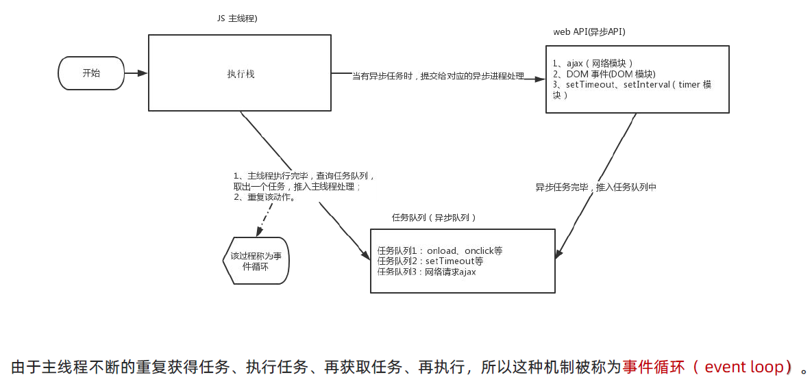
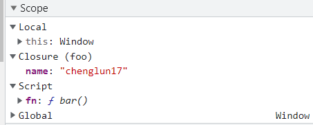
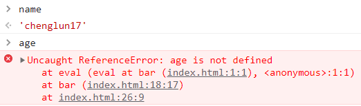
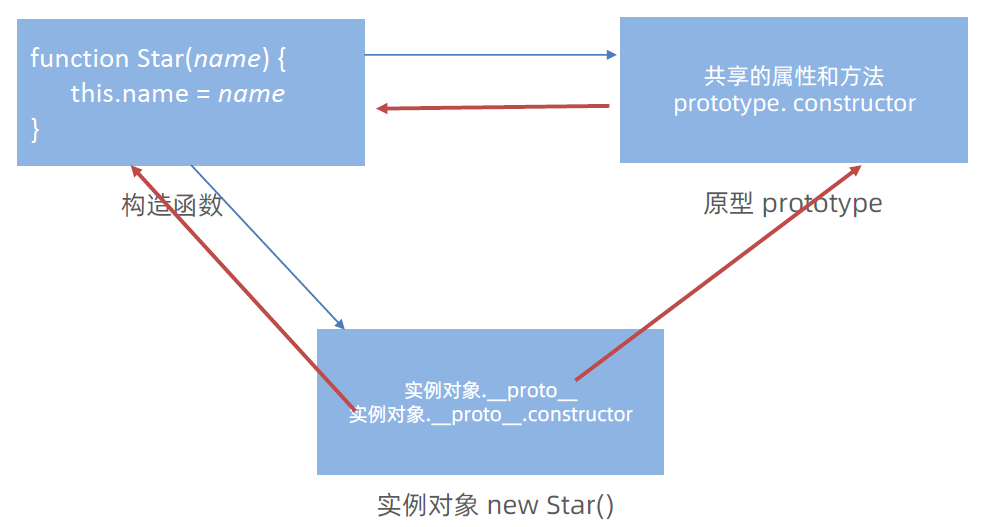
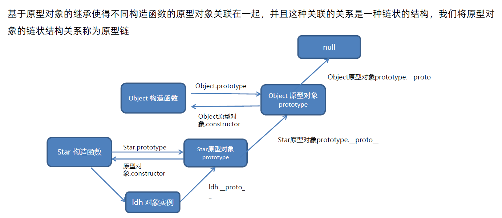
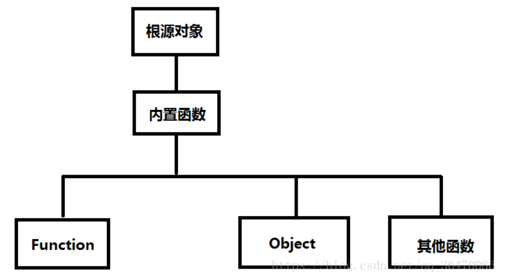

# JavaScript 进阶

## 编程思想

### 1.面向过程

优点：灵活

缺点：不灵活、复用性

### 2.面向对象

面向对象编程具有灵活、代码可复用、容易维护和开发的优点，适合多人合作的大型软件项目。

面向对象的特性：

- 封装性
- 经常性
- 多态性

构造函数：

- JS 的构造函数体现了面向对象的封装特性
- 构造函数实例创建的对象**彼此独立、互不影响**
- 构造函数存在浪费内存的问题

- **构造函数** 和 **原型对象** 中的 **this** 都指向 **实例化的对象**

## JS 执行机制

JavaScript 语言的一大特点急就是 **单线程**。

JS中出现了 **同步** 和 **异步**，本质区别是这流水线上各个流程的执行顺序不同。

- **同步任务**：都在 **主线程 **上执行，形成一个 **执行栈**

- **异步任务**：都添加到 **任务队列（消息队列）**，JS的 **异步** 通过 **回调函数** 实现

  普通事件，如 click、resize 等

  资源加载，如 load、error 等

  定时器，包括 `setInterval`、`setTimeout` 等


### 1.执行上下文

执行上下文是指 JavaScript 代码被编译和执行时所在的环境，也可以称之为执行环境。

JavaScript 中运行任何的代码都是在执行上下文中运行的。

执行上下文的生命周期一共分为三个阶段：**创建阶段**、**入栈执行阶段**、**出栈回收阶段**。

执行上下文有三种类型，分别是：全局执行上下文、函数执行上下文、`eval`函数执行上下文：

**全局执行上下文：**

- 它是默认的、最基础的执行上下文，程序执行就存在的
- 不在任何函数中的代码都位于**全局执行上下文**中
- 一个程序中只能存在 **一个全局执行上下文**

它做了两件事：

- 创建一个全局对象，在浏览器中这个全局对象就是 window 对象
- 将 this 指向这个全局对象，也就是说在全局执行上下文中 this 指向的是 window。

**函数执行上下文：**

- 每次调用函数（包括多次调用同一个函数）时，都会为该函数创建一个新的执行上下文
- 每个函数都拥有自己的执行上下文，但是只有在**函数被调用时才会被创建**
- 一个程序中可以存在 **任意数量的函数执行上下文**

**eval 函数执行上下文：**

由于 `eval` 函数 使用的比较少，所以我们主要讨论其它两种。

[参考文章](https://blog.csdn.net/m0_59966946/article/details/128160000)、[参考文章](https://blog.csdn.net/qqchenyufei/article/details/82795713)


### 2.执行过程

1. 所有**同步任务**都在主线程上执行，形成一个**执行栈（调用栈）**
2. 主线程之外，还存在一个**任务队列**（Task Queue），**异步任务** 放入任务队列中
3. 一旦执行栈中的所有 **同步任务执行完毕**，系统就会按次序读取 **任务队列** 在的 **异步任务**，于是被读取的异步任务结束等待状态，进入执行栈，开始执行

------

浏览器会在计算机内存中分配一块内存，专门用来供代码执行的 **栈内存**，称作 **执行环境栈 ECStack**，同时会创建一个 **全局对象 GO**，将内置的属性方法（`isNaN`、`setInterval`、`setTimeout`... ）存放到一块单独的堆内存空间，并且使用 **window** 指向全局对象。

在执行代码前，还需要创建一个**全局执行上下文 EC(G)**，创建完成后，进入到栈内存中去执行 **进栈**，在当前全局执行上下文中，因为会创建很多变量并且赋值，所以会创建一个**变量对象 VO** 来进行保存，在函数私有上下文中的变量对象叫做 **活动对象 AO** （ps: 每个执行上下文都有一个单独的变量对象）。

- **执行环境栈 ECStack**：专门用来供代码执行的 **栈内存**
- **全局对象 GO（Global Object）**：存放内置的属性方法，window 指向
- **全局执行上下文 EC(G)（Execution Context Global）** ：页面加载后进栈、销毁后出栈
- **变量对象 VO（Variable Object）**： 存放当前执行上下文中创建的变量和值
- **活动对象 AO（Activation Object）**： 函数私有上下文中的变量对象

[参考文章](https://blog.csdn.net/weixin_39762001/article/details/110747455)、[参考文章](https://blog.csdn.net/QinGP97/article/details/127476977)、[参考文章](https://juejin.cn/post/6844904094318985230)


### 3.事件循环

由于主线程不断的重复获得任务、执行任务、再获取任务、再执行、所有这种机制被称为 **事件循环（event loop）**



[参考文章](https://blog.csdn.net/qq_42865575/article/details/124847530)


## 垃圾回收机制

### 垃圾回收机制

垃圾回收机制（Garbage Collection，GC）

JavaScript 中**内存**的分配与回收都是**自动完成**，内存不再使用时会被**垃圾回收器**自动回收。

程序中分配的内存由于某种原因，程序未释放或无法释放叫做**内存泄露**，而垃圾回收机制就是防止内存泄露的。

内存的生命周期：

1. 内存**分配**：当我们声明变量、函数、对象的时候，系统会自动为他们分配内存
2. 内存**使用**：即读写内存，也就是使用变量、函数等
3. 内存**回收**：使用完毕，由**垃圾回收器**自动回收不再使用的内存

注意：

- 全局变量一般不会回收（关闭页面才会回收）
- 一般情况下局部变量的值，不使用了，会被自动回收掉


**栈、堆空间分配区别：**

- 栈（操作系统）：由**操作系统自动分配释放**函数的参数值、局部变量等，存储简单数据类型
- 堆（操作系统）：一般由程序员分配释放，若程序员不释放，由**垃圾回收机制**回收，存储复杂数据类型


### 垃圾回收算法

**1.引用计数法（Reference Counting）**

- 跟踪记录被引用的次数
- 如果被引用了一次，那么就记录次数加1，多次引用会累加
- 如果减少一个引用次数就减1 
- 如果引用次数为0，则释放内存

> 存在问题：**嵌套引用（循环引用）**，如果两个对象相互引用，尽管他们已不再使用，垃圾回收器不会进行回收，导致内存泄露。
>

**2.标记清除法（Mark-Sweep）**

核心思想：**可达性（Reachability）**，从**根对象（Root Object）**开始扫描，能查找到的就是需要使用的，查找不到的就是要被回收的。

在 JavaScript 中根对象（Root Object）就是 window（Global Object）。

现代浏览器通用算法：

- 标记清除算法将 “**不再使用的对象**” 定义为 “**无法到达的对象**”
- 就是从**根部**（在 JavaScript 中就是全局变量）出发定时扫描内存中的对象，凡是能从根部到达的对象，都是**还需要使用**的
- 那些**无法**由根部出发触及到的对象**被标记**为不再使用，稍后进行**回收**

> 可以很好的解决循环引用问题

**2.标记整理法（Mark-Compact）**

与 标记-清除法 类似，不同的是，回收期间同时会将保留的存储对象**汇集到连续的内存空间**，从而**整合空闲空间**，**避免内存碎片化**。


## 闭包

### 2.概念理解

JavaScript 是支持函数式编程，函数可以作为另外一个函数的参数，也可以作为另外一个函数的返回值来使用。

在计算机科学中对闭包的定义（维基百科）：

- 闭包（Closure），又称 **词法闭包（Lexical Closure）**或 **函数闭包（Function Closures）**
- 是在支持 **头等函数** 的编程语言中，实现词法绑定的一种技术
- 闭包在实现上是一个 **结构体**，它存储了 <strong style="color:#DD5145">一个函数</strong>（通常是其入口地址）和 <strong style="color:#DD5145">一个关联的环境</strong>（相当于一个符号查找表）
- 闭包跟函数最大的不同在于，当捕捉闭包时，它的**自由变量**会在捕捉时被确定，这样即便脱离了捕捉时的上下文，它也能照常运行

闭包的概念出现与30年代，最早实现闭包的程序是 Scheme，那么我们就可以理解为什么 JavaScript 中有闭包：

- 因为 JavaScript 中有大量的设计来源与 Scheme

在 MDN 文档中对 JavaScript 闭包的解释：

- **闭包（closure）**是一个函数以及其捆绑的周边环境状态（**lexical environment**，**词法环境**）的引用的组合
- 换而言之，闭包让开发者可以从内部函数访问外部函数的作用域
- 在 JavaScript 中，闭包会随着函数的创建而被同时创建

理解与总结：

- 一个普通的函数 function，如果它可以访问外层作用域的自由变量，那么这个函数和周围环境就是一个闭包
- 从广义的角度来说，JavaScript 中的函数都是闭包
- 从狭义的角度来说，JavaScript 中的一个函数，如果**访问了外层作用域的变量**，那么它就是一个闭包
- **闭包 = 内层函数 + 外层环境的变量**，即**闭包是指有权访问另一个函数作用域中的变量的函数**

```html
<script>
    let messgae = 'Hello Closure'
    
    function foo () {
        console.log(message) // 一个函数foo + 外层环境（<script>标签的作用域） 组成闭包
    }
    foo()// 返回 Hello Closure
    
    function outer() { // 外层函数
        let a = 10
        function inner() { // 内层函数
            console.log(a) // 一个函数inner + 外层环境（outer函数的作用域） 组成闭包
        }
        inner()
    }
    outer() // 返回10
    
</script>
```

### 2.内存泄露

对于那些我们不会再使用的对象，但是对于GC来说，它不知道要进行释放，对应的内存依然会被保留。


### 3.浏览器闭包的优化

如果在执行过程中某些变量没有用被使用到，那么浏览器将会在运行的时候自动释放掉。

```js
function foo() {
    let name = 'chenglun17'
    let age = 18
    
    function bar() {
        debugger	// 打一个断点，方便调试暂停
        console.log(name)
    }
    
    return bar
}

let fn = foo()
fn()
```

变量 age 没有使用到，浏览器V8引擎会自动进行释放。






[参考文章](https://blog.csdn.net/dkm123456/article/details/111409295)、[参考文章](https://blog.csdn.net/dkm123456/article/details/111644638)、[参考视频](https://www.bilibili.com/video/BV1M44y1R76m/?spm_id_from=333.999.0.0&vd_source=78b42a044f07447d2049c465a76bae26)


## 作用域链

作用域链本质上是底层的 **变量查找机制**，类似冒泡。

- 在函数被执行时，会 **优先查找当前** 函数作用域中查找变量
- 如果当前作用域查找不到，则会 **依次逐级查找父级作用域** 直到 **全局作用域**
- 子级作用域可以访问父级作用域，父级作用域无法访问子级作用域


## 深入对象

前面 JavaScript 基础阶段，我们知道了创建对象的三种方法：

1. 利用 <strong style="color:#DD5145">对象字面量</strong> 创建对象
2. 利用 <strong style="color:#DD5145">new Object</strong> 创建对象
3. 利用 <strong style="color:#DD5145">构造函数</strong> 创建对象

<strong style="color:yellow">注意</strong>：在 JavaScript 中，所有对象的 keys 都是 **字符串**（除非对象是 Symbol）。尽管我们可能不会定义它们为字符串，但它们在底层总会被转换为字符串。

### 1.构造函数

构造函数是一种特殊的函数，主要用来**快速创建多个类似的对象**。

- 它们的命名以**大写字母开头**
- 它们只能由 **“new”** 操作符来执行
- 内部创建要用 **“this”** 指向我们创建的实例化对象

```javascript
// 创建一个构造函数
function Pig(name, age) {
    this.name = name
    this.age = age
}
const peppa = new Pig('佩奇', 6)
```

- 使用 **new 关键字** 调用函数的行为被称为 **实例化**
- 实例化构造函数时，若没有参数，则可以省略（）
- 构造函数内部 return 返回的值无效，**无需写 return**，默认返回值即为新创建的对象
- new Object（）、new Date（）也是实例化构造函数

**实例化过程：**

例如 **`const peppa = new Pig()`**：

1. **创建新空对象**

2. **构造函数 this 指向 新对象**

   让 Pig 中的 this 指向 peppa

3. **执行构造函数代码，将属性添加给 Pig 中的 this 对象**

   设置原型链，将 peppa 的 \__proto__ 的成员指向了 Pig 的 prototype 的成员

4. **返回新对象，构造函数里面不需要写 return**

   给 peppa 赋值，Pig 的返回值是个值，那么 peppa 就是个值，若返回值是个对象，peppa 就是这个对象

> - 当使用 `new` 时，`this` 引用我们创建的空对象（peppa）。
> - 当未使用 `new` 时，`this` 引用的是**全局对象**（global object）。


### 2.实例成员&静态成员

通过 **构造函数 **创建的对象称为 **实例对象**

**1. 实例对象中**的属性和方法称为 <strong style="color:#DD5145">实例成员</strong>（实例属性和实例方法）

- 为构造函数传入参数，创建结构相同但值 **不同的对象**
- 构造函数创建的实例对象 **彼此独立** 互不影响
- 它是通过 **prototype** 原型对象添加的，**所有的实例对象**都能够继承调用

**2. 构造函数中**的属性和方法被称为 <strong style="color:#DD5145">静态成员</strong>（静态属性和静态方法）

- 静态成员只能 **构造函数访问** ，不能被实例使用
- 静态方法中的 this 指向构造函数，在构造函数本身上定义的方法，只能通过构造函数本身调用
- 静态方法直接用**类名.方法名**去调用

> 例如， Date.now()、Math.PI、Math.random()

```js
class Chameleon {
  static colorChange(newColor) {
    this.newColor = newColor
    return this.newColor
  }

  constructor({ newColor = 'green' } = {}) {
    this.newColor = newColor
  }
}

const freddie = new Chameleon({ newColor: 'purple' })
freddie.colorChange('orange')	// 因为 freddie 是一个实例，静态方法不能被实例使用，因此抛出了 TypeError 错误。
```

[参考文章-例8](https://github.com/lydiahallie/javascript-questions/blob/master/zh-CN/README-zh_CN.md)


## 内置构造函数

### 1.Object

三个常用的静态方法（静态方法只有构造函数可Object可以调用）

- **`Object.keys`** 静态方法，获取对象中所有 属性（键），返回的是 一个数组

- **`Object.values`** 静态方法，获取对象中所有 属性值，返回的是 一个数组

- **`Object.assign`** 静态方法，用于对象拷贝、给对象添加属性

  **`Object.assign(拷贝的对象，原始对象)`** 使用场景：给对象 **添加属性**

```javascript
const obj = { name: '佩奇', age: 6}

Object.keys(obj) // 返回 ['name', 'age']

Object.values(obj) // 返回 ['佩奇', 6]

const obj2 = {}
Object.assign(obj2, obj) // 返回 {name: '佩奇', age: 6}
```


### 2.Array

创建数组建议使用**字面量创建**，不用 Array 构造函数创建。

1. [map()](#map方法)：遍历并处理数据，返回的新数组
2. [forEach()](#foreach方法)：只遍历，不返回
3. [filter()](#filter方法)：返回新数组，返回的是筛选满足条件的数组元素
4. [reduce()](#reduce方法)：返回函数累积处理的结果，经常用于求和
5. [find()](#find方法)：
6. [findIndex()](#findindex方法)：
7. [findOf()](#findof方法)：
8. [every()](#every方法)：有一项返回 false ，则整体为 false
9. [some()](#some方法)：有一项返回 true ，则整体为 true
10. [from()](#from方法)：
11. [flat()](#flat方法)：
12. [flatMap()](#flatmap方法)：

------

#### map方法

[参考文章](https://blog.csdn.net/weixin_44337386/article/details/126142501)、[参考文章2](https://blog.csdn.net/rambler_designer/article/details/118365562)

**map（）**可以遍历数组并处理数据，并且**返回新的数组**，迭代数组，**不会对空数组进行检测**。

- map 也称为 **映射**，指两个元素的集之间相互 “对应” 的关系
- map 有返回值，所有 callback 需要 **return**，否则会返回 undefined

语法：

```js
Array.map(function(currentValue, index, arr){}, thisValue)
```

> - 第一个参数为一个回调函数，必传，数组中的每一项都会遍历执行该函数。
>   - currentValue，必须，当前元素的值
>   - index，可选，当前元素属于的索引值
>   - arr，可选，当前元素属于的数组对象
> - 第二个参数 thisValue 为可选参数，回调函数中的 this 会指向该参数对象。
>
> <strong style="color:#DD5145">默认参数</strong>：当没有给 map 指定输入几个参数时，**采用全部参数的形式**。

```javascript
const arr = ['red', 'blue', 'green']
const newArr = arr.map((ele) => {
    return ele + '颜色'
})
console.log(newArr)	// ['red颜色','blue颜色','green颜色']

// 例如，一道面试题
console.log(['1', '2', '3'].map(parseInt))  // [1, NaN, NaN]

// 解析
['1','2','3'].map((item,index)=>{
    return parseInt(item,index)	// map会传递3个参数给function，但是parseInt只能接收两个
})

console.log(parseInt('1',0))  // 1，字符串 '1' 转换为十进制数字 1
console.log(parseInt('2',1))  // NaN，radix值介于 2~36 之间
console.log(parseInt('3',2))  // NaN，二进制不包括 3 这个数字
```

> **`parseInt(string [, radix])`**，解析一个字符串，并返回一个整数 或 NaN
>
> - string，必须，要被解析的字符串
> - radix，可选，表示要解析的数字的基数，该值介于 2~36 之间
>
> [MDN文档](https://developer.mozilla.org/zh-CN/docs/Web/JavaScript/Reference/Global_Objects/parseInt)

#### forEach方法

用于调用数组的每个元素，并将元素传递给回调函数。

```javascript
Array.forEach(function (ele, index) {
    // 函数体
})
// 参数：当前数组元素ele是必须要写的，当前元素索引号index可选
```

> - 与 map（）相似，但是 forEach（）<strong style="color:#DD5145">只遍历，不返回新数组</strong>
> - 适用于遍历数组对象
> - 无法 break ，可以用 try/catch 中 throw new Error 来停止

#### filter方法

filter() 方法创建一个新数组，新数组中的元素是通过检查指定数组中符合条件的所有元素，用于筛选，**不改变旧数组**，**返回一个新数组**。

```javascript
Array.filter(function (ele, index) {
    return 筛选条件
})
// 参数ele是必须要写的，index可选
```

#### reduce方法

[参考文章](https://blog.csdn.net/qq_33591873/article/details/125248005)

遍历数组元素，返回函数 **累积处理** 的结果，经常用于**求和**。

```javascript
Array.reduce(function(上一次值, 当前值){}, 起始值)
// 1.如果有起始值，则以起始值为准开始累计，累计值 = 起始值
// 2.如果没有起始值，则累计以数组的第一个数组元素为起始值开始累计
// 3.后面每次遍历就会用后面的数组元素，累计到 累计值 里面（类似sum求和）

// 箭头函数
reduce((previousValue, currentValue, currentIndex, array) => {}, init)
```

> - previousValue: **必需**。初始值, 或者计算结束后的返回值。
> - currentValue：**必需**。当前元素。
> - currentIndex：可选。当前元素的索引。
> - array：可选。当前元素所属的数组对象。
> - init: 可选。传递给函数的初始值，相当于pre的初始值。
>
> reduce 里面有一定要 return，return 出去的值也要注意

例如，求和

```js
const arr = [1, 2, 3, 4]
let res = arr.reduce((pre, cur) => {
    return pre + cur
})
console.log(res)
```


#### find方法

查找元素，返回符合测试条件的**第一个数组元素值**，如果没有符号条件的则返回 undefined。

- find() 对于空数组，函数是不会执行的。
- find() 并没有改变数组的原始值。

语法：

```js
Array.find(function(currentValue, index, arr), thisValue)
```

实例

```js
let arr = [1, 2, 3, 4, 5];
let num = arr.find(item => item > 1);
console.log(num)  // 2
```


#### findIndex方法

返回数组中满足提供的测试函数的**第一个数组元素的索引**。若没有找到对应元素则返回-1。

```js
const arr = [10, 9, 12, 15, 16]
const isLargeNumber = (element) => element > 13
console.log(arr.findIndex(isLargeNumber))
// 3
```


#### findOf方法

返回在数组中可以找到一个**给定元素**的第一个索引，如果不存在，则返回-1。

```js
const arr = ['a', 'b', 'c', 'd', 'e']
console.log(arr.indexOf('b'))
// 1
```


#### every方法

**检测数组 **所有元素是否都符合指定条件，如果**所有数组元素**都通过检测返回 ture，否则返回 false。

- every() 不会对空数组进行检测
- every() 不会改变原始数组

语法：

```javascript
Array.every(function(currentValue, index, arr), thisValue)
```

实例：

```javascript
// 测试数组中的所有元素是否都大于 10。
function isBigEnough(element, index, array) {
  return element >= 10;
}
[12, 5, 8, 130, 44].every(isBigEnough);   // false
[12, 54, 18, 130, 44].every(isBigEnough); // true
```

#### some方法

检测数组中的元素是否满足指定条件，如果**有数组元素**满足条件返回 true，否则返回 false。

- some() 不会对空数组进行检测。
- some() 不会改变原始数组。

语法：

```js
Array.some(function(currentValue, index, arr), thisValue)
```


#### from方法

将一个类数组对象或者可遍历对象转换成一个**真正的数组**。

语法：

```js
Array.from(object, mapFunction, thisValue)
```

> - object 必需。需转换为数组的对象。
> - mapFunction 可选。对数组的每个项目调用的 map 函数。
> - thisValue 可选。执行 mapFunction 时用作 this 的值。

#### flat方法

会按照一个可指定的深度递归遍历数组，并将所有元素与遍历到的子数组中的元素合并为一个新数组返回。

语法：

```js
Array.flat(depth)
```

> - depth 可选，如果是`Infinity`就意味着不管你嵌套了多少个数组都能转为一维
>- 如果不写参数，就默认减少最外的多维数组，如果参数写成**数字**，意味着减少多少层 [ ]
> 
>注意：**`flat()`会跳过空位**

```js
let arr = [[1, 2, 3], 4, 5, 6, [[7, 8, 9]]]
console.log(arr.flat(Infinity)) // [1, 2, 3, 4, 5, 6, 7, 8, 9]
```


#### flatMap方法


### 3.String

1. [length()](#length方法)：返回数组长度
2. [split()](#split方法)：
3. [toString()](#tostring方法)：
4. [subString()](#substring方法)：
5. [startsWith()](#startswith方法)：
6. [includes()](#includes方法)：
7. [对象转换为字符串](#对象转换为字符串)：


#### length方法


#### split方法

join 方法与其相反，方法用于把数组中的所有元素转换成为一个**字符串**。

```javascript
split('分隔符')
// 用来将 字符串 转换成 数组
```


#### toString方法

转换为字符串

```javascript
// toString()方法是Object原型上的一个方法
// toString()可以将所有的的数据都转换为字符串，但是要排除null 和 undefined
Object.prototype.toString()

// String()方法是js的一个全局方法
// 字符串类型强转。需要保证的是类型可以转成String类型
window.hasOwnProperty('String')  //true
```


#### substring方法

```javascript
substring(需要截取的第一个字符的索引号 [, 结束的索引号])
// 用于字符串 截取，不包括结束的索引号（左闭右开）
const str = 'hello'
console.log(str.substring(1,3))	// 结果为 el
```


#### startsWith方法

```javascript
stratsWith(检测字符串[, 检测位置索引号])
// 检测是否以某字符 开头
```


#### includes方法

```javascript
includes(搜索的字符串[, 检测位置索引号])
// 判断一个字符串是否 包含 在另一个字符串中，区分大小写，根据情况返回 true 或 false
```

#### 对象转换为字符串

```js
String({})		// 返回 '[object Object]'
String({a:1})	// 返回 '[object Object]'
String({a:'1'})	// 返回 '[object Object]'
```

<strong style="color:yellow">注意</strong>：在 JavaScript 中，所有对象的 keys 都是 **字符串**（除非对象是 Symbol）。尽管我们可能不会定义它们为字符串，但它们在底层总会被转换为字符串。


### 4.Number

`new Number()` 是一个内建的函数构造器。虽然它看着像是一个 number，但它实际上并不是一个真实的 number：它有一堆额外的功能并且它是一个**对象**。

#### toFixed 方法

> toFixed（）设置保留小数位数的长度

#### parseFloat 方法

解析一个字符串，并返回一个浮点数。


#### parseInt 方法

解析一个字符串，并返回一个整数。


### eval()

**`eval()`** 函数会将传入的字符串当做 JavaScript 代码进行执行。

MDN官方文档建议：[永远不要使用 `eval`！](https://developer.mozilla.org/zh-CN/docs/Web/JavaScript/Reference/Global_Objects/eval#永远不要使用_eval！)


## 函数进阶

### 1.函数提升

会把 **所有函数声明** 提升到 **当前作用域** 的最前面，**只提升函数声明**，不提升函数调用。

> - 函数提升不仅仅提升函数声明，而是提升函数整体
> - 函数的提升高于变量的提升，匿名函数不会提升

函数表达式 必须先声明和赋值，后调用，否则报错

```javascript
fun()	// 报错 fun is not a function
var fun = function () {
    console.log('函数函数表达式')
}
```


### 2.函数参数

#### 动态参数 arguments

**`arguments`** 是函数内部内置的伪数组对象，它<strong style="color:#DD5145">包含了调用函数时传入的所有实参</strong>

- **`arguments`** 是一个**伪数组**，**只存在于函数中**
- **`arguments`** 的作用是**动态获取**函数的实参
- 可以通过 for 循环依次得到传递过来的实参
- **`Array.from()`**，将伪数组转换为真数组

```javascript
function sum() {
    let s = 0
    for (let i = 0; i < arguments.length; i++) {
        s += arguments[i]
    }
    console.log(s)
}
sum(5, 10)
sum(1, 2, 3)
```


#### 剩余参数 rest

- **`...`** 是语法符号，置于最末函数形参之前，用于获取 **多余的实参**
- 在**函数内部使用**，借助 **`...`** 获取的剩余实参，是一个 **真数组**

- 开发中，建议使用 剩余参数

```javascript
function getSum(a, b, ...rest) {
    console.log(rest)	// 使用的时候不需要加 ...
}
getSum(1, 2, 3, 4, 5)	// 输出的是一个数组 [3, 4, 5]
```


### 3.展开运算符

**展开运算符（扩展运算符）`...`**，主要用于函数调用的时候，将一个数组展开变为参数序列，不会修改原数组。

用于求数组最大值（最小值）、合并数组等

```javascript
const arr = [1, 3, 2, 5]
// ...arr 展开为 1 3 2 5
console.log(Math.max(...arr))	// 5
console.log(Math.min(...arr))	// 1
// 合并数组
const arr1 = [1, 2, 3]
const arr1 = [4, 5, 6]
const arr3 = [...arr1, ...arr2]
console.log(arr3)	// [1, 2, 3, 4, 5, 6]
```

### 4.箭头函数

箭头函数更适用于那些需要匿名函数的地方

- 箭头函数属于表达式函数，因此**不存在函数提升**
- 加括号的函数体返回对象字面量表达式，如例5
- 箭头函数 **没有动态参数 `arguments`**，但 **有剩余参数 `...rest`**
- 箭头函数不能作为构造函数实例化
- 箭头函数**不会创建**自己的 **this**

```javascript
// 普通函数
const fn = function () {
    console.log('我是普通函数')
}
fn()

// 1.箭头函数
const fn = () => {
    console.log('俺是箭头函数')
}
fn()

// 2.只有一个形参的时候可以 省略左侧的小括号( )
const fn = x => {
    console.log(x)
}
fn(10)

// 3.只有一行代码的时候可以 省略右侧的大括号{ }
const fn = x => console.log(x)
fn(10)

// 4.只有一行代码的时候无需写 return ，直接返回值
const fn = (x, y) => x + y
console.log(fn(1, 2))

// 5.箭头函数可以直接返回一个对象，右侧对象用小括号()括起来
const fn = uname => ({ uname: uname })
console.log(fn('刘德华'))	// {uname: '刘德华'}
```

### 5.箭头函数this

**箭头函数不会创建自己的 this**，它只会从自己的作用域链的上一层沿用this

DOM事件回调函数为了简便，不推荐使用箭头函数

```javascript
const obj = {
    uname: 'pink老师',
    sayHi: function () {
        console.log(this)	// 指向obj
        let i = 10
        const count = () => {
            console.log(this)	// 指向obj
        }
        count()
    }
}
obj.sayHi()
```


## 改变 this 指向

三种方法动态指定普通函数中 this 的指向，apply()、call()、bind()。

### 1.apply()

`apply`接受两个参数，第一个参数是`this`的指向，第二个参数是函数接受的参数，以数组的形式传入。

改变`this`指向后原函数会**立即执行**，且此方法只是**临时改变**`this`指向一次。

```javascript
fn.apply(thisArg, [argsArray])
// thisArg：在fn函数运行时指定的 this 值
// argsArray：传递的值，必须包含在数组里面
// 返回值就是函数的返回值，因为它就是调用函数
```

使用场景：求数组最大值

```javascript
const arr = [1, 2, 3]
// 方法一，for循环

// 方法二，apply方法
const max = Math.max.apply(Math 或 null, arr)
console.log(max)

// 方法三，展开运算符
console.log(Math.max(...arr))
```

### 2.call()

`call`方法的第一个参数也是`this`的指向，后面传入的是一个参数列表。

跟`apply`一样，改变`this`指向后原函数会**立即执行**，且此方法只是**临时改变**`this`指向一次。

```javascript
fn.call(thisArg, arg1, arg2, ...)
// thisArg：在fn函数运行时指定的 this 值
// arg1, arg2：传递的其他参数
// 返回值就是函数的返回值，因为它就是调用函数
```

### 3.bind()

和`call`相似，第一个参数也是`this`的指向，后面传入的也是一个参数列表（可以分多次传入）。

改变`this`指向后**不会立即执行**，而是返回一个**永久改变**`this`指向的函数。

例如，定时器内部的 this 指向

```javascript
fn.bind(thisArg, arg1, arg2, ...)
// thisArg：在fn函数运行时指定的 this 值
// arg1, arg2：传递的其他参数
// 返回值是 由指定的 this 值和初始化参数改造的 原函数拷贝（新函数） 

const obj = {
    age: 18
}
function fn() {
    console.log(this)
}
const fun = fn.bind(obj)
fun()
```


## 解构赋值

解构赋值是一种快速为变量赋值的简洁语法，本质上仍为变量赋值。

### 1.数组解构

数组结构是将数组的单元值快速批量赋值给一系列变量的简洁语法。

- **赋值运算符`=`** 左侧的 **`[]`** 用于批量声明变量，右侧数组的单元值将被赋值给左侧的变量
- 变量的顺序对应数组单元值的位置依次进行赋值操作

```javascript
cosnt arr = [100, 60, 80]
const [max, min, avg] = arr
// 或
const [max, min, avg] = [100, 60, 80]
```

典型应用，交换2个变量

```javascript
let a = 1
let b = 3;	// 必须有分号;
[b, a] = [a, b]
console.log(a, b) // 3 1
```

前面必须加分号情况：

1. **立即执行函数**

```javascript
(function t() {})();
// 或者
;(function t() {})()
```

2. **数组解构**

```javascript
// 数组开头的，特别是前面有语句的一定注意加分号
;[b, a] = [a, b]
```


### 2.对象解构

对象结构是将对象属性和方法快速批量赋值给一系列变量的简洁语法。

- **赋值运算符`=`** 左侧的 **`{}`** 用于批量声明变量，右侧对象的属性值将被赋值给左侧的变量
- 对象属性的值将被赋值给与**属性名相同的变量**
- 注意解构的变量名不要和外面的变量冲突，否则报错
- 对象中找不到与变量名一致的属性时变量值为 undefined

```javascript
const { uname, age } = { uname: 'pink老师', age: 18}
console.log(uname)	// pink老师
console.log(age)	// 18
```

给新的变量名赋值：

```javascript
// 旧变量名: 新变量名
const { uname: username, age } = { uname: 'pink老师', age: 18}
console.log(uname)	// pink老师
console.log(age)	// 18
```


### 3.数组对象解构

```javascript
const pig = [{
    name: '佩奇',
    age: 6
}]
const [{ name, age }] = pig
console.log(name, age)	// 佩奇 6
```

多级对象解构：

```javascript
const pig = {
    name: '佩奇',
    family: {
        mother: '猪妈妈',
        father: '猪爸爸',
        brother: '乔治'
    },
    age: 6
}
// 若外层是数组，则在外面再加一层数组[]
const { name, family: { mother, father, brother } } = pig
console.log(name)
```


## 原型

### 1.原型对象

**原型（原型对象）**是一个**对象**，称 **prototype**，除了**基本对象**（base object），所有对象都有原型。

- 构造函数通过在 **原型对象** 上挂载函数，可以实现**共享**，更加**节省内存**
- javaScript 规定，每一个**构造函数**都有一个 **prototype 属性（原型对象）**，指向另一个对象
- 重点: <strong style="color:#DD5145">【构造函数】和【原型对象】 中的【this】都指向【实例化的对象】</strong>

```javascript
// 1.公共的属性 写到 构造函数里面
function Star(uname, age) {
      this.uname = uname
      this.age = age
    }
// 2.公共的方法 写到 原型对象身上，节约了内存
Star.prototype.sing = function () {
    console.log('唱歌')
}
const ldh = new Star('刘德华', 55)
const zxy = new Star('张学友', 58)
console.log(ldh === zxy)  // false
console.log(ldh.sing === zxy.sing)	// true
```


### 2.对象原型

每个 **实例化的对象** 都会有一个属性 **对象原型 \__proto__**，指向 **所属构造函数的 prototype 原型对象**。

- 因为 \__proto__ 对象原型的存在，所以 **实例对象** 可以 **访问** 到 **原型对象**上的属性和方法
- **\__proto__ 对象原型 **里面也有一个 **constructor属性**，指向 创建该实例对象的 **构造函数**
- 重点:  <strong style="color:#DD5145">对象原型（ \__proto__ ） ===> 原型对象</strong>

注意：

- \__proto__ （四个下划线）是JS非标准属性，只读
- 浏览器的 **[ [ prototype ] ]** 和 **\__proto__ 对象原型** 意义相同，**`[[prototype]]`** 被称为**原型属性**
- 用来表明当前实例对象指向哪个原型对象 prototype

### 3.constructor 属性

每个 **prototype ** 和 **\__proto__ ** 里面都有个 **constructor 属性**（constructor 构造函数）。

- 该 <strong style="color:#DD5145">constructor属性 ===> 该prototype的构造函数</strong>，让 原型对象 能够重新找到 创造它的构造函数


### 总结

- 每个构造函数 **实例化的对象** 里面都有 <strong style="color:#DD5">对象原型 \__proto__，且 ===> 原型对象 prototype</strong>

- 所有的 **原型对象** 和 **对象原型** 里面都有 <strong style="color:#DD5">constructor属性，且 ===> 构造函数</strong>

- <strong style="color:#DD5">`__proto__`（隐式原型）</strong>和 <strong style="color:#DD5">`constructor`</strong>是**对象**特有的属性；

- <strong style="color:#DD5">`prototype`（显示原型）</strong>是**函数**特有的属性，又因为**函数**也是一种**对象**，所以函数也拥有**`__proto__`**和**`constructor`**属性。



代码演示：

```js
function Star(name, gender) {
    this.name = name
    this.gender = gender
}

const ldh = new Star('刘德华', '男')
console.log(ldh)
console.log(ldh.__proto__)
console.log(Star.prototype)

console.log(ldh.__proto__ === Star.prototype)		// true
console.log(Star.prototype.constructor === Star)	// true
console.log(ldh.__proto__.constructor === Star)		// true
```


## 原型继承

[参考文章](https://blog.csdn.net/qq_38217940/article/details/124159897)

原型有三大特性：**封装** **继承** **多态**

1. 原型链继承 （Child.prototype=new Parent()）
2. 构造函数继承（在构造函数里面使用call）
3. 组合继承（原型链继承+构造继承）
4. 原型式继承（用了object.create，也有把他归类到寄生式）
5. 寄生式继承（原型式继承的进阶版）(也有叫拷贝继承)
6. 寄生组合式继承（寄生式+组合式，是class出现前的终极继承方案）
7. 对象冒充（不知道谁先想出来的怪招）
8. class继承（大家都嫌寄生组合太麻烦了，所以出现了它，屠龙术）

> - 因为**原型链继承**不能传参，所以有了构造继承，但是**构造继承**不能继承父级的原型，所以出现了结合两种方式的**组合继承**
> - 因为组合继承实例化了两次父类，性能有缺陷，所以想出了**原型式继承**，
> - 再增强成**寄生式继承**，把寄生式继承跟组合继承一结合，变成了**寄生组合继承**，用来解决组合继承的小缺陷

## 原型链

[参考文章](https://blog.csdn.net/AIWWY/article/details/113827037?utm_medium=distribute.pc_relevant.none-task-blog-2~default~baidujs_utm_term~default-8-113827037-blog-95541594.235^v29^pc_relevant_default_base3&spm=1001.2101.3001.4242.5&utm_relevant_index=11)、[参考文章2](https://blog.csdn.net/weixin_56505845/article/details/119683904?ops_request_misc=%257B%2522request%255Fid%2522%253A%2522168217534316800226532255%2522%252C%2522scm%2522%253A%252220140713.130102334..%2522%257D&request_id=168217534316800226532255&biz_id=0&utm_medium=distribute.pc_search_result.none-task-blog-2~all~top_positive~default-1-119683904-null-null.142^v86^insert_down1,239^v2^insert_chatgpt&utm_term=%E5%8E%9F%E5%9E%8B%E9%93%BE&spm=1018.2226.3001.4187)

<strong style="color:#DD5145">原型链是一种 查找规则，顺着 \__proto__ 属性，一步一步往上查找的</strong>，也叫**隐式原型链**。

1. 当访问一个对象的属性（包括方法）时，首先查找这个 **对象自身** 有没有属性
2. 如果没有就查找它的原型（即 **对象原型 \__proto__ ** ===> **原型对象 prototype**）
3. 如果还没有就查找原型对象的原型（**Object 的原型对象**）
4. 依次类推一直找到 Object 为止（**`Object.prototype.__proto__ === null`**），所以称<strong style="color:#DD5145">`Object.prototype`为 原型链的终端</strong> 
5. **\__proto__ 对象原型** 的意义就在于为对象成员查找机制提供一个方向，或一条路线
6. 可以使用 **instanceof 运算符** 用于**检测**构造函数的 prototype 属性是否出现在某个实例对象的**原型链**上

```javascript
function A() {
    
}
var a = new A()
var b = []

console.log(a instanceof A)			// true
console.log(A instanceof Function)	 // true
console.log(b instanceof Array)		// true
console.log(a instanceof Array)		// false

// A有一个实例化对象a，instanceof的判断规则是沿着a的 __proto__ 这条线去找，同时沿着A的prototype这条线去找
// 如果两条线能找到同一个引用，即同一个对象，就返回true，如果找到终点还没有重合就返回false.
```

A 有一个实例化对象 a，instanceof 的判断规则是沿着 a 的 \__proto__ 这条线去找，同时沿着 A 的 prototype 这条线去找，<br>如果两条线能找到同一个引用，即同一个对象，就返回true，如果找到终点还没有重合就返回 false。




### 原型链之Object，Function

[参考文章](https://blog.csdn.net/qq_36470086/article/details/82599604?spm=1001.2101.3001.6650.2&utm_medium=distribute.pc_relevant.none-task-blog-2%7Edefault%7ECTRLIST%7ERate-2-82599604-blog-122073306.235%5Ev29%5Epc_relevant_default_base3&depth_1-utm_source=distribute.pc_relevant.none-task-blog-2%7Edefault%7ECTRLIST%7ERate-2-82599604-blog-122073306.235%5Ev29%5Epc_relevant_default_base3&utm_relevant_index=3)、[参考文章2](https://blog.csdn.net/chuanggangbo5551/article/details/101044980?utm_medium=distribute.pc_relevant.none-task-blog-2~default~baidujs_baidulandingword~default-0-101044980-blog-82599604.235^v29^pc_relevant_default_base3&spm=1001.2101.3001.4242.1&utm_relevant_index=3)、[参考文章3](https://blog.csdn.net/qq_39332845/article/details/115212381?ops_request_misc=%257B%2522request%255Fid%2522%253A%2522168152366816782425122013%2522%252C%2522scm%2522%253A%252220140713.130102334..%2522%257D&request_id=168152366816782425122013&biz_id=0&utm_medium=distribute.pc_search_result.none-task-blog-2~all~sobaiduend~default-1-115212381-null-null.142^v83^insert_down38,239^v2^insert_chatgpt&utm_term=function.prototype.__proto__&spm=1018.2226.3001.4187)、[参考文章4](https://blog.csdn.net/AIWWY/article/details/113827037?ops_request_misc=%257B%2522request%255Fid%2522%253A%2522168217402016782425117331%2522%252C%2522scm%2522%253A%252220140713.130102334..%2522%257D&request_id=168217402016782425117331&biz_id=0&utm_medium=distribute.pc_search_result.none-task-blog-2~all~baidu_landing_v2~default-5-113827037-null-null.142^v86^insert_down1,239^v2^insert_chatgpt&utm_term=Array.prototype.__proto__%20%3D%3D%3D%20Object.prototype&spm=1018.2226.3001.4187)

代码演示：

```javascript
// 以下等式返回true，是否正确，为什么
console.log(Array.prototype.__proto__ === Object) // 错误 false
console.log(Array.prototype.__proto__ === Object.prototype)    // true
console.log(Array.prototype.__proto__ === Object.prototype.__proto__) // 错误 false

console.log(Function instanceof Object) // true
console.log(Object instanceof Function) // true
```

- 分析：

> Object 实例对象是通过**`var Object = new Function()`**创建的，因此**`Object.__proto__ === Function.prototype`**
>
> 而**`Function.prototype`**是一个空对象，是 Object 对象的实例，因此**`Function.prototype.__proto__ === Object.prototype`**

> 1. Function是个类，而类的本质是一个构造函数 Function
> 2. 因为：Function(类) = Function(构造函数)
>    \__proto__ == prototype
> 3. 所以 Function.\__proto__ = Function.prototype

- 总结：

- 那么Function.\__proto__指向谁？

  <strong style="color:#DD5145">`Function.__proto__ === Function.prototype`</strong>

1. **所有函数的\__proto__属性 === Function.prototype**。这是由于Function是通过`var Function=new Function()`创建的。

2. **Function/声明函数.prototype.\__proto__ === Object.prototype**

3. **构造函数创建对象时会隐式的将 \__proto__ = prototype**，（即a.\__proto__=A.prototype）

   ```js
   function A(){};
   var a = new A();
   ```

**`Function.prototype`** 指向 "内置函数"。而 **`Object.prototype`** 指向 "根源对象"




## 深浅拷贝

首先浅拷贝和深拷贝只针对**引用类型（即地址类型）**

### 1.浅拷贝

两种拷贝方法：

1. 拷贝**对象**：**`Object.assign(拷贝的对象，原始对象)`**或 展开运算符**`{...obj}`**
2. 拷贝**数组**：**`Array.prototype.concat()`** 或 **`[...arr]`**

- 拷贝对象之后，里面的属性值是简单数据类型，则 **直接拷贝值**
- 若属性值是引用数据类型，则拷贝的是 **地址**

直接赋值与浅拷贝的区别：

- **直接赋值**的方法，只要是对象，都会相互影响，因为是<strong style="color:#DD5145">直接拷贝对象栈里面的地址</strong>
- 简单来说就是浅拷贝： **只能拷贝一层对象，或者一层数组**，如果出现多层对象拷贝则还会影响

```js
// 创建一个p1对象
const p1 = {
    name: '小白',
    age: 18
}
const p2 = {}
Object.assign(p2, p1)
console.log(p2) //{ name: '小白',age: 18}

p2.name = '小黑'
console.log(p2) //{name: '小黑', age: 18}
console.log(p1) //{ name: '小白',age: 18}
```

> 通过Object.assign() 可以解决直接赋值出现的问题

```js
// 创建一个p1对象
const p1 = {
    name: '小白',
    age: 18
}
const p2 = {...p1}
console.log(p2); //{ name: '小白',age: 18}
```


### 2.深拷贝

三种深拷贝方法：核心是创建新地址

1. 通过 **递归函数** 实现
2. 通过 **js库 [lodash](https://www.lodashjs.com/)** ，使用 **`_.cloneDeep()`** 实现
3. 通过 **`JSON.parse(JSON.stringify())`** 实现

#### 通过 递归函数

容易发生 “**栈溢出**” 错误（stack overflow），所以必须加退出条件 **return**

```javascript
// 拷贝函数
function deepCopy(newObj, oldObj) {
    for (let k in oldObj) {
        // 1.处理数组问题，一定先写数组，后写对象
        if (oldObj[k] instanceof Array) {
            newObj[k] = []
            // newObj[k] 接收[]
            // oldObj[k] 为 ['乒乓球', '足球']
            deepCopy(newObj[k], oldObj[k])
        }
        // 2.处理对象问题，一定先 Array 后 Object，因为数组也是对象
        else if (oldObj[k] instanceof Object) {
            newObj[k] = {}
            deepCopy(newObj[k], oldObj[k])
        }
        else {
            newObj[k] = oldObj[k]	// k 属性名，oldObj[k] 属性值
        }
    }
}
const oldObj = {
    uname: 'pink',
    age: 18,
    hobby: ['乒乓球', '足球'],
    family: {
        baby: '小pink'
    }
}
const newObj = {}
deepCopy(newObj, obj)
console.log(newObj)

newObj.age = 20
newObj.hobby[0] = '篮球'
newObj.family.baby = '修改后的pink'
console.log(oldObj)
```

#### 通过 js库 lodash

使用 **_.cloneDeep（）** 实现深拷贝

```html
<!-- 1.先引用 -->
<script src="./lodash.min.js"></script>
<script>
    const obj = {
        uname: 'pink',
        age: 18,
        hobby: ['乒乓球', '足球'],
        family: {
            baby: '小pink'
        }
    }
    const newObj = _.cloneDeep(obj)		// 2.后拷贝
    console.log(newObj)
    // 修改
    newObj.family.baby = '修改后的pink'
    console.log(obj)
</script>
```

#### 通过 JSON.stringify()

```javascript
const obj = {
    uname: 'pink',
    age: 18,
    hobby: ['乒乓球', '足球'],
    family: {
        baby: '小pink'
    }
}
// 把对象转换为 JSON 字符串  简单数据类型
const newObj = JSON.parse(JSON.stringify(obj))
console.log(newObj)
// 修改
newObj.family.baby = '修改后的小pink'
console.log(obj)
```

> - 会忽略undefined
> - 会忽略symbol
> - 不能序列化函数
> - 不能解决循环引用的对象
> - 循环引用，也不能通过该方法实现深拷贝
> - 在遇到函数、 undefined 或者 symbol 的时候，该对象也不能正常的序列化

[参考文章](https://blog.csdn.net/weixin_45856239/article/details/127894968)、[参考文章2](https://blog.csdn.net/jiang7701037/article/details/98738487)、[参考文章3](https://blog.csdn.net/jbj6568839z/article/details/107964274)


## 异常处理

异常处理是指预估代码执行过程中可能发生的错误，然后最大程度的避免错误的发生导致整个程序无法继续运行

### 1.throw 抛出异常

- thorw 抛出异常信息，然后 **终止程序**
- throw 后面跟的是错误提升信息
- Error 对象配合 throw 使用，能够设置更详细的错误信息

```javascript
function fn(x, y) {
    if (!x || !y) {
        // throw '没有参数传递进来'
        throw new Error('没有参数传递进来')
    }
    return x + y
}
console.log(fn())
```

### 2.try / catch 捕获异常

- try ... catch 用于捕获错误信息，**不会中断程序**
- 将预估可能发生错误的代码写在 **try** 代码段中
- 如果 try 代码段中出现错误后，会执行 **catch** 代码段，并**捕获**到错误信息
- **finally** 不管是否有错误，都会执行

```html
<p>123</p>
<script>
    function fn() {
        try {
            const p = document.querySelector('.p')
            p.style.color = 'red'
        } catch (error) {
            // 拦截错误，提示浏览器提供的错误信息，但是不中断程序的执行
            console.log(error.message)
            // 需要加 return 中断程序
            // return
            throw new Error('错误')
        } finally {
            // 不管程序对不对，一定会执行的代码
            alert('弹出对话框')
        }
        console.log(11)
    }
    fn()
</script>
```

### 3.debugger


## 性能优化

### 1.防抖

**防抖（debounce）**，单位时间内，频繁触发事件，**只执行最后一次**

防抖：前面所有的触发都取消，只执行最后一次在规定的时间之后才会触发，即频繁触发只会执行最后一次

使用场景：

> 搜索框输入，手机号、邮箱输入检测

实现方式：

**lodash库** 提供的防抖处理

语法：**`_.debounce(fun, 时间)`**

```html
<div class="box"></div>
<script src="./lodash.min.js"></script>
<script>
    // 鼠标在盒子上移动，里面的数字就会变化+1
    const box = document.querySelector('.box')
    let i = 1
    function mouseMove() {
        box.innerHTML = i++
    }
    // 利用 lodash库 实现防抖 500毫秒之后 +1
    // 语法：_.debounce(fun, 时间)
    box.addEventListener('mousemove', _.debounce(mouseMove, 500))
</script>
```

**手写**一个防抖函数来处理：

```html
<div class="box"></div>
<script>
    // 鼠标在盒子上移动，里面的数字就会变化+1
    const box = document.querySelector('.box')
    let i = 1
    function mouseMove() {
        box.innerHTML = i++
        // 若里面存在大量消耗性能的代码，比如dom操作、数据处理，可能会造成卡顿
    }

    // 手写防抖函数【闭包+延迟器】
    // 核心是利用 setTimeout 定时器来实现
    // 1.先声明定时器变量
    // 2.每次鼠标移动（事件触发）的时候都先要判断是否有定时器，若有则先清除以前的定时器
    // 3.若没有定时器，则开启定时器，存入到定时器变量里面
    // 4.定时器里面写函数调用
    function debounce(fn, t) {
        let timer
        // return 返回一个匿名函数
        // return 可以把定时器返回给函数存起来，每次鼠标滑动都可以调用这个函数并执行传过来的参数
        return function () {
            // 2.3.4
            if (timer) clearTimeout(timer)
            timer = setTimeout(function () {
                fn()    // 加小括号调用
            }, t)
        }
    }
    box.addEventListener('mousemove', debounce(mouseMove, 500))
</script>
```


### 2.节流

**节流（throttle）**，单位时间内，频繁触发事件，**只执行一次**

节流：在规定的间隔时间范围内不会重复触发回调函数，只有大于这个时间间隔才会触发，把频繁的触发变为少量的触发

使用场景：

> 高频事件，鼠标移动 mousemove、页面尺寸缩放 resize、滚动条滚动 scroll

实现方式：

**lodash库** 提供的**节流函数**来处理

语法：**`_.throttle(fun, 时间)`**

```html
<div class="box"></div>
<script src="./lodash.min.js"></script>
<script>
    // 鼠标在盒子上移动，里面的数字就会变化+1
    const box = document.querySelector('.box')
    let i = 1
    function mouseMove() {
        box.innerHTML = i++
    }
    // 添加事件
    // box.addEventListener('mousemove', mouseMove)

    // 利用 lodash库 实现节流 1000毫秒之内，只 +1 一次
    // 语法：_.throttle(fun, 时间)
    box.addEventListener('mousemove', _.throttle(mouseMove, 1000))
</script>
```

**手写**一个防抖函数来处理：

```html
<div class="box"></div>
<script>
        // 鼠标在盒子上移动，里面的数字就会变化+1
        const box = document.querySelector('.box')
    let i = 1
    function mouseMove() {
        box.innerHTML = i++
        // 若里面存在大量消耗性能的代码，比如dom操作、数据处理，可能会造成卡顿
    }
    // 添加事件
    // box.addEventListener('mousemove', mouseMove)

    // 手写一个节流函数，1000ms间隔内只执行一次 【闭包+延迟器】
    // 节流的核就是利用定时器（setTimeout）来实现
    // 1.声明一个定时器变量
    // 2.当鼠标每次滑动都先判断是否有定时器了，如果有定时器则不开启新的定时器
    // 3.如果没有定时器则开启定时器，并存到变量里面
    // 3.1 定时器里面调用执行的函数
    // 3.2 定时器里面要把定时器清空
    function throttle(fn, t) {
        let timer = null
        return function () {
            if (!timer) {
                timer = setTimeout(function () {
                    fn()
                    // 清空定时器，在定时器运作时，不能使用 clearTimeout清空定时器
                    timer = null
                }, t)
            }
        }
    }
    box.addEventListener('mousemove', throttle(mouseMove, 1000))
</script>
```


