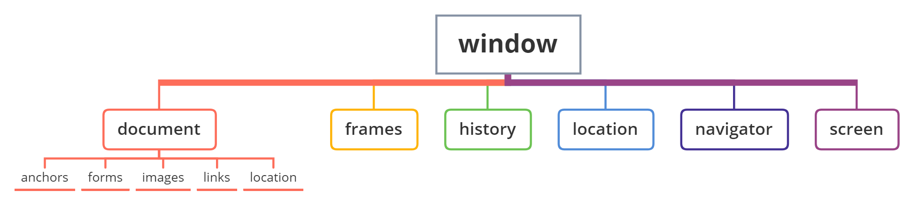

# 	JavaScript Web API

作用：使用JS去操作HTML和浏览器

组成部分:

- DOM（Document Object Model，文档对象模型）
- BOM（Browser Object Model，浏览器对象模型）

## :closed_book:DOM

DOM（Document Object Model ，文档对象模型）一种用于操作XML，HTML文档的**应用编程接口**。

为了能够使 JavaScript 操作 HTML，JavaScript 就有了一套自己的 DOM 接口。


## :star:DOM 树


## :star:Document 对象

### 1.获取 DOM 节点

| `方法`                                  | `描述`                                                       |
| :-------------------------------------- | :----------------------------------------------------------- |
| `document.getElementById(id)`           | 通过元素 id 来查找元素                                       |
| `document.getElementsByTagName(name)`   | 通过标签名来查找元素                                         |
| `document.getElementsByClassName(name)` | 通过类名来查找元素                                           |
| `document.querySelector()`              | 返回文档中匹配指定的CSS选择器的第一个元素                    |
| `document.querySelectorAll()`           | HTML5中引入的新方法，返回文档中匹配的CSS选择器的所有元素节点列表 |

1. 选择匹配的第一个元素：**document.querySelector**

```javascript
document.querySelector('css选择器')
// 参数：包含一个或多个有效的CSS选择器 字符串
// 返回值：CSS选择器匹配的第一个元素，一个HTMLELement对象
```

2. 选择匹配多个元素：**document.querySelectorAll**

```javascript
document.querySelectorAll('ui li')
// 参数：包含一个或多个有效的CSS选择器 字符串
// 返回值：CSS选择器匹配的NodeList 对象集合
```

document.querySelectorAll（'css选择器'）得到是一个 **伪数组**

- 有长度、有索引号的数组
- 没有pop()、push() 等数组方法
- 不可以直接修改，只能通过遍历的方式一次给里面的元素做修改

3. 其他获取 DOM 节点方法

```javascript
//	根据id获取一个元素
document.getElementById('id')
//	根据标签获取一类元素 获取页面所有div
document.getElementByTagName('标签名')
//	根据类名获取元素 获取页面所有类名为w的
document.getElementByClassName('类名')
```


### 2.操作 DOM 节点

DOM 树里每一个内容都称之为节点

节点类型

- 元素节点

  所有的标签 比如 body、div

  html 是根节点

- 属性节点

  所有的属性 比如 class、href

- 文本节点

  所有的文本

- 其他

#### 2.1 增加节点

创建节点

```javascript
// 创造一个新的元素节点
document.createElement('标签名')
```

追加节点

```javascript
// 插入到这个父元素的最后
element.appendChild(要插入的元素)

// 插入到某个子元素的前面
element.insertBefore(要插入的元素, 某个子元素)
```

> 添加节点之前，你要先创建好节点，同时要选好父节点element，第二个方法甚至你还要找好插入位置后面的兄弟节点。

克隆节点

```javascript
// 克隆一个已有的元素节点
element.cloneNode(布尔值)
// true 代表克隆时会包含后代节点一起克隆
// false 代表克隆时不包含后代节点，默认为 false
```

> cloneNode 会克隆出一个跟原标签一样的元素
>


#### 2.2 删除节点

在 JavaScript 原生 DOM 操作中，要删除必须通过 **父节点删除**

```javascript
// 删除元素节点
element.removeChild(要删除的元素)
```

> 删除节点和隐藏节点（display:none）有区别
>


#### 2.3 查找节点

父结点查找

```js
// 获取当前元素的父节点
element.parentNode
```

子节点查找

```javascript
// 获取当前元素的html元素型子节点
element.children

// 获取当前元素的所有类型子节点，包括html元素、文本和属性，返回的是一个伪数组
element.childNodes
```

兄弟关系查找

```javascript
// 查找上一个兄弟节点
element.previousElementSibling
// 查找下一个兄弟节点
element.nextElementSibling
```


#### 2.4 节点内容

```javascript
// 获取当前元素的所有文本，包括html源码和文本，能够识别文本，能够解析标签
element.innerHTML
// 获取当前元素的所有文本，不包含html源码，只识别文本，不能解析标签
element.innerText
```


## :star:操作元素属性

### 1.操作元素常用属性

语法：**`对象.属性 = 值`**

```javascript
// 1.获取元素
const pic = document.querySelector('img')
// 2.操作元素
pic.src = './images/b02.jpg'
pic.title = '刘德华黑马演唱会'
```


### 2.操作元素样式属性

2.1 通过 **style属性** 操作 CSS

语法：**`对象.style.样式属性 = 值`**

```javascript
const box = document.querySelector('.box')
// 修改元素样式
box.style.width = '200px'
box.style.marginTop = '15px'
box.style.backgroundColor = 'pink'
// 若属性有 -连接符，则需要转换为小驼峰命名法
// 赋值的时候，不要忘记加CSS单位
```

> 标签选择 body 的时候，可以直接写 **document.body.style**，因为 body 是唯一的标签

2.2 操作 **类名（className）** 操作CSS

若修改的样式比较多，可借助于 CSS 类名的形式，同时修改多个样式

语法：**`元素.className = '类名'`**

```javascript
元素.className = 'active'
// active 是一个css类名
```

直接使用 className 赋值会 **覆盖** 以前的类名

> - 由于 class 是关键字，所以使用 className代替
> - className 是使用新值**替换**旧值，如果需要添加一个类，需要保留之前的类名

2.3 通过 **classList** 操作类控制CSS（<strong style="color:#DD5145">推荐使用</strong>）

```javascript
// 三个方法，注意加()，不替换以前的类名
// 追加一个类
元素.classList.add('类名')
// 删除一个类
元素.classList.remove('类名')
// 切换一个类，原来有就删除，没有就添加
元素.classList.toggle('类名')
// 查看里面有没有包含某个类，有则返回true，没有则返回false
classList.contains('类名')
```


### 3.操作表单元素属性

表单属性中添加就有效果，移除就没有效果，一律使用布尔值表示

> checked、disabled、selected


### 4.自定义属性

- 标准属性

- 自定义属性

  在 HTML5 中新推出专门的 **data-自定义属性**，标签上一律以 **data- 开头**

  在 DOM 对象上一律以 **dataset 对象** 方式获取

```html
<body>
    <div class="box" data-id="10">盒子</div>
    
    <script>
        const box = document.querySelector('.box')
        console.log(box.dataset.id)
    </script>
</body>
```


## :star:事件

### 1.事件绑定（监听）

事件监听就是计算机对事件进行监听，知道什么时候发生了这个事件，从而执行一些写好的程序。

```javascript
元素对象.addEventListener('事件类型', 要执行的函数)
```

**事件监听三要素：**

- **事件源：** 那个 DOM 元素被事件触发了，要获取dom元素
- **事件类型：** 用什么方式触发，比如鼠标单击 click、鼠标经过mouseover等
- **事件调用的函数：** 要做什么事

**事件监听版本：**

- <strong style="color:#DD5145">DOM L0，传统 on 注册</strong>，**`事件源.on事件 = function(){}`**

  同一个对象，后面注册的事件会 **覆盖** 前面注册（同一个事件）

  直接使用 null 覆盖就可以实现事件的**解绑**

  都是**冒泡阶段**执行的

```js
事件源.onclick = function () {
    // 点击盒子时，将执行这里的语句
}
```

- <strong style="color:#DD5145">DOM L2</strong> ，**`事件源.addEventListener(事件, 事件处理函数, 是否使用捕获){}`** 

  后面注册的事件不会覆盖前面注册的事件（同一个事件）

  可以通过第三个参数去确定是否在冒泡或捕获阶段执行，第三个参数是 False 或 不写，默认都是冒泡

  <strong style="color:#DD5145">先从外到内（捕获阶段），然后再从内到外（冒泡阶段）</strong>

  ```js
  事件源.addEventListener('click', function(){
      // 这是事件处理函数
  }, true)  // true表示监听捕获阶段，false表示监听冒泡阶段
  ```

- **事件解绑**

  普通函数必须使用 **`removeEventListener(事件, 事件处理函数, 是否使用捕获)`** 解绑

  匿名函数无法被解绑

> 区别：on方式会覆盖，addEventListener 方式可绑定多次，拥有事件更多特性

### 2.事件解绑

**1. on事件方式**，直接使用 null 覆盖偶就可以实现事件的解绑

```javascript
// 事件绑定
btn.onclick = function () {
    alert('点击了')
}
// 解绑事件
btn.onclick = null
```

**2. addEventListener方式**

普通函数必须使用 **`removeEventListener(事件类型, 事件处理函数, [获取捕获或冒泡阶段])`** 解绑

可以通过第三个参数去确定是否在冒泡阶段或捕获阶段执行

匿名函数无法被解绑

```js
function fn () {
    alert('点击了')
}
// 绑定事件
btn.addEventListener('click', fn)
// 解绑事件
btn.removeEventListener('click', fn)
```

> 区别：on方式会覆盖，addEventListener 方式可绑定多次，拥有事件更多特性


### 3.事件类型

| 事件类型         | 描述                               |
| ---------------- | ---------------------------------- |
| click            | 鼠标点击                           |
| **`mouseenter`** | 鼠标经过，没有有冒泡效果，**推荐** |
| **`mouseleave`** | 鼠标离开，没有有冒泡效果，**推荐** |
| mouseover        | 鼠标经过，会**有冒泡效果**         |
| mouseout         | 鼠标离开，会**有冒泡效果**         |
| mousemove        | 鼠标移动                           |
| keydown          | 键盘按下触发                       |
| keyup            | 键盘抬起触发                       |
| input            | 输入事件                           |
| focus            | 获得焦点                           |
| blur             | 失去焦点                           |
| change           | 内容发生变化触发                   |


### 4.事件对象

在事件绑定的 **回调函数中的第一个参数** 就是事件对象，**事件对象**也是一个对象，这个对象里面有事件触发时的相关信息

```javascript
元素.addEventListener('click', function (e) {
    console.log(e)
})
// 通常为命名为 event ev e
```

常用属性

| 属性              | 描述                                          |
| ----------------- | --------------------------------------------- |
| type              | 获取当前的事件类型                            |
| clientX / clientY | 获取光标相对于浏览器可见窗口左上角的位置      |
| offsetX / offsetY | 获取光标相对于当前DOM元素左上角的位置         |
| **key**           | 用户按下的键盘键的值（**不建议**使用keyCode） |


### 5.环境对象

环境对象指的是函数内部特殊 **变量 this** ，它代表<strong style="color:#DD5145">当前函数运行时所处的环境</strong>

> 调用的方式不同，this指代的对象也不同，**谁调用，this就指向谁**（调用者）
>
> 直接调用函数，相当于是 window 函数，所以 this 指代 window


### 6.事件委托

事件委托是利用**事件冒泡**的特点，减少注册次数，提高了程序性能。

给**父元素注册事件**，当我们触发子元素的时候，会冒泡到父元素身上，从而触发父元素的事件。

```javascript
事件对象.target.tagName 
// 可以获得真正的触发事件的元素
```


## :star:事件流

事件流指的是事件完整执行过程中的流动路径，分为**事件捕获阶段**、**目标阶段**、**冒泡阶段**。

在**捕获（capturing）阶段**中，事件从祖先元素向下传播到目标元素。当事件达到**目标（target）**元素后，**冒泡（bubbling）**才开始。


### 1. 事件捕获

从 DOM 的根元素开始去执行对应的事件（**从外到里**）。

```javascript
DOM.addEventListener(事件类型, 事件处理函数, 是否使用捕获机制)
// 第三个参数传入，true 代表是捕获阶段触发，默认为 false
```

### 2. 事件冒泡

当一个元素触发事件后，会依次向上调用所有父级元素的 **同名事件**（**从里到外**）。

**事件冒泡是默认存在的：**

- 若使用 **L0 事件** 监听（传统 on 注册），则**只有冒泡阶段**，没有捕获。
- 若使用 **L2 事件** 监听第三个参数是 False，或 **默认都是冒泡**。


### 3. 阻止冒泡和捕获

```javascript
事件对象.stopPropagation()
// 既能阻止冒泡，又能阻止捕获
```

此方法可以 **阻断事件流动传播**，不光在冒泡阶段有效，捕获阶段也有效果。


### 4. 阻止默认行为

```javascript
事件对象.preventDefault()
// 比如 阻止链接跳转 表单域跳转
```


## :star:其他事件

### 1.页面加载事件

加载外部资源（如图片、外联CSS 和 JavaScript等）加载完毕时触发的事件

事件名：**load**

作用：监听页面所有资源加载完毕

```javascript
// 页面加载事件
window.addEventListener('load', function () {
    // 执行的操作
})
```

不光可以监听整个页面资源加载完毕，也可以针对某个资源绑定 load 事件

事件名：**DOMContentLoaded**

作用：监听页面 DOM 加载完毕，无需等待样式表、图像等完全加载

```javascript
document.addEventListener('DOMContentLoaded', function () {
    // 执行的操作
})
```

### 2.元素滚动事件

[参考文章](https://blog.csdn.net/shibazijiang/article/details/103894498)、[参考文章](https://blog.csdn.net/Amnesiac666/article/details/122083846)

事件名：**scroll**

作用：监听整个页面滚动

属性：

**`scrollHeight`**：返回元素的高度（包括元素高度、内边距和溢出尺寸，不包括边框和外边距），**只读**

**`scrollWidth`**：

**`scrollTop`**：设置或获取位于对象最顶端和窗口中可见内容的最顶端之间的距离，**可读写**

**`scrollLeft`**：

------

**`offsetHeight`**：返回元素的高度（包括元素高度、内边距和边框，不包括外边距），**只读**

**`offsetWidth`**：

**`offsetTop`**：获取当前对象到其上级层顶部的距离，**只读**

**`offsetLeft`**：

------

**`clientHeight`**：返回元素的高度（包括元素高度、内边距，不包括边框、外边距和滚动条），**只读**

**`clientWidth`**：

```javascript
// 页面滚动事件
// window 整个页面
window.addEventListener('scroll', function () {
    // 执行的操作
})

// HTML文档返回对象为 HTML元素
document.documentElement

// 检测页面滚动的头部距离（被卷去的头部）
document.documentElement.scrollTop	// 得到的是数字型数据，不带单位
```

事件名：**scrollTo（）**

作用：将内容滚动到指定的坐标

```javascript
// 让页面滚动到 y轴1000像素的位置
window.scrollTo(0, 1000)
```

### 3.页面尺寸事件

会在窗口尺寸改变的时候触发事件

事件名：**resize**

```javascript
// 检测屏幕宽度
window.addEventListener('resize', function () {
    let w = document.documentElement.clientWidth
    console.log(w)
})
```

> 获取位置：**element.getBoundingClientRect（）** 方法返回元素的大小及其**相对于视口**的位置


### 4.M 端事件

触屏事件 touch

- **touchstart**，手指触摸到一个 DOM 元素时触发
- **touchmove**，手指在一个 DOM 元素上滑动时触发
- **touchend**，手指从一个 DOM 元素上移开时触发


## :blue_book:BOM

BOM（Browser Object Model，浏览器对象模型）是为了控制浏览器的行为而出现的接口。

为了能够让 JavaScript 能控制浏览器的行为，JavaScript 就有了一套自己的 BOM 接口。


## :star:window 对象

- window 对象是一个全局对象，也可以说是 JavaScript 中的顶级对象
- 像 document、alert()、console.log() 等都是 window 的属性，基本 BOM 的属性和方法都是 window 的
- 所有通过 va r定义在全局作用域中的变量、函数都会变成 window 对象的属性和方法
- window 对象下的属性和方法调用的时候可以省略 window




### 1.location 对象

**location** 的数据类型是对象，它拆分并保存了 URL 地址的各个组成部分

常用属性和方法：

- **href** 属性获取完整的 URL 地址，对其赋值时用于 **地址的跳转**

  ```js
  location.href = https://developer.mozilla.org/zh-CN/docs/Web/API/Window/location
  ```

- **search** 属性获取地址中携带的参数，符号 ？后面部分

- **hash** 属性获取地址中的哈希值，符号 # 后面部分

- **reload（）** 方法用来刷新当前页面，传入参数 true 时表示强制刷新


### 2.history 对象

**history** 的数据类型是对象，主要**管理历史记录**，该对象与浏览器地址栏的操作相对应，如前进、后退、历史记录等。

常用属性和方法：

- **back（）** 后退功能
- **forward（）** 前进功能
- **go（参数）**  前进后退功能，1表示前进1个页面，-1表示后退1个页面

`history.back()` 原页表表单中的内容会保留：

```html
<a href="javascript:history.back();">返回上一页</a>  
```

`history.go(-1)` 原页面表单中的**内容会丢失**：

```html
<a onclick="javascript:history.go(-1);">返回上一页</a>  
```


### 3.navigator 对象

**navigator** 的数据类型是对象，该对象记录了浏览器自身的相关信息

常用属性和方法：通过 **userAgent** 检测浏览器的版本及平台

```javascript
// 检测 userAgent（浏览器信息） 立即执行函数
!(function () {
    const userAgent = navigator.userAgent
    // 验证是否为Android或iPhone
    const android = userAgent.match(/(Android);?[\s\/]+([\d.]+)?/)
    const iphone = userAgent.match(/(iPhone\sOS)\s([\d_]+)/)
    // 如果是Android或iPhone，则跳转至移动站点
    if (android || iphone) {
        location.href = 'http://m.itcast.cn'
    }
})();
```


### 4.screen 对象


## :star:浏览器弹窗

可以在 JavaScript 中创建三种消息框：警告框、确认框、提示框。

### 1.警告框

警告框经常用于确保用户可以得到某些信息。

当警告框出现后，用户需要点击确定按钮才能继续进行操作。

```js
window.alert("sometext")
```

> `window.alert()` 方法可以不带上window对象，直接使用 `alert()` 方法。


### 2.确认框

确认框通常用于验证是否接受用户操作。

当确认框弹出时，用户可以点击 "确认" 或者 "取消" 来确定用户操作。

当你点击 "确认", 确认框返回 true， 如果点击 "取消", 确认框返回 false。

```js
window.confirm("sometext")
```

> `window.confirm()` 方法可以不带上window对象，直接使用 `confirm()` 方法。


### 3.提示框

提示框经常用于提示用户在进入页面前输入某个值。

当提示框出现后，用户需要输入某个值，然后点击确认或取消按钮才能继续操纵。

如果用户点击确认，那么返回值为输入的值。如果用户点击取消，那么返回值为 null。

```js
window.prompt("sometext","defaultvalue")
```

> `window.prompt()` 方法可以不带上window对象，直接使用 `prompt()` 方法。


## :star:Web Storage

本地存储只能存储 **字符串数据类型**，将 **复杂数据类型** 转换为 **JSON字符串**，存储到本地存储中。

### 1.localStorage

`localStorage` 用于持久化的本地存储，除非主动删除数据，否则数据是永远不会过期的。同源可以读取并修改 localStorage 数据。

- 数据可以持久存储在本地浏览器中，数据不会丢失
- 以**键值对**的形式存储，并且存储的是**字符串**，省略了 window
- 需要手动清除，数据才会消失
- 属性名使用**双引号**引起来，不能是单引号

相关API

```javascript
// 存储数据
localStorage.setItem(key, value)
// 获取数据
localStorage.getItem(key)
// 删除数据
localStorage.removeItem(key)
// 清空所有数据
localStorage.clear()
```

### 2.sessionStorage

sessionStorage 用于本地存储一个会话（session）中的数据，这些数据只有在同一个会话中的页面才能访问。并且当会话结束后数据也随之销毁。因此 sessionStorage 不是一种持久化的本地存储，仅是会话级别的存储。**只允许同一窗口访问**。

用法跟 localStorage 基本相同。

- 生命周期，存储的数据随着浏览器窗口关闭而消失
- 在同一个窗口（页面）下数据可以共享
- 以键值对的形式存储使用
- 属性名使用**双引号**引起来，不能是单引号

```javascript
JSON.stringify(复杂数据类型) // 存储 复杂数据类型

JSON.parse(JSON字符串) // 读取
// 注意
JSON.parse(null) // 结果依然是null
```

### 3.拓展 -- cookie

**Cookie，存储少量数据，面向服务器**，cookie 其实就是一些数据信息，类型为“**小型文本文件**”，存储于电脑上的文本文件中。

存储在浏览器中，每次浏览器向服务器发生请求都需要携带 cookie，一般情况下，cookie 产生与服务器端，保存与客户端。

可以借助 js-cookie 第三方库来操作 cookie。

- `new Cookie(String name, String value)`：创建一个Cookie对象，必须传入cookie的名字和cookie的值
- `getValue()`：得到cookie保存的值
- `getName()`：获取cookie的名字
- `setMaxAge(int expiry)`：设置cookie的有效期，默认为-1。这个如果设置负数，表示客服端关闭，cookie就会删除。0表示马上删除。正数表示有效时间，单位是秒。
- `setPath(String uri)`：设置cookie的作用域


### 三者的区别

**1 存储大小不同**

- cookie： 4K
- session : 5M
- local：5M

**2 数据有效期不同**

- cookie：可以设置， 设置过期时间， 也可以手动清空
- session：仅在浏览器关闭前有效
- local：永久有效，除非手动清除

**3 作用域**

- cookie：在所有同源窗口共享
- session：仅在一个浏览器共享，不同浏览器不共享
- local：在所有同源窗口共享

**4 通信**

- cookie：通过http,在浏览器和服务器传递
- session：仅在客户端
- local：仅在客户端

**5 应用**

- cookie：判断用户是否登陆过，记忆密码自动登录
- session：敏感账号一次登录，关闭浏览器删除
- local：个人长期登录， 长期保存数据


[参考文章](https://blog.csdn.net/qq_51066068/article/details/124413001)


## :star:定时器

### 1.间歇函数

设置定时器 **`setInterval(函数, 间隔时间){}`** 

```javascript
setInterval(函数, 间隔时间)
// 每隔一段时间调用这个函数，间隔时间单位是毫秒

function fn() {
    // 执行内容
}
setInterval(fn, 1000)
// 直接使用函数名，不加小括号
```

> 定时器返回的是一个 **id数字**，使用 **let 声明**

关闭定时器 **`clearInterval(定时器名)`** 

```javascript
let 变量名 = setInterval(函数, 间隔时间)
// 关闭定时器
clearInterval(定时器名)
```


### 2.延时函数

JavaScript 内置的一个用来让代码延迟执行的函数 **`setTimeout()`**，**只执行一次** 

```javascript
// 开启定时器
let timerId = seTimeout(回调函数, 延迟时间)
// 清除延时函数
clearTimeout(timerId)

// setTiemout 仅仅只执行一次
```

每一次调用延时器都会产生一个新的延时器

### 3.两者区别

- `setTimeout` 函数是一种异步定时器，它只会在经过指定的时间后执行一次。
- `setInterval` 函数也是一种定时器，但它会按照指定的时间间隔重复执行。
- 两者的区别在于执行次数，setTimeout <strong style="color:#DD5145">只执行一次</strong>，setInterval <strong style="color:#DD5145">会反复执行</strong>。


## :page_facing_up:参考

[参考文章](https://blog.csdn.net/qq_52736131/article/details/123563321)