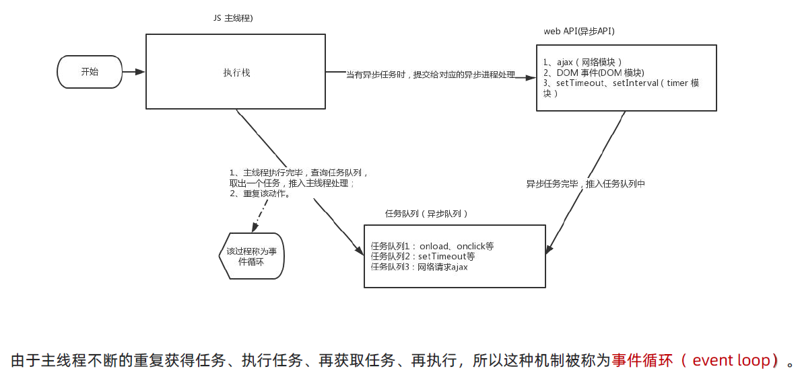

# Web APIs

## Web APIs 01

### const 声明

const声明的值不能改变

对于引用数据类型，const声明的变量，里面存的不是值，而是 **地址**

<strong style="color:#DD5145">建议数组和对象使用 const 来声明</strong>

### API 作用和分类

使用 JS 去操作 HTML和 浏览器

分为DOM（Document Object Model，文档对象模型）、BOM（浏览器对象模型）

DOM：是JS操作网页的接口。作用是将网页转为一个JS对象，可以用脚本进行各种操作（比如增删内容）

DOM树：文档树直观的体现了标签与标签之间的关系

DOM：浏览器根据html标签生成的 **JS对象（DOM对象）**

> - 所有的标签属性都可以在这个对象上面找到	
> - 修改这个对象的属性会自动映射到标签身上
> - DOM的核心就是把内容当对象来处理

document 是 DOM 里面最大的一个对象

### 获取DOM对象

| 方法                                    | 描述                                                         |
| :-------------------------------------- | :----------------------------------------------------------- |
| `document.getElementById(id)`           | 通过元素 id 来查找元素                                       |
| `document.getElementsByTagName(name)`   | 通过标签名来查找元素                                         |
| `document.getElementsByClassName(name)` | 通过类名来查找元素                                           |
| `document.querySelector()`              | 返回文档中匹配指定的CSS选择器的第一个元素                    |
| `document.querySelectorAll()`           | HTML5中引入的新方法，返回文档中匹配的CSS选择器的所有元素节点列表 |

1. 选择匹配的第一个元素：**document.querySelector**

```javascript
document.querySelector('css选择器')
// 参数：包含一个或多个有效的CSS选择器 字符串
// 返回值：CSS选择器匹配的第一个元素，一个HTMLELement对象
```

2. 选择匹配多个元素：**document.querySelectorAll**

```javascript
document.querySelectorAll('ui li')
// 参数：包含一个或多个有效的CSS选择器 字符串
// 返回值：CSS选择器匹配的NodeList 对象集合
```

document.querySelectorAll（'css选择器'）得到是一个 **伪数组**

> - 有长度、有索引号的数组
> - 没有pop()、push() 等数组方法
> - 不可以直接修改，只能通过遍历的方式一次给里面的元素做修改

3. 其他获取DOM元素方法

```javascript
//	根据id获取一个元素
document.getElementById('id')
//	根据标签获取一类元素 获取页面所有div
document.getElementByTagName('标签名')
//	根据类名获取元素 获取页面所有类名为w的
document.getElementByClassName('类名')
```


### 操作元素内容

```javascript
// 元素.innerText 属性，只识别文本，不能解析标签
// 元素.innerHTML 属性，能够识别文本，能够解析标签
```


### 操作元素属性

#### 1.操作元素常用属性

> **对象.属性 = 值**

```javascript
// 1.获取元素
const pic = document.querySelector('img')
// 2.操作元素
pic.src = './images/b02.jpg'
pic.title = '刘德华黑马演唱会'
```

#### 2.操作元素样式属性

2.1 通过 **style属性** 操作CSS

> **对象.style.样式属性 = 值**

行内样式表，权重比较高

```javascript
const box = document.querySelector('.box')
// 修改元素样式
box.style.width = '200px'
box.style.marginTop = '15px'
box.style.backgroundColor = 'pink'
// 若属性有 -连接符，则需要转换为小驼峰命名法
// 赋值的时候，不要忘记加CSS单位
```

标签选择 body 的时候，可以直接写 **document.body.style**，因为body是唯一的标签

2.2 操作 **类名（className）** 操作CSS

若修改的样式比较多，可借助于 css类名的形式，同时修改多个样式

> **元素.className = '类名'**

```javascript
元素.className = 'active'
// active 是一个css类名
```

直接使用 className 赋值会 ==覆盖==以前的类名

> 由于 class 是关键字，所以使用 className代替
>
> className 是使用新值**替换**旧值，如果需要添加一个类，需要保留之前的类名

2.3 通过 **classList** 操作类控制CSS（==推荐使用==）

```javascript
// 三个方法，注意加()，不替换以前的类名
// 追加一个类
元素.classList.add('类名')
// 删除一个类
元素.classList.remove('类名')
// 切换一个类，原来有就删除，没有就添加
元素.classList.toggle('类名')
// 查看里面有没有包含某个类，有则返回true，没有则返回false
classList.contains('类名')
```


#### 3.操作表单元素属性

表单属性中添加就有效果，移除就没有效果，一律使用布尔值表示

> checked、disabled、selected

#### 4.自定义属性

- 标准属性

- 自定义属性

  在 HTML5 中新推出专门的 **data-自定义属性**，标签上一律以 **data- 开头**

  在 DOM 对象上一律以 **dataset 对象** 方式获取

```html
<body>
    <div class="box" data-id="10">盒子</div>
    
    <script>
        const box = document.querySelector('.box')
        console.log(box.dataset.id)
    </script>
</body>
```

### 定时器-间歇函数

设置定时器 **`setInterval(函数, 间隔时间) {}`**

```javascript
setInterval(函数, 间隔时间)
// 每隔一段时间调用这个函数，间隔时间单位是毫秒

function fn() {
    // 执行内容
}
setInterval(fn, 1000)
// 直接使用函数名，不加小括号
```

> 定时器返回的是一个 **id数字**，使用 **let 声明**

关闭定时器 **`clearInterval(定时器名)`**

```javascript
let 变量名 = setInterval(函数, 间隔时间)
// 关闭定时器
clearInterval(定时器名)
```

## Web APIs 02

### 1. 事件绑定（监听）

事件监听就是让程序检测是否有时间产生，一旦有事件触发，就立即调用一个函数作出响应，也称**注册事件**

```javascript
元素对象.addEventListener('事件类型', 要执行的函数)
```

**事件监听三要素：**

> - **事件源：** 那个dom元素被事件触发了，要获取dom元素
> - **事件类型：** 用什么方式触发，比如鼠标单击 click、鼠标经过mouseover等
> - **事件调用的函数：** 要做什么事

**事件监听版本：**

- DOM L0，传统 on 注册，**`事件源.on事件 = function(){}`**

  同一个对象，后面注册的事件会 **覆盖** 前面注册（同一个事件）

  直接使用 null 覆盖就可以实现事件的解绑

  都是**冒泡阶段**执行的

- DOM L2 （**推荐**），**`事件源.addEventListener(事件, 事件处理函数, 是否使用捕获){}`** 

  后面注册的事件不会覆盖前面注册的事件（同一个事件）

  可以通过第三个参数去确定是否在冒泡阶段或捕获阶段执行

- 解绑

  普通函数必须使用 **`removeEventListener(事件, 事件处理函数, 是否使用捕获)`** 解绑

  匿名函数无法被解绑

> 区别：on方式会覆盖，addEventListener 方式可绑定多次，拥有事件更多特性


### 2. 事件类型

| 事件类型   | 描述             |
| ---------- | ---------------- |
| click      | 鼠标点击         |
| mouseenter | 鼠标经过         |
| mouseleave | 鼠标离开         |
| mousemove  | 鼠标移动         |
| keydown    | 键盘按下触发     |
| keyup      | 键盘抬起触发     |
| input      | 输入事件         |
| focus      | 获得焦点         |
| blur       | 失去焦点         |
| change     | 内容发生变化触发 |


### 回调函数（callback）

[参考文章](https://blog.csdn.net/weixin_47075145/article/details/125752446)

如果将**函数A做为参数**传递给**函数B** 时，称**函数A为回调函数**

执行完某个命名之后，回头调用的函数，简称**回调函数**

```javascript
function A() {
    // 函数体
}
// 函数A 作为回调函数
setTimeout(A, 1000)
```

> 判断是否为回调函数，首先你得看调用它的是不是也是一个函数，它是不是作为了一个函数的参数

**回调函数特点：**

> 1. 不会立即执行
> 2. 回调函数是一个闭包
> 3. 执行前类型判断

**回调函数中this的指向问题**

回调函数调用时 this 的执行上下文并 <strong style="color:#32CD32">不是回调函数定义时的上下文</strong>，<strong style="color:#DD5145">而是调用它的函数所在的上下文</strong>。

```html
<script>
    function createData(callback){
        callback();
    }
    var obj ={
        data:100,
        tool:function(){
            // let self = this			// 这里的this指向obj，然后当一个变量去使用
            createData(function(n){
                console.log(this,1111);  // window 1111
            })
        }
    }
    obj.tool();
</script>
```

分析：

> this指向是 **离它最近的或者嵌套级别的 function/方法的调用者**
>
> 这里离它最近的function是`function(n)`，会回到上面的callback()中，这时候调用者就不是obj而是window
>
> 全局环境就是在`<script></script>`里面，这里的this始终指向的是window对象

解决方法：

- 箭头函数
- `let self = this`


### 3. 事件对象

在事件绑定的 **回调函数中的第一个参数** 就是事件对象，**事件对象**也是一个对象，这个对象里面有事件触发时的相关信息

```javascript
元素.addEventListener('click', function (e) {
    console.log(e)
})
// 通常为命名为 event ev e
```

常用属性

| 属性              | 描述                                          |
| ----------------- | --------------------------------------------- |
| type              | 获取当前的事件类型                            |
| clientX / clientY | 获取光标相对于浏览器可见窗口左上角的位置      |
| offsetX / offsetY | 获取光标相对于当前DOM元素左上角的位置         |
| **key**           | 用户按下的键盘键的值（==不建议==使用keyCode） |


### 4. 环境对象

环境对象指的是函数内部特殊 **变量 this** ，它代表<strong style="color:#DD5145">当前函数运行时所处的环境</strong>

> 调用的方式不同，this指代的对象也不同，**谁调用，this就指向谁**（调用者）
>
> 直接调用函数，相当于是 window 函数，所以 this 指代 window

### trim（ ）

> 去除字符串两侧的空格


## Web APIs 03

### 事件流

**事件流** 指的是事件完整执行过程中的流动路径，分为**事件捕获阶段**、**目标阶段**、**事件冒泡阶段**

#### 1. 事件捕获

> 从DOM的根元素开始去执行对应的事件（**从外到里**）

```javascript
DOM.addEventListener(事件类型, 事件处理函数, 是否使用捕获机制)
// 第三个参数传入，true 代表是捕获阶段触发，默认为 false
```

> 若是用 **L0 事件**监听（传统on注册），则**只有冒泡阶段**，没有捕获

#### 2. 事件冒泡

**事件冒泡是默认存在的**

> 当一个元素触发事件后，会依次向上调用所有父级元素的 **同名事件**（**从里到外**）
>
> L2 事件监听第三个参数是 False，或 默认都是冒泡

#### 3. 阻止冒泡和捕获

```javascript
事件对象.stopPropagation()
// 既能阻止冒泡，又能阻止捕获
```

此方法可以 **阻断事件流动传播**，不光在冒泡阶段有效，捕获阶段也有效果	

#### 4. 阻止默认行为

```javascript
事件对象.preventDefault()
// 比如 阻止链接跳转 表单域跳转
```

#### 5. 解绑事件

**1. on事件方式**，直接使用 null 覆盖偶就可以实现事件的解绑

```javascript
// 事件绑定
btn.onclick = function () {
    alert('点击了')
}
// 解绑事件
btn.onclick = null
```

**2. addEventListener方式**，必须使用 `removeEventListener`

```javascript
removeEventListener(事件类型, 事件处理函数, [获取捕获或冒泡阶段])
// 匿名函数无法被解绑
```

> 可以通过第三个参数去确定是否在冒泡阶段或捕获阶段执行

```javascript
function fn () {
    alert('点击了')
}
// 绑定事件
btn.addEventListener('click', fn)
// 解绑事件
btn.removeEventListener('click', fn)
```

#### 6.鼠标经过事件

> mouseover 和 mouseout 会**有冒泡效果**
>
> **mouseenter** 和 **mouseleave** 没有冒泡效果（**推荐**）


### 事件委托

事件委托是利用事件冒泡的特点，减少注册次数，提高了程序性能

> 给**父元素注册事件**，当我们触发子元素的时候，会冒泡到父元素身上，从而触发父元素的事件

```javascript
事件对象.target.tagName 
// 可以获得真正的触发事件的元素
```


### 其他事件

#### 1. 页面加载事件

加载外部资源（如图片、外联CSS 和 JavaScript等）加载完毕时触发的事件

事件名：**load**

作用：监听页面所有资源加载完毕

```javascript
// 页面加载事件
window.addEventListener('load', function () {
    // 执行的操作
})
```

不光可以监听整个页面资源加载完毕，也可以针对某个资源绑定 load 事件

事件名：**DOMContentLoaded**

作用：监听页面 DOM 加载完毕，无需等待样式表、图像等完全加载

```javascript
document.addEventListener('DOMContentLoaded', function () {
    // 执行的操作
})
```

#### 2. 元素滚动事件

[参考文章](https://blog.csdn.net/shibazijiang/article/details/103894498)、[参考文章](https://blog.csdn.net/Amnesiac666/article/details/122083846)

事件名：**scroll**

作用：监听整个页面滚动

属性：

**`scrollHeight`**：返回元素的高度（包括元素高度、内边距和溢出尺寸，不包括边框和外边距），**只读**

**`scrollWidth`**：

**`scrollTop`**：设置或获取位于对象最顶端和窗口中可见内容的最顶端之间的距离，**可读写**

**`scrollLeft`**：

------

**`offsetHeight`**：返回元素的高度（包括元素高度、内边距和边框，不包括外边距），**只读**

**`offsetWidth`**：

**`offsetTop`**：获取当前对象到其上级层顶部的距离，**只读**

**`offsetLeft`**：

------

**`clientHeight`**：返回元素的高度（包括元素高度、内边距，不包括边框、外边距和滚动条），**只读**

**`clientWidth`**：

```javascript
// 页面滚动事件
// window 整个页面
window.addEventListener('scroll', function () {
    // 执行的操作
})

// HTML文档返回对象为 HTML元素
document.documentElement

// 检测页面滚动的头部距离（被卷去的头部）
document.documentElement.scrollTop	// 得到的是数字型数据，不带单位
```

事件名：**scrollTo（）**

作用：将内容滚动到指定的坐标

```javascript
// 让页面滚动到 y轴1000像素的位置
window.scrollTo(0, 1000)
```

#### 3. 页面尺寸事件

会在窗口尺寸改变的时候触发事件

事件名：**resize**

```javascript
// 检测屏幕宽度
window.addEventListener('resize', function () {
    let w = document.documentElement.clientWidth
    console.log(w)
})
```

> 获取位置：**element.getBoundingClientRect（）** 方法返回元素的大小及其**相对于视口**的位置
>

## Web APIs 04

### 日期对象

Date（） 是一个构造函数，所有需要实例化后才能使用，必须使用 new 来调用创建我们的日期对象

#### 1. 实例化

在代码中发现了 **new 关键字** 时，一般将这个操作称为 **实例化**

```javascript
// 获取 当前时间
const date = new Date()		// 实例化对象

// 获取 指定时间
const date = new Date('2008-8-8')
```

#### 2. 日期对象方法

使用下列方法之前 **必须实例化**

> - getFullYear（） 获取年份，四位年份
> - getMonth（） 获取月份，取值 0~11，月份要 **加1**
> - getDate（） 获取当月的具体一天
> - getDay（） 获取星期，取值 0~6，0代表星期天
> - getHours（） 获取小时，取值 0~23
> - getMinutes（） 获取分钟，取值 0~59
> - getSeconds（） 获取秒数，0~59

时间的另一种方法

```javascript
const date = new Date()
console.log(date)	// Wed Mar 15 2023 20:27:09 GMT+0800 (中国标准时间)
console.log(date.toLocaleString())	// 2023/3/15 20:27:09
console.log(date.toLocaleDateString())	// 2023/3/15
console.log(date.toLocaleTimeString())	// 20:27:09
```

#### 3. 时间戳

是指1970年01月01日00时00分00秒起至今的毫秒数，它是一种特殊的计量时间的方式

> **将来的时间戳 - 现在的时间戳 = 剩余时间毫秒数** 用作倒计时

三种方式获取时间戳

```javascript
// 方法一：使用 getTime()方法，必须先实例化
const date = new Date()
console.log(date.getTime())
```

```javascript
// 方法二：简写 +new Date()
console.log(+new Date())
console.log(+new Date('2023-3-14 18:30:00'))
```

但是只能返回**当前时间戳**，无法像前两种方法一样返回**指定的时间戳**

```javascript
// 方法三：使用 Date.now()方法，无需实例化
console.log(Date.now())
```

### 节点操作

#### 1. DOM节点

DOM树里每一个内容都称之为节点

节点类型

> - 元素节点
>
>   所有的标签 比如 body、div
>
>   html 是根节点
>
> - 属性节点
>
>   所有的属性 比如 class、href
>
> - 文本节点
>
>   所有的文本
>
> - 其他

#### 2. 查找节点

父结点查找

> **子元素.parentNode**，返回最近一级的父节点，找不到返回 null

子节点查找

```javascript
// 获取所有元素节点（不包括空格、换行、注释节点），返回的是一个伪数组
父元素.children
```

兄弟关系查找

```javascript
// 查找上一个兄弟节点
元素.previousElementSibling
// 查找下一个兄弟节点
元素.nextElementSibling
```

#### 3. 增加节点

创建节点

```javascript
// 创造一个新的元素节点
document.createElement('标签名')
```

追加节点

```javascript
// 插入到这个父元素的最后
父元素.appendChild(要插入的元素)
```

```javascript
// 插入到某个子元素的前面
父元素.insertBefore(要插入的元素, 某个子元素)
```

克隆节点

```javascript
// 克隆一个已有的元素节点
元素.cloneNode(布尔值)
// true 代表克隆时会包含后代节点一起克隆
// false 代表克隆时不包含后代节点，默认为 false
```

cloneNode 会克隆出一个跟原标签一样的元素

#### 4. 删除节点

在 JavaScript 原生 DOM 操作中，要删除必须通过 **父元素删除**

```javascript
// 删除元素节点
父元素.removeChild(要删除的元素)
```

删除节点和隐藏节点（display:none）有区别

### M 端事件

触屏事件 touch

> - **touchstart**，手指触摸到一个 DOM 元素时触发
> - **touchmove**，手指在一个 DOM 元素上滑动时触发
> - **touchend** 手指从一个 DOM 元素上移开时触发

## Web APIs 05

### Window对象

#### 1.BOM

**BOM**（Browser Object Model）是浏览器对象模型

> - window对象是一个全局对象，也可以说是JavaScript中的顶级对象
> - 像document、alert()、console.log()等都是window的属性，基本BOM的属性和方法都是window的
> - 所有通过var定义在全局作用域中的变量、函数都会变成window对象的属性和方法
> - window对象下的属性和方法调用的时候可以省略window


#### 2.location对象

**location** 的数据类型是对象，它拆分并保存了 URL 地址的各个组成部分

常用属性和方法：

> - **href** 属性获取完整的 URL 地址，对其赋值时用于 **地址的跳转**
> - **search** 属性获取地址中携带的参数，符号 ？后面部分
> - **hash** 属性获取地址中的哈希值，符号 # 后面部分
> - **reload（）** 方法用来刷新当前页面，传入参数 true 时表示强制刷新

#### 3.navigator对象

**navigator** 的数据类型是对象，该对象记录了浏览器自身的相关信息

常用属性和方法：通过 **userAgent** 检测浏览器的版本及平台

```javascript
// 检测 userAgent（浏览器信息） 立即执行函数
!(function () {
    const userAgent = navigator.userAgent
    // 验证是否为Android或iPhone
    const android = userAgent.match(/(Android);?[\s\/]+([\d.]+)?/)
    const iphone = userAgent.match(/(iPhone\sOS)\s([\d_]+)/)
    // 如果是Android或iPhone，则跳转至移动站点
    if (android || iphone) {
        location.href = 'http://m.itcast.cn'
    }
})();
```


#### 4.history对象

**history** 的数据类型是对象，主要**管理历史记录**，该对象与浏览器地址栏的操作相对应，如前进、后退、历史记录等

常用属性和方法：

> - **back（）** 后退功能
> - **forward（）** 前进功能
> - **go（参数）**  前进后退功能，1表示前进1个页面，-1表示后退1个页面


### 定时器-延时函数

JavaScript 内置的一个用来让代码延迟执行的函数 **setTimeout（）**，**只执行一次**

```javascript
// 开启定时器
let timerId = seTimeout(回调函数, 延迟时间)
// 清除延时函数
clearTimeout(timerId)

// setTiemout 仅仅只执行一次
```

每一次调用延时器都会产生一个新的延时器

### JS 执行机制

JavaScript 语言的一大特点急就是 **单线程**

JS中出现了 **同步** 和 **异步**，本质区别是这流水线上各个流程的执行顺序不同

> - **同步任务**：都在**主线程**上执行，形成一个 **执行栈**
>
> - **异步任务**：都添加到 **任务队列（消息队列）**，JS的**异步**通过**回调函数**实现
>
>   普通事件，如 click、resize 等
>
>   资源加载，如 load、error 等
>
>   定时器，包括setInterval、setTimeout 等

JS 执行过程：

> 1. 先执行 **执行栈** 中的 **同步任务**
> 2. **异步任务** 放入 **任务队列** 中
> 3. 一旦执行栈中的所有 **同步任务执行完毕**，系统就会按次序读取 **任务队列** 在的 **异步任务**，于是被读取的异步任务结束等待状态，进入执行栈，开始执行


由于主线程不断的重复获得任务、执行任务、再获取任务、再执行、所有这种机制被称为 **事件循环（event loop）**




### 本地存储

#### 1.localStorage

> - 数据可以长期保留在本地浏览器中，数据不会丢失
> - 以 **键值对** 的形式存储，并且存储的是 **字符串**，省略了window
> - 需要手动清除，数据才会消失

相关API

```javascript
// 存储数据
localStorage.setItem(key, value)
// 获取数据
localStorage.getItem(key)
// 删除数据
localStorage.removeItem(key)
// 清空所有数据
localStorage.clear()
```

#### 2.sessionStorage

用法跟 localStorage 基本相同

> - 生命周期，存储的数据随着浏览器窗口关闭而消失
> - 在同一个窗口（页面）下数据可以共享
> - 以键值对的形式存储使用

本地存储只能存储 **字符串数据类型**，将 **复杂数据类型** 转换为 **JSON字符串**，存储到本地存储中

属性名使用 **双引号** 引起来，不能是单引号

```javascript
JSON.stringify(复杂数据类型) // 存储 复杂数据类型

JSON.parse(JSON字符串) // 读取
// 注意
JSON.parse(null) // 结果依然是null
```


## Web APIs 06

### 正则表达式

JavaScript 中定义正则表达式的语法有两种：

1. **定义** 正则表达式语法

```javascript
const 变量名 = /表达式/
// 其中 / / 是正则表达式字面量
```

2. **判断** 是否符合规则的字符串

```javascript
const regObj = /表达式/
regObj.test(被检测的字符串)
// 如果正则表达式与指定的字符串匹配，返回true，否则false
```

3. **检索**（查找）符合规则的字符串

```javascript
regObj.exec(被检测的字符串)
// 如果匹配成功，则返回一个数组，否则返回null
```

### 元字符

#### 1.边界符

表示位置，开头和结尾，必须用什么开头，用什么结尾

| 边界符 | 说明                           |
| ------ | ------------------------------ |
| ^      | 表示匹配行首的文本（以谁开始） |
| $      | 表示匹配行尾的文本（以谁结束） |

**如果 ^ 和 $ 在一起，表示必须精确匹配**

#### 2.量词

表示重复次数设定某个模式出现的次数

| 量词  | 说明                        |
| ----- | --------------------------- |
| *     | 重复0次或多次，类似 >=0     |
| +     | 重复1次或多次，类似 >=1     |
| ?     | 重复0次或1次，类似 0 \|\| 1 |
| {n}   | 重复n次                     |
| {n,}  | 重复n次或多次               |
| {n,m} | 重复n到m次                  |

#### 3.字符类

> **[  ]** 匹配字符集合，**只能选一个**
>
> [  ] 里面加上 - （连字符），表示一个范围
>
> [  ] 里面加上 ^ （取反符号），要写到中括号里面

```javascript
console.log(/[abc]/.test('andy'))	// true
// 字符串只要包含 abc 中任意一个字符，都返回 true
```

> **.** （点） 匹配除换行符之外的任何单个字符

预定义：指的是 某些常见模式的简写方式

| 预定类 | 说明                                                         |
| ------ | ------------------------------------------------------------ |
| \d     | 匹配一个数字字符。等价于 [0-9]                               |
| \D     | 匹配一个非数字字符。等价于 [\^ 0-9]                          |
| \w     | 匹配字母、数字、下划线。等价于 [A-Za-z0-9_]                  |
| \W     | 匹配非字母、数字、下划线。等价于 [\^ A-Za-z0-9_]             |
| \s     | 匹配任何空白字符，包括空格、制表符、换页符等等。等价于 [ \f\n\r\t\v] |
| \S     | 匹配任何非空白字符。等价于 [\^ \f\n\r\t\v]                   |

```javascript
// 日期格式：/^\d{4}-\d{1,2}-d{1,2}$/
```

#### 4.修饰符

修饰符约束正则执行的某些细节行为

> **/ 表达式 / 修饰符**

下表列出了正则表达式常用的修饰符：

| 修饰符 | 含义                             | 描述                                                         |
| ------ | -------------------------------- | ------------------------------------------------------------ |
| **i**  | ignore - 不区分大小写            | 将匹配设置为不区分大小写，搜索时不区分大小写                 |
| **g**  | global - **全局匹配**            | 查找字符串中所有的匹配项                                     |
| m      | multi line - 多行匹配            | 使边界字符 \^ 和 \$ 匹配每一行的开头和结尾，<br>**记住是多行**，而不是整个字符串的开头和结尾 |
| s      | 特殊字符圆点 \. 中包含换行符 \\n | 默认情况下的圆点 \. 是匹配除换行符 \\n 之外的任何字符，<br>加上 s 修饰符之后，\. 中包含换行符 \\n |

> replace（） 替换
>
> **字符串.replace(/正则表达式/, '替换文本')**