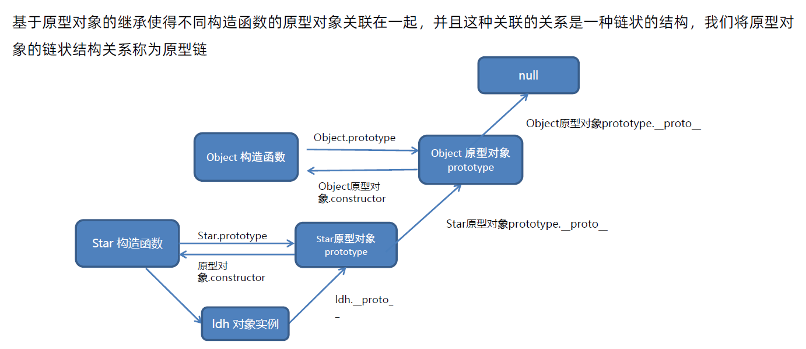

# JS进阶

## JS 进阶 01

### 作用域

#### 1.作用域

作用域（scope）规定了变量能够被访问的 “范围”，离开这个 “范围” 变量便不能被访问

1. **局部作用域**

> **函数作用域**
>
> - 函数内部声明的变量，在函数外部无法被访问
> - 函数的参数也是函数内部的局部变量
> - 不同函数内部声明的变量无法互相访问
> - 函数执行完毕后，函数内部的变量实际被清空了

> **块作用域**
>
> 在 JavaScript 中使用 **`{}`** 包裹的代码称为代码块，代码块内部声明的变量外部**有可能**无法被访问
>
> -  **`let`** 声明的变量**会产生**块作用域，var 不会产生块作用域
> -  **`const`** 声明的常量**会产生**块作用域
> -  **`for {}`** 也是⼀个块作⽤域.
> -  不同代码块之间的变量无法相互访问
> -  推荐使用 let 或 const

2. **全局作用域**

**\<script>标签** 和 **.js文件** 的最外层就是所谓的全局作用域，在此声明的变量在函数内部也可以被访问。<br>全局作用域中声明的变量，任何其它作用域都可以被访问

> - 为 window 对象动态添加的属性默认也是全局的，不推荐！
> - 函数中未使用任何关键字声明的变量为全局变量，不推荐！
> - 尽可能少的声明全局变量，防止变量被污染

3. **作用域链**

作用域链本质上是底层的 **变量查找机制**，类似冒泡

> - 在函数被执行时，会 **优先查找当前** 函数作用域中查找变量
> - 如果当前作用域查找不到，则会 **依次逐级查找父级作用域** 直到 **全局作用域**
> - 子级作用域可以访问父级作用域，父级作用域无法访问子级作用域

#### 2.垃圾回收机制

垃圾回收机制（Garbage Collection）简称GC，js中**内容**的分配和回收都是**自动完成**的，内存在不使用的时候会被**垃圾回收器**自动回收

内存的生命周期：

> 1. 内存**分配**：当我们声明变量、函数、对象的时候，系统会自动为他们分配内存
> 2. 内存**使用**：即读写内存，也就是使用变量、函数等
> 3. 内存**回收**：使用完毕，由**垃圾回收器**自动回收不再使用的内存

说明：

> - 全局变量一般不会回收（关闭页面才会回收）
> - 一般情况下局部变量的值，不使用了，会被自动回收掉

**内存泄露：**程序中分配的内存由于某种原因，程序 **未释放** 或 **无法释放** 叫做内存泄露，垃圾回收机制就是防止内存泄露的。

栈堆空间分配区别：

> - 栈（操作系统）：由**操作系统自动分配释放**函数的参数值、局部变量等，存储基本数据类型
> - 堆（操作系统）：一般由程序员分配释放，若程序员不释放，由**垃圾回收机制**回收，存储复杂数据类型

#### 3.垃圾回收算法

1. **引用计数法**

> 1. 跟踪记录被引用的次数
> 2. 如果被引用了一次，那么就记录次数1，多次引用会累加++
> 3. 如果减少一个引用就减1 --
> 4. 如果引用次数为0，则释放内存

但存在一个致命问题：**嵌套引用（循环引用）**，如果两个对象相互引用，尽管他们已不再使用，垃圾回收器不会进行回收，导致内存泄露

2. **标记清除法**

核心：从根部扫描对象，能查找到的就是需要使用的，查找不到的就是要被回收的

现代浏览器通用算法

> 1. 标记清除算法将 “不再使用的对象” 定义为 “**无法到达的对象**”
> 2. 就是从 **根部**（在JS中就是全局变量）出发定时扫描内存中的对象，凡是能从根部到达的对象，都是**还需要使用**的
> 3. 那些**无法**由根部出发触及到的对象**被标记**为不再使用，稍后进行**回收**

#### 4.闭包

[参考文章](https://blog.csdn.net/dkm123456/article/details/111409295)

一个函数对周围状态的引用捆绑在一起，内层函数中访问到其外层函数的作用域

**闭包 = 内层函数 + 外层函数的变量**，即**闭包是指有权访问另一个函数作用域中的变量的函数**

**闭包作用：**通过一系方法，将函数内部的变量(局部变量)转化为全局变量，封闭数据，提供操作，**外部也可以访问函数内部的变量**

**闭包应用：**实现数据的私有。例如，统计函数被调用的次数

**闭包存风险：**可能会引起内存泄露

例1：

```javascript
function outer() {		// 外层函数
    const a = 10
    function inner() {
        console.log(a)	// 内层函数
    }
    inner()
}
outer()		// 返回10
```

例2：

```javascript
// 闭包的基本格式
function outer() {		// 外层函数
    const a = 10
    function inner() {
        console.log(a)	// 内层函数
    }
    return inner	// 返回inner函数，即 outer() === inner === function inner() {}
}

const fn = outer()  // 即 const fn = function inner() {}
fn() // 调用，外部函数访问函数内部的变量，输出10
```

**分析：**

inner函数在outer函数的最后返回出去了，那么const fn = outer(); 其实就是让fn指向了inner函数，执行fn就等于执行inner函数

说明inner函数是在**outer函数作用域之外**的作用域执行的（这里就是全局window），却能正确的引用到a，这就是闭包的效果。

**对比一下例1和例2：**

> 在例1中outer()执行完以后，outer整个内部作用域会被回收，因为引擎有垃圾回收器来释放不在使用的内存空间。
>
> 在例2中outer()执行完以后，内部作用域会一直存在，因为inner本身在使用这个内部作用域，依然持有对该作用域的引用，所以不会被回收。页面不关闭，变量就一直在，不能被垃圾回收机制回收或者手动清除，可能会引起内存泄露


#### 4.变量提升

把 **所有var声明** 的变量提升到 **当前作用域** 的最前面，**只提升声明**，不提升赋值，**let / const声明的变量不存在变量提升**

> - let 和 const 特点:
>
>   不属于顶层对象 window
>   不允许重复声明
>   不存在变量提升
>
> - let 和 const 区别：
>
>   let声明的变量可以改变，值和类型都可以改变
>
>   const声明的常量不可以改变，这意味着，const一旦声明，就必须立即初始化，不能以后再赋值。

```javascript
console.log(num + '件')
var num = 10
// 等价于
var num
console.log(num + '件')	// undefined 件
num = 10  // 变量声明会提升，但是赋值不会提升
```


### 函数进阶

#### 1.函数提升

会把 **所有函数声明** 提升到 **当前作用域** 的最前面，**只提升函数声明**，不提升函数调用

**函数提升不仅仅提升函数声明，而是提升函数整体**

函数表达式 必须先声明和赋值，后调用，否则报错

```javascript
fun()	// 报错 fun is not a function
var fun = function () {
    console.log('函数函数表达式')
}
```

> - **函数的提升高于变量的提升**，匿名函数不会提升 ==重点==


#### 2.函数参数

##### 动态参数

**`arguments`** 是函数内部内置的伪数组对象，它<strong style="color:#DD5145">包含了调用函数时传入的所有实参</strong>

> - **`arguments`** 是一个**伪数组**，**只存在于函数中**
> - **`arguments`** 的作用是**动态获取**函数的实参
> - 可以通过 for 循环依次得到传递过来的实参
> - **`Array.from()`**，将伪数组转换为真数组

```javascript
function sum() {
    let s = 0
    for (let i = 0; i < arguments.length; i++) {
        s += arguments[i]
    }
    console.log(s)
}
sum(5, 10)
sum(1, 2, 3)
```

##### 剩余参数

> - **`...`** 是语法符号，置于最末函数形参之前，用于获取 **多余** 的实参
> - 在**函数内部使用**，借助 **`...`** 获取的剩余实参，是一个 **真数组**
>
> - 开发中，建议使用 剩余参数

```javascript
function getSum(a, b, ...arr) {
    console.log(arr)	// 使用的时候不需要加 ...
}
getSum(1, 2, 3, 4, 5)	// 输出的是一个数组 [3, 4, 5]
```

##### 展开运算符

**展开运算符`...`**，将一个**数组展开**，不会修改原数组

用于 求数组最大值（最小值），合并数组等

```javascript
const arr = [1, 3, 2, 5]
// ...arr = 1, 3, 2, 5
console.log(Math.max(...arr))	// 5
console.log(Math.min(...arr))	// 1
// 合并数组
const arr1 = [1, 2, 3]
const arr1 = [4, 5, 6]
const arr3 = [...arr1, ...arr2]
console.log(arr3)	// [1, 2, 3, 4, 5, 6]
```

#### 3.箭头函数

箭头函数更适用于那些需要匿名函数的地方

> - 箭头函数属于表达式函数，因此不存在函数提升
> - 加括号的函数体返回对象字面量表达式，如例5
> - 箭头函数 **没有 `arguments`** 动态参数，但 **有剩余参数 `...args`**
> - 箭头函数**不会创建**自己的 **this**

```javascript
// 普通函数
const fn = function () {
    console.log('我是普通函数')
}
fn()

// 1.箭头函数
const fn = () => {
    console.log('俺是箭头函数')
}
fn()

// 2.只有一个形参的时候可以 省略左侧的小括号( )
const fn = x => {
    console.log(x)
}
fn(10)

// 3.只有一行代码的时候可以 省略右侧的大括号{ }
const fn = x => console.log(x)
fn(10)

// 4.只有一行代码的时候无需写 return ，直接返回值
const fn = (x, y) => x + y
console.log(fn(1, 2))

// 5.箭头函数可以直接返回一个对象，右侧对象用小括号()括起来
const fn = uname => ({ uname: uname })
console.log(fn('刘德华'))	// {uname: '刘德华'}
```

#### 4.箭头函数this

**箭头函数不会创建自己的 this**，它只会从自己的作用域链的上一层沿用this

DOM事件回调函数为了简便，不推荐使用箭头函数

```javascript
const obj = {
    uname: 'pink老师',
    sayHi: function () {
        console.log(this)	// 指向obj
        let i = 10
        const count = () => {
            console.log(this)	// 指向obj
        }
        count()
    }
}
obj.sayHi()
```


### 解构赋值

解构赋值是一种快速为变量赋值的简洁语法，本质上仍为变量赋值

#### 1.数组解构

数组结构是将数组的单元值快速批量赋值给一系列变量的简洁语法

> - **赋值运算符`=`** 左侧的 **`[]`** 用于批量声明变量，右侧数组的单元值将被赋值给左侧的变量
> - 变量的顺序对应数组单元值的位置依次进行赋值操作

```javascript
cosnt arr = [100, 60, 80]
const [max, min, avg] = arr
// 或
const [max, min, avg] = [100, 60, 80]
```

典型应用交换2个变量

```javascript
let a = 1
let b = 3;	// 必须有分号;
[b, a] = [a, b]
console.log(a, b) // 3 1
```

JS 前面必须加分号情况：

> 1. **立即执行函数**
>
> ```javascript
> (function t() {})();
> // 或者
> ;(function t() {})()
> ```
>
> 2. **数组解构**
>
> ```javascript
> // 数组开头的，特别是前面有语句的一定注意加分号
> ;[b, a] = [a, b]
> ```


#### 2.对象解构

对象结构是将对象属性和方法快速批量赋值给一系列变量的简洁语法

> - **赋值运算符`=`** 左侧的 **`{}`** 用于批量声明变量，右侧对象的属性值将被赋值给左侧的变量
> - 对象属性的值将被赋值给与**属性名相同的变量**
> - 注意解构的变量名不要和外面的变量冲突，否则报错
> - 对象中找不到与变量名一致的属性时变量值为 undefined

```javascript
const { uname, age } = { uname: 'pink老师', age: 18}
console.log(uname)	// pink老师
console.log(age)	// 18
```

给新的变量名赋值：

```javascript
// 旧变量名: 新变量名
const { uname: username, age } = { uname: 'pink老师', age: 18}
console.log(uname)	// pink老师
console.log(age)	// 18
```

#### 3.数组对象解构

```javascript
const pig = [{
    name: '佩奇',
    age: 6
}]
const [{ name, age }] = pig
console.log(name, age)	// 佩奇 6
```

多级对象解构：

```javascript
const pig = {
    name: '佩奇',
    family: {
        mother: '猪妈妈',
        father: '猪爸爸',
        brother: '乔治'
    },
    age: 6
}
// 若外层是数组，则在外面再加一层数组[]
const { name, family: { mother, father, brother } } = pig
console.log(name)
```


## JS 进阶 02

### 深入对象

#### 1.创建对象

1. 利用 <strong style="color:#DD5145">对象字面量</strong> 创建对象

```javascript
const obj = {
    uname: 'pink老师',
    age: 18
}
```

2. 利用 <strong style="color:#DD5145">new Object</strong> 创建对象

```javascript
cosnt obj = new Object({
    uname: 'pink老师',
    age: 18
})
obj.age = 18
```

3. 利用 <strong style="color:#DD5145">构造函数</strong> 创建对象

#### 2.构造函数

构造函数是一种特殊的函数，主要用来**快速创建多个类似的对象**

> - 它们的命名以**大写字母开头**
> - 它们只能由 **“new”** 操作符来执行
> - 内部创建要用 **“this”** 指向我们创建的实例化对象

```javascript
// 创建一个构造函数
function Pig(name,age) {
    this.name = name
    this.age = age
}
const peppa = new Pig('佩奇', 6)
```

> - 使用 **new 关键字** 调用函数的行为被称为 **实例化**
> - 实例化构造函数时，若没有参数，则可以省略（）
> - 构造函数内部 return 返回的值无效，**无需写 return**，默认返回值即为新创建的对象
> - new Object（）、new Date（）也是实例化构造函数

**实例化过程：**例如 **`const Child = new Parent()`**

> 1. **创建新空对象**
>
> 2. **构造函数 this 指向 新对象**
>
>    让Prarent中的this指向Child
>
> 3. **执行构造函数代码，将属性添加给Prarent中的this对象**
>
>    设置原型链，将Child的\__proto__的成员指向了Prarent的prototype的成员
>
> 4. **返回新对象，构造函数里面不需要写 return**
>
>    给Child赋值，Parent的返回值类型是个值child就是个值，是个对象，child就是这个对象

#### 3.实例成员&静态成员

通过 **构造函数 **创建的对象称为**实例对象**

1. **实例对象中**的属性和方法称为 <strong style="color:#DD5145">实例成员</strong>（实例属性和实例方法）

> - 为构造函数传入参数，创建结构相同但值 **不同的对象**
> - 构造函数创建的实例对象 **彼此独立** 互不影响
> - 它是通过 **prototype** 原型对象添加的，**所有的实例对象**都能够继承调用

2. **构造函数中**的属性和方法被称为 <strong style="color:#DD5145">静态成员</strong>（静态属性和静态方法）

> - 静态成员只能 **构造函数访问** 
> - 静态方法中的 this 指向构造函数，在构造函数本身上定义的方法，只能通过构造函数本身调用
> - 静态方法直接用**类名.方法名**去调用
>
> 例如， Date.now()、Math.PI、Math.random()


### 内置构造函数

#### 1.Object

三个常用的静态方法（静态方法只有构造函数可Object可以调用）

- **`Object.keys`**静态方法，获取对象中所有 属性（键），返回的是 一个数组

- **`Object.values`** 静态方法，获取对象中所有 属性值，返回的是 一个数组

- **`Object.assign`** 静态方法，用于对象拷贝、给对象添加属性

  **`Object.assign(拷贝的对象，原始对象)`**使场景：给对象 **添加属性**

```javascript
const obj = { name: '佩奇', age: 6}

Object.keys(obj) // 返回 ['name', 'age']

Object.values(obj) // 返回 ['佩奇', 6]

const obj2 = {}
Object.assign(obj2, obj) // 返回 {name: '佩奇', age: 6}
```


#### 2.Array

创建数组建议**使用字面量创建**，不用 Array 构造函数创建

> - `map()` : 遍历数组，返回回调返回值组成的新数组
> - `forEach()` : 无法 break ，可以用 try/catch 中 throw new Error 来停止
> - `filter` : 过滤
> - `some()` : 有一项返回 true ，则整体为 true
> - `every()` : 有一项返回 false ，则整体为 false
> - `join()` : 通过指定连接符生成字符串
> - `push() / pop()` : 末尾推入和弹出，改变原数组， 返回推入/弹出项
> - `unshift() / shift()` : 头部推入和弹出，改变原数组，返回操作项
> - `sort() / reverse()` : 排序与反转，改变原数组
> - `contact()` : 连接数组，不影响原数组， 浅拷贝
> - `slice(start, end)` : 返回截断后的新数组，不改变原数组
> - `splice(start,number,value…)`: 返回删除元素组成的数组，value 为插入项，改变原数组
> - `indexOf / lastIndexOf(value, fromIndex)` : 查找数组项，返回对应的下标
> - `reduce(fn(prev, cur) ，起始值)` : 两两执行，prev 为上次化简函数的return 值，cur 为当前值(从第二项开始)

数组常见实例方法-核心方法

| 方法    | 作用     | 描述                                       |
| ------- | -------- | ------------------------------------------ |
| forEach | 遍历数组 | 只遍历，不返回                             |
| filter  | 过滤数组 | 返回新数组，返回的是筛选满足条件的数组元素 |
| map     | 迭代数组 | 返回新数组，新数组里面的元素是处理之后的值 |
| reduce  | 累积器   | 返回函数累积处理的结果，经常用于求和       |

##### 数组 map 方法

**map（）**可以 **遍历** 数组并**处理数据**，并且**返回新的数组**，迭代数组，==重点==

```javascript
const arr = ['red','blue','green']
const newArr = arr.map(function (ele, index) {	// ele数组元素，index数组元素索引号
    return ele + '颜色'
})
console.log(newArr)	// ['red颜色','blue颜色','green颜色']
```

> - map 也称为 **映射**，指两个元素的集之间相互 “对应” 的关系
> - map 有返回值，所有 callback 需要 **return**，否则会返回 undefined
> - 但是 forEach没有返回值

##### 数组 forEach 方法

**forEach（）**方法用于调用数组的每个元素，并将元素传递给回调函数，==重点==

```javascript
被遍历的数组.forEach(function (ele, index) {
    // 函数体
})
// 参数：当前数组元素ele是必须要写的，当前元素索引号index可选
```

> - 与 map（）相似，但是 forEach（）<strong style="color:#DD5145">只遍历，不返回新数组</strong>
> - 适用于遍历数组对象

##### 数组 filter 方法

**filter（）**方法创建一个新数组，新数组中的元素是通过检查指定数组中符合条件的所有元素，用于筛选，**不改变旧数组**，**返回一个新数组**

```javascript
被遍历的数组.filter(function (ele, index) {
    return 筛选条件
})
// 参数ele是必须要写的，index可选
```

##### 数组 reduce 方法

遍历数组元素，返回函数 **累积处理** 的结果，经常用于**求和**

```javascript
arr.reduce(function(){}, 起始值)
// 起始值可以省略，如果写就作为第一次累计的起始值

// 箭头函数
reduce((previousValue, currentValue, currentIndex, array) => {}, 起始值)

arr.reduce(function(上一次值, 当前值){}, 起始值)
// 1.如果有起始值，则以起始值为准开始累计，累计值 = 起始值
// 2.如果没有起始值，则累计以数组的第一个数组元素为起始值开始累计
// 3.后面每次遍历就会用后面的数组元素，累计到 累计值 里面（类似sum求和）
```


数组常见实例方法---其他方法

##### 数组 find 方法

> 查找元素，返回合法测试条件的 **第一个** 数组元素值，如果没有符号条件的则返回 undefined

##### 数组 every 方法

> **检测数组 **所有元素是否都符合指定条件，如果 **所有元素** 都通过检测返回 ture，否则返回 false

语法：

```javascript
// 箭头函数
every((element) => { /* … */ } )
every((element, index) => { /* … */ } )
every((element, index, array) => { /* … */ } )
```

实例：

```javascript
// 测试数组中的所有元素是否都大于 10。
function isBigEnough(element, index, array) {
  return element >= 10;
}
[12, 5, 8, 130, 44].every(isBigEnough);   // false
[12, 54, 18, 130, 44].every(isBigEnough); // true
```

##### 数组 some 方法

> 检测数组中的元素是否满足指定条件，如果 **有元素** 满足条件返回 true，否则返回 false

##### 数组 from 方法

> Array.from（），将**伪数组**转换为**真数组**


#### 3.String

常见实例方法

##### length 方法

##### toString 方法

转换为字符串

```javascript
// toString()方法是Object原型上的一个方法
// toString()可以将所有的的数据都转换为字符串，但是要排除null 和 undefined
Object.prototype.toString()

// String()方法是js的一个全局方法
// 字符串类型强转。需要保证的是类型可以转成String类型
window.hasOwnProperty('String')  //true
```

##### split 方法

> join 方法与其相反，方法用于把数组中的所有元素转换成为一个**字符串**

```javascript
split('分隔符')
// 用来将 字符串 转换成 数组
```

##### substring 方法

```javascript
substring(需要截取的第一个字符的索引号 [, 结束的索引号])
// 用于字符串 截取，不包括结束的索引号（左闭右开）
const str = 'hello'
console.log(str.substring(1,3))	// 结果为 el
```

##### startsWith 方法

```javascript
stratsWith(检测字符串[, 检测位置索引号])
// 检测是否以某字符 开头
```

##### includes 方法

```javascript
includes(搜索的字符串[, 检测位置索引号])
// 判断一个字符串是否 包含 在另一个字符串中，区分大小写，根据情况返回 true 或 false
```

#### 4.Number

##### toFixed 方法

> toFixed（）设置保留小数位数的长度


## JS 进阶 03

### 编程思想

#### 1.面向过程

优点：灵活

缺点：不灵活、复用性

#### 2.面向对象

面向对象编程具有灵活、代码可复用、容易维护和开发的优点，适合多人合作的大型软件项目

面向对象的特性：

> - 封装性
> - 经常性
> - 多态性

构造函数：

> - JS 的构造函数体现了面向对象的封装特性
> - 构造函数实例创建的对象**彼此独立、互不影响**
> - 构造函数存在浪费内存的问题
>
> - **构造函数** 和 **原型对象** 中的 **this** 都指向 **实例化的对象**

### 原型

#### 1.原型对象

**原型（原型对象）**是一个**对象**，称 **prototype**

> - 构造函数通过在 **原型对象** 上挂载函数，可以实现**共享**，更加**节省内存**
> - javaScript 规定，每一个**构造函数**都有一个 **prototype 属性（原型对象）**，指向另一个对象
> - 重点: <strong style="color:#DD5145">【构造函数】和【原型对象】 中的【this】都指向【实例化的对象】</strong>

```javascript
// 1.公共的属性 写到 构造函数里面
function Star(uname, age) {
      this.uname = uname
      this.age = age
    }
// 2.公共的方法 写到 原型对象身上，节约了内存
Star.prototype.sing = function () {
    console.log('唱歌')
}
const ldh = new Star('刘德华', 55)
const zxy = new Star('张学友', 58)
console.log(ldh === zxy)  // false
console.log(ldh.sing === zxy.sing)	// true
```

#### 2.对象原型

每个**【实例化的对象】**都会有一个属性**【对象原型 \__proto__】**，指向 **所属构造函数的【prototype原型对象】**

> - 因为 \__proto__ 对象原型的存在，所以 **实例对象** 可以 **访问** 到 **原型对象**上的属性和方法
> - **\__proto__ 对象原型 **里面也有一个 **constructor属性**，指向 创建该实例对象的 **构造函数**
> - 重点:  <strong style="color:#DD5145">【对象原型（ \__proto__ ）】 ===> 【原型对象】</strong>

注意：

> - \__proto__ （四个下划线）是JS非标准属性，只读
> - 浏览器的 **[ [ prototype ] ]** 和 **\__proto__ 对象原型** 意义相同，**`[[prototype]]`** 被称为**原型属性**
> - 用来表明当前实例对象指向哪个原型对象 prototype

#### 3.constructor 属性

> 每个 **prototype ** 和 **\__proto__ ** 里面都有个 **constructor 属性**（constructor 构造函数）
>
> 该 <strong style="color:#DD5145">constructor属性 ===> 该prototype的构造函数</strong>，让 原型对象 能够重新找到 创造它的构造函数


#### 总结

> - 每个构造函数 **实例化的对象** 里面都有 <strong style="color:#DD5">对象原型 \__proto__，且 ===> 原型对象 prototype</strong>
>
> - 所有的 **原型对象** 和 **对象原型** 里面都有 <strong style="color:#DD5">constructor属性，且 ===> 构造函数</strong>
>
> - <strong style="color:#DD5">`__proto__`（隐式原型）</strong>和 <strong style="color:#DD5">`constructor`</strong>是**对象**特有的属性；
>
> - <strong style="color:#DD5">`prototype`（显示原型）</strong>是**函数**特有的属性，又因为函数也是一种**对象**，所以函数也拥有**`__proto__`**和**`constructor`**属性。

代码演示：

```js
function Star(name, gender) {
    this.name = name
    this.gender = gender
}

const ldh = new Star('刘德华', '男')
console.log(ldh)
console.log(ldh.__proto__)
console.log(Star.prototype)

console.log(ldh.__proto__ === Star.prototype)		// true
console.log(Star.prototype.constructor === Star)	// true
console.log(ldh.__proto__.constructor === Star)		// true
```


#### 4.原型继承

[参考文章](https://blog.csdn.net/qq_38217940/article/details/124159897)

原型有三大特性：**封装** **继承** **多态**

> 1、原型链继承 （Child.prototype=new Parent()）
> 2、构造函数继承（在构造函数里面使用call）
> 3、组合继承（原型链继承+构造继承）
> 4、原型式继承（用了object.create，也有把他归类到寄生式）
> 5、寄生式继承（原型式继承的进阶版）(也有叫拷贝继承)
> 6、寄生组合式继承（寄生式+组合式，是class出现前的终极继承方案）
> 7、对象冒充（不知道谁先想出来的怪招）
> 8、class继承（大家都嫌寄生组合太麻烦了，所以出现了它，屠龙术）

> - 因为**原型链继承**不能传参，所以有了构造继承，但是**构造继承**不能继承父级的原型，所以出现了结合两种方式的**组合继承**
> - 因为组合继承实例化了两次父类，性能有缺陷，所以想出了**原型式继承**，
> - 再增强成**寄生式继承**，把寄生式继承跟组合继承一结合，变成了**寄生组合继承**，用来解决组合继承的小缺陷

#### 5.原型链

[参考文章](https://blog.csdn.net/AIWWY/article/details/113827037?utm_medium=distribute.pc_relevant.none-task-blog-2~default~baidujs_utm_term~default-8-113827037-blog-95541594.235^v29^pc_relevant_default_base3&spm=1001.2101.3001.4242.5&utm_relevant_index=11)、[参考文章2](https://blog.csdn.net/weixin_56505845/article/details/119683904?ops_request_misc=%257B%2522request%255Fid%2522%253A%2522168217534316800226532255%2522%252C%2522scm%2522%253A%252220140713.130102334..%2522%257D&request_id=168217534316800226532255&biz_id=0&utm_medium=distribute.pc_search_result.none-task-blog-2~all~top_positive~default-1-119683904-null-null.142^v86^insert_down1,239^v2^insert_chatgpt&utm_term=%E5%8E%9F%E5%9E%8B%E9%93%BE&spm=1018.2226.3001.4187)

<strong style="color:#DD5145">原型链是一种 查找规则，顺着 \__proto__ 属性，一步一步往上查找的</strong>，也叫隐式原型链

> 1. 当访问一个对象的属性（包括方法）时，首先查找这个 **对象自身** 有没有属性
> 2. 如果没有就查找它的原型（即 **对象原型 \__proto__ ** ===> **原型对象 prototype**）
> 3. 如果还没有就查找原型对象的原型（**Object 的原型对象**）
> 4. 依次类推一直找到 Object 为止（**`Object.prototype.__proto__ === null`**），所以称<strong style="color:#DD5145">`Object.prototype`为 原型链的终端</strong> 
> 5. **\__proto__ 对象原型** 的意义就在于为对象成员查找机制提供一个方向，或一条路线
> 6. 可以使用 **instanceof 运算符** 用于**检测**构造函数的 prototype 属性是否出现在某个实例对象的**原型链**上
>
> ```javascript
> function A() {
>     
> }
> var a = new A()
> var b = []
> 
> console.log(a instanceof A)			// true
> console.log(A instanceof Function)	 // true
> console.log(b instanceof Array)		// true
> console.log(a instanceof Array)		// false
> 
> // A有一个实例化对象a，instanceof的判断规则是沿着a的 __proto__ 这条线去找，同时沿着A的prototype这条线去找
> // 如果两条线能找到同一个引用，即同一个对象，就返回true，如果找到终点还没有重合就返回false.
> ```
>
> A有一个实例化对象a，instanceof的判断规则是沿着a的 \__proto__ 这条线去找，同时沿着A的prototype这条线去找，<br>如果两条线能找到同一个引用，即同一个对象，就返回true，如果找到终点还没有重合就返回false.



#### 原型链之Object，Function

[参考文章](https://blog.csdn.net/qq_36470086/article/details/82599604?spm=1001.2101.3001.6650.2&utm_medium=distribute.pc_relevant.none-task-blog-2%7Edefault%7ECTRLIST%7ERate-2-82599604-blog-122073306.235%5Ev29%5Epc_relevant_default_base3&depth_1-utm_source=distribute.pc_relevant.none-task-blog-2%7Edefault%7ECTRLIST%7ERate-2-82599604-blog-122073306.235%5Ev29%5Epc_relevant_default_base3&utm_relevant_index=3)、[参考文章2](https://blog.csdn.net/chuanggangbo5551/article/details/101044980?utm_medium=distribute.pc_relevant.none-task-blog-2~default~baidujs_baidulandingword~default-0-101044980-blog-82599604.235^v29^pc_relevant_default_base3&spm=1001.2101.3001.4242.1&utm_relevant_index=3)、[参考文章3](https://blog.csdn.net/qq_39332845/article/details/115212381?ops_request_misc=%257B%2522request%255Fid%2522%253A%2522168152366816782425122013%2522%252C%2522scm%2522%253A%252220140713.130102334..%2522%257D&request_id=168152366816782425122013&biz_id=0&utm_medium=distribute.pc_search_result.none-task-blog-2~all~sobaiduend~default-1-115212381-null-null.142^v83^insert_down38,239^v2^insert_chatgpt&utm_term=function.prototype.__proto__&spm=1018.2226.3001.4187)、[参考文章4](https://blog.csdn.net/AIWWY/article/details/113827037?ops_request_misc=%257B%2522request%255Fid%2522%253A%2522168217402016782425117331%2522%252C%2522scm%2522%253A%252220140713.130102334..%2522%257D&request_id=168217402016782425117331&biz_id=0&utm_medium=distribute.pc_search_result.none-task-blog-2~all~baidu_landing_v2~default-5-113827037-null-null.142^v86^insert_down1,239^v2^insert_chatgpt&utm_term=Array.prototype.__proto__%20%3D%3D%3D%20Object.prototype&spm=1018.2226.3001.4187)

代码演示：

```javascript
// 以下等式返回true，是否正确，为什么
console.log(Array.prototype.__proto__ === Object) // 错误 false
console.log(Array.prototype.__proto__ === Object.prototype)    // true
console.log(Array.prototype.__proto__ === Object.prototype.__proto__) // 错误 false

console.log(Function instanceof Object) // true
console.log(Object instanceof Function) // true
```

- 分析：

> Object 实例对象是通过**`var Object = new Function()`**创建的，因此**`Object.__proto__ === Function.prototype`**
>
> 而**`Function.prototype`**是一个空对象，是 Object 对象的实例，因此**`Function.prototype.__proto__ === Object.prototype`**

> 1. Function是个类，而类的本质是一个构造函数 Function
> 2. 因为：Function(类) = Function(构造函数)
>    \__proto__ == prototype
> 3. 所以 Function.\__proto__ = Function.prototype

- 总结：

> - 那么Function.\__proto__指向谁？
>
>   <strong style="color:#DD5145">`Function.__proto__ === Function.prototype`</strong>
>
> 1. **所有函数的\__proto__属性 === Function.prototype**。这是由于Function是通过`var Function=new Function()`创建的。
>
> 2. **Function/声明函数.prototype.\__proto__ === Object.prototype**
>
> 3. **构造函数创建对象时会隐式的将 \__proto__ = prototype**，（即a.\__proto__=A.prototype）
>
>    ```js
>    function A(){};
>    var a = new A();
>    ```
>
> **`Function.prototype`** 指向 "内置函数"。而 **`Object.prototype`** 指向 "根源对象"


## JS 进阶 04

### 深浅拷贝

[参考文章](https://blog.csdn.net/weixin_45856239/article/details/127894968)、[参考文章2](https://blog.csdn.net/jiang7701037/article/details/98738487)、[参考文章3](https://blog.csdn.net/jbj6568839z/article/details/107964274)

首先浅拷贝和深拷贝只针对**引用类型（即地址类型）**

#### 1.浅拷贝

两种拷贝方法：

> 1. 拷贝**对象**：**`Object.assign(拷贝的对象，原始对象)`**或 展开运算符**`{...obj}`**
> 2. 拷贝**数组**：**`Array.prototype.concat()`**或 **`[...arr]`**

> - 拷贝对象之后，里面的属性值是简单数据类型，则 **直接拷贝值**
> - 若属性值是引用数据类型，则拷贝的是 **地址**

直接赋值与浅拷贝的区别：

> - **直接赋值**的方法，只要是对象，都会相互影响，因为是<strong style="color:#DD5145">直接拷贝对象栈里面的地址</strong>
> - 简单来说就是浅拷贝： **只能拷贝一层对象，或者一层数组**，如果出现多层对象拷贝则还会影响

```js
// 创建一个p1对象
const p1 = {
    name: '小白',
    age: 18
}
const p2 = {}
Object.assign(p2, p1)
console.log(p2) //{ name: '小白',age: 18}

p2.name = '小黑'
console.log(p2) //{name: '小黑', age: 18}
console.log(p1) //{ name: '小白',age: 18}
```

> 通过Object.assign() 可以解决直接赋值出现的问题

```js
// 创建一个p1对象
const p1 = {
    name: '小白',
    age: 18
}
const p2 = {...p1}
console.log(p2); //{ name: '小白',age: 18}
```


#### 2.深拷贝

三种深拷贝方法：核心是创建新地址

> 1. 通过 **递归函数** 实现
> 2. 通过 **js库 [lodash](https://www.lodashjs.com/)** ，使用**`_.cloneDeep()`**实现
> 3. 通过**`JSON.parse(JSON.stringify())`**实现

1.通过 **递归函数** 实现深拷贝

容易发生 “**栈溢出**” 错误（stack overflow），所以必须加退出条件 **return**

```javascript
const oldObj = {
    uname: 'pink',
    age: 18,
    hobby: ['乒乓球', '足球'],
    family: {
        baby: '小pink'
    }
}
const newObj = {}
deepCopy(newObj, obj)
console.log(newObj)

newObj.age = 20
newObj.hobby[0] = '篮球'
newObj.family.baby = '修改后的pink'
console.log(oldObj)

// 拷贝函数
function deepCopy(newObj, oldObj) {
    for (let k in oldObj) {
        // 1.处理数组问题，一定先写数组，后写对象
        if (oldObj[k] instanceof Array) {
            newObj[k] = []
            // newObj[k] 接收[]
            // oldObj[k] 为 ['乒乓球', '足球']
            deepCopy(newObj[k], oldObj[k])
        }
        // 2.处理对象问题，一定先 Array 后 Object，因为数组也是对象
        else if (oldObj[k] instanceof Object) {
            newObj[k] = {}
            deepCopy(newObj[k], oldObj[k])
        }
        else {
            newObj[k] = oldObj[k]	// k 属性名，oldObj[k] 属性值
        }
    }
}
```

2.通过 **js库 lodash** ，使用 **_.cloneDeep（）** 实现深拷贝

```html
<!-- 1.先引用 -->
<script src="./lodash.min.js"></script>
<script>
    const obj = {
        uname: 'pink',
        age: 18,
        hobby: ['乒乓球', '足球'],
        family: {
            baby: '小pink'
        }
    }
    const newObj = _.cloneDeep(obj)		// 2.后拷贝
    console.log(newObj)
    // 修改
    newObj.family.baby = '修改后的pink'
    console.log(obj)
</script>
```

3.通过 **JSON.stringify（）**实现

```javascript
const obj = {
    uname: 'pink',
    age: 18,
    hobby: ['乒乓球', '足球'],
    family: {
        baby: '小pink'
    }
}
// 把对象转换为 JSON 字符串  简单数据类型
const newObj = JSON.parse(JSON.stringify(obj))
console.log(newObj)
// 修改
newObj.family.baby = '修改后的小pink'
console.log(obj)
```

> - 会忽略undefined
> - 会忽略symbol
> - 不能序列化函数
> - 不能解决循环引用的对象
> - 循环引用，也不能通过该方法实现深拷贝
> - 在遇到函数、 undefined 或者 symbol 的时候，该对象也不能正常的序列化

### 异常处理

异常处理是指预估代码执行过程中可能发生的错误，然后最大程度的避免错误的发生导致整个程序无法继续运行

#### 1.throw 抛出异常

> - thorw 抛出异常信息，然后 **终止程序**
> - throw 后面跟的是错误提升信息
> - Error 对象配合 throw 使用，能够设置更详细的错误信息

```javascript
function fn(x, y) {
    if (!x || !y) {
        // throw '没有参数传递进来'
        throw new Error('没有参数传递进来')
    }
    return x + y
}
console.log(fn())
```

#### 2.try / catch 捕获异常

> - try ... catch 用于捕获错误信息，**不会中断程序**
> - 将预估可能发生错误的代码写在 **try** 代码段中
> - 如果 try 代码段中出现错误后，会执行 **catch** 代码段，并**捕获**到错误信息
> - **finally** 不管是否有错误，都会执行

```javascript
<p>123</p>
<script>
    function fn() {
    try {
        const p = document.querySelector('.p')
        p.style.color = 'red'
    } catch (error) {
        // 拦截错误，提示浏览器提供的错误信息，但是不中断程序的执行
        console.log(error.message)
        // 需要加 return 中断程序
        // return
        throw new Error('错误')
    } finally {
        // 不管程序对不对，一定会执行的代码
        alert('弹出对话框')
    }
    console.log(11)
}
fn()
</script>
```

#### 3.debugger


### 处理 this

#### 1.普通函数 this 指向

> - 谁调用，this 的值指向谁
>
> - 普通函数没有明确调用者时，this 指向 window
> - 严格模式下没有调用者时，this 指向 undefined

#### 2.箭头函数 this 指向

> - 箭头函数中不存在 this
>
> - 箭头函数会默认绑定外层 this 的值，所以在箭头函数中 this 和外层的 this 的指向相同
> - 箭头函数中的 this 引用的就是最近作用域中的 this
> - 向外层作用域中，一层一层查找 this，直到有 this 的定义

> - 在**DOM事件回调函数**中，需要DOM对象的 this，故不推荐使用箭头函数
> - **基于原型的面向对象**需要 this，也不推荐使用箭头函数
>
> - **构造函数、原型函数、字面量对象中函数、DOM事件函数**，也不推荐使用箭头函数


#### 3.改变 this

三种方法动态指定普通函数中 this 的指向

**1.call（）**

使用 call 方法 **调用函数**，同时指定被调用函数中 this 的值

```javascript
fn.call(thisArg, arg1, arg2, ...)
// thisArg：在fn函数运行时指定的 this 值
// arg1, arg2：传递的其他参数
// 返回值就是函数的返回值，因为它就是调用函数
```

**2.apply（）**

使用 apply 方法 **调用函数**，同时指定被调用函数中 this 的值，主要与 **数组** 有关系

```javascript
fn.apply(thisArg, [argsArray])
// thisArg：在fn函数运行时指定的 this 值
// argsArray：传递的值，必须包含在数组里面
// 返回值就是函数的返回值，因为它就是调用函数
```

使用场景：求数组最大值

```javascript
const arr = [1, 2, 3]
// 方法一，for循环

// 方法二，apply方法
const max = Math.max.apply(Math 或 null, arr)
console.log(max)

// 方法三，展开运算符
console.log(Math.max(...arr))
```

**3.bind（）-- 重点**

 bind 方法 **不会调用函数**，但是能改变函数内部 this 指向，**返回值是个函数**，里面的 this 是更改过的

例如，定时器内部的 this 指向

```javascript
fn.bind(thisArg, arg1, arg2, ...)
// thisArg：在fn函数运行时指定的 this 值
// arg1, arg2：传递的其他参数
// 返回值是 由指定的 this 值和初始化参数改造的 原函数拷贝（新函数） 

const obj = {
    age: 18
}
function fn() {
    console.log(this)
}
const fun = fn.bind(obj)
fun()
```


### 性能优化

#### 1.防抖

**防抖（debounce）**，单位时间内，频繁触发事件，**只执行最后一次**

使用场景：搜索框输入，手机号、邮箱输入检测

实现方式：

> - **lodash库** 提供的防抖处理
>
>   语法：**_.debounce(fun, 时间)**

```javascript
<div class="box"></div>
<script src="./lodash.min.js"></script>
<script>
    // 鼠标在盒子上移动，里面的数字就会变化+1
    const box = document.querySelector('.box')
    let i = 1
    function mouseMove() {
        box.innerHTML = i++
    }
    // 利用 lodash库 实现防抖 500毫秒之后 +1
    // 语法：_.debounce(fun, 时间)
    box.addEventListener('mousemove', _.debounce(mouseMove, 500))
</script>
```


> - **手写**一个防抖函数来处理

```javascript
<div class="box"></div>
<script>
    // 鼠标在盒子上移动，里面的数字就会变化+1
    const box = document.querySelector('.box')
    let i = 1
    function mouseMove() {
        box.innerHTML = i++
        // 若里面存在大量消耗性能的代码，比如dom操作、数据处理，可能会造成卡顿
    }

    // 手写防抖函数
    // 核心是利用 setTimeout 定时器来实现
    // 1.先声明定时器变量
    // 2.每次鼠标移动（事件触发）的时候都先要判断是否有定时器，若有则先清除以前的定时器
    // 3.若没有定时器，则开启定时器，存入到定时器变量里面
    // 4.定时器里面写函数调用
    function debounce(fn, t) {
        let timer
        // return 返回一个匿名函数
        // return 可以把定时器返回给函数存起来，每次鼠标滑动都可以调用这个函数并执行传过来的参数
        return function () {
            // 2.3.4
            if (timer) clearTimeout(timer)
            timer = setTimeout(function () {
                fn()    // 加小括号调用
            }, t)
        }
    }
    box.addEventListener('mousemove', debounce(mouseMove, 500))
</script>
```


#### 2.节流

**节流（throttle）**，单位时间内，频繁触发事件，**只执行一次**

使用场景：高频事件，鼠标移动 mousemove、页面尺寸缩放 resize、滚动条滚动 scroll

实现方式：

> - **lodash库** 提供的**节流函数**来处理
>
>   语法：**_.throttle(fun, 时间)**


> - **手写**一个防抖函数来处理

```javascript
<div class="box"></div>
<script>
        // 鼠标在盒子上移动，里面的数字就会变化+1
        const box = document.querySelector('.box')
    let i = 1
    function mouseMove() {
        box.innerHTML = i++
        // 若里面存在大量消耗性能的代码，比如dom操作、数据处理，可能会造成卡顿
    }
    // 添加事件
    // box.addEventListener('mousemove', mouseMove)

    // 手写一个节流函数   每隔 500ms +1
    // 节流的核就是利用定时器（setTimeout）来实现
    // 1.声明一个定时器变量
    // 2.当鼠标每次滑动都先判断是否有定时器了，如果有定时器则不开启新的定时器
    // 3.如果没有定时器则开启定时器，并存到变量里面
    // 3.1 定时器里面调用执行的函数
    // 3.2 定时器里面要把定时器清空
    function throttle(fn, t) {
        let timer = null
        return function () {
            if (!timer) {
                timer = setTimeout(function () {
                    fn()
                    // 清空定时器，在定时器运作时，不能使用 clearTimeout清空定时器
                    timer = null
                }, t)
            }
        }
    }
    box.addEventListener('mousemove', throttle(mouseMove, 500))
</script>
```

