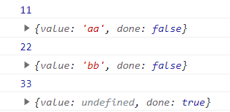

# 五、Generator

Generator（生成器）函数是 ES6 提供的一种异步编程解决方案，语法行为与传统函数完全不同。

Generator 函数有多种理解角度：

语法上，首先可以把它理解成，<strong style="color:#DD5145">Generator 函数是一个状态机，封装了多个内部状态</strong>。

执行 Generator 函数会返回一个**遍历器 (迭代器) 对象**，也就是说，Generator 函数除了状态机，还是一个遍历器对象生成函数。返回的遍历器对象，可以依次遍历 Generator 函数内部的每一个状态。

形式上，Generator 函数是一个普通函数，但是有两个特征。

- 一是，`function`关键字与函数名之间有一个星号
- 二是，函数体内部使用`yield`表达式，定义不同的内部状态（`yield`在英语里的意思就是 “产出”）。

## 基本语法

```js
function* gen() {
    console.log(11)
    yield 'aa'
    console.log(22)
    yield 'bb'
    console.log(33)
}

let g = gen()

let res1 = g.next()
console.log(res1)
let res2 = g.next()
console.log(res2)
let res3 = g.next()
console.log(res3)
```

结果：


## yield 表达式

由于 Generator 函数返回的遍历器对象，<strong style="color:#DD5145">只有调用`next`方法才会遍历下一个内部状态</strong>，所以其实提供了一种可以暂停执行的函数。`yield`表达式就是暂停标志。

遍历器对象的`next`方法的运行逻辑如下：

1. 遇到`yield`表达式，就暂停执行后面的操作，并将紧跟在`yield`后面的那个表达式的值，<strong style="color:#DD5145">作为返回的对象的`value`属性值</strong>。
2. 下一次调用`next`方法时，再继续往下执行，直到遇到下一个`yield`表达式。
3. 如果没有再遇到新的`yield`表达式，就一直运行到函数结束，直到`return`语句为止，并将`return`语句后面的表达式的值，作为返回的对象的`value`属性值。
4. 如果该函数没有`return`语句，则返回的对象的`value`属性值为`undefined`。

需要注意的是，`yield`表达式后面的表达式，只有当调用`next`方法、内部指针指向该语句时才会执行，因此等于为 JavaScript 提供了手动的 “惰性求值”（Lazy Evaluation）的语法功能。

```js
function* gen() {
    let res = yield ajax('1.json')
    conso.log('第一个请求的结果', res)
    let res2 = yield ajax('2.json', res)
    conso.log('第二个请求的结果', res)
}
// 手动版本
let g = gen()
g.next().value.then(data => {
    g.next(data).value.then(res => {
        g.next(res)
    })
})

// 自动版本
function AutoRun(gen) {
    let g = gen()
    function next(data) {
        let res = g.next(data)
        if(res.done) return
        res.value.then(function(data) {
            next(data)
        })
    }
    next()
}
AutoRun(gen)
```


`yield`表达式与`return`语句既有相似之处，也有区别，相似之处在于，都能返回紧跟在语句后面的那个表达式的值。

- 区别在于每次遇到`yield`，函数暂停执行，下一次再从该位置继续向后执行，而`return`语句不具备位置记忆的功能。
- 一个函数里面，只能执行一次（或者说一个）`return`语句，但是可以执行多次（或者说多个）`yield`表达式。
- 正常函数只能返回一个值，因为只能执行一次`return`；Generator 函数可以返回一系列的值，因为可以有任意多个`yield`。


## next 方法

`yield`表达式本身没有返回值，或者说总是返回`undefined`。

`next`方法可以带一个参数，该参数就会被当作上一个`yield`表达式的返回值。

```js
function* f() {
  for(var i = 0; true; i++) {
    var reset = yield i
    if(reset) { i = -1 }
  }
}

var g = f()

g.next() // { value: 0, done: false }
g.next() // { value: 1, done: false }
g.next(true) // { value: 0, done: false }
```


## yield* 表达式

如果在 Generator 函数内部，调用另一个 Generator 函数。需要在前者的函数体内部，自己手动完成遍历。

ES6 提供了`yield*`表达式，作为解决办法，<strong style="color:#DD5145">用来在一个 Generator 函数里面执行另一个 Generator 函数</strong>。

从语法角度看，如果`yield`表达式后面跟的是一个遍历器对象，需要在`yield`表达式后面加上星号，表明它返回的是一个遍历器对象。这被称为`yield*`表达式。

如果`yield*`后面的 <strong style="color:#DD5145">Generator 函数</strong>（没有`return`语句时），等同于在 Generator 函数内部，部署一个`for...of`循环。

```js
function* concat(iter1, iter2) {
  yield* iter1;
  yield* iter2;
}

// 等同于

function* concat(iter1, iter2) {
  for (var value of iter1) {
    yield value;
  }
  for (var value of iter2) {
    yield value;
  }
}
```

如果`yield*`后面跟着一个<strong style="color:#DD5145">数组</strong>，由于数组原生支持遍历器，因此就会遍历数组成员。

`yield`命令后面如果不加星号，返回的是整个数组，加了星号就表示返回的是数组的遍历器对象。

```js
function* generatorOne() {
  yield ['a', 'b', 'c']
}
const one = generatorOne()
one.next() // {value: Array(3), done: false}
console.log(one.next().value) // ['a', 'b', 'c']
console.log(one.next().value) // undefined

function* generatorTwo() {
  yield* ['a', 'b', 'c']
}
const two = generatorTwo()
two.next() // {value: 'a', done: false}
console.log(two.next().value) // 'a'
console.log(two.next().value) // 'b'
console.log(two.next().value) // 'c'
console.log(two.next().value) // undefined
```

实际上，任何数据结构只要有 Iterator 接口，就可以被`yield*`遍历。


## 参考

[参考文章](https://es6.ruanyifeng.com/#docs/generator)

